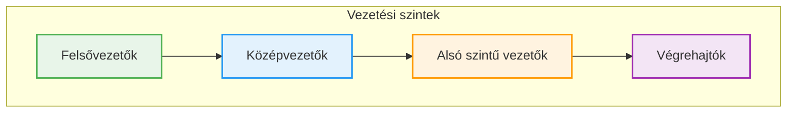
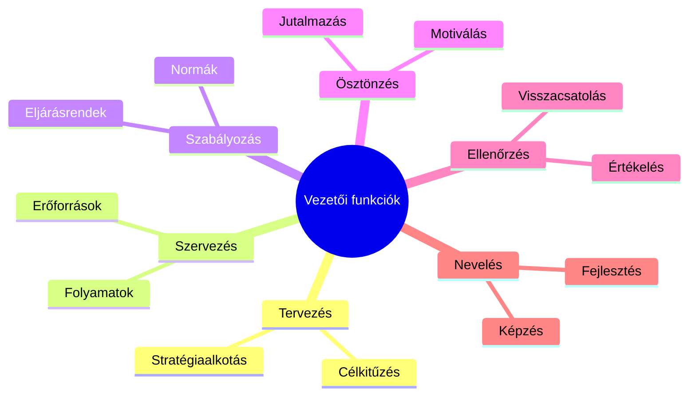
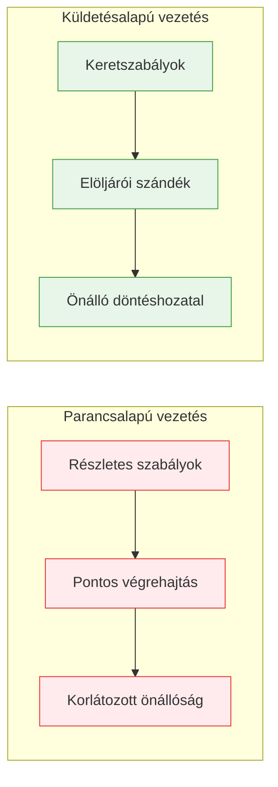
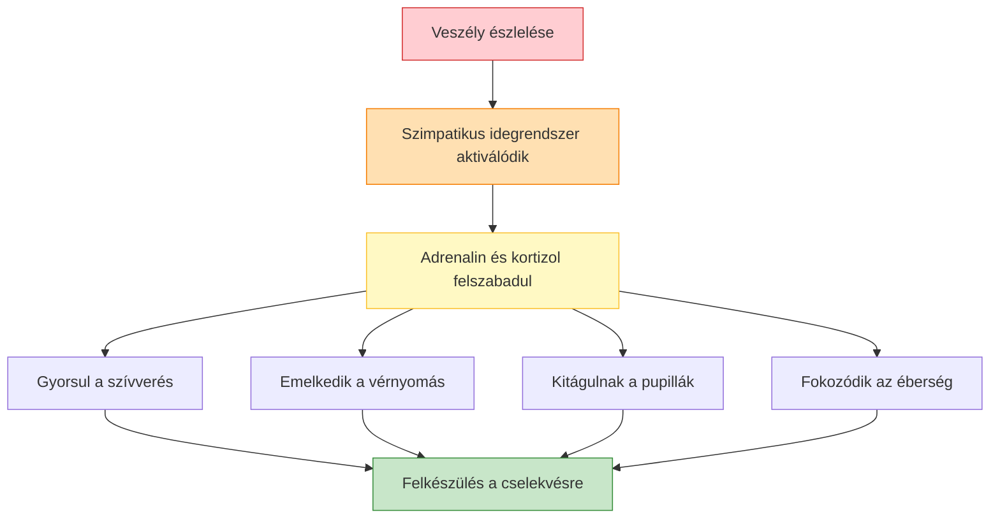
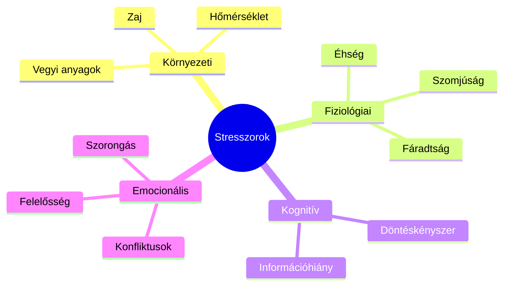
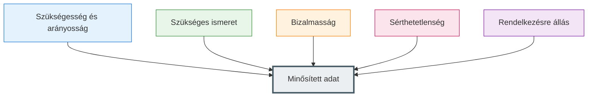
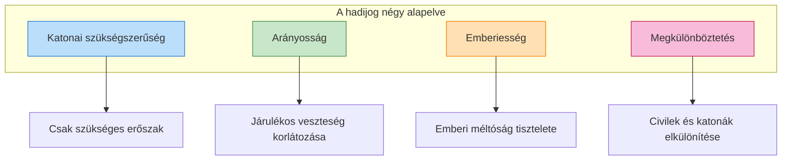
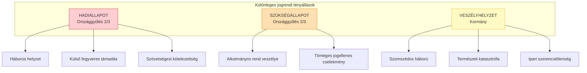
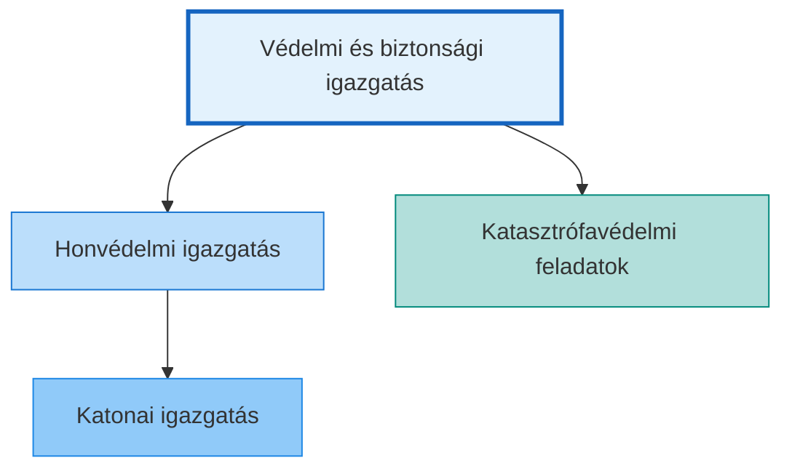

# Vezetéselmélet, Általános Ismeretek – Közérthető Kivonat

*Szerző: Pályi József | Kivonat készült: 2024*

---

## 1. Vezetéselmélet

### Mi a vezetés, és miért fontos tanulni?

Sokan úgy gondolják, hogy vezetőnek születni kell. Valóban vannak, akik már gyerekkorban is szervezik társaik játékát – de a modern kutatások bebizonyították, hogy a vezetés **tanulható és fejleszthető képesség**. A családi vállalkozásoknál is azok a cégek virágoznak, ahol az új generáció képzettebb az előzőnél.

A katonai vezetés évszázadokon át a legszervezettebb emberi tevékenység volt. A XX. századtól az üzleti világ is átvette ezeket az elveket, és folyamatosan fejlesztette tovább.

> **Definíció:** A **vezetés** az emberi tevékenységeket mozgásba hozó, tervezett és céltudatos tevékenység, amely valamilyen emberi csoportra vonatkozik. Társadalmi szerep, amelyet a munkamegosztás formál.

> **Definíció:** Az **irányítás** a felsőbb szervtől az alsóbb szintek felé ható, közvetett jellegű vezetői tevékenység, amely stratégiai célokat és általános iránymutatásokat tartalmaz.

### A vezetési szintek

Minél összetettebb egy szervezet, annál több vezetési szinttel rendelkezik:

- **Felsővezetők:** Stratégiai döntések, szervezet egészét érintő kérdések
- **Középvezetők:** Utasítások értelmezése, közvetítés a szintek között
- **Alsó szintű vezetők:** Közvetlen kapcsolat a végrehajtókkal, operatív problémák

### A vezető főbb feladatai

A vezető munkája hat fő funkcióból áll:

**Kulcsfontosságú vezetői feladatok:**

1. **Célkitűzés és stratégiaalkotás:** A vezető meghatározza a szervezet irányát
2. **Konfliktuskezelés:** Ma már nem csak üldözendő, hanem fejlődést serkentő tényező
3. **Kommunikáció:** Szavakon túl a testbeszéd, hanghordozás is üzenetet hordoz
4. **Ellenőrzés:** Folyamatos meggyőződés arról, hogy a tervek megvalósulnak
5. **Motiválás:** A munkatársak „kedvcsinálása" a feladatok elvégzéséhez
6. **Delegálás:** Feladatok átadása a megfelelő beosztottaknak

### A vezető kiválasztása

Az első világháború után Németországban, majd az USA-ban és Nagy-Britanniában fejlesztették ki az **Értékelő Központokat (Assessment Centre)**. Ez a módszer:
- Több napos intenzív kiválasztási folyamat
- Tesztek, szituációs gyakorlatok, interjúk
- A jelöltek stressz alá helyezése valós helyzetekben
- Pszichológusok és vezetők közös értékelése

> **Definíció:** A **Fejlesztési Központ (Development Centre)** a meglévő munkatársak képességeinek, fejlődési potenciáljának feltárására szolgál. Egyénre szabott képzési terveket készítenek.

### Katonai vezetés

A katonai vezetés két alapvető szemléletmódja:

> **Definíció:** A **katonai fegyelem** a jogszabályokban és az elöljárók által meghatározott követelmények teljesítését jelenti. Alapja a katona tudatos kötelességérzete és az engedelmességi készsége.

A **küldetésalapú vezetés** előnyei:
- Kevesebb irányítási szint szükséges
- Csökken a beavatkozás a magasabb szintekről
- Gyorsabb döntéshozatal
- Nagyobb kreativitás és önállóság

---

## 2. Katonapszichológia

### A stressz megértése

A stressz mindennapi életünk része. Dr. Selye János, a stresszkutatás atyja megkülönböztette a „jó" és „rossz" stresszt:

> **Definíció:** Az **eustressz** az önmegvalósítás stressze – olyan ingerek, amelyek kihívásokra, fejlődésre sarkallnak. Hosszú távon építő jellegű.

> **Definíció:** A **distressz** a negatív hatású stressz – amikor nincs lehetőség a megküzdésre vagy új képességek megszerzésére. Mentális és fizikai problémákhoz vezethet.

### A stresszválasz mechanizmusa

Veszélyhelyzetben a szervezet „harcolj vagy menekülj" reakciót aktivál:

### Selye-féle általános adaptációs szindróma (GAS)

A stresszre adott válasz három szakaszból áll:

| Szakasz | Jellemzők | Katonai következmények |
|---------|-----------|------------------------|
| **1. Riasztás** | Szervezet felkészül a harcra vagy menekülésre | Fokozott éberség, gyors reakció |
| **2. Ellenállás** | Alkalmazkodás, tartalékok felhasználása | Állandó készenlét, alvászavarok |
| **3. Kimerülés** | Tartalékok elfogynak | Betegségek, teljesítménycsökkenés |

### Stresszorok típusai

> **Definíció:** A **poszttraumás stressz szindróma (PTSD)** váratlan tragédia, súlyos stresszhelyzet után kialakuló állapot. Jellemzői: villanófény-emlékek, szorongás, rémálmok, érzelmi ingadozás.

### Konfliktuskezelés

A modern felfogás szerint a konfliktus **nem feltétlenül negatív** – segíthet új stratégiákat kidolgozni és fejlődésre sarkall.

> **Definíció:** A **konfliktus** feszültséghelyzet, amelyben a felek erőfeszítéseket tesznek látszólag összeegyeztethetetlen terveik megvalósítására.

**Konfliktus kedvező következményei:**
- Problémák felszínre kerülése
- Kreativitás élénkülése
- Helyzet újraértékelése

**Konfliktus kedvezőtlen következményei:**
- Stressz, feszültség
- Figyelem elterelődése a feladatról
- Fokozott agresszió

### Csoportdinamika

A csoportok fejlődése jellegzetes fázisokon megy keresztül:

**A csoporthatékonyság öt feltétele (John Jones):**

1. **Kölcsönös bizalom** – mindenki szabadon kifejezheti véleményét
2. **Kölcsönös támogatás** – törődés egymás fejlődésével
3. **Nyílt kommunikáció** – őszinte beszéd és előítélet-mentes figyelés
4. **Konfliktusok elfogadása** – természetes és fejlődést hozó jelenség
5. **Egyéniség tisztelete** – nem kell szükségtelen konformitás

---

## 3. Ügyviteli ismeretek

### Alapfogalmak

> **Definíció:** Az **irat** minden olyan szöveg, számadatsor, térkép, tervrajz, amely valamely szerv működésével kapcsolatban bármilyen eszközzel és eljárással keletkezett.

> **Definíció:** Az **iktatás** az irat iktatószámmal történő nyilvántartásba vétele a beérkezéssel egyidőben vagy azt követően.

> **Definíció:** Az **ügyirat** egy ügyben keletkezett valamennyi irat együttese.

### Az irat kötelező alaki kellékei

| Elem | Leírás |
|------|--------|
| Fejrész | Szervezet teljes megnevezése |
| Példány sorszáma | Jobb felső szél, első sor |
| Iktatószám | Egyedi azonosító |
| Tárgy | Max. 500 karakter |
| Keltezés | Hely, időpont |
| Aláírás | Kiadmányozó neve |
| Záradék | Készült, Példány, Ügyintéző, Kapják |

### Az iratok továbbításának szabályai

- Kiadmányozott iratokat a címzetthez kell továbbítani
- A borítékolásért és címzésért az ügyintéző felelős
- MH-n kívülre csak ajánlott küldeményként küldhető
- E-mailek csak nyílt adatokat tartalmazhatnak

---

## 4. Minősített adatok kezelése

### A minősített adat fogalma

> **Definíció:** A **nemzeti minősített adat** olyan adat, amelyről a minősítő megállapította, hogy nyilvánosságra hozatala közvetlenül sérti vagy veszélyezteti a minősítéssel védhető közérdeket.

### A minősítés alapelvei

### Minősítési szintek

| Szint | Kár mértéke | Érvényesség |
|-------|-------------|-------------|
| **Szigorúan titkos!** | Rendkívül súlyos | Max. 30 év |
| **Titkos!** | Súlyos | Max. 30 év |
| **Bizalmas!** | Közepes | Max. 20 év |
| **Korlátozott terjesztésű!** | Hátrányos | Max. 10 év |

### Személyi biztonsági feltételek

A minősített adat kezeléséhez szükséges:
1. Nemzetbiztonsági ellenőrzés (5 év)
2. Személyi biztonsági tanúsítvány (5 év)
3. Titoktartási nyilatkozat
4. Információbiztonsági felkészítés

### Fizikai biztonsági területek

- **I. Osztályú Biztonsági Terület** – legmagasabb védelem
- **II. Osztályú Biztonsági Terület** – közepes védelem
- **Adminisztratív Zóna** – alapszintű védelem

---

## 5. Hadijog

### Mi a hadijog?

A hadijog a fegyveres összeütközések során alkalmazandó szabályok összessége. Célja, hogy a háború borzalmait csökkentse, és védje azokat, akik már nem vesznek részt a harcban.

### Alapelvek

### Személyek a háborúban

| Kategória | Státusz | Védelem |
|-----------|---------|---------|
| **Harcosok (kombattánsok)** | Fegyveres erők tagjai | Hadifogolystátusz, ha elfogják |
| **Polgári lakosság** | Nem harcolók | Teljes védelem támadás ellen |
| **Egészségügyi személyzet** | Védett | Soha nem támadható |
| **Hadifoglyok** | Elfogott harcosok | Emberséges bánásmód |
| **Zsoldosok** | Sem harcos, sem fogoly | Nincs védelem |

### Védett objektumok

A következő létesítmények nem támadhatók:
- Kórházak
- Iskolák
- Kulturális javak
- Kegyhelyek
- Civil lakóhelyek

### Parancsnoki felelősség

A parancsnokok felelősek:
- A jogsértések megelőzéséért
- A beosztottak felkészítéséért
- A jogsértések jelentéséért
- Az elkövetők felelősségre vonásáért

> **Fontos:** Ha a parancsnok tudott vagy tudhatott volna a jogsértésről, és nem tett ellene, felmerül a **parancsnoki mulasztás** büntetőjogi következménye.

---

## 6. Különleges jogrend

### Fogalma és célja

A különleges jogrend olyan jogi keretrendszer, amely az állami működés általános szabályaitól eltérő időszakok kezelését biztosítja rendkívüli felhatalmazással.

> **Definíció:** A **különleges jogrend** az alkotmányosan feljogosított döntéshozó által kivételesnek minősített biztonsági helyzet kezelése érdekében, ideiglenesen hatályos rendkívüli felhatalmazás.

### A három különleges jogrendi tényállás

### Garanciális szabályok

- Az Alkotmánybíróság működése nem korlátozható
- Az Országgyűlés a Kormány működését felügyeli
- Az alapvető jogok sérthetetlenek
- A különleges jogrend időtartama korlátozott

---

## 7. Védelmi igazgatás

### A rendszer felépítése

A védelmi és biztonsági igazgatás az állam védelmi és biztonsági feladataival összefüggő végrehajtó tevékenység. A 2021-es törvényi reform átfogó, összehangolt rendszert hozott létre.

> **Definíció:** A **honvédelmi igazgatás** a honvédelmi jellegű kihívásokra való felkészülésre és azok kezelésére fókuszáló feladat- és szervezetrendszer.

> **Definíció:** A **katonai igazgatás** a haderő számára a személyi és anyagi erőforrások mozgósítását jelenti – a hadkötelezettség, honvédelmi munkakötelezettség megszervezését.

### Szervezeti felépítés

| Szint | Szerv | Feladat |
|-------|-------|---------|
| Központi | Védelmi Igazgatási Hivatal (VIH) | Szakmai koordináció, ellenőrzés |
| Területi | Területi Védelmi Bizottságok | Vármegyei feladatok |
| Helyi | Helyi Védelmi Bizottságok | Járási feladatok |
| Települési | Polgármesterek | Települési feladatok |

### Az irányítás szereplői

- **Országgyűlés:** Különleges jogrend kihirdetése
- **Köztársasági elnök:** Főparancsnok
- **Kormány:** Operatív irányítás
- **Miniszterek:** Ágazati feladatok

---

## Összefoglaló táblázat

| Témakör | Kulcsfogalmak |
|---------|---------------|
| **Vezetéselmélet** | Vezetési szintek, delegálás, konfliktuskezelés, katonai vezetés |
| **Katonapszichológia** | Eustressz/distressz, GAS, PTSD, csoportdinamika |
| **Ügyvitel** | Iktatás, irat, ügyirat, kiadmányozás |
| **Minősített adat** | Minősítési szintek, személyi biztonsági feltételek |
| **Hadijog** | Alapelvek, kombattánsok, védett személyek és objektumok |
| **Különleges jogrend** | Hadiállapot, szükségállapot, veszélyhelyzet |
| **Védelmi igazgatás** | VIH, területi és helyi bizottságok |

---

*Ez a kivonat a „Vezetéselmélet, Általános Ismeretek" című tananyag közérthető összefoglalása.*
