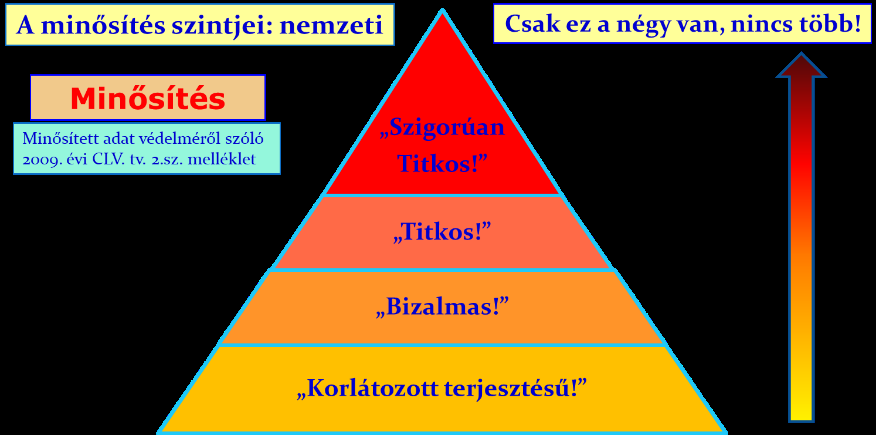

# 1 VEZETÉSELMÉLET, ÁLTALÁNOS ISMERETEK

## 1.1 VEZETÉSELMÉLET

### 1.1.1 Bevezetés

Számosan úgy gondolják, hogy a vezetés, az valami ösztönös, mintegy „veleszületett" dolog. Részben talán igazuk is van, hiszen már az óvodai nagycsoportban van olyan gyerek, aki mintegy „szervezi" a többiek játékát, homokvár-építését és lerombolását, elmondja az általa meghatározott játékszabályokat. Mások úgy vélekednek, hogy ha valakit kiválasztanak vezetőnek, adnak neki egy ilyen megbízást, akkor majd ő szépen beletanul magától, mivel a megbízatás felhatalmazásával élve egészen biztosan meglesz majd az a tekintélye, hogy elfogadják a munkatársai, amit mond. Az ember hajlamos arra, hogy a parancsuralmi rendszerekben és a fegyveres testületekben a „parancs / értettem" típusú kommunikáció mentén zajlanak az események és történések, és az évszázados vezetői tapasztalat éppen elegendő muníciót ad a mindennapok vezetői feladatainak teljesítéséhez.

A katonai vezetés, mint olyan, évszázadokon át meghatározó volt: ez volt a legszervezettebb tevékenység. A csatateret és az azon adott lehetőségeket megragadó hadvezérek emlékezete fennmaradt a történelemben. A furfang, a lelemény az érem egyik oldalán – a másikon pedig a tudatos felkészülésé. Egy-egy kiváló tanító (például Arisztotelész Nagy Sándor mellett) is lehet inspiráló, máskor maga az uralkodó vezér hoz létre maradandónak bizonyuló kézikönyvet a (katonai) vezetésről (Szun-ce).

Részben a katonai vezetés elveit és gyakorlatait veszik át az ipari forradalmat követő évszázadokban a mind bonyolultabbá váló, egyre nagyobb, előbb imperialista, majd internacionális vállalatok, vállalkozás-óriások. A XX. századra azonban már ez sem elegendő az ipari fejlődéshez: feltétlenül szükségessé válik az eddigi gyakorlatok leírása és megújítása mellett (Weber bürokrácia-elmélete; Taylor, Fayol) teljesen új vezetéselméleti megközelítésekre. Így jutunk el egészen az ún. kontingencia-elméletekig, amelyek a szervezeti leírásokat, mint építőköveket felhasználva, egy-egy szervezet saját valóságában létező jellegzetességeit írják le, próbálják értelmezni a maguk egyedi hasznosságában.

Elmélet és gyakorlat az üzleti tudományok ezen ágában kéz a kézben jár: az elméletek hatással vannak a gyakorlatra, és egy újabb gyakorlat leírása gazdagítja, gyarapítja az elméleti tudást. Magyarországon is létezik olyan, több ezer munkavállalót foglalkoztató gyár (Esztergomban, és nem a Suzuki), amelynek szervezetfejlesztése vezetéselméletből tanult és felkészült felsővezetők munkájának eredménye.

A vezetés, mint olyan, aligha létezhet azon szervezet nélkül, amelyet a vezetőnek irányítania és szerveznie kell. Éppen ezért a vezetéselméleti szakkönyvek jelentős hányada először a szervezettel, a szervezet-típusokkal foglalkozik, és csak azután tér rá azokra a személyekre, akik azt vezetik. Ebben a tananyagrészben eltekintünk a szervezettől (Magyar Honvédség), és ahol csak lehetséges, megpróbálunk a vezető feladataira koncentrálni. Bízunk abban, hogy aki felismeri, hogy a vezetés tanulható és fejleszthető, más szakkönyveket is kezébe vesz majd, továbbá beiratkozik olyan képzésekre, amelyek az embert felvértezhetik vezetéselméleti tudással, hogy jobb ember – és jobb vezető válhasson belőle.

### 1.1.2 A vezetési szintek

Minél bonyolultabb egy szervezet, annál több vezetési szinttel jellemezhető. Egy frissen alapított, induló szervezetnél elegendő lehet az egyszemélyi vezetés, azonban a fejlődés, gyarapodás kiköveteli magának, hogy a vezető másokat is bevonjon a tevékenységbe, később osszon meg vezetői feladatokat is. Ha az adott szervezet újabb és újabb funkciót gyűjt be (pl. jogszabályi változás révén), vagy vállalkozásként egyre több és több megrendelésre (vevőre) tesz szert, gyarapszik termékeinek és szolgáltatásainak köre, az új vezetők megjelenhetnek funkcionális szinten (pl. pénzügy, beszerzés, marketing, belső továbbképzés, személyügy stb. területeken) – ám a szervezet úgy is kialakíthatja önmagát, hogy ún. divíziókba szerveződik, és akkor ezen forma vezetői mintegy egymással versenyezve kerülnek a közös igazgatóság alá. Kialakul a vezetés alapjában véve hármas tagolódása: felsővezetők, középvezetők, alsó szintű vezetők. Ez a hármas tagozódás együtt járhat akár azzal is, hogy a vezetői szintek száma négy-nyolc – ebben az esetben szintén lesz egy olyan felsővezetői réteg, akiknek a körében eldőlnek a fontos dolgok, megszületnek a szervezet egészét érintő döntések. Lesznek alárendelt, középszintű vezetői rétegek, ahol értelmezik az utasításokat, és átfordítják a következő vezetési szint „nyelvére". Az alsó szint(ek) vannak a legközelebb a termeléshez (feladat-végrehajtáshoz).

### 1.1.3 A vezetők főbb feladatai, tevékenységei

Vezetni tehát lehet „születni", azonban a XXI. század gazdasági életében egyre nagyobb szerepe van a vezetőképzésnek. A professzionálisan képzett vezető felülemelkedik az ösztönös vezetőn. A családi vállalkozásoknál is időről időre generációváltásnak kell végbe mennie. Azok a családi cégek élik túl és virágoznak fel a váltást követően, ahol a következő vezetői nemzedék többet tud és sokkal képzettebb a szüleinél. Ezt pedig részben a képletes és tényleges iskolapadban, az elméleti képzések tapasztalatainak megfogadásával lehet elérni (kétségtelen ugyanakkor ebben a szegmensben a családi szocializáció hatása és az, hogy a gyerek minden nap láthatja a saját üzem munkavállalóit tevékenység közben – ráadásul minden szinten az alkalmi bedolgozótól kezdve a vezetőségi értekezletekig).

A vezető vezetési funkciói a tervezés, szervezés, szabályozás, ösztönzés, ellenőrzés, minősítés – és van, aki ide sorolja még a nevelési funkciót is.

(forrás: www.vezetesi-folyamat.hu/a-vezetes-folyatama-es-modszerei/)

Vezetői feladat a cél kitűzése és annak a stratégiának a megalkotása, amely a cél elérését a jövőben lehetővé teszi. Mivel a stratégia alapján hozott döntések változó külső és belső környezetben valósulnak meg, időről időre felül kell vizsgálni, módosítani, javítani kell a stratégián. Már az induláskor, alapításkor jó lenne, ha a szervezet rendelkezne misszióval és vízióval. Előbbit általában egyetlen szókapcsolatba, esetleg mondatba sűrítik bele, amolyan jelszó-szerűen működnek, pl. „Szolgálunk és védünk", a „Haza szolgálatában". A vízió pedig azt fogalmazza meg egy vagy több mondatban, rövid, legfeljebb egy bekezdésnyi terjedelemben, hogy a szervezet honnan hova szeretne eljutni.

Kérdésként szokott felmerülni, hogy a szervezethez később csatlakozó egyéneknek mennyire kell azonosulniuk a szervezeti célokkal. Erről megoszlanak a vélemények. Az általános tapasztalat az, hogy természetesen kívánatos, hogy az egyének személyes céljai essenek egybe a szervezeti célokkal, azonban ez azért a vártnál sokkal ritkábban fordul elő (csak egyetlen példa: az egyének elsősorban fizetésért, jövedelemért mennek dolgozni – a szervezetnek pedig sokszor elemi, fennmaradási érdeke, hogy kordában tartsa a bérköltségeket).

**Szervezettervezés, folyamatszervezés, munkaszervezés és feladattervezés.** Amikor a munkavállalók és vezetők benne vannak egy folyamatban, az általában úgy néz ki, hogy jönnek a feladatok, amiket egy másik szervezeti egység bocsátott ki, és rendszerint egy harmadiknak kell majd továbbadni. Vagyis az első szervezeti egység kibocsátása (output-ja) lesz a másodiknak az input-ja, hogy aztán feldolgozást követően output legyen, ami a harmadiknak lesz az input-ja. Közben pedig információkat kell továbbítani számos további szervezeti egység felé, mivel nyomon követhetőnek és ellenőrizhetőnek kell lenni minden fázisnak, amely a feladatok teljesítése közben történik. A teljes szervezet megtervezése, ebben az egyes értékteremtő folyamatok végigvezetése és megszervezése igen fontos vezetői feladat a felső- és felső-közép vezetői rétegek számára. Egyidejűleg kell tervezni azt is, milyen gépeket, eszközöket kell beállítani mely helységekbe; hány főt és milyen képzettséggel rendelkező munkaerőt kell odacsoportosítani, és mikor induljon a folyamat. Tervezni kell a felelősöket és felelősségi köreiket, a hiba jelzésének mikéntjét és a hiba kijavítását. Tervezni kell az időt, ami alatt az egyes fázisok végbe mennek. Átszervezés esetén számolni kell a munkavállalói ellenállással, amelyhez tréningeket, belső továbbképzéseket szoktak rendelni az új kihívások részletes és minden igényt kielégítő elmagyarázására, az elégedetlenség és engedetlenség megelőzésére. A szervezet munkájának beindítását tehát a globális egésztől az összes munkavállaló munkaköri leírásáig bezárólag, aprólékos részletességgel dolgozzák ki nagyobb szervezeteknél. (E sorok írója látott ilyet folyamatában: a cég az Egyesült Államokból jött, és a kezdetben öt fős vezetősége egy kisváros melletti legelőnél állva kezdte a tervezést, ahol két év múlva már kétezer fővel folyt a nagyon is tudatosan felépített termelés.)

A vezetői szintek folyamatosan problémákat oldanak meg. Szerencsés, ha a szervezetnél olyan vezetők vannak, akik el tudják különíteni a problémákat az egyes vezetői szintek között. Hiba, ha felsővezető a napi rutinhoz tartozó feladattal foglalkozik: az operatív problémák megoldása alsóvezetői szinten optimális. A felsővezetői szintnek pl. az új stratégiai partnerségekkel, vagy az újonnan megjelenő kihívásokkal és lehetőségekkel célszerű foglalkoznia. Vezetői tapasztalat birtokában lehet jobban különbséget tenni az egyes feladatok súlya (fontossági sorrend), továbbá a megfelelő döntés meghozatalának időbeli igénye között; hogy mely ügyek azok, amikről lehet később határozni, és mely problémákra kell azonnali megoldást találni. Gyakori hiba, hogy a vezetők csak a tüneteket látják, a „felszínt simogatják", és elmulasztják a gyökereket, a probléma okait feltárni.

**Konfliktus-kezelés.** Egészen az 1950-es évekig a szervezeten belüli konfliktust, mint feltétlenül üldözendőt írták le, és a „jó vezető" tulajdonságai közé sorolták, ha valaki képes volt gyorsan és hatékonyan kezelni a konfliktusokat. Ez a szemlélet a viszonylag egyszerű szervezetek korában ténylegesen reális megközelítés volt. Mindenki tudta a saját feladatát, elvégezte azt, és megkapta érte a javadalmazását. A munkavégzéshez már kellett iskoláztatás (tankötelezettség, vagyis kötelező népoktatás a 19. század utolsó harmadától), de a túlnyomó többségnek (95-97%-nak) elegendőek voltak az alapok. A második világháborús újjáépítés után azonban történik valami: leegyszerűsítve, a fejlett ipari országok elkezdenek jóléti társadalmakat kialakítani, amellyel együtt jár a magasabb (sokszor felsőfokú) végzettséget igénylő iparágak térhódítása, a szolgáltató szektor megerősödése – és másképpen kezdenek tekinteni a munkahelyi konfliktusokra: az új ötletek felszínre hozatalának, a kreativitás, az innováció kibontakozásának eszközét látják abban, hogy egyesek hangot adva saját újító elképzeléseiknek, kiállnak és megküzdenek véleményükért, fejlesztésükért. Az 1980-as években érkezik az „emberi játszma" elmélete (Erich Berne), és a konfliktusok világa kétfelé válik: egyfelől az építő kimenetelű, bátorítandó és támogatandó konfliktusoké, és a romboló, káros, leküzdendő „játszmázásra" (amelynek felsővezetői része lehet akár tudatosan megélt, felvállalt, tréningek és coaching-ok során begyakorolt hatalommegszerző és -megtartó taktika, technika is). A konfliktusok tehát akár még változási folyamatokat is elindíthatnak.

**Vezetői kommunikáció.** A vezető sokkal nagyobb hatással van munkatársaira, mint amennyit nekik szavakkal elmond. Gesztikulációjával, mimikájával, hanghordozásával, pillantásával, azzal, amit kiemel, és azzal, amiről nem beszél – folyamatosan „talányt" jelent munkatársai számára. Közben ő is kap olyan verbális, vagy inkább nonverbális megnyilvánulásokat, amelyeket érdemesebb elengedni, más esetekben pedig határozottan kell odalépnie. Az alsó- és középszintű vezetőkre különösen jellemző, hogy ugyanazt a problémát párhuzamosan többféleképpen kell összefüggésbe állítania: úgy érezheti, mintha nem ugyanazon a nyelven beszélnének a kétkezi alkalmazottak és a magasabb szinten levő vezetők. Ebben a környezetben kell eligazodnia, tudni, mikor kinek mit és mennyit mondhat el, hogy azt minden illetékes értse, de ne terhelje őket olyannal, amivel csak „kombinálni" lehet, a feladatokat, munkafolyamatokat aligha viszi előbbre.

Elidegeníthetetlen vezetői feladat az ellenőrzés. Ez alatt azt a tervszerű, rendszeres tevékenységet értjük, melynek során a vezető folyamatosan meggyőződik arról, hogy a folyamatok a terveknek megfelelően mennek-e végbe. A vezetői értékelést általában az ellenőrzéssel együtt szokták említeni. Az értékelés nem feltétlenül minősítés: a dolgozóknak folyamatosan szükségük van visszajelzésre, hogy vajon jól végzik-e feladataikat, elégedettek-e a munkájukkal. Ez is emberi tényező: van, akinek naponta többször van szüksége azokra a kis félmosolyokra vagy néhány szavas (értékelő) biztatásokra, amelyek a folyamatos munkavégzését elősegítik, másoknak ritkábban is elég a visszajelzés a komolyabb önismeretük, önbizalmuk, önmagukba vetett hitük okán. Újabban elkülönítik a vezetői kontroll fogalmat, amely nem annyira ellenőrzést jelent, mint inkább azt, hogy a vezető ura a helyzetének, valós és tényleges döntési pozícióban van. Így a vezetői kontroll valamiféle döntési szabadság vagy döntési képesség. A kontrolling sajátos kommunikációval jár együtt, melynek során az utasítások rovására túlsúlyba kerülnek a kérdések, kérések, tanácsok.

Lényeges vezetői feladat a munkatársak folyamatos motiválása – egyfajta „kedvcsinálás" a munkafeladatok folyamatos és megfelelő színvonalú elvégzésére. A kedvvel végzett munka sokkal hatékonyabb, mintha még arra is jelentős energiákat kellene fordítani, hogy a beosztottak befejezzék a kávé- és cigarettaszünetet. Nyilvánvalóan az a szerencsésebb, ha a vezető erős belső motivációval rendelkező, elhivatott munkatársakat tud maga köré gyűjteni – ezzel szemben inkább a folyamatos noszogatás, győzködés, apróbb-nagyobb engedmények („mini alkuk"), távlati lehetőségek szem előtt tartásának és más tényezők kombinációjából gazdálkodhatnak a vezetők.

A motivációs bázisba tartoznak a képzési lehetőségek. Az önfejlesztés szükséglete valamilyen szinten a legtöbb embernél megvan – ezt tudja kihasználni a vezető a fejlesztésre. A legtöbb szervezetnek elemi érdeke, hogy munkatársai több munkafolyamatban is részt tudjanak venni. Így, amikor a munkafolyamatok ésszerűsítésével együtt járó állománycsökkentésre sor kerül, a „többcélú" munkatársakat könnyebb átirányítani más területre. Vagy, amikor toborozni kellene, annak költségei csökkenthetők a már meglevő kompetens munkatársak új feladatra történő kijelölésével.

A vezetőnek számolnia kell azzal, hogy gyakran kikérik a véleményét a szakmai mellett magán- vagy személyes ügyekben is. A vezetőtől, mint embertől függ, miképpen kezeli ezeket a megkereséseket. Azok a vezetők szoktak nagyobb elismertségnek örvendeni, akik szívesen állnak rendelkezésre tanácsadással mások számára, kivéve, ha valaki kéretlenül, tolakodva oszt tanácsot.

Vezetői feladat a különböző rendeltetésű csoportok létrehozása és működtetése (vezetése), majd a feladat végeztével a lezárás, a csoport megszüntetése, felszámolása. Adott munkahelyen egy-egy dolgozó akár több csoportba is tartozhat a feladat jellegének, időtartamának, az igényelt szakmai hozzáértéseknek függvényében.

A főbb vezetői feladatok közé tartozik a döntési képesség, és a felelősségvállalás a döntésekért (vagy éppen azok elmaradásáért). Nyilvánvalóan, mindegyik vezetési szinten levő csak a saját illetékességi körébe tartozó döntések meghozataláért felelős.

A vezetők idejük nagy részét emberek, az emberekkel való foglalkozás tölti ki. Ez megterhelő még annak is, aki örömmel veti bele magát a munkájába. Nagyon sok emberi tényezővel, indulat-áttétekkel él együtt (ezek alanya és tárgya is lehet egyidejűleg): a munkatársai érzelmi tölteteket helyeznek rá, és persze általában ő sem közömbös. Sőt, gyakran érzelmileg is hatással van a beosztottaira (pl. félelem, harag, düh is jelen szokott lenni).

Számos további feladatot most nem említünk, az viszont lényeges, hogy a vezető hogyan tud eleget tenni szerteágazó feladatainak úgy, hogy közben azért ő is gyakran a saját karrierjét is egyengetni, a további előrejutás lehetőségeit és esélyeit kutatja. Olyan ún. „soft" tulajdonságok segíthetik a munkáját, mint például az élet- és munkatapasztalat, az emberismeret, saját maga önismerete, reagáló képessége, a tisztelet, amellyel mások irányában van és amellyel őt is megtisztelik; a bizalom, amelyet mások irányából kap (és amiért feltehetően megdolgozott). Valószínűleg tudja kezelni a nyomás alatti munkavégzést és a stresszt. Feltehetően visszatartja munkatársai elől azokat a különféle forrásokból származó szóbeszédeket, amelyek az ő egzisztenciájukat, munkavégzésüket érinthetik, és amiatt teljesen felesleges stresszt okoznának nekik. Pletykákra csak akkor kérdez rá, ha azzal valamilyen célja van, ha a (vezetői) munkájához szükséges.

Az időgazdálkodás általában kényes pont a vezetőknél. A „meg kell tanulnia beosztani az idejét" fogalmába beletartozik a feladatok fontossága közötti különbségtétel képessége (amely fejleszthető), azonban itt releváns az a taktika is, amikor valaki a könnyen-gyorsan-egyszerűen megoldható feladatokkal kezd, és csak utána tér át az időigényesekre, mintha valaki fordított sorrendben, esetleg „vegyesen" jár el. Meg lehet tanulni „nem"-et mondani, beszélgetést, értekezletet rövidre zárni, napirendet tervezni, és a munkavégzés hatékonyságát érdemben nem befolyásoló ügyeket elengedni. (Felesleges minden kis apró-cseprő szabályszegést ismétlődően szóvá tenni a munkatársaknak.)

A titok további kulcsa a munkamegosztásban és a feladatok delegálásában rejlik. A kisebb szervezetekben, szervezeti egységekben gyakran előforduló hiba, hogy az egyszemélyi vezető nem meri a kezéből kiadni a kezdeményezést, és még ha vannak is vezetőtársai, képtelen feladatokat delegálni nekik.

Mivel csaknem valamennyi vezetőnek vannak beosztottai, vannak mellérendelt más szervezeti részegységek vezetői, és vannak olyan felsőbb irányítók, akiktől az utasításokat kapja, azt mondhatjuk, hogy a vezető sok emberrel dolgozik együtt, akikkel más és más nyelvet, gesztusokat, mimikát – összefoglalóan: érintkezési stílust – kell használnia. Ahhoz, hogy el tudjon igazodni az egyre bonyolultabb világban annak emberi viszonyai között, szüksége van az érzelmi intelligencia átlagosnál magasabb fokára. Ennek birtokában a világ és az emberek megértésén túlmenően várhatóan jobb lesz az önérdek-érvényesítő képessége, egyéni sikeressége is.

### 1.1.4 A vezető kiválasztása és fejlesztése

Korábban úgy tartották, hogy ha sikerülne beazonosítani a „jó vezető" ismérveit, tulajdonságait, akkor a vezetőkiválasztási folyamat során elegendő lenne ezeket a vonásokat megtalálni a jelentkezőkben. A sikeres vezetők személyiségjegyeinek feltárása, ezen kutatások összegzése során azonban kiderült, hogy az amúgy megváltoztathatatlan vagy nehezen módosítható tulajdonságoknak valójában semmiféle jelentősége nincs a vezetői munka során. Ennél sokkal fontosabb, hogy a vezető hogyan viselkedik.

A vezetők kiválasztására az első világháborút követően Németország haderejénél, majd a második világháború után az Amerikai Egyesült Államokban és Nagy-Britanniában hoznak létre ún. Értékelő Központokat (Assessment Centre – AC). Tervezésében és lebonyolításában, kivitelezésében számos speciálisan képzett szakember működik közre. Vannak köztük pszichológusok és katonai vezetők is. Tesztek, szituációk, prezentációk és interjúk sora követik egymást. Több napon át egy kitűnően felépített, rendkívül tudatosan és precízen tervezett, intenzív kiválasztási folyamat valósul meg. A jelölteket folyamatosan stressz alá helyezik, beleértve a valósnak tűnő háborús szituációk szimulálását is. Közben folyamatosan figyelik őket, hogy amikor tétre megy, hogyan döntenek.

A módszer sikeresnek bizonyult. Előbb közigazgatási szakemberek kiválasztására használták, majd a nagyvállalatok egy része is átvette, és mind a mai napig alkalmazza a megfelelő helyre a megfelelő munkatársat elv érvényesítésére. Manapság sok esetben erre szakosodott (külső) tanácsadó céget vesznek igénybe kvalifikáltabb munkatársak kiválasztásának segítésére. (Ekkor derüljön ki az alkalmasság, és ne a próbaidő alatt.) Vállalati környezetben a kiválasztáshoz szükséges feladatok időmennyisége a pozícióhoz igazítottan tart rövidebb vagy hosszabb ideig.

Később, már a munka során egy másik eszköz segítheti a munkatársak fejlesztését, ez a Fejlesztési Központ (Development Center – DC). Itt már nem a kiválasztáson van a hangsúly, hanem a meglevő munkatársak képességeinek, fejlődési potenciáljának feltárásán. A DC keretében mérik fel a képezhetőség lehetőségeit és korlátait, próbálják passzítani az egyéni elképzeléseket, igényeket, ambíciókat a szervezet érdekeinek megfelelő területekkel. Egyénre szabott képzési terveket készítenek, amelyeket összhangba hoznak az előmeneteli várakozásokkal. A DC esetében más a tét: nem a pozíció megszerzése van a középpontban, hanem az egyéni fejlesztés. Így a keletkező riportok általában részletes leírást tartalmaznak a kiválasztottról, amelyet a résztvevő is megkap. A végső jelentés általában fejlesztési tervet (javaslatot) is tartalmaz. A fejlesztési folyamat végén mérik az elért fejlődés mértékét. A DC igen hasznos belső munkatárs magasabb pozícióba történő előléptetése előtt. Alkalmas ugyanakkor arra is, hogy a szervezet információkat szerezzen munkatársainak viselkedéséről, elkötelezettségéről, munkahelyi motivációiról.

### 1.1.5 A vezető személye, a „jó vezető" mítosza

Léteznek bizonyos „listák" a „jó vezetők" jellemzésére. Ezekkel csínján kell bánni, mert a legtöbb légből kapott, íróasztal mellett elgondolt, nincs tapasztalati háttere. Azt mégis el lehet mondani, miben tudja magát fejleszteni a vezető, hogy hallgassanak rá a munkatársai. Talán a legfontosabb a megfelelő kommunikációs stílus, illetve a szituációnak megfelelő kommunikáció. Van, amikor emelt hangon kell utasítani, és van, amikor a kérés a hatékonyabb. Szerencsés, ha van a vezető mögött bizonyos élettapasztalat – vagy ha ez még hiányzik, nyitottság, fogékonyság a környezeti hatásokra, és megfelelő adaptálódó (alkalmazkodó) képesség. A munkatapasztalat hiányát ideig-óráig kipótolhatja a képzettségben, tanultságban rejlő többlet. Nem szégyen kérdezni. Az emberekkel való bánásmód is szinte „művészet": lehetetlen az összes, nyílt és rejtett elvárásnak megfelelni – és nem is kell, ha az a munka rovására menne. Hogyan lehet egyidejűleg empatikusnak is lenni, és következetesnek? Ha a vezető szeme előtt vannak a szervezet stratégiai céljai, és a tevékenységeket ezek rendszerében helyezi el, nagyobb az esély tartani az irányt. Számos vezetőt segít át a nehéz helyzeteken a pozitív hozzáállása és életszemlélete – mások éppen ellenkezőleg: borúlátásukkal, pesszimizmusukkal készülnek fel a krízisekre.

A vezető minden nap problémákkal, megoldandó feladatokkal dolgozik, ami elég nagy rugalmasságot igényel. Hogy rugalmas tudjon lenni, szüksége van arra is, hogy változatokban, „ha…, akkor…" kapcsolatokban, azaz alternatívák birtokában legyen képes tervezni. Továbbá a hatékony problémamegoldó képesség azt jelenti, hogy képes különbséget tenni fontos és kevésbé fontos között, és van annyi bizalma a munkatársaiban, hogy delegálni tudjon nekik a feladatokból.

A vezető óhatatlanul folyamatosan tanul, akár észreveszi, akár negligálja. Ez a tanulás ritkán iskolarendszerű képzés, de lehet az is. Egy-egy tájékoztató, bemutató, előadás is sokat adhat, azonban a vezető tanulása magában a munkafolyamatokban rejlik. Minél egyedibbek a feladatok, a vezetőnek annál nagyobb az esélye az egyedi megoldásokra. Mivel a feladat elvégzésének folyamatában kell – munkatársai segítségével – kitalálnia új eljárásokat, felállítania megoldási alternatívákat, így munkája lényegében önmagában is tanulási folyamat. Folyamatosan tanul a munkatársaitól is. A saját érdekét szem előtt tartó, taktikus vezető munkatársait is különféle tanulási utak felé tereli.

A vezetőnek általában akarnia kell a pozíciót, és annak megtartására is többlet-energiákat kell fordítania. Elkötelezettnek lenni és kitartónak – ehhez vagy erős külső motiváció szükséges (pénz, további juttatások, presztízs, rang, státuszszimbólumok stb.), vagy valamiféle karizmatikus többlet vagy belső motiváció (pl. becsvágy, valakinek való megfelelés, máskor altruista felhang), ami átsegíti a vezetőt a nehezebb periódusokon is.

A vezető munkájához nincs feltétlenül szükség valamennyi képesség birtoklására. De még akár azt is lehetne állítani, hogy egy vezetőnek egyáltalán nincs szüksége a „jó vezetőnek" tulajdonított vonások egyikére sem: valójában alig akadnak olyan személyes tulajdonságok, amelyek a vezetőket megkülönböztetik az alárendeltjeiktől (Guiot, 1984). Ennél sokkal fontosabb, milyen a személy vezetési stílusa, újabban: stílus-kombinációja. Úgy tűnik, általában azok a vezetők a hatékonyabbak (eredményesebbek az általuk irányított csoportok), akik jobban figyelnek munkatársaikra, beosztottjaikra. Még a szigorú vezető is nagy elismertségnek örvend, ha emberséges. Van ugyanakkor ellenpélda is: az USA-ban az 1970-es években végzett vizsgálatokban mutatták ki, hogy a légierőnél éppen, hogy a kisebb személyes odafigyeléssel bíró parancsnokokat tartották eredményesebbeknek: úgy tűnik, az összetett, felelősségteljes, rendkívüli felkészültséget, tudást és tapasztalatot igénylő helyzetben a munkatársaknak jobb az olyan vezető, aki maradéktalanul a feladatra koncentrál.

Bakacsi Gyula (2015) megkülönbözteti a karizmatikus és a neo-karizmatikus vezetőt egymástól. A GLOBE-kutatás alapján „a karizmatikus-értékközpontú leadershipet úgy értelmezi, hogy a vezető a szilárd meggyőződéssel vallott alapértékeire támaszkodva képes inspirálni, motiválni munkatársait és magas teljesítményszintet vár el tőlük" (Bakacsi, 2015:207). „A neo-karizmatikus felfogás szerint a követőt nem a vezető személye vonzza, hanem az, hogy milyen értékeket képvisel és az alapján mit tesz" (Bakacsi, 2015:uo.), és ez alapján fogalmazza meg Conger és Kanungo (1998), ki tekinthető ebbe a kategóriába sorolható vezetőnek: a karizmatikus vezető vonzó és lelkesítő szervezeti és stratégiai célokat kínál, inspiráló, motiváló; sok új ötletet fogalmaz meg a szervezet jövőjére vonatkozóan; van jövőképe, vállalkozókedve; felismeri a kínálkozó új lehetőségeket, és él is azokkal. Felismeri a szervezeti célok elérésének útjában álló akadályokat, ugyanakkor elismeri a szervezeti tagok képességeit, készségeit – és személyes korlátait. Törődik a szervezet tagjainak szükségleteivel és érzéseivel. A szervezet érdekében nagy személyes kockázatot és személyes költségeket vállal, továbbá képes szokatlan magatartásformákkal, meglepő eszközökkel, rendhagyó viselkedéssel élni.

Azt látjuk tehát, hogy a szervezettől, illetve annak alárendelt egységétől is függ, milyen vezetői megközelítés lesz majd hatékony, illetve eredményes. Hozzátehetjük: a vezetői eredményesség függ a beosztottak iskolázottságától, életkorától, kulturáltságától, igényszintjétől stb. is, azaz a vezetőnek ismernie kell az embereit ahhoz, hogy a megfelelő nyelven tudjon velük beszélni.

Van olyan vélemény, hogy a vezetőtől elegendő, ha menedzselni tudja az idejét, hogy abba beleférjen a munkafolyamatok irányítása, szervezése, megfelelés a szervezet stratégiai gondolkodásmódjának, valamint az összes kapcsolódó személyközi viszony.

Néhány éve készült egy kötet: inspiráló TED-előadások kivonatait tartalmazta a vezetés tárgykörében. A szerkesztők a következő témacsoportok köré szervezték az előadásokat: rugalmasság; empátia; közös vízió; stratégia; bátorság a segítségkéréshez is; együttműködés – még a versenytársakkal is; önazonosság (kitartás a saját célok mellett); elszámoltathatóság; időmenedzsment (Minter, 2020).

### 1.1.6 Irányítás és vezetés

A vezetéselméletekben ki szoktak térni az irányítás és a vezetés területeinek definiálására és elhatárolására. Általánosságban elmondható, hogy az irányítás a felsőbb szervtől az alsóbb szintek felé ható vezetői tevékenység. Ez a mindennapokban a stratégiai célokat, elvi, általános iránymutatásokat jelenti, amely indirekt (közvetett) módon érvényesül. Átfogó jellegénél fogva nagyobb tér- és időbeli távlatokat jelenít meg. Valamely (szak)terület egészét érinti. Az irányítás közvetett jellege az operatív vezetés közbeiktatásával működik.

A vezetés az emberi tevékenységeket mozgásba hozó, operatív jellegű munka. Tervezett, céltudatos tevékenység, amely valamilyen emberi csoportra vonatkozik. A vezetés társadalmi szerep, amelyet a munkamegosztás formál.

Az irányítás és a vezetés közötti alapvető különbség az, hogy míg az irányítás két különálló szerv közötti tevékenység, addig a vezetés a szervezeten belülre irányul. Az irányítás alanya a felettes szerv, a vezetésé a konkrét szervezet. Az irányítás minden formája uralmi viszont jelent, hierarchikus kapcsolatban pedig a teljes szervezeti alárendeltséget. Az irányítás viszony alapjában véve két féle lehet: szervi, illetve szakmai irányítás.

### 1.1.7 Katonai vezetés

A katonai vezetés számos vonatkozásban eltér a polgári (civil) vezetéstől. Rendfokozatok szerinti alá-fölérendeltség érvényesül. Két féle szemléletmód, vezetési filozófia juthat érvényre: az egyik a parancsalapú (detailed command), a másik a küldetésalapú (mission command). A parancs-alapú vezetési szemléletnél részletesen, alaposan kidolgozottak a szabályok. A „parancs – megfontolás – értettem – végrehajtás" séma zajlik le. A parancs sokszor részletesen kidolgozott, elvárás az annak megfelelő, pontos végrehajtás. Máskor a feladatszabás és a parancs közötti különbség alig érzékelhető (vö. Bálint, 2021). A parancs végrehajtása kötelező, megtagadása, elszabotálása joghátránnyal jár. A honvédségi állomány tagjainak különleges jogállásuknál fogva többlet-kötelezettségeik vannak hivatásuk gyakorlása során (itt csak két példa: a szolgálati érdek elsőbbsége, az egyenruha viselésének kötelezettsége).

A 24/2005. (VI. 30.) HM rendelet a Magyar Honvédség Szolgálati Szabályzatának kiadásáról c. rendelet A katonai fegyelem, a szolgálati rend és a katonai függelem c. részének eleje egyértelműen rendelkezik az alábbiakról. Mint jól látható, ez a katonai létmód alapja, és bár a parancsalapú szemléletmódban fogant, a küldetésalapúvá alakuló katonai vezetés során az alapelvek változatlanul maradhatnak:

„29.1. A katonai fegyelem a jogszabályokban, belső rendelkezésekben és az elöljárók által meghatározott követelmények, feladatok minden katona és katonai szervezet részéről történő teljesítését, végrehajtását jelenti. Ennek megvalósítása és fenntartása minden katona kötelessége. A katonai fegyelem alapját a katonai élet- és szolgálati viszonyok rendezettsége adja, melyhez szorosan kapcsolódik a katona tudatos kötelességérzetén, a haza védelméért érzett személyes felelősségén alapuló aktív öntevékeny kezdeményezéssel és együttműködéssel párosuló engedelmességi készsége. A fegyelem minden katona önkéntes jogkövető magatartásán, a honvédelem iránti kötelezettségvállalásán, a haza védelméért és a szövetségesek iránt érzett személyes felelősségén, a katonaközösségek összeforrottságán és magas fokú szervezettségén alapszik.

29.2. A katonai szolgálati rend a kötelességek teljesítéséhez és a feladatok végrehajtásához szükséges jól kidolgozott és a gyakorlatban érvényesülő szervezeti és működési rendet, a jogosultságoknak és kötelezettségeknek mindenki számára történő pontos meghatározását, a katonai élet- és szolgálat minden területére kiterjedő tevékenység személyi és dologi feltételeinek biztosítását jelenti. A katonai szolgálati rendet – mint a katonai fegyelem megteremtésének és folyamatos fenntartásának alapját – mindenkor be kell tartani és tartatni.

29.3. A katonák között megvalósuló függelem a katonai szolgálati rend és fegyelem alapja, biztosítja az előjáró és más szolgálati közeg, illetve feljebbvaló jogát a parancs és egyéb rendelkezés adására és meghatározza az alárendelt kötelezettségét a parancs teljesítésére. Magában foglalja katonai szolgálati rendből fakadó azon követelményt, hogy a szolgálati elöljáró irányában a katonának engedelmességet kell tanúsítani, a szolgálati tekintélyt tiszteletben kell tartani. A szilárd katonai fegyelem érdekében minden katona rendelje alá egyéni érdekeit a haza, a közösség érdekeinek, érezzen személyes felelősséget annak védelméért, legyen kész önuralommal viselni a katonai szolgálattal járó nehézségeket, megpróbáltatásokat és meghozni minden áldozatot. Ezért minden elöljáró (feljebbvaló) személyes helytállásával, állhatatosságával mutasson példát alárendeltjeinek (az alacsonyabb beosztásúaknak, rendfokozatúaknak) az erkölcsi normák betartásában, a katonai életet szabályozó rendelkezések végrehajtásában. Támasszon magas követelményeket saját magával, illetve alárendeltjeivel szemben és egyben teremtse meg azok teljesítésének feltételeit is."

A gyökeres szervezetvezetési változást a gazdasági célú szervezetek esetében valamilyen külső körülmény kényszeríti ki. Katonai szervezet esetében a 2020-as években zajló háborúkból leszűrhető tanulságok ösztönöznek változtatásra. Az orosz-ukrán konfliktus katonai oldalán igen nagy szerep jut a harcoló felek távoli bemérésének – és megsemmisítésének, ennek pedig kiváló eszköze a kikémlelhető adatforgalmazás (pl. mobiltelefon-használat). Könnyen belátható, hogy innentől kezdve a parancsnokok elérhetősége korlátozódik, következésképpen a parancsok kiadásának rendszere is szükségszerűen átalakul. Az érintkezés lehetősége korlátozott, a parancs vertikális hossza lerövidül. Nagyobb szerep jut az egyéni kezdeményezésnek, a kreatív, innovatív megoldásoknak. Lesznek majd olyan parancsnokok, akik ebben a helyzetben maguk hozzák meg a döntéseiket – vállalva az ezzel járó felelősséget –, és valószínűleg lesznek majd olyanok is, akik közösen megbeszélik a szakaszukkal: közösen hozzák meg a feladat végrehajtásához szükséges döntéseket.

A küldetésalapú vezetés viszonylag újszerű a Magyar Honvédségnél, azonban terjed a használata. Amikor sikerül egy-egy teljes vertikális alrendszerben megvalósítani, a katonák azt tapasztalják, hogy kevesebb irányítási szint is elegendő a célok eléréséhez, valamint csökkenti a magasabb rendfokozatúak alacsonyabb szinteken való beavatkozásainak mennyiségét. A küldetésalapú vezetés keretet ad, a megvalósítás minősége értelemszerűen a végrehajtóké lesz. A küldetésalapú vezetés keretet ad, a megvalósítást, a tényleges kivitelezést azoknak a kezébe adja, akik ott vannak a feladat végrehajtásánál. Meglevő tapasztalatok szerint megmaradnak a tervezési szintek, azonban ezek ideje részben egybeesik. Időben felgyorsul a parancs végrehajtása, azonban a részben párhuzamosan folyó tervezés miatt igen sok informális egyeztetés szükséges a különböző vezetési szintek között. A küldetésalapú vezetettségnél a végrehajtás során az elöljárói szándékot kell felismerni, és annak megfelelően eljárni. Tehát van itt is parancs, viszont azt az elöljárói szándéknak megfelelően kell kidolgozni: tervezni és végrehajtani.

A küldetésalapú vezetés érvényesüléséhez a felsőbb vezetők (parancsnokok) részéről szükség van bizalomra: a beosztott végre akarja hajtani a vezetői elképzelést, és megvan a képessége, tudása is hozzá. A katonai vezetők kiválasztása során szempontnak kellene lennie, hogy a jelölt a McGregor-féle X- és Y-elmélet alapján ez utóbbi típusba tartozzék. Vagyis eleve azt feltételezze a beosztottairól, hogy kreatív, motivált, felelősséget vállaló, tenni akaró, fejlődőképes, tanulni akaró, önálló (és a feladat tisztázása érdekében kérdező), problémamegoldó, kihívásokat kereső munkatársai vannak, akik még alacsonyabb beosztásból is szívesen vesznek részt a közös döntéshozatalban.

Szükségszerűen átalakul a belső kommunikáció. A feladatok végrehajtásának mikéntjét a katonai szervezeti egységben megbeszélik. Több időt szánnak a feladatok értelmezésére. Ha hiba csúszik a végrehajtásba, elemzik a kialakult helyzetet és javaslatot fogalmaznak meg a kijavítására. A hibákból való tanulás elsősorban vezetői feladat, ám sokkal hatékonyabb, ha a szervezeti egység minél nagyobb hányadát éri el. A kommunikáció feladat-központú.

A küldetésalapú vezetési filozófia elterjedése gyorsítható, ha a tiszti karnak nem csak az értelmi intelligenciaszintje magas, hanem az érzelmi intelligenciája is. Előbbi sok-sok tanulással fejleszthető (a kreativitást fogja növelni, ha az önképzés nem csak a szorosan vett szakmai továbbképzésre összpontosul). Az érzelmi intelligenciát is lehet fejleszteni (Neale et al., 2009), erre számos erre szakosodott tanácsadó cég kínál – elsősorban csoportos – tréninget. A problémaérzékenység, a kommunikációs készségek, önkifejezés, a másik ember cselekvéseinek empatikus megértése (nem feltétlenül elfogadása), pozitív gondolkodás (a „jó" megtalálása), a személyes kapcsolatok javítása, a saját hibákból való tanulás képessége fejleszthető így. A cél a nyíltsisakos kommunikáció, a kisebb munkahelyi stressz mellett növekvő kreativitás és önálló kezdeményezőképesség a szervezet egészének javítása érdekében.

A katonai vezetőknek különleges ráhatásuk van a szervezeti kultúrára, és ezen belül az állomány moráljára. Morál alatt egy bizonyos erkölcsi és lelki tulajdonságok összességét értjük. A morál minőségi hatással bír a vezetők és alárendeltjeik egymás közötti kapcsolatára, a feladatok vezetői szándék szerinti végrehajtására, amely különösen erőteljesen érvényesül vészhelyzeti szituációkban. A katonai vezető kívánatos magatartását fogalmazza meg a Katonai Etikai Kódex, amelynek az egyik legfontosabb pontja az, hogy a parancsnok (katonai vezető) példakép, magatartása mintakövetésre ösztönöz, ezért is olyan fontos, hogy milyen képet közvetít arról a szervezetről, amelyhez tartozik, és amelyet szolgál.

**Felhasznált és ajánlott irodalom:**

24/2005. (VI. 30.) HM rendelet a Magyar Honvédség Szolgálati Szabályzatának kiadásáról.

67/2003. (HK 18.) HM utasítás a „Katonai Etikai Kódex" közzétételéről, a „Honvédségi Etikai Tanács" létesítéséről és feladatairól.

Bakacsi Gyula (2015). A szervezeti magatartás alapjai: Alaptankönyv Bachelor hallgatók számára. Budapest: Semmelweis Kiadó.

Conger, J. A., & Kanungo, R. N. (1998). Charismatic Leadership in Organizations. Thousand Oaks, CA: Sage Publications.

Bálint László (2021). Gondolatok a küldetésorientált vezetésről. Honvédségi Szemle, 149. évf. 5. sz. 74-85. o. DOI: 10.35926/HSZ.2021.5.6

Czeglédi Mihály (2021). A küldetésorientált vezetési szemlélet kialakulását befolyásoló tényezők. Honvédségi Szemle, 149. évf. 1. sz. 75-88. o.

Czuprák Ottó, & Kovács Gábor (2017). A szervezetvezetés elmélete: A közszolgálati szervezetek vezetésének elméleti alapjai. Budapest: Dialóg Campus Kiadó.

Csepeli György (2015). A szervezkedő ember: A szervezeti élet szociálpszichológiája. Budapest: Kossuth Kiadó.

Dobák Miklós, & Antal Zsuzsanna (2013). Vezetés és szervezés: Szervezetek kialakítása és működtetése. Budapest: Akadémiai Kiadó.

Guiot, J. M. (1984). Szervezetek és magatartásuk. Budapest: Közgazdasági és Jogi Könyvkiadó.

Kieser, A. (szerk,). (1995). Szervezetelméletek. Budapest: Aula Kiadó.

Kovács Tamás, & Szekendi Gyöngyvér (2018). Közszolgálati életpályák a honvédelemben. Budapest: Dialóg Campus Kiadó.

Lippai Péter (2024). A küldetésorientált vezetésszemlélet feltételei, lehetőségei és korlátai. In Gőcze István (szerk.), Vezetés az egyházban és a közszolgálatban: Tanulmánygyűjtemény (pp. 7-16). Budapest: Magyarországi Egyházak Ökumenikus Tanácsa Szociáletikai Bizottsága.

Minter, H. (2020). Inspiráló TED-előadások: Vezetés: Nem hivatalos válogatás 100 előadó legfontosabb gondolataiból. Budapest: HVG Könyvek.

Neale, S., Spencer-Arnell, L., & Wilson, L. (2009). Érzelmi intelligencia coaching: A vezető, a coach és az egyén teljesítményének fejlesztése. Veszprém: Oktker-Nodus Kiadó

Porkoláb Imre (2024). Szolgálj, hogy vezethess! Amit egy katonától tanulhatunk az üzleti életben. Bővített kiadás. Budapest: HVG Könyvek.

Ujházy László (2024). Mi változott Szun-ce óta? In Gőcze István (szerk.), Vezetés az egyházban és a közszolgálatban: Tanulmánygyűjtemény (pp. 37-43). Budapest: Magyarországi Egyházak Ökumenikus Tanácsa Szociáletikai Bizottsága.

Willink, J. (2022). Vezetési stratégiák és taktikák. Budapest: 21. Század Kiadó.

Zeller Gyula (2001). Bevezetés a menedzsmentbe. Pécs: Pécsi Tudományegyetem.

## 1.2 KATONAPSZICHOLÓGIA

### 1.2.1 A stressz és a konfliktusok kezelése általános és speciális helyzetekben

#### 1.2.1.1 Stresszorok, stressz, kiégés

Az elmúlt évtizedben a stressz az egyik legszélesebb körben ismert és vizsgált fogalommá vált a katonai és civil szférában egyaránt. Ugyanakkor számos téves értelmezés és félremagyarázás övezi a fogalmat és a jelenségkört.

Dr. Selye János, a stresszelmélet kidolgozója és a modern stresszkutatás úttörője, az 1950-es évek közepén „jó" és „rossz" stresszt különböztetett meg. Az előnyös, hasznos stresszt eustressznek, míg a káros, romboló stresszt distressznek nevezte.

- **Eustressz:** Az önmegvalósítás stressze. Az ilyen stresszorok a katonát fontos feladatok végrehajtására, készségei kihasználására és fejlesztésére, valamint a kihívásokkal való megküzdésre sarkallják. Hosszú távon ezek építő jellegű stresszorok.
- **Distressz:** A negatív hatású stressz. Ez akkor lép fel, ha a stresszorral való megküzdés során nincs lehetőség a személy képességeinek felhasználására vagy új képességek megszerzésére. Hosszabb távon ez bonyolult pszichoneuroimmunológiai és pszichoszociális folyamatok révén mentális és fizikai problémák kialakulásához vezethet.

A stressz mindennapi életünk része, és jelentős szerepet játszik katonai teljesítményünkben és felkészültségünkben is. Az eustressz, vagyis a „jótékony stressz", motivációt és késztetést jelent. Segít, hogy a katonák éberek, koncentráltak és energikusak legyenek, valamint hozzájárul a harci morál fenntartásához. A stressz olyan élettani válaszreakciókat jelent, amelyek elősegítik a túlélést és a hatékony cselekvést veszélyhelyzetekben, például harc közben vagy sürgős feladatok végrehajtásakor.

A stresszkeltő ingerekre adott fiziológiai válaszok alapvető jelentőséggel bírnak az állatvilágban, és meghatározó szerepet játszottak az emberi faj túlélésében is. A katonai környezetben ezek a válaszok kulcsfontosságúak a hatékony működés és például a missziós célok elérése szempontjából. A túlzott, mindent elborító, kontrollálhatatlan „negatív" stressz azonban felmorzsolja energiáinkat, kiégést okoz, tönkreteszi kapcsolatainkat, karrierünket, aláássa önbizalmunkat, végül – de nem utolsósorban – súlyosan romboló hatással van egészségünkre. Olyan ez, mint a tűz: hasznunkra fordíthatjuk, ha korlátozzuk, és ellenőrzésünk alatt tartjuk. Hiszen a tűz süti meg ételünket, fűti lakásunkat. De ha mindent elborít, elszabadul ellenőrzésünk alól, akkor pusztító tűzvész válhat belőle.

A túl kevés stressz, az ingerszegény, kihívásoktól mentes környezet önmaga ellentétébe fordulhat. Az a katona, aki monoton, változatosság nélküli életet él, és mindennapjaiból hiányzik az izgalom, gyakran elégedetlenséget, dühöt, szorongást tapasztal. Ezáltal hajlamossá válik a stresszel összefüggő betegségekre.

##### 1.2.1.1.1 Hogyan befolyásolja a stressz a szervezet működését?

A túlélés a hadszíntéren és a mindennapi életben is azon múlik, hogy a katona azonnal felismerje a veszélyt, és eldöntse: harcol vagy visszavonul. Veszélyhelyzetekben az ideg- és hormonrendszer azonnal adrenalint, mellékvesekéreg és ezen kívül számos hormont (kortizolt) szabadít fel, és minden szerv működését a harci vagy menekülési reakciók szolgálatába állítja.

Belső szerveink működését a vegetatív idegrendszer szabályozza, amely szimpatikus és paraszimpatikus részből áll. A szimpatikus idegrendszer „szakosodott" a vészhelyzetek elhárítására, míg a paraszimpatikus a táplálkozás és regenerálódás szolgálatában áll. Veszélyhelyzet hatására a szimpatikus oldal aktiválódik, ami gyorsítja a légzést és a szívműködést, emeli a vérnyomást és fokozza az izomfeszültséget, készenlétbe kerül. Ezek az élettani reakciók összességében felkészítik a szervezetet a veszély elhárítására. Érzékszerveink kiélesednek, gondolkodásunk tisztul, reakcióink gyorsulnak, és izmaink erőtől duzzadnak, mivel elegendő cukor és oxigén áll rendelkezésükre a hatékony, gyors, erőteljes működéshez. Minden az izomműködés – a harc vagy menekülés – szolgálatában áll.

Ez a mechanizmus roppant hasznos, sőt elengedhetetlen a harctéren. Például egy katona, aki ellenséges tűz alatt van, azonnal képes élesebb érzékekkel, tisztább gondolkodással és gyorsabb reakciókkal válaszolni. Ez a biológiai válaszmechanizmus a törzsfejlődés során is segítette az embert, amikor vadállattal találkozott: nem volt más választása, mint harcolni vagy elmenekülni.

A mai stressz természete azonban nagymértékben változott. Ritkán kerülünk szembe olyan szituációval, ahol a fizikai harc vagy menekülés megoldást jelentene a normál napi életben. Egyre inkább előtérbe került a valóságos stresszorok túlértékelése, szubjektív megítélése és az ebből adódó jelentős feszültségérzés. Hadszíntéren sok esetben az otthoni problémákon való rágódás okoz jelentős feszültséget, pedig az ilyen jellegű gondok megoldása sok esetben nem múlik az otthonától távol levő katonán. Az esetek túlnyomó többségében a feszültség csökkentése különböző pszichológiai technikák tudatosításával a leghatékonyabb. Ezek között érzelmi (pozitív beállítódás, figyelemelterelés) és kognitív (valóság és a szubjektív megélés elkülönítése, gondolatátstrukturálás, énerősítés) módszereket gyakorolhatnak be a felkészítés időszaka alatt.

Ugyanakkor a hadszintéri katonai műveletek során szinte minden helyzet olyan, ahol a fizikai harc vagy menekülés a legjobb válasz. Amennyiben a stresszhelyzetet fizikai reakció – harc vagy menekülés – követi, a szervezet kevésbé károsodik. Nem jelent veszélyt az sem, ha a harag, bosszúság vagy indulat csak átmeneti, könnyen kezelhető, vagy gyorsan túllépünk rajta. Azonban, ha a fiziológiai válaszreakció – a katonai fegyelem vagy a beosztás miatt – nem kap szabad teret, és a stressz tartós vagy gyakran ismétlődik, akkor a szervezet halmozódó negatív hatásoknak van kitéve. Ezt nevezik krónikus stressznek (Selye-féle distressz), mely felborítja a hormonális egyensúlyt, és számos betegség kialakulásához vezethet.

A vegetatív idegrendszer egyensúlyának felborulása fejfájást, magas vérnyomást, szívbetegséget, fekélyeket okozhat, és a tartós izomfeszültség mozgásszervi problémákhoz vezethet. A hosszú ideig és túlzottan nagy mennyiségben kiválasztott mellékvesekéreg-hormonok hatására az immunrendszer védekezőképessége gyengül, az egyén fogékonyabbá válik a fertőző betegségekre, és növekszik a rák kialakulásának valószínűsége is.

Dr. Selye János (1976) a stressz következő szakaszait határozta meg (GAS = általános adaptációs szindróma):

- **Riasztási szakasz:** A szervezet felkészül a stresszor elleni védekezésre.
- **Ellenállási szakasz:** A szervezet alkalmazkodik a stresszorhoz, fenntartva a magas stresszválaszt.
- **Kimerülési szakasz:** Ha a stresszor tartósan fennáll, a szervezet kimerül, és a betegség kockázata nő.

**1. Szakasz: Alarm reakció**

Ebben a szakaszban a szervezet felkészül a harcra, vagy ha az nem lehetséges, a menekülésre (fight or flight). A stresszválasz során a következő változások zajlanak a szervezetben (Cannon-féle vészreakció):

- Felgyorsul a szívműködés, hogy több vér jusson az izmokhoz.
- Felgyorsul a légzés, hogy több oxigén jusson a vérbe.
- Megemelkedik a vérnyomás, az izmok hatékonyabb működése érdekében.
- Emelkedik a vércukorszint, hogy több energia álljon rendelkezésre.
- Megváltozik a véreloszlás, a nem létfontosságú szervekről a meneküléshez szükséges szervek felé áramlik a vér.
- Kitágulnak a pupillák, hogy több fény jusson a szembe.
- Az idegrendszer éber lesz, a figyelem beszűkül.

Ezek a reakciók kísértetiesen emlékeztetnek a pánikrohamra, és nem véletlenül. A pánikreakció a szervezet hibásan kiváltódott reakciója egy olyan stresszhelyzetre, amelyet nem így kellene megoldani. Az evolúció nem tudott olyan gyorsan alkalmazkodni a jelenkori stresszfaktorokhoz, hogy a megfelelő reakciót mutassa, így hibás reakció keletkezik.

Ezek a reakciók teljes mértékben azonosak az izgatottság (pozitív) és a szorongás (negatív) érzés esetén. A megélést azonban nagy mértékben befolyásolja az érzelmi színezet. Ebből adódóan törekedni kell a szorongás csökkentésére és az izgatottság, kihívás növelésére. Ebben nagy segítséget nyújt az önbizalom fejlesztése és a gyakorlás (drill), ami a predeployment fázis felkészülés időszakának legfontosabb pszichológiai feladata. A realisztikus kiképzés során olya eseményekkel kerülhet szembe a katona, melyek nagy valószínűséggel fordulhatnak elő a feladatvégrehajtás során, ebből adódóan a meglepetésből adódó feszültség jelentős mértékben csökken a bevetés alkalmával.

**2. Szakasz: Alkalmazkodás, ellenállás**

Ha a stresszhatás folytatódik és elhúzódik, a szervezet kénytelen fenntartani a védekezést és megpróbál alkalmazkodni. Ez rendkívüli megterhelést jelent, és később a tartalékenergiák is felhasználásra kerülnek. Egy idő után azonban kimerül a készlet, és ha a stressz továbbra is fennáll, bekövetkezik a harmadik szakasz.

A tartós stressz következményei katonai szempontból:

- Állandósulhat a magas vérnyomás, ami hosszú távon szív- és érrendszeri problémákhoz vezethet.
- Az állandó éberség alvászavarokat okoz, ami rontja a katonák regenerálódási képességét és harci morálját.

- Az izmok megkeményednek és fájnak a feszültség miatt, ami korlátozza a mozgékonyságot és csökkenti a harci hatékonyságot.
- A végtagok hidegek, ami csökkenti a kézügyességet és a finom motoros készségeket.
- Zavarok keletkeznek a bélműködésben, ami emésztési problémákat és általános rossz közérzetet okoz, tovább rontva a katonai teljesítményt.

Ebben a fázisban a legfontosabb az energiaháztartás ismerete és tudatos kezelése. Tudni kell, hogy az egyén számára mi ad energiát és mi az, ami csökkenti. Az ezzel kapcsolatos tevékenységeket tudatosan kell szabályozni.

**3. Szakasz: Kimerülés**

A kimerülés során a szervezet tartalékai elfogynak. Amennyiben továbbra is fennáll a stressz, a katona megbetegszik. Állatok esetében is ez történik: Dr. Selye János patkányokon végzett kísérletei során megfigyelte, hogy ha a stressz nem szűnt meg, először az immunrendszerük ment tönkre, majd vagy a szívük állt le, vagy gyomorfekély miatt pusztultak el.

A kimerülés fázisa kitolható rendszeres fizikai és mentális karbantartással.

**Környezeti stresszorok**

A környezeti stresszorok olyan külső ingerek, amelyek a szervezetre hatva pszichológiai vagy fiziológiai reakciókat váltanak ki. Ezek a stresszreakciókat kiváltó ingerek többnyire két nagy csoportra oszthatók: diszkrét és folytonos stresszorok (Pearlin és munkatársai, 1981; Wheaton, 1996).

**Diszkrét stresszorok:** Ritkán előforduló, de a katona életvitelében jelentős változásokat előidéző események, mint például a közeli barát vagy családtag elvesztése, házasság felbontása, vagy egy fontos beosztás elvesztése.

**Folytonos stresszorok:** Tartósan fennálló problémák, amelyek befolyásolják mindennapi életünket. A katonai környezetben ezek közé tartoznak a hosszú távú bevetések, folyamatos harckészültség, és a szerepkonfliktusokból származó feszültség, valamint a fizikai környezet hatásai. Ilyen például a hang-, hő-, vegyianyaghatások. Ezek ellen javasolt a megfelelő védőeszközök használata.

**Fiziológiai stresszornak** nevezzük a szervezet számára szükséges dolgok megvonását – éhség, szomjúság, higiénia stb.)

Az említetteken kívül feszültséget okoznak az úgynevezett **kognitív stresszorok**, úgymint döntéskényszerűség, túl sok, vagy túl kevés információ, valamint az érzelmeken alapuló **emocionális stresszorok** – szorongás, konfliktusok, elvárás, felelősség, változások.

A folyamatosan ható stresszorok két csoportra oszthatók:

**Krónikus stresszorok**

Intenzív hatású és tartós stresszorok: Ide tartozik például a tartós félelem a beosztás elvesztésétől vagy a folyamatos feszültség, amely a szerepkonfliktusokból adódik. Ezek hosszú távon jelentős terhet rónak a katonákra, és kimeríthetik a szervezet tartalékait, ami végül súlyos egészségügyi problémákhoz vezethet.

**Hétköznapi stresszorok**

A másik csoportba azok az események tartoznak, amelyek váratlanul jelennek meg, és rövid időre megzavarhatják a napi rutint. Ezek a hétköznapi, „apró" események magukban foglalják például:

- Vitatkozás egy családtaggal, katonatárssal.
- Átmeneti pénzügyi nehézségek.
- Forgalmi dugó.
- Nehéz, már-már teljesíthetetlen szolgálati feladatok.

Ezek a kis intenzitású, de nagy frekvenciájú stresszorok lefedik a szolgálat során előforduló problémák és konfliktusok nagy részét. Érdekes módon, több tucat kutatási eredmény támasztja alá – normatív és klinikai mintán egyaránt –, hogy a hétköznapi mikroesemények hatásának feltárása a pszichológiai tünetek és a testi egészségi állapot szempontjából sokkal hasznosabb, mint a nagyobb életeseményeké (Holahan és mtsai 1984; Rowlison–Felner 1988; Segal–VanderVoort 1993).

Ezek a mindennapi stresszorok ugyan kisebb intenzitásúak, de gyakori előfordulásuk miatt jelentős hatást gyakorolhatnak a katonák mentális és fizikai egészségére. A folyamatos megterhelés idővel felhalmozódik, és súlyos problémákhoz vezethet, ha nem kezelik megfelelően.

##### 1.2.1.2 Stressz és hatékonyság

Bár bizonyos mértékű stressz egyértelműen stimuláló és energetizáló hatással bír, így növeli a produktivitást és hatékonyságot mind az egyén, mind egység szintjén (Aveline 1995), számos esetben tapasztalható, hogy ezt az érvet az elégtelen vezetési gyakorlat igazolására használják fel (European Agency for Safety and Health at Work, 2000). Míg a kihívások, ösztönzés és a határidők valóban szükségesek, a túlzott feszültség keltése inkább káros kognitív, mentális és viselkedési hatásokat eredményezhet.

A katonai szolgálat során a megfelelő mennyiségű és típusú stressz fenntartása kritikus fontosságú a hatékonyság és a harci teljesítmény szempontjából. A parancsnokoknak ezért különösen ügyelniük kell arra, hogy a katonák ne kerüljenek sem alul-, sem túlstimulált állapotba, fenntartva ezzel a megfelelő egyensúlyt a feladatok és a pihenés között.

##### 1.2.1.3 Stresszorok jellemzői

A stresszorok közös jellemzői, amelyek egy ingert stresszkeltővé tesznek, Atkinson és munkatársai (1994) szerint a következők:

- **Befolyásolhatatlanság:** Az inger a katona számára nem befolyásolható.
- **Kiszámíthatatlanság:** Az esemény bekövetkezése nem jósolható meg.
- **Képességek határai:** Az esemény érinti a katona képességeinek határait, negatívan hatva az önképére.

Amikor a katona úgy érzi, hogy az esemény meghaladja személyes kompetenciáit, nagy a kudarc valószínűsége, ami negatívan befolyásolhatja önértékelését.

**Eustressz vs. distressz**

Az, hogy egy katona egy stresszor hatására eustresszt vagy distresszt él át, nagymértékben függ képességeitől, valamint a személyes és környezeti tényezőktől. A túl
kevés ingerlés (például monoton terhelés, rutinfeladatok) éppúgy lehet distresszkeltő, mint a túlzott ingerlés (például túl gyors munkatempó) (Selye 1983).

A stressz csupán előkészíti a terepet az egészségügyi problémák számára, de nem önmagában okozza azokat. Nincsenek – vagy alig vannak – önmagukban betegséget kiváltó helyzetek, hanem csak olyan viselkedési formák, szokások, amelyekkel a katona az adott helyzetre reagál. A helyzet megoldásának sikere nagymértékben függ attól, hogy az egyén milyen jelentőséget tulajdonít neki. Nem magára a helyzetre reagálunk, hanem arra, amit az számunkra jelent. Egy állás elvesztése másképp hat egy 20 éves és egy 50 éves katona számára, másképp egy kevésbé képzett beosztottnak egy távoli bázison, mint egy magasan képzett tisztnek, akit fejvadász cégek keresnek. Másképp hat a leszerelés annak, akinek a katonai szolgálat élete értelme volt, mint annak, aki már alig várta, hogy megszabaduljon a szolgálati kötelezettségektől, és végre horgászhasson. Egy sikertelen misszió másképp hat a virágzó karrier idején, és másképp, ha a karrier csődje fenyeget. A teljesítménykihívásokat is igen eltérően ítélik meg a katonák attól függően, hogy mekkora az önbizalmuk, becsvágyuk, és mennyi örömöt találnak tevékenységükben. A döntő tehát nem maga a stressz, hanem az, hogy valaki hogyan küzd meg a stresszel. Betegség rendszerint akkor alakul ki, ha az egyén „megbirkózási technikája" hibás, túlzott, vagy nem felel meg a megoldandó problémának. Könnyű belátni, hogy azt a bánatot, sérelmet, amit panasszal, sírással sikerül kifejeznünk, gyorsan elfelejtjük, miközben az elfojtott, néma szenvedés, magunkba zárt feszültség ellenünk fordul, és betegséghez vezethet. A természeti, társadalmi katasztrófák, családi tragédiák mindannyiunkra terhet rónak, bár ebben a vonatkozásban is jelentős különbségek észlelhetők. Néha egy ijesztő élmény, például egy közúti baleset, nagymértékben megemelheti stressz-szintünket még akkor is, ha csak tanúi vagyunk az eseményeknek. A leggyakoribb a stressz-szint lassú, folyamatos emelkedése. Képzeljünk el egy félig telt poharat, amelyben bőségesen van még hely folyadék számára. Most tegyük a poharat egy folyamatosan csöpögő csap alá. A vízszint lassan, de biztosan emelkedik. Végül egyetlen apró csepp – mely semmiben sem különbözik az előzőktől –, és kicsordul a pohár. Miért éppen az a betegség? A stressz, illetve – most már tudjuk – a stresszel való hibás megbirkózás igen sokféle betegséghez vezethet.

Egymástól látszólag igen távol álló betegségek sorolhatók ide, mint a magas vérnyomás, szívinfarktus, fekélybetegség, krónikus vastagbélgyulladás, asztma. Jelentős pszichés összetevői vannak az allergiának, elhízásnak, cukorbetegségnek, különféle bőrgyógyászati és reumatológiai elváltozásoknak, valamint a fertőző betegségekkel szembeni ellenálló képesség csökkenésének, sőt a ráknak is. Mitől függ, hogy a katona melyik betegséget "választja", vagyis melyikben betegszik meg? A válasz több oldalról is megközelíthető. Itt komolyan figyelembe vehetjük a genetikai hajlamot. Gyakorlati szempontból ez azt jelenti, hogy melyik szerv vagy szervrendszer a "leggyengébb láncszem", amely a külső megterheléseknek legkevésbé tud ellenállni. Ez lesz az, amely leghamarabb "meghibásodik", és amelyen a betegség megjelenik. Más megközelítés szerint bizonyos betegségeket meghatározott személyiségjegyekkel és konfliktusszituációkkal hozhatunk összefüggésbe. Az állandó versenyhelyzet, elfojtott indulatok, rohanás és időzavar például a szimpatikus idegrendszer aktiválódásához, és ezen keresztül magas vérnyomáshoz, infarktushoz vezethetnek. Ezzel szemben az a katona, aki túlzottan befelé fordul, minden problémáját "lenyeli", de nem tudja azokat "megemészteni", tehát szükségképpen "megfekszik a gyomrát", fekélybetegségre veszélyeztetett. A túlzott aggodalmaskodás és elbizonytalanodás a paraszimpatikus idegrendszer által vezérelt emésztőszervekben okoz károsodást. A betegség valamilyen elfojtott érzelem, konfliktus szimbolikus kifejeződése is lehet. A betegségnek nemcsak oka, hanem jelentése, üzenete is van. Ha valaki tartósan túlhajszolja magát, és elkapja az influenzát – amelyet természetesen az influenzavírus okoz –, annak az lehet az üzenete: "állj meg, pihenésre, nyugalomra van szükséged!"

**A stressz – a depresszió és a szorongás**

A stressz először harcra ösztönöz bennünket. Amint azonban fogy az energiánk, egyre inkább felerősödhet a szorongás. Reménytelennek tűnő küzdelem esetén (illetve, ha nem tudunk menekülni a helyzetből) akár depresszió is kialakulhat; ellenálló képességünk legyengül a szorongás hatására, ezért számos betegség sokkal könnyebben ledönthet a lábunkról.

**Poszttraumás stressz szindróma (PTSD)**

A poszttraumás stressz szindróma egy váratlan tragédia, egyszeri, de különösen nagy stresszt jelent. Ilyen például, amikor egy baleset vagy bűncselekmény áldozatai vagy szemtanúi vagyunk, amikor szexuális zaklatás, földrengés, árvíz vagy háború történik. Az áldozat képtelen túllépni a történteken, az események állandóan újra és újra lejátszódnak a fejében; ezek az ún. villanófény-emlékek. A szorongás és a depresszió állandósul. Jellemző a befelé fordulás, rémálmok és érzelmi ingadozás. Terápiája a szorongásos zavarok terápiájához hasonló.

##### 1.2.1.4 A konfliktus kezelése

A konfliktus szó és a hozzá kötődő érzelem hagyományos értelemben negatív töltéssel rendelkezik. A konfliktust rendszerint időpazarlónak tartjuk, és azt gondoljuk, energiákat von el, s csak a rossz vezetés esetén van jelen. A modern tudományos felfogás szerint azonban az előremutató, a helyzetet tisztázó konfliktus segíthet új stratégiákat és taktikákat kidolgozni, elkerülni a túlzott elkényelmesedést, és a legfontosabb, hogy fejlődésre sarkall. A fogalma változatos, az emberi történelem során többfajta megközelítés látott napvilágot. A pszichológiai megközelítés Otto Klineberg kanadai pszichológus nevéhez fűződik. Nézete szerint a konfliktusok kezelésében az észlelésünk játssza az irányító szerepet. A versengés és a konfliktus alapvetően egy tőről fakad, a konfliktus az emberek közötti versengés egyik formája.

A konfliktus tágabb értelemben valamiféle különbséget jelent két, vagy több ember gondolkodásában. Ez lehet véleménykülönbség, érték alapú különbség, vagy érdekkülönbség. Az, ami konfliktusban álló felek között a különbség hatására történik, az már a konfliktus megoldásának módja vagy módszere. Minél több eszköz áll rendelkezésünkre a konfliktuskezelés eszköztárából, annál hatékonyabbak leszünk a megoldásban.

A konfliktus kezelésének lehetséges módja a vezető részéről a vezetői beavatkozás, amely irányulhat a konfliktus elkerülésére a kialakult helyzetnek megfelelően, ha nem érdemes a konfliktust tovább élezni. Vagy lehet az erőszakos beavatkozást választani, ha olyan fontos érdek kívánja meg, amely miatt a konfliktust azonnal kezelni kell. Érdemes a kompromisszum mellett dönteni, ha mindkét személynek fontos a kívánt cél, és a megoldás távol van, de a kapcsolat fenntartása fontos. Ha a vezető azt észleli, hogy a konfliktus nem a megoldás felé halad, a felek szétválasztása az egyik lehetséges út, majd újraindítani a konfliktus kezelését. Ha kérik, fel kell vállalnia a döntőbíró szerepét, és akár egyoldalú támogatással, de döntést kell hoznia. A kooperáció vagy fölérendelt célok kijelölése is elvezethet a konfliktus megoldásának irányába. Képesnek kell lennie a közös értékek, érdekek azonosítására, akár alku vagy tárgyalás útján is. Tartós konfliktusok esetén
 felkérhetik mediátori vagy coachszerepre, ebben akár pszichológus szakember segítségét is kérheti.

A konfliktus definiálása nehéz feladat. A szakirodalom e vonatkozásban sokféle megközelítést tartalmaz. Ebben a részben a konfliktusnak azzal az aspektusával foglalkozunk, amely egy adott szervezet tagjai vagy csoportjai között keletkezik, olyankor, amikor közös feladat végrehajtásán tevékenykednek. Tehát a feladat jellege, a cél iránya azonos, a megoldáshoz vezető út és módszer azonban különböző, szélsőséges esetben összeegyeztethetetlen.

Ebben a kontextusban tehát a konfliktus feszültséghelyzet, amelyben az egymással kapcsolatba kerülő felek vagy csoportok komoly erőfeszítést tesznek annak érdekében, hogy saját, a másik féllel látszólag, vagy ténylegesen összeegyeztethetetlen terveiket, elgondolásaikat megvalósítsák. A konfliktushelyzet az esetek többségében a másik fél szándékaival, törekvéseivel szembeni negatív érzéseket, előítéletekkel terhelt gondolatokat eredményez.

A konfliktus okozta feszültséghelyzetnek a feladat megoldása szempontjából pozitív és negatív következményei is lehetnek.

Napjainkra a szervezeti konfliktus kutatói megegyeznek abban, hogy együttdolgozó vagy együtt élő emberek között a konfliktus elkerülhetetlen és az embereket irányító vezetőnek az a feladata, hogy hozzásegítsen a konfliktus olyan irányú kezeléséhez, amely minél inkább pozitív következményekkel jár.

**A konfliktus helyzet kedvező következményei:**

- a személy, vagy csoportközi probléma felszínre kerülése élénkíti az egyének és csoportok kreativitását, szükségessé, és vagy lehetővé teszi a helyzet újraértékelését, a változási irányok újradefiniálását;
- a felszínre került konfliktushelyzet lehetővé teszi annak nyílt megtárgyalását és átmenetileg nyugodtabb, biztonságosabb légkört alakít ki.

**A konfliktus helyzet kedvezőtlen következményei:**

- személyes kétségek, stressz, feszültség átélése;
- a feladat értelmezésével kapcsolatos zavar, instabilitás, a szubjektivitás felerősödése;
- a figyelem áttolódása a racionális feladatmegoldásról, fokozott agresszió a felerősödő irracionális érzelmek kezelésére.

A katonai kiképzés során a konfliktusok tudatos beépítése jelentősen hozzájárulhat a katonák felkészültségének és reakcióképességének növeléséhez. Konfliktushelyzetek szimulálásával a kiképzők olyan környezetet teremtenek, ahol a katonák megtanulják kezelni a váratlan és stresszes helyzeteket, fejlesztik problémamegoldó képességüket, és erősítik a csapatszellemet. Az ilyen gyakorlatok során a katonák megtapasztalják, hogyan kell gyorsan és hatékonyan döntéseket hozni, miközben figyelembe veszik a különböző nézőpontokat és stratégiákat.

A katonai döntéselőkészítési folyamatban a konfliktusok kezelése és kihasználása szintén kulcsfontosságú lehet a legjobb megoldások megtalálásában. A különböző szakértők és vezetők közötti véleménykülönbségek és viták elősegíthetik az innovatív és hatékony stratégiák kidolgozását. A konstruktív konfliktuskezelés lehetőséget ad arra, hogy minden releváns szempont felszínre kerüljön, és alapos elemzést követően a legmegfelelőbb döntést hozzák meg. Ezáltal nem csak a döntések minősége javul, hanem az egész szervezet rugalmassága és alkalmazkodóképessége is növekszik, ami elengedhetetlen a sikeres katonai műveletekhez.

#### 1.2.2 Strukturált csoportformák

A csoportépítéssel foglalkozó alegységparancsnok szempontjából rendkívül fontos, hogy ismereteket szerezzen a csoportok formáiról, azok tudatos fejlesztési lehetőségeiről az elvégzendő feladat függvényében. Félig strukturált kevésbé direktív csoportformáció az úgynevezett:

**„Problémamegoldást" általánosságban gyakorló csoport.** Ez a csoportmódszer általános, problémamegoldó készségfejlesztő csoportként működik. A csoporttagok saját tévedéseik önkéntelen bemutatásával segítik hozzá a csoport tagjait a célszerű problémamegoldó képesség fejlesztéséhez és visszajelzést (és ezzel lehetőséget) kapnak saját kevésbé eredményes problémakezelő stílusuk átalakításához. A csoporttagok kölcsönös egymásra hatása, csoportban betöltött szerepük és helyzetük változatos „megtapasztalása" segítségével végül csoporttudat szinten kialakulhat egy változásra kész, rugalmas, célszerű problémakezelő készséggel bíró kohezív csoport.

Csoportokat speciális célokkal is alakítanak, ekkor a csoport az adott cél elérése érdekében félstrukturált vagy strukturált feladatokat old meg, amelyet vezetők állítanak össze számukra, s a csoport érettségi szintjétől függően direktív vagy kevésbé direktív módon instruálják a csoport tagjait.

**Néhány ilyen csoporttípus:**

1. **Feladatorientált (strukturált csoport)** amely egy adott feladatra kerül összeállításra, és a csoporttá válás a feladat módszertani gyakorlása során történik meg;
2. **Team-építő csoport** típust vállalatoknál alkalmazzák abból a célból, hogy a szakmailag felkészült, de egymást kevéssé (vagy rosszul) ismerő csoporttagok a hatékony munka érdekében valódi közösséggé váljanak;
3. **Döntési és problémamegoldó készséget fejlesztő csoport**, az előzővel párhuzamosan működtetve a csoport speciális feladataira koncentrál (strukturált tematikus modell-feladatok segítségével);
4. **Készségfejlesztő, kreativitásfejlesztő csoport.** A csoport tagjainak — azok kölcsönös erősítő hatására építve — magasabb készségszintre hozása annak érdekében, hogy a csoportteljesítmény javuljon;
5. **Szervezetfejlesztő csoport** Ennek elsődleges célja a vezetői készség fejlesztése a csoport tagjainak visszajelzése által.

##### 1.2.2.1 A csoportfejlődés fázisai

Minden csoport átél egyfajta csoportfolyamatot, amelyben a csoport fejlődésének sajátos menete fejeződik ki.

**A csoportfejlődés főbb fázisai általában a következők:**

**A kezdeti bizonytalanság és ellenállás:**

Minél inkább olyan személyekből tevődik össze a csoport, akiknek magatartás-kultúrájából hiányzik a közvetlenség, a spontaneitás, annál nehezebb a „szokatlan" helyzettel megbarátkozniuk. A nagyon erősen normatív szabályozók által irányított szervezet tagjai nehezen oldódnak, a helyzetet saját feladathelyzetnek definiálják és ezért különösnek, vagy egyenesen „álságosnak" tekintik azt a szituációt, amelyet a csoporthelyzet jelent. Ellenállásuk mögött gyakran bizonytalanság, bizalmatlanság, feszültség, zavartság van,
 amelyek, ha „normális" keretek között jelentkeznek, szükségszerű és természetes megnyilvánulásnak tekinthetők. Sokat segíthet a csapattagoknak, ha képesek arra, hogy spontán módon kommunikálják ezeket az érzéseiket, benyomásaikat. A vezető feladata a spontán kommunikáció elősegítése. (és nem „kiforszírozása")

**A személyesség növekedése, az „olvadás" és a konfliktus:**

Az idő jótékonyan segít a helyzet elfogadásában, a szorongás, ellenérzések oldódásában, a csoport tagjai fokozatosan részt vesznek (érzelmileg is) a csoportmunkában. Ennek különböző jellemző előjelei lehetnek. Megjelenik a „párba állás" a hasonló csoporttag „felfedezése" a diadikus kapcsolatok kialakulása, ez kölcsönös támogatást jelent a diád tagjainak. Másfajta viselkedés a „menekülés", ami a túlzott problémákban, problémák általában vagy a valódi probléma megkerülésében esetleg masszív részvételtől való tartózkodásban jelentkezik. Általában csökken a szembenállás, a tartózkodás, a helyzettől való generalizált félelem, az esetleges negatív megnyilvánulások, valamilyen konkrét konfliktushoz kapcsolódnak. A csoporttagok spontán részvétele verbális megnyilvánulása növekszik. A csoporttörténések nyomán konkrét pozitív vagy negatív érzelmek keletkeznek, az útkeresés „érzékelhető" a csoport dinamikus mozgásban van. Vezető feladata ekkor a személyes megnyilvánulásokat a kohézió irányába „terelni", annak szolgálatába állítani, és a „menekülési" reakciókat megfelelő módon kezeli.

**A csoportkohézió kialakulása:**

A tagok aktív módon, önkéntes alapon vesznek részt a folyamatokban. Az „itt és most" megnyilvánulások egyre nagyobb számban észlelhetők. Fokozódik a spontaneitás a személyesség, a közvetlenség. Kialakul a bizalom légköre a csoportszerepek differenciálódnak, a feladatokban a szerepek szinte spontán módon „kiosztódnak". A csoportkohézió nem „probléma mentesen" egyszeri stabil és tartós végállapotként értelmezhető. Az újabb feladatok újabb kapcsolatviszonyok kialakulását eredményezheti. A vezető feladata ebben a fázisban a megfelelő irányba történő „katalizálás" a csoport facilitálása, esetenként (ha nem vált ki ellenállást) a folyamatok értelmezésével annak „lefordítása" a csoport részére.

##### 1.2.2.2 A csoporthatékonyság feltételei

A csoport érettsége és hatékony működése sok — személyi és tárgyi — feltétel függvénye. Vannak azonban olyan feltételek, amelyek megléte nélkül ez nem teljesíthető. GAZDAG MIKLÓS: Vezetéslélektan c. könyvében Ismerteti JOHN JONES 5 tételét, amelyek a csoport hatékonyság szükséges (de nem elégséges) feltételei.

**A kiscsoportok hatékonyságának öt feltétele.**

- **Kölcsönös bizalom.** Hosszú időbe telik, míg kialakul, és hamar tönkre lehet tenni. Akkor jön létre, ha a csoportban mindenki szabadon kifejtheti véleményét, elmondhatja, hogy mit gondol valamely problémáról. Feltehet olyan kérdéseket, amelyek elárulhatják tudatlanságát, és ellentmondhat bárkinek és bárminek anélkül, hogy megtorlástól, nevetségességtől vagy negatív következményektől kellene félnie.
- **Kölcsönös támogatás.** Akkor keletkezik, ha a csoport tagjai őszintén törődnek egymás fejlődésével, személyes eredményeivel, azzal, hogy a másiknak jól menjen a munka. Ha egy csoporton belül létrejön a kölcsönös támogatás, az egyénnek nem kell időt és energiát pazarolnia arra, hogy önmagát vagy pozícióját megvédje. A csoport közös munkájában mindenki ad és kap segítséget.
- **Valódi nyílt kommunikáció.** A kommunikációnak két oldala van: a beszélő nyíltsága és őszintesége és a hallgatók előítélet-mentes figyelme. A nyílt és valódi kommunikáció akkor valósul meg, ha a kölcsönös bizalom és segítség alapján senkinek nem kell óvatoskodnia szavaival.
- **A konfliktusok elfogadása és megoldása.** Az emberek egyedi vonásokban különböznek egymástól, és sok dologban nem egyezik a véleményük. A régi „Humán Relations" (emberi kapcsolatok) iskolának rossz öröksége, hogy az emberek mindenáron igyekeznek egymás között harmóniát elérni. Egy jó csoportban (ahol kölcsönös bizalom, kölcsönös támogatás és valódi kommunikáció van), az emberek természetes és normális dolognak, sőt előnyösnek tartják a konfliktust, mert az új helyzetet teremt, és a fejlődés többnyire ebből származik. A konfliktusok megoldása egyébként is mindig csoportfolyamat. Az a hit, hogy a vezető fel tudja oldani a beosztottak közötti ellentéteket, nem egyéb mítosznál.
- **Az egyéniség kölcsönös tiszteletben tartása.** Egy célorientált csoportban bizonyos döntéseket az egész csoport együttesen hoz, mert minden tagjának közre kell működnie a megvalósításban. A jó csoport azonban nem követel tagjaitól szükségtelen konformitást. Egy csoport könnyen kerülhet abba a helyzetbe, hogy az egyén helyett hoz döntéseket, vagy döntéseit rákényszeríti az egyénre, holott saját fejlődése és a vállalat érdeke is azt kívánná, hogy az egyén saját maga döntsön.

##### 1.2.2.3 A csoport hatása a döntésekre

A katonai döntések talán leggyakrabban hangsúlyozott jellemzője, hogy egyszemélyi döntések, ami nem elsősorban a döntéshozatal módjára, személyes jellegére, hanem inkább a döntésért vállalt felelősség oszthatatlanságára utal. A parancsnok rendszerint kikéri beosztottai véleményét, meghallgatja javaslataikat. A törzsekben dolgozók a számvetések elkészítésekor, a változatok kimunkálásakor szükségszerűen érvényesítik saját felfogásukat, ítéleteiket, amelyekkel árnyalják a parancsnok elgondolását, orientálják a parancsnokot a döntéshozásban. A változatok megfogalmazásával, értelmezésével, valamelyik mellett vagy ellen érvelve hatással vannak a döntésre. Még akkor is igaz ez, ha a köznapi szóhasználattal élve, az utolsó szó mindig a parancsnoké.

Alapvetően hasznos másokat is bevonni a döntéselőkészítésbe. Új ötletek, megoldási módok merülnek fel, több nézőpontból történik a változatok értékelése. Elvileg jobb esély van a helyes döntésre. A kutatások viszont azt mutatják, hogy a folyamatba bekapcsolódók kedvezőtlen irányba is befolyásolhatják a döntést. Janis (1991) nyomán az alábbiakban foglalhatjuk össze a kedvezőtlen hatásokat és a mögöttük meghúzódó háttérfolyamatokat.

**A sebezhetetlenség illúziója.** A döntések kockázatosságánál már bemutattuk a túlzott optimizmust. Csoportban ez a hatás felerősödik. Egyik oka az, hogy együtt erősebbnek, sebezhetetlenebbnek érezzük magunkat, mint egyedül, és ez az ősi, természetes érzés gondolkodásukra is hatással van. A sebezhetetlenség illúziója felerősödésének másik forrása az önérvényesítés. Katonai körökben a bátorság fontos és elismert tulajdonság, ami a reális kockázat vállalásában is kifejezést nyer. Egy ilyen reális kockázattal járó változat mérlegelésénél a csoport tagjai akkor tudják igazolni kockázatvállaló készségüket, ha még bátrabb javaslatokkal állnak elő. Ez akár versengéssé, egymásra licitálássá fajulhat, akaratlanul is növelve a sebezhetetlenség illúzióját.

**A csoport moralitásába vetett hit.** Ha egy csoporttal szemben áll egy másik csoport, akkor a csoport tagjai hajlanak a saját csoportjukat különbnek tartani, mint a másik csoport. Nézzünk példát a szintén természetesnek mondható mechanizmusra. Egy hallgatói csoportot jó, baráti kapcsolat jellemez. Amikor egy focimeccs miatt két csoportot kell alakítani, mindjárt megindul a versengés. Az egy csapatba kerültek jobban, összetartanak, többre tartják magukat, mint az ellenfelet. Még akkor is, ha a legjobb barátaik az ellenfél csapatába kerültek. Hasonló érzés munkál a „fegyvernemi sovinizmus" hátterében, amit katonáknak igazán nem kell bemutatni. Ez a csoportszellem, a „felsőbbrendűségi érzés" az, amely mintegy megkérdőjelezhetetlenné teszi a csoport értékeit, véleményét, és eleve megkérdőjelezi a szembenálló fél igazságát, ellentétes álláspontjának helyességét.

**A szembenálló felek sztereotip szemlélete.** Az előző példánál arról volt szó, hogy a legjobb barát is érzelmi szinten időlegesen leértékelődik, ha az ellenfél csapatába kerül. Amikor pedig nem ismerjük a szembenálló felet, akkor e mechanizmus hatására negatív sztereotípiák, előítéletek hívódnak elő. Felerősödik a szembenálló fél lebecsülése, megítélése távolodik a realitásoktól.

**A racionalizálásra tett kollektív erőfeszítés.** A csoport tagjai — érezvén az előzőekben bemutatott csoporthatásokat — mintegy belső kényszert éreznek ész érvekkel megerősíteni érzéseiket. Úgy strukturálják a helyzetet, úgy érvelnek, hogy önmaguk előtt is rejtve maradjanak a nem éppen „ésszerű érzéseik", viszonyulásaik. Azok a szempontok, tények kerülnek előtérbe, kapnak közösségi támogatást, amelyek azt bizonyítják, hogy tényleg rosszabb a szembenálló fél, az igaz ügyet, a jó megoldást mi képviseljük.

**Nyílt nyomásgyakorlás.** Azokra a tagokra nyíltan gyakorolnak pressziót, akik nyomós érveket hoznak fel a csoport néhány illúziója, sztereotípiája vagy elköteleződése ellen, nyilvánvalóvá téve, hogy az eltérő véleményeknek ez a típusa ellentétes azzal, ami minden lojális tagtól elvárható.

**Öncenzúra.** Amikor a csoportvélemény már kiforróban van, kialakul a csoportkonszenzus, az attól eltérő véleményen lévők öncenzúrát gyakorolnak. Úgy érzik, hogy feleslegesen bontanák meg a csoport egységet, ellenkező érvelésükkel csak akadékoskodnának. Inkább visszatartják véleményüket.

**A többségi vélemény elsődlegessége.** Azon a hiten alapul, hogy ha többen állítanak valamit, akkor az nagyobb valószínűséggel igaz, mint amit csak kevesen állítanak. A többségi véleményen lévők megerősítve érzik magukat egymás által. A kisebbségi véleményen lévők elbizonytalanodnak: ha sokan úgy gondolják, akkor biztosan nekik van igazuk.

**Önjelölt gondolatrendőrök felbukkanása.** Ezek olyan tagok, akik a csoportot megvédik azoktól a kellemetlen információktól, amelyek szétzúzhatják a csoport döntéseinek hatékonyságáról és moralitásáról elfogadott önelégült vélekedéseket.

**Felhasznált és ajánlott irodalom**

Dr. Bolgár Judit ezredes – Dr. Ribárszki István alezredes: Vezetés- és Döntéspszichológia, egyetemi jegyzet, ZMNE Pedagógia és Pszichológia Tanszék, Budapest, 1999

Zoltayné Paprika Zita (2002). A csoportos döntéshozatal. In: Zoltayné Paprika Zita: Döntéselmélet. 255-298. Alinea Kiadó. Budapest. ISBN:9638665122

Fritz B. Simon: Bevezetés a konfliktus rendszerelméletébe, In Dynamics Consulting Kft. ISBN:978-963-3585-23

## 1.3 ÜGYVITELI ISMERETEK, MINŐSÍTETT ADATOK KEZELÉSE

### 1.3.1 Ügyviteli ismeretek

#### 1.3.1.1 Iratok készítésének, nyilvántartásának, továbbításának szabályai

**Fogalmak:**

**Csatolás:** iratok, ügyiratok átmeneti jellegű összekapcsolása;

**Iktatás:** az irat iktatószámmal történő nyilvántartásba vétele az irat beérkezésével vagy az érkeztetéssel egy időben vagy az érkeztetést, keletkezést követően;

**Iktatólap:** olyan nem selejtezhető iratkezelési segédeszköz, amely az iktatókönyv bővítménye, az iktatókönyvvel együtt kell tárolni és irattározni. Ugyanabban az ügyben, valamint ugyanabban az évben nagy számban keletkező iratok, vagy több szervezethez, szervezeti egységhez intézett megkeresésre beérkező válasziratok, egy iktatókönyvi főszám alszámaira iktatható iratok fizikai egyben tartására szolgál;

**Iktatókönyv:** olyan, nem selejtezhető, hitelesített iratkezelési segédeszköz, amelyben az iratok iktatása történik;

**Irat:** minden olyan szöveg, számadatsor, térkép, tervrajz és vázlat - a megjelentetés szándékával készült könyvjellegű kézirat kivételével -, amely valamely szerv működésével, személy tevékenységével kapcsolatban bármilyen anyagon, alakban, bármely eszköz felhasználásával és bármely eljárással keletkezett;

**Melléklet:** valamely irat szerves tartozéka, annak kiegészítő része, amely elválaszthatatlan attól;

**Ügyirat:** egy ügyben keletkezett valamennyi irat;

**Ügykezelő:** iratkezelési feladatokat végző személy, valamint az is, aki munkaköri leírása alapján ügykezelést csak munkaideje egy részében esetenként végez. Az iratkezelési tevékenységét az ügyviteli szerv vezetője által meghatározott módon végzi. Felelős az iratoknak a szabályzatban meghatározott módon történő kezeléséért;

**Ügyintéző:** az ügy intézésére kijelölt személy, az ügy előadója, aki az ügyet döntésre előkészíti;

**Ügyvitel:** olyan komplex érdemi tevékenység, amely magában foglalja a szervezetszerűen iratkezelést végző személyek vagy szervezetek, továbbá az ügyekben eljáró ügyintézők iratkezelési tevékenységét.

#### 1.3.1.2 Irat készítésének és kiadmányozásának szabályai:

Az irat készítését az arra jogosult ügyintéző, vagy az irat előállítására kijelölt személy végezheti.

A szervezet parancsnoka (vezetője) a kötelező alaki kellékek figyelembevételével – az egységes megjelenés érdekében – meghatározza a szervezetre vonatkozó aktuális alaki kellékeket, különös tekintettel a fejrészre, a megszólításra és az aláírásra.

A kiadmányozás (aláírás) joga osztatlan parancsnoki (vezetői) jogkör. Az ügy jellegétől függően a kiadmányozás (aláírás) joga a Szervezeti és Működési Szabályzatban átruházható.

A távollévő parancsnok (vezető) helyett kiadmányozásra - amennyiben nem a rendszeresített helyettes kerül felhatalmazásra - a távollét idejére az írásban megbízott helyettes jogosult.

A Magyar Honvédségen belüli levelezés során – amennyiben jogszabály nem írja elő – a kiadmányozó saját kezű aláírása mellett a szervezet hivatalos bélyegzőlenyomatát nem kell elhelyezni.

Az elektronikus irat akkor hiteles kiadmány, ha azon szerepel az illetékes kiadmányozó - az elektronikus aláírások használatáról szóló külön intézkedésben meghatározott - elektronikus aláírása, vagy szervezeti aláírással van ellátva.

##### 1.3.1.2.1 Irat alaki kellékei:

**A fejrész:** a szervezet iratainak fejrészében a teljes, a szövegben a szervezet teljes vagy rövidített megnevezését kell használni.

**A példány sorszáma:** az irat első lapján, annak jobb felső szélén a fejrész első sorával egy vonalban kell feltüntetni. Az Elektronikus Iratkezelő Rendszerben (a továbbiakban: EIR) az elektronikus iratok esetében nem kell feltüntetni a „ . sz. példány" szövegrészt.

**A melléklet azonosítása:** a melléklet első lapjára, a példány sorszáma felett kell feltüntetni. Az EIR-ben a melléklet első lapján a fejrésszel egy sorban a lap jobb sarkába kell feltüntetni „1. sz. melléklet" szövegrészt.

**Kezelési utasítások:** az irat jellegével kapcsolatos kezelési utasításokat az irat első lapján, a fejrész első sorával egyvonalban középen kell feltüntetni. Az irat kezelésével, továbbításával kapcsolatos kezelési utasításokat, valamint a jelöléseket a példány sorszáma alatt kell feltüntetni. Egy iraton több kezelési utasítás is feltüntethető. A „Nem nyilvános!" és az „Üzleti titok!" jelöléseket a fentieken túl az irat minden oldalán felül és alul, középen fel kell tüntetni.

**A nyilvántartási szám:** olyan egyedi azonosító, mellyel a szervezet látja el az egyéb iratkezelési okmányokban a beérkezést vagy keletkezést követően nyilvántartásba vett iratot, jelölése az „Nyt. szám" szövegrésszel történik.

**A hivatkozási szám:** annak a rendelkezésnek, vagy az érkezett iratnak az eredeti Ikt. száma vagy Nyt. száma, amire a válasz vagy a jelentés készült. Az Ikt. szám vagy Nyt. szám alatt kell feltüntetni. Előzmény nélküli iratra hivatkozási számot nem kell írni.

**A címzett megnevezése:** az iratot a szolgálati elöljárónak vagy a szakmai elöljárónak név, rendfokozat és beosztás feltüntetésével kell címezni. Azonos beosztásúak vagy alárendeltek esetén elegendő a címzett beosztásának feltüntetése. Ha az iratot más szervezet vagy személy útján kell továbbítani, a címzett megnevezése alá zárójelben fel kell tüntetni a szolgálati úton kívüli szerv, szervek vagy személy, személyek nevét, beosztását.

**A tárgy megnevezése:** a szöveg tömör tartalmát jelölő mondat, amelyet maximálisan a lap szélességének ¾-éig terjedően, egy vagy több sorban kell írni, 500 karakternél több nem lehet.

**A megszólítás:** hivatásos katonát rendfokozatával vagy beosztásával, polgári személyt beosztásával vagy nevén kell megszólítani.

**A szöveg:** eltérő rendelkezés hiányában bekezdésekre tagolva kell írni. Magyarázat nélkül csak a Magyar Tudományos Akadémia által meghatározott, illetve a mindenkor érvényes katonai rövidítések és egyezményes jelek alkalmazhatók, minden más esetben annak jelentését első alkalommal ki kell írni, pl.: Magyar Nemzeti Bank (a továbbiakban: MNB).

**A mellékletek felsorolása:** a szöveg befejezése után bekezdésnyi távolságra kell felsorolni. Szükség szerint alkalmazni kell a "Melléklet csak a címzettnek!", vagy a "Melléklet csak az 1., 3., 5. sz. példányhoz!" jelzést. Az EIR-ben valamennyi iratpéldányhoz kapcsolódik a melléklet.

**A keltezés:** hely, időpont. Az EIR-ben a keltezést az alábbi formában kell feltüntetni: „Budapest, „időbélyeg szerint".

**Az aláírás:** ha az aláírást (kiadmányozást) a jogosult helyett más szolgálati személy írja alá, akkor erre az aláírás előtt utalni kell. Ha az iratot több személy írja alá, akkor az aláírásokat a szolgálati beosztás sorrendjében balról jobbra, illetve felülről lefelé kettesével (páratlan számú személyek esetén alul középen) kell feltüntetni. Amennyiben a kiadmányozót ideiglenesen helyettesítik, akkor az arra jogosult a kiadmányozó gépelt neve fölött aláírhat, a beosztás megnevezése mellett „h." betűt elhelyezve. Ha az irat fejrészében az aláíró (kiadmányozó) szolgálati beosztása szerepel, akkor a szolgálati beosztást az aláírás után nem kell feltüntetni.

**A kötelező záradék:** Készült, Egy példány, Ügyintéző (tel.), Kapják.

#### 1.3.1.3 Irat nyilvántartásának szabályai:

A Magyar Honvédség szervezeteihez érkező, ott keletkező, illetve az onnan kimenő iratokat az e célra rendszeresített nyilvántartásokban kell nyilvántartani.

Az érdemi ügyintézést igénylő iratokat iktatással kell nyilvántartásba venni. Az iktatást olyan módon kell végezni, hogy az iktatókönyvet az ügyintézés hiteles dokumentumaként lehessen használni.

A nem papíralapú, de nyilvántartás köteles adathordozókhoz kísérőlapot kell felfektetni, mely tartalmazza az adathordozó azonosításához szükséges adatokat és biztosítja az iratkezeléssel kapcsolatos feljegyzések rögzítését. Az adathordozó nyilvántartásba vételekor biztosítani kell az adathordozó és a kísérőlap összeazonosítását.

Az érkezett elektronikus iratokról, amennyiben a szervezet nem elektronikus iratkezelést folytat, papíralapú másolatot kell készíteni a következő szöveggel hitelesíteni: "Az elektronikus iratban foglaltakkal egyező tartalmú irat!" és a továbbiakban, az iratkezelés folyamatában azzal kell dolgozni. Az elektronikus iratot biztonságos és visszakereshető módon archiválni kell.

Az iratok forgalmazása során az átadást-átvételt minden esetben úgy kell végezni, hogy egyértelműen bizonyítható legyen, hogy ki, mikor, kinek továbbította vagy adta át az iratokat.

Az iratok iktatásával és az iratforgalom dokumentálásával biztosítani kell, hogy az ügyintézés folyamata, és az iratok szervezeten belüli útja pontosan követhető és ellenőrizhető, az iratok holléte pedig naprakészen megállapítható legyen.

#### 1.3.1.4 E-mailek kezelése:

A szervezet parancsnoka (vezetője) helyileg szabályozza az érkezett és küldendő e-mailek kezelésének rendjét. Azok tartalma, jellege alapján gondoskodik arról, hogy az érdemi
 ügyintézési értékkel bíró e-mailek bekerüljenek a szervezet iratkezelési (nyilvántartási) rendszerébe.

A szervezet iratkezelés felügyeletét ellátó vezetője gondoskodik a szervezeti elektronikus postafiókok létrehozásáról és annak, valamint a felhasználói fiókra érkező hivatalos küldemények kezelésének szabályozásáról, a szervezeti e-mail cím kezelőjének és helyettesének kijelöléséről, a szervezeti e-mail cím napi rendszerességgel történő ellenőrzéséről.

A szervezettől továbbított e-mailek csak nyílt és jogszabályi korlátozás alá nem eső adatokat tartalmazhatnak.

#### 1.3.1.5 Irat továbbításának szabályai:

A kiadmányozott, iktatószámmal (nyilvántartási számmal) ellátott iratokat az érintett címzetthez, címzettekhez kell továbbítani.

Az iratok átadás-átvételét követően az iktatókönyv elküldésre, illetve a végrehajtásra vonatkozó rovatait ki kell tölteni. Iktatólapon nyilvántartott irat esetén ezen feladat végrehajtása az iktatólapot vezető ügyintéző kötelessége.

A hivatalos iraton feltüntetett kezelési utasításoknak megfelelő borítékolásért, a címzés helyességéért, továbbá a borítékba kerülő irat és mellékletei teljességéért az irat ügyintézője felelős, amelyet az ügyviteli szervnek az irat elküldése előtt ellenőriznie kell. Hiányos, vagy szabálytalan borítékolás esetén a küldemény nem továbbítható.

A telefaxon továbbítandó irat esetén a továbbítást igazoló szelvényt az irathoz kell csatolni.

Nyílt iratot posta útján, külön megállapodás szerint az Állami Futárszolgálattal, számítástechnikai- és telefax-berendezésen, sürgős, halasztást nem tűrő esetben kézbesítővel lehet továbbítani. Hivatalos irat - az irat telefaxon, illetve kézbesítő útján történő továbbítása kivételével - csak az ügyviteli szerv útján továbbítható.

A borítékot név és beosztás szerint címezni csak a „Kizárólag. s. k felbontásra!" és az „S. k. felbontásra!" kezelési utasítással ellátott iratok esetében lehet.

A Magyar Honvédségen kívülre hivatalos irat posta útján csak ajánlott küldeményként továbbítható.

Az azonos címzetthez küldendő iratokat külön borítékolás nélkül - a méret és súlyhatárok figyelembevételével - egy borítékban (csomagban) kell elhelyezni és a borítékra valamennyi irat nyilvántartási számát fel kell jegyezni.

### 1.3.2 Minősített adat kezelése, védelme

#### 1.3.2.1 Minősített adat fogalma

**Nemzeti minősített adat:**

A minősítéssel védhető közérdekek körébe tartozó, a minősítési jelölés formai követelményeinek megfelelő olyan adat, amelyről a minősítő a minősítési eljárás során megállapította, hogy az érvényességi időn belüli nyilvánosságra hozatala, jogosulatlan megszerzése, módosítása vagy felhasználása, illetéktelen személy részére hozzáférhetővé, valamint az arra jogosult részére hozzáférhetetlenné tétele a minősítéssel védhető közérdekek közül bármelyiket közvetlenül sérti vagy veszélyezteti és tartalmára tekintettel annak nyilvánosságát és megismerhetőségét a minősítés keretében korlátozza.

**Külföldi minősített adat:**

a) megjelenési formájától függetlenül az Európai Unió valamennyi intézménye és szerve, továbbá az Európai Unió képviseletében eljáró tagállam, a külföldi fél vagy nemzetközi szervezet által készített és törvényben kihirdetett nemzetközi szerződés vagy megállapodás alapján átadott olyan adat, amelyhez történő hozzáférést az Európai Unió intézményei és szervei, az Európai Unió képviseletében eljáró tagállam, más állam vagy külföldi fél, illetve nemzetközi szervezet minősítés keretében korlátozza,

b) a Magyar Honvédség nemzetközi műveletei és gyakorlatai keretében keletkezett, illetve felhasznált olyan adat, amelyhez történő hozzáférést a műveletben résztvevő felek minősítéssel korlátozzák, attól függetlenül, hogy a részes felek által képviselt államokkal Magyarországnak van-e megállapodása a minősített adat védelmére és cseréjére, és a minősített adat kezelésére vonatkozó rendelkezéseket a Magyar Honvédség, illetve a műveletet vagy a gyakorlatot irányító más részes fél határozza meg;

#### 1.3.2.2 A minősített adat védelméről szóló törvény

**Célja:**

Magyarország érdekeinek védelme és az állam nemzetközi kötelezettségvállalásainak teljesítése érdekében az információs önrendelkezési jogról és az információszabadságról szóló törvénnyel összhangban meghatározza a minősített adat létrejöttével és kezelésével kapcsolatos alapvető rendelkezéseket, a minősítési eljárás és a nemzeti minősített adat felülvizsgálatának rendjét, a minősített adat védelmének általános szabályait, a telephelyi iparbiztonság rendszerének főbb elemeit, és rendelkezzen a minősített adat védelmét ellátó szervekről és személyekről.

**Alapelvek:**

a) **Szükségesség és arányosság elve:** a közérdekű adat nyilvánosságához fűződő jogot minősítéssel korlátozni csak a törvényben meghatározott feltételek fennállása esetén, a védelemhez szükséges minősítési szinttel és a feltétlenül szükséges ideig lehet.

b) **Szükséges ismeret elve:** minősített adatot csak az ismerhet meg, akinek az állami vagy közfeladata ellátásához feltétlenül szükséges.

c) **Bizalmasság elve:** minősített adat illetéktelen személy számára nem válhat hozzáférhetővé vagy megismerhetővé.

d) **Sérthetetlenség elve:** a minősített adatot kizárólag az arra jogosult személy módosíthatja vagy semmisítheti meg.

e) **Rendelkezésre állás elve:** annak biztosítása, hogy a minősített adat az arra jogosult személy számára szükség szerint elérhető és felhasználható legyen.

**Minősítéssel védhető közérdek:** Magyarország

a) szuverenitása, területi integritása,

b) alkotmányos rendje,

c) honvédelmi, nemzetbiztonsági, bűnüldözési és bűnmegelőzési tevékenysége,

d) igazságszolgáltatási, központi pénzügyi, gazdasági tevékenysége,

e) külügyi vagy nemzetközi kapcsolatai,

f) állami szerve illetéktelen külső befolyástól mentes, zavartalan működésének biztosítása.

#### 1.3.2.3 A minősítés

Az adat minősítéssel csak akkor védhető, ha

a) a keletkezett adat a meghatározott minősítéssel védhető közérdekek körébe tartozik,

b) az adat nyilvánosságra hozatala, jogosulatlan megszerzése, módosítása vagy felhasználása, illetéktelen személy részére hozzáférhetővé, valamint az arra jogosult részére hozzáférhetetlenné tétele károsítja a minősítéssel védhető közérdeket, és

c) az adat nyilvánosságát és arra feljogosított személyen kívüli megismerhetőségét meghatározott ideig korlátozni szükséges.

Az adat minősítéssel csak valamennyi törvényi feltétel fennállása esetén és csak a legszükségesebb ideig védhető.

Amennyiben az adat nyilvánosságra hozatala, jogosulatlan megszerzése, módosítása vagy felhasználása, illetéktelen személy részére hozzáférhetővé, valamint az arra jogosult részére hozzáférhetetlenné tétele

a) rendkívül súlyosan károsítja a minősítéssel védhető közérdeket, akkor **„Szigorúan titkos!"**,

b) súlyosan károsítja a minősítéssel védhető közérdeket, akkor **„Titkos!"**,

c) károsítja a minősítéssel védhető közérdeket, akkor **„Bizalmas!"**,

d) hátrányosan érinti a minősítéssel védhető közérdeket, akkor **„Korlátozott terjesztésű!"** minősítési szintű.

**Az érvényességi idő:**

a) „Szigorúan titkos!" és „Titkos!" minősítési szintű adat esetén legfeljebb 30 év,

b) „Bizalmas!" minősítési szintű adat esetén legfeljebb 20 év,

c) „Korlátozott terjesztésű!" minősítési szintű adat esetén legfeljebb 10 év lehet.

**A nemzeti minősített adat a minősítő által történő minősítéssel jön létre.** A minősítést az adat keletkezésekor az köteles kezdeményezni, akinél az állami vagy közfeladata ellátása során a minősítendő adat keletkezik.

A minősítendő adat minősítéséhez a kezdeményező indokolással ellátott minősítési javaslatot készít. A nemzeti minősített adat létrejöttéhez a minősítési jelölés formai követelményeit is be kell tartani.

**A minősített iraton fel kell tüntetni:**

a) A minősítési szintet („Szigorúan titkos!", „Titkos!", „Bizalmas!", „Korlátozott terjesztésű!");

b) Az érvényességi időt (év, hó, nap, szükség esetén óra, perc);

c) A minősítő nevét és beosztását;

#### 1.3.2.4 A minősített adat kezelése, védelme

A minősített adatot kezelni csak a Nemzeti Biztonsági Felügyelet (NBF) által kiadott engedély alapján lehet akkor, ha az állami vagy közfeladat ellátásához nélkülözhetetlen.

**A minősített adat védelmének:**

1. személyi;
2. fizikai;
3. adminisztratív és
4. elektronikus biztonsági feltételei vannak.

**A minősített adat kezeléséhez szükséges, személyhez kötött engedélyek:**

1. Nemzetbiztonsági ellenőrzés (5 évig érvényes);
2. Személyi biztonsági tanúsítvány (SZBT), (nemzeti, NATO, EU); (a biztonsági szakvélemény kiállításától számított 5 évig érvényes)
3. Titoktartási nyilatkozat;
4. Információbiztonsági felkészítés (A „Korlátozott terjesztésű!" minősítési szintű minősített adat állami vagy közfeladat ellátásához szükséges felhasználása esetén a felhasználó információbiztonsági felkészítésen vesz részt és titoktartási nyilatkozatot tesz.)

Minden olyan helyiséget, épületet, építményt, ahol minősítéssel ellátott adatot kezelnek, illetve tárolnak, **fizikai biztonsági intézkedésekkel kell védeni** illetéktelen személyek által az adatokhoz történő hozzáférés ellen.

**Azoknál a szervezeteknél, ahol minősített adatot kezelnek:**

- I. Osztályú Biztonsági Területet, vagy
- II. Osztályú Biztonsági Területet kell, illetve
- Adminisztratív Zónát lehet kialakítani.

**Az adminisztratív biztonsági intézkedésekkel gondoskodni kell a minősített adat:**

- nyomon követhetőségéről,
- bizalmasságáról,
- sérthetetlenségéről,
- rendelkezésre állásáról,

Valamennyi minősített adatot kezelő szervnek ki kell alakítania legalább egy **Nyilvántartót**, amely a minősített adatot kezelő szervhez érkező vagy az ott keletkező minősített adatok nyilvántartásával kapcsolatos feladatokat hajtja végre. Ezt a tevékenységét a biztonsági vezető szakmai alárendeltségében végzi.

A minősített adat elektronikus biztonságának, valamint a rejtjeltevékenység engedélyezésének és hatósági felügyeletének részletes szabályairól szóló 161/2010. (V. 6.) Korm. rendelet intézkedik. **Kompromittáló kisugárzás:** olyan elektromos vagy elektromágneses jel, amelynek vétele és feldolgozása lehetővé teszi az arra illetéktelen személy vagy szerv számára az elektronikusan kezelt minősített adat kinyerését és megismerését.

A Büntető Törvénykönyv szigorúan bünteti a minősített adattal történő visszaélést. (261., 265-266.§)

**Felhasznált és ajánlott irodalom**

A büntető törvénykönyvről szóló 2012. évi C. törvény;

A minősített adat védelméről szóló 2009. évi CLV. törvény;

Az információs önrendelkezési jogról és az információszabadságról szóló 2011. évi CXII. törvény;

Magyarország Kormánya és a Németországi Szövetségi Köztársaság Kormánya között a minősített adatok kölcsönös védelméről szóló 2018. évi LXIV törvény;

Az NBF működésének, valamint a minősített adat kezelésének rendjéről szóló 90/2010. (III.26.) Korm. rendelet;

A minősített adat elektronikus biztonságának, valamint a rejtjeltevékenység engedélyezésének és hatósági felügyeletének részletes szabályairól szóló 161/2010. (V.6.) Korm. rendelet;

A közfeladatot ellátó szervek iratkezelésének általános követelményeiről szóló 335/2005. (XII.29.) Korm. rendelet;

Ált/40 A Magyar Honvédség Egységes Iratkezelési Szabályzata

Honvédelmi Szervezetek Egységes Iratkezelési Szabályzata (tervezet)

Ált/3 MH Titokvédelmi Szabályzata (MH Biztonsági Szabályzat);

## 1.4 JOGI ISMERETEK

### 1.4.1 Hadijog

A hadijog („hágai jog") a fegyveres összeütközések jogánál szűkebb fogalom, amelyen a hadviselés szabályai értendők. A fegyveres összeütközések joga a harcoló felek valamennyi jogi kötelezettségét jelenti, amelyeknek a fegyveres összecsapás idején érvényesülniük szükséges.

#### 1.4.1.1 Alapelvek

**A katonai szükségszerűség elve** szerint a háborús felek csak akkor alkalmazhatnak erőszakot, ha az nem valósít meg a fegyveres összeütközések joga által tiltott cselekményeket, és ez szükséges az ellenség legyőzéséhez.

**Az arányosság elve** azt jelenti, hogy a katonai akciók következtében a járulékos veszteség nem lehet túlzott mértékű a várható konkrét és közvetlen katonai előnyhöz viszonyítva.

**Az emberiesség elve** értelmében a fegyveres konfliktusok során minden körülmények között tiszteletben kell tartani az emberi méltóságot.

**A megkülönböztetés elve** azt jelenti, hogy a konfliktusban részt vevő feleknek mindig meg kell különböztetniük a harcosokat a polgáriaktól, valamint a katonai célpontokat a védett objektumoktól, és ennek megfelelően csak a katonai célpontokra irányíthatják műveleteiket.

#### 1.4.1.2 Személyek a háborúban

**A harcosok (kombattánsok)** a fegyveres erők tagjai (a háborúzó felek fegyveres erői, ezek részét képező milíciák vagy önkéntes csapattestek), az egészségügyi és a vallási személyzet kivételével.

**A tömeges felkelésről** akkor beszélünk, amennyiben az ellenség inváziót hajt végre (intenzív katonai betörés), a még megszállás alatt nem álló terület lakosságának joga van fegyveres ellenállásra. Hangsúlyozandó, hogy ez a jogosultság megszállás esetén megszűnik.

**A kémkedés** általában olyan hírszerző tevékenység, amikor civil személyek vagy katonák titokban információkat szereznek az egyik harcoló fél területén, hogy azokat ellenséges vagy idegen hatalomnak vagy szervezetnek továbbítsák.

**A zsoldosok** nem minősülnek sem harcosnak, sem hadifogolynak. Zsoldosnak az számít, akit (1) kifejezetten helyben vagy külföldön toboroztak azért, hogy részt vegyen fegyveres konfliktusban; (2) valójában közvetlenül részt vesz az ellenségeskedésekben; (3) főként saját haszon szerzésére vesz részt az ellenségeskedésekben, és valamely összeütköző fél vagy annak megbízásában, ténylegesen olyan anyagi ellenszolgáltatást ígért, amely jelentősen meghaladja az adott fél hasonló rangú és feladatú harcosainak ígért vagy fizetett összegét; (4) nem az összeütköző felek valamelyikének állampolgára vagy az ellenőrzés alatt álló terület lakosa; (5) nem tagja az összeütköző felek fegyveres erejének; (6) nem az adott konfliktusban részt nem vevő állam megbízásából, annak fegyveres ereje tagjaként, hivatalos szolgálat keretében vesz részt.

**A katonai magánvállalatok alkalmazottai (kontraktorok)** se nem katonák, se nem zsoldosok. A kontraktorok törvényes jogi személyek alkalmazottai, akik különböző feladatokat látnak el, mint például kiképzés, biztonsági szolgálatok, bűnmegelőzés, hírszerzés vagy logisztikai tevékenységek, ugyanakkor nem vehetnek részt harci bevetésekben, és nem irányíthatnak katonai alakulatokat.

**A katonai légi járművek civil személyzete**, ellátó vállalatok tagjai, valamint a fegyveres erők jólétéért felelős szolgáltatók a fegyveres erőket támogatják anélkül, hogy maguk is a tagjai lennének, és védelemre jogosultak.

**Az állandó egészségügyi személyzet** a fegyveres erők azon tagjaiból áll, akik állandó jelleggel egészségügyi feladatokat látnak el, irányítják az egészségügyi egységeket, és sebesültszállítással foglalkoznak. Az állandó egészségügyi személyzet soha nem támadható.

**Az újságírók**, akik a hadszíntéren munkájukat végzik, védett személynek minősülnek. Azonban, ha aktívan részt vesznek fegyveres tevékenységben, elveszítik ezt a védelmet.

**A haditudósítók** azok az újságírók, akik a fegyveres erőkkel tartózkodnak, anélkül, hogy tagjai lennének. Ennek eredményeként szándékosan nem támadhatók, de ha elfogják őket, hadifogolystátuszba kerülnek.

**A fegyveres erők lelkészei és az egyházi személyzet** más tagjai nem minősülnek harcosnak, még akkor sem, ha önvédelmi fegyvert hordanak. Hasonlóan az egészségügyi személyzethez, nem támadhatók, ezért, ha elfogják őket vissza kell küldeni őket saját alakulatukhoz.

**A polgári lakosság** azokat a személyeket jelenti, akik nem tartoznak a fegyveres erőkhöz, és nem vesznek részt az ellenségeskedésben. Az ilyen polgári személyeket közvetlen támadásoktól meg kell védeni, hacsak közvetlenül nem vesznek részt az ellenségeskedésben, például tömeges felkelésben.

**A hadifogolystátuszban** többségében azok a harcosok vannak, akiket ellenséges erők fogságba ejtettek. Más személyek is jogosultak lehetnek erre a státuszra: a haditudósítók, a katonai repülőgépek polgári személyzete, a hajók kereskedelmi tengerészei és az ideiglenes egészségügyi személyzet. Viszont akik polgári személyként részt vettek az ellenségeskedésben (kivéve a tömeges felkelést), valamint a zsoldosok vagy a kémek nem jogosultak a hadifogolystátuszra.

A fegyveres erők olyan tagjait, akik sebesültek, betegek vagy hajótöröttek, és akik már nem vesznek részt a harcban, tiszteletben kell tartani és védelmezni, illetve emberségesen kell bánni velük. Védelmük azonnal megszűnik, ha ellenséges cselekményt követnek el. Minden lehetséges intézkedést mindenkor meg kell tenni a sebesült, beteg és hajótörött személyek felkutatásáért és összegyűjtéséért, biztosítva számukra a megfelelő orvosi ellátást.

#### 1.4.1.3 Katonai célpontok

A katonai célpontok kizárólag olyan tárgyak lehetnek, akik és amelyek jellegüknél, elhelyezkedésüknél, céljuknál vagy felhasználásuknál fogva hatékonyan hozzájárulnak a katonai akcióhoz, és akiknek, illetve amelyeknek teljes vagy részleges megsemmisítése, elfogása vagy semlegesítése az adott időpontban fennálló körülmények között határozott katonai előnnyel jár.

#### 1.4.1.4 Védett objektumok

A védett polgári javak olyan tárgyakat jelentenek, amelyek nem katonai célpontok. Az ilyen tárgyakat, mint például iskolák, kórházak, kegyhelyek, kulturális javak, civil lakóhelyek és közlekedési infrastruktúra, nem lehet támadni.

#### 1.4.1.5 Az ellenséges megszállás joga

Megszállottnak kell tekinteni azt a területet, amely ténylegesen az ellenség hadseregének hatalmába került. Egy állam területe vagy részterülete megszállottnak minősül még akkor is, ha a megszállásakor nem volt tapasztalható katonai ellenállás. Megszállás esetén a területet megszálló hatalom feladata, hogy képes legyen gyakorolni hatalmát a terület felett, és ezáltal irányítani és ellenőrizni tudja a polgári lakosságot.

#### 1.4.1.6 A katonák és parancsnokaik felelőssége

A katonai parancsnokok felelőssége a jogsértések megelőzésében és a szükséges intézkedések megtételében áll. Az a tény, hogy a fegyveres összeütközések jogának megsértését beosztott katona követte el és nem a parancsnoka, nem mentesíti a parancsnokot a büntetőjogi vagy a fegyelmi felelősség alól. Ha ugyanis tudták vagy tudhatták volna, hogy beosztottjuk jogsértést követ el vagy tervez elkövetni, és ennek ellenére nem tettek meg mindent a jogsértés megakadályozása, illetve az elkövető felelősségre vonása érdekében, felmerül a parancsnoki mulasztás. A parancsnokok kötelessége tehát az, hogy megelőzzék és szükség esetén megakadályozzák, továbbá jelentsék a fegyveres összeütközések jogának megsértését az illetékes hatóságoknak. Emellett gondoskodniuk kell arról, hogy a parancsnokságuk alá tartozó fegyveres erők tagjai tisztában legyenek a fegyveres összeütközések joga alapján rájuk háruló kötelezettségekkel. A fegyveres összeütközések során a nemzetközi jog megsértése háborús bűncselekmények elkövetéséhez is vezethet. A nemzeti büntetőeljárásban az államok hadbírósága felelős a fegyveres erők tagjainak büntetőjogi felelősségre vonásáért. Az egyetemes joghatóság azonban kiterjed a háborús bűncselekményekre, függetlenül az elkövetés helyétől vagy az elkövető állampolgárságától. A genfi egyezmények előírják, hogy az államok kötelesek eljárást indítani azokkal szemben vagy kiadatni azokat, akiket súlyos jogsértésekkel vádolnak.

### 1.4.2 Különleges jogrend

A különleges jogrend egy olyan jogi keretrendszer, amely az állami hatékonyság, gyorsaság és operativitás érdekében jön létre, és amely a jogállamra vetített végszükség jellegű, közjogi ultima ratio jogintézmény. A különleges jogrend az állami működés általános szabályaitól eltérő időszakok bővített eszköztárral való kezelését biztosítja. Tekinthető az alkotmányosan erre feljogosított döntéshozó által kivételesnek minősített biztonsági helyzet kezelése érdekében, ideiglenesen hatályos rendkívüli felhatalmazásnak.

A különleges jogrendi szabályozás akkor alkalmazható, amikor az államrendet és a társadalmat olyan konfliktus, veszély, válság, katasztrófa fenyegeti – illetve az állam már ilyen körülmények között van –, amelyek normál jogrendben a hatályos jogi eszközökkel
 már kezelhetetlenek vagy rendezésük nehézkes, időigényes, a késlekedés pedig súlyosabb következményekkel, illetve azok elhatalmasodásával járhat. Célja, hogy a kivételes hatalommal felruházott szervezet rendkívüli intézkedéseket alkalmazhasson azok felszámolása érdekében.

Az egyes különleges jogrendi tényállások a normál jogrendtől eltérő jogalkotási és jogalkalmazási időszakok, az adott kihíváshoz igazodóan például alapvető jogok felfüggesztésének lehetőségével, közigazgatási hatáskörök és illetékességek módosításával, valamint formáját tekintve a normál jogrendi jogalkotást felváltó vagy párhuzamosan kísérő – az Alaptörvény által kizárt tárgyköröket ide nem értve működő – rendeleti kormányzással jönnek létre.

A Magyarország Alaptörvénye 2022. november 1-jétől három különleges jogrendi tényállást határoz meg: **hadiállapot**, **szükségállapot** és **veszélyhelyzet**. A hadiállapotot az Országgyűlés kétharmados többséggel hirdeti ki háborús helyzet, háborús veszély, külső fegyveres támadás, hatásában külső fegyveres támadással egyenértékű cselekmény, vagy kollektív védelemre irányuló szövetségesi kötelezettség teljesítése esetén. A szükségállapotot szintén az Országgyűlés kétharmados többséggel hirdeti ki az alkotmányos rend megdöntésére, felforgatására vagy a hatalom kizárólagos megszerzésére irányuló cselekmény, vagy az élet- és vagyonbiztonságot tömeges mértékben veszélyeztető súlyos, jogellenes cselekmény esetén. A veszélyhelyzetet a Kormány hirdeti ki szomszédos országban fennálló fegyveres konfliktus, háborús helyzet vagy humanitárius katasztrófa, továbbá az élet- és vagyonbiztonságot veszélyeztető súlyos esemény - különösen elemi csapás vagy ipari szerencsétlenség - esetén, valamint ezek következményeinek az elhárítása érdekében.

Alaptörvény 49. cikk (1) bekezdés alapján „[a]z Országgyűlés háborús helyzet kinyilvánítása vagy háborús veszély, külső fegyveres támadás, hatásában külső fegyveres támadással egyenértékű cselekmény, valamint ezek közvetlen veszélye vagy kollektív védelemre irányuló szövetségesi kötelezettség teljesítése esetén hadiállapotot hirdethet ki." A hadiállapot esetén a Kormány gyakorolja az Országgyűlés által átruházott jogokat, és dönt a Magyar Honvédség külföldi vagy magyarországi alkalmazásáról, békefenntartásban való részvételéről, külföldi hadműveleti területen végzett humanitárius tevékenységéről, külföldi állomásozásáról, valamint a külföldi fegyveres erők magyarországi vagy Magyarország területéről kiinduló alkalmazásáról.

Alaptörvény 50. cikk (1) bekezdés alapján „[a]z Országgyűlés az alkotmányos rend megdöntésére, felforgatására vagy cselekmény vagy az élet- és vagyonbiztonságot tömeges mértékben veszélyeztető súlyos, jogellenes cselekmény esetén szükségállapotot hirdethet ki." A szükségállapot esetén a Kormány rendkívüli intézkedéseket hozhat az Országgyűlés felé folyamatos tájékoztatási kötelezettséggel.

Alaptörvény 51. cikk (1) bekezdés alapján „[a] Kormány szomszédos országban fennálló fegyveres konfliktus, háborús helyzet vagy humanitárius katasztrófa, továbbá az élet- és vagyonbiztonságot veszélyeztető súlyos esemény - különösen elemi csapás vagy ipari szerencsétlenség - esetén, valamint ezek következményeinek az elhárítása érdekében veszélyhelyzetet hirdethet ki." A veszélyhelyzet esetén a Kormány rendelettel szükséges intézkedéseket hozhat, amelyek az Országgyűlés felhatalmazásával határozatlan időre fenntarthatók.

A különleges jogrendi tényállások esetén az Országgyűlés a Kormány működését felügyeli, és a Kormány által különleges jogrend idején a különleges jogrendre vonatkozó szabályok szerint alkotott rendeletet hatályon kívül helyezheti. A hadiállapot ideje értelemszerűen nem korlátozott, és a kihirdetés indokának megszűnéséig tart. A különleges jogrendi tényállások esetén az alapvető jogok sérthetetlenek, de korlátozhatók és felfüggeszthetők egyéb alapjogok gyakorlása. A Kormány különleges jogrend idején rendeletet alkothat, amely eltérhet az Alaptörvény egyes rendelkezéseitől, de az Alaptörvény kizáró szabályaival nem ütköző életviszony szabályozására korlátozódik. További garanciális elem, hogy különleges jogrend idején az Alkotmánybíróság működése nem korlátozható.

**Felhasznált és ajánlott irodalom**

Ádány Tamás Vince – Bartha Orsolya – Törő Csaba szerk. (2009): A fegyveres összeütközések joga. Budapest: Zrínyi.

Kardos Gábor – Lattmann Tamás szerk. (2015): Nemzetközi jog. Budapest: ELTE Eötvös.

Petruska Ferenc (2019): Jogi és hadijogi ismeretek. In Andrejkovicsné Tanner Mária – Für Gáspár (szerk.): A közszolgálati képzés fejlesztése az oktatástechnológián és a képzésmenedzsmenten keresztül. Budapest: Dialóg Campus, 65–82. Online: https://193.6.216.146/xmlui/handle/123456789/12780.

FARKAS Ádám – KELEMEN Roland szerk. (2020): Szkülla és Kharübdisz között – Tanulmányok a különleges jogrend elméleti és pragmatikus kérdéseiről, valamint nemzetközi megoldásairól. Budapest, Magyar Katonai Jogi és Hadijogi Társaság

FARKAS Ádám (2022): Az Alaptörvény új, védelmi és biztonsági tárgyú rendelkezéseinek elemzése I. In: Védelmi-biztonsági Szabályozási és Kormányzástani Műhelytanulmányok 2022/38. szám

KÁDÁR Pál (2022): A különleges jogrendi szabályrendszer reformja. In: Katonai Jogi és Hadijogi Szemle 2022/3. szám https://epa.oszk.hu/02500/02511/00022/pdf/EPA02511_katonai_jogi_szemle_2022_3_065-090.pdf , 26 p. (2022)

KELEMEN Roland: A jogállami kivételes hatalom gyökerei és az eredeti modellek kialakulása. In: Védelmi-biztonsági Szabályozási és Kormányzástani Műhelytanulmányok 2022/4. szám

NAGY Zoltán – HORVÁTH Attila (2021): A különleges jogrend és nemzeti szabályozási modelljei. Budapest, Mádl Ferenc Összehasonlító Jogi Intézet, 2021.;

TILL Szabolcs (2022): Különleges jogrend: 2020-2023. Budapest, Szent István Egyetemi Kiadó, 2022.

Magyarország Alaptörvénye

2021. évi XCIII. törvény a védelmi és biztonsági tevékenységek összehangolásáról (Vbö.)

2021. évi CXL. törvény a honvédelemről és a Magyar Honvédségről (Hvt.)

2022. évi XXI. törvény a honvédelmi adatkezelésről (Haktv.)

2021. évi CXXI. törvény egyes belügyi tárgyú törvényeknek az Alaptörvény kilencedik módosításával, valamint a védelmi és biztonsági tevékenységek összehangolásáról szóló 2021. évi XCIII. törvénnyel összefüggő módosításáról

2022. évi VII. törvény egyes törvényeknek a honvédelemmel, a gazdaságfejlesztéssel, valamint a kormányzati igazgatással összefüggő módosításáról

614/2022. (XII. 29.) Korm. rendelet a honvédelemről és a Magyar Honvédségről szóló törvény egyes rendelkezéseinek végrehajtásáról (Hvt. vhr.)

## 1.5 MAGYARORSZÁG VÉDELMI IGAZGATÁSI RENDSZERE

A biztonsági környezet utóbbi évtizedben végbement változásaira (orosz-ukrán háború, hibrid hadviselés, COVID-19, menekültválság stb.) reflektálva a védelmi-biztonsági szektor hazai jogi szabályozása mélyreható reformon ment keresztül 2019-től kezdődően, amely a korábbiaknál átfogóbb, átláthatóbb, a védelem és biztonság egyes szektorai közötti összehangolt felkészülést és fellépést erősítő jogi keretek felállítását célozta.

### 1.5.1 Védelmi és biztonsági igazgatás

A 2022. november 1-jén hatályba lépett védelmi és biztonsági tevékenységek összehangolásáról szóló 2021. évi XCIII. törvény (a továbbiakban: Vbö.) a védelmi és biztonsági igazgatás keretszabályaként funkcionál. E törvény szerint a közigazgatás részét képező védelmi és biztonsági igazgatás Magyarországot és annak lakosságát veszélyeztető, különböző eredetű fenyegetésekkel és támadásokkal (természeti katasztrófák, ipari szerencsétlenségek, háborús fenyegetések stb.) szembeni fellépésre létrehozott tevékenységi kört – tehát az állam legáltalánosabban vett védelmi és biztonsági feladataival összefüggő végrehajtó és rendelkező tevékenységet – jelenti. Tehát mind a honvédelmi, mind a katasztrófavédelmi feladatok ellátására kiterjed.

A védelmi és biztonsági igazgatási rendszer feladata, hogy összehangolja az ország és a nemzet védelmében és biztonságának fenntartásában és fejlesztésében érintett szervek, szervezetek tevékenységét és fejlesztését; ellátja az összehangolt védelmi tevékenységre és a különleges jogrendi működésre való felkészüléssel összefüggő kormányzati irányítás közvetítését a feladatkörrel érintett szervek felé, valamint a védelmi és biztonsági célú tevékenységekkel és az ezekre való felkészüléssel összefüggő ellenőrzések végrehajtását. Ezen kívül további feladata a különböző ágazatokon átívelő feladatok ellátására való felkészülés és ezek gyakorlásának összehangolása, illetve egyes esetekben szakmai irányítása.

### 1.5.2 Honvédelmi igazgatás

A védelmi és biztonsági igazgatás alrendszereként funkcionáló honvédelmi igazgatás – a honvédelemről és a Magyar Honvédségről szóló 2021. évi CXL. törvény (a továbbiakban: Hvt.) megfogalmazásában – kifejezetten a honvédelmi jellegű kihívásokra való felkészülésre és azok kezelésére fókuszáló feladat- és szervezetrendszert takar. Vagyis a honvédelemre való felkészítéssel, az országvédelemmel, a honvédelmi válsághelyzettel és a honvédelmi kötelezettségek teljesítésével kapcsolatos, továbbá egyes szövetségesi kötelezettségből eredő feladatokat látja el közigazgatási szervek, valamint a honvédelemben közreműködő más szervek útján. Ez egyrészt magában foglalja a hadsereg szervezését, a vezetési, irányítási rendszerek kialakítását, működtetését, a hadsereg működéséhez szükséges feltételek megteremtését, tehát kifejezetten a fegyveres erők irányításából adódó feladatokat. Másrészt ide tartozik például a honvédelem során felhasználásra kerülő anyagi eszközök készenlétbe helyezése, megfelelő állapotban tartása, a hadszíntér előkészítése, a polgári lakosság oltalmazásának megszervezése, az államapparátus felkészítése a háborús működésre, valamint a honvédelmi feladatokban potenciálisan résztvevők katonai szolgálatra alkalmassá tétele.

### 1.5.3 Katonai igazgatás

A katonai igazgatást, mint a honvédelmi igazgatás alrendszerét a Hvt. az alábbiak szerint definiálja: „a Vbö. szerinti közigazgatási szervek és a Honvédség törvényben kijelölt szervei jogilag szabályozott és a honvédelmi igazgatás részét képező olyan tevékenysége, amely Magyarország fegyveres védelme feltételeinek megteremtése és megvalósítása érdekében a jogalanyok honvédelmi kötelezettségeinek és önként vállalt honvédelmi feladatainak tervezésére, valamint a kötelezettségek és a vállalt feladatok végrehajtására irányul".

A katonai igazgatás a haderő számára a személyi és anyagi erőforrások mozgósítását – az ezzel összefüggő tervező és végrehajtó feladatok végrehajtását – jelenti. Ennek érdekében alapvető feladata a honvédelmi kötelezettségek (hadkötelezettség, honvédelmi munkakötelezettség, valamint a polgári védelem és gazdasági és anyagi szolgáltatási kötelezettség honvédelmi dimenziójával összefüggő feladatok) és önként vállalt honvédelmi feladatok megszervezése. Ez mind normál jogrend idején (toborzás, önkéntes tartalékos rendszer működtetése, nyilvántartások kezelése, okmányellátás, honvédelmi kötelezettségek teljesítésére való felkészülés stb.), mind különleges jogrend vagy egyes válsághelyzetek idején széles spektrumú feladatkört (hadkiegészítés, veszteségpótlás, honvédelmi kötelezettségek végrehajtásával kapcsolatos feladatok stb.) jelent. E tevékenységet a Vbö. szerinti közigazgatási szervek és a Magyar Honvédség (a továbbiakban: MH) erre kijelölt szervei végzik.

### 1.5.4 A védelmi és biztonsági tevékenységek irányítása és a védelmi és biztonsági igazgatás

A védelmi és biztonsági tevékenységek irányításával összefüggő feladatok az Országgyűlés, a köztársasági elnök, a Kormány, valamint a miniszterek (saját ágazatuk vonatkozásában) között oszlik meg. A védelmi és biztonsági igazgatási feladatok ellátásában továbbá a védelmi és biztonsági szervezetek (MH, rendvédelmi szervek, nemzetbiztonsági szolgálatok, Országgyűlési Őrség) vesznek részt, akiknek feladata az azonnali kezelést igénylő kihívások, fenyegetések, lehetséges válsághelyzetek megelőzése, elhárítása, kezelése, illetve következményeik felszámolása érdekében rögzített feladatok ellátása. Emellett a törvény további szervezeteket is bevon a védelmi és biztonsági feladatok ellátásába (többek között például egészségügyi szolgáltatók, gyógyszerellátást végző szervek, közellátást, közüzemi szolgáltatást végző szervek, hírközlési, közlekedési, szállítási, informatikai szervek), az össztársadalmi szemléletet erősítve. Ez utóbbiak működési területükön biztosítják a védelmi és biztonsági feladatok ellátását, a személyzetük e feladatokra való felkészítését, valamint a lakosság ellátását.

A védelmi és biztonsági igazgatás központi szerve a **Védelmi Igazgatási Hivatal** (a továbbiakban: VIH). A Miniszterelnöki Kabinetirodát vezető miniszter irányítása alatt központi hivatalként látja el a feladatát. Alapvetően szakmai koordinációs szervként működik, valamint a védelmi és biztonsági célú feladatellátás és az arra való felkészítés ellenőrzéséért felel a központi államigazgatás tekintetében.

Vármegyei szinten, illetve a fővárosban a védelmi és biztonsági feladatok ellátására való felkészülés, illetve a védelmi és biztonsági események kezelésének, válsághelyzeti és különleges jogrendi működéssel összefüggő feladatok szervezését a **területi védelmi bizottságok** végzik, melyek irányítását a Kormány a VIH-en keresztül látja el. Járási szinten e feladatok a területi védelmi bizottság irányítása alatt álló **helyi védelmi bizottságokra**
 hárulnak. A védelmi és biztonsági igazgatás települési feladatait a **polgármesterek** látják el.

---

**Felhasznált és ajánlott irodalom**

- Kádár Pál – Till Szabolcs: A védelemmel és biztonsággal összefüggő kötelezettségek – a Vbö. II. fejezete. In: Kádár Pál (szerk.): A védelmi és biztonsági szabályozás magyarországi reformja. NKE, Védelmi-Biztonsági Szabályozási és Kormányzástani Kutatóműhely, Budapest, 2023. 114-143. o.
- Lakatos László: A honvédelem rendszere – honvédelmi igazgatás. In: Hausner Gábor (szerk.): Honvédelmi alapismeretek. Nemzeti Közszolgálati Egyetem Ludovika Egyetemi Kiadó, Akadémia Kiadó, Budapest, 2023. E-könyv, elérhető: https://mersz.hu/dokumentum/m1129hoal__1/
- Petruska Ferenc: A honvédelmi igazgatás jogszabályi háttere. In. Hornyacsek Júlia (szerk.): A védelmi igazgatás rendszere és a honvédelmi igazgatással való kapcsolatának elméleti és gyakorlati összefüggései. Dialóg Campus, Budapest, 2019. 55-80. o.
- Magyarország Alaptörvénye
- 2021. évi XCIII. törvény a védelmi és biztonsági tevékenységek összehangolásáról (Vbö.)
- 2021. évi CXL. törvény a honvédelemről és a Magyar Honvédségről (Hvt.)
- 614/2022. (XII. 29.) Korm. rendelet a honvédelemről és a Magyar Honvédségről szóló törvény egyes rendelkezéseinek végrehajtásáról (Hvt. vhr.)
- 337/2022. (IX. 7.) Korm. rendelet a Védelmi Igazgatási Hivatalról
- 427/2022. (X. 28.) Korm. rendelet a védelmi és biztonsági igazgatás területi és helyi szabályairól
