# Törzsszolgálati Ismeretek - Közérthető Kivonat

*Ez a kivonat a törzsszolgálati ismeretek tananyag legfontosabb fogalmait magyarázza el közérthető módon, majd megadja a precíz definíciókat.*

---

## 1. Katonai Műveletek Szintjei

### Mi ez egyszerűen?

Képzeljük el a hadműveletet úgy, mint egy vállalat működését:
- A **stratégiai szint** olyan, mint az igazgatóság: ők döntik el, milyen üzletágakat célozzunk meg (háborús célok)
- A **hadműveleti szint** olyan, mint a középvezetés: ők tervezik meg a kampányokat és koordinálják az osztályokat
- A **harcászati szint** olyan, mint a terepen dolgozó csapatok: ők hajtják végre a konkrét feladatokat

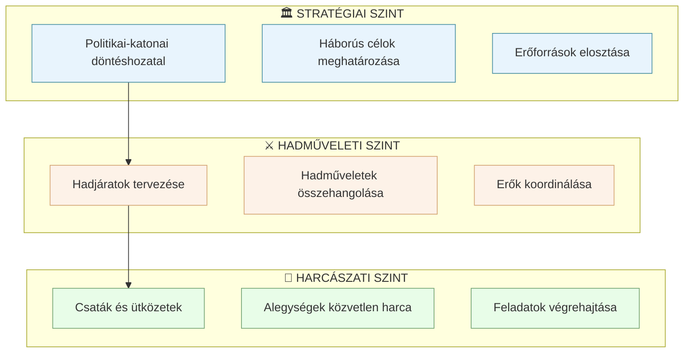

### Pontos definíciók

> **Stratégiai szint:** A legmagasabb szint, ahol a politikai és katonai vezetés meghatározza a háború céljait, mozgósítja az erőforrásokat, és összehangolja a nemzeti erőfeszítéseket a stratégiai célkitűzések elérése érdekében.

> **Hadműveleti szint:** A közbenső szint, ahol a hadműveleti parancsnokságok megtervezik és végrehajtják a hadjáratokat és nagyobb hadműveleteket a stratégiai célok elérése érdekében.

> **Harcászati szint:** A legalsó szint, ahol a csapatok közvetlenül harcolnak az ellenséggel. Itt történnek a csaták, ütközetek és harcászati feladatok végrehajtása.

---

## 2. A Törzs és Szervezete

### Mi ez egyszerűen?

A törzs olyan, mint egy vállalat központi irodája, ahol különböző osztályok dolgoznak együtt a vezető támogatására. Minden osztálynak (részlegnek) megvan a saját szakterülete:

- **G1/S1** - "HR osztály" → személyügyek, állomány
- **G2/S2** - "Piackutató" → hírszerzés, ellenség figyelése
- **G3/S3** - "Operatív igazgató" → hadműveletek tervezése
- **G4/S4** - "Logisztikai osztály" → ellátás, szállítás
- **G5/S5** - "Stratégiai tervező" → jövőbeli tervezés
- **G6/S6** - "IT osztály" → híradás, informatika
- **G7/S7** - "Oktatási központ" → kiképzés
- **G8/S8** - "Pénzügyi osztály" → költségvetés
- **G9/S9** - "PR és Kapcsolatok" → civil együttműködés

A "G" betű a magasabb szintű parancsnokságokat jelöli, az "S" az alacsonyabbakat.

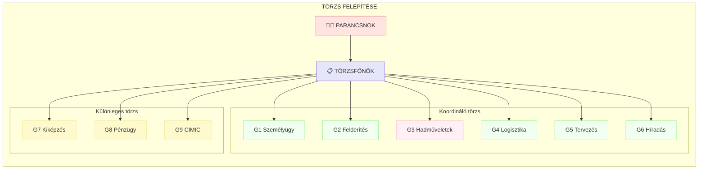

### Pontos definíciók

> **Törzs:** A parancsnok vezetési tevékenységét támogató szervezet, amely szakértőkből áll, és biztosítja a döntés-előkészítést, tervezést, szervezést és az ellenőrzést.

> **G részlegek:** A dandár és magasabb szintű parancsnokságok koordináló és különleges törzsrészlegei, amelyeket számokkal (G1-G9) jelölnek, és specifikus szakterületekért felelősek.

> **S részlegek:** A zászlóalj és ezred szintű parancsnokságok törzsrészlegei, hasonló szakterületi felosztással, mint a G részlegek.

---

## 3. Vezetési Pontok

### Mi ez egyszerűen?

A vezetési pontok olyan helyszínek, ahol a parancsnok és törzse tartózkodik és irányítja a hadműveletet. Három fő típusa van:

- **FHP (Előretolt Harcálláspont)** - Olyan, mint egy mobil irodabusz a terepen. A parancsnok innen követi a harcot közelről, gyors döntéseket hozhat.

- **MHP (Fő Harcálláspont)** - Ez a "központi iroda", ahol a törzs nagy része dolgozik. Itt történik a részletes tervezés és koordináció.

- **FIH (Mögöttes Információs Központ)** - A "hátsó iroda", ahol a logisztikát és utánpótlást irányítják, valamint tartalék vezetési lehetőséget biztosít.

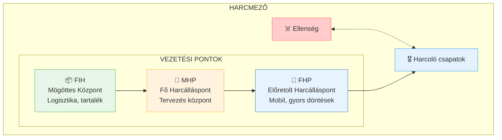

### Pontos definíciók

> **FHP (Előretolt Harcálláspont):** Kis létszámú, mobil vezetési pont, ahonnan a parancsnok közvetlenül irányíthatja a harcot. Jellemzően a hadszíntéren, az eseményekhez közel helyezkedik el.

> **MHP (Fő Harcálláspont):** A parancsnokság fő vezetési pontja, ahol a törzs jelentős része tevékenykedik. Itt történik a hadműveletek részletes tervezése, szervezése és végrehajtásának irányítása.

> **FIH (Mögöttes Információs Központ):** Mögöttes területen elhelyezett vezetési pont, amely biztosítja a logisztikai irányítást és szükség esetén átveheti a vezetést, ha az MHP megsemmisül.

---

## 4. A Katonai Döntéshozatali Folyamat (MDMP)

### Mi ez egyszerűen?

Az MDMP egy 7 lépéses módszer arra, hogy a katonai vezetők jó döntéseket hozzanak. Olyan, mint egy recept, amit követve szisztematikusan végiggondolhatjuk a problémát és megtalálhatjuk a legjobb megoldást.

Képzeljük el, hogy egy esküvőt szervezünk:
1. **Feladat vétele** → Megkapjuk a feladatot: "Szervezz esküvőt!"
2. **Küldetés elemzése** → Elemezzük: ki a pár, mennyi vendég, mikor, hol
3. **Változatok kidolgozása** → Opciók: étterem? kert? kastély?
4. **Változatok elemzése** → Minden opciót végiggondolunk (költség, kapacitás, időjárás)
5. **Változatok összehasonlítása** → Döntési táblázatban hasonlítjuk össze
6. **Döntés** → A pár dönt a legjobb opció mellett
7. **Parancs elkészítése** → Részletes tervet írunk és kiosztjuk a feladatokat

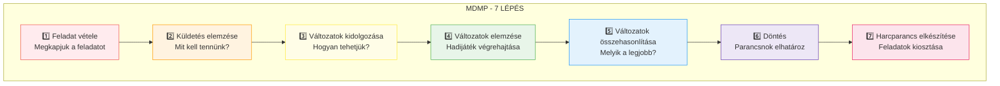

### Az MDMP lépései részletesen

#### 1. lépés: Feladat vétele (Receipt of Mission)

Egyszerűen: Megkapjuk a parancsot az elöljárótól, és megértjük, mit vár tőlünk.

> **Definíció:** Az a folyamat, amelynek során a parancsnok és a törzs megkapja, feldolgozza és értelmezi az elöljáró parancsát vagy intézkedését.

**Fő tevékenységek:**
- Elöljáró szándékának megértése
- Időszámvetés készítése
- Előzetes intézkedés kiadása

#### 2. lépés: Küldetés elemzése (Mission Analysis)

Egyszerűen: Alaposan átgondoljuk, mit kell tennünk, milyen akadályok vannak, és milyen erőforrásaink állnak rendelkezésre.

> **Definíció:** A tervezési folyamat azon lépése, amely során a törzs meghatározza a kötelezően végrehajtandó és a következtetett feladatokat, elemzi a körülményeket, és meghatározza a kritikus információigényeket.

**Kulcselemek:**
- **HFÉ (IPB)** - Harcmező Felderítő Értékelés: Az ellenség és a terep elemzése
- **CCIR** - Parancsnok Kritikus Információigénye: Amit tudnunk kell a döntéshez
- **PIR** - Elsődleges Információigény: Az ellenségről szükséges információk
- **FFIR** - Saját erőkkel kapcsolatos információigény
- **EEFI** - Rejtendő információk (amit az ellenségnek nem szabad megtudnia)

#### 3. lépés: Cselekvési változatok kidolgozása (COA Development)

Egyszerűen: Különböző opciókat dolgozunk ki a feladat megoldására.

> **Definíció:** Kreatív folyamat, amelynek során a törzs több lehetséges megoldási módot dolgoz ki a küldetés végrehajtására.

**Egy jó cselekvési változat:**
- Megvalósítható (van rá elég erőnk)
- Elfogadható (az áldozatok arányban vannak a céllal)
- Megfelelő (eléri a célt)
- Megkülönböztethető (valóban más, mint a többi opció)

#### 4. lépés: Változatok elemzése - Hadijáték (Wargaming)

Egyszerűen: Eljátsszuk fejben (vagy térképen), mi történne, ha végrehajtanánk az egyes opciókat.

> **Definíció:** Szisztematikus elemzési folyamat, amely során a törzs szimulált környezetben vizsgálja a cselekvési változatok végrehajtását az ellenség valószínű reakcióival szemben.

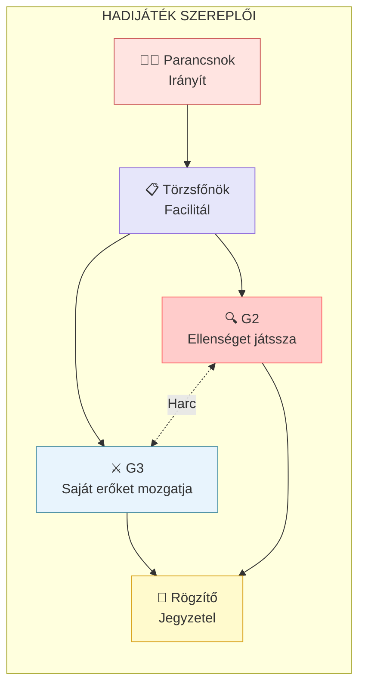

**Hadijáték technikák:**
- **Öv-technika:** Arcvonal mentén haladunk
- **Doboz-technika:** Fontosabb körletekre fókuszálunk
- **Folyosó-technika:** Fő mozgási útvonalat követjük

#### 5. lépés: Változatok összehasonlítása (COA Comparison)

Egyszerűen: Döntési mátrixban összehasonlítjuk az opciókat kritériumok alapján.

> **Definíció:** A hadijáték során szerzett információk alapján a cselekvési változatok objektív összehasonlítása meghatározott kritériumok szerint.

#### 6. lépés: Döntés (COA Approval)

Egyszerűen: A parancsnok kiválasztja a legjobb opciót és elmondja szándékát.

> **Definíció:** A parancsnok jóváhagyja a javasolt cselekvési változatot és kihirdeti elhatározását, amely tartalmazza szándékát és útmutatását.

#### 7. lépés: Harcparancs elkészítése (Orders Production)

Egyszerűen: Részletes parancsot írunk, amely mindenki feladatát tartalmazza.

> **Definíció:** A döntés dokumentálása harcparancs (OPORD) formájában, amely tartalmazza a helyzetet, küldetést, végrehajtási utasításokat, támogatást és vezetési rendet.

---

## 5. Parancsnoki Információigények

### Mi ez egyszerűen?

A parancsnoknak folyamatosan információkra van szüksége a jó döntésekhez. Ezeket kategóriákba soroljuk:

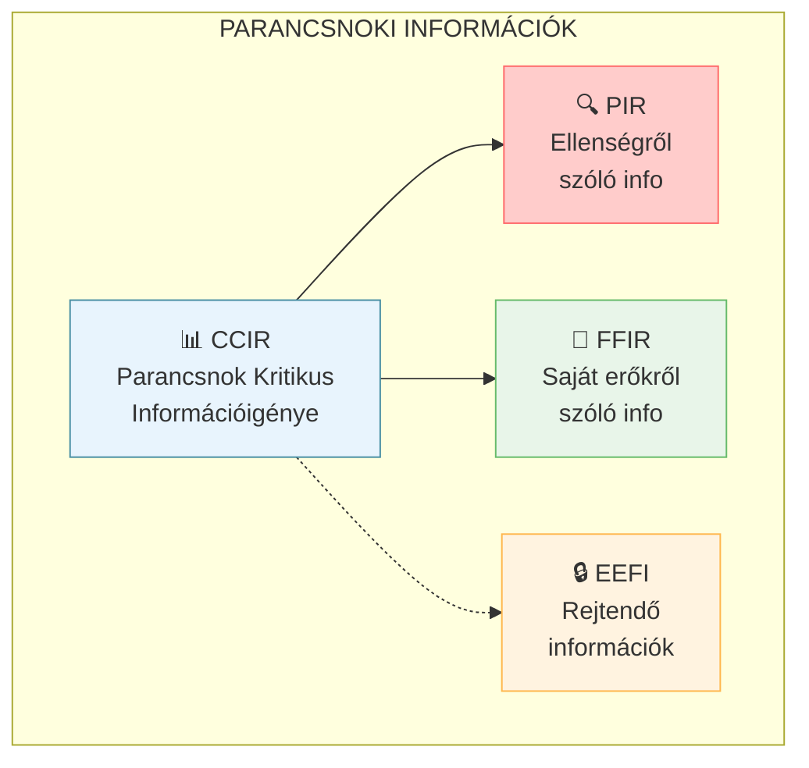

### Pontos definíciók

> **CCIR (Commander's Critical Information Requirements):** A parancsnok kritikus információigénye - azok az információk, amelyek nélkülözhetetlenek a parancsnok időszerű döntéshozatalához.

> **PIR (Priority Intelligence Requirements):** Elsődleges hírszerzési igények az ellenségről és a hadműveleti környezetről.

> **FFIR (Friendly Force Information Requirements):** Saját erőkkel kapcsolatos információigények (pl. harckészültség, veszteségek).

> **EEFI (Essential Elements of Friendly Information):** Saját erőkről szóló rejtendő információk, amelyeket meg kell védeni az ellenségtől.

---

## 6. Gyakorlattervezési Eljárás (EP)

### Mi ez egyszerűen?

A katonai gyakorlatok (pl. NATO hadgyakorlatok) tervezése és végrehajtása rendkívül összetett folyamat. Az EP (Exercise Planning Process) 4 fő szakaszból áll, ami akár 2-3 évig is tarthat egy nagy gyakorlatnál.

Gondoljunk rá úgy, mint egy nagy filmforgatásra:
1. **0. szakasz (Initiation)** - Döntés: milyen filmet forgatunk
2. **1. szakasz (Specification)** - Forgatókönyv és költségvetés készítése
3. **2. szakasz (Planning)** - Részletes forgatási terv, szereplőválasztás
4. **3. szakasz (Conduct)** - Maga a forgatás és utómunka

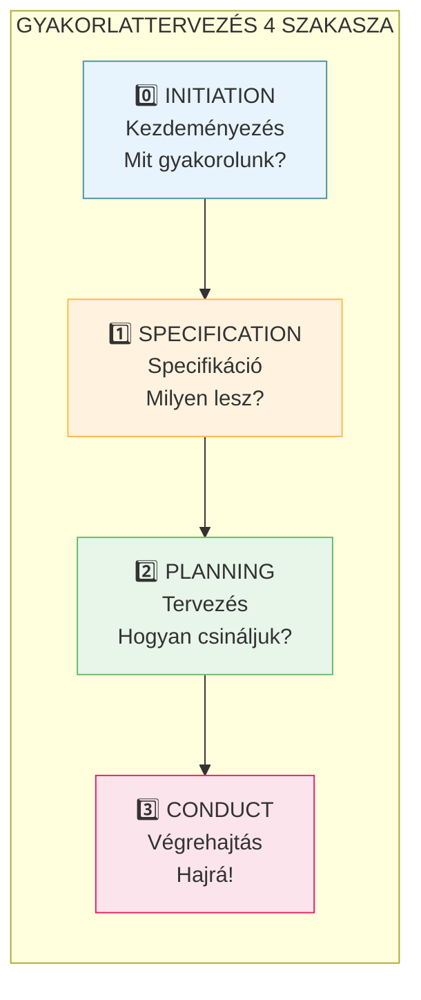

### Kulcs szervezetek

> **EXCON (Exercise Control):** A gyakorlat irányító szervezete, amely vezeti és értékeli a gyakorlatot.

> **HICON (Higher Control):** Magasabb szintű irányítás, amely a résztvevők felettes parancsnokságát szimulálja.

> **LOCON (Lower Control):** Alacsonyabb szintű irányítás, amely az alárendelt alegységeket szimulálja.

### Kulcs dokumentumok

> **EXSPEC (Exercise Specification):** A gyakorlat specifikációja, amely meghatározza a célokat, résztvevőket, időkeretet.

> **EXPLAN (Exercise Plan):** A gyakorlat részletes terve.

> **MEL/MIL (Master Event List/Master Incident List):** Fő esemény és incidens lista - a gyakorlat forgatókönyve.

---

## 7. NATO Jelek és Szimbólumok (APP-6)

### Mi ez egyszerűen?

A NATO szimbólumok egy nemzetközi "képnyelv", amelyet minden szövetséges ország katonái megértenek. Ez olyan, mint a közlekedési táblák - mindenhol ugyanazt jelentik.

### Alapszínek és jelentésük

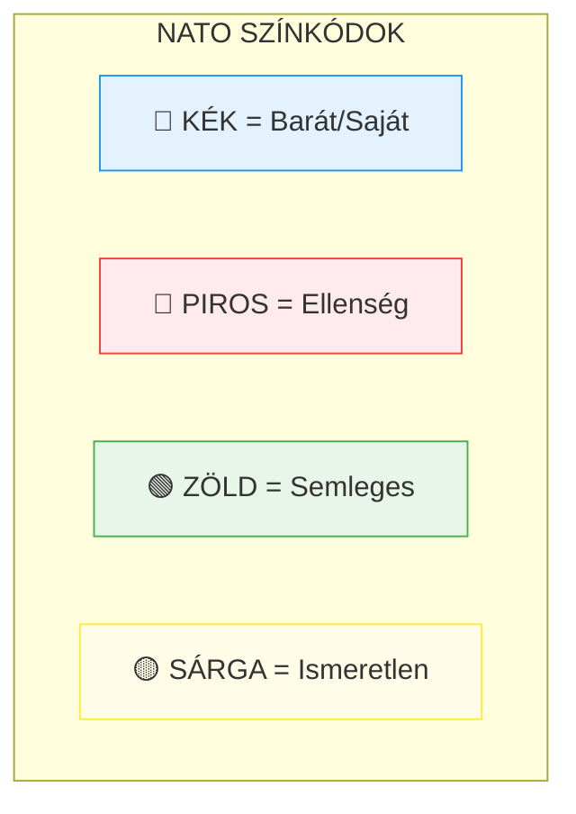

### Hovatartozás

> **Kék szín:** Barát erők (saját és szövetséges)
> **Piros szín:** Ellenséges erők
> **Zöld szín:** Semleges erők
> **Sárga szín:** Ismeretlen hovatartozású

### Kötelékméret jelölések

A katonai egységek méretét függőleges vonalak jelölik a szimbólum tetején:

| Jel | Kötelék | Angol | Létszám (kb.) |
|-----|---------|-------|---------------|
| • | Tűzfészek | Team | 2-5 |
| •• | Raj | Squad | 8-12 |
| ••• | Szakasz | Platoon | 30-50 |
| I | Század | Company | 100-200 |
| II | Zászlóalj | Battalion | 400-800 |
| III | Ezred/Csoport | Regiment | 1000-3000 |
| X | Dandár | Brigade | 3000-5000 |
| XX | Hadosztály | Division | 10000-20000 |
| XXX | Hadtest | Corps | 30000-50000 |
| XXXX | Hadsereg | Army | 80000+ |

### Szimbólum felépítése

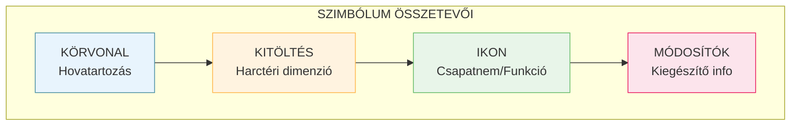

### Harctéri dimenziók

| Szín | Dimenzió |
|------|----------|
| Világoskék | Űr |
| Kék | Levegő |
| Zöld | Szárazföld |
| Zöldeskék | Víz felszíni |
| Világoszöld | Víz alatti |

---

## 8. Harcászati Grafikai Jelek

### Mi ez egyszerűen?

Ezek a térképeken használt rajzok, amelyek a hadműveletek terveit mutatják: határvonalak, mozgások, célpontok stb.

### Határvonalak típusai

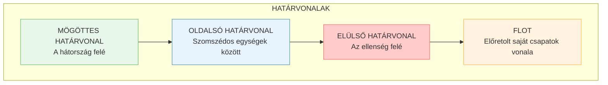

### Pontos definíciók

> **FLOT (Forward Line of Own Troops):** Előretolt saját csapatok vonala - az a vonal, amelyen túl már nincs saját erő.

> **FEBA (Forward Edge of the Battle Area):** A harcterület elülső széle.

### Fontos pontok

> **Checkpoint (Ellenőrző pont):** Mozgásszabályozásra, tűzhelyesbítésre vagy helymeghatározásra használt pont.

> **Linkup Point (Csatlakozási pont):** Könnyen azonosítható hely, ahol két erő érintkezik egymással.

> **Passage Point (Áthaladási pont):** Megjelölt hely, ahol egységek áthaladnak egymáson.

---

## 9. Harci Okmányok Rendszere

### Mi ez egyszerűen?

A harci okmányok a katonai "hivatalos papírok", amelyekkel a parancsokat, terveket és jelentéseket rögzítik és továbbítják. Olyanok, mint egy vállalat belső levelezése és dokumentációja - csak itt emberéletek múlnak a pontosságon.

### Okmányok típusai

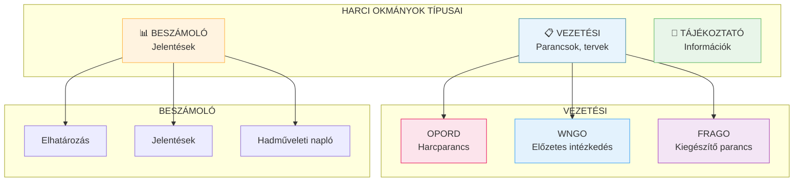

### Harci okmányok követelményei

Minden harci okmánynak meg kell felelnie az alábbi követelményeknek:

1. **Időszerűség** - A késve elkészített okmány értéktelen
2. **Rövidség** - Tömören, szaknyelven megfogalmazva
3. **Érthetőség** - Egyértelműen, félreérthetetlenül
4. **Megbízhatóság** - Csak ellenőrzött adatok
5. **Szemléletesség** - Könnyű feldolgozni
6. **Szabványosság** - NATO előírások szerint

---

## 10. Az OPORD (Harcparancs) Felépítése

### Mi ez egyszerűen?

Az OPORD (Operation Order) a katonai parancsok "királya" - ez tartalmazza mindazt, amit a csapatoknak tudniuk kell a feladat végrehajtásához. 5 fő részből áll, amelyeket mindig ugyanabban a sorrendben írnak.

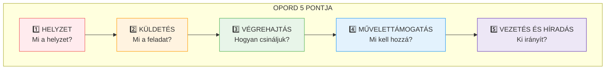

### Az 5 pont részletesen

#### 1. HELYZET
- Ellenség helyzete, ereje, szándéka
- Saját erők, szomszédok
- Terep és időjárás hatásai
- Civil tényezők

#### 2. KÜLDETÉS
- **Ki** hajtja végre?
- **Mit** kell tenni?
- **Mikor** kell végrehajtani?
- **Hol** történik?
- **Miért** (milyen célból)?

> **Fontos:** A 2. pont NEM tartalmazhat alpontokat - egy tömör mondatban kell megfogalmazni!

#### 3. VÉGREHAJTÁS
- Parancsnok szándéka
- Művelet elgondolása
- Alárendeltek feladatai
- Koordinációs utasítások

#### 4. MŰVELETTÁMOGATÁS
- Logisztika (ellátás, szállítás)
- Személyügy
- Egészségügy

#### 5. VEZETÉS ÉS HÍRADÁS
- Vezetési pontok helye
- Parancsnoklási sorrend
- Híradás rendje

### Kiegészítő okmányok

> **WNGO (Warning Order - Előzetes intézkedés):** Előzetes figyelmeztetés a várható feladatról, amely segíti az alárendeltek felkészülését.

> **FRAGO (Fragmentary Order - Kiegészítő intézkedés):** Rövidített parancs a változások közlésére, amely csak a megváltozott részeket tartalmazza.

---

## Összefoglaló Táblázat

| Fogalom | Egyszerűen | Definíció |
|---------|------------|-----------|
| **MDMP** | 7 lépéses döntési recept | Katonai Döntéshozatali Folyamat |
| **OPORD** | A fő parancs | Harcparancs (Operation Order) |
| **CCIR** | Amit a parancsnoknak tudnia kell | Parancsnok Kritikus Információigénye |
| **PIR** | Ellenségről szóló kérdések | Elsődleges Hírszerzési Igények |
| **FHP** | Mobil iroda a fronton | Előretolt Harcálláspont |
| **MHP** | Központi iroda | Fő Harcálláspont |
| **G3** | Hadműveleti főnök | Hadműveleti törzsrészleg |
| **HFÉ/IPB** | Ellenség és terep elemzése | Harcmező Felderítő Értékelés |
| **EXCON** | Gyakorlat irányítói | Exercise Control |
| **APP-6** | NATO "képnyelv" | Katonai szimbólumrendszer |

---

*Ez a kivonat a "Törzsszolgálati ismeretek" tananyag közérthető összefoglalása. A precíz definíciók és részletes szabályok az eredeti dokumentumban találhatók.*
