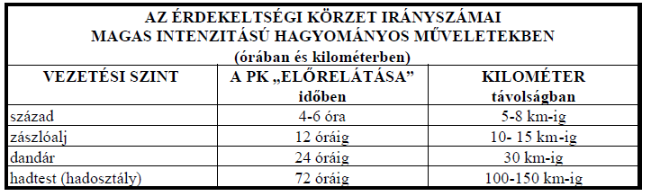
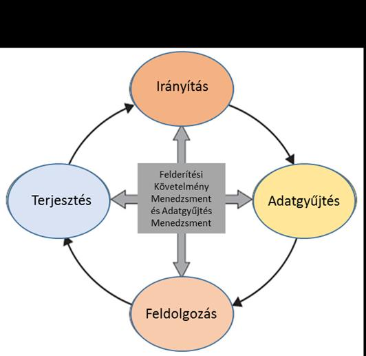
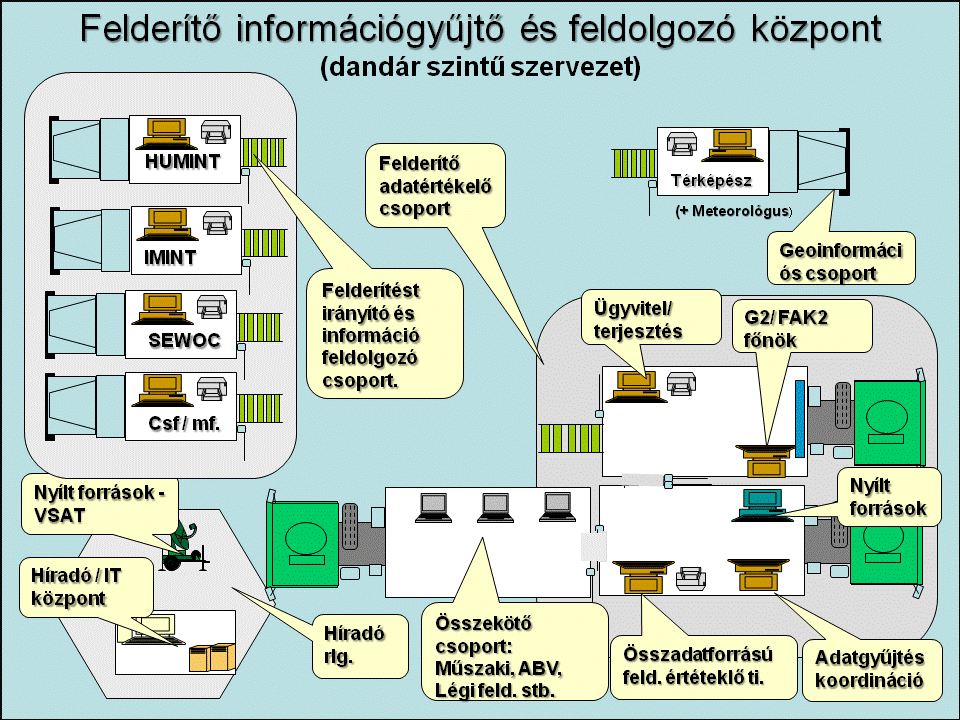
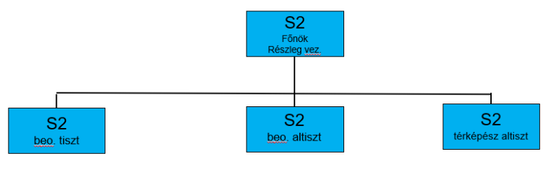
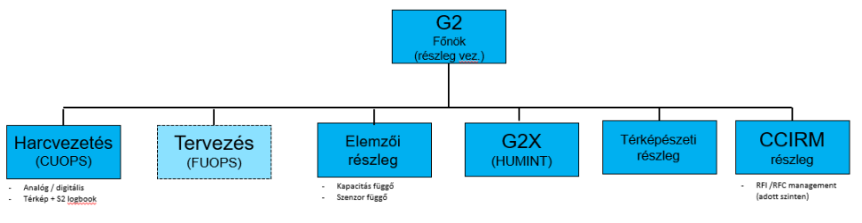
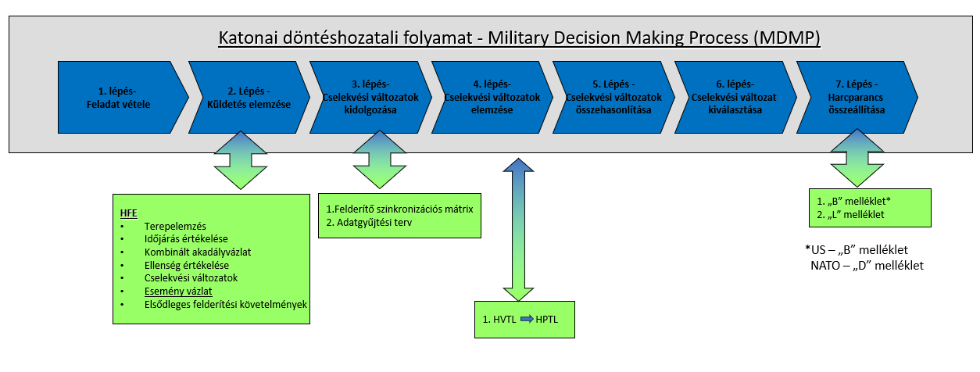
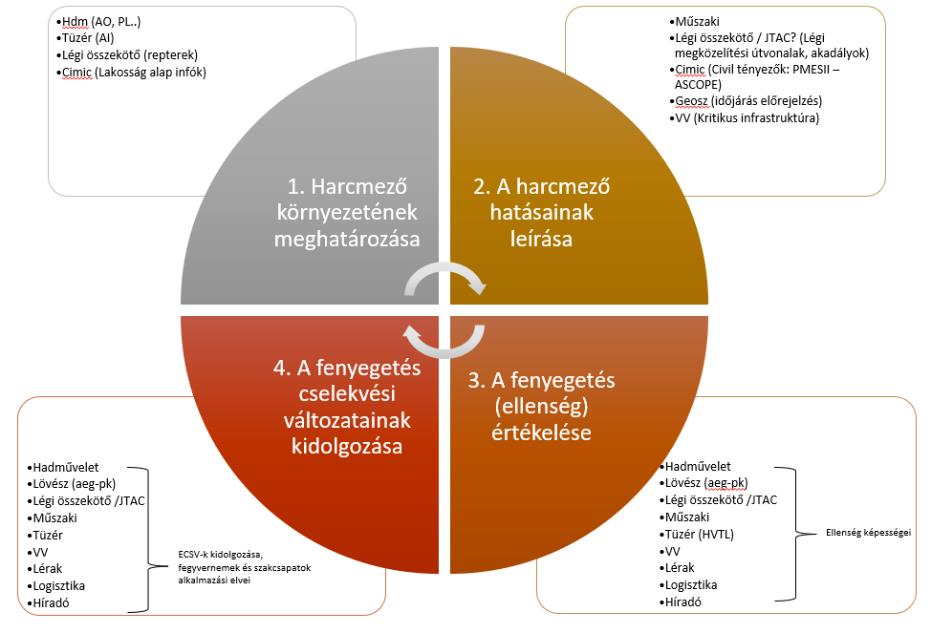
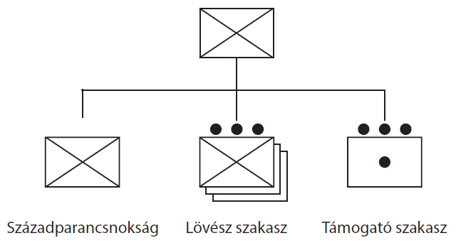
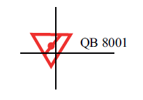
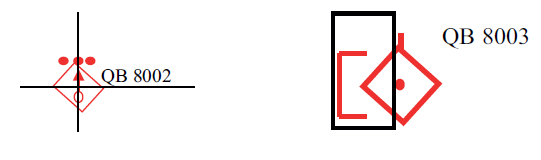

# 4 HARCI TÁMOGATÁS

## 4.1 KATONAI FELDERÍTÉS

### 4.1.1 A katonai felderítés fogalma

„A felderítés olyan harci támogató tevékenység, amelyet a csapatok az információk megszerzése érdekében különböző aktív és passzív módszerekkel folytatnak az ellenség (potenciális ellenség) tevékenységének, képességeinek és erőforrásainak meghatározása, valamint az összhaderőnemi hadműveleti terület egy meghatározott részére vonatkozó időjárási, földrajzi és vízrajzi viszonyok megállapítása érdekében."[^61]

A katonai felderítés a megszerzett információk feldolgozásának eredményeképpen következtetéseket von le a szembenálló fél valószínű szándékára, várható tevékenységére, erős és gyenge oldalaira vonatkozóan.

A felderítési folyamat befejezéseként előállításra kerül a felderítési adat, melyet a parancsnok, a törzs, az elöljáró, az együttműködők, az alárendeltek szintjüknek megfelelően megkapnak.

**A felderítőrendszer működtetésének alapvető célja a felderítési adat(-ok) előállítása és eljuttatása a felhasználókhoz.**

#### 4.1.1.1 Az adat

Az adat valakinek, vagy valaminek a megismeréséhez, jellemzéséhez hozzásegítő (nyilvántartott) tény, részlet. Felderítési szempontból adatnak tekintjük azt (azokat) a tényt (tényeket) amely(-ek) a szembenálló félre (felekre), a terepre és az időjárásra vonatkozik (vonatkoznak). Adat lehet egy koordináta, egy eszköz darabszáma, annak technikai részletei vagy személyek nyilvántartási adatai. Az adat(-ok) részét képezheti(-k) az információnak.

#### 4.1.1.2 Az információ

Felderítő szempontból az információ olyan tudati termék, mely egy adott állapotot, folyamatot ír le, amely létezik, vagy létezett térben és időben, kétségbevonhatatlan végbement, illetve folyó tevékenység, vagy annak eredménye. Jellegét tekintve: a felderítési információ feldolgozatlan tény(-ek), adat(-ok) valamely jelenség, folyamat leírása, amely felhasználható felderítési adat előállítására.

Az információgyűjtés a felderítési ciklus fontos eleme. A felderítő információforrások, felderítő szervek tevékenységük során számos megfigyelést végeznek személyesen, műszerek segítségével, vagy a műszerek által gyűjtött adatok elemzésével. Hiteles és megbízható információk nélkül a katonai felderítés csak az elképzelések szintjén mozoghat, ami félrevihet minden elhatározást és műveletet. A felderítő, információgyűjtő szerveknek (például önálló felderítőjárőr; lesállást végrehajtó alegység) nem feladatuk az információk értékelése, vagy minősítése. Jelentéseikben a tényeket kell a lehető legpontosabban rögzíteni, és a felderítő törzshöz eljuttatni. A műszerek által nyert adatok, információk előzetes feldolgozására sor kerülhet a kezelőszemélyzet részéről is. Például a rádióelektronikai, vagy radar eszközök információit a kezelők kötelessége feldolgozni, és az eredményt jelenteni. (Például az adott kisugárzó frekvenciaváltását, áttelepülését, repülőeszköz típusát megállapítani.)

A katonai műveletek során a parancsnokok nagy mennyiségű információt kaphatnak a művelettel kapcsolatban, melyek a tevékenység széles körét érinthetik: egyrészt a saját csapatokra, másrészt az ellenségre vonatkozhatnak. Ezek mellet hasonlóan nagyszámú információ érkezik a (had-)művelet fizikai és humán környezetéről (például: időjárás, felszín jellemzői, szociális és politikai tényezők, stb.). Ezért a parancsnoknak a műveletek teljes spektrumában meg kell határoznia azokat az alapvető információkat, amelyek szükségesek elhatározása meghozatalához, a művelet vezetéséhez.

Ezek az információk a parancsnok kritikus információs igényeit jelentik, melyek jelentős része az ellenségre (potenciális ellenségre) és a műveleti terület katonaföldrajzi környezetére vonatkozik.

#### 4.1.1.3 A felderítési adat

A felderítési adat és az információ közti döntő különbség a feldolgozás szintjében mutatkozik meg. A felderítési adatot az információ(-k) feldolgozásával, azok objektív megítélésével, szintézisével állítják elő. Az előállítási folyamat az értékelő személy tapasztalatának, gyakorlatának felhasználásával valósul meg.

Az információ igazi értéke akkor mutatkozik meg, amikor az elemző leválasztja a járulékos, vagy zavaró összetevőket a tény(-ek)-ről. Ebben a folyamatban az értékelést végző személy juthat olyan következtetésre, hogy az információ kapcsolódik más, már korábban megszerzett információkhoz. Amennyiben a korábbi információk új megvilágításba kerülnek, létrejön egy olyan új, több információ forrás által megerősített ismeret, amelyet az információk összevetésével, a korábbi és az új információból adódó összefüggések feltárásával állítanak elő. Ez minőségileg újat jelent, melyet felderítési adatnak nevezünk.

Az információ feldolgozásával előállított felderítési adat általában más, már korábban létező, felderítési adatokhoz kapcsolódik, ezzel elősegíti egy jellemző kapcsolatrendszer objektív feltárását. A felderítési adat szélesebb értelemben minden olyan termék (írásos jelentés, kép, hangfelvétel, makett, terepmodell stb.), mely segít megismerni a művelet körzetének katonaföldrajzi jellemzőit, a terepet, annak jellegét, a rá jellemző időjárást, az ellenség (potenciális ellenség) tevékenységét, képességeit és lehetőségeit. A felderítési adat tartalmazza mindazokat az információkat, melyeket a felderítőszervek (információforrások) összegyűjtöttek és az azok felhasználásával született következtetéseket és értékeléseket. A felderítési adatok általában egy, a már korábban létező vagy új felderítési adatokhoz kapcsolódnak és elősegítik egy jellemző kapcsolatrendszer feltárását.

Szűkebb értelemben a felderítési adat a parancsnok által jóváhagyott, a szembenálló félre, a terepre, az időjárásra vonatkozó értékelés, melyet a katonai szervezet az új, attól eltérő információk megszerzéséig a parancsnok döntéseként kezel.

**A parancsnok elhatározása, a törzs részlegeinek tevékenysége a felderítési adatra alapul.**

### 4.1.2 A felderítés szintjei

A felderítés felosztható aszerint, hogy milyen ágazati tevékenységet támogat, milyen tervezési (vezetési) szinthez kapcsolható és végezetül aszerint, hogy a felderítő műveletek milyen dimenzióban zajlanak és azokat milyen rendeltetésű erők alkalmazásával hajtják végre.

#### 4.1.2.1 Harcászati szintű felderítés:

A szárazföldi csapatok és a légierő egységei, alegységei számára biztosít felderítési adatokat a szemben álló fél erejéről, összetételéről, csoportosításáról, harci képességeiről és lehetőségeiről, valószínű szándékáról és várható tevékenységéről, fontos harcrendi elemeiről, alkalmazási elveiről, harceljárásairól, fontos objektumairól, főbb fegyvereiről, logisztikai rendszeréről, anyagi készleteiről, a műveleti terület (harcmező) állapotáról, a várható időjárásról, a harc (alkalmazás) megtervezése és végrehajtása során.

#### 4.1.2.2 Hadműveleti szintű felderítés:

Hadműveleti szintű parancsnokság számára biztosít felderítési adatokat és információkat a szemben álló fél csoportosításáról, összetételéről, erkölcsi állapotáról, képességeiről és lehetőségeiről, harceszközeiről, hadműveleti alkalmazási elveiről, logisztikai rendszeréről, a műveleti terület katonaföldrajzi jellemzőiről és azok hatásairól, a várható időjárásról és annak hatásairól a haderőnemek alkalmazásának előkészítése és végrehajtása során.

#### 4.1.2.3 Stratégiai / hadászati szintű felderítés:

A legfelső állami és katonai vezetők számára biztosít felderítési adatokat és információkat a szembenálló (potenciális) fél politikai, gazdasági, katonai potenciáljáról, fegyveres erőivel elérendő célkitűzésekről, a fegyveres és rendvédelmi erők állapotáról, a haditechnika mennyiségéről és minőségéről, a haditechnikai kutatás-fejlesztés helyzetéről, a logisztikai képességekről és lehetőségekről, a mozgósítási rendszer és a tartalékképzés állapotáról, a várható hadszíntér jellemzőiről és előkészítettségéről.

#### 4.1.2.4 A katonai felderítés célja

A felderítő rendszer működtetésének célja, hogy időben, megbízható adatokat szolgáltasson az ellenségről (a lehetséges ellenségről), az adott terület katonaföldrajzi viszonyairól és az időjárásról a politikai vezetés és a parancsnokok számára a műveletek tervezéshez és vezetéséhez, békében, válság esetén, valamint háborúban.

### 4.1.3 Az összhaderőnemi katonai felderítés fő területei

#### a) Jelzés és riasztás

A jelzés és riasztás rendszere a szembenálló fél viszonylag könnyen felismerhető és azonosítható tevékenységének felfedésén alapul. Ezek a jelek (felderítő ismérvek, felismerési jelek) egyedileg, vagy csoportosan általában egy olyan jelenségre utalnak, amelyet a szembenálló fél el akar rejteni. A felderítő törzseknek az egy adott tevékenységre utaló jeleket a műveletet megelőzően meg kell határozni, és felderítési feladatként (felderítési igényként) az információszerző szerveknek, szervezeteknek ki kell adni.

A körülmények alakulásával a jelek jellege és tartalma is változhat. Amikor lehetséges a törzseknek egy adott tevékenységre párhuzamosan több jeltípust is ki kell dolgozniuk, hogy jobban segítsenek felfedni az ellenség adott tevékenységét, így csökkenthető a megtévesztés lehetősége. A riasztás a meghatározott (kidolgozásra került) jelek észlelése esetén történik. A rendszert békében és háborúban egyaránt működtetik annak érdekében, hogy időben meg lehessen állapítani a kialakuló veszélyes helyzeteket.

#### b) A műveleti terület összhaderőnemi felderítő előkészítése

A műveleti terület összhaderőnemi felderítő előkészítése egy olyan elemző grafikai módszer, melyet a törzs többi elemének tevékenységével összhangban az összhaderőnemi felderítő törzs hajt végre a felderítő értékelések, előrejelzések és más felderítő támogatási feladatok ellátása érdekében. Célja, hogy elősegítse a parancsnok elhatározásának meghozatalát és a különböző tervek kidolgozását. **A műveleti terület összhaderőnemi felderítő előkészítését a művelet során, az igényeknek megfelelően folyamatosan végzik.** Ez az összetett tevékenység magába foglalja:

1. A harcmező környezetének meghatározása
2. A harcmező hatásainak leírása
3. A fenyegetés (ellenség) értékelése
4. A fenyegetés cselekvési változatainak meghatározása

A felderítő előkészítés során keletkezett információkat, adatbázisokat a teljes összhaderőnemi törzs, illetve a haderőnemi törzsek is felhasználják a saját értékeléseik és cselekvési változataik kidolgozása során.

#### c) Egységes műveleti helyzet és helyzetértékelés

Az egységes műveleti helyzet „leképezése" a parancsnokság és alárendeltjei számára lényegében egy pillanatfelvétel a saját és a szembenálló fél helyzetéről. A szembenálló fél helyzete a felderítő adatbázis folyamatos pontosításával alakul ki, melyet az adott pillanatban rögzítünk. A helyzetértékelés a parancsnok helyzetmegítélését tartalmazza, amely a parancsnok küldetésével összhangban a művelet környezetének értelmezése. A helyzetértékelés a törzs munkáját és az alárendelt parancsnokok döntéshozatalát segíti elő.

#### d) Céltervezés támogatása

A céltervezés támogatása során azonosítják a célokat, meghatározzák azok összetevőit és helyüket az adott rendszerben, illetve előzetesen értékelik sebezhetőségüket, fontosságukat és az adott helyzetre vonatkozó hadműveleti értéküket. Az összhaderőnemi céltervezés folyamatának felderítő támogatása olyan sajátos felderítési követelményekből fakad, amelyek a műveleti terület felderítő előkészítése során a célterületek meghatározása, vagy a parancsnok feladatszabása során keletkeznek. A célinformációk, felderítési adatok a vezetési rendszereken kerülnek továbbításra a tűztámogató, vagy egyéb támadó rendszerekhez. A művelet parancsnokának kötelessége, hogy elkerülje, illetve a minimumra csökkentse a járulékos pusztítást, amit felderítési követelményként is megfogalmazhat. A célfelderítés tervezését a tűztámogatás tervében meghatározott követelmények szerint kell végrehajtani. **A váratlanul felbukkanó, nem tervezett fontos célokra a felderítést azonnal meg kell szervezni, ehhez megfelelő célfelderítő kapacitást kell biztosítani.** A céladatok a felderítő adatbázis egyik fontos részét képezik.

#### e) Csapásértékelés

A csapásértékelés magába foglalja a célokban várhatóan keletkező fizikai károk, az adott objektum működésében és az egyéb harctéri rendszerben keletkező zavarok előrejelzését. Az adott célpont támadása során figyelembe kell venni alkalmazott halálos és nem halálos eszközök együttes hatását. **Az előrejelzés a felderítő törzs feladata, de a tűztámogató törzs (csoport) és a hadműveleti törzs együttes értékelése során alakul ki.**

A csapások értékelése újabb felderítési igényeket generál, amelyeket a felderítő törzs az információgyűjtési tervben rögzít. A csapások értékelése a művelet tervezésének és végrehajtásának kiemelten fontos eleme. A felderítő törzsnek ezért folyamatosan készen kell állni, hogy hatékonyan tudja azt támogatni.

#### f) Erők védelme

Az erők védelme érdekében a felderítés információt gyűjt a szembenálló hagyományos és nem hagyományos erőkről. A hagyományos fenyegetéssel a csapatok általában a hadműveletek megvívása során, míg a nem hagyományos fenyegetéssel a békeműveletek során, illetve a mögöttes területeken találkozhatnak. (A nem hagyományos fenyegetések a kémkedés, szabotázs, felforgatás, terrorizmus, valamint a szervezett bűnözés.) A felderítő törzs végzi a hagyományos és nem hagyományos fenyegetettség értékelését.

A NATO műveletekben felderítő törzs felel a szükséges biztonsági előírások kidolgozásáért és ellenőrzéséért. Ezekkel az intézkedésekkel is fokozzák a személyi, fizikai és az informatikai biztonságot.

### 4.1.4 A művelet előkészítése többnemzeti kötelék alkalmazása esetén

A művelet előkészítése ez esetben is egy integrált tevékenység, melyet a teljes törzs hajt végre. **A felderítő törzs a művelet tervezésének minden szakaszában kiemelt szerepet játszik.**

Az adott szintű kötelék küldetésének előkészítése időszakában:

a) tisztázza a kötelék felderítésének küldetését, feladatait és követelményeit;

b) a törzs minden részlegével közösen kidolgozza a parancsnok kritikus információigényeit,

c) a felderítési követelmények sorrendjének meghatározása érdekében;

[^61]: Magyar Honvédség Összhaderőnemi doktrína 2.215

d) kidolgozza a csapatok a szomszédok és az együttműködők felé a felderítési igényeket, követelményeket;

e) megtervezi a felderítőrendszert;

f) meghatározza az információforrásokat, kialakítja és működteti a felderítőrendszert;

g) kiválasztja az információforrásokat, és feladatot szab információgyűjtő szerveknek.

### 4.1.5 A felderítő rendszer érdekeltségi körzetei

A hatékony felderítőrendszernek megfelelő előrelátást kell nyújtania a parancsnoknak elhatározása meghozatalához és a művelet vezetéséhez.

Az érdekeltségi területre vonatkozó szükséges felderítő igényeket és a felderítéssel szemben támasztott követelményeket a parancsnok személyesen határozza meg.

### 4.1.6 A katonai felderítés elvei

#### 4.1.6.1 A katonai felderítés általános elvei

A felderítés a katonai műveletek minden fajtájában elengedhetetlen. Felderítési adatokkal támogatja a parancsnokot és a törzset, emellett a meghatározott rendnek megfelelően szolgáltatja a rendelkezésre álló felderítési adatokat és információkat az elöljáró, az alárendelt parancsnokok, az együttműködők és a szövetségesek számára. **A felderítő szervek, szervezetek feladata és alapvető célja, hogy megszerezze és előállítsa mindazokat a felderítési adatokat, melyek szükségesek a döntések előkészítéséhez, a parancsnok elhatározásának meghozatalához és a hadművelet (harc) megvívásához. Ezen ismeretek nélkül minden katonai művelet kudarcra van ítélve.** Ezért minden felderítő törzs alapfeladata az adott szintű parancsnok kiszolgálása, a döntésekhez szükséges parancsnoki előrelátás biztosítása, felderítési adatokkal történő ellátása.

A felderítő törzs munkájának irányítása a parancsnok közvetlen felelőssége, melyet nem ruházhat másra. A parancsnok közvetlen felelőssége, hogy a felderítő törzs mindig tisztában legyen a parancsnok szándékával, felderítési adatigényével és felderítési követelményeivel.

#### 4.1.6.2 A katonai felderítés alapelvei

A felderítő rendszer hatékony működtetése megköveteli, hogy az alábbi rendező elvek alapján tervezzék, szervezzék és vezessék a felderítési feladatokat, hajtsák végre a tájékoztató munkát.

**a) Központi vezetés és irányítás elve**

A felderítést egységes elvek és követelmények alapján kell folytatni, kerülve a felesleges átfedéseket, megvalósítva a különböző szervek kölcsönös támogatását, a meglévő információforrások optimális felhasználását.

**b) Időbeliség elve**

A legfontosabb információk, vagy felderítési adatok is értéktelenekké válnak, ha azokat a felhasználók nem kapják meg időben. A felderítő rendszernek készen kell állnia, hogy minden elemével képes legyen a helyzetben bekövetkezett változásokat észlelni és jelentéseit a meghatározott rend szerint, haladéktalanul megtenni. Fokozatosan el kell érni a valós idejű felderítés képességét.

**c) Rendszeres adatgyűjtés / folyamatosság elve**

A felderítő szervek lehetőségei, az általuk megszerzett információk, adatok folyamatos felülvizsgálatával és rendszeres feladatszabással használhatók ki. Minden információszerző szervnek tervszerűen, képességeik alapos ismeretében szabnak feladatot.

**d) Objektivitás elve**

A felderítési adatot kezelőknek kizárólag csak a tényekből szabad kiindulni. Kerülni kell a felderítési adatok előzetes feltételezés alapján történő előállítását.

**e) Hozzáférhetőség elve**

A felderítő törzs és a felhasználó hozzá kell, hogy férjen minden fontos információhoz, adathoz. A felderítő törzs köteles feldolgozni minden beérkező jelentést, információt, tájékoztatót. A feldolgozás során összevetik azokat a már korábban értékelt felderítési adatokkal, vagy az azok alapját képező információkkal. A felderítési adat értéktelen, ha a tájékoztatás nem megfelelő, vagy a felhasználó nem jut időben hozzá.

**f) Reagáló képesség/operativitás elve**

A felderítő törzs folyamatosan figyelemmel kíséri a parancsnok felderítéssel szemben támasztott követelményeit, az alárendeltek és más felhasználók felderítési igényeit. A felderítő rendszer, a képesség függvényében, a fontossági sorrendnek megfelelően folyamatosan készen áll a felderítési igények kielégítésére.

**g) Az információs rendszer védelmének elve**

A felderítő információs rendszer és az adatforrások védelme kiemelt gondoskodást igényel. A felderítő rendszer megbízható védelme teszi lehetővé annak felhasználhatóságát. A rendszer védelme szempontjából folyamatosan értékelik, hogy milyen információk hozhatók nyilvánosságra, melyek azok, amelyek fokozott védelmet igényelnek, mert illetéktelen kijutásuk súlyos veszteséget, vagy zavart okozhat. A saját csapatokat időben ellátják azokkal az információkkal, melyek a rendszer működése szempontjából hatás-, illetve felelősségi körükbe tartoznak.

**h) Megbízhatóság és pontosság elve**

A felderítési adatoknak szigorúan a tényeket kell tartalmazniuk és a helyzetet a lehetőség szerint pontosan kell bemutatniuk.

**i) Folyamatos áttekintés elve**

A felderítési adatokat folyamatosan felülvizsgálják. A szükséges mértékben pontosítják azokat, figyelembe véve az újonnan beszerzett információkat, melyeket összevetnek a már korábban megszerzettekkel.

### 4.1.7 A felderítési ciklus

A felderítés folyamata azokat az egymást követő fázisokat és tevékenységeket foglalja magába, amelyek szükségesek a műveletek tervezése és vezetése során a parancsnok felderítési követelményeinek kielégítéséhez. Ezek az egymást követő és egymásra épülő fázisok, ciklikus jellegűek, mivel a felderítés folyamatában az újraértékelés és a naprakészség a parancsnok folyamatosan jelentkező igénye.

### 4.1.8 A felderítő információgyűjtő rendszer felépítése

#### a) Vezetőszervek

Az információgyűjtő rendszer a felderítő rendszer önálló eleme, amely saját vezetési és irányítási rendszerrel rendelkezik. Képessége függ a támogatott szervezet méretétől, feladatától, a tereptől és az időjárástól. A vezető szerveknek képeseknek kell lenni a felderítési feladatok vételére, elosztására, a felderítő rendszerek felkészítésére, harci és harci kiszolgáló támogatására, a megszerzett információs elemek, információk megkövetelt szintű feldolgozására. Az információ gyűjtő rendszer a parancsnok közvetlen irányítása alatt áll, szakmai irányítását a felderítőfőnökség látja el.

#### b) Információgyűjtő és feldolgozó központ

Az információgyűjtő rendszer működésének tervezését és irányítását az információgyűjtő központ végzi, amely előzetes, vagy teljes feldolgozást is végrehajtja. A felderítő törzs által készített és kiadott információgyűjtési (felderítési) terv alapján kijelöli a végrehajtó felderítő szerveket, kiadja az információk specifikusan gyűjtendő elemeit, és meghatározza a végrehajtás határidőit, tekintettel az információ megszerzésének határidejére.

A központnak rendelkeznie kell mindazokkal a híradó és informatikai rendszerekkel, melyek többcsatornás összeköttetést biztosítanak a felderítő szervek és a parancsnok vezetése és irányítása alá tartozó erők felé, valamint az elöljáró felderítő rendszerei felé, az általuk közvetlenül eljuttatott információk vételére és az oda történő továbbításhoz.

**Szövetséges művelet esetén dandár és magasabb szinten követelmény a légi felderítés információinak és adatainak vételét és cseréjét valós időben biztosító képesség.**

A szövetséges légi felderítés a teljes műveleti területről meghatározott időben, vagy folyamatosan biztosít elsősorban képi információkat. A szomszédok légi felderítési adatainak közvetlen vétele is lehetséges. Emellett a központ a saját felderítő rendszer által gyűjtött információkat az érdekelt felhasználóknak feldolgozás nélkül, azonos időben továbbíthatja. A saját felderítő szerveken kívül képesnek kell lennie a szomszéd rendszerek elemeit irányítani, illetve a saját elemek irányítását a szomszéd rendszerek részére ideiglenesen átadni. Gyűjti és feldolgozza a nyílt forrásból származó információkat.

### 4.1.9 A katonai felderítés ágai

A felderítés ágai szorosan összefüggenek az információ gyűjtés módjával, vagy a helyzet, a fenyegetés, az állapot és esemény megfigyelésre, érzékelésre, rögzítésre, vagy az információ továbbítására alkalmazott rendszerekkel. Ez tulajdonképpen nem mást jelent, mint azt, hogy a katonai felderítést annak módszerei horizontálisan tovább tagolhatják.

A felderítés ágai alfabetikus felsorolásban:

**a) ACINT – Hangfelderítés:** A hangfrekvenciás jelenségek gyűjtésére és feldolgozására szakosodott felderítési ág. A felderítési információ hang érzékeléséből származik. Például a források víz alatti mikrofonok (hidrofonok), földi mikrofonok (geofonok), szonárok, integrált víz alatti felderítő, vagy tüzér hangfelderítő rendszerek. A hangforrás természetéből fakadóan a hangfelderítés elsősorban a mozgásra koncentrál, és az értékelt felderítési információk ennek észleléséből származnak.

**b) HUMINT – Emberi forrásból származó információ:** gyűjtésére szakosodott felderítési ág. Magában foglalja a humán források, objektumok szisztematikus és ellenőrzött felhasználását kapcsolattartás, megfigyelés útján. Képes információt szerezni egy konfliktus szereplőjének szándékáról, erkölcsi állapotáról, személyes és szervezetek közti kapcsolatokról.

**c) IMINT ‒ Képfelderítés:** a szenzorokból – melyek lehetnek földi, vízi, légi és űr bázisúak – nyert képekből történő értékelt felderítési információk előállítása. Az információ, amelyet egy képből nyerhetünk, világos, tömör − és főleg egyértelmű. Gyakran szolgál a más forrásokból származó információk támogatására, megerősítésére. Nagy mennyiségű értékelt felderítési információ származik olyan forrásból, mint a műholdak, repülőgépek és pilóta nélküli légi jármű rendszerek.

**d) MASINT:** Érzékelő berendezések adatainak elemzéséből származó tudományos és műszaki felderítési információk gyűjtésére szakosodott felderítési ág. A mérési és jelfelderítési adatok a kisugárzás széles skálájú gyűjtéséből, az ismert tudományos és technikai adatbázisokkal történő összehasonlításból származnak abból a célból, hogy azonosítsanak egy eszközt vagy sugárforrást. Az ilyen természetű információ gyűjtést lehetőség szerint stratégiai szintről irányítják.

**e) OSINT – Nyílt forrásból származó információ:** gyűjtésére szakosodott felderítési ág. Az információt szolgáltató médiumok lehetnek ingyenes vagy fizetős szolgáltatások, mint például folyóiratok, hírügynökségek, rádió-, televízió csatornák, ismeretterjesztő és technikai kiadványok, könyvek, egyéb kiadványok az interneten elérhető információk számtalan formája (online folyóiratok, specializált weblapok, blogok stb.) Az információ áramlás szabadsága jelentősen megnövelte és megkönnyítette a nyílt forrásokhoz való hozzáférést.

**f) RADINT:** A radarfelderítés szárazföldi, hajófedélzeti és repülőgép fedélzeti célfelderítő radarok alkalmazásával szerezi meg az adatokat, információkat. A földi, víz felszíni és légi járművek, harcrendi elemek, objektumok helyének és mozgásának felfedésére, azonosítására szolgál. A földi mozgócél-felderítő radarok képesek mozgó embert 3 km, gépjárművet 25 km távolságig felfedni, helyet megállapítani és követni, az időjárástól függetlenül, a láthatóság figyelembevételével. A földi mozgócél-felderítő radarok alkalmazhatók még irányok zárására, utak és lezárt területek őrzésére. A tüzelő lövegeket, aknavetőket, sorozatvetőket felderítő radarok képesek a célok felderítésére 40 km mélységig, 5m pontossággal. Alkalmasak a célok helyének megállapítására bármely napszakban és időjárási viszonyok között, ellenséges elektronikai környezetben.

**g) SIGINT ‒ Jelfelderítés (rádióelektronikai felderítés):** A kommunikációs és elektronikai felderítés együttes jelölésére alkalmazott kifejezés, amelyet akkor használnak, ha nincs szükség a megkülönböztetésükre, vagy ha a kettőt egy szóval kívánjuk jelölni. A jelfelderítés az idegen elektromágneses jelek és kisugárzások gyűjtéséből és kinyeréséből állít elő értékelt felderítési információkat.

**h) COMINT ‒ Kommunikációs információ:** gyűjtésére szakosodott felderítési ág. Az elektromágneses kommunikációs és más adatátviteli rendszerekből, nem a felhasználók és a címzettek által kinyert értékelt információ, illetve ennek megszerzésére irányuló tevékenység. A felderítési információk az elektromágneses kommunikációból és a kommunikációs rendszerekből származnak a címzettek és felhasználók szándéka ellenére. Tipikusan az elfogott kommunikációból és adatkapcsolatból erednek. Ilyen információk gyűjthetők beszéd formájában, rádióüzenetek lehallgatásával, két pont közti kommunikáció, például telefon, vagy rádiórelé-kapcsolat lehallgatásával, illetve adat, vagy egyéb két pont közti adatkapcsolat lehallgatásával. A rádiófelderítés a működő kommunikációs berendezések fizikai paramétereit, a rajtuk folyó forgalmazást (adatok átvitelét) deríti fel. A rádiófelderítés a rádiófrekvencia-tartományban (HF, VHF, UHF) folytat információ szerzést. A kisugárzási adatbázisokra támaszkodva képes megállapítani a szembenálló fél híradó eszközeinek paramétereit, azonosító jegyeit és helyét a látótávolságon túl, mintegy 80 km mélységig. A rádióállomások helyének meghatározásához minimálisan három készlet felderítő állomással rendelkezik. A rádióforgalmazás információinak felhasználásához – különösen harcászati szinten – a szembenálló fél nyelvét ismerő kezelő állományra, vagy tolmácsokra van szükség.

A nem hagyományos kommunikáció felderítése ‒ ilyenek a mobiltelefon, a CB-rádió és egyéb polgári rendszerek ‒ elsősorban a békeműveletek során elengedhetetlen. Az aszimmetrikus fegyveres küzdelemben a nem hagyományos erők nem a katonai híradás szabályainak és eszközeinek felhasználásával szervezik kommunikációs rendszereiket, ezért igen fontos ezeknek a rendszereknek a felderítése és forgalmának figyelemmel kísérése.

**i) ELINT ‒ Elektronikai információ:** gyűjtésére szakosodott felderítési ág. Nem hírközlési elektromágneses jelekből származó, nem a címzettek vagy a jogosult felhasználók által nyert értékelt felderítési információ. Az elektronikai felderítési információk az elektromágneses nem kommunikációs kisugárzások értékeléséből származnak. Ilyenek a radarok és a rakéta irányító rendszerek. Ezenkívül tartalmazza a lézer, az infravörös és egyéb eszközöket is, amelyek sugárzást bocsátanak ki az elektromágneses spektrumban. Összehasonlítva az információt az eszköz kisugárzásának észlelt paramétereivel, a jelek adatbázisokba kerülnek, az értékelhető adatok az eszközökről és kezelőikről ezek összehasonlításával készülnek. A rádióelektronikai felderítés alapvetően az elektromágneses spektrum rádióhullám tartományában működő kommunikációs és nem kommunikációs kisugárzó berendezések működésére vonatkozó adatszerzést folytat, de napjainkban a lézer-, infra- és más elektromágneses kisugárzók felderítése is feladatai közé tartozik.

**j) TECHINT:** A technikai felderítés széles körű információ szerző tevékenység, amely egyrészt a szembenálló fél haditechnikai téren meglévő lehetőségeinek felfedését, másrészt saját haditechnikai színvonalunk fenntartását, fejlesztését szolgálja. Két fő területe a harctéri és a tudományos szintű technikai felderítés.

**k) MEDINT:** Az egészségügyi felderítés információit a műveleti terület felderítő előkészítése és a helyzet nyilvántartása során a felderítő törzs felhasználja.

**l) CI:** A felderítés elhárítása fontos információ forrás, mely az ellenség felderítő rendszerének működéséből következtet annak elgondolására, várható tevékenységére. A felderítés elleni védelem fokozza a csapatok biztonságát, elősegíti a parancsnok elhatározásának megvalósítását. Felderíti a kémkedés, szabotázs, felforgatás, terrorizmus, szervezett bűnözés veszélyeit. Rendszabályokat javasol a parancsnoknak a veszélyek elhárítására, illetve a saját erők megvédése érdekében.

### 4.1.10 Más fegyvernemekhez, szakcsapatokhoz tartozó információszerző elemek

A dandár (zászlóalj) minden felderítő rendszere és eszköze egy információgyűjtő-rendszert képez, melynek vezetője a felderítő főnök (G2), felderítő tiszt (S2). A szakfegyvernemi (tüzér, műszaki, vegyi-sugár, egészségügyi) felderítő szervek saját fegyvernemeik szakcsapatainak alkalmazása érdekében gyűjtenek fontos adatokat és információkat, de ezek egyúttal hozzájárulhatnak a szembenálló fél helyzetének értékeléséhez is. A törzs teljes állományának feladata, hogy megszervezze a más fegyvernemekhez tartozó felderítő szervek által megszerzett adatok és információk eljuttatását a felderítő adatgyűjtő és értékelő központba. Az összes adat és információ feldolgozásával lehet csak elérni az egységes műveleti helyzetkép kialakítását. Amennyiben a megszerzett adatok és információk már felhasználásra kerültek (például tüzérségi céladatok), abban az esetben központi feldolgozásukat a felderítő főnökségnek el kell végeznie. A fegyvernemek felderítési igényeiket a felderítő főnökhöz (felderítő tiszthez) juttatják el, aki megszervezi a szükséges felderítési adatok, információk megszerzését, de közvetlenül is képesek információ kivételére és elhelyezésére az elöljáró által szervezett felderítő információs rendszerben.

#### 4.1.10.1 Tüzér felderítés

A tüzér felderítő szervek a dandár (zászlóalj) tüzérség felderítési adatokkal történő kiszolgálását végzik, emellett az információszerző rendszer fontos eleme. A tüzér felderítés általában önállóan, esetleg a felderítő járőrökkel, vagy egyesített figyelőőrs alkalmazása esetén a felderítő zászlóaljból képzett felderítő szervekkel közösen tevékenykedik. Az információgyűjtő rendszer célfelderítő (Target Acquisition, TA) feladatait hajtja végre és részt vesz a megfigyelés (Surveillance) feladatainak végrehajtásában is. A közeli felderítő rendszer részeit képezik a tüzér alegységek optikai felderítő eszközökkel felszerelt tűztámogató és tűzmegfigyelő részlegei, valamint bemérő rajai.

**Mozgócél-felderítő lokátor szakasz**

A mozgócél-felderítő lokátor szakasz a tüzér felderítés eleme. Elsősorban a tüzérség céladatokkal történő kiszolgálását végzi, de megfigyelési szempontból is jelentős információ forrás.

**Tűzeszköz-felderítő lokátor szakasz**

A tűzeszköz-felderítő lokátor szakasz az ellenség tüzelő lövegeinek, aknavetőinek, rakétáinak és nagy űrméretű légvédelmi gépágyúinak felderítését végzi a kilőtt gránátok röppályája alapján. A röppálya adatainak alapján az ellenség, és a saját kilőtt lövedékek becsapódási helyét előre meg tudja határozni.

**Hangfelderítő szakasz**

Az akusztikus felderítő szakasz az ellenség tüzelő lövegeinek, aknavetőinek torkolati dörej alapján történő felderítését, saját gránátok robbanásakor keletkező dörejek bemérését és egyéb hangjelenségek felderítését végzi. Alkalmas a tüzelő lövegek és aknavetők helyének meghatározására, saját tűz helyesbítésére, egyéb hangforrások felfedésére, álláspontjuk és jellegük megállapítására.

#### 4.1.10.2 Műszaki felderítés

A műszaki felderítés a műszaki zászlóalj (század) alkalmazása érdekében szerez információkat a terep járhatóságáról, a műtárgyak állapotáról, természetes és mesterséges akadályokról, különös tekintettel az aknákra, aknamezőkre, a házi készítésű robbanó eszközökre.

**Műszaki felderítő szakasz**

A műszaki felderítő raj a lövészdandár (zászlóalj) műszaki erői alkalmazásának érdekében folytat információszerzést. A szembenálló fél mélységében együttműködve a felderítő szervekkel, saját területen önállóan hajtja végre feladatait. Az információ gyűjtés során műszaki felderítő járőrként, vagy műszaki figyelőőrsként alkalmazható.

#### 4.1.10.3 Vegyi, biológiai, sugár-, atomfelderítés

A vegyi, biológiai, sugár- és atomfelderítés végzi a vegyi harcanyagok, ipari vegyi anyagok, biológiai ágensek, sugárzó anyagok, nukleáris csapások felderítését, a mintavételt, a minták elemzését, a szennyeződés mértékének megállapítását, a szennyezett területek behatárolását, és a csapatok értesítését és riasztását.

**A vegyi-sugár felderítő csoport**

A vegyi-sugár biológiai támogató szakasz részeként a dandár (zászlóalj) a műveleti terület saját erőkkel megszállt részén vegyi-sugár, biológiai felderítő járőrök, és figyelőőrsök alkalmazásával gyűjt információkat. A szembenálló fél által megszállt területeken a felderítő járőrök kötelékeiben tevékenykedhetnek.

#### 4.1.10.4 Egészségügyi felderítés

Az MH egészségügyi felderítő szervezettel nem rendelkezik. Egészségügyi szakértők felderítési tevékenységbe történő bevonásával lehetővé válik a műveleti terület közegészségügyi, járványügyi helyzetének felmérése, értékelése és a változások figyelemmel kísérése.

Tömegpusztító fegyverek alkalmazása esetén szükséges a csapás területén az egészségügyi következmények felmérése. Az egészségügyi felderítés információit a műveleti terület felderítő előkészítése és a helyzet nyilvántartása során a felderítő törzs felhasználja.

### 4.1.11 A katonai felderítés korlátai

A rendelkezésre álló erőforrások mennyiségi és minőségi értelemben egyaránt befolyásolják a felderítő rendszer támogató tevékenységét, annak a megvalósulását, hogy a telepített rendszerrel mennyire vagyunk képesek kielégíteni a parancsnok felderítéssel szemben támasztott követelményeit. Ezért a rendszer „üzemeltetésénél" figyelemmel kell lenni az alábbi korlátozó tényezőkre:

**a) Túlzott elvárások.** A felderítéstől még a források maximális kihasználása esetén sem várható el a hibátlan, tökéletes előrejelzés. A felderítő törzsek ismerik a felderítő szervezet képességeit és korlátait. A törzseknek a rendelkezésre álló források optimalizálásával kell törekedniük a parancsnok elvárásainak maximális kielégítésére. A parancsnokoknak ezért figyelembe kell venniük, hogy a felderítési adatok nem minden esetben teljesek és pontosak.

**b) Hiányos felderítési információk.** A felderítési információk nem minden esetben képesek hiánytalanul kielégíteni a parancsnok felderítési követelményeit. Ennek ellenére a parancsnokoknak sok esetben a rendelkezésre álló hiányos információ alapján kell dönteniük. A felderítő törzsnek ezért egyértelműen jeleznie kell, mely területén nem rendelkezik a megfelelő adatokkal, információkkal. Ez lehetővé teszi a parancsnok számára, hogy a rendelkezésre álló információt a megfelelő súlyozással vegye figyelembe döntése meghozatalakor.

**c) Információgyűjtő erők és eszközök képességei.** Valamennyi információgyűjtő, -feldolgozó és -értékelő erő és eszköz rendelkezik bizonyos korlátokkal. A felderítő törzsnek kötelessége, hogy a parancsnokkal és a törzs többi elemével megismertesse a reális információgyűjtő, -feldolgozó és -értékelő kapacitásokat. Ez tartalmazza minden egyes információgyűjtő eszköz képességének korlátait, sérülékenységét a kinetikus és elektronikus támadások esetén, ezenkívül ismertetni kell megtéveszthetőségüket, az általuk lefedhető területet és a követelmények megválaszolásának várható idejét. A parancsnokoknak ezenkívül meg kell ismerniük a szembenálló fél információgyűjtő képességeinek erős és gyenge oldalait is. A parancsnokoknak tisztában kell lenniük a felderítési követelmények teljesíthetőségével, a rendelkezésre álló információgyűjtő és -feldolgozó szervezetek képességeivel, abból a célból, hogy fel tudja állítani felderítési követelményeinek prioritási sorrendjét, így tudja leghatékonyabban kihasználni rendelkezésre álló felderítő kapacitásait.

**d) Képességek és szándékok.** Hagyományos, magas intenzitású művelet során a felderítő törzsek a szembenálló fél képességeit elsősorban a fegyveres erői mérete, felépítése, haditechnikájának minősége alapján határozzák meg. Még ebben az esetben is rendkívül nehéz meghatározni a szembenálló fél szándékát. Aszimmetrikus műveleti környezetben, ahol a szembenálló fél katonai ereje a nem hagyományos és komplex harceljárások alkalmazásának következtében kevésbé fontos, a felderítő törzsnek biztosítania kell, hogy a parancsnok megértse, az ellenség képességeinek, súlypontjának és szándékainak meghatározása bonyolultabb.

**e) Nemzeti korlátozások.** Koalíciós vagy szövetségi műveletek végrehajtása során a nemzeti felderítő rendszer képességeinek teljes kihasználását sok esetben korlátozhatják az adott műveletre meghatározott nemzeti korlátok.

**f) Nemzetközi jog.** A felderítő rendszer működtetése során minden esetben be kell tartani a nemzetközi jogi normákat. A katonai felderítő tevékenységét kizárólag ebben a jogi keretben lehet folytatni. Mint ahogy az a bevezetőben is megfogalmazásra került, a különböző katonai szervezetek átalakítással is együtt járó korszerűsítése azonkívül, hogy napjainkra elodázhatatlan feladattá vált, egy permanens folyamat.

### 4.1.12 A felderítő törzsmunka

A felderítő részleg (vagy főnökség) feladata az adott szintű alegységén belül a parancsnok kritikus információ igényének megfelelően a parancsnoki döntéshozatal támogatása. A művelet sikeres végrehajtása érdekében a felderítő törzs az alábbi fő feladatokat látja el:[^62]

- harcmező felderítő előkészítése (Intelligence Preparation of the Battlefield - IPB)
- a felderítő rendszer működtetése, feladatszabás az alárendelt felderítő elemeknek (alegységeknek)
- elemzések és értékelések végrehajtása
- jelentések elkészítése
- adatbázis kezelése
- tájékoztatókba és harcparancsba való bedolgozás végrehajtása
- térképészeti anyagok biztosítása
- értekezleteken és tájékoztatókon való részvétel
- együttműködés és kapcsolattartás az elöljáró- és szomszédos alegységek szakmai képviselőivel

A felderítő részleg felépítése (változat):

[^62]: Részletesebb információ a felderítő főnökség (G2) működési rendjéről a „A törzs feladatai a katonai döntéshozatalban és a katonai műveletek végrehajtásában - Böcz Lajos, Krajnc Zoltán, Szekeres György – 2014" c. egyetemi jegyzetben

A felderítő részleg létszáma zászlóalj szinten általában 4-6 fő. Zászlóaljtól magasabb szinten ez a létszám optimális esetben az adott alegység szintjével arányosan nő. Egység szinten a művelet sajátossága szükségessé teszi, hogy a részleg mind felépítésében és feladatrendszerében egyaránt komplexebb.

## A harcmező felderítő előkészítése (HFE)

A harcmező felderítő előkészítése egy szisztematikus elemzési folyamat, mely során a részleg az alegység feladatának tekintetében elemzi a hadszíntér sajátosságait. A HFE a katonai döntéshozatali folyamat (Military Decision Making Process – MDMP) kulcsfontosságú része, melynek produktumaira épülnek a folyamat további lépései.

A HFE zászlóalj szinttől kezdve minden szinten végbemegy. Szervezeti szintenkénttöbbnyire különbözik az elemzési folyamat elnevezése, a részletessége, komplexitása és az elemzés fókusza is. A fő lépések többségében ugyanazok, azonban minél magasabb szinten kerül végrehajtásra, annál inkább rendszer szinten kerülnek vizsgálatra a hadszíntér sajátosságai.63

**A harcmező felderítő előkészítésének (HFE) elnevezései különböző szinteken:**
- Joint Intelligence Preparation of the Operational Environment – JIOPE
- Comprehensive Preparation of the Operational Environment (CPOE)
- Intelligence Preparation of the Battlefield (IPB)

63 Egyes NATO tagországok saját nemzeti eljárásainak (SOP) keretén belül eltérő megnevezést használhatnak ugyanazon folyamat végrehajtására. Pl. A brit hadsereg a „Tactical Estimate" folyamat lépései során hajtja ezt végre.

---

A továbbiakban a zászlóalj-dandár szinten végrehajtásra kerülő HFE lépései kerülnek bemutatásra. Az alábbiakban a folyamat lépései rendszer szinten kerülnek ismertetésre. A felderítő szakembereknek ennek a folyamatnak az elsajátítására külön, több hetes tanfolyamok állnak rendelkezésre hazai- és nemzetközi környezetben egyaránt.

**A harcmező felderítő előkészítésének (HFE) lépései:**
1. A harcmező környezetének meghatározása
2. A harcmező hatásainak leírása
3. A fenyegetés (ellenség) értékelése
4. A fenyegetés cselekvési változatainak meghatározása64

**A harcmező környezetének meghatározása magába foglalja a következőket:**
- műveleti terület (Area of Operation – AO) meghatározása (elöljáró által kijelölt)
- befolyásolási terület (Area of Influence – AI) meghatározása
- érdekeltségi terület (Area of Interest – AoI) meghatározása

**A harcmező hatásainak leírása az alábbi feladatokat tartalmazza:**
- időjárás elemzése és értékelése
- terep elemzése és értékelése
- civil tényezők elemzése és értékelése

**A fenyegetés (ellenség) értékelése során a felderítő részleg az alábbi szempontok szerint vizsgálja a szembenálló felet (feleket):**
- Felépítés
- Elhelyezkedés
- Harcérték
- Harcképesség
- Doktrina / harcászati elvek
- Támogatás és kapcsolatok
- Elektro – technikai adatok
- Képességek és korlátok
- Jelenlegi műveletek
- Történelmi adatok
- Egyéb adatok

A fenyegetés cselekvési változatainak meghatározásakor a felderítő részleg legalább kettő cselekvési változatot dolgoz ki: a legvalószínűbb és a legveszélyesebb cselekvési változatot. Amennyiben idő engedi további cselekvési változatok kidolgozása javasolt.

64 A különböző területek definíciója: Battle Staff Smartbook p. 3-31

---

**A cselekvési változatok minden esetben az alábbi elemeket tartalmazzák:**
- ellenség céljának meghatározása
- ellenség küldetése és feladata
- kívánt végállapot (mikor tekinthető az ellenséges művelet sikeresnek)
- cselekvési változat grafikus megjelenítése
- cselekvési változat szöveges leírása

Az ellenséges cselekvési változatok összehasonlítva, azok különbségéből meghatározásra kerülnek a **megnevezett érdekeltségi területek (Named Area of Interest – NAI)**, mely az esemény vázlat és az esemény mátrix alapját képezi. A két produktum arra ad választ, hogy az adott helyen és adott időben bekövetkező esemény alapján (pl. NAI 001 területén tüzérségi eszközök megjelenése) várhatóan melyik ellenséges cselekvési változat fog megvalósulni.65

Az **felderítő adatgyűjtési terv (Intelligence Collection Plan – ICP)** tartalmazza, hogy hol (melyik NAI), mikor (milyen időablakban -tól, -ig) milyen ellenséges technikai eszköz megjelenésével, vagy milyen egyéb tevékenységgel számolunk. Valamint, hogy a rendelkezésre álló és az elöljárótól igényelhető felderítő képességek közül melyik szenzor miről gyűjt majd tervezetten információt, hogy minél átfogóbb képet kapjunk az ellenség várható tevékenységéről, vagy METT-TC függvényében az adott fenyegetettségről.

A **felderítő szinkronizációs mátrix (Intelligence Collection Synchronization Matrix)** egy táblázatos formában tartalmazza a következő 72 órára vonatkozó felderítési tervet. Azaz, hogy melyik felderítő „szenzor" mikor, melyik területre (NAI-ra) dolgozik és az adott terület milyen elsődleges felderítési követelményre (Priority Intelligence Requirement – PIR) ad választ.

A harcmező felderítő előkészítése (HFE) akkor hatékony, ha közös munka és a különböző szaktisztek aktívan részt tudnak venni a kidolgozói munkában. Az alábbi szempontok – a teljesség igénye nélkül – segíthetnek a felderítő törzs és más szakterületek közötti kapcsolódási pontok azonosításában:

65 Egy megközelítési útvonal mentén elhelyezkedő pont vagy terület, melyen belül várható az ellenség tevékenysége. (APP-6)

---

## Fontosabb tudnivalók

- **NATO jelek és fogalmak ismerete:** A felderítő törzsmunka során - más szakterület munkájához hasonlóan – itt is kiemelkedően fontos, hogy a törzs tagjai tisztában legyenek a NATO jelek alkalmazásának sajátosságaival. Kiemelten fontos, hogy tudják mely harcászati feladat jel milyen tevékenységet szimbolizál, definíció szerint az adott tevékenység mit jelent pontosan. Ezzel elkerülhető, hogy a grafikus megjelenítés során – mint egyfajta közös nyelv alkalmazásával – mindenki kérdés nélkül ugyanazt értse. Ez egy nemzetközi környezetben még inkább releváns. Például egy adott felderítő csoport/alegység feladatát szimbolizáló harcászati jel az adott alegységnek a harcparancsban, mint meghatározott feladat fog megjelenni!

- **US / NATO / magyar terminológiai eltérések:** Az amerikai, NATO-s és hazai doktrínák és terminológia sok esetben még nincs szinkronban. Ennek oka lehet, hogy a hazai doktrínák, eljárások, a rendszeresített technika alkalmazási sajátosságai eltérhetnek, és sok esetben el is térnek más szövetséges nemzetétől. Az interoperabilitást elősegítve azonban javasolt a NATO és más amerikai szabályzatok rendszeres áttekintése és tanulmányozása.

- **általános harcászat ismerete:** A HFE kidolgozása akkor hatékony, ha a felderítő részleg iránymutatása és menedzselése alatt sikerül minden más szaktisztet bevonni az elemzési folyamatba. Azonban sok esetben a HFE-t a részleg önállóan dolgozza ki. A kidolgozói majd később az elemzői munka során is rendkívül fontos az általános harcászat ismerete, a különböző fegyvernemek és szakcsapatok alkalmazási elveinek ismerete, valamint a különböző technikai eszközök képességeinek és korlátainak ismerete.

- **jelentési rendszerek kidolgozása:** A felderítő részleg a munkájához szükséges jelentés típusokat és formátumokat a saját igénye szerint – és METT-TC függvényében - testre szabhatja, hogy ezzel is hatékonyabbá tegye feladat végrehajtást és elősegítse a művelet sikerét. A minden felderítő részlegnek az elöljáró felderítő részleg által kiadott jelentési mintákhoz és időkhöz ragaszkodnia kell! Az felderítő részleg a saját jelentési rendszerét az adott alegység (pl. zászlóalj) saját hatályos műveleti eljárásaiban (Standard Operating Procedures – SOP) fekteti le.

---

A felderítő részlegvezető a rendelkezésre álló idő függvényében meghatározhatja, hogy mely lépések és milyen mélységig kerülnek kidolgozásra, hogy az MDMP folyamaton belül törzsfőnök által meghatározott időrendet tartani tudja a részleg. Ahogy idő engedi a felderítő részleg később folytatja a HFE hiányzó részeinek kidolgozását. A HFE kidolgozását többségében a felderítő részleg önállóan hajtja végre, de az elemzés akkor lesz a leghatékonyabb, hogyha minden szakterület részt vesz a kidolgozásában. Így az MDMP folyamán a saját cselekvési változatok kidolgozása (S3) végig szinkron lesz az elemzett ellenséges tevékenységgel (S2), továbbá elősegíti, hogy a különböző részlegek már idő előtt képben legyen a fenyegetettséggel.

## Felhasznált és ajánlott irodalom

- Magyar Honvédség kiadványa, Magyar Honvédség Összhaderőnemi Felderítő Doktrína, 2014.
- Egyetemi jegyzet, A harcászati szintű katonai felderítés elmélete, 2010.
- Egyetemi jegyzet, A Magyar Honvédség Összahderőnemi Felderítő Rendszere Működésénbek Elemzése, 2014.
- NATO STANDARD, JOINT INTELLIGENCE PREPARATION OF THE OPERATING ENVIRONMENT (JIPOE), 2019.
- NATO STANDARD, ALLIED COMMAND OPERATIONS COMPREHENSIVE OPERATIONS PLANNING DIRECTIVE COPD INTERIM V1.0, 2010.
- HQ, Department of the ARMY (USA), Intelligence Preparation of the Battlefield (ATP 2-01.3), 2019.
- Magyar Honvédség kiadványa, APP-6(B) Összhaderőnemi szimbólumkészlet, 2010.
- Magyar Honvédség kiadványa, A Magyar Honvédség Törzsszolgálati Szabályzata II. rész - Ált/16, 2015.
- K. Z. S. G. Böcz Lajos, A törzs feladatai a katonai döntéshozatalban és a katonai műveletek végrehajtásában, 2014.
- Lightning Press, The Battle Staff - Smartbook 4th Revies Edition, 2015.

---

# 4.2 TŰZÉRSÉGI TŰZTÁMOGATÁS

## 4.2.1 Megosztott irányzású tűztámogató rendszer

### A tűztámogatás rendszere

A megosztott tűztámogató rendszernek képesnek kell lennie minden időjárási körülmény között a földi célok azonosítására, valamint nagy kiterjedésű területen és mélységben a hatások elérésére való képességre, pont- vagy területcélok pusztítása érdekében irányított és nem irányított lőszerek célba juttatására.

**A megosztott irányzású tűztámogató rendszer öt eleme:**

a) **Célfelderítő és azonosító (STA-Surveillance, Target Acquisition − Megfigyelés, célmegjelölés) rendszerek**, amelyek kapcsolódnak a szélesebb ISTAR (Intelligence, Surveillance, Target Acquisition, Reconnaissance) -rendszerhez.

b) **Vezetési, irányítási és információs rendszer (CIS – command and control and information system)**, amely biztosítja a vezetési és irányítási hálózatot a harctéren, valamint a tüzérparancsnok számára lehetővé teszi a tüzek és hatások integrálását, továbbá a hadműveleti környezet kezelését minden dimenzióban.

c) **Célba juttató eszközök**: mint lövegek, nem irányított és irányított rakéták indítóeszközei, aknavetők, harci vagy felfegyverzett pilóta nélküli repülőeszközök.

d) **Irányított és nem irányított tüzérségi lövedékek és rakéták**, halálos és nem halálos lőszerek készletei.

e) **Lőszer-utánpótlási rendszer**.

A megosztott tűztámogatás rendszerét rendkívül rugalmas szervezetnek kell jellemeznie, ami lehetővé teszi központosított vagy decentralizált telepítésüket és alkalmazásukat is. A rugalmas szervezetnek köszönhetően a közvetett (megosztott) tűztámogató alakulatok képesek az összetett hadműveleti környezetben is hatékonyan tevékenykedni.

### A megosztott irányzású tűzrendszerek rendeltetése

A megosztott irányzású tűztámogatás rendeltetése a szárazföldi manővererők támogatása tűzzel és hatásokkal.

A tüzérparancsnok valamennyi vezetési szinten tűztámogató tanácsadója az összfegyvernemi parancsnoknak és szakértője a szárazföldi manővercsapatok valamennyi tűzfajtával történő támogatásának. A közös szárazföldi hadműveleti cél támogatása érdekében felelősek a légi, tengeri és szárazföldi megsemmisítő eszközök biztosította tűztámogatás időbeni, térbeli és rendeltetés szerinti egyeztetéséért, összehangolásáért és integrációjáért. Ezt támasztja alá az a tény, hogy az összfegyvernemi tűztámogatás szinkronizálása a támogatott erőkkel döntő jelentőségű. Az összfegyvernemi tűztámogatás így képes halálos vagy nem halálos hatások biztosítására oly módon, hogy szinergiahatásokat gyakoroljon a szárazföldi műveletekre. A közvetett (megosztott) tűztámogatás közvetlen és mélységi tűztámogatást és tüzérség elleni tüzet biztosít, valamint hozzájárul az ellenséges légvédelem lefogásához.

**A megosztott irányzású tűztámogató rendszerek általános feladatai:**

A megosztott irányzású tűztámogatás feladatai a hadműveleti útmutatáson (elgondoláson) és az összfegyvernemi parancsnok elhatározásán alapulnak. Ezek a harc megszervezésének alapjai.

Ezek részletesen:
a) A megosztott irányzású tűztámogató eszközök kijelölése (megsemmisítő és felderítőeszközök);
b) Bekapcsolódás a felderítési folyamatba és a megfigyelés és célkijelölés rendszerébe;
c) Tűztámogatás és hatások integrálása;
d) Valamennyi megosztott tűztámogató erő és eszköz vezetése és irányítása (C2);
e) Az egyesített tűztámogató hatások koordinálása;
f) Összeköttetés és együttműködés más haderőnemekkel, fegyvernemekkel és közös erőkkel;
g) Harci támogató kiszolgálás végrehajtása;
h) Erők védelme.

---

## 4.2.2 Tűztámogató képességek

### Célfelderítő képességek

A megosztott irányzású tűztámogató célfelderítő-rendszereket célfelderítési adatok biztosítására hozták létre. Alapvető feladatuk biztosítani a tűztámogatáshoz szükséges alapvető felderítési információkat és adatokat, illetve hozzájárulnak a helyzetértékeléshez is. A megosztott tűztámogató célfelderítő eszközök alkalmazhatók nem tűztámogató célú felderítési adatok gyűjtésére is. A megosztott tűztámogatáshoz nem tartozó felderítőeszközök (pl. felderítő alakulatok eszközei) szintén hozzájárulhatnak a célfelderítési és meghatározási folyamathoz. A megosztott tűztámogató célfelderítés földi és légi rendszereket is alkalmaz.

**A fenti feladatok végrehajtásához általában az alábbi eszközöket biztosítják a megosztott tűztámogató alakulatok:**

a) A cél meghatározásához, a célok földi, légi és tengeri telepítésű eszközökkel történő pusztításához, a légtérhasználat összehangolásához, illetve az okozott tűzzel való pusztítás felméréséhez;
b) A lokátorrendszerek az alábbi feladatokhoz alkalmazhatók:
c) Célmeghatározás
d) Célok megsemmisítése a hagyományos tűztámogató szerepben vagy a rakétatüzérség és az aknavetők elleni tűzkoncepció keretében;
e) Az erők figyelmeztetése az erők védelmét szolgáló alkalmazással összefüggésben
f) Harci károk felmérése (BDA – Battle Damage Assessment);
g) Pilóta nélküli repülőeszközök (UAV – Unmanned Aerial Vehicle) megfigyelési, célfelderítési és pusztítási feladatokra és a harci károk felmérésére (BDA)
h) Hangfelderítő rendszerek fegyverek lokalizálásához;

Valamennyi eszköz egy integrált célfelderítő rendszer részét képezi. Alkalmazásukra gyakran önállóan, az időjárási körülményektől függetlenül, éjjel és nappal is sor kerül.

### Földi telepítésű megosztott tűztámogató rendszerek képességei

A földi telepítésű közvetett (megosztott) tűztámogató (KTT) rendszerek a manővererők parancsnoka által meghatározott, közvetett (megosztott) tűzzel biztosított különböző hatások kiváltása érdekében különböző fegyverrendszereket és lőszereket (irányított és nem irányított) alkalmaznak.

**A földi telepítésű közvetett (megosztott) irányzású tűzrendszerek alábbi három fő fajtáját különböztetjük meg:**

a) **Aknavető**: Önjáró, vontatott vagy emberi erővel hordozott tűzeszközök. A tűzeszközök általában betagozódnak a közvetett irányzású tűztámogatási rendszerbe, valamint precíziós irányított és nem irányított lőszereket egyaránt alkalmaznak.

b) **Csöves tüzérség**: Önjáró vagy vontatott lövegeket alkalmaz, jellemzője a gyors reagáló képesség, a pontosság és a folyamatos tüzelés. A lőszerek gondos megválasztása a kifinomult célfelderítő-eszközökkel biztosítják a pont- és területcélok (csoportos célok) pusztítását és a harcászati követelményekhez igazodó pusztító vagy egyéb hatásokat a célokban.

c) **Rakéta (nem irányított / irányított) tüzérség**: Irányított és nem irányított lőszerek alkalmazásával képes a harcmező teljes mélységében a nagyfontosságú célok leküzdésére. Képes rövid ideig tartó igen nagy erejű tűzcsapás kiváltására.

### Lőszerek képességei

A tűztámogatás keretében a célok megsemmisítésére különböző lőszereket alkalmaznak. Az összehasonlítható lőszerek hatásai a halálostól a nem halálosig terjedhetnek. A csereszabatosság szintjét meg kell határozni, és az AOP-29-el („Lőszerek felcserélhetősége" STANAG 4425) összhangban a lőtáblákban meg kell jeleníteni. Különös jelentőséggel bírnak a ballisztikai adatok, az indító töltetek rendszerei és a teljesítményadatok.

**A közvetett (megosztott) tűz során alkalmazott lőszerek az alábbi két kategóriába sorolhatóak be:**

#### Nem irányított lőszerek

Ballisztikus röppályát követnek. Pontosságuk közvetlenül összefügg a kilövő platformmal (pl. topográfiai, meteorológiai és ballisztikai adatok). Az első tűzcsapás hatékonyságának szavatolhatósága a pontosságtól függ. A rendszer pontosság növelhető rögzítőponttól történő tűzáthelyezéssel, pontosító javítások alkalmazásával és a célok közvetlen belövésével. (regisztrációs lövések, kalibrálás és/vagy helyesbítés által.)

#### Irányított lőszerek (precíziós irányítású lőszerek - PGM)

A PGM-ek olyan lőszerek, amelyek hatásai és azok elérési pontjai az indítóeszközből történő kilövésüket követően térben és időben irányíthatóak úgy külsőleg, mint belsőleg.

**PGM az alábbi típusokra osztható fel:**
1. Félaktív önirányítású lövedékek (Lézerirányítású lövedékek);
2. Aktív és passzív önirányítású lövedékek (Célkereső lövedékek);
3. Változtatható röppályájú vagy röppálya-korrekciós (Helyesbíthető röppályájú) lőszerek, pl. irányhelyesbítő gyújtók vagy GPS-irányítású lőszerek;
4. A páncélozott célokat felderítő és megsemmisítő (SADARM), szenzoros gyújtóval szerelt (al) lőszerek;
5. Őrjáratozó lövedékek (Loitering Munition) – Célterület felett maradni, és repülés közben új célt felvenni képes lőszerek. A támadási szakaszban a célra repülés megszakítható a lőszer portyázó módba visszaállításával. A lőszerek indítására számos hordozóeszköz, pl. rakétavető, repülőgép vagy hajó képes.
6. Videó vezérlésű lőszerek;

A kérdéskör részletes leírását az AArtyP-1 (STANAG 2934) tartalmazza.

---

## 4.2.3 Összhaderőnemi tűztámogató elemek (JFSE - Joint Fire Support Element)

Az összhaderőnemi tűztámogató elem (JFSE) a tüzérség által vezetett elem; amely minden szinten felelős valamennyi biztosított JFSE-eszköz teljes tervezéséért, koordinálásáért és alkalmazásáért. Az összhaderőnemi tűztámogatási koordináció egyetlen kapcsolattartó szervezete valamennyi vezetési szinten. A csoportot mindig a feladathoz és az erő szintjéhez kell igazítani, valamint meg kell erősíteni minden szükséges összekötő elemmel.

### Század összhaderőnemi tűztámogató részleg

**1. Az alkalmazás szintje:** manőverszázad

**2. Szerepe:**
a) A tűztámogató tiszt tanácsokat ad a manöverszázad parancsnokának valamennyi összhaderőnemi tűztámogatás kérdésben.
b) Lehetőség szerint a legalacsonyabb szinten szünteti meg az tűztámogató erőforrások összeférhetetlenségeit.
c) Kapcsolatot tart a megfelelő vezetési és koordinációs szintekkel.
d) Vezeti, irányítja, alkalmazza a részképességeket − pl. TACP (FAC) −, amennyiben szükséges, akkor a manővererők parancsnokával végrehajtott koordinációt követően.

**3. Képességek:** Legyen alkalmas bármilyen tűz igénylésére (tervezett és nem tervezett), illetve az összes megfelelő koordinációs rendszabály alkalmazásával irányítsa a légi, szárazföldi és haditengerészeti tűztámogató eszközök biztosította tűztámogatást.

**4.** Szükség esetén a manöverszázad célfelderítő vagy egyéb koordinációs eszközökkel erősíthető meg.

### Harccsoport összhaderőnemi tűztámogató részleg

**1. Az alkalmazás szintje:** manöverzászlóalj vagy harccsoport.

**2. Szerepe:**
a) Az FSO a zászlóalj-/harccsoport-parancsnok tanácsadója valamennyi tűztámogató kérdésben.
b) Vezeti és irányítja a harccsoportjának valamennyi telepített század összhaderőnemi tűztámogató részleget.
c) Integrálja és koordinálja az összes, a támogató elemek biztosította összekötő és vezetési csoportot.
d) A harccsoport szintjén összehangolja és koordinálja az összes tűztámogató erőforrást (pl. tűztámogató eszközök alkalmazásának priorizálása).
e) Tartja a kapcsolatot a megfelelő vezetési és koordinációs szintekkel.
f) Igényli a magasabb szintű tűztámogató megerősítést.
g) Szükség esetén képes a feladatelemzés végrehajtására és a szervezetszerű tűztámogató eszközök alkalmazásának tervezésére és az összhaderőnemi tűztámogatási intézkedés továbbítására.

**3. Képességek:** Képes a szárazföldi, légi és haditengerészeti tűztámogató eszközök tüzeinek integrálására, a kijelölt tűztámogató eszközök igénylésére és/vagy vezetésére, képes kidolgozni a tűztervet és részt venni a céltervezési folyamatban, szükség esetén képes az ACM alkalmazására és igénylésre.

**4.** Szükség esetén a harccsoport megerősíthető célfelderítő vagy koordinációs eszközökkel.

### Dandár szintű összhaderőnemi tűztámogató részleg

**1. Az alkalmazás szintje:** a dandártól a hadtest szintig.

**2. Szerepe:**
a) A Hatáskoordinátor a dandártól a hadtest szintig a parancsnok tanácsadója valamennyi összhaderőnemi tűztámogatás kérdésben.
b) Integrálja és koordinálja az összes, a támogató elemek biztosította összekötő és vezetési csoportot.
c) Megszünteti az összeférhetetlenségeket a szárazföldi, légi és haditengerészeti komponensek valamennyi alkalmazott tűztámogatás erőforrása között.
d) Tartja a kapcsolatot a megfelelő vezetési és koordinációs szintekkel.
e) Igényli a magasabb szintű tűztámogatás megerősítést.
f) Végrehajtja a feladat elemzését, elkészíti a törzs-számvetést, és kidolgozza a szervezetszerű szárazföldi tűztámogató eszközök alkalmazási tervét, integrálja a többi komponens vagy elöljáró vezetési szint által biztosított összes tűztámogató megerősítést.
g) Továbbítja a támogató elemek által biztosított valamennyi tűztámogató erőforrást is tartalmazó összhaderőnemi tűztámogató tervet.

**3. Képességek:** Képes a légi, szárazföldi és haditengerészeti tűztámogató eszközök tüzeinek integrálására, részt vesz a 2. és 3. dimenziót igénybe vevők számára a koordinációs intézkedések kidolgozásában. Képes a jelenlegi és jövőbeni hadműveletek végrehajtására, a kapcsolattartásra a felderítő csoportokkal az átfogó megközelítést szolgáló felderítő eszközök telepítésének összehangolása és együttműködése érdekében, kapcsolat tart a nem halálos elemekkel az integrált hatásmátrix továbbítása érdekében, képes kidolgozni a tűztervet, és részt venni a céltervezési folyamatban.

---

## 4.2.4 A század, zászlóalj szintű tűztámogató erők szervezeti felépítése, erői, eszközei és jellemzői

### 4.2.4.1 A század támogató szakasz

#### Szervezete

A sorozatos szervezeti átalakítás, létszámcsökkentés következtében a lövészszázad tűztámogató elemei is lényeges szervezeti változáson mentek keresztül. A század tűztámogató és tűzmegfigyelő csoportja (TTMCS), amely 6 fő volt a megalakulásakor, csökkentésre került, és beszervezték a támogató szakaszba. A haderőreform keretében történő átalakítások következtében ezek a század tűztámogató és tűzmegfigyelő csoportok újra felállításra kerülnek. Ugyanakkor a zászlóalj tűztámogatását ellátó tűztámogató század felépítésével együtt lassan megszüntetésre kerülnek a század támogató szakaszok is.

### 4.2.4.2 A támogató szakasz felépítése

#### Törzs

A század törzsállományában lévő beosztásokkal kellene a század tűztámogató és tűzmegfigyelő csoportjának (TTMCS) feladatait ellátni. Fegyveres küzdelem idején ezt az állománytáblát mindenképpen szükséges lenne kiegészíteni, mert ezzel a célfelderítést, a század szintű tűztámogatás tervezését és vezetését, valamint a tűzmegfigyelést nem tudnák elvégezni.

#### 2 x páncéltörő raj

**Felszerelése:**
- 2 db BTR 80M harcjármű
- 1 db 9P135 (FAGOT)
- 3 db (METISZ)
- 2 db 40 mm kézi gránátvető
- 2 klt. globális helymeghatározó GPS
- 4 klt. hordozható rádióállomás URH

#### 2 x aknavető raj

**Felszerelése:**
- 2 db BTR 80M harcjármű
- 4 db 60 mm aknavető
- 1 db lőszerszállító tgk. 7t (H-18)
- 2 klt. globális helymeghatározó GPS
- 4 klt. hordozható rádióállomás URH

#### 2 x Mesterlövész raj

**Felszerelése:**
- 2 db tj. szgk.
- 3 db távcsöves puska DRAGUNOV
- 3 db 12,7 mesterlövész puska
- 1 klt. globális helymeghatározó GPS
- 3 klt. hordozható rádióállomás URH

---

### 4.2.4.3 A lövészzászlóalj tűztámogatásának szervezetei, erői és eszközei

A lövészzászlóalj (ZAHK – zászlóalj alkalmi harci kötelék) harctevékenységét alapvetően a hadrendben meghatározott szervezetszerű tüzérségének állományával, az elöljáró (dandár) tüzérségének támogatásával, esetenként páncéltörő tüzéralegység megerősítéssel vívja meg. A lövészzászlóalj szervezetszerű tüzérsége áll a zászlóalj közvetlen tüzérségéből, valamint a századok tüzérségéből. A lövészzászlóalj állományába (közvetlen tüzérség) egy tűztámogató század van szervezve. A lövészszázadok szervezetébe pedig (századtüzérség) egy irányított páncéltörőrakéta-szakasz található. A zászlóalj szervezetszerű tüzérsége alapvetően biztosítja a támadó vagy védelmi harc megvívását. Ugyanakkor egyes esetekben – függően a zászlóalj (ZAHK) feladatától; az elöljáró harcrendjében elfoglalt helyétől, szerepétől; az ellenség erejétől, csoportosításától, tevékenységének jellegétől, páncélozott harcjárműveinek mennyiségétől; az elöljáró tűztámogató erőivel (tábori és páncéltörő tüzérséggel, repülőkkel, harci helikopterekkel) a zászlóalj sávjában megoldásra kerülő feladatok mennyiségétől stb. – szükségessé válhat a zászlóalj részére páncéltörőtüzér-megerősítés és tábori tüzérségi támogatás biztosítása.

Mindezek alapján a lövészzászlóalj (ZAHK) megerősíthető a dandár irányított páncéltörő rakétaosztály állományából egy irányított páncéltörő rakétaütegig terjedő erővel (szakasszal vagy üteggel). Továbbá a dandárt közvetlen támogató vagy megerősítő tüzérosztály, illetve azok ütegei néhány tűzfeladat mértékéig vagy meghatározott lőszerfelhasználás keretén belül a harc egyes mozzanataiban tűzfeladatokat oldanak meg a zászlóalj érdekében, a zászlóaljparancsnok tervének, intézkedésének megfelelően.

### 4.2.4.4 A tűztámogató század felépítése

#### Törzs

#### 2 x aknavető szakasz

A tűztámogató század szervezetében két, 4-4 db, 120-mm-es vontatott aknavetővel felszerelt aknavető szakasz van. A Hirtenberger M-12 aknavetőt a tervek szerint kiképzési céllal, a tüzér fegyvernemi kultúra visszaállítása érdekében rendszeresítik a Lynx harcjárművel felszerelt gépesített lövész zászlóaljnál. Ezt fokozatosan a Lynx harcjármű alvázára tervezett, 120 mm-es, önjáró aknavetőkkel fogják felváltani. A tervek szerint a Lynx harcjármű alvázára a NEMO önjáró aknavető – ikercsövű, 120 mm-es – tornya kerül majd fel.

#### Mesterlövész szakasz

A mesterlövész szakasz a századoknál megszűnő mesterlövész rajok helyett, azok képességeinek megőrzése érdekében kerülnek felállításra a tűztámogató század állományába. A mesterlövészek az elképzelések szerint alkalmasak kell, hogy legyenek az aknavetők megosztott irányzású tüzeinek megfigyelésére és helyesbítésére is.

#### Őrjáratozó lövedék szakasz

A tervek szerint a zászlóalj tűztámogató századába kerül felállításra az őrjáratozó lövedékkel felszerelt szakasz is. A szakasz a jövőben rendszeresítésre kerülő őrjáratozó lövedékkel – nagy valószínűséggel a Hero család zászlóalj szintnek megfelelő változata – képes lesz a nagy fontosságú célok megsemmisítésére és egyben felderítési adatokkal is szolgálhatnak az aknavetők részére.

---

## 4.2.5 A tábori tüzérség szerepe és feladatai a tábori tüzérségi támogatásban

A tábori tüzérség a manővererők alapvető tűztámogató eszköze. Rendeltetése az ellenség meghatározott mértékű pusztítása és a tűztámogatás összfegyvernemi harcba, hadműveletbe való integrálása. A tábori tüzérség – lőtávolságánál fogva – növeli a harcmező mélységét azáltal, hogy az ellenség pusztítását már azelőtt megkezdheti, mielőtt az elérné a közvetlen irányzású tűzeszközök hatótávolságát. A tábori tüzérség az egyedüli olyan tűztámogató eszköz, amely folyamatosan képes tűztámogatást biztosítani bármely időjárási viszonyok között, nappal és éjszaka egyaránt. A tüzérség lőszerkészlete igen változatos összetételű, és ezáltal alkalmas az élőerő és a könnyű páncélozott célok pusztítására, továbbá az ellenség páncélos harcrendjének megbontására. Ugyanakkor – mivel a tüzérség tulajdonképpen területlefogó fegyver – hagyományos lőszer alkalmazása esetén igen sok lövedéket kell felhasználnia még a pontcélok pusztításához (megsemmisítéséhez) is. A tüzérségnek ez a hátránya nagy találati valószínűségű, irányított lövedék alkalmazása esetén kiküszöbölhető. Ilyen lőszereket azonban csak igen nagy értékű célok ellen alkalmaznak.

### 4.2.5.1 A tüzérségi tűz veszteségokozásának tartalma, mértéke

A célok pusztításakor a célok fontosságától (veszélyességétől), jellegétől, a rendelkezésre álló lőszerektől, a végrehajtó tüzérség mennyiségi és minőségi összetételétől, valamint a helyzet egyéb körülményeitől függően a veszteségokozás megkívánt mértéke, a tüzelés célkitűzése **zavarás**, **lefogás (semlegesítés)** vagy **megsemmisítés** lehet.

A pusztítás mértékének fő jellemzői: az ellenségnek okozott veszteség várható értéke, harcképessége csökkenésének várható foka és a tűznek a cél aktív tevékenységére gyakorolt hatása.

**A zavarás** korlátozza az ellenség lehetőségeit a célterületen. A repeszgránátokkal végrehajtott módszeres vagy gyorstűz félelmet és meglepetést okoz. A füstöt, ködöt az ellenség vakítására, figyelési lehetőségeinek és tűzfegyverei alkalmazásának korlátozására használják. A zavarótűz hatása többnyire csak addig tart, amíg a zavarótűz maga. A zavarótüzet rendszerint gyanított vagy pontatlanul meghatározott helyzetű célok ellen alkalmazzák.

**A lefogás** 10% alatti veszteségokozást jelent. Korlátozza az ellenség személyi állományának azt a képességét, hogy végrehajtsa feladatát. Az időzített gyújtóval szerelt lövedék alkalmazása csökkenti a személyi állomány harcképességét azáltal, hogy meglepetést és félelmet okoz, valamint arra készteti a páncélozott harcjárműveket, hogy nyílásaikat lezárják. A lefogótűz hatása általában csak addig tart, ameddig a tüzelést folytatják. Az ilyen típusú tüzet feltételezett vagy pontatlanul bemért célpontok ellen alkalmazzák.

**A semlegesítés** időlegesen harcképtelenné teszi a célt. A lefogótűz hatására a veszteségokozás értéke csoportos célok vonatkozásában 10% vagy annál több. A veszteségek pótlása és a felszerelés kijavítása után a kötelék visszanyeri harcképességét. A lefogótüzet pontos térképi helymeghatározással, megosztott irányzású tüzérségi tűzzel (belövéssel) vagy célfelderítő-eszközökkel meghatározott helyzetű célok ellen alkalmazzák.

**A megsemmisítés** eredményeként a célpont vagy véglegesen, vagy hosszú időre harcképtelenné válik. Az ellenséges erők típusától, moráljától és fegyelmétől függően általában 30%-os vagy ennél magasabb arányú veszteség teszi a köteléket harcképtelenné. Kemény célok megsemmisítéséhez közvetlen találatra van szükség. A célok helyzetét pontos térképi helymeghatározással, megosztott irányzású tüzérségi tűzzel (belövéssel) vagy célfelderítő-eszközökkel kell meghatározni.

### 4.2.5.2 A tüzérüteg által alkalmazható tűznemek

A tüzérség tűzfeladatait az összfegyvernemi csapatok tevékenységéhez igazodó tűznemek alkalmazásával oldja meg.

A **tűznem** azon tűzvezetési eljárások és módszerek összessége, amelyek céltudatos alkalmazásával a tüzérség képes hatékonyan pusztítani az ellenséget és eredményesen támogatni az összfegyvernemi csapatok harcát.

A tűznem kiválasztását alapvetően a pusztítandó cél fajtája, jellege és méretei, az ellenség, illetve a saját csapatok tevékenysége, a tüzelés célkitűzése, valamint a rendelkezésre álló tüzérség (típusa, űrmérete, tűzképessége) és a lőszer mennyisége befolyásolja.

**Mindezek alapján a tüzérüteg önállóan az alábbi tűznemeket alkalmazhatja:**

**a) ELT (egyes célra lőtt tűz)**
Osztály, üteg, szakasz, löveg önállóan, kisméretű (pont) célra lőtt tüze.

**b) ÖVT (önállóan vezetett tűz)**
Üteg, szakasz csoportos célra lőtt tüze.
- Min. 150 × 150 m (2,25 ha)
- Max. 400 × 200 m (8,0 ha)

**c) MOZT**
Az ellenség szétbontakozó vagy rohamozó harckocsijai, gyalogsági harcjárművei arcvonala elé lőtt összefüggő tűzfüggöny, amelyet azok mozgási ütemének megfelelően előre meghatározott terepszakaszra helyeznek át.
- Szélesség: 25 m/lg = 200 m

Természetesen a tüzérüteg más tüzérüteggel (ütegekkel) együtt részt vehet tűzösszpontosítás (TÖP), kísérő tűzösszpontosítás (KITÖP) vagy szélesebb zárótüzek lövésében is, de önállóan − tűzképességéből adódóan – csak a fenti tűznemek alkalmazására (lövésére) képes.

### 4.2.5.3 A tüzérség tűzfeladatai

A tüzérség a megosztott irányzású tűztámogatás során a feladatait alapvetően tűzzel oldja meg. A tüzérségi tűzzel szemben támasztott alapvető követelmények: a **hatásosság**, a **pontosság**, az **időbeniség** és a **váratlanság**.

**A tűz hatásossága** alatt a tüzelés célkitűzésének teljesítését, a megkövetelt (meghatározott) szintű veszteségokozást, vagy cél aktív tevékenységének korlátozott ideig történő akadályozást kell érteni.

**A tűz pontossága** azt jelenti, hogy a célokra – a hatástűzben – kilőtt lövedékek döntő többsége a célban, vagy attól olyan távolságra robban, hogy a megkövetelt veszteségokozó hatás még érvényesül.

**A tűz időbenisége** azt jelenti, hogy a tüzérségi tűz kiváltására (tűzmegnyitásra) lehetőleg akkor kerül sor, amikor az a saját csapatok számára a legkedvezőbb vagy a legszükségesebb, illetve amikor az ellenségnek a lehető legnagyobb veszteség okozható.

**A tűz váratlansága** azt jelenti, hogy a tűzfeladat megkezdéséig az ellenség nem képes (vagy már nincs lehetősége) a tűz pusztító hatása ellen rendszabályokat foganatosítani.

---

## 4.2.6 Tüzérségi tűzzel megoldható feladatok

A tüzérség tüzével megoldott feladatait **tűzfeladatoknak** nevezzük. A tüzérség a tűzfeladatait – a célban történő különböző hatások közvetítését, okozását – a rendelkezésre álló tűzeszközök és a velük célba juttatható lőszerek típusainak függvényében képes végrehajtani. A tüzérség általában a következő tűzfeladatok végrehajtására képes:

### 4.2.6.1 Célok pusztítása

A tüzérség a különböző célok pusztítását – a tüzelés célkitűzésének mértékéig – az alapnak számító repeszromboló gránátokkal hajtja végre. A repeszromboló gránát a gyújtó típusától függően a célba csapódáskor (csapódó gyújtó), a cél fölött (időzíthető vagy közelségi gyújtó), vagy a célba csapódás pillanata után (romboló és késleltetett gyújtó) felrobbanva különböző méretű és alakú repeszek tömegével szórja tele a célterületet, ami kinetikus energiájának és éles szélének köszönhetően fizikai sérülést okoz az élőerőnek és a haditechnikai eszközöknek egyaránt. A 155 mm-es tüzérségi gránát általános ölősugara 50 m, de a repeszek adott esetben akár 150-200 m-re is becsapódhatnak. A repeszek fizikai romboló hatása mellett nem lebecsülendő a gránátok robbanása és az okozott pusztítással való szembesülés okán a cél területén tartózkodó, de a tűzcsapást túlélt személyi állománynak okozott lelki megterhelés és sérülés sem, ami a morálra igen kedvezőtlen hatást gyakorol.

### 4.2.6.2 Célok megvilágítása

A tüzérség világítógránáttal képes lehet éjszakai harc körülményei között a célok, célterület megvilágítására. A világító gránát a röppálya meghatározott pontján kiveti magából az – űrméret függvényében – egy vagy több világító eleggyel rendelkező fáklyát, amik ejtőernyőn ereszkedve, nagy fényerősséggel égve megvilágítják a maguk alatti területet.

A világítás felhasználható éjszakai körülmények közötti optikai célfelderítés során, de a páncéltörő alegységek előtti terepszakaszok megvilágítására és így az irányzás segítésére is. A megvilágítás lehet időszakos vagy folyamatos. Szintén világító gránátokkal létrehozható világító tájékozódási pont – egy fáklyával – vagy világító irány – két fáklyával – is.

A világító gránátok alacsonyan, illetve a földre ereszkedés után is égve alkalmasak lehetnek az ellenség vakítására is, a nagy fényerejű világító gránátok tönkre tehetik vagy időlegesen megvakíthatják az ellenség éjjellátó berendezéseit.

Létezik infra világító gránát is, az ilyen világító gránátok a látható tartomány alatti hullámhosszú – infra – fényt bocsájtanak ki, és az éjjellátó eszközök működését segítik, ám a látást nem zavarják.

### 4.2.6.3 Ködösítés

A tüzérség ködlövedékek alkalmazásával képes ködösítési feladat végrehajtására. A ködlövedékek becsapódás után – bizonyos típusok esetén még a levegőben, gyakran kazettás, több altöltetes kivitelben – ködképző elegyből átláthatatlan füstöt képeznek, ami megakadályozza a rajtuk keresztüli felderítést szabad szemmel és optikai eszközökkel. A ködfüggöny nagysága és időbeni tartóssága függ a ködlövedék nagyságától és így a befogadott ködképző anyag mennyiségétől, a ködképző anyag minőségétől – bizonyos ködképző anyag gyorsabban felépíti a ködfüggönyt, más anyag tartósabb ködöt biztosít és az időjárási körülményektől is.

A köd alkalmas lehet a saját csapatok manővereinek álcázására, mivel az ellenség nem tudja hagyományos módon irányozni a közvetlen irányzású fegyvereit a ködfüggöny mögött lévő saját csapatokra. Köddel lehetséges az ellenség vakítása is, a lefogó tüzek egy részét általában ködlövedékekkel hajtják végre.

Bizonyos ködtípusok adalékanyagaiknak köszönhetően megnehezítik vagy lehetetlenné teszik a különböző termo-kamerák alkalmazását is.

### 4.2.6.4 Rögzítőpontok belövése, létesítése

A rögzítőpontok a terepen kijelölt olyan valós vagy képzelt pontok, amelyek belövése vagy létesítése a tüzérség számára, saját tüzének pontosítása érdekében szolgáltat adatokat.

### 4.2.6.5 Célmegjelölés

A tüzérség képes különböző célokat megjelölni, elsősorban repülőeszközök számára. Erre olyan esetekben lehet szükség, amikor a célok levegőből történő megtalálása nehézségekbe ütközik – terep fedettsége, álcázás – és a repülőeszközök várhatóan hatékonyabban pusztítanák a célt, a magukkal szállított irányított lőszerek, vagy nagyobb méretű és hatású bombák segítségével. A tüzérség a célmegjelöléshez jól látható, a ködhöz hasonló hatást okozó, általában fehérfoszforos gránátokat használ.

### 4.2.6.6 Távaknásítás

A tüzérség a megfelelő lőszerekkel képes a lőtávolságán belül távaknásítást (FSCAM) végrehajtani, azaz a meghatározott területre élőerő vagy járművek elleni aknák kijuttatására. A távaknásításra általában nagyobb űrméretű – 155 mm vagy sorozatvető- és rakétatüzérség – lőszerekkel van lehetőség. Az aknákat tartalmazó gránátok típustól függő mennyiségű és fajtájú szórható aknát tartalmaznak, amit a célterület fölött, a röppálya meghatározott pontján vetnek ki magukból. A szórt aknamező alkalmas lehet bár nem álcázott, mégis a felszedése miatt az ellenséget hátráltató szórt aknamező telepítésére, vagy egyenesen az ellenség alegységeire szórva azoknak kis mértékű veszteséget, de nagyobb időbeni lekötöttséget okozva azok lefogására. A szórt aknák alkalmazása esetén mindig gondolni kell arra, hogy az aknák veszélyt jelenthetnek a saját csapatokra is, ezért a távaknásítás tervezésénél figyelembe kell venni a saját manővereket, és a tervnek megfelelően kell alkalmazni az aknák időzített önmegsemmisítőinek beállítását – amennyiben rendelkeznek ilyennel.

### 4.2.6.7 Páncélelhárítás megosztott irányzással

A tüzérség képes a páncélozott célok megsemmisítésére is. A páncélozott célok megsemmisítéséhez közvetlen találatra van szükség, ezért általában csak közvetlen irányzású tűznél van rá lehetőség. Ahhoz, hogy a megosztott irányzású tűzzel érjen el a tüzérség közvetlen találatot egy páncélozott járművön, ahhoz vagy nagyon nagy mennyiségű gránát kilövésére van szükség, ami ma már sem harcászatilag, sem gazdaságilag nem kifizetődő, vagy speciális lőszert igényel.

A különböző megosztott irányzású harckocsi elleni lőszerek (SADARM) alkalmasak arra, hogy nagy távolságban, megosztott irányzással is közvetlen találatot érjenek el a különböző páncélozott célokkal szemben. Típustól függően több altöltettel rendelkeznek, amit a gránát a röppálya meghatározott pontján kivet magából. Az altöltetek általában ejtőernyőn ereszkedve, egy vagy több érzékelő kombinált alkalmazásával megkeresi a célt, és megtámadja azt. Mivel ezeket a lőszereket eleve páncélozott célok ellen fejlesztették ki, a célt kumulatív robbanás segítségével támadja, alkalmazási módja okán fentről, ahol a páncélvédettség is várhatóan kevesebb.

Noha egyetlen ilyen SADARM lőszer darabára jóval magasabb, mint egy hagyományos repesz romboló gránát darabára, a vele elért hatás jóval kevesebbe kerül, mint a hagyományos repeszgránátok valószínűség számítás alapján meghatározott, gyakran több százas nagyságrendű lőszernorma alapján kilőtt mennyiségének ára.

### 4.2.6.8 Rádiózavarás

A tüzérség képes rádiózavaró lőszer kijuttatására is. Az ilyen gránát a földbe csapódva antennát tol ki magából, amivel a beállított frekvencián folytatja a zavaró rádiójelek sugárzását egészen az akkumulátorának élettartamáig. A rádiózavaró berendezések korszerűsödésével ezek a lőszerek fokozatosan kimennek a divatból.

### 4.2.6.9 Propaganda-lőszerek alkalmazása

A tüzérség a propaganda gránátok alkalmazásával képes röplapok tömegét szétszórni az ellenség felett, így a PSYOPS szakemberek ezzel az olcsónak tekinthető módszerrel is képesek különböző üzeneteket eljuttatni az ellenség személyi állományához, nagy mennyiségben.

### Felhasznált és ajánlott irodalom

- A tüzérség harci alkalmazásának és vezetésének alapjai. ZMNE jegyzet, Nyt.sz.: 952/378;
- A tüzéralegységek harci alkalmazása NKE jegyzet;
- Aarty-P1 tüzérségi eljárások;
- Aarty-P5 A tábori tüzérség harcászati doktrínája;
- APP-6 D Harcászati egyezményes jelek.

---

# 4.3 A LÉGIERŐ (TŰZ)TÁMOGATÓ KÉPESSÉGE A SZÁRAZFÖLDI ERŐK RÉSZÉRE

## 4.3.1 Bevezető

A légierő az összhaderőnemi műveletekben részt vesz a szárazföldi csapatok tűztámogatásában, végrehajtja a légi szállítási-, a fontosabb objektumok és csapat csoportosítások oltalmazási-, továbbá a légi kutató-mentő feladatokat. A NATO-elvek szerint az ellenséges erők és eszközök megsemmisítése 40 százalékban a légierő-, 40 százalékban a tüzérség feladata, és csak a maradék 20 százalékkal szemben engedhető meg a páncélos, gépesített, felderítő vagy gyalogos erők szemtől szembeni harca. A harctevékenységek során törekedni kell a saját veszteségeket csökkentésére, ellenséges erők lehető legnagyobb mérvű pusztítására. Ha figyelembe vesszük a tűztámogatás okán szükségszerűen elérendő 80 %-os megsemmisítési arányt, akkor láthatóvá válik, hogy milyen fontos a tüzérség, illetve a tűztámogatásba bevonható egyéb erők – mint például a légierő fegyvernemeinek – harca. A saját erők sikeres harca tűztámogatás nélkül elképzelhetetlen. Hiányában gyakorlatilag oly mértékű veszteségek jelentkeznek, melyek megakadályozzák a támadó jellegű harctevékenység folytatását, lehetetlenné teszik a mind a védelmi jellegű-, mind pedig a halogató harc végrehajtását. Az alacsony számú bevethető szárazföldi tüzéreszközök tűztámogató képességét egészítik ki a légierő rendszeresített légijárművei a fegyverzeteikkel. A felszíni célpontok megsemmisítésére irányuló tűztámogatás a haderőnemek különböző fegyvernemei közötti együttműködésének megszervezése és végrehajtása komplex feladat. A csapásmérésben66 a harcászati repülők, a helikopter erők és a tábori tüzér erők vesznek részt.

66 Bali Tamás: A légierő helye és szerepe a tűztámogatási feladatokban Repüléstudományi közlemények XXIV. évfolyam 1.szám 2012.

## 4.3.2 A légierő tűztámogató képessége, formái

A légierő tűztámogató képessége számos formában elérhető a szárazföldi erők részére.

**A legalapvetőbb formája:**
- a **közvetlen légi támogatás (Close Air Support – CAS)**.
- a másik, egyszerűbb, kizárólag helikopterek által végrehajtható formája a **közeli légi támadás (Close Combat Attack – CCA)**.
- **légi lefogás (Air Interdiction – AI)**

A CAS-hez előretolt repülésirányító (Joint Terminal Attack Controller – JTAC) közreműködése szükséges (nem feltétlenül kell a támogatottak mellett lennie). A CCA végrehajtásához egy egyszerűbb, bármelyik katona által alkalmazható kommunikációs formula szükséges csupán. A CAS esetében a járulékos károkozás (Collateral Damage – CA) minimalizálásának és a saját veszteségek elkerülésének felelőssége a szárazföldi parancsnokon (On Scene Commander – OSC) van. Ugyanez a CCA esetében a helikoptervezetőt terheli.

A közvetlen légitámogatás esetében a JTAC biztosítja a feladatot végrehajtó légijárművek között az elkülönítést a biztonságos végrehajtás érdekében; a saját csapatok helyének a kommunikálást; ugyan így a szembenálló erők helyét is; továbbá minden, a feladatvégrehajtással kapcsolatos részletet. A légijárműszemélyzet felelőssége, hogy a szabályzók, eljárások és a kapott utasításoknak megfelelően hajtsa végre a légi tűztámogatási feladatot. A szárazföldi (zászlóalj, század, szakasz) parancsnok felelőssége pedig, hogy olyan esetben igényelje a légi tűztámogatást, amikor ez valóban indokolt; gondoskodjon a saját csapatok megjelöléséről és hogy ezt a JTAC kommunikálni tudja a repülőgépszemélyzet részére; ismerje a szembenálló fél elhelyezkedését; amennyiben a körülmények lehetővé teszik, engedélyezze a fegyveralkalmazást; értékelje az okozott károkat (Battle Damage Assessment – BDA); szükség esetén engedélyezze az újra támadást. A szárazföldi parancsnok fontos teendője még, hogy megnevezze a67 tűztámogatással elérni kívánt hatást. A teljesség igénye nélkül ezek lehetnek: lemorzsolás, csökkentés (Attrite/Degrade); befolyásolás (Influence, pl. morált egy erődemonstráló repüléssel); megsemmisítés (Kill/Destroy); lefogás (Suppress) stb.

**A légi tűztámogatáshoz, légi támadásokhoz számtalan nem irányított és irányított fegyver fajta létezik. A Magyar Honvédségben rendszeresített JAS-39 C/D EBS HU „Gripen" repülőgéphez a következő levegő-felszín fegyverek állnak rendelkezésre:**

- a repülőgép fedélzeti gépágyúja (repülőgépenként 120 lőszer a javadalmazás);
- Mk 82 nem irányított, szabadesésű bomba (500 font [kb. 250 kg] súlyú; repesz-romboló, gyújtó és légnyomás hatást fejt ki);
- GBU-12 Paveway II lézerirányítású bomba, a Mk 82 lézer irányítású változata, jellemzői annak megfelelők;
- AGM-65 Maverick irányított páncéltörő rakéta, a Gripenhez televíziós (csak nappal alkalmazható), illetve passzív infravörös önirányítású változatok állnak rendelkezésre;
- a GBU-12 számára a célmegjelölés történhet a bombát oldó repülőgépről Litening III célmegjelölő konténerrel, vagy ugyancsak ilyen célmegjelölő konténerrel másik repülőgépről (Buddy Lasing), továbbá a JTAC-nek is rendelkezésére áll lézeres célmegjelölő eszköz, mellyel a felszínről jelölhet meg célt a bombának.

A Magyar Honvédségben újonnan rendszeresített helikopterek (Airbus H145M és H225M) fegyvervezérlő rendszere ugyancsak a fegyverek széles skálájának alkalmazását teszik lehetővé, egyelőre a gépágyú konténerek integrálása történt meg, hamarosan a nem irányított rakétákat is képesek lesznek alkalmazni. Ezen túlmenően irányított levegő-felszín rakéták is indíthatók lesznek a rakétablokkokból. Megjegyzendő ugyanakkor, hogy ezek a helikopterek többcélú (Utility) forgószárnyas repülő eszközök, és nem harci helikopterek. Felfegyverezve a feladatuk nem pl. harckocsioszlopok megsemmisítése, hanem kisebb támogatás, pl. az általuk szállított erők tűztámogatásához való hozzájárulás.

A másik tűztámogatási forma, mely sokkal kevésbé érzékelhető azonnal, a **légi lefogás (Air Interdiction – AI)**. Közvetett tűztámogatásnak lehet tekinteni, hiszen nem a saját szárazföldi erőkkel harcérintkezésben levő ellenséges szárazföldi erőket támadja, hanem a mélységben, még nem harcoló ellenséges szárazföldi csapatokat. A zászlóaljnak nem szükséges ezzel a fajta légi támadási formával sokat „törődnie", magasabb szinten tervezik ezek célpontjait és a végrehajtását (ismerni viszont érdemes, esetleg javaslatot tenni a végrehajtására későbbi célok elérése érdekében).

67 Aircom Manual 80-6 Tactical Employment of Air Power. Allied Air Command, Ramstein, Németország, 2015.

## 4.3.3 Helikopterek alkalmazása a szárazföldi erők műveletei során

Habár részt vehetnek az előzőekben is, mind más klasszikus légierő szerepkörben (légi szembenállás, légi támadások, információgyűjtés, légi mozgékonyság) is, a helikoptereknek sajátságos tulajdonságaik miatt külön feladatköröket is meghatároztak. A Magyar Honvédség Re/419 Légi Műveletek Doktrína (1. kiadás, 2015.) című kiadványában is megtalálható egy viszonylag hosszabb rész a helikopterekre vonatkozóan.

**Mielőtt ezek részletezésre kerülnek, néhány, esetleg triviálisnak tűnő, de szem előtt tartandó pozitív tulajdonsága kerül felsorolásra a helikoptereknek:**

- függés a levegőben (mozgás nélküli repülés);
- függőleges fel és leszállás, ugyanakkor, amennyiben el van látva futóművel és kerekekkel, nagy terhelés (vagy egyéb nehezítő körülmény esetében) repülőgépszerűen (nekifutás után, vagy kigurulással) is képes fel- és leszállni;
- képesek előre, hátrafelé, és oldalazó repülésre is, akár extrém alacsony sebességgel is;
- képes közel repülni/tartózkodni/leszállni különböző objektumokhoz;
- képes tárgyak nehezen megközelíthető helyekre be- és kiemelésére, külső függesztmény szállításra;
- képes nehezen megközelíthető helyekről személyek (katonák) kirakására, kiemelésére is
- repülhet extrém alacsony magasságon, kihasználva a terep adta fedezékek takarását (Nap-of-the-Earth, NOE).

### Támadó műveletek

Helikopterek mind támadó, mind védelmi műveleteket végrehajthatnak. A támadás célja a szemben álló erők megsemmisítése vagy adott terület elfoglalása, biztosítása. A támadó eljárásokat elsődleges feladatként végrehajthatják a harci-, vagy felfegyverzett helikopterek. A támadó művelet során, másodlagos feladatként a helikopterek a felderítést, hírszerzést, célmeghatározást, valamint célmegjelölést is végrehajthatnak.

A felfegyverzett helikoptereket szenzoraik, kommunikációs eszközeik és fegyverzetük képessé teszi mind légierős, mind szárazföldi, illetve összhaderőnemi környezetben történő alkalmazásra. Eredményesen használhatók mozgó, álló, pontszerű (barlang bejárata, ablakok, bunkerek bejárata) és páncélozott vagy nem páncélozott célok ellen is.

**A támadás formái:** A támadás formáját alapvetően a tervezésre rendelkezésre álló idő határozza meg.

**Hevenyészett támadás:** A hevenyészett támadást az éppen rendelkezésre álló erőkkel és minimális felkészüléssel hajtják végre annak érdekében, hogy a lendület fenntartható maradjon, vagy a szemben álló erők helyzetéből eredő előnyök kihasználhatóak legyenek. Célja a szembenálló erők megsemmisítése, a kezdeményezés átvétele, megragadása. A legfontosabb szempont a művelet gyorsasága. Ha a lendület elveszik a hevenyészett támadás meghiúsulhat. A hevenyészett támadás sikeréhez szükséges a friss és pontos információ.

**Előkészített támadás:** Az előkészített támadás alaposan megtervezett és körültekintően koordinált minden résztvevő elemmel, ezáltal biztosítva a feladatba bevont erők megfelelő helyen és időben történő összehangolását.

Az előkészített támadás végrehajtásához elengedhetetlen az alapos, mélyreható felderítés, az információk és a saját erők harci potenciáljának reális kiértékelése, több cselekvési változat kidolgozása, valamint a feladatot bármilyen módon befolyásolható összes tényező figyelembevétele. Az előkészített támadás folyamán a helikopterek mozgékony, nagy tűzerejű, hatékony eszköznek bizonyulnak a támogatott parancsnok kezében, mindenkor biztosítva a meglepetés előnyét.

### Fedező-biztosító műveletek

Alapvetően négyfajta fedező-biztosító művelet hajtható végre harci és/vagy felfegyverzett helikopterrel.

**Oltalmazás**

Az oltalmazás elsődleges célja a főerők valós idejű kommunikáción keresztüli korai riasztása. Ez reakcióidőt és megfelelő teret biztosít a főerők számára a megfelelő manőverek végrehajtására.

Álló főerő esetén az oltalmazás történhet az erők előtt, a szárnyakon, illetve a mögöttes területen, mozgó főerő esetén a szárnyakon és a mögöttes területen. Az oltalmazás alapvetően védelmi tevékenység, mely megfigyelő pontok kijelölésével biztosítja az adott szektor felügyeletét.

**Őrzés**

Az őrző erők egyben ellátják az oltalmazó erők összes feladatát.

Az őrző műveletek folyamán a részt vevő erők megvédik a főerőket a szemben álló erők által végrehajtott felderítéstől, a közvetlen tűztől és a meglepetésszerű támadástól. Az őrzést végrehajtók a főerők előtt, a szárnyakon és a mögöttes területeken hajtják végre feladatukat álló és mozgó főerő esetén is. Az őrző erők feladata a szemben álló erők felderítő elemeinek megsemmisítése és az ellenség első lépcsős erőinek zavarása. Általában a főerők közvetett irányzású fegyvereinek hatótávolságán belül hajtják végre feladataikat. Alkalmazása a várható harcérintkezés, vagy olyan kiterjedt szárnyak esetén történik, amelyek nagyobb mértékű védelmet igényelnek, mint amit az oltalmazás képes nyújtani. Általában őrzés folyamán a felfegyverzett helikopterek területfelderítést, oltalmazó feladatokat, hevenyészett támadást hajtanak végre a szárazföldi erők támogatásaként.

**Fedezés**

A fedező erő az oltalmazó és az őrző erő összes feladatát végrehajtja. Ezeken kívül a fedező erők a főerőktől elkülönítve működnek a szemben álló erők megtévesztése, zavarása, megsemmisítése és a fennálló lehetőség korai kihasználása érdekében. A helikopteres fedező erők az oltalmazó és őrző erőkkel ellentétben harcászatilag önállóak és képesek a főerőktől függetlenül működni, bár ezen feladatokat sosem látják el teljesen egyedül, hanem egy nagyobb fedező erő részeként működnek.

**Területbiztosítás**

A területbiztosítás magába foglalja egy meghatározott embercsoportnak, repülőtérnek, konvojnak, létesítménynek, fő utánpótlási vonalnak, előretolt műveleti bázisnak, valamint kritikus pontnak a felderítését és biztosítását. A területbiztosító erő semlegesíti, vagy meghiúsítja a szemben álló erők műveleteit a meghatározott területen.

### Légiroham-műveletek

Légiroham-műveletek során a légi mozgékonyságú erők légi úton érik el a harcbavetési terepszakaszt, kihasználva és integrálva a helikopterek tűzerejét és mozgékonyságát az ellenség támadása, megsemmisítése, kulcsfontosságú területek elfoglalása, vagy megtartása érdekében.

A légiroham-műveletek lehetőséget adnak a sebesség és meglepetés kihasználására nagyobb távolságban, akár a szembenálló erők mélységében történő támadás végrehajtására, a terep figyelmen kívül hagyásával annak érdekében, hogy a szembenálló erőket akkor és ott érje csapás, ahol az a legsebezhetőbb.

A helikopter elemek integrálásra kerülnek egy légi roham alkalmi harci kötelékbe, melynek törzse felelős a részletes tervezés és precíz koordináció végrehajtásáért. A légiroham-műveletek végrehajthatók döntő, előkészítő és az erők védelmére és harcképességük fenntartására irányuló műveletek során.

**Légiroham-műveletek folyamán a helikopterek végrehajthatnak:**
- kirakást-kiemelést;
- fedezést, biztosítást;
- tűztámogatást;
- az ellenség légvédelmének az elnyomása (SEAD)-t (Suppression of Enemy Air Defences - SEAD [AAP-06]);
- felderítést.

Az említett MH doktrína mellett a NATO dokumentumai között is találhatók olyanok, amelyek a helikopterek alkalmazását szabványosítják a Szövetségben. Ezek megújulása folyamatban van, a végéhez közeledik, ennek végeredményeként egy különálló, a helikopterek (harcászati) alkalmazásával foglalkozó „doktrína-rendszer" kerül hamarosan hatályba. A fő dokumentum az ATP-3.2.49 Use of Helicopters in Land Operations, melynek az első oldalain megtalálható lesz majd egy áttekintő ábra eme dokumentumokkal kapcsolatban.

## 4.3.4 Egyéb támogatási feladatok

A tűztámogatáson kívül sok más támogatást is kérhet egy zászlóalj a légierőtől (/repülőkomponenstől/repülőerőktől).

**Egyéb támogatási formák:**
- sebesült kiemelés (Medical Evacuation – MEDEVAC),
- légi kiemelés (Aeronautical Evacuation – AIREVAC),
- utánpótlás szállítás (Air Drop),
- elektronikai harci támogatás (Electronic Warfare – EW),
- személymentés (Personnel Recovery – PR).

Természetesen a legtöbb igény azonnali kiszolgálást feltételezne, ezek megvalósításához viszont tervezés szükséges, sok (a legtöbb) esetben nem elégíthető ki azonnal. A légierő feladatszabó ciklusa 72 órát tesz ki (48h tervezés és 24h végrehajtás), ezt sok esetben figyelembe kell venni, észben kell tartani ahhoz, hogy egy adott, pl. tűztámogatás megvalósulhasson. Lehetőség van földi készenlétbe is kérni egy géppárt pl. ugyancsak CAS esetleges végrehajtáshoz, azonban, előzetes igény hiányában a támogatási képességgel bíró légijárműveket vagy más hasonló, vagy teljesen más feladatra, más helyszínre, más időpontba fogják tervezni. Tehát legalább az igényt célszerű eljuttatni az összhaderőnemi légi komponens parancsnokságra (Joint Force Air Component Command – JFACC). Az összeköttetést legtöbb esetben a JTAC biztosítja.

---

# 4.4 MŰSZAKI TÁMOGATÁS

## 4.4.1 A műszaki támogatás fogalma, célja és tartalma

A műszaki támogatás a harc, hadműveleti támogatás fajtája.

A **harc műszaki támogatásának fogalma** alatt mindazokat a speciális rendszabályokat és tevékenységeket értjük, amelyeket a harc, hadművelet, valamint a nem háborús katonai műveletek előkészítése és végrehajtása során elősegítik a saját csapataink által folytatandó harc sikeres megvívását és hozzájárulnak az ellenség tevékenységének akadályozásához, erői és eszközei pusztításához.

**Ennek megfelelően a műszaki támogatás megszervezésének és végrehajtásának célja**, a rendszeresített vagy a feladatok végrehajtásához biztosított műszaki (hadi-) technikai eszközök, felszerelések és anyagok célirányos alkalmazásával:
- a saját, illetve a támogatott erők mozgásának, akadályleküzdő és túlélőképességének fenntartása, fokozása;
- az ellenség mozgásának, tevékenységének akadályozása;
- részvétel a katonai infrastrukturális, a környezetvédelmi és kárelhárítási feladatok végrehajtásában.

A műszaki támogatás céljai elérhetők: a műszaki csapatok erőkifejtésének a fő irányba (körletbe) történő összpontosításával, szilárd és folyamatos vezetésükkel; a fegyvernemek és szakcsapatok műszaki kiképzettségének magas fokával; a hadszíntér-előkészítés során végrehajtott feladatok eredményeinek kihasználásával; a fegyvernemek és szakcsapatok magas szintű műszaki kiképzettségével; a fegyvernemekkel és szakcsapatokkal, valamint a műszaki támogatást segítő polgári szervekkel való szoros együttműködéssel; a terep, a műszaki felszerelések és a helyi anyagok hozzáértő felhasználásával; a csapatok műszaki felszereléssel történő időbeni ellátásával.

### A műszaki támogatás fő feladatai

**Saját csapatok mozgékonyságát támogató feladatok:**
- a mozgási pályák (út, vasút, vízi út stb.) műszaki felderítése;
- menetvonalak építése, javítása;
- aknamentesítési műveletek végrehajtása;
- műszaki zárak leküzdése;
- átkelőhelyek berendezése és fenntartása;
- a hajózható vizeken a mozgás hadihajós támogatása;
- az előretelepített csapatlégierő támogatása.

**Az ellenség mozgékonyságát akadályozó feladatok:**
- műszaki zárak (robbanó és nem robbanó) telepítése, fenntartása;

**A túlélőképesség fenntartását, fokozását biztosító feladatok:**
- körletek, terepszakaszok, állások és vezetési pontok berendezésére, a személyi állomány időjárás viszontagságai elleni védelmére, valamint a harci anyagi készletek megóvására;
- az álcázás (a rejtés, színlelés és az ellenség megtévesztése) műszaki rendszabályainak végrehajtása;

**Az egyéb (más vagy általános) műszaki feladatok:**
- speciális műszaki szakfelderítés végrehajtása;
- a csapatok ellátását biztosító fő ellátási útvonalak javítása, fenntartása;
- részvétel a pusztító fegyverek csapásai következményeinek felszámolásában a csapatok harcképessége helyreállításának érdekében;
- részvétel természeti és civilizációs katasztrófák megelőzésében és a következmények felszámolásában;
- részvétel repülőgépek, helikopterek részére szükséges fel és leszállóhelyek berendezésében és fenntartásában;
- részvétel a repülőtéri károk kijavításában, a repülőtér működőképességének helyreállításában;
- részvétel fontos vasúti, kikötői létesítmények építésében, javításában, azok működőképességének biztosításában;
- részvétel az infrastrukturális tevékenységek műszaki támogatásában;
- a műszaki szakfeladatokhoz szükséges építményelemek, szerkezetek előkészítése;
- a terep és objektumok műszaki átvizsgálása, aknamentesítése, robbanószerkezetek hatástalanítása (tűzszerész feladatok végrehajtása);
- víz kitermelése és tisztítása.

## 4.4.2 A fegyvernemek és szakcsapatok műszaki biztosítási feladatai

A műszaki csapatokon kívül a harc műszaki támogatásában részt kell venni a harcot folytató, támogató, illetve azt biztosító valamennyi fegyvernemnek és szakcsapatnak. Ezek a műszaki alegységekkel együttműködve, irányításukkal vagy önállóan, saját eszközeikkel és erőikkel kötelesek végrehajtani azokat a műszaki munkákat, amelyek elősegítik harcfeladataik sikeres megoldását. Amennyiben a fegyvernemi és szakcsapatok önállóan hajtják végre a harcbiztosításon belül a szükséges műszaki feladatokat, **műszaki biztosításról** beszélünk.

**Ennek érdekében a következő feladatokat kell végrehajtaniuk:**
- a terep műszaki felderítését a csapatok által elfoglalandó körletek ellenőrzése érdekében, a tervezett terepszakaszok, állások és vezetési pontok területén;
- oszloputak felderítését és kitűzését;
- harckocsi és gyalogság elleni műszaki zárak létesítését körleteik (állásaik), vezetési pontjaik és más fontos objektumok védelmére;
- műszaki zárak és természetes akadályok leküzdését rendszeresített és szükségeszközökkel;
- tüzelőállások, fedezékek, óvóhelyek és vezetési pontok egyszerűbb erődítési építményeinek elkészítését saját erőik, eszközeik számára;
- erődítési építmények helyreállítását;
- vízi akadály leküzdését szervezetszerű és szükségátkelő eszközökkel;
- az ellenség csapásai, valamint természeti és civilizációs katasztrófák következtében keletkezett, saját tevékenységüket akadályozó torlaszok, rombolások eltávolítását, tüzek oltását;
- egyszerű vízközpontok létesítését a helyszínen található vízlelőhelyek és aknás kutak felhasználásával.

A műszaki biztosítás feladatait valamennyi fegyvernem és szakcsapat az állománytáblákban és rendszeresített normákban meghatározott, valamint a szükségeszközök célszerű felhasználásával, a kialakult helyzetnek megfelelő sorrendben és terjedelemben hajtja végre.

**A gépesített lövészalegységek** önállóan hajtják végre egyéni és harcjármű tüzelőállásaik, óvóárkok és fedezékek készítését kézi erővel vagy robbantással; a saját részükre szükséges oszloputak felderítését, kitűzését és az azokon lévő műszaki zárak leküzdését; kisebb akadályok áthidalását; nem robbanó gyalogság elleni műszaki zárak létesítését; deszant-, gázló- és jégátkelőhelyek felderítését, a rendszeresített és szükség átkelőeszközökkel a vízi akadályok leküzdését; a műszaki munkákhoz szükséges helyszíni anyagok felderítését és kitermelését; a védelmi építmények és a rendszeresített technikai eszközök álcázásának feladatait a rendszeresített és helyszínen található anyagok felhasználásával, csapások következményeinek felszámolását, tüzek oltását, az általuk készített, részben rombolt építmények helyreállítását, a vízlelőhelyek felderítését és egyszerű vízellátó pontok berendezését.

A műszaki alegységekkel együttműködve részt vesznek vezetési pontok berendezésében, színlelt körletek létrehozásában, rombolt utak helyreállításában és torlaszok leküzdésében.

**A harckocsizó alegységek** önállóan hajtják végre a tüzelőállások, fedezékek készítését kézi erővel, harckocsira szerelt tolólappal vagy robbantással; oszloputak felderítését, kitűzését, a rajtuk levő akadályok elhárítását, áthidalását; aknamezők és harckocsi elleni zárak felderítését, azokon való átjárónyitást harckocsira szerelt műszaki eszközökkel és robbantással; a védelmi építmények és technikai eszközeik álcázását a rendszeresített vagy helyszíni anyagok felhasználásával, csapások következményeinek felszámolását, tüzek oltását, az általuk készített, részben rombolt építmények helyreállítását, a vízlelőhelyek felderítését és egyszerű vízellátó pontok berendezését.

**A tüzér alegységek** önállóan hajtják végre a tüzelőállások, fedezékek, óvóárkok és figyelő építmények készítését kézi erővel vagy robbantással; oszloputak felderítését, kitűzését és a rajtuk lévő akadályok elhárítását; álláskörleteik műszaki felderítését; harceszközeik álcázását rendszeresített vagy helyszíni anyagok felhasználásával, csapások következményeinek felszámolását, tüzek oltását, az általuk készített, részben rombolt építmények helyreállítását, a vízlelőhelyek felderítését és egyszerű vízellátó pontok berendezését.

**A légvédelmi rakéta- és tüzér alegységek** önállóan hajtják végre álláskörleteik műszaki felderítését; tüzelőállások, fedezékek, óvóárkok kiépítését kézierővel vagy robbantással; oszloputak felderítését, kitűzését és a rajtuk levő akadályok elhárítását; állásaik, technikai eszközeik álcázását rendszeresített vagy helyszíni anyagok felhasználásával, csapások következményeinek felszámolását, tüzek oltását, az általuk készített, részben rombolt építmények helyreállítását, a vízlelőhelyek felderítését és egyszerű vízellátó pontok berendezését.

**A híradó alegységek** önállóan hajtják végre a lövész tüzelőállások, a személyi állomány és híradó technikai eszközök fedezékeinek kiépítését, álcázását; oszloputak felderítését, kitűzését és a rajtuk levő akadályok elhárítását robbantással, csapások következményeinek felszámolását, tüzek oltását, az általuk készített, részben rombolt építmények helyreállítását, a vízlelőhelyek felderítését és egyszerű vízellátó pontok berendezését.

---

**A logisztikai alegységek** önállóan hajtják végre a lövész tüzelőállások, óvóárkok, fedezékek kiépítését és álcázását; anyagtároló, szállítójármű fedezékek kiépítését kézierővel vagy robbantással; ellátó- és javítóhelyek műszaki berendezését; csak általuk igénybe vett utak felderítését, kitűzését, azokon a mozgást gátló akadályok elhárítását; eszközök telepítését, kezelését, csapások következményeinek felszámolását, tüzek oltását, az általuk készített, részben rombolt építmények helyreállítását, a vízlelőhelyek felderítését és egyszerű vízellátó pontok berendezését.

A műszaki alegységekkel együttműködésben részt vesznek az anyagi-technikai vezetési pont berendezésében.

### 4.4.3 A műszaki csapatok rendeltetése, a műszaki alegységek alkalmazásának általános elvei

#### 4.4.3.1 A műszaki csapatok rendeltetése és felosztása

**A műszaki csapatok rendeltetése:** a műszaki támogatás bonyolult, a személyi állomány speciális kiképzettségét, a műszaki gépek, eszközök és anyagok széleskörű alkalmazását igénylő feladatainak végrehajtása.

**Támadásban és találkozóharcban** az utak és átkelőhelyek berendezésével, fenntartásával, átjárók létesítésével támogatják csapataink manővereit és mozgását. Műszaki zárak telepítésével részt vesznek az ellenség ellenlökésének elhárításában, szárnyakat, hézagokat zárnak le, elért terepszakaszt erősítenek meg.

**Védelemben** a műszaki zárak tömeges alkalmazásával akadályozzák az ellenség térnyerését, veszteséget okoznak neki; bonyolult erődítési építmények létesítésével, a műszaki gépek és eszközök maximális kihasználásával, az álcázás műszaki feladatainak végrehajtásával növelik saját csapataink védettségét és a tűzfegyverek hatékony alkalmazását. Utak, átkelőhelyek berendezésével, átjárók nyitásával támogatják (elősegítik) a védő alegységek, tartalékok manővereit, a védelem mozgékonyságát, aktivitását.

A műszaki csapatok műszaki magasabbegységből és alegységekből állnak, állományukban műszaki felderítő-, utász-, zártelepítő-, állásépítő, vezetési pont berendező, pontonos hidász-, deszant-átkelő-, útépítő-, hídépítő-, álcázó-, anyag-előkészítő- és feldolgozó, vízellátó-, világító-, szerkezetépítő- műszaki technikai-, műszaki mentő-, tűzszerész-, aknakutató és hadihajós alegységekkel.

**A műszaki felderítő alegységek rendeltetése** az ellenség által foganatosított műszaki rendszabályokról, valamint a terepről és objektumokról a műszaki támogatási feladatok végrehajtását befolyásoló adatok felderítése.

**Az utász alegységek rendeltetése** műszaki zárak és zárrendszerek telepítése, fenntartása és aktivizálása; az ellenség műszaki zárai és a terepakadályok leküzdésének biztosítása; részvétel a műszaki felderítés, erődítési berendezés, oszlopútépítés és kitűzés, az álcázás műszaki rendszabályai feladatainak végrehajtásában; a pusztító fegyverek csapásai, természeti és civilizációs katasztrófák következményei felszámolásában.

**A zártelepítő alegységek rendeltetése** műszaki zárak — alapvetően gépi eszközökkel — telepítése és rombolások végrehajtása.

**Az állásépítő- erődítő és vezetési pont berendező alegységek rendeltetése** a legfontosabb körletekben, terepszakaszokon és vezetési pontokon a terep erődítési építményekkel történő berendezése hatékonyságának fokozása, a személyi állomány és technikai eszközök védelme érdekében.

---

**Az álcázó alegységek rendeltetése** az álcázás speciális szakképzettséget és technikai megoldásokat igénylő műszaki szakfeladatainak végrehajtása.

**A deszantátkelő alegységek rendeltetése** deszantátkelőhelyek berendezése deszant-csónakokkal, úszó szállító járművekkel a vízi akadályok erőszakos leküzdése során, illetve mentési feladatok végrehajtása katasztrófák esetén.

**Az útépítő alegységek rendeltetése** a csapatok előrevonási, szétbontakozási, és manőver útvonalainak berendezése és fenntartása.

**A hídépítő alegységek rendeltetése** roham- és kísérő, illetve álló aljazatú hadihidak építése és fenntartása vízi akadályokon.

**A szerkezetépítő alegységek rendeltetése** bonyolult szerkezetek létrehozása.

**A vízellátó alegységek rendeltetése** vízlelőhelyek felderítése, víz kitermelése és tisztítása.

#### 4.4.3.2 A műszaki csapatok csoportosítása, alkalmazásuk elvei

A műszaki alegységek **megerősítő**, a **csapatok érdekében történő** (de nem alárendelt), vagy **önálló** minőségben tevékenykedhetnek.

A **megerősítő** műszaki alegységeket a feladat végrehajtása érdekében az elöljáró a parancsnoki jogkörrel átruházza a megerősített parancsnokra, aki az alegységek tényleges feladatait megszabja. Egyes esetekben előfordulhat, hogy a megerősítő műszaki erők alkalmazását az elöljáró parancsnok szabályozza.

Az **összfegyvernemi alegységek érdekében történő tevékenység** az elöljáró parancsnok, műszaki tiszt (főnök) műszaki erőivel és eszközeivel, az alárendelt feladatai végrehajtását segítő — annak érdekében történő — alkalmazást jelenti, anélkül, hogy a műszaki erők az összfegyvernemi (fegyvernemi) kötelék alárendeltségébe kerülnének.

Az **önálló alkalmazás** az adott szintű összfegyvernemi kötelék állományába tartozó műszaki alegységnek a saját köteléke harca (hadművelete) megvívása érdekében végzett tevékenységét jelenti, melyet a műszaki alegység általában a mögöttes harcterületen végez, egy későbbi, tervezett katonai művelet érdekében.

A műszaki csapatok alkalmazásának egyik fontos alapelve, hogy azok főerőkifejtését az összfegyvernemi kötelék legfontosabb csoportosítása, tehát fő erőkifejtésének területére, illetve főirányában folytatott harcának támogatására kell összpontosítani.

A műszaki alegységek alkalmazásának megszervezésekor a fentiek mellett a következő alapelveket kell figyelembe venni:
- a műszaki alegységeket rendeltetésszerűen és célirányosan kell alkalmazni, figyelembe véve szakképzettségüket és lehetőségeiket;
- a műszaki alegységeket a műszaki támogatás fő feladatainak megoldására kell alkalmazni, ügyelve arra, hogy a harchelyzet változásainak megfelelően át lehessen őket csoportosítani;
- a műszaki alegységek részére időben kell a feladatot meghatározni, betartva azt az elvet, hogy a legtöbb időt a végrehajtásra kell biztosítani;
- a műszaki támogatás feladataihoz szükséges erő, eszköz és időszükséglet meghatározásához, illetve az erők és eszközök célszerű csoportosításához a műszaki alegységek részére folyamatosan kell biztosítani a műszaki felderítés adatait;
- megfelelő mennyiségű erőt és felszerelést kell tartalékolni, hogy a harc folyamán a szükségletnek megfelelően növelni tudjuk a műszaki alegységek főerőkifejtését;
- biztosítani kell az alegységek folyamatos együttműködését a támogatandó fegyvernemi és más csapatokkal, illetve a műszaki alegységek között;
- a főirányban harcoló alegységek műszaki erőkkel és felszerelésekkel történő megerősítését az alárendelés és átalárendelés elve alapján kell megoldani, figyelembe véve, hogy a szervezetszerű állományból milyen műszaki harcrendi elem és más műszaki erők létrehozására van lehetőség.

---

#### 4.4.3.3 Műszaki harcrendi, hadműveleti elemek

A műszaki támogatási feladatok teljesítése érdekében a műszaki alegységek állományát a parancsnok elhatározásának legjobban megfelelő csoportosításban kell alkalmazni. A műszaki csapatok csoportosítása azt jelenti, hogy a harc (hadművelet) során műszaki harcrendi elemeket hozunk létre, a harcrendi elemeket megerősítjük, műszaki erőket alkalmazunk az adott összfegyvernemi kötelék (század, zászlóalj, dandár) műszaki támogatása érdekében, valamint műszaki tartalékot képezünk.

**Harcrend műszaki elemei lehetnek:**
- mozgó záróosztag (MZO)
- út-hídépítő csoport (UHÉCS)
- akadályelhárító csoport (AECS)
- mozgó romboló csoport (MROCS)
- műszaki tartalék (MŰT)

##### 4.4.3.3.1 A mozgó záróosztag (MZO)

Az összfegyvernemi harc fajtáiban és menetnél (amennyiben várható a harcba lépés) — dandár és hadtest szinten — mozgó záróosztagot hozunk létre.

A **mozgó záróosztag** harcrendi (hadműveleti) elem, mely páncéltörő-, harckocsi-alegységgel együttműködve vagy önállóan tevékenykedik. Egyes esetekben, magasabb szinten nem kizárt harci helikopterekkel történő közös alkalmazása sem.

**A mozgó záróosztag rendeltetése** harckocsiakna mezők gépi eszközökkel, (egyes esetekben kézzel, vagy más módon) történő telepítése és rombolások végrehajtása az ellenséges harckocsik és harcjárművek rohamának vagy ellenlökésének várható irányaiban.

**A mozgó záróosztagot alkalmazhatjuk:**
- az ellenséges harckocsik és gyalogsági harcjárművek rohamának vagy ellenlökésének elhárítására;
- az ellenség manővereinek megnehezítésére, mozgásának lassítására;
- saját csapatok szétbontakozási és harcbavetési terepszakaszainak, szárnyainak, csatlakozásainak, hézagainak fedezésére;
- saját csapatok által elfoglalt terepszakaszok megerősítésére;
- az ellenséges légideszant tevékenységének akadályozására.

A mozgó záróosztag ereje, összetétele és felszerelése függ a dandár harcától, az ellenség tevékenységének jellegétől és a rendelkezésre álló erőktől, eszközöktől. A mozgó záróosztagot zártelepítő alegységekből (ezek hiánya estén műszaki utász erőkből) képezzük, dandárnál általában egy század erőben.

---

**Alapként egy szakasz erejű mozgó záróosztag összetétele, felszerelése:**
- egy zártelepítő szakasz;
- 3 db PMZ-4 (vagy más) típusú vontatható aknarakó;
- szállító járművek (7-8 db 5 t-ás terepjáró tehergépkocsi, esetleg páncélozott szállító jármű);
- 1200 db telepítéshez előkészített lánctalp elleni harckocsiakna (2 feltöltés);
- robbanóanyag és gyújtószerek (esetenként gyalogság elleni irányított repeszaknák);
- aknatelepítő és mentesítő eszközök;
- kitűző és mérőeszközök;
- híradóeszközök;
- rendszeresített fegyverek a harcbiztosítás ellátásához.

**Védelemben** a mozgó záróosztag részére fő- és tartalék összpontosítási körletet, a telepítés után gyülekezési körletet, egy-két zárási irányt, irányonként két-három aknásítási terepszakaszt jelölünk ki. Az aknásítási terepszakaszok egymástól való célszerű minimális távolsága — dandárnál 1-2 km. Mozgó záróosztagot a harc megvívásának időszakára hozunk létre. Várható alkalmazását megelőzően a személyi állomány részére elegendő felkészülési időt kell biztosítani a körletek, előrevonási utak, aknásítási terepszakaszok felderítésére és berendezésére, valamint az együttműködés megszervezésére és a begyakorlásra.

**Támadásban** a mozgó záróosztag részére az előremozgási irányban összpontosítási körleteket, a telepítések után gyülekezési körleteket és aknásítási terepszakaszokat jelölünk ki. Az összpontosítási körleteket a harcfeladatok terepszakaszának megfelelően célszerű kijelölni, az aknásítási terepszakaszokat pedig az ellenség várható ellenlökési irányaiban, saját csapataink lezárandó szárnyain. A mozgó záróosztag előrevonása általában az elsőlépcső-zászlóaljak mögött történik.

A mozgó záróosztag tevékenységét — a parancsnok utasításai alapján a műszaki (főnök) tiszt irányítja.

##### 4.4.3.3.2 Az út-hídépítő csoport (UHÉCS)

**Az út-hídépítő csoport rendeltetése** az alegységek menetének, előrevonásának, szétbontakozásának és manővereinek támogatása.

**Az út-hídépítő csoportot alkalmazhatjuk:**
- a dandár menetének támogatására;
- védelemben;
- támadásban a dandár előrevonási és szétbontakozási útjainak előkészítésére, majd a dandár hosszirányú útjainak berendezésére;
- találkozóharcban;
- a saját csapatok visszavonulásakor.

---

Az út-hídépítő csoport ereje, összetétele és felszerelése függ a dandár harcától, az ellenség tevékenységének jellegétől és a rendelkezésre álló erőktől, eszközöktől. Az út-hídépítő csoportot út- és hídépítő alegységekből képezzük, dandárnál egy-két szakasz erőben.

**A dandár út-hídépítő csoport összetétele, felszerelése:**
- **felderítő és akadályelhárító alcsoport**, mely egy felderítő-akadályelhárító rajból áll, felszerelése 1 páncélozott szállítójármű (esetleg terepjáró tehergépkocsi), 1 hídvető harckocsi, híradóeszközök, robbanóanyag, mérő, kitűző és jelzőeszközök;
- **út-hídépítő alcsoport**, mely egy-egy út- és hídépítő szakaszból állhat, felszerelése 1-2 gumikerekes vagy lánctalpas buldózer, 1 gumikerekes kotró, vagy kerekes rakodó, 1 készlet nehéz hídrakó felszerelés, 1-2 billenőplatós gépjármű, 3-6 terepjáró gépjármű, híradóeszközök, robbanóanyag, felderítő, mérő, kitűző eszközök, valamint előkészített út- és hídelemek;
- **biztosító alcsoport**, mely egy gépesített lövész- vagy harckocsiszakaszból áll.

Az út-hídépítő csoport részére elhelyezési körletet, menetvonalat és tervezett elhelyezési körleteket jelölünk ki.

**Menetnél** az út-hídépítő csoport feladata a menetvonal berendezésével az adott alegység mozgásának támogatása. A menetvonal berendezése egyszeri, folyamatos tevékenység, melyre általában rövid idő áll rendelkezésére és egy mozgás biztosítását, a meglévő úton (oszlopúton) az adott egység egyszeri átsegítését jelenti. Részfeladatai: útfelderítés; az akadályok — elsősorban kerülő utakkal történő — leküzdése; átjárók nyitása aknamezőkön; előre-gyártott elemekkel történő műtárgy megerősítés vagy építés; jelző- és egyéb mozgást segítő táblák elhelyezése.

Az út-hídépítő csoport helye menetnél (amennyiben nem áll fenn az ellenséggel való összeütközés veszélye) közvetlenül a felderítő csoport mögött van vagy a fedezőbiztosító erők mögött (várható harcba lépésnél).

**Védelemben**, az előkészítés időszakában az út-hídépítő csoport berendezi az alegység hossz- és harántútjait (melyeket lehetőleg meglévő, szilárd burkolatú utakra tervezünk), manőverutakat készít elő elsősorban a gépesített lövész- és tüzéralegységek manővereihez, előrevonási- és szétbontakozási utakat rendez be a páncélelhárító tartalék és mozgó záróosztag, illetve harckocsi-alegységek részére. A védelmi harc (hadművelet) készenlétéig fenntartja a berendezett utakat. Az úthálózat fenntartása folyamatos tevékenység a forgalom állandó biztosítása érdekében, mely útfelderítő járőrözést, állandó karbantartást és útügyeletet tartalmaz.

A védelmi harc alatt a szükséges mértékben tovább folytatja az úthálózat fenntartását, esetleg új utak előkészítését a gépesített lövész-, harckocsizó-, tüzér- és más alegységek manővereihez, biztosítja az ellenlökésben részt vevő alegység(ek) előrevonását és szétbontakozását, valamint biztosítja a csapást szenvedett alegységek kivonását a csapás körzetéből.

**Támadásban**, az előkészítés időszakában az út-hídépítő csoport előkészíti az alegység előrevonási és szétbontakozási útjait — általában a zászlóalj szétbontakozási terepszakaszig — a támadóharc időszakában — elsősorban a másodiklépcső-zászlóalj(ak) előrevonása és szétbontakozása érdekében — berendezi az előrevonási útvonalat.

**Találkozó harcnál** — általában a fedezőbiztosító erők mögött — részt vesz az előrevonási és szétbontakozási utak előkészítésében.

Az út-hídépítő csoport tevékenységét közvetlenül a műszaki (főnök) tiszt irányítja a parancsnok utasításai szerint.

---

##### 4.4.3.3.3 A mozgó rombolócsoport (MROCS)

**A mozgó rombolócsoport rendeltetése** az ellenség váratlan, vagy nagy erejű betörési irányaiban, valamint a támpontok közötti hézagokban a csapatok visszavonulásának ütemében az utak, vasutak és azok fontosabb műtárgyainak, objektumok gyors rombolása, hátra nem szállítható anyagok és eszközök megsemmisítése.

Mozgó romboló csoportot védelemben, általában dandár szinten hozunk létre. Állománya műszaki rajtól szakaszig terjedő erőből állhat, szükség esetén közvetlen védelmére gépesített lövész- vagy harckocsi-alegység is kijelölhető.

A mozgó romboló csoportot páncélozott akadályelhárító járművel (járművekkel) és a várható feladatok végrehajtásához szükséges anyagokkal és eszközökkel látjuk el.

A mozgó romboló csoport állományát, a rombolás területeit és objektumait az összfegyvernemi parancsnok határozza meg, felkészítéséért a műszaki tiszt (főnök) felelős, a rombolások végrehajtására a dandár- vagy zászlóaljparancsnok adhat parancsot.

A mozgó romboló csoport parancsnoka a rombolási feladatok végrehajtása során a rombolási területen harcot folytató összfegyvernemi parancsnokkal (általában gépesített lövész-, harckocsizászlóalj-parancsnok) szoros együttműködésben hajtja végre feladatait.

##### 4.4.3.3.4 A (zászlóalj) akadályelhárító csoport ((Z)AECS)

**Az akadályelhárító csoport rendeltetése** a gépesített lövész- (harckocsi-) zászlóalj, esetleg század mozgásának, manővereinek közvetlen támogatása.

**Akadályelhárító csoportot alkalmazhatunk:**
- a dandár meneténél a zászlóalj menetoszlopok mozgásának közvetlen támogatására;
- védelemben a zászlóalj manővereinek, terepszakaszról terepszakaszra történő visszavonásának támogatására;
- támadásban az elsőlépcső zászlóaljak harcának, manővereinek támogatására.

Az akadályelhárító csoport ereje, összetétele, felszerelése függ a zászlóalj harcától, az ellenség tevékenységének rendjétől és a rendelkezésre álló erőktől, eszközöktől. Az akadályelhárító csoportot gépesített lövész- (harckocsi-) alegységekből és műszaki alegységből létesíthetjük.

**A zászlóalj akadályelhárító csoport összetétele, felszerelése:**
- 1-3 gépesített lövész raj vagy harckocsi szakasz;
- 1-3 műszaki raj;
- 1-2 hídvető harckocsi;
- 1-3 aknamentesítő eszközzel felszerelt harckocsi;
- tolólappal ellátott harckocsi;
- harckocsi vagy gyalogsági harcjármű vontató;
- 1-3 terepjáró tehergépkocsi;
- nyújtott és speciális töltetek, robbanóanyag;
- harckocsi elleni aknák;
- aknafelderítő, mentesítő és kitűző eszközök;
- láncfűrészek, motoros fejtő és fúróberendezés.

---

Az akadályelhárító csoport a zászlóalj harcrendjében helyezkedik el a gépesített lövész- (harckocsi-) alegység első- vagy második lépcsőjében, a műszaki eszközökkel felszerelt harckocsik a harcrend csoportosításában, míg az utászalegység, a vontató, a hídvető harckocsi és anyagszállító járművek a zászlóaljparancsnokok harcálláspontjának közelében. A harctevékenység során a csoportnak csak az a része fog tevékenykedni, amelyik az adott akadályt képes leküzdeni. Például csatornán, kisebb akadályon a hídvető harckocsi tűzfedezet mellett hidat telepít; szórt aknamezőn az aknamentesítő eszközzel felszerelt harckocsik kombinált módszerrel nyitnak átjárót; a torlaszok eltávolítását az utász erők végzik robbantással vagy láncfűrésszel stb.

**Menetnél** az akadályelhárító csoport feladata a zászlóalj mozgásának közvetlen támogatása. Részfeladatai lehetnek: akadályok áthidalása 20 m-ig; gázlóátkelőhelyek berendezése; átjárónyitás aknamezőkön, torlaszokon; megkerülő útszakaszok berendezése.

**Védelemben** az akadályelhárító csoport feladata a harcot segítő manőverek, átcsoportosítás, terepszakaszról terepszakaszra történő visszavonás közvetlen támogatása. Részfeladatai lehetnek: átjárók nyitása aknamezőkön, rombolásokon, torlaszokon; manőverek támogatása; aknacsoportok, aknamezők telepítése; kisebb objektumok rombolása; elfoglalt terepszakasz megerősítése; elakadt, sérült harci technika elvontatása.

**Támadásban** az akadályelhárító csoport feladata a zászlóalj támadóharcának közvetlen támogatása. Részfeladatai a támadóharc jellegének megfelelően — hasonlók lehetnek, mint védelemben.

Az akadályelhárító csoport tevékenységét a zászlóaljparancsnok irányítja a műszaki tiszt bevonásával.

##### 4.4.3.3.5 A műszaki tartalék (MŰT)

A tartalékot a harc folyamán váratlanul felmerülő feladatok megoldása, a siker kifejlesztésének támogatása vagy a műszaki támogatás fő erőkifejtésének fokozása (irányának megváltoztatása) céljából hozunk létre dandár szinten.

A tartalékot a műszaki feladatok végrehajtásába be nem vont műszaki alegységekből (vagy azok részeiből) képezzük. A tartalék állományába műszaki felderítő, utász és esetenként más alegységeket lehet beosztani. A tartalék részére összpontosítási körleteket és menetvonalakat jelölünk ki. Összpontosítási körlete az első és második lépcső között, általában a harcálláspont közelében helyezkedik el, mozgását a harcálláspont átmanővereztetése függvényében végzi a kijelölt menetvonalon. A tartalék körleteit és menetvonalait a műszaki (főnök) (tiszt) javaslata alapján a parancsnok, állományát, vezetésének rendjét és a felkészítés jellegét a műszaki főnök határozza meg.

---

### 4.4.4 A műszaki felderítés

#### 4.4.4.1 Műszaki felderítés fogalma, feladatai

A műszaki felderítés a felderítés egyik neme, a műszaki támogatás fontos feladata, illetve a műszaki szakfeladatok tervezésének, szervezésének és végrehajtásának elengedhetetlen feltétele.

Magába foglalja a parancsnokok, törzsek és csapatok mindazon tevékenységét, melynek célja, hogy a harc, valamint a szakfeladatok végrehajtásának körzetében a rendelkezésre álló adatokat pontosítsa, továbbá új adatokat szerezzen az ellenségről és műszaki rendszabályairól, a terepről, közlekedési, hidrotechnikai, vízellátó objektumokról és anyaglelőhelyekről a parancsnok elhatározásához és a műszaki támogatás megszervezéséhez, valamint a szakfeladatok végrehajtásához.

A műszaki felderítést a műszaki főnök, műszaki tisztek, valamint a műszaki alegységek parancsnokai és törzsei tervezik, szervezik.

**A műszaki felderítés az ellenség tevékenységére vonatkozóan pontosítsa és a lehetőségek függvényében, állapítsa meg:**
- a műszaki tevékenység jellegét
- műszaki alegységeinek összetételét, elhelyezkedését, várható tevékenységének irányait és feladatait
- a távaknásításba bevonható csapatainak és eszközeinek elhelyezkedését, készenlétét, lehetőségeit
- a műszaki támogatást befolyásoló új eszközeinek, anyagainak és harceljárásainak megjelenését
- állásai és különböző körletei, menetvonalai és átkelőhelyei műszaki berendezettségének helyét, jellegét és fokát
- a műszaki zárainak rendszerét
- a saját csapatainkra pusztító és távaknásító eszközökkel mért csapásainak helyét, kiterjedését, várható következményeit, jellemzőit.

**A műszaki felderítés a terep befolyásoló jellegét illetően pontosítsa, illetve derítse fel:**
- a járhatóságot, az utak, hidak, repülőterek, a helikopter fel- és leszállóhelyek állapotát
- a járhatóságban a hidrológiai és meteorológiai viszonyok következtében beállt változásokat
- a vízi és más természetes akadályok jellemzőit, leküzdésük lehetőségeit
- a talajviszonyokat, a megmunkálható talajréteg vastagságát, a talajvizek jellemzőit, az erődítési építmények létesítésének lehetőségeit
- a műszaki zárak telepítésének lehetőségeit
- a terep álcázó tulajdonságait és az álcázás műszaki rendszabályainak célszerű módjait
- a vízlelőhelyek állapotát, vízhozamát, a víz kitermelésének lehetőségeit
- a fegyverekkel mért csapások, valamint a természeti és civilizációs katasztrófák következtében keletkezett rombolások, torlaszok, elárasztások, tüzek és más akadályok helyét, jellemző adatait, megkerülésük, leküzdésük, lokalizálásuk lehetőségeit
- a helyszínen található anyagok és eszközök mennyiségét, minőségét, kitermelésének és felhasználásának lehetőségeit a műszaki támogatás érdekében.

---

**A műszaki felderítés a különböző objektumok jellegét illetően állapítsa meg:**
- a műszaki támogatásban felhasználásra tervezett, vagy az alegységek tevékenységét jelentősen befolyásoló infrastrukturális létesítmények (hidak, vízművek, hidrotechnikai építmények, közlekedési csomópontok, alagutak stb.) adatait
- a műszaki támogatás érdekében felhasználható polgári üzemek, javítóműhelyek, építő- és gépipari előregyártó telepek, feldolgozó üzemek, gépekkel rendelkező gazdaságok adatait, lehetőségeit.

A műszaki felderítéssel szemben támasztott követelmények megegyeznek a felderítés többi neménél ismertekkel, azaz a műszaki felderítés is legyen folyamatos, aktív, céltudatos, időszerű, operatív és rejtett. A megszerzett adatok hitelesek, a felderített objektumok méret- és egyéb adatai, koordinátái pontosak legyenek.

Felderítési adatokat szolgáltathatnak az elöljáró törzs, a szomszédok, a területileg illetékes gazdasági és polgári szervek, valamint a polgári lakosság.

#### 4.4.4.2 Műszaki felderítő szervek

A műszaki felderítés szervei a szervezetszerű műszaki felderítő, utász, esetleg más, különlegesen kiképzett műszaki, fegyvernemi alegységek állományából kijelölt és meghatározott feladatok végrehajtására felkészített, 2-3 főtől raj-, szakaszerőig terjedő alegység.

A műszaki felderítő szervek feladataikat figyeléssel, füleléssel, fényképezéssel (film, videó vagy televíziós felvételek), átvizsgálással, az ellenségtől zsákmányolt okmányok, műszaki felszerelések tanulmányozásával oldják meg.

**A műszaki felderítési feladatok végrehajtására az alegységek az alábbi műszaki felderítő szerveket alkalmazhatják:**
- **dandár szinten** műszaki figyelő (figyelő-fényképező) őrsöket és műszaki felderítő járőröket alkalmazunk, a harc- és csapatfelderítő szervekbe, akadályelhárító csoportokba utászkatonákat, tiszti felderítő járőrökbe, szemrevételező csoportokba műszaki tiszteket oszthatunk be;
- **a műszaki alegységeknél** a szakfeladataik végrehajtásához szükséges felderítési adatok megszerzése céljából figyelőőrsöket, felderítő járőröket és terepkutatókat hozhatunk létre.

A **műszaki figyelőőrsök** a műszaki felderítő (utász) alegységek állományából készíthetők fel és küldhetők ki. A gépesített lövészdandár műszaki zászlóalj műszaki századából 1-2 figyelőőrs hozható létre, így a gépesített lövészzászlóalj harcterületén 1 figyelőőrs alkalmazásával számolhatunk.

A műszaki figyelőőrs maximálisan egy műszaki felderítő (utász) raj erőből állhat. Feladatát a tereptől, légköri viszonyoktól és felszereléstől függően általában 3-6 (kivételesen 10) km mélységig figyeléssel, fényképezéssel (esetleg videó vagy televíziós felvételek készítésével) és továbbításával oldja meg. Éjjel és rossz látási viszonyok esetén a figyelést füleléssel kell kiegészíteni.

A gépesített lövész- (harckocsi-) dandárnál jellemző megoldás lehet, hogy a csapatfelderítő és gépesített lövészalegységek állományából kiküldött figyelőőrsökbe 1-2 fő utászkatonát osztunk be.

**Műszaki felderítő járőrt** hozunk létre a gépesített lövész-, harckocsi- alegységek harcának műszaki támogatása és a szakfeladatok végrehajtása szempontjából legfontosabb irányokban, körzetekben, az ellenség műszaki rendszabályainak felderítésére.

A feladattól, tereptől függően a gépesített lövész- (harckocsi-) dandárnál 1-3 műszaki felderítő járőrt alkalmazhatunk. A műszaki felderítő járőr általában raj erőben hozható létre, így a gépesített lövész- (harckocsi-) zászlóalj harcterületén 1 felderítő járőr alkalmazásával számolhatunk.

A műszaki felderítő járőr kiküldési távolsága 10-20 km (esetenként több) lehet. Képes napi 2-4 objektum felderítésére.

---

### 4.4.5 A gépesített lövész- és harckocsi alegységek műszaki támogatása

#### 4.4.5.1 A gépesített lövész- és harckocsi alegységek támadó harcának műszaki támogatása

##### 4.4.5.1.1 A támadóharc előkészítésének műszaki támogatása

A támadóharc előkészítésének műszaki támogatása a műszaki alegységek, a gépesített lövész-, (harckocsi-) zászlóaljak és más szakalegységek saját erővel végrehajtandó műszaki támogatási feladataira való felkészítését, valamint a terep és objektumok támadó harctevékenység eredményes megvívása érdekében történő műszaki berendezését jelenti.

A műszaki alegységek támadásra való felkészítése magába foglalja: az alegységek személyi állománnyal, műszaki anyagokkal és felszerelésekkel történő feltöltését; a parancsnokok, törzsek és alegységek felkészítését a feladatok végrehajtására; a fegyverzet és a technikai eszközök alkalmazásra való előkészítését.

A támadóharc előkészítésének időszakában a műszaki támogatás fő feladatai: a támadás megindulási körletének műszaki berendezése; az előrevonás, szétbontakozás, a saját és az ellenség műszaki zárain történő átjárónyitás végrehajtásának megszervezése.

A közvetlen harcérintkezésből indítandó támadás előkészítése időszakában a fő figyelmet a szükséges átcsoportosítások, az alegységek váltásának és a megindulási helyzet elfoglalásának műszaki támogatására fordítják.

Az alegységek váltása esetén a védő csapatok műszaki főnöke átadja a váltó csapatok műszaki főnökének a műszaki felderítési adatokat az ellenségről és a terepről, a telepített műszaki zárakat és azok okmányait, valamint a harcterület műszaki berendezésének adatait.

A védő alegységek átcsoportosítására felhasználják a védelem során berendezett úthálózatot, szükség esetén kiegészítő utakat rendeznek be.

**A megindulási körlet műszaki berendezése** magába foglalja: a gépesített lövészzászlóaljak megindulási körleteinek, a harckocsi-zászlóaljak várakozási állásainak berendezését; a tüzérség, a közvetlen irányzású tüzelésre kijelölt tűzeszközök és a légvédelmi eszközök tüzelő- és indítóállásainak műszaki berendezését; a műszaki zárak telepítését a veszélyeztetett helyeken és irányokban; a vezetési pontok és a logisztikai alegységek települési helyeinek berendezését; a körleten belüli mozgási útvonalak előkészítését.

A támadáshoz való előrevonás és szétbontakozás érdekében a műszaki alegységek végrehajtják: az alegységek előrevonási útvonalainak felderítését és berendezését; az átkelőhelyek berendezését és fenntartását a vízi akadályokon; a saját és az ellenség által telepített műszaki zárakon történő átjárónyitás előkészítését; az álcázással kapcsolatos rendszabályok foganatosítását.

---

Az előrevonás érdekében elsősorban a meglévő szilárdburkolatú utakat és a megfelelő teherbírású hidakat veszik igénybe. A vízi akadályokon felkészülnek a meglévő hidak dublírozására, valamint előkészítik a polgári átkelőhelyeket.

A műszaki alegységeknek a támadás műszaki támogatásához való készenléte a támadás előkészítési feladatainak befejezését követően a parancsnok által jóváhagyott (meghatározott) időben és csoportosításban, a meghatározott körletekben és terepszakaszokon a támadóharc megvívásához szükséges állománnyal, anyagokkal és eszközökkel a harcfeladat végrehajtásának azonnali megkezdésére való képességet jelenti.

A műszaki alegységek készenlétének helyét és idejét a dandárparancsnok elhatározása alapján a műszaki főnök határozza meg.

A támadáshoz való készenlét elérését követően a műszaki főnök a feladatok végrehajtását köteles ellenőrizni.

Az ellenőrzés kiterjed: az előkészítés műszaki támogatási feladatainak készenlétére; a műszaki alegységek tervezett csoportosításának felvételére; az alegységek feltöltöttségére és a várható feladatok végrehajtására való felkészültségükre.

##### 4.4.5.1.2 A mélységből történő előrevonás után menetből végrehajtott támadás műszaki támogatása

A mélységből történő előrevonással végrehajtott támadóharc műszaki támogatása — a harc előkészítése és megvívása fázisainak megfelelően — az alábbi feladatok végrehajtásából áll:
- az alegységek körleteinek (állásainak) és a vezetési pontok települési helyeinek műszaki berendezése;
- az alegységeknek az ellenség peremvonalához történő előrevonására, szétbontakozásának és manővereinek támogatására utak berendezése és fenntartása;
- a roham műszaki támogatása;
- az ellenség védelmének mélységében folytatott támadóharc műszaki támogatása.

**A megindulási körlet műszaki berendezése:**

A védelemben lévő ellenség ellen a mélységből történő előrevonással indított támadáshoz a zászlóalj megindulási körletet foglal el. A megindulási körlet műszaki berendezése során az esetek többségében az alábbi műszaki támogatási feladatok kerülnek végrehajtásra: a körlet műszaki felderítése; a terep aknamentesítése (ha szükséges); a körlet erődítési berendezése; a körleten belüli manőver és a megindulási ponthoz (terepszakaszhoz) vezető előrevonási utak berendezése és fenntartása; az álcázás műszaki rendszabályainak bevezetése; víznyerő helyek felderítése, vízkitermelés és tisztítás; az ellenség várható csapásainak irányaiba és a fontosabb objektumok védelmére műszaki zárak telepítése, rombolások előkészítése.

A felsorolt feladatokat általában a körletbe való kiérkezés után a zászlóalj a saját és megerősítő erőivel hajtja végre. Esetenként a dandár erőivel végrehajtásra kerülhet néhány, a körlet elfoglalását segítő, illetve meggyorsító feladat (Pl.: a terep aknamentesítése, a körlet útjainak és átkelőhelyeinek berendezése).

---

**Az előrevonás és szétbontakozás műszaki támogatása:**

Az előrevonás műszaki támogatása az alábbi feladatok végrehajtásával valósul meg: a dandár előrevonási sávjában az utak és a terep műszaki felderítése, a meglévő adatok pontosítása; a megindulási terepszakasztól az ellenség védelmének peremvonaláig utak kijelölése, átkelőhelyek berendezése és fenntartása; az előrevonási utakon az ellenség távaknásítási eszközeivel létesített aknamezők, valamint rombolások leküzdésének támogatása.

**A roham és az ellenség peremvonala áttörésének műszaki támogatása:**

Hagyományos fegyverek alkalmazási viszonyai között a gépesített lövészalegységek rohamukat az esetek többségében harcjárműről leszállva, gyalog hajtják végre. Abban az esetben, ha az ellenség nem tanúsít szervezett ellenállást, akkor a rohamot az alegységek harcjárműveken maradva hajtják végre. A roham terepszakaszának távolságát az ellenség peremvonalától úgy választják ki, hogy az alegységek azt rejtve közelíthessék meg és biztosítsa, hogy az alegységek meghatározott időben megállás nélkül a legnagyobb sebességgel elérhessék a peremvonalat. Ez a távolság dandár esetében 600 méterig terjed. (A kialakult helyzettől, a terep jellegétől függően ez természetesen változhat.)

A roham és a peremvonal áttörésének műszaki támogatási fő feladatai az alábbiak: a védelem peremvonalában az ellenség és a terep műszaki felderítése; átjárók létesítése műszaki zárakon és rombolásokon, valamint terepakadályok leküzdése.

**A mélységben folyó támadóharc műszaki támogatása:**

Az ellenség védelme mélységében folytatott támadóharc sikeres továbbfejlesztése érdekében biztosítani kell: a dandár alegységeinek gyors előretörését és manővereit; a dandár másodiklépcső alegységeinek (összfegyvernemi tartalék) harcbavetését és az ellenség ellenlökéseinek elhárítását, valamint az elfoglalt terepszakaszok megerősítését.

#### 4.4.5.2 A gépesített lövész- és harckocsi alegységek védelmi harcának műszaki támogatása

##### 4.4.5.2.1 A védelmi harc műszaki támogatásának célja és feladatai

**A gépesített lövész- (harckocsi-) zászlóalj védelme műszaki támogatásának célja:**
- a műszaki harcanyagok felhasználásával akadályozni az ellenség mozgását, veszteséget okozni neki, illetve növelni a saját fegyverek harci hatékonyságát;
- fokozni az alegységek és objektumok valamennyi pusztító fegyverrel szembeni védettségét alegységeink megóvása érdekében;
- a csapatok mozgás és manőverszabadságának megteremtése az előrevonás, szétbontakozás, manőverek és harcfeladatok sikeres végrehajtásához.

A védelem szilárdsága és aktivitása érdekében maximálisan ki kell használni a terep adta lehetőségeket, a fegyvernemek és más szakcsapatok tevékenységével összhangban kell alkalmazni a műszaki erőket és eszközöket.

---

**A gépesített lövész- (harckocsi-) zászlóalj védelme műszaki támogatásának fő feladatai** az ellenség műszaki rendszabályai, a terep és objektumok műszaki felderítése, illetve a felderítési adatok pontosítása; a zászlóalj harcterület erődítési berendezése; a műszakizár-rendszer létrehozása és működtetése; utak berendezése és fenntartása az alegységek előrevonásához, szétbontakozásához és manővereihez; átkelőhelyek berendezése és fenntartása a vízi akadályokon; az álcázás műszaki rendszabályainak végrehajtása; műszaki rendszabályok bevezetése a fegyverek csapásai következményeinek felszámolása és az alegységek harcképességének helyreállítása érdekében; részvétel a természeti és harccselekmények következtében létrejött civilizációs katasztrófák következményeinek felszámolásában; részvétel víz kitermelésében és tisztításában.

##### 4.4.5.2.2 A műszaki támogatás a védelmi harc előkészítésének időszakában

A gépesített lövész- (harckocsi-) zászlóalj védelme műszaki támogatásának alapvető tartalmát a zászlóaljnak a harcterületre történő előrevonásának támogatása; a műszaki felderítés megszervezése; valamint a harcterület műszaki berendezése képezi, amely magában foglalja a harcterület erődítési berendezését, a műszakizár-rendszer létrehozását és a mozgások, manőverek támogatását.

A gépesített lövész- (harckocsi-) zászlóalj előrevonása és szétbontakozása végrehajtásra kerülhet a veszélyeztetettségi időszakban, valamint a harctevékenységek kezdetekor. A gépesített lövész- (harckocsi-) zászlóalj az előrevonást végrehajthatja a gépesített lövészdandár kötelékében vagy a dandár felvonulásának fedezőerejeként, megerősítve tüzér, légvédelmi, műszaki, illetve más alegységekkel.

Az arcvonal lezárása rendszerint az elsőlépcső-dandárok erőinek egy részével történik (zászlóalj harccsoport). Ezen erők részére előkészített ellenállási terepszakaszok lényegében az ellenség számára kedvező irányokban kiépített támpontokból, állásokból, tűzszakaszokból és az ezeket biztosító műszaki zárakból tevődik össze.

A zárásra tervezett terepszakaszok és tüzelőállás-körletek nem rendezhetők be előre (még békeidőben), hanem csak a veszélyeztetettségi időszakban. A feladatok meggyorsítása érdekében célszerű, ha a vezetési pontok, a fedett tüzelőállások, figyelők, valamint a fedezékek berendezéséhez szükséges anyagi készletek már (békében) elő vannak készítve és raktárakban tárolva.

A védelem közvetlen előkészítésének műszaki támogatása során a fő figyelmet a műszaki felderítésre, a műszakizár-rendszer létrehozására, a terep erődítési berendezésére, és az alegységek mozgásának támogatására kell fordítani.

Az ellenség és a terep műszaki felderítésének alapvető feladatai védelemben: az ellenség támadása előkészítésére hozott műszaki rendszabályok időben történő felfedése; a szilárd védelem létrehozása érdekében a terep védő- és álcázó sajátosságainak pontosítása; a fő irányokban és körletekben az utak állapotának, a terep járhatóságának, a talaj jellemzőinek és a helyszíni építőanyagok meglétének pontosítása és felderítése.

---

##### 4.4.5.2.3 A védelmi harc megvívásának műszaki támogatása

A zászlóalj védelmi harcának megvívása a zászlóalj harcterületére betört ellenség pusztításával kezdődik és az egymást követő, illetve az egy időben vívott védelmi harcok sorozatát foglalja magába.

A védelmi harc megvívása időszakában a műszaki támogatás jelentősége nem csökken, ellenkezőleg, az egyes műszaki támogatási feladatok végrehajtásának fontossága tovább növekszik. Ebben az időszakban a fő figyelmet a műszaki felderítésre, a műszaki zárás feladatainak végrehajtására, valamint a mélységben lévő alegységek előrevonásának, manővereinek mozgás-manővertámogatására kell fordítani.

A védelmi harc alatt folytatott műszaki felderítés során: pontosítani kell az ellenség műszaki csapatainak összetételét és felszereltségét; a műszaki zárak, a vízi- és más akadályok leküzdésekor, továbbá az útépítéskor és a műszaki zárak telepítése során alkalmazott módszereiket és eszközeiket; meg kell határozni saját csapataink ellenlökése irányában az ellenség által létesített műszaki zárak és rombolások helyeit; meg kell állapítani a csapások körzetében keletkező tüzek és rombolások fokát, illetve jellegét, valamint azok megkerülésére vagy leküzdésére alkalmas irányokat.

A védelmi harc alatt a műszaki zárás legfontosabb feladatait az ellenséges harckocsik rohamának irányaiban a dandár szintű mozgó záróosztag hajtja végre.

**A mozgó záróosztagot aknamezők telepítésével és rombolások végrehajtásával alkalmazhatjuk:** az ellenség mozgásának, manővereinek akadályozására; az ellenséges harckocsik, gyalogsági harcjárművek rohamának elhárítására; az ellenséges csapások következtében keletkezett hézagok lezárására; légideszantok elleni tevékenységre az ellenlökés szétbontakozási terepszakaszain az ellenlökést végrehajtó alegységek szárnyainak biztosítására; valamint a harc alatt elfoglalt fontos terepszakaszok megerősítésére.

**A mozgó romboló csoport rendeltetése:** az ellenség betörési irányaiban, a harcoló csapatok visszavonulásának ütemében és azt követően utak, vasutak fontosabb műtárgyainak használhatatlanná tétele; fontosabb objektumok rongálása; a hátra nem szállítható harcanyagok, egyéb anyagok és eszközök megsemmisítése. Állománya dandár szinten egy utász rajtól szakasz erőig terjed, szükség szerint megerősítve a közvetlen védelmüket biztosító gépesített lövész- vagy harckocsi-alegységekkel. A csoportot jó terepjáró képességű járművekkel, a feladatok végrehajtásához szükséges robbanóanyaggal, valamint speciális robbantóeszközökkel kell ellátni. A csoport részére a rombolás területeit, objektumait, illetve a feladatok megkezdését a dandár parancsnoka határozza meg. Felkészítésükért, tevékenységük irányításáért a dandár műszaki főnök a felelős.

A dandár fontosabb útjainak harc alatti fenntartását az út- és hídépítő alegységek végzik. A kijelölt útszakaszon helyreállítják a rombolt részeket, nyompályás hidakat építenek, berendezik a nehezen járható (rombolt) szakaszok megkerülő menetvonalait, biztosítják azokon az alegységek átbocsátását, szórt aknamezőkön átjárókat nyitnak, valamint építőanyagokat és szerkezeteket készítenek elő.

Az előretolt állásban elkezdődő harccselekményekkel egy időben az ott védő alegységek visszavonásának ütemében, a műszaki zárak fenntartására kijelölt műszaki alegységek végrehajtják a műszaki zárak aktivizálását, az utak és hidak rombolását, valamint a műszaki zárakon korábban létesített átjárók lezárását.

---

#### 4.4.5.3 A gépesített lövész- és harckocsi-alegységek menetének műszaki támogatása

A helyzetek váratlan és éles változásai, az azokra való gyors reagálóképesség valamennyi csapattól megköveteli a szervezett csapatmozgások feltételeinek rövid idő alatt történő megteremtését és annak meghatározott időre való végrehajtását.

Hazánk katonaföldrajzi sajátosságait, valamint a haderő lehetőségeit figyelembe véve a csapatmozgások alapvetően menettel vagy vasúti szállítással, illetve a kettő kombinációjával hajthatók végre.

Nagyarányú csapatmozgások végrehajtására kerülhet sor még békeidőben, (a válságot vagy háborút megelőző veszélyeztetettségi időszakban) amikor a csapatok a harckészültségi, megalakítási (béke elhelyezési) körleteikből — a hadműveleti felvonulás keretén belül — a részükre meghatározott védelmi terepszakaszok vagy különböző tevékenységi körleteik elfoglalását hajtják végre.

Csapatmozgások lehetnek még a háború során is, amikor a csapatok egy részét a kevésbé veszélyeztetett irányokból, terepszakaszokról a más terepszakaszok, irányok lezárására, megerősítésére, illetve a kialakult helyzetnek legjobban megfelelő harcrendi, hadműveleti felépítés létrehozása céljából csoportosítjuk át.

##### 4.4.5.3.1 A menet műszaki támogatásának célja és sajátosságai

A menet végrehajtható a harcérintkezés felvételének helyére, vagy amikor nem áll fenn az ellenséggel való összeütközés veszélye (országúti menet).

A menet végrehajtható az arcvonal (államhatár) felé, az arcvonallal (államhatárral) párhuzamosan, vagy az arcvonaltól a mögöttes terület felé.

A zászlóalj (század) menetelhet a dandár főerői menetoszlopában, vagy önállóan, illetve kijelölhető menetbiztosításra. A menetet rendszerint egy oszlopban vagy menetcsoportokban hajtja végre.

A fenti körülmények alapvető befolyást gyakorolnak a menet és annak harcbiztosítása — ezen belül a műszaki támogatás — megszervezésére is.

**A zászlóalj menete műszaki támogatásának célja:**

megteremteni az alegységek számára a szükséges műszaki feltételeket az időben történő és rejtett előrevonáshoz, a harckészség fenntartásához, biztosítani a kijelölt körletbe, harctevékenységi körzetbe (terepszakaszra) a meghatározott időre történő beérkezést, fokozni az alegységek védettségét az ellenség csapásaival szemben, támogatni az alegységek kiszolgálás jellegű tevékenységeit.

**A zászlóalj menete műszaki támogatásának fő feladatai:**

a menetvonalon lévő terep, objektumok műszaki felderítése, a meglévő adatok pontosítása; a menetvonal akadálymentesítése, berendezése; átkelőhelyek dublírozása, berendezése és fenntartása vízi akadályokon; a menetoszlop(ok) műszaki zárakon, rombolt és tűzkörzeteken, valamint elárasztott területeken és a természetes akadályokon való áthaladásának biztosítása; az alegységek részére a menet során kijelölt körletek műszaki berendezése; az álcázás műszaki rendszabályainak végrehajtása; műszaki rendszabályok foganatosítása az ellenség csapásai, valamint természeti és civilizációs katasztrófák következményeinek felszámolására.

A zászlóalj (század) menetének műszaki támogatása egy sor komplex feladat és rendszabály megvalósítását foglalja magába. A haderő honi területen történő alkalmazása lehetővé teszi a fenti feladatok egy részének már békeidőben (a hadszíntér-előkészítés keretén belül) történő végrehajtását, amelyek megvalósításával jelentősen csökkenthetők, egyszerűbbé tehetők a műszaki támogatás menet alatt végrehajtandó feladatai.

A menet műszaki támogatása során legfontosabb feladatként az utak, valamint a különböző vízi akadályokon az átkelőhelyek berendezése jelentkezik.

A honi terület katonaföldrajzi értékelése során — melyet a műszaki szolgálatok már békeidőben végrehajtanak — alapvető feladatként jelentkezik a mozgás, manőver szempontjából számításba vehető utak, meglévő hidak, átkelési lehetőségek (polgári kompok, szükség-átkelőeszközök) pontos paramétereinek meghatározása, az adatok naprakészen tartása. A fenti adatok, illetve az ellenség pusztítóeszközei lehetőségeinek figyelembevételével prognosztizálhatók azon körzetek, objektumok, melyek rombolásuk esetén — a természetes akadályokkal összhangban — nehezen leküzdhető terepszakaszokat képezhetnek.

Az elvégzett elemzések, értékelések alapján a hadszíntér-előkészítés során törekedni kell — különösen a szilárdburkolatú úthálózat fejlesztésénél — a nagyobb települések (várható rombolási gócok) megkerülhetőségére, a párhuzamos utak kiválasztásának lehetőségére, a csomóponti jelleg megszüntetésére.

A fenti feladatok mellett a leginkább veszélyeztetett menetvonalak, terepszakaszok, műtárgyak gyors helyreállítása, dublírozása céljából tartalék anyagi eszközöket kell létrehozni és a helyszín közelében tárolni. Ugyanakkor gondot kell fordítani a helyreállítást, javítást végző erők, eszközök kijelölésére is.

A vízi akadályokon a meglévő hidak, átereszek rombolása esetén — azok dublírozási feltételeinek megteremtése mellett — meg kell határozni és műszakilag elő kell készíteni azon vízi akadály szakaszokat, melyek azok leküzdésére a rendszeresített és szükség-átkelőeszközökkel a legalkalmasabbak.

A hadszíntér-előkészítés során a fentieken kívül fontos feladatként jelentkezik a lánctalpas technikai eszközök számára szükséges utak berendezése, folyamatos fenntartása is.

A fenti adatok, elemzések, értékelések birtokában típustervek készíthetők a rombolt útszakaszok kijavítására, kerülőutak kitűzésére, rombolt műtárgyak helyreállítására, megerősítésére, vagy kiváltására, melyek adott esetben lényegesen megkönnyítik az alegységek előtt álló feladatok lehető legrövidebb idő alatti végrehajtását.

---

### 4.5 AZ ELEKTRONIKAI HADVISELÉS

#### 4.5.1 Az elektronikai hadviselés fogalma

Az elektronikai hadviselés fogalmát a Magyar Honvédség Összhaderőnemi Elektronikai Hadviselés doktrínájának 2014-es második kiadása definiálja: „olyan hatás-alapú katonai tevékenységek/műveletek összessége, amelyek elektromágneses környezetben, az elektromágneses energia tudatos használatával biztosítják az elektromágneses műveletek részeként végrehajtott támadó és védelmi jellegű hatások/célok elérését."

Jelen e-learning tananyag elkészítésével egyidőben folyamatban van a Magyar Honvédség Összhaderőnemi Elektronikai Hadviselés doktrínája harmadik kiadásának elkészítése, új megnevezéssel Magyar Honvédség Összhaderőnemi Elektromágneses Hadviselés doktrína. Az új doktrínában – összhangban a NATO-ban végrehajtott változásokkal – az elektronikai hadviselés és a kapcsolódó kifejezésekben az elektronikai szó helyett a továbbiakban az elektromágneses kifejezés (elektromágneses hadviselés) kerül alkalmazásra.

NATO tagságunkból adódóan az érvényben lévő doktrína alapjait NATO dokumentumok képzik, közülük a legfontosabbak:

- MC 64/12 NATO elektromágneses hadviselési irányelvek68
- STANAG 6018 Szövetséges összehaderőnemi elektronikai hadviselés doktrína (AJP-3.6)69
- STANAG 6010 (EDITION 3) – Elektronikai hadviselés a szárazföldi műveltekben (ATP-3.6.2.)
- STANAG 3873 (EDITION 6) – Elektronikai hadviselés a légi műveltekben (ATP-3.6.3)

68 NATO Electronic Warfare Policy (NATO Unclassified, letölthető a NATO Standardization Office honlapjáról kormányzati email címmel történő regisztrációt követően.)

69 Allied Joint Electronic Warfare Doctrine NATO Unclassified, letölthető a NATO Standardization Office honlapjáról kormányzati email címmel történő regisztrációt követően.

#### 4.5.2 Az elektronikai hadviselés felosztása

A doktrína az elektronikai hadviselést három funkcióra osztja fel az alábbiak szerint:

**Az elektronikai hadviselés funkciói:**

1. Elektronikai támogatási funkció70
2. Elektronikai ellentevékenységi funkció71
3. Elektronikai védelmi funkció72

70 Electronic Support Measures - ESM

71 Electronic Counter Measures – ECM

72 Electronic Protective Measures - EPM

##### 4.5.2.1 Az elektronikai támogatási funkció

„Az elektronikai támogatás az elektronikai hadviselés azon funkciója, amely az ellenség helyzetére vonatkozó tájékozottság és a fenyegetés késedelem nélküli felismerése céljából magában foglalja az elektromágneses kisugárzások kutatását, felfedését és azonosítását, valamint a kisugárzók helyének meghatározását."

Ezen tevékenység passzív, mivel elektromágneses kisugárzással nem jár. A passzív jellegéből adódóan békehelyzetben, időkorlát nélkül folytatható és az ország/műveleti terület határain túlról is képes információt biztosítani.

A parancsok és a törzs számára hadműveleti-harcászati szintű információkat biztosít a döntések támogatáshoz, más forrásból származó felderítési információkat erősít- vagy cáfol meg, a fenyegetéseket, veszélyhelyzeteket késedelem nélkül beazonosítja.

Célinformációkat biztosít a tüzérség számára (ellenség helyzete), az elektronikai ellentevékenységet végző szakcsapatoknak (frekvencia és más adásjellemzők).

A célobjektumai a különböző ellenséges kommunikációs és nem kommunikációs rendszerek, mint a harcászati mobil rádió adó-vevők, különböző cellarádió rendszerek (mobiltelefon hálózatok, TETRA73 rádiók), PMR74 eszközök, radarok, IFF75 rendszerek, WLAN76 eszközök stb. A korábban hagyományosnak mondható analóg adásmódok mellett, mint az AM77, FM78, PM79 megjelentek a digitális kis valószínűséggel felderíthető (LPI80) adásmódok is, melyek új kihívások elé állították az EHV szakmát.

Ilyen rendszerek a kiterjesztett spektrumú átviteli rendszerek, melyek az analóg adásmódokhoz képest akár nagyságrendekkel nagyobb sávszélességben üzemelnek. A másik fontos tulajdonságuk, hogy PN81 kóddal modulálják a vivőt, amik a spektrumkiterjesztést okoz, így egy a kommunikációs rendszeren kívüli számára zajnak tűnhet a kisugárzás. A rendszerben működő eszközök dekódolni tudják a kisugárzott jeleket, mivel ismerik a csatornakódolás szabályait, így képesek visszanyerni az eredeti információt. Az ilyen modern digitális adásmódok felderítése hagyományos EHV rendszerekkel lehetetlen. Korszerű elektronikai hadviselési eszközök képesek felderíteni és meghatározni az irányukat és a helyüket a korszerű adásmódokat alkalmazó rádióknak, azonban lehallgatásuk szinte lehetetlen.

73 Terrestrial trunked radio: földfelszíni trönkölt rádiórendszer

74 Personal Mobile Radio - digitális személyi mobil rádió

75 Identification Friend or Foe – Ellenség-barát felismerő rendszer

76 Wireless Local Area Network - Vezetéknélküli helyi hálózat

77 Amplitúdómoduláció

78 Frekvenciamoduláció

79 Fázismoduláció

80 Low Probability of Interception – LPI

81 Pseudo random noise

##### 4.5.2.2 Az elektronikai ellentevékenységi funkció

„Az elektronikai ellentevékenységi funkció az elektronikai hadviselés azon területe, mely magában foglalja az elektromágneses és egyéb irányított energiák alkalmazását abból a célból, hogy megakadályozza, vagy korlátozza az EM spektrum ellenség által való hatékony használatát."

**Az elektronikai ellentevékenységi funkció területei:**

a) Elektronikai zavarás82
b) Elektronikai megtévesztés83
c) Elektronikai pusztítás84

82 Electronic Jaming – EJ

83 Electronic Deception – ED

84 Electronic Neutralisation - EN

**a) Elektronikai zavarás**

Az elektronikai zavarás azon tevékenységek összessége, mely során az elektromágneses energia szándékosan kerül kisugárzásra, visszasugárzásra és visszatükrözésre. Passzív és aktív tevékenység is lehet a zavarás, hiszen kisugárzás esetén elektromágneses energia kerül kibocsájtásra az adóberendezésből, visszatükrözés esetén a jelet csak visszaveri az eszköz.

Az elektronikai zavarás megtervezése és végrehajtása komplex feladat, azt koordinálni kell valamennyi más tevékenységgel, az azokat tervező és vezető törzsek, illetve törzselemek (felderítő, spektrumgazdálkodást végző, híradó- és informatikai) közreműködésével. Mindezek elvégezhetők a vezetés legmagasabb szintjén, de a végrehajtásért a harcászati szintű parancsnok a felelős. Az elektronikai zavarás megtervezését már a művelet tervezési folyamat kezdetén el kell végezni és a művelet valamennyi mozzanatában folytatni kell.

**b) Elektronikai megtévesztés**

Az elektronikai megtévesztés azon tevékenységek összessége, mely során elektromágneses energia kerül kisugárzásra, visszasugárzásra, visszatükrözésre, elnyelésre, hogy a szembenálló fél elektronikai eszközeit megzavarja, megtévessze, vagy akadályozza a működésben.

**Az elektronikai megtévesztés módszerei:**

- imitációs elektronikai megtévesztés85
- szimulációs elektronikai megtévesztés86
- manipulációs elektronikai megtévesztés87

Az imitációs elektronikai megtévesztést kizárólag elektronikai hadviselés szakalegységek végezhetik, mivel EHV erőforrásokat igényel. A szimulációs és manipulációs megtévesztés más fegyvernemek, szakcsapatok által kerül végrehajtásra.

Az imitációs elektronikai megtévesztés során saját eszközeinkből származó elektromágneses jeleket úgy juttatjuk el a szembenálló fél rádióelektronikai rendszereinek vevőinek bemenetére, mintha azok a saját berendezéseiből származna. Ezek a jelek megzavarhatják és félrevezethetik az ellenséget.

85 Imitative Electronic Deception - IED

86 Simulative Electronic Deception – SED

87 Manipulative Electronic Deception - MED

A szimulációs elektronikai megtévesztés során saját elektronikai (nem EHV) eszközeinket üzemeltetjük szándékosan hamis diszlokációban és munkarendben abból célból, hogy egy fiktív tevékenységet, vagy fiktív harcrendet szimuláljon a szembenálló fél számára, hogy az hamis következtetésre jusson.

A manipulációs elektronikai megtévesztés során a saját rádióelektronikai eszközeink használatakor tudatosan változtatjuk meg a működési és üzemeltetési jellemzőket abból a célból, hogy a saját erők szándéka ne legyen egyértelműen kikövetkeztethető.

**c) Elektronikai pusztítás**

Az elektronikai pusztítás azon tevékenységek összessége, mely során elektromágneses energia, vagy egyéb irányított energia, illetve önrávezetésű fegyver kerül alkalmazásra, abból a célból, hogy az ellenség elektromágneses spektrumhasználaton alapuló eszközeit pusztítsa.

Irányított energiájú fegyverek88 alkalmazását precíz tervezés és kellő körültekintés kell, hogy megelőzze, mivel a saját csapatokra is negatív hatást gyakorolhat. Ezen fegyverek az alábbi négy csoportra oszthatók fel:

- Akusztikus eszközök,
- Rádiófrekvenciás eszközök,
- Lézer eszközök,
- Részecske-sugár eszközök.

Elektronikai hadviselés szempontból a rádiófrekvenciás irányított energiájú fegyverek a legfontosabbak, hiszen jelentős kárt tudnak okozni az elektronikai eszközökben. Ezen eszközök olyan mértékű villamos feszültséget képesek indukálni vezetőkben a nagysebességű térerősség ugrás miatt, mely a pusztítani kívánt eszköz elektronikai eszközeiben átégést okozhatnak. Az ilyen jellegű támadás során gyakran teljesen használhatatlanná válnak az elektronikai eszközök.

Az átégető típusú lézerek a céltárgyat olyan mértékben melegítik fel, hogy annak a műanyag-, esetleg fém burkolatát megolvasztva az alattuk lévő berendezésekben súlyos károkat okoz. Drónok elleni tevékenység költséghatékony eszköze lehet.

88 Directed Energy Weapon - DEW

##### 4.5.2.3 Az elektronikai védelmi funkció

„Az elektronikai védelmi funkció az elektronikai védelem azon aktív és passzív elemei, amelyek biztosítják az elektromágneses spektrum saját részről történő hatékony használatát az ellenség elektronikai megfigyelése, illetve támadása, valamint a saját csapatok által okozott nem szándékos (kölcsönös) rádiózavarok előfordulása esetén is."

Az elektronikai védelmi funkció aktív és passzív rendszabályok betartásával és a saját kisugárzások monitorozásával és mérésével valósul meg. A szabályok ismerete az elektromágneses eszközt üzemeltetők kötelessége, az oktatás és a támogatás az EHV törzs feladata. A saját eszközök között kialakult nem szándékos (kölcsönös) zavarok megelőzése érdekében adminisztratív (spektrumgazdálkodás) és mérőszolgálati módszerek állnak rendelkezésre.

---

#### 4.5.3 Az elektronikai hadviselés fizikai környezete

Az elektronikai hadviselés a doktrína szerint az elektromágneses spektrumban hajt végre műveleteket, így szükséges definiálnunk azt, meghatározni a részeit és bemutatni a fontosabb fizikai törvényszerűségeket.

A frekvenciaspektrum a rezgések tartományát foglalja magába.

**Három területre osztható fel:**

a) mechanikai rezgések tartománya,
b) elektromágneses rezgések tartománya,
c) részecskesugárzások tartománya.

**Frekvencia definíciója:** A másodpercek alatti rezgések száma.

**Hullámhossz definíciója:** Egy rezgés időtartam alatt megtett út.

A frekvencia meghatározására az alábbi képlet ad megoldást:

**f = c ÷ λ**

ahol: f – frekvencia [1/sec vagy Hz],
λ - hullámhossz [méter]
c – a terjedési sebesség [méter/szekundum]

##### 4.5.3.1 A mechanikus rezgések tartománya

A környezetünkben zajló folyamatok nagy része a légnemű, szilárd és folyékony közegben mechanikus rezgések útján zajlik. Minden a tér vagy az anyag állapotában keletkezett zavarok terjedését hullámnak nevezünk. „A tér vagy az anyag állapotában keletkező zavarok tovaterjedését az anyagban, illetve a térben hullámnak nevezzük. A rugalmas hullám a rugalmas közeg mechanikai deformációinak tovaterjedése." A hullámokat létrehozó testeket hullámforrásnak nevezzük. A katonai tevékenységek, során rengeteg rezgés (pl.: hang) keletkezik, melyek a közvetítő közeg segítségével nagy távolságokat képes megtenni, így ezt kihasználva információt lehet gyűjthetni az aktivitásról.

**A mechanikus rezgések tartományát az emberi hallás tartományát figyelembe véve a frekvencia szerint három tartományba lehet felosztani:**

- infrahangok (0 Hz – 20 Hz);
- hallható hangok (20 Hz – 20 kHz);
- ultrahangok (20 kHz - ).

**A mechanikus rezgések tartományát a hordozó közeg szerint három területre lehet felosztani:**

- akusztikai hullámok (gázokban terjedő rezgés, pl.: levegő);
- hidroakusztikai hullámok (folyadékokban terjedő rezgés, pl.: víz);
- szeizmikus hullámok (szilárd anyagokban terjedő rezgés, pl.: talaj).

Az akusztikai tartományban alkalmazhatunk irányított energiájú hangimpulzus fegyvert, személyi állományt zaklató berendezést, tüzérségi hangfelderítő rendszert, mint az orosz AZK-7M automatikus hangfelderítő komplexum, vagy akusztikai lövésdetektáló rendszer, mint az Aselsan által gyártott SEDA rendszer, mely a Magyar Honvédségben rendszeresített 4x4 Gidránokba is beépítésre került.

A hidroakusztikai tartományban kizárólag a pár száz Hz alatti hullámok terjednek hatékonyan, mivel a vízben magas frekvencián jelentős a közegcsillapítás. Katonai alkalmazást tekintve, víz alatti felderítésre használnak hidrofonokat és szonárokat medertérképezésre, akadályészlelésre és tengeralattjárók felderítésére.

A szeizmikus tartományban a földben terjedő mechanikus rezgések érzékelésével katonai mozgásokat lehet detektálni. Az amerikai gyártmányú IREMBASS89 úgynevezett harctéri szenzor rendelkezik szeizmikus érzékelővel, mely képes felismerni, kategorizálni és megszámolni a szenzor környékén mozgó katonákat kerekes vagy lánctalpas harcjárműveket.

89 Improved Remotely Monitored Battlefield Sensor System

##### 4.5.3.2 Az elektromágneses hullámtartomány

Elektromágneses hullámnak nevezzük az időben változó, egymással kölcsönhatásban lévő elektromos (E) és mágneses (H) erőteret (1.7. ábra), mely a dielektrikumban fénysebességgel (c= 3 x 10⁸ m/s) terjed.

*1.1. táblázat: Az elektromágneses hullámok felosztása*

A rádióhullámok tartományát a frekvencia és a hullámhossz szerint nevezzük el. Keletkezésük szerint megkülönböztetünk természetes és mesterséges eredetű elektromágneses hullámokat. A természetes hullámok a világűrből érkeznek, vagy a Föld légkörében keletkeznek. A mesterséges elektromágneses hullámokat adóberendezések állítják melyek az adóhoz csatlakoztatott antennáról válnak le. Az antennáról való leszakadást követelően egyenes vonalban, fénysebességgel terjed. Az elektromágneses hullám polarizációja az elektromos térerő helyzetétől függ.

Az elektromágneses hullámok a fénytanban megfigyelhető fizikai viselkedést tanúsítanak, mint a visszaverődés és az új közegbe érve megtört sugár. A visszaverődés történhet az ionoszféráról, talajról, vagy a hullámhosszal összemérhető természetes és mesterséges tárgyakról.

A rádióhullámokat frekvenciájuk vagy hullámhosszuk szerint csoportosítjuk. A különböző tartományokra, különböző terjedési mód jellemző, melyet a frekvencia az antenna és a légkör állapota határozza meg, melyet az 1.8. ábra szemléltet.

**A hullámterjedési módok:**

- közvetlen;
- reflektált;
- felületi;
- diffrakciós;
- troposzférikus szórással megvalósuló;
- ionoszférikus.

*1.8. ábra: A rádióhullámok terjedési módjai*

Az infravörös90 tartomány a rádiófrekvenciás sáv és a látható fény tartomány között helyezkedik el. Három részre osztható fel az IR spektrum, a közeli infravörös91 (0,78 μm - 3 μm), a közepes infravörös92 (3 μm – 50 μm) és a távoli infravörös93 (50 μm - 100 μm) tartományra, melyet a 1.9. ábra mutat be.

*1.9. ábra: Az infravörös tartomány felosztása*

90 Infrared - IR

91 Near IR - NIR

92 Middle IR - MIR

93 Far IR - FIR

#### 4.5.4 Az elektronikai hadviselés főbb adatbázisai

Az elektronikai hadviselés szakcsapatok alapvetően két fő adatbázist kezelnek és használnak. A referencia kisugárzó adatbázis94, amely különböző fegyverrendszerekhez (saját/baráti/semleges és ellenséges) tartozó elektronikai kisugárzó eszközök jellemző fizikai paramétereit tartalmazza, mint a frekvencia, moduláció, sávszélesség stb. Ez az adatbázis a törzs munkáját könnyíti meg, hiszen a szenzorokból beérkező adatokat a REDB-ben található adatokkal kell összehasonlítania, így megkönnyítve a felderített kisugárzások pontos azonosítását. A referencia kisugárzó adatbázis terjesztésére kizárólag a stratégia szintű EHV törzs jogosult, melynek feladata a folyamatos karbantartás és frissítés. A NATO által alkalmazott referencia kisugárzó adatbázisba95 minden tagországnak bedolgozási kötelezettsége van az összes kisugárzó eszközével kapcsolatban. A konfliktusok elkerülése érdekében közös szövetségi művelet során nélkülözhetetlen alapvetés, hogy felek ismerjék az egymás kisugárzó eszközeit.

Az elektronikai harcrend96 az elektronikai megfigyelést végző szakcsapatok munkájának kézzel fogható eredménye. Az EOB egy olyan adatbázis, amely a szembenálló fél harcrendjét mutatja be az elektronikai kisugárzók helyének azonosítása alapján. Az adatok könnyen kezelhetőségének érdekében táblázatos formában tárolják.

94 Referenc Emitter Data Base - REDB

95 NATO Emitter Data Base - NEDB

96 Electronic Order of Battle - EOB

#### 4.5.5 Az elektronikai hadviselés és a rádióelektronikai felderítés97 viszonya

Az elektronikai hadviselés és a rádióelektronikai felderítés az elektromágneses spektrumban tevékenykedik. A rádióelektronikai felderítés „idegen elektromágneses jelek és kisugárzások gyűjtéséből és kinyeréséből állít elő felderítési információkat". Területei a rádiófelderítés98 és a rádiótechnikai felderítés99. A COMINT kommunikációs és adatátviteli rendszerekből szerez felderítési információt, az ELINT pedig nem hírközlési rendszerekből (pl.: radarokból, rakétairányítási rendszerek) származó elektromágneses jelekből.

Az elektronikai támogatás és a rádióelektronikai felderítés kiegészítik egymás képességeit, az alapvető különbség közöttük a vezetési- és irányítási rendszerükben van. Az elektronikai támogatás során megszerzett információ feldolgozása csak a mielőbbi azonosításra és a kisugárzás helyének meghatározására irányul. Az információ további feldolgozásának eredményeként jön létre a rádióelektronikai felderítés kritériumai szerinti adat.

97 Signal Intelligence - SIGINT

98 Communication Intelligence - COMINT

99 Electronic Intelligence - ELINT

#### 4.5.6 Műveletek elektronikai hadviselés támogatása

Napjaink műveleteiről elmondható, hogy egy vagy több műveleti környezetben (szárazföldi, légi, kiber, űr, elektromágneses stb.) összhaderőnemi műveletként kerülnek végrehajtásra. Ezen műveletek sikeressége nagyban függ a műveletbe bevont erők közötti szinkronizációtól. A megfelelő szinkronizáció az elektromágneses spektrumban végrehajtott műveletek esetében is alapvető fontosságú. Az összhaderőnemi szintű szinkronizáció megteremti az elektromágneses spektrum saját erők általi hatékony felhasználás feltételeit, illetve korlátozza, vagy megakadályozza, hogy a szemben álló fél az elektromágneses spektrumot használja. Az EHV összhaderőnemi koordinálását a feladat függvényében kialakított EHV szervezet biztosítja, szoros együttműködésben a különböző funkciókkal.

A haderőnemek közötti szoros és átfogó együttműködés célja a haderőnemenként korlátozottan rendelkezésre álló EHV erőforrások hatékony alkalmazása, valamint a nem kívánatos, káros kölcsönhatások kiküszöbölése.

A szárazföldi műveletekben az EHV elsődleges célja a szembenálló fél elektromágneses spektrum használatának akadályozása, a vezetési és fegyverirányítási rendszereinek támadása, illetve a saját elektronikai rendszerek alkalmazásának védelme.

A légierő repülő eszközei, a szárazföldi erők támogatásába bevont légi- és légvédelmi eszközök az összhaderőnemi műveletek EHV támogatásához jelentősen hozzájárulnak. A légierő elektronikai támogató és felderítő képessége révén jelentős információforrása az összhaderőnemi törzsnek.

A szárazföld és a légierő EHV tervezési folyamata azonos, azonban alkalmazási idejük jelentősen eltér egymástól. A légierő eszközein alapuló EHV műveletek nagyobb földrajzi lefedettséget biztosítanak, azonban alkalmazási idejük rövidebb, mint a földi eszközöké. A légierő feladatfüggő EHV tevékenysége megköveteli a részletes tervezést és az ehhez szükséges idő biztosítását.

A műveletek támogatása a három EHV funkció alkalmazásával valósul meg, amelynek feladatait az EHV koordinálása érdekében felállított törzs végzi a különböző tervezőcsoportokkal együttműködve. Az elektronikai támogatási funkció és az elektronikai védelmi funkció feladatait már békeidőben is végezni kell. Az elektronikai védelem feladataiban a teljes személyi állomány érintett (pl. rádiófelderítés elleni védelem, kisugárzás korlátozás).

**Együttműködési területek:**

- felderítés100
- információs műveletek101
- kibertéri műveletek102
- rádióelektronikai felderítés103
- az ellenséges légvédelem lefogása104
- Összhaderőnemi Célkezelés és Tűz105
- navigációs hadviselés106
- űrhadviselés
- a hozzáférést gátló – területmegtagadó eljárás107
- pilótanélküli járművek (repülőgépek, drónrajok, földfelszíni és vízfelszín alatti járművek) elleni védelem
- spektrum menedzsment
- harctér menedzsment108

100 Intelligence

101 Informations operations, INFOOPS

102 Cyberspace Operation (CO)

103 Signals Intelligence – SIGINT, a kommunikációs felderítés (Communication Intelligence, COMINT) és az elektromágneses felderítés (Electromagnetic Intelligence, ELINT) összefoglaló megnevezése

104 Suppression of Enemy Air Defenses, SEAD

105 Joint Targeting and Fires

106 Navigation Warfare, NAVWAR

107 Anti-Access – Area-Denial, A2-AD

108 Battlespace management, BSM

#### 4.5.7 EHV törzsek

Az elektromágneses spektrumban végrehajtott műveletek, tevékenységek egymás hatásait jelentősen befolyásolhatják, adott esetben azokat ki is olthatják. Ennek elkerülése érdekében koordináló szervezetek/törzsek felállítása válhat szükségessé.

**Összetételük alapján az EHV törzsek lehetnek:**

- Elektromágneses Tevékenységet Koordináló Törzs109
- Rádióelektronikai Felderítő és Elektromágneses Hadviselés Műveleti Központ110
- Elektromágneses Hadviselés Koordinációs Részleg111

A három EHV törzs egy időben nincs jelen ugyanazon vezetési szinten, a kialakítandó szervezetet a körülmények elemzése alapján kell meghatározni (feladat, résztvevő nemzetek stb.), a legkisebbtől (Elektromágneses hadviselés Koordinációs Részleg) a legnagyobb szervezetig (Elektromágneses Tevékenységet Koordináló Törzs) haladva.

Napjaink komplex műveleteit alapul véve törekedni kell a lehető legszélesebb körű együttműködésre, ennek figyelembevételével kell kialakítani a művelet jellegének és intenzitásának megfelelő EHV szervezeti elemeket.

Az EHV szervezeti elemeket a vezetési szintnek megfelelően kell kialakítani. A feladat függvényében több szinten is kerülhet kialakításra egy-egy EHV vezetési elem. A stratégiai szintű EHV vezetési elem feladatai közé tartozhat a NATO EHV szervezetekkel, más nemzetek EHV törzseivel, illetve a nemzeti szervezetekkel történő kapcsolattartás és információáramlás menedzselése, átfogó műveleti elemzések készítése, a NATO és nemzeti szintű EHV adatbázisok kezelése, menedzselése. A hadműveleti, harcászati szintű EHV elem feladatai közé tartozhat az EHV műveletek tervezése, vezetése, az alárendelt katonai szervezetek EHV tevékenységének irányítása, illetve kapcsolattartás a magasabb szinten kialakított EHV törzzsel. Amennyiben nincs lehetőség EHV szervezeti elem felállítására, akkor is végre kell hajtani az EHV terület katonai szervezetre vonatkozó feladatainak tervezését és szervezését. Ilyen esetekben EHV tisztet kell kijelölni, ezen személynek a következő pontban felsorolt feladatokat a saját szintjének megfelelően kell végrehajtania.

109 Electromagnetic Battle Staff, EMB

110 SIGINT and EW Operations Centre, SEWOC

111 Electromagnetic Warfare Co-ordination Cell, EWCC

##### 4.5.7.1 Az EHV törzsek feladatai:

a) az EHV tevékenységek és az alkalmazott eszközök folyamatos felügyelete az elektromágneses spektrumban és az elektromágneses hadviselésben bekövetkező változásokra történő azonnali reagálás érdekében;

b) az EHV műveletek tervezése és végrehajtása szempontjából lényeges információk gyűjtése és feldolgozása, elektronikai helyzetértékelés112 elkészítése;

c) a parancsnok, a törzs, és az alárendeltek differenciált tájékoztatása;

d) részvétel a műveleti dokumentumok kidolgozásában, az EHV mellékletek és függelékek elkészítése, javaslatok kidolgozása az EHV alkalmazására;

e) az EHV tevékenységek támogatásához a felderítő támogatási igény meghatározása;

f) a hadműveleti együttműködés megszervezése és fenntartása az EHV szervezeti elemek/kijelölt EHV tisztek között;

g) az EHV támogatási igények rangsorolása és koordinálása;

h) szakmai koordinációs értekezleteken keresztül a szakterületek együttműködésével az információmenedzsment végrehajtása, a különböző szaktevékenységek egyeztetése, koordinálása;

i) az EHV eszközök adott elektromágneses harcrendhez történő illeszkedésének („átprogramozásának") koordinálása;

j) a saját és a szembenálló fél által végrehajtott EHV tevékenységek eredményességének értékelése;

k) minden részletre kiterjedő EHV adatbázis fenntartása a következőkről:
- elektronikai harcrend;
- Összhaderőnemi Korlátozott Frekvenciák Jegyzéke113;
- katonai és polgári kisugárzók;
- EHV eszközök képességei és sebezhetősége;

l) az EHV erőforrások logisztikai, valamint híradó és informatikai támogatásának koordinálása;

m) az elektromágneses hadviselés kölcsönös támogatás (elektromágneses hadviselés információk cseréje) végrehajtása nemzeti és szövetségi környezetben;

n) a haderőnemek EHV tevékenységének összehangolása;

o) a NATO EHV törzzsel/szervezettel történő együttműködés, az információ és adatmegosztás, valamint az EHV tervek és tevékenységek koordinálása érdekében.

112 Az elektronikai helyzetértékelés az elektromágneses hadviselésre vonatkozó elhatározás kidolgozásának legjelentősebb mozzanata, mely a műveleti helyzet figyelembevételével, az elektromágneses hadviselés végrehajtását támogató és akadályozó körülmények értékelésével, majd azokból a következtetések levonásával biztosítja az elektromágneses hadviselés törzs részére az optimális elgondolás kialakítását.

113 Joint Restricted Frequency List, JRFL

---

**Felhasznált és ajánlott irodalom**

- Magyar Honvédség kiadványa, Összhaderőnemi Elektronikai Hadviselés Doktrína, 2. kiadás, 2014.
- Kovács László; Ványa László; és Vass Sándor; Haig Zsolt, Elektronikai hadviselés, Budapest: Nemzeti Közszolgálati Egyetem, 2014.
- David Adamy, EW 103 Tactical Battlefield Communications Electronic Warfare, Boston: Artech House, 2008.
- Michael R. Frater és Michael Ryan, Electronic Warfare for the Digitized Battlefield, Boston: Artech House, 2001.
- Ványa László, „Zavaró Robotok elméletben és gyakorlatban," Hadmérnök, Budapest, 2006.
- Ványa László, Irányított energiájú fegyverek, Budapest: Nemzeti Közszolgálati Egyetem, 2013.
- László István; Csornai Gábor; Dr. Fekete István; és Giachetta Roberto, „A távérzékelés fizikai és technikai alapjai," Eötvös Loránd Tudományegyetem, 2011.
- David Adamy, EW 104 EW Against a New Generation of Threats, Boston: Artech House, 2015.
- Magyar Honvédség, Magyar Honvédség Összhaderőnemi Felderítő Doktrína, 2. kiadás, 2013.
- Dave Adamy, „ES vs. SIGINT," The Journal of Electronic Defense, pp. 42-43, 2011. január.

---

### 4.6 HÍRADÓ ÉS INFORMATIKAI BIZTOSÍTÁS

A dandár, ezred, zászlóalj (továbbiakban: alakulat) híradó, informatikai és információvédelmi főnökség, részleg az alakulat híradó és informatikai tevékenységének tervezője, szervezője, irányítója. Felelős az alakulat híradásának, informatikai támogatásának, Földi Repülésirányító Szolgálat (FRISZ) biztosításának és elektronikus információvédelmének megtervezéséért, megszervezéséért, a híradó, informatikai, elektronikus információvédelmi és FRISZ eszközök üzemeltetéséért, az elektronikus információk védelméért, az alakulat személyi állományának és alegységeinek híradó, informatikai és elektronikus információvédelmi kiképzéséért.

Előkészíti a szakterületet érintő parancsnoki döntéseket. A híradó, informatika, elektronikus információvédelem szakterületen bedolgozik, illetve véleményezi a kiadásra tervezett okmányokat.

**Harcászati szintű feladatai:**

Az ország fegyveres védelme, valamint a Magyar Honvédség különleges jogrend szerinti időszak tevékenysége, a készenlét fenntartása és fokozása híradó és informatikai és FRISZ rendszerének kialakításhoz szükséges alakulat szintű tervek kidolgozása, a végrehajtás követelményeit meghatározó szakterületi intézkedések előkészítése.

Az alakulat alkalmazásához és működéséhez szükséges híradó, informatikai, elektronikus információvédelmi, FRISZ képességek kialakítása, a szükséges erőforrások meghatározása, igénylése.

Az ipari katasztrófák, elemi csapások következményeinek felszámolására kijelölt alegységek, részlegek híradó és informatikai kapcsolatainak megtervezése, a biztosításhoz szükséges híradó és informatikai szolgáltatások, eszközök igénylése.

A technikai riasztási rendszerben telepített végberendezés(-ek) folyamatos ellenőrzése, meghibásodás esetén a javítás igénylése.

Az alakulat híradó és informatikai, valamint információvédelmi rendszerei működésének szakmai irányítása, a szakterületi feladatok végrehajtásának felügyelete, ellenőrzése.

A harcászati elgondolás alapján az alakulat infokommunikációs és információvédelmi rendszereinek megtervezése, részvétel a fejlesztésre vonatkozó alkalmazói követelmények kidolgozásában, a rendszer kialakítása.

A híradó, informatikai, információvédelmi és FRISZ szakállomány, valamint alkalmazói állomány felkészítésének, képzésének biztosítása.

Együttműködés az állandó elhelyezési körletben lévő híradó és informatikai alegységekkel.

#### 4.6.1 A híradó és informatikai tevékenységek vezetése és irányítása

A honvédségi szervezetek a meghatározott elvek, követelmények és szabályok alapján hajtják végre az MH híradó és informatikai rendszerének igénybevételét, a híradó-informatikai szakmai szervezetek pedig a rendszer üzemeltetését és a szolgáltatások biztosítását.

Az MH központi híradó és informatikai szolgáltatásainak biztosításáért az MH központi híradó és informatikai üzemeltető szervezete felel, amely szakmai irányítást gyakorol az abban közreműködő üzemeltető szervezetek ez irányú tevékenysége felett.

A híradó és informatikai szakmai irányítás hierarchikus rendben, a felsőbb szintű híradó-informatikai szervezet irányítása és követelményei alapján valósul meg, amelynek során meghatározásra kerülnek a híradó-informatikai támogatás elvei és módszerei, a szervezetek közötti kommunikációs csatornák és adatkapcsolatok, a szolgáltatások biztosításával kapcsolatos feladatok, a biztonsági követelmények, a rendszerfelügyelet és rendszeradminisztráció.

A honvédségi szervezet parancsnokának feladata a szervezet híradó és informatikai fejlesztésével kapcsolatos követelmények meghatározása, a szervezet híradó és informatikai rendszer, valamint híradó és informatikai szolgáltatások alkalmazási, igénybe vételi követelményeinek meghatározása, az alkalmazás, igénybe vétel felügyelete, a szervezet híradó és informatikai rendszerének működéséhez és a rendelkezésre bocsátott híradó és informatikai szolgáltatások igénybe vételéhez szükséges humán, pénzügyi és logisztikai feltételek biztosítása.

A honvédségi szervezeteknél a híradás és informatika alkalmazásának általános rendjét parancsnoki intézkedésben kell szabályozni, biztosítva a híradó és informatikai rendszer követelmények szerinti, rendszerszemléletű működtetését. Az intézkedést a törzsfőnök feladatszabása alapján a híradó-informatikai főnök (részlegvezető) készíti elő és terjeszti fel jóváhagyásra és kiadásra.

A honvédségi szervezet törzsfőnökének – annak hiányában a szervezet működéséért felelős vezetőnek – a feladata a híradó és informatikai rendszer alkalmazásának és szolgáltatásai igénybevételének megszervezése és irányítása, a honvédségi szervezethez tartozó híradó és informatikai szervezeti elem tevékenységének közvetlen irányítása.

A szervezetben alkalmazott híradó és informatikai célrendszerek és szolgáltatások igénybevételének konkrét módját a szervezet parancsnoka – átruházott jogkörben annak törzsfőnöke – alkalmazási tervben szabályozza, amely szolgáltatásonként, illetve célrendszerenként kerül kidolgozásra és kiadásra. Az alkalmazási terv kidolgozása a rendszergazda irányításával történik, és alapvetően az alkalmazó szervezet feladata.

**A híradó-informatikai főnök (részlegvezető) feladata a parancsnok és törzsfőnök feladatszabása alapján:**

- a honvédségi szervezet híradó és informatikai támogatásának megszervezése és vezetése, a híradó és informatikai szolgáltatások biztosításának irányítása;
- a szolgáltatás- és üzemeltetés-fejlesztés műszaki követelményeinek megfogalmazása, képviselete;
- a szolgálati alárendeltségébe utalt szakállomány feladatainak meghatározása és a tevékenység számonkérése;
- a honvédségi szervezet személyi állománya híradó és informatikai tevékenységeinek felügyelete és szakmai irányítása, a szakmai képzési követelmények meghatározása;
- a híradó és informatikai rendszer működésének humán, pénzügyi, logisztikai, elhelyezési követelményeinek meghatározása, és azok képviselete.

A híradó és informatikai szervezet, híradó-informatikai főnök (részlegvezető) a parancsnok feladatszabása és a felsőbb szintű szakmai szervezet iránymutatása alapján üzemeltetési tervben határozza meg a híradó és informatikai támogatás végrehajtásának és a szolgáltatások biztosításának helyi szabályait, a kapcsolódó szaktevékenység eljárásait, módszereit. Az egyes szolgáltatásokra vonatkozóan külön üzemeltetési terv készítendő.

**A híradó és informatikai tevékenységek vezetésével szembeni követelmények:**

- legyen képes a híradó és informatikai rendszer működésének megszervezésére, a szolgáltatások követelmények szerinti biztosítására, a híradó és informatikai támogatás végrehajtásának irányítására;
- legyen képes a felhasználói igények figyelembevételével a híradó és informatikai fejlesztés műszaki követelményei kidolgozásának irányítására, koordinálására;
- biztosítsa az üzemeltető állomány tevékenységének tervszerűségét, szakszerűségét, hatékonyságát;
- biztosítsa a honvédségi szervezet vezetésével és a felhasználókkal való folyamatos kapcsolattartást;
- legyen képes a híradó és informatikai fejlesztéssel, alkalmazással és üzemeltetéssel kapcsolatos felelősségi körök pontos körülhatárolására, a hatáskörök, feladatok és tevékenységek egyértelmű meghatározására és azok felügyeletére;
- biztosítsa a szakfeladatok nyomon követhetőségét, ellenőrzését, számonkérhetőségét;
- a körülmények változásának megfelelően biztosítsa a szakfeladatok és erőforrások hatékony újraelosztását;
- biztosítsa a korszerű híradó és informatikai eljárások, módszerek, ajánlások és szabványok érvénye juttatását, a rendszerszemlélet és a matematikai módszerek alkalmazását, az MH, a NATO és az EU előírásainak, szabályzóinak betartását.

#### 4.6.2 A híradó, informatikai támogatás végrehajtása

##### 4.6.2.1 Műveletek támogatása

A műveletek híradó, informatikai és FRISZ támogatásának tervezését, szervezését az MH KCEHH, az MH egyéb állandó jellegű híradó hálózatai, az Egységes Digitális Rádió távközlő Rendszer (továbbiakban: EDR), a honvédelmi feladatok támogatására kijelölt LTE450 hálózat, az országos közcélú távközlő hálózat, a NATO zártcélú távbeszélő (NATO CORE NETWORK, NCN) kapcsolatok magyarországi felelősségű hálózat, a NATO Irodaautomatizálási Rendszer (NIAR) magyarországi felelősségű szolgáltatás és a NATO egyéb funkcionális informatikai szolgáltatásai, az MH informatikai infrastruktúrája és az MH központi informatikai szolgáltatásai, a műveleti célú informatikai szolgáltatások és alkalmazások, a légierő számítógéppel támogatott vezetési és információs rendszerei (RAFT, ICC), a Nemzeti Távközlési Gerinchálózat, valamint a Magyar Honvédség tábori híradó és informatikai eszközökkel kialakított hálózatainak felhasználásával kell végrehajtani. Az EDR és az LTE450 rendszer csak honi területeken képes a műveleteket támogatni.

A híradórendszer alapját a vezetékes és mikrohullámú gerinchálózat, annak hiányában a rádióhíradás képezi. A híradórendszert a vezetési pontok híradó és informatikai központjairól közvetlen híradócsatornákkal (rádió, rádiórelé és mikrohullám, műholdas, vezetékes) kell megszervezni az alárendelt, megerősítő és a támogató alegységekkel.

A híradó és informatikai rendszernek képesnek kell lennie a vezetés követelményeinek biztosítására, szilárdnak, mozgékonynak, kellő áteresztő képességűnek és nagyfokú biztonsággal rendelkezőnek kell lennie. Illeszkednie kell az elöljáró törzs híradó és informatikai rendszeréhez, biztosítania kell az alárendeltek vezetését mind állóhelyben, mind mozgásban. Biztosítania kell az összeköttetést két szinttel lejjebb az alárendeltek felé, légvédelmi ezrednél (osztálynál) komplexumig (harcjárműig).

Biztosítani kell a hálózatalapú hadviselés érdekében kiépített híradó és informatikai rendszereken az automatizált csapatvezetési adatok továbbítását, valamint a hadműveleti vezetés érdekében kiépített informatikai szolgáltatásokhoz történő hozzáféréseket.

A híradó és informatikai rendszert úgy kell szervezni, hogy egy időben, és egy irányban a híradás többfajta formáival biztosítsa a stabil összeköttetést, az informatikai szolgáltatások pedig alternatív útvonalon is elérhetők legyenek.

A megbízható összeköttetések létesítése, és az informatikai szolgáltatások folyamatos biztosítása érdekében – a rendelkezésre álló eszközök függvényében – meg kell szervezni a híradó és informatikai rendszer álcázását és zavarvédelmét, biztosítani kell az eszközök elektromágneses összeférhetőségét.

A híradás és informatikai támogatás céljára széles körűen fel kell használni a beépített híradó és informatikai eszközzel ellátott mobil technikai eszközöket: személy-, és tehergépjárműveket, speciális eszközöket, bonyolult körülmények között pedig páncélozott szállító (gyalogsági) harcjárműveket és harckocsikat is. A futár és tábori posta híradás végrehajtása céljából az előző eszközökön kívül motorkerékpárok is bevonhatók.

A sérült, üzemképtelenné vált híradó és informatikai eszközök pótlására, a híradás és informatikai szolgáltatások helyreállítása érdekében, valamint előre nem tervezett feladatok végrehajtására a fel nem használt híradó és informatikai erőkből, berendezésekből és eszközökből tartalékot kell képezni. A tartalékból bevont eszközök pótlását az elektronikai szakági logisztikától kell igényelni.

A híradó és informatikai főnök (részlegvezető) a kapott utasításoknak, intézkedéseknek megfelelően kidolgozza a szakmai (híradó, informatikai és információvédelmi) támogatási tervet, mely lehet szakirányú melléklet, önállóan kiadott intézkedés vagy parancs. Ezt követően feladatot szab a közvetlen híradó és informatikai alegységek parancsnokainak és más szolgálati személyeknek.

**A szakmai támogatási melléklet (híradó, informatikai és információvédelmi intézkedés) tartalmi felépítése:**

- általános rendelkezések;
- rádióhíradás;
- központ és vezetékes híradás;
- műholdas híradás;
- GSM híradás;
- futár és posta híradás;
- informatikai támogatás;
- a felhasználók nevének, rendfokozatának, beosztásának, hálózati azonosítójának, e-mail címének, jogosultságainak, felhasználói csoporthoz és szervezeti egységhez tartozásának elektronikus nyilvántartása;
- felhasználói csoportok, felhasználói profilok, informatikai erőforrások és a hozzájuk rendelt jogosultságok elektronikus nyilvántartása;
- hálózati domain-ek és tagjainak elektronikus nyilvántartása;
- szervezetei egységek tagjainak elektronikus nyilvántartása;
- az informatikai hálózat topológiája és architektúrája, fizikai és elvi felépítése;
- szolgáltatáskatalógus (az egyes szolgáltatások célja, funkciója, tulajdonságai, alapadatai, üzemeltetésük rendje és felelőse, felhasználói köre, felhasználási körülményei);
- számítógép szerverek, munkaállomások, háttértárolók és perifériák elhelyezésének és funkciójának nyilvántartása;
- telepítési, bontási és üzemeltetési eljárásrend;
- változáskezelési eljárásrend-konfigurációs adatbázis;
- probléma és incidenskezelési eljárásrend;
- helpdesk igénybevétel;
- információvédelem;
- egyéb rendelkezések.

**A tervhez a szükséges mértékben csatolni kell:**

- a szervezett rádióhálók és irányok táblázata;
- rádióhíradás vázlata;
- hívónév-hívójel kiutaló;
- rádióforgalmi rendszer(ek) technikai vázlata;
- rádióforgalmi rendszer(ek) paraméterei;
- a vezetékes, rádiórelé, mikrohullámú és műholdas összeköttetések vázlata;
- távbeszélő központ(ok) vevőadatai;
- távbeszélő rendszertechnikai felépítés;
- fontosabb telefonszámok;
- felhasználói lista;
- VoIP adatok;
- kivitelezési tervek;
- megvalósulási dokumentáció;
- hívásirányítási terv;
- szinkronizációs terv;
- számkiosztás;
- sávszélesség allokáció;
- konfigurációs adatbázis(ok);
- a tábori- és futárposta járatok menetrendje;
- a fedőnév-fedőszám táblázatot.

Az alárendelt híradó alegységek feladatait harcparancsban kell meghatározni. A harcparancsot híradózászlóalj esetén írásban, híradószázad és szakasz esetében szóban kell kiadni.

**A híradó és informatikai alegységek részére szóló harcparancsban meg kell határozni:**

- a harcászati helyzetre vonatkozó adatokat a feladat végrehajtásához szükséges mértékben;
- a katonai szervezet vezetési pontjai híradó és informatikai központjainak települési helyeit megindulási helyzetben, és áttelepülésük irányát a harc folyamán;
- a híradó és informatikai alegység feladatait, azok végrehajtásának rendjét és határidejét;
- a híradó és informatikai eszközök üzemrendjét;
- a jelentések felterjesztésének határidejét.

**A harcparancs kihirdetésével egy időben a híradó alegység részére át kell adni, írásos harcparancs mellé csatolni kell:**

- a szervezett rádióhálók és irányok táblázatát;
- a vezetékes, rádiórelé, mikrohullámú és műholdas összeköttetések vázlatát;
- hálózatterv az informatikai hálózatához;
- a tábori- és futárposta járatok menetrendjét;
- a fedőnév-fedőszám táblázatot;
- a feladat végrehajtásához szükséges adatokat, vázlatokat.

Híradószakasz esetén a híradó támogatáshoz szükséges okmányokat a harcparancs kihirdetésével egy időben a kiszolgáló személyzetnek át kell adni.

##### 4.6.2.2 Gyakorlatok támogatása

A gyakorlatok híradó, informatikai és FRISZ támogatásának tervezését, szervezését a Magyar Honvédség Kormányzati Célú Elkülönült Hírközlő Hálózat (továbbiakban: MH KCEHH), a Magyar Honvédség állandó jellegű híradó és informatikai hálózatai, az EDR, az LTE450 hálózat, az országos közcélú távközlő és informatikai hálózat, az MH központi informatikai szolgáltatásai és informatikai infrastruktúrája, a műveleti célú informatikai alkalmazások, valamint tábori kommunikációs eszközökkel kiegészített híradó és informatikai hálózat felhasználásával kell végrehajtani.

A gyakorlatok híradó és informatikai rendszerét a Központi Gyakorló és Lőtér esetén gyakorlótér híradó és informatikai alhálózatán, kiegészítve a tábori híradó és informatikai eszközökkel kell biztosítani. Ahol nem áll rendelkezésre állandó telepítésű híradó alhálózat, ott a vezetési pontok híradó és informatikai központjairól közvetlen híradóvonalakkal (rádió, rádiórelé és mikrohullám, vezeték) kell megszervezni az alárendelt, megerősítő és a támogató alegységekkel.

A gyakorlat intézkedésének, a kapott utasításoknak, intézkedéseknek és alkalmazói követelményeknek megfelelően a híradó és informatikai főnök (részlegvezető) kidolgozza a szakmai (híradó és informatikai intézkedés) támogatási tervet, mely lehet önállóan kiadott intézkedés, parancs, vagy a valós biztosítás része, melléklete. Ezt követően az alárendelt alegységeknek kiadja a szükséges intézkedéseket, feladatot szab a közvetlen híradó és informatikai alegységek parancsnokainak és más szolgálati személyeknek.

A híradó és informatikai támogatási terv (híradó és informatikai intézkedés) és a végrehajtók részére kiadott harcparancs tartalmi felépítése megegyezik a Műveletek támogatása alpontban felsoroltakkal.

A híradó, informatikai és információvédelmi feladatokra vonatkozó szemrevételezést meg kell tervezni és a gyakorlat végrehajtásáért felelős szervezet által megszervezett szemrevételezéssel egy időben kell végrehajtani. A gyakorlat híradásáért, a híradó és informatikai szolgáltatások biztosításáért felelős katonai szervezet – szükség szerint – önálló szakmai szemrevételezést és annak során feladattisztázást is szervezhet.

A szemrevételezést követően a szükséges híradó és informatikai rendszer erőforrásigényének felmérését véglegesíteni kell, melytől eltérni csak a hadműveleti követelményekben, vagy a feladatokban történő változások esetén lehet.

---

**Felhasznált és ajánlott irodalom**

- Hír/4 Magyar Honvédség Összhaderőnemi Híradó és Informatikai Doktrína
- Hír/3 A Magyar Honvédség Rádióforgalmi Szakutasítása

