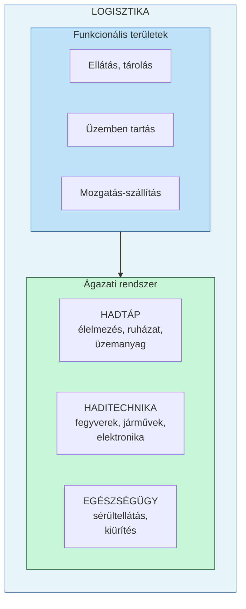
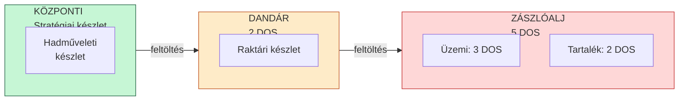
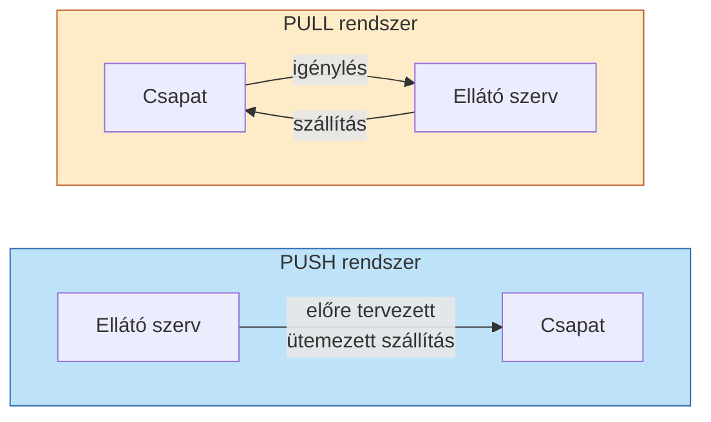
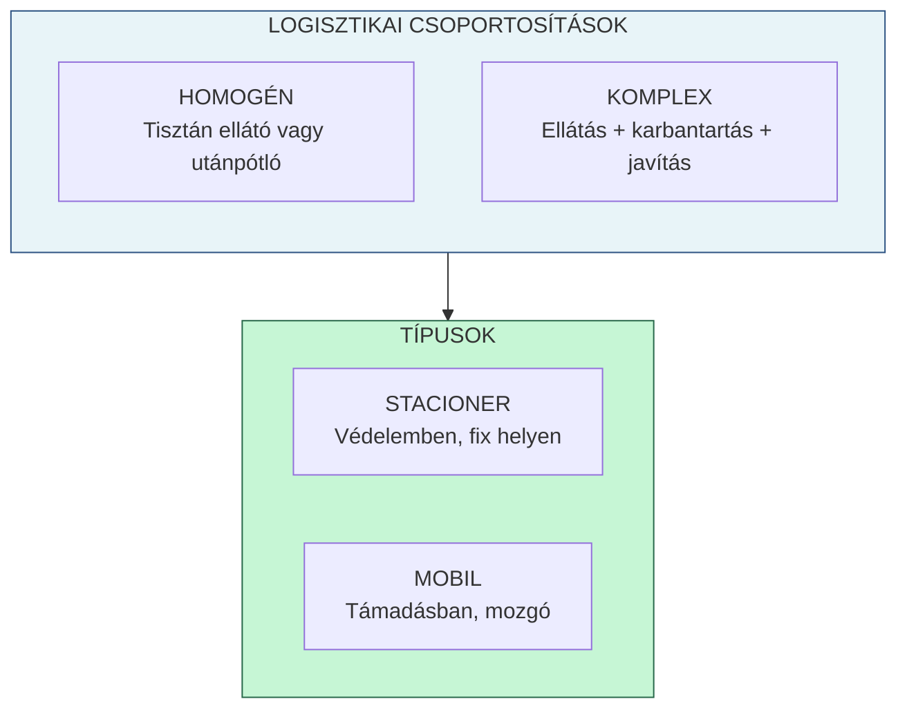
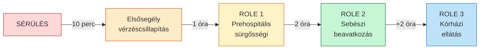
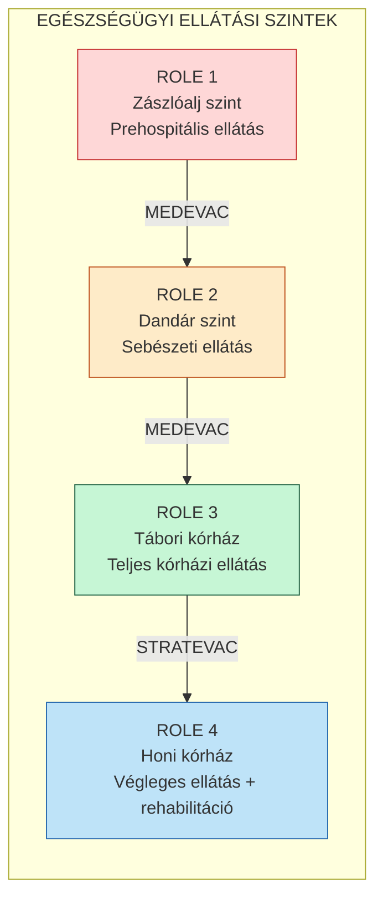
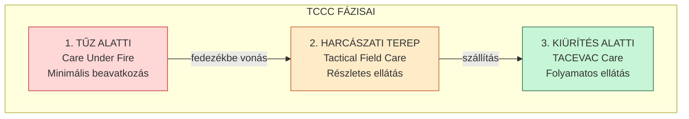
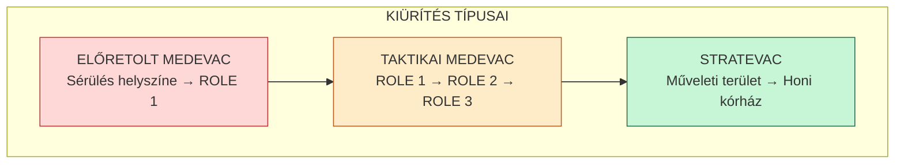

# HARCI KISZOLGÁLÓ TÁMOGATÁS
## Kivonat a törzsszolgálati vizsgához

---

# 1. LOGISZTIKA

## 1.1 Bevezetés – Miért fontos a logisztika?

**Egyszerűen fogalmazva:** A logisztika biztosítja, hogy a katonáknak legyen mit enniük, legyen üzemanyag a járműveikben, működjenek a fegyvereik és legyen utánpótlás – mindezt a megfelelő helyen és időben. Logisztika nélkül a legjobban kiképzett hadsereg sem tud harcolni.

> *„Az a tiszt, aki nincs tisztában a saját összeköttetésének és ellátásának rendjével ugyanúgy, mint a taktikájával, az teljesen haszontalan"* – George S. Patton tábornok

**Hivatalos definíció:** A logisztikai támogatás a harci kiszolgáló támogatás egyik alrendszere. Olyan szakirányú tevékenységek összessége, amelyek végrehajtása során a támogató logisztikai szervezetek a rendelkezésükre álló szakági képességekkel és igénybe vett polgári erőforrásokkal támogatják a műveleteket végrehajtó katonai szervezeteket.

---

## 1.2 A logisztikai támogatás alapelvei

**Közérthető magyarázat:** Ezek azok a szabályok, amelyeket minden logisztikai döntésnél figyelembe kell venni – a hadművelet sikere az elsődleges, de gazdálkodni kell az erőforrásokkal.

**A nyolc alapelv:**
1. **A műveletek elsődlegessége** – A harci feladat mindig fontosabb
2. **Egyszerűség** – Minél egyszerűbb a rendszer, annál megbízhatóbb
3. **Rugalmasság** – Alkalmazkodás a változó helyzethez
4. **Gazdaságosság** – Takarékos erőforrás-felhasználás
5. **Rendelkezésre állás** – Elérhetőség és elegendő mennyiség
6. **Fenntarthatóság** – Hosszú távú működőképesség
7. **Túlélőképesség** – A logisztikai rendszer védelme
8. **Felelősség** – Számonkérhetőség minden szinten

---

## 1.3 A logisztika felosztása

**Közérthető magyarázat:** A logisztika három nagy területre oszlik: az egyik a mindennapi ellátásról gondoskodik (hadtáp), a másik a technikai eszközökről (haditechnika), a harmadik pedig az emberek egészségéről (egészségügy).

### Hadtáp támogatás
A személyi állomány és technikai eszközök ellátása: élelmezés, üzemanyag, ruházat, térképészet.

### Haditechnikai támogatás
A technikai eszközök hadrafoghatóságának fenntartása: fegyverek, járművek, híradó eszközök karbantartása és javítása.

### Egészségügyi támogatás
A személyi állomány egészségének megőrzése és helyreállítása (részletesen lásd 2. fejezet).

---

## 1.4 Készletképzés és lépcsőzés

**Közérthető magyarázat:** A hadsereg nem tarthat mindent egy helyen – ehelyett több szinten, „lépcsőkben" tárolja a készleteket. A harcoló egységeknél van a legtöbb napi szükséglet, mögöttük a dandárnál a feltöltéshez szükséges tartalék.

### DOS – Day of Supply (Napi ellátmány)
Egy adott hadianyagból (pl. lőszer, üzemanyag) egy napra szükséges mennyiség, norma szerinti felhasználással számítva.

**Készletszintek összefoglalása:**
| Szint | Készlet | Rendeltetés |
|-------|---------|-------------|
| Zászlóalj | 5 DOS | Közvetlen harci felhasználás |
| Dandár | 2 DOS | Zászlóaljak feltöltése |
| Központi | Változó | Hadművelet teljes szükséglete |

---

## 1.5 PUSH és PULL ellátás

**Közérthető magyarázat:** Kétféleképpen lehet ellátni a csapatokat: vagy rendszeresen, ütemezetten szállítunk nekik (PUSH – „tolunk"), vagy megvárjuk, amíg kérnek (PULL – „húznak").

| PUSH (tolósík) | PULL (húzósík) |
|----------------|----------------|
| Előre tervezett | Igény alapján |
| Rendszeres ütemezés | Rugalmasabb |
| Nagyobb mennyiségek | Kisebb, célzott szállítások |

---

## 1.6 Élelmezési rendszerek

**Közérthető magyarázat:** A katonákat háromféleképpen lehet étkeztetni – központi főzéssel, helyi konyhán, vagy egyéni harci adagokkal.

| Rendszer | Leírás | Alkalmazás |
|----------|--------|------------|
| **A-rendszer** | Központi konyhán készített, kiszállított étel | Békeidő, stabil tábor |
| **B-rendszer** | Helyi konyhán, alapanyagból főzött étel | Tábori körülmények |
| **C-rendszer** | MRE – készen fogyasztható harci adag | Harc közben |

**MRE** (Meal Ready to Eat) = Azonnal fogyasztható harci élelmiszer-csomag.

---

## 1.7 Haditechnikai támogatás

**Közérthető magyarázat:** A haditechnika feladata, hogy a fegyverek, járművek és egyéb eszközök mindig működőképesek legyenek. Ha elromlik valami, a lehető leggyorsabban meg kell javítani.

**Céljai:**
- Technikai eszközök hadrafoghatóságának fenntartása
- Meghibásodott eszközök helyreállítása
- Készletek biztosítása a működéshez

**LUR** (Legközelebbi Utánpótlási Raktár) = Az a raktár, ahol a szükséges alkatrész készleten van és a legrövidebb idő alatt beszerezhető.

---

## 1.8 Menet logisztikai támogatása

**Közérthető magyarázat:** Amikor egy egység egyik helyről a másikra mozog, gondoskodni kell az üzemanyagról, a meghibásodások kezeléséről és a pihenőkről.

### A menet tervezésének elemei:
- **Napi menetteljesítmény:** 10 óra menetidő
- **Rövid pihenő:** 3-4 óránként, 1 óra
- **Hosszú pihenő:** A nap második felében, minimum 2 óra

### Technikai Zárórészleg (TZR)
A menetoszlop végén haladó csoport, amely:
- Segít a meghibásodott járműveken
- Vontatja a nem javítható eszközöket
- Egészségügyi és forgalomszabályozási feladatokat lát el

**Szabály:** Ha egy jármű 15-20 percen belül nem javítható, vontatni kell a következő pihenőig.

---

## 1.9 Tábori elhelyezés

**Közérthető magyarázat:** A tábor nem csak sátrak halmaza – gondosan meg kell tervezni, hol legyen a parancsnokság, hol a raktárak, hol pihenhetnek a katonák.

### A tábor övezetei:
1. **Parancsnoki és szolgálati övezet** – vezetés, irányítás
2. **Kiképzési, sport- és szabadidős övezet** – regenerálódás
3. **Technikai övezet** – járművek, karbantartás
4. **Raktárövezet** – anyagtárolás
5. **Elhelyezési övezet** – szálláshelyek
6. **Védelmi létesítmények** – óvóhelyek

### Táborhelyválasztás szempontjai:
- Kemény, száraz talaj
- Folyóvíz közelében, de árterületen kívül
- Közlekedési utak elérhetősége
- Elegendő hely minden funkcióra
- Álcázási lehetőség

---

## 1.10 Logisztikai csoportosítások

**Közérthető magyarázat:** A logisztikai erőket a harci helyzettől függően kell csoportosítani – lehet stacioner (egy helyben maradó) vagy mobil (mozgó).

---

## 1.11 Védelmi és támadó harc logisztikai támogatása

### Védelemben:
- Készletek előzetes felhalmozása
- Stacioner ellátópontok
- Tagozatos javító-vontató rendszer

### Támadásban:
- Mobil logisztikai elemek
- Készletek előre tolása a csapatokkal
- Rugalmas ellátási lánc

**Mindkét esetben két lépcsős alkalmazás:**
1. **Első lépcső:** Közvetlenül a harcoló alegységek mögött, kritikus anyagok
2. **Második lépcső:** Hátrébb, teljes ellátó és javító kapacitás

---

# 2. EGÉSZSÉGÜGYI BIZTOSÍTÁS

## 2.1 Az egészségügyi biztosítás fogalma

**Közérthető magyarázat:** Az egészségügyi biztosítás célja, hogy a sebesült vagy beteg katonák a lehető leggyorsabban megkapják a szükséges ellátást és visszatérhessenek a szolgálatba – vagy biztonságban eljussanak a kórházba.

**Hivatalos definíció:** Az egészségügyi biztosítás a haderő személyi állománya egészségének megóvása, helyreállítása érdekében végzett tervszerű, folyamatos tevékenység.

### Főbb területei:
- Megelőzés (prevenció)
- Egészségügyi kiürítés
- Gyógyítás
- Logisztikai biztosítás
- Kiképzés
- Kutatás és fejlesztés

---

## 2.2 Az időfaktor – A 10-1-2+2 szabály

**Közérthető magyarázat:** A sérült életben maradásának esélye drámaian csökken az idő múlásával. Ezért szigorú időkorlátokat határoztak meg: 10 percen belül elsősegély, 1 órán belül első ellátóhelyre, és így tovább.

| Időkeret | Ellátási szint | Cél |
|----------|----------------|-----|
| **10 perc** | Elsősegély | Vérzéscsillapítás, légútbiztosítás |
| **1 óra** | ROLE 1 | Prehospitális sürgősségi ellátás (DCR) |
| **2 óra** | ROLE 2 | Életmentő sebészet (DCS) |
| **+2 óra** | ROLE 3 | Stabilizáló, diagnosztikai ellátás |

---

## 2.3 Ellátási szintek az MH-ban

**Közérthető magyarázat:** Minden katona kap alapképzést elsősegélynyújtásból, de vannak speciálisan kiképzett „harctéri mentők" és természetesen egészségügyi szakemberek is.

| Szint | Ki végzi | Felszerelés |
|-------|----------|-------------|
| **Ön- és kölcsönös segély** | Minden katona | IFAK (egyéni elsősegély) |
| **Harctéri életmentő (HÉK/CLS)** | Kiképzett katona | CLS készlet |
| **Első szaksegély** | Egészségügyi altiszt | EEK II. |
| **Emelt szintű szaksegély** | Mentőtiszt | EEK I. |
| **Első orvosi segély** | Orvos | EEK I. |

**IFAK** (Individual First Aid Kit) = Egyéni elsősegélykészlet, amit minden katona magánál hord.

---

## 2.4 ROLE szintek

**Közérthető magyarázat:** A NATO-ban az egészségügyi ellátó létesítményeket szintek (ROLE-ok) szerint osztályozzák. Minél magasabb a szám, annál komplexebb ellátásra képesek.

### ROLE 1 – Zászlóalj egészségügyi központ
- **Hol:** Zászlóalj kötelékében, 3-5 km a harcérintkezéstől
- **Feladatok:** Elsősegély, stabilizálás, TRIAGE, kiürítésre előkészítés
- **Jellemző:** Gyorsan mobilizálható, sátras kialakítás

### ROLE 2 – Dandár egészségügyi szervezet
- **Hol:** Dandár szinten, harcterülettől távolabb
- **Feladatok:** Damage Control Surgery (életmentő sebészet), intenzív ellátás
- **Képességek:** Röntgen, ultrahang, labor, műtő, vérkészlet
- **Tartózkodás:** 1-2 nap

**Az MH ROLE 2 békeidőben Hódmezővásárhelyen állomásozik.**

### ROLE 3 – Tábori kórház
- Teljes körű kórházi ellátás
- CT, idegsebészet, fogászat
- Stacioner, nehezen telepíthető

### ROLE 4 – Honi kórház
- Végleges ellátás és rehabilitáció
- Pl.: Észak-Pesti Centrumkórház – Honvédkórház

---

## 2.5 TCCC – Taktikai Harctéri Sérültellátás

**Közérthető magyarázat:** A TCCC lényege, hogy az ellátást a harci helyzethez igazítjuk. Más a teendő, ha lőnek ránk, mint amikor már biztonságban vagyunk.

### 1. Tűz alatti ellátás (Care Under Fire)
- **Helyzet:** Aktív tűzharc
- **Teendő:** Tourniquet, fedezékbe vonás
- **Cél:** Túlélés, nincs idő részletes ellátásra

### 2. Harcászati terepen ellátás (Tactical Field Care)
- **Helyzet:** Nincs közvetlen tűzhatás
- **Teendő:** MARCHE protokoll szerinti ellátás
- **Cél:** Stabilizálás

### 3. Kiürítés alatti ellátás (TACEVAC)
- **Helyzet:** Szállítás közben
- **Teendő:** Folyamatos megfigyelés, ellátás
- **Cél:** Állapot fenntartása/javítása

### MARCHE protokoll
| Betű | Jelentés | Teendő |
|------|----------|--------|
| **M** | Massive hemorrhage | Életveszélyes vérzés csillapítása |
| **A** | Airway | Légút biztosítása |
| **R** | Respiration | Légzés ellenőrzése |
| **C** | Circulation | Keringés ellenőrzése |
| **H** | Hypothermia | Hővédelem |
| **E** | Everything else | Egyéb ellátás |

---

## 2.6 Egészségügyi kiürítés

**Közérthető magyarázat:** A sérültek szállításának két módja van: MEDEVAC (egészségügyi felszereléssel és személyzettel) és CASEVAC (bármilyen elérhető eszközzel, szükség esetén).

### MEDEVAC vs CASEVAC

| MEDEVAC | CASEVAC |
|---------|---------|
| Egészségügyi eszközzel | Bármilyen eszközzel |
| Szakképzett személyzet | Nem feltétlenül |
| Folyamatos ellátás | Korlátozott ellátás |
| Tervezett | Sürgősségi megoldás |

### Kiürítés típusai:

---

## 2.7 Kiürítési prioritások

**Közérthető magyarázat:** Nem mindenkit lehet egyszerre kiüríteni – a legsúlyosabb, de még menthető sérülteket viszik először.

| Prioritás | Kategória | Leírás | Időkeret |
|-----------|-----------|--------|----------|
| **P1** | URGENS | Életveszélyes, azonnali beavatkozás | < 12 óra |
| **P2** | ELSŐBBSÉGI | Sürgős, de nem életveszélyes | < 24 óra |
| **P3** | RUTIN | Stabil, halasztható | < 72 óra |

---

## 2.8 PECC – Beteg Kiürítést Koordináló Központ

**Közérthető magyarázat:** A PECC feladata, hogy minden sérült a megfelelő helyre jusson, optimálisan kihasználva a rendelkezésre álló szállítóeszközöket és kórházi kapacitásokat.

**Fő feladatai:**
1. Betegszállítás koordinálása
2. Betegek nyomon követése
3. Kapacitások nyilvántartása
4. Jelentések összegzése
5. Ágyszámok figyelése

---

## 2.9 Gyakori rövidítések

| Rövidítés | Jelentés | Magyar |
|-----------|----------|--------|
| **MEDEVAC** | Medical Evacuation | Egészségügyi kiürítés |
| **CASEVAC** | Casualty Evacuation | Sérültszállítás |
| **TCCC** | Tactical Combat Casualty Care | Harcászati sérültellátás |
| **TRIAGE** | - | Betegosztályozás |
| **DCR** | Damage Control Resuscitation | Prehospitális sürgősségi |
| **DCS** | Damage Control Surgery | Életmentő sebészet |
| **IFAK** | Individual First Aid Kit | Egyéni elsősegélykészlet |
| **CLS** | Combat Life Saver | Harctéri életmentő |
| **MEDAD** | Medical Adviser | Egészségügyi tanácsadó |
| **MTF** | Medical Treatment Facility | Egészségügyi ellátó létesítmény |
| **KIA** | Killed in Action | Harcban elesett |
| **WIA** | Wounded in Action | Harcban sebesült |

---

## Összefoglaló táblázat

### Logisztika kulcsszámok
| Elem | Érték |
|------|-------|
| Zászlóalj lőszerkészlet | 5 DOS |
| Dandár lőszerkészlet | 2 DOS |
| Napi menetteljesítmény | 10 óra |
| Rövid pihenő gyakorisága | 3-4 óránként |

### Egészségügy időfaktorok
| Fázis | Időkeret |
|-------|----------|
| Elsősegély | 10 perc |
| ROLE 1 elérése | 1 óra |
| ROLE 2 (sebészet) | 2 óra |
| ROLE 3 elérése | +2 óra |

---

*Készült a Magyar Honvédség Harci Kiszolgáló Támogatás tananyaga alapján*
*Szerző: Pályi József alezredes*
