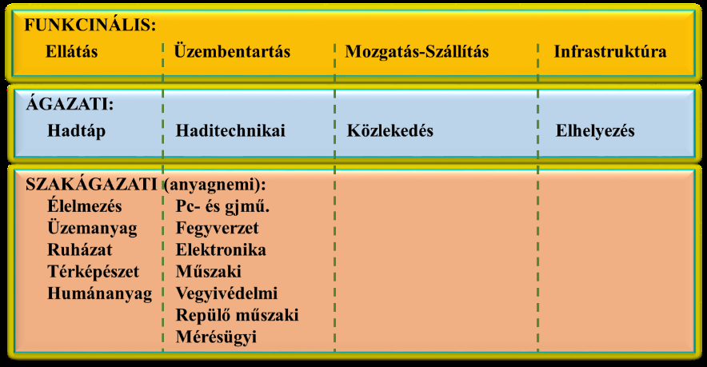
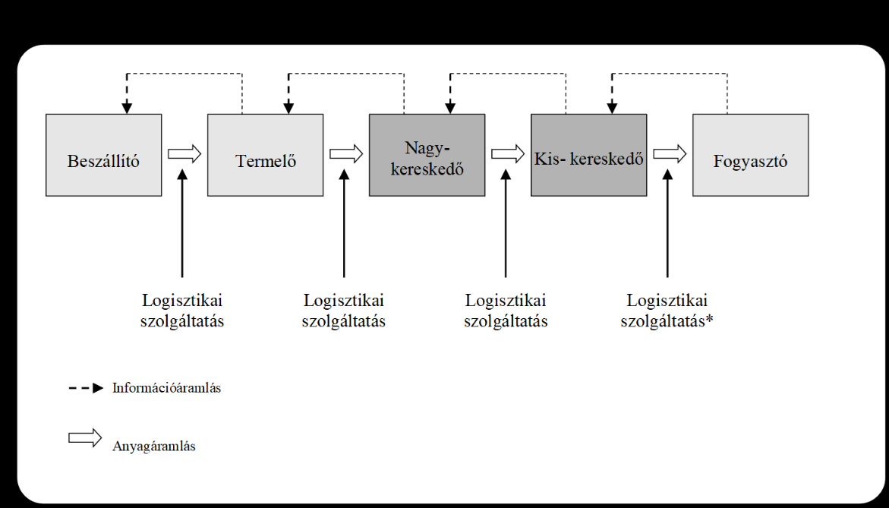
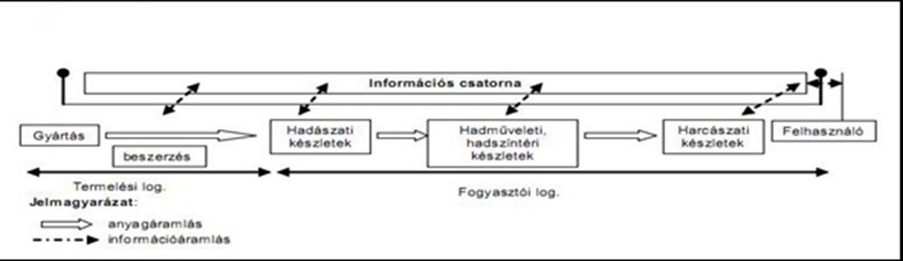
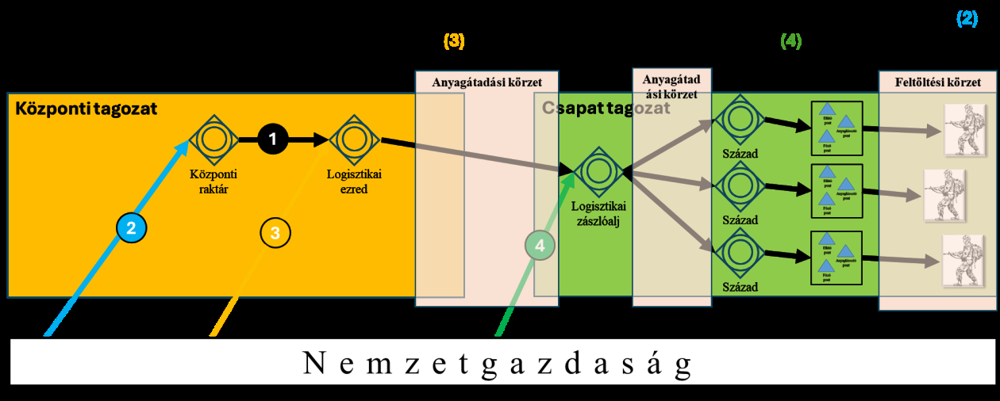
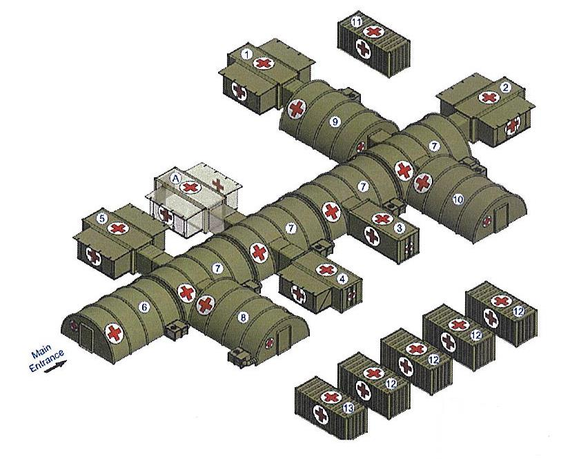

# 5 HARCI KISZOLGÁLÓ TÁMOGATÁS

## 5.1 LOGISZTIKA

„Gentlemen, the officer who doesn't know his communications and supply as well his tactics is totally useless." General George S. Patton[^114]

"Uraim, az a tiszt, aki nincs tisztában a saját összeköttetésének és ellátásának rendjével ugyanúgy, mint a taktikájával, az teljesen haszontalan"[^115]

### 5.1.1 Előszó

A mai modern, folyamatosan változó világ, a biztonság változása, és a változásokra adott válaszok eredményeként bekövetkező töretlen technológia fejlődést követve a Magyar Honvédség logisztikai támogató rendszere is folyamatos változáson megy keresztül. Ez a katonai szervezeteknél, a csapattagozatban szolgálatot teljesítő törzstisztektől megköveteli a saját szakmai területükre vonatkozó széleskörű és alapos ismeretek mellett a logisztikai szakterület működésére, a logisztikai támogatásra vonatkozó néhány alapismeret megismerését is. A logisztikai támogatás a katonai szolgálat minden területén hozzájárul a feladatok sikeres, eredményes végrehajtásához a szükséges anyagok, hadfelszerelések és szolgálatások nyújtásán, valamint az alkalmazott haditechnikai eszközök hadrafoghatóságának biztosításán keresztül.

Az alábbi tananyag az MH alaprendeltetését figyelembe véve, a gyakorlatban is megjelenő feladatok köré csoportosítva, az adott területhez kapcsolódó, fontosabb logisztikai támogatási ismeretek alapjait foglalja össze, hivatkozva a jelenleg érvényben lévő szakma anyagok tartalmára. Az utóbbi években a Magyar Honvédségben zajló haderőfejlesztés eredményei, illetve a hozzá kapcsolódó szervezeti változásokat is figyelembe véve a tananyag a logisztikai támogatás alapjaira fókuszál, amelyek várhatóan a változó körülmények között is érvényesek maradnak. A zászlóaljtörzsekben dolgozó törzstisztek számára megteremtve annak lehetőségét, hogy a törzsmunka saját szakterületükre vonatkozó feladatainak végzésekor értsék, hogy az milyen hatással van a logisztikai támogatásra, illetve megtudják fogalmazni a logisztikai támogatásra vonatkozó követelményeiket. A logisztikai támogatási tevékenység a harckiszolgáló tevékenység szerves részét – az adminisztratív támogatással és az egészségügyi biztosítással együtt – képezi.

A tananyag mottójának tartalma napjainkban is igaz. Arra hívja fel a figyelmet, hogy a katonai műveletek szervezésekor és végrehajtásakor ugyanolyan fontos az összeköttetés és az ellátás rendjének ismerete. A katonai logisztikai ismeretek alapjainak összefoglalásával a tananyag ehhez járul hozzá.

[^114]: George Smith Patton tábornok (1885.11.11-1945.12.21) az Amerikai Egyesült Államok Hadseregének négycsillagos tábornoka, a II. világháború alatt a földközi-tengeri hadszíntéren az USA 7. hadseregének, majd Franciaországban és Németországban a 3. hadseregének parancsnoka volt. Kulcsszerepet viselt a normandiai partraszállásban, kiváló stratégiai érzékkel tiszteletet vívott ki az alárendeltjei és ellenfelei között, szigorú és szókimondó stílusával sok ellenségeket is szerzett magának. Napjainkban is ismert és kedvelt második világháborús amerikai tábornok.

[^115]: Fordította: Pályi József alezredes

### 5.1.2 Logisztikai támogatás alapelvei, funkcionális és ágazati felosztás, logisztikai gazdálkodás

#### 5.1.2.1 A logisztika támogatás alapjai

A logisztikai támogatás doktrinális alapjait a Magyar Honvédség (MH) összhaderőnemi Logisztikai Doktrína 3. kiadása (MH ÖLD 3.) rögzíti. A doktrína tartalma alapján az MH logisztikai támogatási rendszerének lehetővé kell tennie a szövetségi kötelékben megvalósuló katonai műveletek hazai és külhoni támogatását. A harci kiszolgáló támogatást megvalósító logisztikai szervezetek magukban foglalják a katonai logisztika valamennyi szakterületét, szintjüknek megfelelően képesek mind nemzeti, mind többnemzeti logisztikai erőforrások felhasználására és az azok biztosító szervezetekkel való együttműködésre. (MH ÖLD(3), p.1-3.)

A logisztikai támogató rendszer elemei béke időszakban (alaphelyzet) csökkentett kapacitással, különleges jogrend időszakában a művelethez szükséges megnövelt, vagy teljes kapacitással működnek. A logisztikai támogatás, a katonai műveletek támogatási rendszerén belül, a harci kiszolgáló támogatás egyik alrendszerét képezi. Olyan szakirányú tevékenységek összessége, amelyek végrehajtása során a támogató logisztikai szervezetek a rendelkezésére álló szakági képességekkel és igénybevett polgári erőforrásokkal támogatják a műveleteket végrehajtó katonai szervezeteket alaprendeltetésük végrehajtása közben. (MH ÖLD(3), p.1-4.)

A katonai műveletekhez szükséges hadfelszerelés biztosításával, a készletek megalakításával és lépcsőzésével, utánpótlásával; a haditechnikai eszközök hadrafoghatóságának fenntartásával, az üzemeltetés során meghibásodott vagy harci sérülést szenvedett haditechnikai eszközök helyreállításával; a közlekedési és szállítási szükségletek; valamint az elhelyezési igények kielégítésével fenntartja a katonai szervezetek harci képességeit. (MH ÖLD(3), p. 1-4.)

**A logisztikai támogatás alapelvei:**

- a műveletek elsődlegessége;
- az egyszerűség;
- a rugalmasság;
- a gazdaságosság;
- a rendelkezésre állás (elérhetőség és elégségesség);
- a fenntarthatóság;
- a túlélőképesség;
- a felelősség. (MH ÖLD(3), pp. 1-5 – 1-10.)

A logisztikai támogatás tervezése a katonai művelettervezés szerves részeként, olyan értékelő-elemző, döntés-előkészítő és döntési folyamatok összesége, amelyek a katonai műveletek logisztikai szükségleteinek meghatározása, a szükségletek kielégítésére, valamint a logisztikai szervezetek hatékony alkalmazására irányulnak. Ennek a folyamatnak kulcseleme a logisztikai ellátási lánc kialakítása és folyamatos működésének biztosítása a katonai szervezetek készletszintjének fenntartása érdekében. (MH ÖLD(3), p. 3-13.)

A tervezési folyamat eredményeként jóváhagyott logisztikai támogatási terv kidolgozását végző törzseknek a saját képességeikről szóló adatbázisban minimálisan tartalmazniuk kell a:

- a katonai szervezetek anyagi-technikai harcértékét;
- a nemzetgazdaságból igényelt és tervezetten biztosításra kerülő erőforrásokat;
- a közlekedési képességeket és kapacitásokat;
- a javító-vontató kapacitásokat;
- a Befogadó Nemzeti Támogatás (BNT) lehetőségeit, kapacitásait;
- a katonai infrastrukturális-elhelyezési lehetőségeket és szükségleteket;
- a logisztikai vezetési struktúrát. (MH ÖLD(3), p. 3.15)

#### 5.1.2.2 A logisztikai támogatás funkcionális és ágazati felosztása

A logisztikai támogatás rendeltetése a katonai szervezetek feladatainak ellátáshoz a szükséges eszközök, anyagok és készletek, valamint szolgáltatások megfelelő időben, költségen, helyen, mennyiségben és minőségben álljon rendelkezésre. Ennek érdekében a logisztikai támogató rendszer biztosítja a személyi állomány ellátását, munka- és elhelyezési feltételeit, a technikai eszközök hadrafoghatóságát és üzemeltetését, az anyagi készletek hadihasználhatóságát, a közlekedési hálózatok katonai igénybevételét, valamint a rendelkezésre álló erőforrások hatékony felhasználását. (MH ÖLD(3), p. 4-1.)

Az MH ÖLD(3) pontosan meghatározza a logisztikai támogatás 1. számú ábrán látható funkcionális területeit. A funkcionális felosztással összhangban az egyes területek feladatait megvalósító ágazati rendszer működik, amely magába integrálja az ábrán jelzett a szakágakat. (MH ÖLD(3), p. 4-1.)

[^116]

**Funkcionális felosztás:**

Az ellátás, tárolás mindazon tevékenységeket, rendszabályokat és folyamatokat foglalja magában, amelyek biztosítják a katonai szervezetek működéséhez szükséges eszközök, anyagok és szolgáltatások megfelelő időben, helyen mennyiségben, minőségben és formában való rendelkezésre állását. Az ellátás elemeit a készletképzés, felhasználás, frissítés és pótlás (feltöltés) képzik. Ezek alapját a szükségleti és ellátási számvetések, prognózisok és a felhasználás szabályozása képezi. Az ellátás alapfeladatai közzé a szükségletek megállapítása, a rendelkezésre álló források ismerete, a beszerzés tervezése, a tárolás, a készletgazdálkodás, az anyagmozgatás, a rakományképzés, a szállítás, a felhasználáshoz történő előkészítés, az elosztás, a nyilvántartás és a selejtezés tartoznak. Az ellátás a „Tőlem (Push)" vagy „Hozzám (Pull)" elv alapján, a készletek elöljáró általi kiszállítás vagy vételezés, illetve a kettő kombinálásának módszerével valósulhat meg. Az ellátás feladataihoz, stratégiai (központi), hadműveleti és harcászati szintű készleteket alakítanak meg (készletképzés).

Az üzemben tartás a haditechnikai eszközökre irányuló üzemfenntartási tevékenységek együttese a katonai szervezetek előírt technikai hadrafoghatóságának fenntartása érdekében, célja a katonai műveletek előkészítéséhez és végrehajtásához szükséges technikai eszközök meghatározott hadrafoghatósági szintjének fenntartása. Magában foglalja az üzemeltetési körülmények és az igénybevételi mutatóinak elemzését, a technikai kiszolgálást és javítást, a harci alkalmazásra való felkészítést, az eszközveszteségek, illetve a harcanyag felhasználás prognosztizálását, a megsérült és meghibásodott haditechnikai eszközök helyreállítását.

Az üzemfenntartás azon tevékenységek összessége, amelyeket a technikai eszközök üzemeltetése és tárolása alatt a technikai eszköz technikai hadrafoghatóságának, üzemkészségének (készletteljességének és megbízható működésének) érdekében végeznek, célja a haditechnikai eszközök állagmegóvásának, folyamatos üzemképességének (technikai hadrafoghatóságának) és megfelelő technikai állapotának fenntartása, üzemeltetési tartalékának visszaállítása, illetve eredeti állapotot megközelítő helyreállítása.

A helyreállítás alatt az üzemképtelen, meghatározott üzemeltetési normáját (elhasználódási szintjét) elért haditechnikai eszközök üzemképességének (technikai hadrafoghatóságának) vagy javítási közi normatartalékának helyreállítására irányul, amely magában foglalja a vontatást is. A helyreállítási folyamat főbb elemei a technikai felderítés, vontatás, szállítás a javítás helyszínére, a javítás, valamint a üzemeltetőhöz való visszajuttatás, vagy újraelosztás. (MH ÖLD(3), pp. 4-11 – 4.18.)

A mozgatás-szállítás keretében a csapatok, haditechnikai eszközök és anyagok mozgatásának és szállításának tervezése, szervezése és végrehajtása valósul meg. A mozgatás, szállítás a katonai és polgári szervek a felvonulási, átcsoportosítási, utánpótlási, hátraszállítási és az erők visszavonási (kivonási) tevékenységeinek összessége, amelyet országhatáron belül, vagy kívül, egységes elgondolás és terv alapján végeznek. Ez magában foglalja a közlekedési hálózat igénybevételének tervezési és szervezési feladatait, a katonai mozgások és szállítások tervezését, szervezését, a szállító-, rakodó-, forgalomszabályzó-, szállítmánykísérő erők és eszközök felkészítését, alkalmazásuk megtervezését, valamint a végrehajtás irányítását, koordinálását, szabályozását, felügyeletét. A mozgatás-szállítás tervezésének alapadatai közzé tartoznak a végrehajtandó feladat és a parancsnoki szándék, a távolság és rendelkezésre álló időkeret ismerete, a végrehajtó csoportosítások és a forgalomszabályzó (FOSZAB) erők meghatározása, a csapatmozgást követő tevékenység, a szemben álló fél képességei, a rendelkezésre álló úthálózat adatai, a terep és időjárás hatásai, a területet érintő polgári közlekedés hatásai, valamint az úthálózat javítási, berendezési és karbantartási igényei. (MH ÖLD(3), p. 4-18.)

**Ágazati rendszer:**

A hadtáp támogatás tevékenységei a katonai szervezetek (személyek és haditechnikai eszközök) élelmezési, üzemanyag, ruházati, humán és térképészeti szakanyaggal, valamint fenntartási anyag biztosítására, a harckiszolgáló eszközök üzemfenntartására, új eszközök és anyagok rendszerbe állítására, kivonására, a személyi állomány ellátása, illetve a hadtáp szaktechnikai eszközök technikai kiszolgálása érdekében szolgáltatások nyújtására és igénybevételére irányulnak.

A hadtáp támogatás alapvetően a logisztika hadtáp anyagi, ellátási, üzemfenntartási, szolgáltatási, gazdálkodási funkcióit végzi. A hadtáp támogatás szakágai, anyagnemei az élelmezési biztosítás, üzemanyag biztosítás, ruházati biztosítás, humánanyag biztosítás és a térképészeti anyagbiztosítás. (MH ÖLD(3), p. 5-1.)

A haditechnikai támogatás tevékenységei a katonai szervezetek páncélos- és gépjármű-technikai, fegyverzeti, elektronikai, repülő-műszaki technikai, műszaki, vegyvédelmi, mérésügyi szaktechnikai eszköz, valamint szakanyag, és fenntartási anyag biztosítására, illetve a technikai eszközök üzemfenntartására, új eszközök és anyagok műszaki követelményeinek kidolgozására, rendszerbe állítására, kivonására, valamint a szaktechnikai eszközök kiszolgálása érdekében szakmai tevékenység nyújtására és igénybevételére irányulnak.

A haditechnikai támogatás alapvetően a technikai eszközök üzemeltetéséhez és használatához szükséges anyagi, ellátási, üzemfenntartási, szolgáltatási, gazdálkodási funkcióit végzi. A haditechnikai támogatás szakágai, anyagnemi közzé tartozik a páncélos- és gépjármű-technikai biztosítás, a fegyverzettechnikai biztosítás, az elektronikai biztosítás, a műszaki technikai biztosítás, a vegyivédelmi technikai biztosítás, a repülő-műszaki biztosítás, és a mérésügyi biztosítás. (MH ÖLD(3), p. 5-6.)

A közlekedési támogatás keretében a katonai szervezetek, technikai eszközök és anyagok mozgatásának és szállításának tervezése, szervezése és végrehajtása történik. Célja a polgári és a katonai közlekedési- és szállítási kapacitások integrált rendszerben történő alkalmazásával a csapat-, személy-, eszköz és anyagszállításoknak a stratégiai-hadműveleti- és harcászati igényekhez igazodó végrehajtásával biztosítsa a katonai műveletek közlekedési-, szállítási szükségleteinek kielégítését. Szakfeladatai közzé tartoznak a közlekedés támogatás megvalósításához szükséges katonai és polgári közlekedési hálózatok, erőforrások kijelölése, felkészítése, üzemeltetése, technikai oltalmazása és a helyreállítása. (MH ÖLD(3), p. 5-15.)

A katonai elhelyezési és infrastrukturális támogatás tevékenységei a honvédségi szervezetek munkahelyi, pihenő és szakjavító épületeinek kialakítására, az energia ellátás és a közmű szolgáltatások szakanyaggal és fenntartási anyaggal történő biztosítására, az épületek és az infrastrukturális hálózatok karbantartása, valamint szakanyagok és technikai-eszközök üzemképesség fenntartása érdekében szakmai tevékenység nyújtására és igénybevételére irányulnak. (MH ÖLD(3), p. 5-11.)

A logisztikai támogatás területén végzett feladatokhoz szorosan kapcsolódik a logisztikai gazdálkodás feladatrendszere.

**Készletképzés és készletlépcsőzés:**

A harcászati (csapat) készletek: katonai szervezeteknél, a létszám és a haditechnikai eszközállomány függvényében, a várható harcászati igényekhez igazodó mennyiségben megalakított és mobilizálható hadianyag készletek, amelyek a harcászati igények kielégítésére szolgálnak, és lehetővé teszik a csapatok állandó hadrafoghatóságát, meghatározott szintű és mértékű autonómiáját.

A harcászati, vagy csapatkészletben megalakított készleteket a katonai szervezetet alkotó alegységek között a készletlépcsőzés keretében osztjuk el. Így kialakítva a zászlóalj és dandár készleteket.

**A zászlóalj készlet:** a zászlóalj készletek a századoknál, ütegeknél, a harcjárművekben, a harcoló állománynál, a tűzeszközök mellett, illetve a zászlóalj ellátó szervezeteinél megalakított anyagi készletek. A zászlóalj készletek a műveletek során keletkező szükségletek közvetlen kielégítésére szolgáló, mobilizáltan megalakított mobilizált készletek. A zászlóalj készletek 5 átlagos napi felhasználást (5 DOS[^117]) fedeznek.

**A dandár készlet:** a dandár (ezred) készletek, a dandár (ezred) logisztikai alegységeinél, az ellátó szervezetek raktáraiban megalakított, mobilizálható anyagi készletek. A dandár (ezred) készletek a zászlóaljak, (osztályok) anyagi szükségleteinek kielégítésére, a zászlóalj raktári készletek pótlására szolgáló mobilizált anyagok és technikai eszközök. A dandár (ezred) készletek a katonai műveletek során a szervezettszerű alegységek 2 átlagos napi felhasználásnak (2 DOS) megfelelő hadfelszerelést tartalmaznak.

Tárolás az ellátási folyamat azon eleme, amely meglévő anyagok és eszközök raktárakban, tárolóhelyeken végezve azok állagmegóvására, megőrzésére és rendszerezésére irányul az előírt technológiai előírások betartása mellett. (MH ÖLD(3), pp. 4-2 – 4.10.)

[^118]

[^116]: Forrás: MH ÖLD (3) alapján készítette a szerző

[^117]: Day Of Supply

[^118]: Forrás: Az MH ÖLD(3) alapján szerkesztette a Pályi József alezredes

#### 5.1.2.3 A logisztika gazdálkodás alapjai

A logisztikai gazdálkodás, mint funkcionális terület a logisztikai támogatás végrehajtásához szükséges erőforrások tervezését és a lebiztosított erőforrások célirányos, tervszerű, költséghatékony és elszámoltatható felhasználását jelenti. A logisztikai gazdálkodás a honvédség logisztikai támogatásához, a hadfelszerelés rendszerbe állításához, rendszerben tartásához, rendszerből történő kivonásához, az ingatlanállomány kezeléséhez és fenntartásához kapcsolódó gazdasági feladatok tervezésére, szervezésére, irányítására és működtetésére és ellenőrzésére terjed ki. (MH ÖLD(3), pp. 4-20 – 4-28.)

A logisztikai gazdálkodás, mint funkcionális terület a logisztikai támogatás végrehajtásához szükséges erőforrások tervezését és a lebiztosított erőforrások célirányos, tervszerű, költséghatékony és elszámoltatható felhasználását jelenti. A logisztikai gazdálkodás a honvédség logisztikai támogatásához, a hadfelszerelés rendszerbe állításához, rendszerben tartásához, rendszerből történő kivonásához, az ingatlanállomány kezeléséhez és fenntartásához kapcsolódó gazdasági feladatok tervezésére, szervezésére, irányítására és működtetésére és ellenőrzésére terjed ki. A logisztikai gazdálkodás – a különböző vezetési szinteken tagozódott – anyagnem felelős ágazati szervezetek, személyek gazdálkodási tevékenységének összessége.

**A logisztikai gazdálkodás módszerei:** a logisztikai gazdálkodás folyamatában alkalmazott módszerek az értékelemzés, a költségelemzés, a kockázatelemzés és a strukturált döntésanalízis. A módszerek a logisztikai folyamatok elemzése során alkalmazhatók külön-külön, illetve komplex módon.

- **Értékelemzés:** az értékelemzés egy döntés előkészítő vezetéstechnikai módszer, amely a döntés hatékonyságának javítását, az információk teljes körű felmérésével, optimalizált modell felállításával szolgálja.
- **Költségelemzés:** az erőforrások előállítása, elosztása, valamint a felhasználókhoz való eljuttatása, pénzben kifejezhető költséget okoz. A költségelemzés nem más, mint a döntés (választás) összetett problémájának egy megközelítési módja. A költségelemzés egy eljárási sorrend, melynek során felbecsüljük és felsoroljuk a megkövetelt erőforrásokat, amelyek egy új képesség előállításához szükségesek.
- **Kockázatelemzés:** a kockázatok (politikai, gazdasági, humán erőforrás) beazonosítása, csoportosítása, azok értékelése, elemzése, kezelése a figyelemmel kísért folyamatokkal kapcsolatban.
- **Strukturált döntésanalízis:** a döntés eszközeinek választ kell adniuk a perspektivikus lehetőségek és a valóság közötti különbségre. A strukturált döntés analízis az általános döntési folyamat része. A döntési folyamat a következő részfolyamatokból épül fel: célok azonosítása, a célok közötti konfliktus meghatározása, strukturált döntés analízis, a terv célkitűzése, alternatív védelmi tervek elkészítése.

A honvédelmi szervezet pénzügyi és számviteli feladatainak ellátása intézményi és – külön szabályozott területeken – központi gazdálkodás és ellátás keretében valósul meg. (20/2021. (V. 19.) HM utasítás)

A honvédelmi szervezet könyvvezetését, előirányzat-felhasználási keretforgalmának kezelését, egyes pénzügyi ellenjegyzési feladatait a HM Védelemgazdasági Hivatal (a továbbiakban: HM VGH) központi ellátás keretében végzi.

A honvédelmi szervezet – Áht. 80. § (2) bekezdése szerint a Magyar Államkincstár (a továbbiakban: Kincstár) által kiadott, a forintszámla-vezetési szolgáltatásokról szóló szabályzatban meghatározott – kincstári számláinak megnyitásával, módosításával és megszüntetésével kapcsolatos, továbbá az egyéb, az irányító szerv feladatkörébe tartozó teendőket a HM VGH látja el. A honvédelmi szervezet pénzforgalma kizárólag a Kincstár által vezetett számlákon, a pénztárban és a pénzkezelő helyen bonyolítható.

A honvédelmi szervezet készletéből történő büfé és éttermi vendéglátás keretében megvalósuló személyi és rendezvényi reprezentációs normák felhasználása kivételével a honvédelmi szervezetek egymás részére nem számlázhatnak, a nyújtott szolgáltatás vagy termékértékesítés ellenértékét a szolgáltatást nyújtó vagy a terméket átadó honvédelmi szervezet részére előirányzat-átcsoportosítással kell biztosítani.

**A logisztikai gazdálkodás magában foglalja:**

a) a honvédelmi szervezet feladatainak végrehajtásához szükséges, – a 99-es pénzügyi és számviteli anyagnem kivételével – az anyagnemekhez tartozó eszközök és szolgáltatások tervezését, beszerzését, felhasználását, és elszámolását, az eszközök kutatás-fejlesztését, rendszerbe kerülését, üzemben tartását, nyilvántartását, készletezését, tárolását, leltározását, kezelését, felhasználását, kategorizálását, rendszerből történő kivonását, selejtezését, a kiselejtezett eszközök hasznosítását, megsemmisítését, a veszélyes anyagok kezelését, ellenőrzését,

b) az a) pont szerinti területekhez kapcsolódó szabályozók és analitikus nyilvántartási rendszer kidolgozását, a logisztikai gazdasági műveletek, folyamatok megtervezését, végrehajtását, és

c) a főkönyvi nyilvántartások megalapozása érdekében analitikus nyilvántartások vezetését – ideértve az előirányzatoknak, a követeléseknek, valamint a kötelezettségvállalásoknak a főkönyvi nyilvántartásokban nem szereplő további részletező nyilvántartásait is –, valamint a gazdasági események összességének elszámolását és a beszámolást.

A honvédelmi szervezet költségvetési gazdálkodása logisztikai szakterületen intézményi gazdálkodás, valamint központi gazdálkodás és ellátás keretében valósul meg.

A logisztikai gazdasági szervvel nem rendelkező honvédelmi szervezet intézményi logisztikai ellátását a HVK által évente összeállított és a HM KÁT által kiadott logisztikai utaltsági rend (a továbbiakban: LUR) szerint kijelölt honvédségi szervezet végzi.

A LUR karbantartását, évközi módosításainak átvezetését és a módosítások kiadását – amennyiben a módosítás nemcsak honvédségi szervezetet érint, a HM KÁT egyetértésével – a HVK végzi.

A honvédségi szervezet egyes feladatainak végrehajtásához kapcsolódóan szükségessé váló, LUR-tól való eseti eltéréseket a HVKF engedélyezhet. Az eseti eltérések engedélyezése során annak tartalmát és időtartamát minden esetben meg kell határozni.

A honvédelmi szervezet feladatai végrehajtásához szükséges, a központi ellátás körébe tartozó eszközöket és szolgáltatásokat a LUR szerint kijelölt központi logisztikai ellátó honvédségi szervezet – normák és normatívák alapján meghatározott keretek terhére vagy igénylés alapján – biztosítja.

A LUR intézményi és központi ellátási szinten a HM költségvetési fejezet egészére anyagnemenként és szaktevékenységenként határozza meg az ellátó és ellátott honvédelmi szervezet kapcsolatát.

Ha a honvédelmi szervezet vagy valamely szervezeti egysége a logisztikai ellátást szervezetileg biztosító honvédségi szervezettől távol települ, ahhoz a honvédségi szervezethez kerül intézményi logisztikai ellátási utalásra, amely az ellátást a leggazdaságosabb módon tudja biztosítani.

A LUR keretében biztosítható azon honvédelmi szervezetnek az egyes szakanyagokkal, szolgáltatásokkal való ellátása is, amely rendelkezik logisztikai gazdasági szervezettel, azonban egyes anyagnemek vonatkozásában a gazdálkodás részfolyamatai, a gazdaságosság követelményének figyelembevételével nem teszik indokolttá a teljes körű önálló logisztikai gazdálkodást.

Az MH logisztikai gazdálkodásának részletes szabályait a HVKF belső rendelkezésekben határozza meg.

Az MH szintű logisztikai gazdálkodás megszervezése és végrehajtása szakmai elöljárói rendszerben történik. A szakmai elöljárókat a HVKF jelöli ki.

A honvédelmi szervezet infrastrukturális biztosítását központi ellátás keretében a HM VGH végzi.

**A honvédelmi szervezet vezetőjének alapvető költségvetési gazdálkodási feladatkörébe tartozik:**

a) a gazdálkodás követelményeinek, aktuális célkitűzéseinek – a rendelkezésre álló költségvetési kereteken belül történő – meghatározása,

b) a honvédelmi szervezet feladatai ellátásához szükséges költségvetési igények felmérése,

c) a költségvetési javaslat elkészítése,

d) a jóváhagyott költségvetési előirányzatok gazdaságos, hatékony és eredményes felhasználására irányuló intézkedések kiadása és azok végrehajtásának ellenőrzése,

e) a költségvetési előirányzat-átcsoportosítási jogkör gyakorlása, továbbá javaslattétel a hatáskörét meghaladó előirányzat-átcsoportosításra,

f) a gazdálkodásról szóló költségvetési zárszámadáshoz kapcsolódó adatszolgáltatás jóváhagyásra történő felterjesztése,

g) az együttműködés az ellátó, illetve az ellátott honvédelmi szervezet vezetőjével,

h) az eszközök és források év végi értékelése, a behajthatatlan követelések minősítése és

i) a selejtezés, leltározás előkészítésének és végrehajtásának elrendelése.

**A honvédelmi szervezet vezetője felelős:**

a) a honvédelmi szervezet személyi állományának jogszabályban meghatározott ellátásáért,

b) a költségvetés tervezésével, az előirányzatok módosításának, átcsoportosításának és felhasználásának végrehajtásával és a beszámolással kapcsolatos feladatok teljesítéséért, a beszámoló tartalmáért, megfelelőségéért,

c) a hatáskörébe tartozó számviteli, adatszolgáltatási feladatok végrehajtásáért,

d) az ellenőrzés által feltárt hiányosságok megszüntetéséért és

e) a gazdálkodás során szerzett tapasztalatok gyűjtéséért, feldolgozásáért és felhasználásáért.

A központi logisztikai ellátó szervezetek a gazdálkodási feladataikat az MH felső- és középirányításért felelős szervezeteinek szakmai irányításával végzik.

**A központi logisztikai ellátó szervezetek hajtják végre:**

a) a Beszerzési utasításban hatáskörükbe utalt eszközök és szolgáltatások beszerzését,

b) a központi logisztikai gazdálkodás során a jóváhagyott elemi költségvetésük és a megkötött szerződések alapján a kapcsolódó ellenőrzési, vagyonbavételi és kifizetési feladatokat,

c) a készletek, valamint a technikai eszközök átvételével, értékelésével, készletezésével, fejezetszintű központi, valamint a központi készleteket érintő intézményi nyilvántartásával, tárolásba helyezésével vagy kiadásával, karbantartásával és frissítésével, állagmegóvásával, időszakos felülvizsgálatai végrehajtásával, rendeltetésszerű használatra való alkalmassága fenntartásával és honvédelmi célra feleslegessé nyilvánításának előkészítésével, az elszámolásokkal, az ártalmatlanítással kapcsolatos feladatokat,

d) a HM vagyonkezelésébe tartozó, honvédelmi célra feleslegessé vált ingó vagyonelemek kezelésével kapcsolatos hatáskörükbe tartozó feladatokat, a veszélyes anyagok műszaki ellenőrzését, laboratóriumi és szavatossági vizsgálatokat, valamint a kijelölt veszélyes anyagok, a hadfelszerelés tárolásközi kiszolgálását és

e) a kommunikáció technikai feltételeinek biztosítását, a távközlő hálózat üzemeltetését és felügyeletét, valamint a részükre meghatározott egyéb feladatokat.

**Az ellátó honvédségi szervezet:**

a) az ellátott honvédelmi szervezet részére költségvetési előirányzatokat tervez minden ellátásba vont anyagnem tekintetében az ellátott honvédelmi szervezet vezetőjének bevonásával,

b) a rendelkezésre álló erőforrásokat figyelembe véve biztosítja az ellátott honvédelmi szervezet által igényelt anyagokat, eszközöket és szolgáltatásokat,

c) felelős a természetbeni ellátásra vonatkozó információk biztosításáért az ellátott honvédelmi szervezet részére,

d) a természetben nyújtott ellátásra vonatkozó adatokat ellátottanként elkülönítetten tartja nyilván,

e) felelős a vagyonában nyilvántartott és az ellátott honvédelmi szervezet részére biztosított eszközök és készletek értékeléséért, leltározásának végrehajtásáért, és

f) gazdálkodási szabályzatában az ellátott honvédelmi szervezettel egyeztetve, az ellátottal való kapcsolattartás rendjét rögzíti.

**Az ellátott honvédelmi szervezet biztosítja:**

a) a tervezéshez, ellátáshoz, beszámoláshoz szükséges adatszolgáltatást az ellátó honvédelmi szervezet részére,

b) az anyagfelelősök kijelölését, aláírásmintájuk ellátó honvédségi szervezet részére való megküldését, az ellátó honvédelmi szervezettel történő időszakos adategyeztetést,

c) a részére kiutalt logisztikai erőforrások gazdaságos felhasználását, rendeltetésszerű használatát, karbantartását, technikai kiszolgálását, tárolását, tárolóhelyi nyilvántartását, megőrzését, az ellátó honvédségi szervezet által végrehajtott leltározás során azok rendelkezésre állását,

d) az ellátó honvédségi szervezet gazdálkodási szabályzatában az ellátott honvédelmi szervezetre vonatkozó előírások teljesülését.

e) Az a honvédelmi szervezet, amely valamely szaktevékenységi területen utalásra került, az adott szaktevékenységre vonatkozóan költségvetési előirányzatot nem tervezhet.

**A honvédelmi szervezet szabad előirányzata terhére jogosult:**

a) kisértékű beszerzés lefolytatására, amely során a „honvédelmi szervezetek beszerzéseinek eljárási rendjéről" szóló HM utasítás szerint köteles eljárni,

b) általános beszerzés esetén igénybejelentőként eljárni a központosított közbeszerző szervezetek felé.

### 5.1.3 Logisztikai támogatás, a harc és harccal kapcsolatos tevékenységek támogatásának követelményei

A logisztikai támogatás célja a katonai műveletek során a hadianyag készletek felhalmozásával és lépcsőzésével, a felhasznált készletek pótlásával, a haditechnikai eszközök üzemben tartásával, alkalmazásra történő felkészítésével, a megsérült, meghibásodott eszközök helyreállításával, a mozgatási-szállítási és elhelyezési feladatok végrehajtásával, a logisztikai szervezetek hatékony alkalmazásával biztosítani a katonai szervezetek állandó hadrafoghatóságát és harcképességének fenntartását. A fenti célok elérhetők:

- a szervezetszerű, illetve a támogató logisztikai szervezetek, valamint a nemzetgazdasági erőforrások hatékony és gazdaságos felhasználásával;
- a logisztikai eljárások rugalmas alkalmazásával, lehetőségeknek és a logisztikai szervezeteknek a parancsnoki elgondoláshoz, a csapatok alkalmazásának rendjéhez történő igazításával;
- a parancsnoki vezetési- és irányítási rendszerbe szervesen beépülő logisztikai vezetési módszerekkel. (MH ÖLD(3), p. 6-1.)

**A logisztikai támogatást tervezését, szervezését és végrehajtását befolyásoló körülmények:**

- a művelet tartalma, mérete;
- a művelet végrehajtásának hadszíntéri körülményei;
- a művelet helye és szerepe;
- a műveletben részt vevő erők összetétele és nagysága;
- az ellenség helyzete, célja és harceljárása;
- az erőviszonyok alakulása;
- az alkalmazott pusztító eszközök minősége;
- a logisztikai szervezetek felkészültsége, összekovácsoltsága;
- a hadszíntér infrastruktúrája;
- a háború (művelet) időszaka.

A fenti körülmények elsősorban az anyagfelhasználás mennyiségi mutatóira, minőségi összetételére, az utánpótlás végrehajtás időigényére és fenntarthatóságára, a haditechnikai eszközveszteségek alakulására, mozgatás-szállítás szükségletére és az elhelyezési igényekre gyakorolnak hatást. (MH ÖLD(3), p. 6-2.)

### 5.1.4 Logisztikai támogató szervezetek

A katonai szervezetek tevékenységének eredményes végrehajtásához szükséges logisztikai támogatás tervezésre, szervezésre, és végrehajtásra vonatkozó feladatait logisztikai támogató szervezetek végzik. Ezek a szervezeteket a katonai szervezetek általános szervezési elveinek megfelelően vezető és végrehajtó szervezetekre tagolódnak. A logisztikai vezető szervek a szervezési elvek szerint minden szinten (stratégiai, hadműveleti és harcászati szint) a katonai vezető szervek szerves elemei, a logisztikai támogatás feladatait végrehajtó szervezetek a harci kiszolgáló támogató állománycsoportba tartoznak.

#### 5.1.4.1 Harcászati szintű logisztikai vezető szervezetek

A logisztikai támogatás vezetése az általános katonai vezetés részeként, olyan céltudatos tevékenységek összessége, amelyek a katonai műveletek előkészítésére és végrehajtására hozott parancsnoki döntések logisztikai támogatására, a meghatározott műveleti célok maradéktalan végrehajtására, valamint a logisztikai szervezetek eredményes alkalmazására irányulnak. (MH ÖLD(3), p. 3-1.)

A logisztikai vezetés tevékenységét a parancsnok szándéka, a logisztikai támogatással szemben támasztott követelmények, a kialakult általános és logisztikai helyzet, illetve az elöljáró tagozat logisztikai támogatási képességei határozzák meg. (MH ÖLD(3), p. 3-1.)

A logisztikai támogatás vezetésének feladata a katonai szervezetek készenléte fenntartása, fokozása, a készenlét elérése, valamint az alkalmazás feladatainak folyamatos és előrelátó tervezése, szervezése, irányítása és ellenőrzése. (MH ÖLD(3), p. 3-1.)

A logisztikai vezető szervek integráns részei az adott szintű (stratégiai, hadműveleti, harcászati) katonai vezető szerveknek. A logisztikai szervezetek rendeltetését, feladatait, tevékenységét, szervezeti felépítését a támogatott szervezetek és/vagy műveletek térbeni és időbeni méretei, a logisztikai szükségletek és feladatok nagysága határozza meg. A logisztikai vezető szervek alaprendeltetése valamennyi szinten a katonai műveletek logisztikai támogatásának megtervezése, megszervezése, vezetése és irányítása, továbbá végrehajtása. (MH ÖLD(3), p. 3-5.)

**A logisztikai támogatás vezető szervezetekkel szemben támasztott követelmények:**

- Folyamatosan legyen tisztában a stratégiai, hadműveleti, harcászati és logisztikai helyzettel,
- Megalapozottan készítse elő a cselekvési változatokat és döntéseket,
- Időben dolgozza ki a logisztikai támogatásra vonatkozó elgondolást,
- Naprakészen vezesse a vezetési okmányokat,
- Gyorsan dolgozza fel és továbbítsa az információkat,
- Tervezze- és szervezze meg, valamint folyamatosan tartsa fenn az együttműködést,
- Tervezze, szervezze meg az ellenőrzéseket és hajtsa végre azokat. (MH ÖLD(3), p. 3-5.)

A fenti feladatok harcászati szintű feladatainak végrehajtására, illetve a felsorolt követelményeknek való megfelelés érdekében harcászati szinten logisztikai vezető szerveket alkalmaznak. A csapatszintű logisztikai vezető szervezetek tervező, vezető és irányító tevékenységük a harcászati kötelék alkalmazásának logisztikai támogatására terjed ki, amely feladatok jellegét a csapatok szükségletei, időbeli korlátait a harci alkalmazás időtartama határozza meg.

Tevékenységük kiterjed a katonai szervezet tevékenységének logisztikai támogatására vonatkozó elgondolás kialakítására, az alárendelt logisztikai törzsek irányítására, valamint a támogatás feladatait végrehajtó logisztikai alegységek vezető szerveinek irányítására.

**A harcászati, vagy csapatszintű logisztikai vezető szervezetek alapvető feladatai:**

- a hadianyagok felhalmozás, lépcsőzés, felhasználáshoz történő előkészítés irányítása,
- a felhasznált hadianyag készletek pótlására vonatkozó koncepció kialakítása,
- a haditechnikai eszközök harci alkalmazáshoz történő előkészítésének irányítása,
- a megsérült, meghibásodott haditechnikai eszközök helyreállítására vonatkozó elgondolás kialakítása,
- a közlekedés biztosítás irányítása,
- a katonai szervezetek elhelyezési biztosítására vonatkozó elgondolás kialakítása,
- az alárendelt logisztikai vezető szervek szakmai irányítása;
- a logisztikai támogató alegységek alkalmazására vonatkozó javaslatok kialakítása.

#### 5.1.4.2 A dandár logisztikai főnökség

A csapatszintű vezetés alaprendeltetése az összfegyvernemi-, fegyvernemi- és szakcsapatok alkalmazásának megtervezése, megszervezése, vezetése és irányítása. Az összfegyvernemi- és fegyvernemi egységeknél, alegységeknél, azaz a katonai vezetési struktúra alsó szintjén működnek a harcászati szintű logisztikai vezető szervek. Tervező, szervező, vezető és irányító tevékenységük a harcászati szintű kötelékek alkalmazásának logisztikai támogatására terjed ki. Feladataik volumenét, jellegét a csapatok szükségletei, időbeli korlátait pedig a harci alkalmazás időtartama határozza meg.

A harcászati szintű logisztikai vezetőszervek rendeltetése: a katonai szervezetek műveleteinél a logisztikai támogatásra vonatkozó elgondolás kialakítása; az alárendelt logisztikai törzsek irányítása; a támogató logisztikai alegységek vezető szerveinek irányítása.

#### 5.1.4.3 A zászlóalj logisztikai részleg

A zászlóalj logisztikai részleg tevékenységének célja a zászlóalj logisztikai támogatása, az ellátás, szállítás, karbantartás megtervezésével, megszervezésével, és koordinálásával, az előírt ellenőrzések végrehajtása az anyagi készletek és a hadrafoghatóság megóvása érdekében. A logisztikai támogatás szakfeladatait funkcionális, ágazati rendszerben, integrált szervezetben és működési rendben valósítják meg. (MH HSZ II, p. VIII-9.)

A zászlóalj logisztikai részleg feladatai az alegységek technikai biztosításának megszervezése és végrehajtása, az alegységek harcjárműveinek alkalmazáshoz történő előkészítése, a haditechnikai és fegyverzeti eszközök technikai kiszolgálása, technikai anyagokkal történő ellátása a zászlóalj logisztikai részlegvezető által meghatározott időben, a harc megkezdése előtt, valamint a végrehajtás után. (MH HSZ II, p. VIII-9.)

A zászlóalj logisztikai részleg állandó összeköttetést tart az elöljáró kötelék logisztikai főnökséggel és az elöljáró kötelék logisztikai zászlóalj logisztikai alegységével. (MH HSZ II, p. VIII-9.)

### 5.1.5 Logisztikai végrehajtó szervezetek

Csapatszintű logisztikai szervezetek a dandár (repülőbázis), ezred logisztikai zászlóalj és a zászlóalj (bázisrepülőtér) logisztikai század. A repülőcsapatok logisztikai támogatásának repülőműszaki biztosítási feladatait a repülőbázis repülőműszaki zászlóalj látja el, ami végrehajtási funkciója mellett – a repülőcsapat logisztikai főnökségével együttműködve – a szakági feladatok esetén részbeni tervezési funkciókat is ellát. (MH ÖLD(3), p. 2-4.)

#### 5.1.5.1 Logisztikai zászlóalj feladatai, felépítése

A logisztikai zászlóalj feladata, a támogató képességeinek maximális kihasználásával a dandár/ezred (repülőbázis) technikai eszközeinek üzemben tartása, személyi állományának ellátása, utánpótlása és az üzemeltetéshez szükséges anyagok és szolgáltatások biztosítása laktanyai és tábori körülmények között. A logisztikai zászlóalj javító-, ellátó és szállító századokra tagozódik, amelyeket egy törzstámogató szakasz egészíthet ki a zászlóalj vezetéséhez, híradó összeköttetéséhez szükséges biztosítás céljából. (MH ÖLD(3), p. 2-4.)

A javító század technikai kiszolgálási- és javítási feladatokat lát el, amelyeket az eggyel alacsonyabb szervezetszerű elem kapacitás – felszerelés vagy megfelelő szakállomány – hiányában nem tud végrehajtani. Szükség esetén feladatvégrehajtás során közvetlen támogatást biztosít a végrehajtó zászlóaljak részére is. A javító század összetételét az alakulat alaprendeltetés szerinti feladatai határozzák meg. (MH ÖLD(3), p. 2-5.)

Az ellátó-szállító század rendeltetése a katonai szervezet teljes személyi állományának ellátása és személyi állománya, valamint technikai eszközei után számvetett anyagi készletek tárolása, szállítása. A tárolás feladatai magukba foglalják az anyagi készletek kezelését, ellenőrzését, frissítését, szükség esetén azok cseréjét, felhasználás után pótlását. (MH ÖLD(3), p. 2-5.)

Összességében a logisztikai zászlóalj feladata a dandár, ezred szintű szervezetek teljes körű logisztikai támogatása. Javító kapacitásával végrehajtja az egységszintű technikai kiszolgálásokat és javításokat, szállító és ellátó kapacitásával biztosítja a dandár (ezred) teljes személyi állománya és technikai eszközei után számvetett raktári készletek tárolását, kezelését és szállítását. (MH ÖLD(3), p. 3-10.)

#### 5.1.5.2 Logisztikai század feladata, felépítése

A logisztikai század feladata a zászlóalj és alegységei teljes körű logisztikai támogatása. Javító kapacitásával végrehajtja a haditechnikai eszközök hadrafoghatóságát biztosító alegység szintű technikai kiszolgálásokat és javításokat, szállító és tároló kapacitásával biztosítja az anyagi készletének tárolását, kezelését és szállítását, ellátó kapacitásával a személyi állomány ellátását. (MH ÖLD(3), p. 2-5.)

A logisztikai század rendszerint ellátó, javító és szállító szakaszokat foglal magában. (MH ÖLD(3), p. 2-5.)

A javító szakasz felelős a zászlóalj haditechnikai eszközei üzemben tartása terén a szakjavítói szintű karbantartások, kisjavítások, beszabályozások, időszakos ellenőrzések végrehajtásáért. (MH ÖLD(3), p. 2-5.)

Az ellátó és a szállító szakaszok feladata a személyi állomány ellátása, az anyagi készletek málházása, szállítása, tárolása és mozgatása, ellátó-, főző- és anyag kiosztó pontok működtetése. A szakasz szállítókapacitása kialakításával szemben alapvető követelmény, hogy a zászlóalj készleteit tekintve rakodására és szállítására legyen képes. (MH ÖLD(3), p. 2-6.)

Összességében a logisztikai század feladata a zászlóalj szintű szervezetek teljes körű logisztikai támogatása. Javító kapacitásával végrehajtja a haditechnikai eszközök hadrafoghatóságát biztosító technikai kiszolgálásokat és kisjavításokat, szállító és ellátó kapacitásával biztosítja a zászlóalj anyagi készletének tárolását, kezelését és szállítását. (MH ÖLD(3), p. 3-11.)

#### 5.1.5.3 Repülőműszaki zászlóalj feladata

A repülőműszaki zászlóalj feladata a repülőeszközök folyamatos hadrafoghatóságához és szabályos légi üzemeltetéséhez szükséges eszközök és anyagok biztosítása, a felelősségi körébe tartozó technikai kiszolgálások, ellenőrzések és javítások végrehajtása. (MH ÖLD(3), p. 3-11.)

### 5.1.6 Logisztikai támogatási lánc felépítése

Szegedi-Prezenszki polgári logisztikára vonatkozó megfogalmazása szerint: a logisztika az ellátási lánc menedzsment részeként az alapanyagok, félkész és késztermékek, valamint a kapcsolódó információk származási helyről felhasználási helyre való hatásos és költséghatékony áramlásának tervezési, megvalósítási és irányítási folyamata, a vevői elvárásoknak történő megfelelés szándékával.

Az Amerikai Egyesült Államok mérnöki társasága szerint: a logisztika azon vezetési, szervezési és műszaki tevékenységek tudománya, amelyek meghatározott célok és tervek elérésére, valamint a működés érdekében az elvárásokra, az erőforrások fenntartására és ellátására koncentrálnak.

Az Ellátásilánc Tanács megfogalmazásában az ellátási lánc minden olyan tevékenységet magában foglal, amely a termék előállításával és kiszállításával kapcsolatos, a beszállító beszállítójától kezdve a végső fogyasztóig bezárólag. Az ellátási láncot meghatározó négy fő folyamat a tervezés, a beszerzés, a gyártás és a kiszállítás, amelyek magukba foglalják a kereslet-kínálat menedzselését, az alapanyagok és alkatrészek beszerzését, a gyártást, az összeszerelést, a készletezést, a rendelés-feldolgozást, a disztribúciót és a végső fogyasztóhoz való kiszállítást.

A polgári ellátási lánc egy lehetséges modelljét Szegedi-Prezenszki a 3. számú ábrán látható módon szemlélteti.

A katonai ellátási lánccal kapcsolatban Dr. Venekei József a NATO logisztika és a NATO műveleti támogatási lánc menedzsment című cikkében különbséget tesz a civil és katonai ellátási láncok között. Véleménye szerint A civil és a műveleti ellátási lánc (katonai) alapvetően különböznek. A civil ellátási láncok működtetésének célja a profitszerzés, végpontja a vevő. A műveleti ellátási lánc működtetésének célja: a katonai művelet sikeres végrehajtása, a harc sikeres megvívása, végpontja: a katona, az általa működtett haditechnika, katonai objektum. A műveleti ellátási lánc elemei nem a tulajdonosok, hanem a láncot alkotó logisztikai csomópontok meghatározott hierarchikus rendszere. A hadseregek és a gazdasági élet polgári szereplői között azonban kapcsolat van, amely alapján cégek, vállalatok, vállalkozások a műveleti ellátási lánc szereplői lehetnek.

A katonai ellátási lánc rendező elveiként Dr. Báthy Sándor és Pillér József az ellátási lánc szerepe a logisztikai támogatásban című tanulmányában a felhalmozás, láthatóság rugalmasságként definiálja. Megállapításuk szerint a katonai ellátási lánc is a gyártástól a felhasználóig, régiesen mondva a lövészárokig terjed és lehetőséget ad a lánc minden pontján a bekapcsolódásra. A tanulmányban a katonai ellátási láncot a 4. számú ábra szerint jelenítik meg.

Az ábrán szereplő készletek az MH ÖLD(3) az alábbiak szerint határozza meg:

**központi (stratégiai) készletek:** az ellátó központokban, tárintézetekben a haderőnemek, a fegyvernemek és a szakcsapatok igényeinek megfelelő mennyiségben felhalmozott készletek, amelyek a csapatoknál lévő készletekkel együtt, a haderő egészének alap- és különleges jogrend időszaki szükségleteit fedezik;

**hadműveleti készletek:** a központi (stratégiai) készletekből megalakított, és a hadműveleti területen, az adott hadműveleti csoportosítás igényeihez igazodóan felhalmozott, meghatározott mennyiségű készletek, amelyek a csapatoknál lévő készletekkel együtt, egy hadművelet anyagszükségletét és a veszteségpótlást fedezik, biztosítva a folyamatos ellátást, a készletszintek fenntartását;

**harcászati (csapat) készletek:** a katonai szervezeteknél, a létszám és a haditechnikai eszközállomány függvényében, a várható harcászati igényekhez igazodó mennyiségben megalakított és mobilizálható hadianyag készletek, amelyek a harcászati igények kielégítésére szolgálnak, és lehetővé teszik a csapatok állandó hadrafoghatóságát, meghatározott szintű és mértékű autonómiáját.

Az összhaderőnemi ellátási lánc szemlélet az MH ÖLD(3) fontos elemként jelenik meg, úgymint az összhaderőnemi logisztikai képességek, a műveletek tervezése, szervezése és végrehajtása során, a logisztikai támogatás tervezése, a logisztikai rendszer felkészítése, a logisztikai vezetés informatikai rendszerkövetelményei, az országvédelem logisztikai ellátási lánc, a különleges jogrendi időszaki logisztikai támogatás honi területen, a központi készletek széttelepítése, felhasználás szerinti csoportosítása, a logisztikai csoportosítások felvétele, valamint az országhatáron kívüli többnemzeti műveletek logisztikai támogatása (NATO) területén.

Az ország fegyveres védelmével kapcsolatos katonai feladatok logisztikai támogató rendszere az MH meglévő képességeiből, az ország közlekedési infrastruktúrájából és a nemzetgazdasági erőforrások – a logisztikai ellátási lánc által – egységes rendszerben történő működtetéséből épül fel. A katonai-, valamint nemzetgazdasági képességek és erőforrások felhasználásának egységes rendszerben történő tervezése, szervezése és végrehajtása a logisztikai ellátási lánc működtetésének alapja. (MH ÖLD(3), p. 6-2.)

A logisztikai támogatás tervezésének kulcs eleme a logisztikai ellátási lánc kialakítása és folyamatos működésének biztosítása a katonai szervezetek készletszintjének fenntartása érdekében. (MH ÖLD(3), p. 3-13.)

[^119]

NATO Logisztikai Funkcionális Területi Rendszere (Logistics Functional Area Services, LOGFAS) a katonai logisztika funkcionális területeit átfogó tervező moduljaival, a rendelkezésre álló erőforrások optimalizálására szolgáló programjával, folyamatosan bővített logisztikai adatbázisával, egységes kódrendszerének alkalmazásával hatékonyan hozzájárul a logisztikai ellátási lánc működtetéséhez, megfelelő interoperabilitást biztosítva a katonai műveletben részt vevő nemzetek kontingensei számára. (MH ÖLD(3), p. 3-20.)

### 5.1.7 Az alegységek menetének és tábori elhelyezésének logisztikai támogatása

#### 5.1.7.1 A menet logisztikai támogatás általános jellemzői

A csapatmozgás alatt a csapatok tervezett, szervezett helyváltoztatása, amelynek célja, hogy a csapatok harcképességük teljes megőrzése mellett, a meghatározott időre elérjék a számukra meghatározott területet. A csapatmozgásokat végrehajtásuk módja szerint szállításra, menetre, valamint kombinált mozgásra (szállítás és menet) csoportosíthatjuk.

A szállítás a csapatmozgások alapvető módja, amely alatt a csapatok helyváltoztatása a szállítási ágazatok (rendeltetés és típus szerint eltérő, közúti, vasúti, légi, vízi, kombinált) szállítóeszközeivel történik. Célja az katonai szervezetek erőit és eszközeit gyorsan, gazdaságosan, nagy távolságra, a személyi állomány és technikai eszközök kímélése, valamint az anyagfelhasználás minimálása mellett eljuttatni a kijelölt területre.

A menet a csapatmozgások végrehajtásának másik alapvető módja, ami a menetet végrehajtó katonai szervezet menetoszlopokban, a számára kijelölt utakon és oszloputakon, a rendszeresített technikai eszközeivel, vagy gyalog végrehajtott szervezett mozgása. A menet végrehajtás fajtája a szembenállóféllel való harcérintkezésbe kerülés esetén harcszerű menet, ennek hiányában adminisztratív menet lehet, amely történhet az arcvonal felé, azzal párhuzamosan, vagy az arcvonaltól a mögöttes terület felé.

A menet végrehajtás logisztikai támogatáshoz a logisztikai támogató alegység csoportosításának, menetvonalának, menetrendjének és menetütemének biztosítania kell a menetvonalak logisztikai támogatását, a menetcél közelében a beérkező erők fogadását, ellátását, haditechnikai eszközök feltöltését, illetve szükséges mértékben a helyreállítását.

A menet előkészítésekor napi menetteljesítményként 10 órányi átlagos menetsebességgel megtett utat kell érteni, amely közben a személyi állomány és a technikai eszközök pihentetése, technikai kiszolgálása érdekében 3-4 óránként 1 órás rövid pihenőt, a napi menet második felében megfelelő védettséget nyújtó helyet kiválasztva, legalább 2 órás pihenőt kell betervezni.

#### 5.1.7.2 A menet anyagi támogatása (ellátás, tárolás)

Az anyagi támogatás érdekében a menet megkezdése előtt (menetkészenlét időpontjára) szükséges anyagi készleteket meg kell alakítani és a technikai eszközök feltöltését be kell fejezni. A menet végrehajtása alatt általában anyagi utánpótlással nem kell tervezni, kivéve egy csapás következményeinek felszámolásához. Az esetlegesen szükséges anyagutánpótlást a betervezett pihenők helyszínén és idejében kell megvalósítani. A haditechnikai eszközök (járművek) igénybevétele miatt üzemanyag és javítóanyag fogyással kell számolni, valamint a menet végrehajtásának körülményei miatt felmerülhet még lövész- és légvédelmi-rakéta-lőszerek felhasználása. A menet végrehajtása után, a menetcél elérését követően végre kell hajtani a felhasznált készletek pótlását.

#### 5.1.7.3 A menet haditechnikai támogatása (üzemben tartás)

A menetek végrehajtására a harc- és gépjárművek fokozott igénybevétele jellemző. Az emiatt várható meghibásodások számának csökkentését a technikai kiszolgálások szakszerű megszervezésével és végrehajtásával lehet elérni. Ez azonban nem csak a haditechnikai eszközöket javító szakállomány feladat, ebben részt kell venni a harc- és gépjárművek vezetőinek, illetve a haditechnikai eszközök kezelőinek is. A menet végrehajtás haditechnikai támogatásához ki kell jelölni, és fel kell készíteni az adott menetoszlopot támogató Technikai Zárórészleg (TZR) állományát és eszközeit, a gép- és harcjármű vezetőket fel kell készíteni a meghibásodás, baleset esetén kötelezően végrehajtandó feladataira. A TZR az menetoszlop végén hajtja végre a menet, beosztott szakállománya felkészül technikai, egészségügyi és helyszíni forgalomszabályozási feladatok végzésére, valamint a meghibásodott harc- és gépjármű következő pihenőig való vontatására, amennyiben az a helyszínen a rendelkezésre álló időkeretben (max 15-20 perc) nem javítható. A megjavított technikai eszköz a következő tervezett pihenő alkalmával állhat vissza az eredeti helyére, addig a TZR kötelékében folytatja a menetet.

A menet végrehajtását követően a harc- és gépjárművek technikai kiszolgálását az üzemeltetési paramétereknek megfelelően, a javításokat szükség szerint hajtják végre.

#### 5.1.7.4 A menet közlekedési támogatása (mozgatás-szállítás)

A menet végrehajtását követő feladathoz elrendelt csoportosítás megalakításához mindenképpen szükséges az előírt menetrend és menetidő betartása. Ennek megvalósításához a menetvonalakon közúti kommendáns, valamint mozgó vagy álló forgalomszabályozó erőket alkalmaznak. A menetek pontos végrehajtása érdekében az menetvonalakon ellenőrző-áteresztő és diszpécserpontokat, szabályozópontokat, vagy terepszakaszokat kell kijelölni. A menetvonalon az fontosabb csomópontokon, szűk keresztmetszetet képző műtárgyak (hidak, alagutak), valamint terepszakaszok (szűk átjáró, hágók), veszélyes helyek (szintbeni vasúti-közúti útkereszteződések) további szabályzópontok alkalmazását igényelhetik. Ezek a szabályzó pontok a kiadott útforgalmi terv alapján végzik a menetoszlopok mozgásának szabályozását.

### 5.1.8 A tábori elhelyezés általános feladatai

Az elhelyezés alapvető rendeltetése, hogy a feladatok ellátásához szükséges munka- és életfeltételeket megteremtse. A katonai szervezet elhelyezésére szolgáló katonai objektum a laktanya és az állandó jellegű tábor, valamint a – külföldi – műveleti területen szolgálatot teljesítő személyi állomány elhelyezésére a műveletet szervező, irányító külföldi szervezet vagy a Magyar Honvédség által biztosított elhelyezési körlet. A katonai szervezet ezenkívül elhelyezhető ideiglenes táborban vagy lakott helységben – elszállásolás – is.

#### 5.1.8.1 Szemrevételezés

A tábor elhelyezése komplex feladat, ezért különösen fontos, hogy az abban érintett szakterületek felelőssége és feladatai összehangoltak legyenek. A tábor előkészítésének munkálatai, illetve a védelmi létesítményeinek kivitelezése a műszaki szakterület felelőssége.

A táborhely szemrevételezését, műszaki és logisztikai felderítését bizottsággal kell végrehajtani.

a) Hadműveleti terület: tábor őrzés-védelem,
b) Műszaki terület: erődítés, álcázás, mozgásbiztosítás,
c) Elhelyezési terület: infrastruktúra, műszaki állapot, ivó- és fürdővíz biztosítottsága,
d) Közegészségügyi terület: a környezet közegészségügyi helyzete,
e) Logisztikai terület:
   - raktározás, anyagmozgatás lehetőségei, figyelemmel a feladathoz kapcsolódó nagyobb készletforgalmat bonyolító anyagnemekre (élelmiszer, üzemanyag, lőszer és robbanóanyag),
   - közlekedés a műszaki területtel együttműködve szemrevételezi a külső és belső közlekedési útvonalakat, vasúti iparvágányokat és rakodóit,
f) Híradó terület: a belső telefon és informatikai hálózat kiépítésének lehetőségei,
g) Vegyvédelmi terület: ABV fenyegetettség és tűzvédelem lehetőségei
h) Térképészeti terület: térképészeti pontosítások

A szemrevételezés eredménye és a végrehajtandó feladathoz kapcsolódó adatok alapján elhelyezési tervet kell összeállítani.

#### 5.1.8.2 Tábori elhelyezés általános követelményei

A tábori elhelyezés kiválasztásának általános szempontjai:
- a talaj legyen kemény és száraz,
- az elhelyezés lehetőleg folyóvíz közelében, annak árterületén kívül, gyáraktól, üzemektől és lakott településektől távol történjen,
- a tábor területén vagy a közelben legyen egészséges, természetes vagy mesterséges vízforrás,
- vasútállomástól, illetve jó gépkocsiúttól ne essen távol,
- legyen elegendő hely a személyi állomány számára, a fegyverek és a lőszer megbízható tárolására, a gépjárművek és egyéb technikai eszközök, anyagok, valamint a táborokban lévők ellátását szolgáló létesítmények elhelyezésére,
- feleljen meg az álcázási rendszabályok előírásainak, a tűzvédelmi és a közegészségügyi-járványügyi követelményeknek,
- a tábort utakkal tagolják,
- a dandár alegységeit, a vezető, biztosító és kiszolgáló erőket és eszközöket a meghatározott rendben helyezzék el,
- a lőszert és a robbanóanyagokat elkülönítve vagy a táboron kívül tárolják!

#### 5.1.8.3 Tábori elhelyezés övezetei

- parancsnoki és szolgálati övezet;
- kiképzési övezet, sport- és szabadidős övezet;
- technikai övezet;
- raktárövezet;
- elhelyezési övezet;
- övezetbe nem sorolható – védelmi, óvóhely jellegű stb. – létesítmények.

#### 5.1.8.4 Tábori telephely berendezése

A tábori telephely a technikai övezet szerves eleme, amely a technikai eszközök tárolására, kiszolgálására, javítására kijelölt, berendezett és üzemeltetett terület.

A tábori telephely kialakításának és működésének biztosítani kell:
- A haditechnikai eszközök, egyéb gépek, eszközök és berendezések biztonságos elhelyezését, szabályos tárolását és gyors menet-, illetve harckész állapotba helyezését.
- A technikai kiszolgálások, javítások végrehajtásához szükséges és előírt feltételeket.
- A szakutasításokban előírt telephelyelemek technológiai sorrendnek megfelelő elhelyezését, figyelembe véve a helyi adottságokat.
- A haditechnikai eszközök telephelyen belüli használata és tárolása során előírt tűz-, vagyon-, munka- és környezetvédelmi szabályok betartásának feltételeit.
- Szükség esetén a haditechnikai eszközök szervezett, gyors kivonását. (GJMŰ/2, pp.VIII-2 – VIII-3.)

### 5.1.9 Logisztikai csoportosítások

A logisztikai csoportosítás a szakalegységekből létrehozott ideiglenes, a végrehajtás fázisaihoz igazodó logisztikai harcrendi elemek megalakítása és egységes rendszerben történő működése.

A csoportosításokkal működtetett hadrendi logisztikai elemek lehetnek stacioner (főleg védelmi harcnál, vagy meghatározott periódusra más harctevékenységnél) és mobil (támadás, halogató harc), vagy egy funkcionális ponthoz kötöttek, mint például üzemanyag-, lőszer ellátó-feltöltő pontok, sérült technikai gyűjtőhelyek. (MH ÖLD(3), p.6-26.)

A logisztikai csoportosítások összetételét, feladatát, meghatározó tényezők:
- harctevékenység fajtája,
- parancsnok szándéka,
- terep, közlekedési infrastruktúra,
- évszak, napszak, időjárási viszonyok,
- elöljáró tagozat logisztikai vezetőjének elgondolása,
- ellátási és szállítási prioritások (szervezeti, anyagnemi),
- szemben álló fél helyzete, tevékenysége, ereje, főbb fegyverei,
- az adott szervezet képességei, személyi állománya, szaktechnikai eszközei.

A logisztikai erők csoportosítása biztosítja:
- a tagozatoknak megfelelő többcsatornás ellátást,
- az alkalmazók igénye alapján a megerősítő logisztikai támogatást,
- a készletek elöljáró általi kiszállítását, az ellátási lánc működtetését az anyagáramlás folyamatossága érdekében, a feladatorientált készletképzést,
- a helyszíni felhasználást elősegítő decentralizálást,
- az optimalizált tartalékképzést,
- a mobilitást lehetővé tévő, modulrendszerű logisztikai szervezeti felépítést,
- a változó körülményekhez történő rugalmas alkalmazkodást.

A logisztikai csoportosítások kialakítása lehet homogén (tisztán ellátó, utánpótló) amely biztosítja a támogatott katonai szervezet napi ellátmányát (főzhető alapanyag, ivóvíz) és pótolja a hiányzó készleteit (lőszer, üzemanyag).

A komplex logisztikai csoportosítás az előzőkkel ellentétben egyszerre végzi a katonai szervezet feltöltését és a személyi állomány napi szükségleteinek biztosítását, a technikai eszközök karbantartását, javítását, a kijelölt bázison vagy körzetben. A logisztikai csoportok megerősítésre kerülhetnek egészségügyi erőkkel. (MH ÖLD(3), pp. 6-26 – 6-28.)

### 5.1.10 A védelmi harc logisztikai támogatása

A védelmi harc megvívásakor a logisztikai támogatás célja a szükséges műszaki erődítési anyagok időbeni kiszállításával, a hadianyag készletek felhalmozásával és lépcsőzésével a felhasznált anyagok pótlásával, a haditechnikai eszközöknek a harci körülmények közötti üzemeltetésre történő felkészítésével, a megsérült, meghibásodott haditechnikai eszközök helyreállításával, a védelmi harcok során adódó csapatmozgások és anyagszállítások koordinálásával, a mozgatási-szállítási szükségletek kielégítésével megteremtse a védelmi harc, hadművelet logisztikai feltételrendszerét, és megvalósítsa a logisztikai támogatást.

A megfogalmazott célok eléréséhez meg kell tervezni a védelmi művelet logisztikai támogatásának rendjét, meg kell szervezni a logisztikai támogató rendszer felkészítését, végre kell hajtani a különböző integrált szakági területek szakfeladatait, a fő ellátó utak, ki- és berakó állomások kijelölését és berendezését, valamint a logisztikai szakállomány és szaktechnikai eszközök felkészítését.

A védelmi harc, hadművelet logisztikai támogatásának feladata, hogy teljes körűen és mértékben biztosítsa a katonai szervezetek logisztikai szükségleteinek kielégítését. Az ellátási, fenntartási, mozgatási-szállítási igények kielégítésével, a felhasznált kapacitások pótlásával, a katonai szervezetek harcképességének helyreállításával biztosítja a harcképesség folyamatos fenntartását, az ismételt alkalmazás feltételeit. A védelmi harc, művelet logisztikai támogatását a parancsnok elgondolásával összhangban, a harc, a hadművelet teljes időtartamára, az abban részt vevő valamennyi támogatott katonai szervezetre kiterjedően tervezik, szervezik és végzik.

A védelmi harc logisztikai támogatásának legfontosabb befolyásoló körülmények:
- védelmi harc tartalma és mérete,
- a védelmi harc végrehajtásának hadszíntéri körülményei,
- a védelmi harc helye és szerepe az elöljáró kötelék műveleti tevékenységében,
- a védelmi harcra kijelölt lövészdandár, a védelmi harcot folytató erők összetétele, mennyiségi és minőségi jellemzői,
- az ellenség (szemben álló fél) célja, harceljárása,
- a közlekedési infrastruktúra állapota, járható irányok,
- az erőviszonyok alakulása,
- az alkalmazott pusztítóeszközök mennyiségi és minőségi tényezői,
- a háború időszaka.

#### 5.1.10.1 A védelmi harc hadtáp (anyagi) támogatása

A védelmi harc, művelet hadtáp támogatásának tervezésekor, az anyagfelhasználás mértékét, a katonai szervezetek szükségleteinek alakulását, az ellátó szervezetek lehetőségeit, a katonai- és polgári szervezetek kapacitásait kell figyelembe venni.

A felkészülés időszakában a hadtáp támogatás legfontosabb feladata a szükséges ellátási és hadtáp szakanyag készletek felhalmozása és lépcsőzése, a logisztikai hadrendi elemek csoportosítása, működési- és ellátási felelősségi körzetük kijelölése.

A készletek nagyságrendjét a várható felhasználáshoz, illetve a rendelkezésre álló szállító kapacitáshoz kell igazítani. Harcászati tagozatban a csapatok szintjének megfelelő ellátási és hadtáp szakanyag készletet kell felhalmozni. A készleteket mobilizáltan célszerű megalakítani, és a felhasználás, az ellátás rendjéhez igazítva lépcsőzni.

Tömeges anyagfelhasználás esetén a csapatkészlet mellett, a legfontosabb anyagféleségekből (pl. üzemanyag) kiegészítő készletet is célszerű megalakítani. A kiegészítő készleteket lehetőleg a felhasználókhoz közelítve, egységszinten mobilizáltan kell létrehozni.

A hadműveleti szintű ellátó szerveknél olyan készletszintet kell kialakítani, hogy az a csapatoknál felhalmozott készletekkel együtt a védelmi hadművelet teljes anyagszükségletét fedezze. A hadműveleti készleteket lehetőleg mobilizáltan, a hadműveleti területen kell megalakítani. A készletszintek folyamatos fenntartásával biztosítani kell a hadműveleti csoportosítás állandó hadrafoghatóságát. (MH ÖLD(3), pp. 6-62 – 6-65.)

#### 5.1.10.2 A védelmi harc haditechnikai támogatása

A védelmi harc, művelet előkészítése időszakában kiemelt figyelmet kell fordítani a műszaki erődítési- és harcanyagok meghatározott időre történő átcsoportosítására, a harcanyag készletek megalakítására és lépcsőzésére, valamint a haditechnikai eszközök felkészítésére.

A művelet során a katonai szervezetek harci alkalmazásának, a haditechnikai eszközök üzemeltetésének és technikai állapotának függvényében kell végrehajtani a technikai kiszolgálásokat.

A katonai szervezetek állandó harcképességének fenntartása érdekében a technikai kiszolgálásokat a védelmi állásokban, a fedezékekben végzik, olyan ütemezéssel, hogy az egyes harcrendi elemek harcképessége és tűzkészsége fennmaradjon.

A haditechnikai eszközveszteségek alakulása az ellenség csapásaitól, az erőkifejtés mértékétől, az alkalmazott pusztító eszközök minőségétől, a védelem műszaki kiépítettségétől, az erők-, eszközök alkalmazásának rendjétől függ. Tömeges veszteségek elsősorban a védelmi harc, hadművelet kezdetén az első állásokban, a főerőkifejtés körzeteiben, illetve az ellenlökések, ellencsapások térségeiben, valamint a mélységben lévő tartalék állások körzetében várhatók.

A védelmi harc, hadművelet során megsérült és meghibásodott haditechnikai eszközök helyreállítására tagozatos javító-vontató rendszert kell működtetni.

Harcászati szinten a javító-vontató erők főerőkifejtését a védelmi állásokban és tüzelőállásokban megsérült, meghibásodott és egyúttal mozgásképtelenné vált eszközök felderítésére és hátraszállítására (vontatására) kell összpontosítani. Az alegységek harcrendje mögött települő javító szervezeteknek elsődleges feladata a technikai felderítés és a kisjavítások végrehajtása.

Az alegységek-, egységek szervezetszerű javító erői védelmi harcban alapvetően javító-vontató csoportként működnek, illetve a sérült technikai gyűjtő helyeken kisjavításokat végeznek. A megjavított eszközöket késedelem nélkül vissza kell téríteniük a harcrendbe.

A csapatszinten nem javítható eszközök a műveleti szinten működő javító szervezetekhez kerülnek hátraszállításra. (MH ÖLD(3), pp. 6-66 – 6-71.)

#### 5.1.10.3 A védelmi harc közlekedési támogatása

A stratégiai- és hadműveleti szinteken a védelmi műveletek kezdetére elegendő közlekedési erőt kell biztosítani a be-, kirakó körletek üzembe helyezésére, a vasútvonalak, ellátó utak kialakítására, azok megerősítésére, a mozgatások irányítására és a kommunikáció támogatására.

A be-, kirakó körletek és utánpótlási vonalak az elosztási rendszer kritikus fontosságú csomópontjai. Stratégiai- és hadműveleti szinteken a mozgatás-szállítás biztosítja az alegységeknek, az anyagi készleteknek és az eszközöknek a be-, kirakó körletekben való fogadását, gondoskodik azok szükség szerinti mozgatásáról. A mozgatás-szállítás (közlekedési támogatás) megszervezése és végrehajtása nagymértékben függ a katonai szervezetek feladatától, az ellenség tevékenységétől, a tereptől, az időjárástól és a rendelkezésre álló időtől, a műveleti terület közlekedési infrastruktúrájától.

A művelet előkészítése időszakában a műszaki erődítési- és harcanyag nagyarányú szállítási igényével kell számolni, amelynek végrehajtása elsősorban a vasúti alágazat igénybevételével történik.

Az anyagi készletek szállítására főellátási-, és ellátási utak, valamint haránt utak kerülnek kijelölésre. Az útvonalak kijelölésénél figyelembe veszik a hadműveleti terület közúti hálózatát, a katonai szervezetek feladatát, az ellenség tevékenységét, a terep jellegét, az időjárás alakulását, a rendelkezésre álló időt. A főellátási-, és ellátási utak, valamint a haránt utak biztosítják a stratégiai-, hadműveleti- és harcászati szinten a csapatok mozgathatóságát, a folyamatos anyag és eszközszállítást.

A kijelölt útvonalak alkalmasak a csapatok hadműveleti területre történő átcsoportosítására, a hadászati szintű készletek decentralizálására, a rombolt közlekedési irányok helyettesítésére, az elszigetelődés megakadályozására, a közlekedés folyamatosságának fenntartására. (MH ÖLD(3), pp. 6-72 – 6-73.)

#### 5.1.10.4 A logisztikai támogató alegység alkalmazásának elvei (védelemben)

A védelmi harc logisztikai támogatásához rendelkezésre álló logisztikai alegységeket általában két lépcsőben alkalmazzuk (lásd előző fejezet). A logisztikai erők tagolását a helyzethez, illetve a logisztikai támogatási követelmények figyelembevételével kell elvégezni, maga a logisztikai támogatás feladattól függően változhat. A logisztikai alegység lépcsőinek összetételét és feladatait a logisztikai főnök tervei, iránymutatásai, a parancsnoknak a logisztikai támogatás végrehajtására vonatkozó elgondolása – a harcparancs 4. pontja –, valamint a harcparancs logisztikai melléklete – R melléklet – alapján a logisztikai alegység parancsnoka határozza meg.

### 5.1.11 A támadó harc logisztikai támogatása

A támadó harc, hadművelet logisztikai támogatásának célja, hogy a fegyveres küzdelem végrehajtásához szükséges hadianyag készletek megalakításával, lépcsőzésével, a felhasznált anyagok pótlásával, a haditechnikai eszközök technikai kiszolgálásával, harci körülmények közötti üzemeltetésre történő felkészítésével, a megsérült, meghibásodott haditechnikai eszközök helyreállításával, a csapatmozgások és anyagszállítások optimális végrehajtásával, koordinálásával, az erők megfelelő elhelyezési körülményeinek biztosításával megteremtse a támadó harc, hadművelet logisztikai feltételrendszerét, és végrehajtsa a logisztikai támogatást.

A támadó harc, hadművelet végrehajtása során a logisztikai támogatás feladata, hogy a támogatott katonai szervezetek részére teljes körűen és teljes mértékben biztosítsa a logisztikai szükségletek kielégítését.

A logisztikai támogatás alaprendeltetése támadásban, hogy az ellátási, fenntartási, elhelyezési és mozgatási-szállítási igények kielégítésével, a harcok során felhasznált hadianyag készletek, kapacitások pótlásával, a harcképességek helyreállításával biztosítsa a hadrafoghatóság fenntartását, az ismételt harci alkalmazás feltételeit.

A támadó harc, hadművelet logisztikai támogatását a parancsnok elgondolásával, az elöljáró logisztikai főnökség (törzs) koncepciójával összhangban kell megtervezni, megszervezni, irányítani és végrehajtani.

A logisztikai támogatást a támadás teljes időtartamára, valamennyi szervezetszerű- és támogató katonai szervezetre kiterjedően kell megszervezni.

Az állomány ellátása érdekében a logisztikai hadrendi elemek megosztottan, a támadás üteméhez igazodva rövid településsel hajtják végre feladataikat.

A támadó harc logisztikai támogatásának legfontosabb befolyásoló körülményei:
- a támadó harc, művelet célja, tartalma, mérete,
- a támadó harc, művelet végrehajtásának hadszíntéri körülményei,
- a támadó harc, művelet helye és szerepe,
- a műveletben részt vevő erők összetétele és nagysága,
- a művelet üteme, intenzitása,
- a műveleti terület közlekedési infrastruktúrája, járható irányok,
- a szemben álló fél tevékenységének jellege,
- az erőviszonyok alakulása,
- az alkalmazott pusztító eszközök minősége,
- a háború időszaka. (MH ÖLD (3), pp. 6-50 – 6-52.)

#### 5.1.11.1 A támadó harc hadtáp (anyagi) támogatása

A támadó harc, hadművelet végrehajtása során a hadtáp támogatás tervezése az anyagfelhasználás várható mértékétől, a katonai szervezetek anyagi szükségleteinek alakulásától, az ellátó szervezetek lehetőségeitől, a katonai- és polgári források kapacitásaitól függ.

A logisztikai támogatás tervezésekor a legfontosabb feladat, a támadás végrehajtásához szükséges hadtáp szakanyag készletek felhalmozása és lépcsőzése. A készletek nagyságrendjét, minőségi összetételét a harcrendi elemek várható felhasználásához, illetve a rendelkezésre álló szállító kapacitásokhoz célszerű igazítani.

Az egység és alegység készletek teljes mennyiségét felmálházva, mobilizáltan kell tárolni. A támadó harcra, műveletekre történő felkészülés során, a csapatok szintjének megfelelő készleteket alakítanak ki.

A támadás kezdetén várható tömeges anyagfelhasználás miatt, a csapatkészleten felül a legfontosabb anyagféleségekből kiegészítő készlet is képezhető. A kiegészítő készleteket a felhasználó alegységnél mobilizáltan, illetve a töltőpontokon stacionálisan lehet felhalmozni.

A hadműveleti és a harcászati készletek folyamatos fenntartásával biztosítható a katonai szervezetek állandó hadrafoghatósága. Támadó harcban és hadműveletben a hadműveleti- és harcászati készleteket a csapatok térnyeréséhez igazodva áttelepítik, közelítik a támadó csoportosításhoz, a csapatokhoz.

A felhasználható hadtáp szakanyag készletek elosztásánál a különböző csoportosításoknak, harcrendi elemeknek a támadó harcban, hadműveletben elfoglalt helyét, szerepét, harc-, hadműveleti feladatának méretét, tartalmát veszik figyelembe. (MH ÖLD(3), pp. 6-52 – 6-55.)

#### 5.1.11.2 A támadó harc haditechnikai támogatása

A felkészülés során a haditechnikai eszközöket az igénybevétel várható mértékének, az üzemeltetési körülmények alakulásának megfelelően készítik fel a harci alkalmazásra.

A haditechnikai eszközökön, eszközcsoportokon, a technikai állapotuktól, az üzemeltetési normatartalékaik nagyságától függően, kell végrehajtani a szükséges technikai kiszolgálásokat, illetve a terepjárás fokozást.

A támadás készenlétére, a haditechnikai eszközöknél lehetőleg teljes üzemeltetési normatartalékot képeznek, olyan számvetéssel, hogy azok a támadó műveletek egész időtartamára biztosítsák a megbízható üzemeltetést, valamint végrehajtják az eszközök beszabályozását.

A technikai kiszolgálásokkal egy időben hajtják végre a harci körülmények közötti üzembiztos működést elősegítő speciális felkészítési műveleteket. A technikai kiszolgálásokat, a karbantartásokat, a támadó harc, hadművelet alatt a helyzet alakulásától függően ismételten célszerű végrehajtani.

A technikai kiszolgálások szintjét, végrehajtásának módját, a haditechnikai eszközök üzemeltetésének körülményei, technikai állapotuk alakulása határozza meg. A katonai szervezeteknél a harcrendi elemek állandó harcképességének fenntartása érdekében, a technikai kiszolgálásokat, megfelelő ütemezéssel, a tüzelőállásokban, tűzszakaszokon, illetve kivonást követően a kijelölt körletekben hajtják végre lehetőleg olyan ütemezéssel, hogy a csapatok harcképessége, tűzkészsége fennmaradjon.

A különböző haditechnikai eszközcsoportoknál, a veszteségek az ellenség ellenállásától, a támadó csoportosítások erőkifejtésétől, az alkalmazott pusztító eszközök minőségétől, az ellenséges védelem műszaki kiépítettségétől, a támadásnál alkalmazott harceljárásoktól függően alakulnak.

A haditechnikai veszteségek keletkezésének intenzitása az ellenség megközelítésének mértékében fokozódik. A veszteségképződés legintenzívebb időszaka az ellenség első állásai ellen indított roham, az áttörés végrehajtása, illetve a mélységben szervezett védelmi terepszakaszok leküzdésének, az ellenlökések elhárításának időszaka. Ennek megfelelően tömeges veszteségekkel elsősorban az ellenség ellen intézett rohamnál, az áttörési szakaszokon, illetve a mélységben az ellenség ellenlökéseinek térségében lehet számolni.

Támadásban a haditechnikai támogatás legfontosabb feladatát a megsérült és meghibásodott haditechnikai eszközök tűz alól történő kivontatása és helyreállítása képezi a meghatározott – a harcrendben betöltött szerep alapján megállapított – prioritás alapján.

A javítási-vontatási feladatok végrehajtására a haderő szervezeti felépítéséből adódóan többtagozatos, egymásra épülő helyreállító rendszert kell kiépíteni.

A harcászati szinten működő javító-vontató erők fő feladata, az előrevonás és a támadás során megsérült, meghibásodott eszközök felderítése, szükség szerinti vontatása, illetve azoknak a helyszínen, illetve a javító szervezetek működési körleteiben történő megjavítása.

A technikai biztosító elemek feladata továbbá az elakadt és mozgásképtelenné vált eszközök mozgásképességének helyreállítása, a nehezen járható terepszakaszokon a csapatok előremozgásának biztosítása. A haditechnikai hadrendi elemeket – javító-, vontató, javító-vontató csoportok – a szervezeti prioritás szerinti területekre kell telepíteni.

A javító-vontató alegységek a harctevékenységi körletben, illetve a műveleti terület hátsó régiójában, a mögöttes területen települhetnek.

Az alegység szintű javító-vontató szervezetek alapvetően a meghibásodás, a sérülés helyszínén végzik a helyreállítást. Az általuk nem javítható haditechnikai eszközöket az alegységek vontatói a sérült technikai gyűjtőhelyekre vontatják, ahol megtörténik azok kijavítása, vagy átadása az elöljáró tagozatnak.

A csapatok mélységében az ellenség tűzhatásán kívül telepítik a sérült technikai gyűjtőhelyeket, a lehetőségektől függően kihasználva a helyi adottságokat, ennek hiányában pedig terepen tábori körülmények között. A csapatoknál megjavított eszközöket a javító szervek, késedelem nélkül visszatérítik az állományilletékes alegységekhez, a harcrendbe.

A harcanyag felhasználás mértékét, a katonai szervezetek szükségleteinek alakulását, a harcanyag ellátó szervezetek lehetőségeit is figyelembe kell venni. A támadó harcra, hadműveletre történő felkészülés során, a haditechnikai támogatás másik fontos feladata, a szükséges harc-, és fenntartási szakanyag készletek felhalmozása és lépcsőzése.

Harcászati tagozatban a csapatok szintjének megfelelő harc-, és fenntartási szakanyag készletet kell felhalmozni. A készleteket, mobilizáltan célszerű megalakítani, és a felhasználás, az ellátás rendjéhez igazítva lépcsőzni. Tömeges anyagfelhasználás esetén a csapatkészlet mellett, a legfontosabb anyagféleségekből (pl. tüzérlőszer) kiegészítő készletet is célszerű megalakítani. (MH ÖLD (3), pp. 6-55 – 6-60.)

#### 5.1.11.3 A támadó harc közlekedési támogatása

A támadó harc, művelet előkészítése során, stratégiai- és hadműveleti szinteken a csapatmozgások, és anyagszállítások volumenének megfelelően kell kijelölni és felkészíteni a közlekedési hálózatot, a közlekedési eszközöket, rendszereket.

A támadásra történő felkészülés során meg kell szervezni a közlekedési hálózat (közutak, vasutak) előkészítését, berendezését, üzemeltetését, technikai oltalmazását és az esetleges rombolások helyreállítását.

A logisztikai támogató elemek, a hadműveleti szintű bázisok és raktárak, a be-, kirakó körzetek, a saját csapatok támadási ütemétől, térnyerésétől függően települnek át, fokozatosan felzárkózva a csapatokhoz és távolodva a központi bázisoktól, raktáraktól.

Támadó harcban, hadműveletben a csapatok térnyerésének ütemében, a sikeres támadás eredményeként, az ellátási távolságok fokozatosan növekedhetnek. Az ellátási távolságok növekedésének megfelelően az utánpótlási lehetőségek csökkenhetnek, amit az ellátás szervezésekor ajánlatos figyelembe venni.

A támadó harc, hadművelet végrehajtása során az anyagi készletek utánszállítására, a sebesültek és a betegek, a meghibásodott eszközök hátraszállítására főellátási-, és ellátási utak, valamint harántutak kerülnek kijelölésre.

Az ellátási, főellátási utak kijelölésénél, a hadműveleti terület útvonalhálózatát célszerű figyelembe venni. Az ellátási utaknak biztosítaniuk kell hadászati-, hadműveleti- és harcászati szinten a csapatok mozgathatóságát, a folyamatos anyag- és eszközszállítások végrehajtását. (MH ÖLD(3), pp. 6-61 – 6-62.)

#### 5.1.11.4 A logisztikai támogató alegység alkalmazásának elvei

A védelmi harc logisztikai támogatásához hasonlóan a támadó harc logisztikai támogatásához rendelkezésre álló logisztikai alegységeket általában két lépcsőben alkalmazzuk (lásd előző fejezet). A logisztikai erők tagolását a helyzethez, illetve a logisztikai támogatási követelmények figyelembevételével kell elvégezni, maga a logisztikai támogatás feladattól függően változhat. A logisztikai alegység lépcsőinek összetételét és feladatait a logisztikai főnök tervei, iránymutatásai, a parancsnoknak a logisztikai támogatás végrehajtására vonatkozó elgondolása – a harcparancs 4. pontja –, valamint a harcparancs logisztikai melléklete – R melléklet – alapján a logisztikai alegység parancsnoka határozza meg. A logisztikai első lépcső a kritikus utánpótlási anyagokat közelebb viszi a harctevékenységet végrehajtó erőkhöz, vagyis a logisztikai első lépcső a harctevékenység főirányában, közvetlenül a harcoló alegységek mögött helyezkednek el.

A logisztikai első lépcsőben alkalmazhatók a közvetlen utánpótlást szállító járművek (lőszer, üzemanyag, műszaki harcanyag), a javító-karbantartó és vontató csoportok, valamint az egészségügyi biztosításba bevont erők. Harc közben kiemelt feladatuk az első lépcsőben támadó alegységek követése és logisztikai szükségleteik biztosítása.

A logisztikai második lépcsőbe tartoznak a logisztikai alegységek a logisztikai első lépcsőbe be nem vont vezetési, ellátó, javító, szállító elemei. A logisztikai második lépcsőt a másik irányban célszerű alkalmazni: a harcterület hátsó harmadában, a mögöttes harcálláspont közelében.

### 5.1.12 A logisztikai támogatás tervezésének okmányai

A logisztikai támogatásra vonatkozó tervezési folyamat végén elkészül az adott katonai művelet végrehajtására vonatkozó harcparancs. A harcparancs logisztikai szempontú elemei a logisztikai támogatás végrehajtására vonatkozó általános elgondolás (harcparancs 4. pont - Logisztika), a harcparancs logisztikai mellékletét, valamint a logisztikai támogatás végrehajtásának tervét munkatérképen, szöveges és grafikus terveket, számvetéseket.

#### 5.1.12.1 A logisztikai támogatás általános elgondolása

A művelettervezés alatt kialakított cselekvési változatokhoz logisztikai támogatási elgondolások készülnek el. A kiválasztott cselekvési változat logisztikai elgondolás alapján készül el a harcparancs 4. pontjának (Logisztika) tartalma. Minimális tartalmi elemei a logisztikai támogatás elgondolása a művelet fázisai szerinti bontásban, meg kell határozni a logisztikai funkciókra és alegységekre vonatkozó logisztikai támogatási prioritásokat, a művelet végrehajtásához más szervezet által nyújtott támogatásokat, meg kell jeleníteni a logisztikai támogatást hátrányosan befolyásoló körülményeket, hiányosságokat és meg kell fogalmazni az elöljárói intézkedést igénylő kérdéseket, valamint egyéb speciális követelményeket.

#### 5.1.12.2 A harcparancs logisztikai melléklete tartalmi elemei

A katonai művelet végrehajtásának logisztikai támogatására vonatkozó részletes leírás a harcparancs logisztikai mellékletében („R" melléklet) jelenik meg. A melléklet legfontosabb tartalmi elemei:
- a logisztikai támogatás feladatai,
- a logisztikai támogatás prioritásai fázisok szerint,
- ellátási prioritások fázisok szerint,
- a kijelölt logisztikai erőforrások,
- a nemzetgazdasági erőforrások tervezése és igénybevételének rendje,
- fogyasztási normák.

Anyagok, szolgáltatások:
- a készletképzés rendje,
- az ellátás rendje,
- mozgatás, szállítás rendje,
- helyreállítás rendje;
- szolgáltatások igénybevételének rendje;
- a civil katonai együttműködés (CIMIC) katonai logisztikai feladatai,
- vegyes rendelkezések,
- készenléti idők,
- a jelentések rendje,
- vezetés és együttműködés rendje.

#### 5.1.12.3 A logisztikai támogatás végrehajtási terv tartalmi elemei

A logisztikai támogatás végrehajtásának terve alátámasztja a logisztikai elgondolás és a logisztikai melléklet tartalmát. Ez a terv munkatérképből, mellékletekből, szöveges és grafikus elemekből áll.

A munkatérképen a könnyebb áttekinthetőség és a harctevékenység eseményeinek követése érdekében meg kell jeleníteni:
- ellátási utakat,
- be- és kirakóállomásokat, logisztikai bázisobjektumokat,
- a dandár harcrendi elemeit, sávhatárokat, alkalmazási körleteket, felelősségi körzeteket,
- vezetési pontokat,
- a logisztikai szervezetet, s annak települési (elhelyezkedési) körleteit,
- a biztosított nemzetgazdasági erőforrásokat,
- a szövetséges logisztikai elemeket,
- a befogadó nemzeti támogatás katonai logisztikai elemeit.

A grafikus tervben a gyors áttekinthetőség érdekében megjelenik:
- az ellátási-utánpótlási rendszer működésére,
- a haditechnikai eszközök helyreállítási rendszerének működését,
- a főbb anyagi készletek utánpótlásának,
- és a haditechnikai készletek helyreállítási feladatai.

A számvetések tartalmazzák:
- a harctevékenység teljes időszakára vonatkozóan a főbb anyagigényeket,
- a meglévő szállítókapacitásokat,
- a logisztikai támogatóelemek működési rendjét,
- a tartalékokat,
- a harctevékenységre számvetett haditechnikai eszközveszteséget,
- a javítási, helyreállítási szükségletet,
- az üzembentartási anyagszükségletet,[^120]
- valamint az anyagfelhasználás ütemtervét.

### Felhasznált és ajánlott irodalom:

- Magyar Honvédség Összhaderőnemi Logisztikai Támogatás Doktrína, A HVK Logisztikai Csoportfőnökség Kiadványa, Budapest, 2015. (3. kiadás).
- A Magyar Honvédség szárazföldi haderőnemének harcszabályzata II. rész zászlóalj
- Magyar Honvédség Összhaderőnemi Doktrína 4. kiadás (a Honvédelmi Minisztérium kiadványa, 2018.).
- GJMŰ/2 Gépjármű-igénybevételi szabályzat (a Magyar Honvédség Kiadványa, 2015)
- A lövészdandár harc- és harccal kapcsolatos tevékenységeinek logisztikai biztosítása, Budapest, 2016 Dialóg Campus Kiadó

## 5.2 EGÉSZSÉGÜGYI BIZTOSÍTÁS

### 5.2.1 Az egészségügyi biztosítás fogalma

„Az egészségügyi biztosítás a haderő személyi állománya egészségének megóvása, helyreállítása érdekében végzett tervszerű, folyamatos tevékenység, ami a hadműveletek során a sérültek, sebesültek és a betegek egészségügyi ellátását célzó rendszabályok végrehajtása útján valósul meg, végső célja a feladatot végrehajtó csapatok egészségének, erejének és mentális állapotának megőrzése, illetve helyreállítása."

A NATO erők egészségügyi biztosításánál az összes résztvevő nemzet által elfogadható normatívákat kell megállapítani. Még válság, vagy konfliktus szituációkban is arra kell törekedni, hogy az egészségügyi ellátás szintje a lehető legközelebb álljon a békeegészségügyi ellátás színvonalához. Ezen elvek alkalmazásának meg kell jelennie a klinikai ellátás, a tényeken alapuló orvostudomány (Evidence-based Medicine) és a háborús egészségügyi ellátás elgondolásban is.

Az egészségügyi biztosítás elsősorban nemzeti felelősség, a küldő nemzetek felelősek annak biztosítottságáért. Mindez nem zárja ki esetleges feladatok és jogkörök nemzetek közti megosztását, illetve átruházását. Amennyiben a küldő nemzet egészségügyi képességei nem teszik lehetővé az önálló egészségügyi ellátás megvalósítását, lehetősége van többnemzeti, illetve szerződésen alapuló formában is azt megtenni, amennyiben ezt a műveleti helyzet megengedi.

A katona-egészségügy közvetlen kapcsolatban áll a megfelelően kiépített, civil egészségügyi ellátórendszerrel.

Az egészségügyi biztosítás főbb területei:
- Megelőzés (prevenció)
- Egészségügyi kiürítés
- Gyógyítás
- Anyagi-technikai biztosítás (logisztikai biztosítás)
- Kiképzés
- Kutatás és fejlesztés

### 5.2.2 Az egészségügyi ellátás időfaktora

Az egészségügyi tervezés egyik legkritikusabb faktora az idő. Az akut sürgősségi ellátásnak minél hamarabb meg kell történnie. A korábbi hadjáratok, műveletek és a rendelkezésre álló harctéri sérülésekről szóló publikációk alapján a sérültek halálozását vagy maradandó károsodását szignifikánsan csökkenteni lehet az alábbiak betartásával:

- minden katonát ki kell képezni arra, hogy képes legyen elsősegélyt nyújtani a vérzéscsillapítás és légútbiztosítás érdekében, aminek a sérüléshez vagy akut tünetek fellépéséhez képes **10 percen belül** meg kell történnie. Ehhez minden személynek megfelelő felszereléssel is rendelkeznie kell.
- a prehospitális (kórház előtti) sürgősségi ellátásnak (Damage Control Resuscitation, DCR) a sérüléshez vagy akut tünetek fellépéséhez képest **1 órán belül** meg kell történnie. Ezt az ellátást a csapatokkal együtt telepített vagy hozzájuk kellően közel található, megfelelően képzett és felszerelt egészségügyi állomány fogja elvégezni.
- az élet-, végtag- és funkció mentés érdekében a szükséges sebészeti beavatkozásnak (Damage Control Surgery, DCS) a sérüléshez képest **2 órán belül** elérhetőnek kell lenni. Ehhez megfelelően képzett és felszerelt egészségügyi szakállomány szükséges.
- további sebészeti, állapotstabilizáló, diagnosztikai (pl. CT) ellátásra lehet szüksége a sérültnek a stratégiai kiürítéshez, melyeknek a DCS-t követően **további 2 óra** távolságon belül elérhetőnek kellene lenniük.

Ezeket a művelet egészségügyi biztosításának tervezéséhez szükséges időfaktorokat együttesen **10-1-2+2 szabálynak** nevezzük. Ezen szabályt a műveletek tervezésénél a katonák túlélése érdekében - amennyire lehetséges - figyelembe szükséges venni.

### 5.2.3 A Magyar Honvédségben jelenleg alkalmazott egészségügyi biztosítási szintek

**(1) Ön- és kölcsönös segély:** a katona, amennyiben képes rá, a sérülés helyszínén a személyi elsősegély felszereléssel (Improved First Aid Kit, IFAK) megkezdi a saját vagy társa ellátását.

**(2) Harctéri életmentő katona (HÉK, Combat Life Saver, CLS):** polgári egészségügyi szakképzettséggel nem rendelkező katona, aki tanfolyamon sajátítja el a Taktikai Harctéri Sérültellátás (Tactical Combat Casualty Care, TCCC) alapjait, melyeket felhasználva a sérülés helyszínén végez alapszintű ellátást. Képes többek között perifériás vénabiztosításra, infúzió adásra és a feszülő légmell tüneteinek, panaszainak észlelése esetén az érintett mellkasfél tűdetenzionálására. Felszerelése a CLS készlet.

**(3) Első szaksegély:** egészségügyi végzettséggel rendelkező altiszt vagy legénységi állomány („felcser"), aki a beavatkozási kompetenciájának megfelelően nyújt ellátást a sérülés helyszínén, a sebesült gyűjtő fészekben, kiürítő rajban vagy az Egészségügyi Központban (általában Role 1). Felszerelése az Első Ellátó Készlet II. (EEK II.) Az esetek többségében a helyszínen sebesültszállító járműben dolgozik.

**(4) Emelt szintű szaksegély:** egészségügyi tiszt (mentőtiszt) Első Ellátó Készlet I. (EEK I.) felszereléssel nyújt prehospitális ellátást általában sebesültszállító járműben vagy az Egészségügyi Központban (általában Role 1).

**(5) Első orvosi segély:** orvos EEK I. felszereléssel nyújt ellátást akár prehospitálisan sebesültszállító járműben vagy az Egészségügyi Központban (általában Role 1).

**(6)** A különleges műveleti feladatok egészségügyi biztosításának céljából került bevezetésre a **Harctéri Mentőkatona (HMK)** és a **Műveleti Egészségügyi Specialista (MES)** képzés, vagyis a „medic-ek". A HMK képzés – amennyiben a különleges műveleti erők nem töltik fel a tanfolyamot – nyitott más katonai szervezetek felé, de a MES végzettség kifejezetten a különleges műveleti feladatok biztosítására szolgál.

### 5.2.4 Role szintek

A katona-egészségügyi ellátó létesítmények (Medical Treatment Facility, MTF) szintjeit a NATO-ban Role-oknak nevezzük. Az egyes szinteknél a NATO nem konkrét létszámokat határoz meg, hanem feladatokat, amikre az adott szintnek képesnek kell lenni.

**Role 1:** Zászlóalj/ezred kötelékében elhelyezkedő egészségügyi központ, szakasznyi erővel. A prehospitális ellátás része.

Feladatai közé tartozik a napi betegellátás (az MH-ban ehhez kapcsolódik az első orvosi ellátás), a prehospitális sürgősségi ellátás, a sérült/beteg állapotának stabilizálása és felkészítése a kiürítésre. Képesnek kell lennie a sebesültek osztályozására (TRIAGE) és kiürítésére. Ez utóbbi mind a sebesültgyűjtő fészekből (Casualty Collection Point, CCP) a „magára szállítás", „magára ürítés" elve alapján, mind a magasabb ellátó szintek felé történő kiürítésre vonatkozik.

A feladatoknak megfelelően képes alap diagnosztika elvégzésére (ezek általában gyorstesztek) és többségében rendelkezik korlátozott (átmeneti) fektető kapacitással.

A Role 1 biztosítása nemzeti felelősség. Mérete, létszáma, esetenként képességei is nagy eltérést mutatnak az egyes nemzetek között és általában arra a feladatra, erőre adaptáltak, amit biztosítanak.

Felépítése alapján könnyen, gyorsan mobilizálhatónak kell lennie, ezért általában sátras kialakítású, a zászlóaljjal együtt kell tudni mozgatni. A műveletekben elhelyezkedését meghatározza, hogy a sebesültgyűjtő fészekből a sérülteket a Role 1-be ki kell tudni üríteni. A hagyományos szemlélet szerint a harcérintkezéstől 3-5 km-re kerül telepítésre, de ezt műveleti megfontolások felülírhatják.

**Role 2:** a dandár egészségügyi szervezete, század szintű erővel.

Ezen a szinten jelenik meg a sebészeti ellátás. Képesnek kell lennie a napi betegellátáson és a sürgősségi ellátáson (Damage Control Resuscitation) felül a Damage Control Surgery, vagyis az élet-, végtag- és funkciómentő sebészeti ellátás elvégzésére, a megműtött sérültek postoperatív ellátására, intenzív ellátó részleg működtetésére. Ezen funkciók elvégzéséhez rendelkeznie kell diagnosztikai képességekkel (általában legalább röntgen, ultrahang) és laboratóriumi háttérrel. Ezen a szinten már elvárt a fektetői kapacitás és a műtétekhez szükséges vérkészlet rendelkezésre állása is.

A Role 2 elemei: Intenzív konténer, Műtő konténer, Shocktalanító konténer, Röntgen konténer, Labor konténer, Halott tároló konténer, Raktár konténer, Aggregátor konténer, Vízkezelő, ellátó konténer, Műtő előkészítő sátor, Betegőrző sátor, Eligazító sátor, TRIAGE sátor, Összekötő sátor, Magasnyomású sátor (fektető), Bejárati modul.

Elvárás, hogy a Role 1 képességekkel rendelkezzen. Általában kapcsolódik hozzá saját kiürítő csoport.

Az alap képességek már a Role 2 Basic (R2B) szinten megjelennek. A Role 2 Enhanced (R2E) képességeiben / kapacitásaiban többre képes, mint a Basic szint.

Általában sátrak és konténerek kombinációjából áll, ezért és az aktuálisan ellátott, vagy az intenzív részlegen, fektetőben megfigyelt betegek, sérültek leürítése miatt (át)telepítése időigényesebb, mint a Role 1-é, amit figyelembe kell venni a dandár műveleteinél.

A műtétek elvégzése kapcsán előfordulhat olyan megoldás is, ami nem követi a Role szinteket: ide tartozik az előretolt sebészcsoport (Forward Surgical Team, FST).

Akár a Role 1, akár a Role 2 kiegészítésre kerülhet fogászati képességgel, de alapvetően nem kötelezően elvárt részük.

**Role 3**

A Role 3 egy általában stacioner egészségügyi létesítmény, mely a Role 2 képességein felül további szakterületeket, képességeket tartalmaz, mint pl. a CT, az idegsebészet és a fogászat.

A műveletek tervezésénél figyelembe kell venni, hogy az áttelepítése nem, vagy csak nehezen megvalósítható.

Hazai viszonylatban erre a szintre egy nagyobb városi vagy megyei kórház jön szóba.

**Role 4**

Az adott nemzet saját működtetésű teljesen stacioner kórháza, mely mind a definitív ellátás széles spektrumára, mind a rehabilitációra képes.

Az MH szempontjából Role 4-nek minősül például az Észak-Pesti Centrumkórház – Honvédkórház.

A betegek/sérültek ellátásához szükséges célintézmények megválasztásánál nem kell a sérültet az összes Role szinten végig szállítani. Amennyiben a sérült állapota és a szállítási lehetőségek lehetővé teszik, szint vagy szintek kihagyásával a végleges ellátási helynek megfelelő szintre szállítandó a sérült.

### 5.2.5 Taktikai harctéri sérültellátás (Tactical Combat Casualty Care, TCCC)

„Jó egészségügyi ellátás lehet taktikailag helytelen, mely mind az ellátó, mind a sérült halálához vezethet."

A taktikai harctéri sérültellátás lényege, hogy a sérült ellátását a taktikai helyzethez adaptáljuk. A TCCC szemlélete és egyes lépései mind az ön- és kölcsönös segélynyújtásban, a Harctéri életmentő katonák által végzett ellátásban, a medic-ek munkájában, mind az egészségügyi szakállomány taktikai szituációban elvégezhető beavatkozásaiban megjelennek.

Fázisai:
1. Tűz / fenyegetettség alatti ellátás (Care under fire / threat)
2. Taktikai harctéri ellátás (Tactical field care)
3. Taktikai kiürítés alatti ellátás (Tactical evacuation care)

### 5.2.6 Egészségügyi kiürítés

A **MEDEVAC (Medical Evacuation)**, az egészségügyi kiürítés biztosítja a sérültek eljutását a sérülés helyszínétől a megfelelő ellátási szintig, illetve azok között, mely során folyamatos egészségügyi ellátásra és a beteg/sérült megfigyelésére van lehetőség. A MEDEVAC-ot erre a feladatra kijelölt egészségügyi szakállomány az erre a célra kialakított technikai eszközzel végzi. A megfelelő szintű szállítás alatti ellátás nagymértékben növeli a beteg potenciális felépülésének esélyét és csökkentheti a hosszú távú, maradandó egészségkárosodást.

A **CASEVAC (Casualty Evacuation)** a sérült, vagy beteg személy szállításának egészségügyi szempontból nem felügyelt folyamata. Az ilyen módon kiürítésre kerülő sérültek szállítása nem egészségügyi eszközzel történik és nem feltétlenül részesülnek megfelelő szintű egészségügyi ellátásban az MTF-be történő szállítás során.

A sérültek CASEVAC-kal történő kiürítése akkor jön szóba, ha a MEDEVAC eszközök nem állnak rendelkezésre ésszerű időn belül vagy megfelelő mennyiségben, vagy a taktikai helyzet megkívánja az ilyen intézkedést. A CASEVAC alkalmazása esetenként elkerülhetetlen és a terv szándékos része lehet.

A MEDEVAC a kiürítő eszközök tekintetében lehet: földi, légi és vízi.

**Előretolt MEDEVAC (Forward MEDEVAC):** a sérült szállítása egészségügyi szakállomány felügyelete mellett a sérülés/betegség helyszínéről az első egészségügyi ellátó helyig. Általában földi úton vagy helikopterrel történik.

**Taktikai MEDEVAC:** a beteg hadszíntéren belüli szállítása egészségügyi szakállomány felügyelete mellett az egészségügyi ellátó helyek között. Általában akkor alkalmazott, ha a beteg olyan ellátást igényel, amely csak egy másik egészségügyi intézményben érhető el, vagy ha küszöbön álló vagy meglévő taktikai műveletek miatt, ágyak felszabadítására van szükség a küldő intézetben. Végrehajtható földi járművekkel (például: mentőautó, busz, vonat), repülőgéppel vagy vízi járművekkel. Normál esetben a betegeket a kiürítési folyamat kezdete előtt stabilizálják.

**Stratégiai kiürítés (STRATEVAC):** hadszínterek közötti kiürítés. Ezt alkalmazzuk akkor is, amikor a sérültet/beteget a külföldi műveleti területről a hazai ellátóhelyre szállítjuk. A szállítás történhet repülőgéppel, vonattal vagy haditengerészeti járművel, felhasználva a nemzeti erőforrásokat, illetve más nemzetekkel kötött kétoldalú megállapodások szerint (pl. korábban Afganisztánból a német légi híd használatával), és/vagy civil szerződőkkel. A STRATEVAC mindig tervezett feladat, nem „azonnalos". A STRATEVAC személyzete dönthet úgy, hogy instabil beteget nem szállít, ezért fontos a beteg stabilizálása és felkészítése a szállításra.

A betegek/sérültek állapotának figyelembevételével, a sérülés/betegség kimenetelének javítása érdekében célszerű lehet az MTF-ek megkerülése a kiürítési láncon belül. Például, ha a beteg állapota ezt indokolja és taktikailag kivitelezhető, a beteget közvetlenül a sérülés helyszínéről kiüríthetik Role 2-be vagy Role 3-ba.

A MEDEVAC igény helyszínről történő jelzéséhez általában a 9-liner jelentés használatos. A STRATEVAC igényeknél pedig a Patient Movement Request, PMR jelentés megküldése szükséges (ennek összeállítását az egészségügyi személyzet végzi).

Valamennyi műveleti tevékenység megtervezése és megszervezése során az elsődleges feladatok közé tartozik az egészségügyi ellátási lánc folyamatosságának biztosítása, mely a hatékony betegellátás és a hadrafoghatóság megőrzése érdekében nélkülözhetetlen, függetlenül a feladat jellegétől vagy a végrehajtás földrajzi elhelyezkedésétől.

### 5.2.7 PECC (Patient Evacuation Coordination Cell/Centre) – Beteg Kiürítést Koordináló Központ

A PECC működésének fő célja a műveletben biztosítani, hogy minden sérült az állapotának megfelelő és az aktuális műveleti körülményekhez képest a lehető legjobb ellátást kapja a rendelkezésre álló szállítókapacitások és egészségügyi ellátó intézmények lehetőleg optimálisabb és legtakarékosabb kihasználása mellett. Ennek alapja a MEDEVAC, azaz egészségügyi kiürítés, mely a műveleti terület sebesültjeinek és betegeinek folyamatos egészségügyi biztosítás mellett történő szállításának képessége, melynek sikeressége számos tényezőtől függ, beleértve az időfaktort, a műveleti környezetet, az időjárást, a távolságot, a használható útvonalakat és a rendelkezésre álló kiürítő járműveket.

**A PECC feladatai:**
1. a betegek és sérültek szállításának koordinálása a kijelölt felelősségi területen;
2. betegek és sérültek nyomon követése;
3. a művelet egészségügyi biztosításának, kiürítési folyamatoknak nyomon követése, koordinálása;
4. egészségügyi jelentések összegzése és továbbítása a szakmai elöljáróság felé;
5. az egészségügyi biztosítással összefüggő harcérték, anyagi készlet és a rendelkezésre álló szállítókapacitás (beleértve a légimentés lehetőségét is) nyilvántartása, aktualitásainak nyomon követése;
6. a kiürítésben szerepet játszó egészségügyi ellátó helyek (beleértve a stacioner és telepíthető elemeket is) ágyszámának és felszereltségének nyomon követése.

**Sérültkategóriák és ajánlott maximális szállítási idők taktikai kiürítésre a Koordinációs Részleg döntéshozatalának támogatása érdekében:**

**Priority 1 / URGENS**

A sérült azonnali szállítást igényel élet-, végtag- és funkciómentő beavatkozásra való szállításra, annak érdekében, hogy megakadályozzuk súlyos komplikáció vagy súlyos betegség, maradandó fogyatékosság kialakulását. Minél előbb magasabb szintű ellátóhelyre kell szállítani, de nem később, mint 12h.

**Priority 2 / ELSŐBBSÉGI**

A sérült sürgős szállítása szükséges további ellátás céljából, de a sérülései nem annyira súlyosak, hogy az életét veszélyeztetnék. Olyan speciális kezelésre van szüksége, melyre az adott ellátóhelyen nincsen lehetőség, a kezelés célja a felesleges fájdalom és szenvedés csökkentése, a maradandó szervi károsodás elkerülése. Ajánlott kiürítési idő <24h.

**Priority 3 / RUTIN**

A sérült további ellátást igényel, de ez halaszthatóbb, mint P1 és P2 betegek esetén. Ide tartozik a rutin betegek szállítása és a honi hazaszállítás is, melynek javasolt ideje maximum 72h.

### 5.2.8 C2 – Command and control

A legkisebb, szervezetszerű egészségügyi ellátó alegység a Role 1, mely szakaszszintű erő. Műveletek során a zászlóalj/ezred kötelékében végzi feladatát, szolgálati elöljárója a zászlóalj/ezredparancsnok. A Role 1-hez rendelt kiürítő egységek a támogatott zászlóalj harcoló egységeinek (századainak) számával korrelálnak, harc során velük együtt mozognak, legtöbb esetben páncélozott sebesültszállítóval rendelkeznek, mely szerencsés, ha csapatszállítóval azonos platformon szerelt (BTR-SKJ, LYNX AMB).

Dandár harccsoport vagy dandár szintű erő által végrehajtott feladat során már legalább 1 db Role 2 telepítendő (mely a dandár kötelékében zászlóalj szintű, de egészségügyi századnak megfelelő alegység), plusz annyi Role 1, ahány harcoló zászlóalj szintű egysége van a dandárnak. C2 szempontjából a Role 1-k szakmai elöljárója a Role 2 klinikai parancsnoka. Az MH kötelékében szervezett harcoló dandár törzsébe tervezett egy MEDAD funkciót betöltő egészségügyi főtiszt, aki a dandárparancsnokot támogatja az egészségügyi vonatkozású döntésekben.

A dandár harcvezetési ponton (TOC) szükséges a PECC üzemeltetése, ami dandár szintű egység esetében a Role 1 → Role 2, valamint a Role 2 → magasabb szintű MTF közötti kiürítést koordinálja.

A dandár tervező részlegébe szükséges delegálni (általában a Role 2 törzséből) egészségügyi tervező tiszteket, akik a Role 1 és Role 2-től jövő jelentésekből, a felderítési adatokból, a harc típusából és intenzitásából levont következtetések alapján javaslatot tesznek az egészségügyi erők és egységek optimális elosztására, megerősítésére, átcsoportosítására.

Műveleti területen az egészségügyi szakmai elöljáró a MEDAD, annak hiányában a legmagasabb szintű MTF orvosa vagy mentőtisztje.

### 5.2.9 Egészségügyi felderítés

Az egészségügyi felderítés a honvéd egészségügy speciális területe, amely orvosi, biológiai-tudományos, járványügyi és környezeti információk gyűjtéséből, kiértékeléséből, elemzéséből és értelmezéséből áll. Feladatrendszeréhez tartozik a katonai és a civil egészségügyi képességek felmérése és értékelése is, amely az egészségügyi információk elemzése és értékelése révén meghatározza a preventív egészségügynek, mint a katona-egészségügy egyik fő pillérének a minőségét. Az egészségügyi felderítés során szerzett információk feldolgozása hozzájárul – az erők telepítés előtti, művelet alatti és kivonás utáni feladataikra való felkészítése érdekében – a NATO elvek szerinti egészségügyi képesség igények és kapacitások meghatározásához és a megelőző egészségügyi biztosítási feladatok megtervezéséhez.

### Az egészségügyben gyakran használt rövidítések, kifejezések

**METHANE jelentés** – (pontjai: Military details, Exact location of incident, Time and type of incident, Hazards in the area, Approach routes for emergency vehicles and details of helicopter landing site, Number, nationality and type of Casualties, Expected response)

**MASCAL (Mass Casualty)** – Tömeges sérültáramlás

**TRIAGE** – betegosztályozás (a betegek/sérültek ellátási és kiürítési prioritásának meghatározása)

**PECC (Patient Evacuation Coordination Cell/Centre)** – Beteg Kiürítést Koordináló Központ

**MEDCC (Medical Coordination CELL/Centre)** – Egészségügyi Koordinációs Központ (Az MH-nál jelenleg a PECC és MEDCC feladatkörrel a HVK Egészségügyi Koordinációs Részleg, a HVK EKR foglalkozik.)

**MEDAD (Medical Adviser)** – Egészségügyi tanácsadó (a parancsnok tanácsadója)

**CSU (Casualty Staging Unit)** – a Stratégiai kiürítés során egy köztes, átmeneti ellátópont

**LLE (Life, Limb, Eyesight)** – Az egészségügyi ellátás prioritásai: élet, végtag, látás

**MRoE (Medical Rules of Eligibility)** – A különböző „jogállású" sérültek/betegek ellátásának kötelezettsége és szintje, pl. saját katonai erő, hadifogoly (PoW), civil.

**A betegekre/sérültekre, személyek helyzetére vonatkozó rövidítések:**
- **D** – Disease
- **DNBI** – Disease and Non-Battle Injuries
- **BS** – Battle Stress
- **Battle Injury**
- **KIA** – Killed in Action
- **WIA** – Wounded in Action
- **MIA** – Missed in Action

---

## Felhasznált és ajánlott irodalom

- AJP-4.10, Allied Joint Doctrine for Medical Support, Edition C, Version 1, September 2019., hatályos: 2019.09.11-től
- AAMedP-1.1 Aeromedical Evacuation
- Diplomamunka, Bus Ádám őrnagy 2019., NKE

[^119]: Forrás: Az MH ÖLD(3) alapján szerkesztette Pályi József alezredes
[^120]: Horváth Attila, 2016, Budapest Dialóg Campus Kiadó, pp. 96-98
