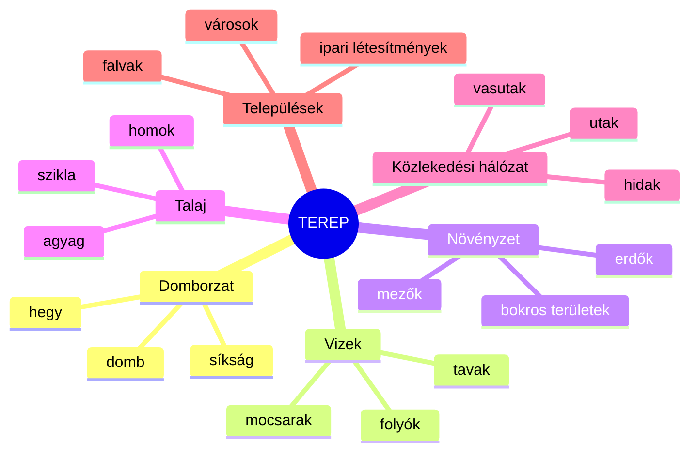
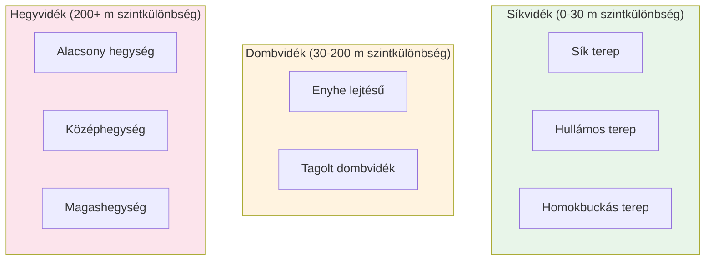
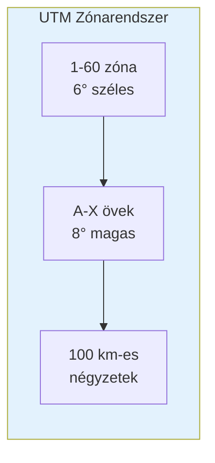
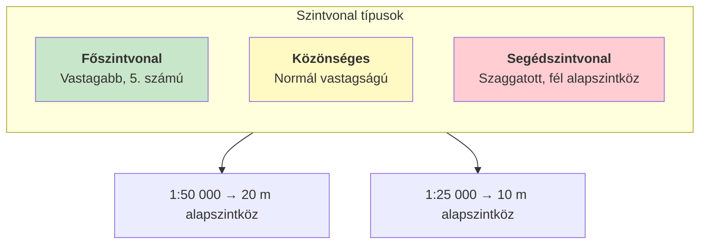
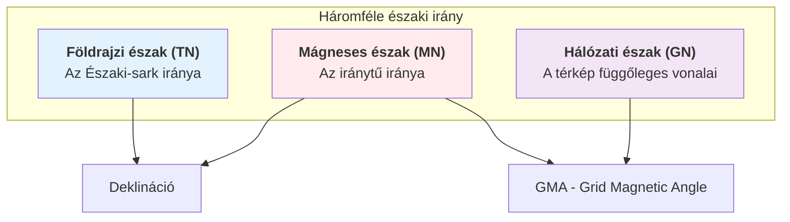
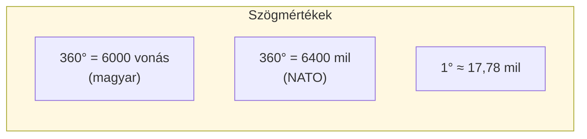
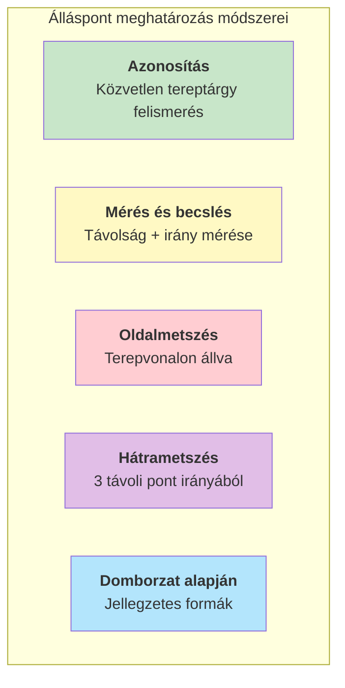
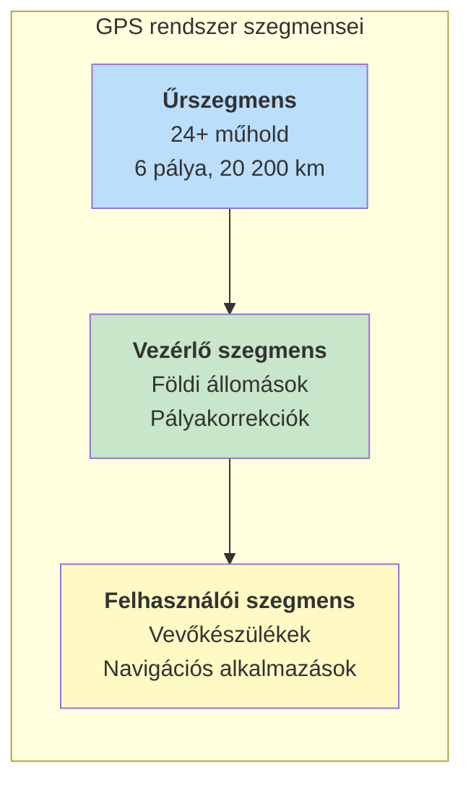
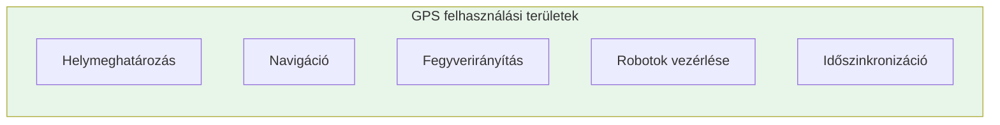

# Katonai Tereptan – Kivonat

## Bevezetés

A katonai tereptan a terep és a katonai tevékenység kapcsolatát vizsgáló tudományág. Ez a kivonat az eredeti tananyag lényegét foglalja össze, minden fogalomnál először közérthető magyarázatot adva, majd a pontos szakmai definíciót.

---

## 1. Tereptani Alapismeretek

### 1.1 Mi a terep?

**Közérthető magyarázat:** A terep az a természetes és ember által alakított környezet, ahol a katonai tevékenységek zajlanak. Gondolj rá úgy, mint egy "játéktérre" – dombok, folyók, erdők, utak, épületek együttese, ami befolyásolja, hogyan lehet rajta mozogni és harcolni.

**Pontos definíció:** A terep a földfelszínnek az a része, ahol a katonai tevékenység folyik. A természeti tényezők és az emberi tevékenység eredményeként létrejött objektumok és képződmények összessége, amelyek meghatározzák és befolyásolják a katonai tevékenység körülményeit.

### 1.2 A terep alkotóelemei

A terep hat fő alkotóelemből áll:

#### 1.2.1 Domborzat

**Közérthető magyarázat:** A domborzat a földfelszín "hullámzása" – ahol a talaj megemelkedik vagy lejtősen ereszkedik. Ez határozza meg, honnan látunk messzire, és hol tudunk elbújni.

**Pontos definíció:** A domborzat a földkéreg legkülső, szilárd részének (litoszféra) egyenetlen felszíne. A terep legállandóbb jellemzője, ami hat a megfigyelésre, a tűzre, a mozgásra és a rejtőzködésre.

**Domborzati formák:**

| Forma | Jellemző |
|-------|----------|
| Hegytető/csúcs | A környezetnél minden irányban magasabb pont |
| Gerincvonal | Hegyek csúcsait összekötő vonal |
| Hátvonal | Hegyoldal kidomborodó vonala |
| Völgyvonal | Völgy legmélyebb vonulata |
| Nyereg | Két magaslat közötti mélyedés |

#### 1.2.2 Vizek

**Közérthető magyarázat:** A vizek a terepen található összes vizes terület – folyóktól a mocsarakig. Ezek akadályt jelenthetnek a mozgásban, de ivóvízforrást is biztosítanak.

**Pontos definíció:** A vizek a felszíni és felszín alatti vizek összessége, amely magában foglalja a természetes és mesterséges vízfelületeket, vízfolyásokat és vizes területeket.

#### 1.2.3 Növényzet

**Közérthető magyarázat:** A növényzet minden, ami a talajon nő – fáktól a fűig. Az erdő elrejt, de a mozgást is nehezíti.

**Pontos definíció:** A növényzet a terep biológiai borítottsága, amely befolyásolja a fedezőképességet, a járhatóságot és a megfigyelési lehetőségeket.

#### 1.2.4 Talaj

**Közérthető magyarázat:** A talaj a föld felső rétege, amin járunk. Homokos talajon elakadhat a jármű, sziklás talajon nehéz beásni.

**Pontos definíció:** A talaj a földkéreg legfelső, mállott rétege, amelynek típusa meghatározza a járhatóságot és az erődítési munkák lehetőségeit.

#### 1.2.5 Közlekedési hálózat

**Közérthető magyarázat:** Az utak, vasutak, hidak – minden, ami az emberek és járművek mozgását szolgálja. Ezek a leggyorsabb útvonalak, de az ellenség is ismeri őket.

**Pontos definíció:** A közlekedési hálózat az ember által létrehozott közlekedési infrastruktúra összessége, amely meghatározza a csapatmozgások lehetséges útvonalait és sebességét.

#### 1.2.6 Települések

**Közérthető magyarázat:** Városok és falvak – ahol emberek élnek. A harc itt különösen bonyolult az épületek és a civil lakosság miatt.

**Pontos definíció:** A települések az ember által létrehozott lakó-, ipari és egyéb rendeltetésű létesítmények összessége, amelyek sajátos harctéri környezetet képeznek.

---

### 1.3 Terepfajták

A tereprészek magasságuk és jellegük alapján különböző típusokba sorolhatók:

#### Síkvidék (0-30 m szintkülönbség)

**Közérthető magyarázat:** Az Alföld-szerű területek, ahol messzire ellátunk, és a járművek könnyen mozognak.

**Pontos definíció:** Olyan terepszakasz, ahol az egymástól 2 km-re fekvő pontok szintkülönbsége nem haladja meg a 30 métert.

#### Dombvidék (30-200 m szintkülönbség)

**Közérthető magyarázat:** A Dunántúli-dombság jellegű területek – enyhe emelkedőkkel és völgyekkel.

**Pontos definíció:** Olyan terepszakasz, ahol az egymástól 2 km-re fekvő pontok szintkülönbsége 30-200 méter között van.

#### Hegyvidék (200+ m szintkülönbség)

**Közérthető magyarázat:** A Kárpátok vagy az Alpok típusú területek – meredek lejtőkkel és korlátozott mozgási lehetőségekkel.

**Pontos definíció:** Olyan terepszakasz, ahol az egymástól 2 km-re fekvő pontok szintkülönbsége meghaladja a 200 métert.

---

## 2. Térképészeti Alapismeretek

### 2.1 A térkép fogalma

**Közérthető magyarázat:** A térkép a Föld felszínének kicsinyített "képe" papíron vagy képernyőn. Olyan, mint egy madártávlati fénykép, de egyezményes jelekkel.

**Pontos definíció:** A térkép a Föld felszínének – vagy egy részének – matematikai szabályok (vetületi rendszer) szerint szerkesztett, méretarányosan kicsinyített és egyezményes jelekkel ábrázolt képe.

### 2.2 Méretarány

**Közérthető magyarázat:** A méretarány megmutatja, hogy a térkép mennyire van kicsinyítve. 1:50 000 azt jelenti, hogy 1 cm a térképen = 500 méter a valóságban.

**Pontos definíció:** A méretarány a térképi és a valóságos (terepi) távolság aránya, amely meghatározza a térkép részletességét és felhasználási körét.

| Méretarány | 1 cm a térképen = | Típus |
|------------|-------------------|-------|
| 1:25 000 | 250 m | Nagyméretarányú |
| 1:50 000 | 500 m | Közepes |
| 1:100 000 | 1 km | Közepes |
| 1:250 000 | 2,5 km | Kisméretarányú |

### 2.3 Vetületi rendszerek

#### UTM rendszer

**Közérthető magyarázat:** A Földet 60 függőleges "szeletbe" (zónába) osztották, mint egy narancsot. Magyarország a 33. és 34. zónában található.

**Pontos definíció:** Az UTM (Universal Transverse Mercator) a Föld felszínét 60, egyenként 6° széles zónára osztó vetületi rendszer. Minden zóna saját derékszögű koordinátarendszerrel rendelkezik.

#### MGRS – Katonai Keresőhálózat

**Közérthető magyarázat:** A katonák egy betű-szám kódot használnak a pozíció megadására. Például "34T DN 123 456" pontosan meghatároz egy helyet a térképen.

**Pontos definíció:** Az MGRS (Military Grid Reference System) az UTM rendszerre épülő katonai azonosítási rendszer, amely zóna, öv, 100 km-es négyzet és koordináták kombinációjával határozza meg a pozíciót.

**MGRS kód felépítése:**
- **34T** – UTM zóna és öv
- **DN** – 100 km-es négyzet azonosítója
- **123 456** – koordináták (keleti és északi érték)

#### GEOREF – Légi navigáció

**Közérthető magyarázat:** A repülésben használt rendszer, amely betűkkel és számokkal azonosítja a légtereket.

**Pontos definíció:** A GEOREF (Geographic Reference System) a nemzetközi légi navigációban alkalmazott rendszer, amely a földfelszínt 15°×15°-os trapézokra osztja, betűkombinációkkal és számokkal azonosítva.

### 2.4 Szintvonalak – A domborzat ábrázolása

**Közérthető magyarázat:** A szintvonalak olyan képzeletbeli vonalak, amelyek azonos magasságú pontokat kötnek össze. Ahol sűrűn vannak, ott meredek a terep; ahol ritkán, ott lapos.

**Pontos definíció:** A szintvonal (izohipsza) az azonos tengerszint feletti magasságú pontokat összekötő zárt görbe. Az egymást követő szintvonalak közötti magasságkülönbség az alapszintköz.

**Alapszintköz méretarány szerint:**
- 1:25 000 méretarány → 10 méter
- 1:50 000 méretarány → 20 méter
- 1:100 000 méretarány → 20 méter

### 2.5 Térképjelek

**Közérthető magyarázat:** A térképjelek olyan szimbólumok, amelyek a valóságos tárgyakat jelölik a térképen – pont az út, kék vonal a folyó, zöld terület az erdő.

**Pontos definíció:** A térképjelek (jelkulcsok) egyezményes grafikus szimbólumok, amelyek méretarányos vagy méretaránytalan formában ábrázolják a tereptárgyakat.

**Térképszínek jelentése:**
| Szín | Jelentés |
|------|----------|
| Kék | Vizek (folyók, tavak) |
| Zöld | Növényzet (erdők) |
| Barna | Domborzat (szintvonalak) |
| Fekete | Mesterséges objektumok |
| Piros | Utak, fontos objektumok |

---

## 3. Tájékozódási Alapismeretek

### 3.1 Világtájak és azimut

**Közérthető magyarázat:** A világtájak (észak, dél, kelet, nyugat) a tájékozódás alapjai. Az azimut megmutatja, hogy egy irány hány fokra van északtól.

**Pontos definíció:** Az azimut az északi iránytól jobbra (az óramutató járásával megegyezően) mért vízszintes szög, amely kifejezi egy tereptárgy irányát a megfigyelő álláspontjához képest.

#### Háromféle északi irány

1. **Földrajzi észak (TN – True North):** Az Északi-sark valódi iránya
2. **Mágneses észak (MN – Magnetic North):** A mágnestű által mutatott irány
3. **Hálózati észak (GN – Grid North):** A térkép függőleges vonalainak iránya

**Deklináció:** A földrajzi és mágneses észak közötti szögeltérés (Magyarországon kb. 4-5° keleti irányban)

**GMA (Grid Magnetic Angle):** A hálózati és mágneses észak közötti szög, amit a térképen feltüntetnek

### 3.2 A tájoló

**Közérthető magyarázat:** A tájoló az iránytűt tartalmazó eszköz, amivel meghatározhatjuk az északi irányt és mérhetünk szögeket.

**Pontos definíció:** A tájoló a földi mágneses tér hatására beálló mágnestűvel működő műszer, amellyel a mágneses északi irány és a tereptárgyak irányai (azimutok) meghatározhatók.

#### Magyar katonai tájolók

**39/49 M Bézárd-tájoló:**
- Beosztás: 6000 vonás (60-00)
- Magyar fejlesztés
- Tükrös konstrukció

**Cammenga 3H (NATO):**
- Beosztás: 6400 mil
- Trícium világítás
- Zárható kompasz

### 3.3 Térkép tájolása

**Közérthető magyarázat:** A térkép tájolása azt jelenti, hogy úgy fordítjuk a térképet, hogy az észak rajta egyezzen a valódi északi iránnyal.

**Pontos definíció:** A térkép tájolása az a művelet, amellyel a térkép északi irányát egybeállítjuk a terepi északi iránnyal.

**Tájolási módszerek:**
1. **Tájolóval:** A mágnestűt a térkép északi irányához igazítjuk
2. **Vonalas tereptárggyal:** Úthoz vagy folyóhoz igazítjuk a térképet
3. **Sarkcsillaggal:** Éjszaka a Sarkcsillag irányához

### 3.4 Álláspont meghatározása

**Közérthető magyarázat:** Az álláspont meghatározása azt jelenti, hogy megtaláljuk saját pozíciónkat a térképen. Ehhez azonosítható tereptárgyakra és mérésekre van szükségünk.

**Pontos definíció:** Az álláspont meghatározása az a tájékozódási művelet, amelynek során azonosítjuk térképi pozíciónkat a terepen látható tájékozódási pontok és mérések alapján.

#### Hátrametszés

**Közérthető magyarázat:** Ha nem tudjuk, hol vagyunk, de látunk három távoli, jól azonosítható pontot (torony, hegycsúcs), akkor azok irányából meg tudjuk határozni a helyzetünket.

**Pontos definíció:** A hátrametszés az a helymeghatározási eljárás, amelynél legalább három ismert tereptárgyra mért azimutok visszavetítésével határozzuk meg álláspontunk térképi helyét.

**Végrehajtás lépései:**
1. Válasszunk 3 jól azonosítható távoli tereptárgyat
2. Mérjük meg mindhárom mágneses azimutját
3. Számítsuk át hálózati azimuttá (GMA korrekció)
4. Szerkesszük fel a visszairányokat a térképre
5. A metszéspont az álláspontunk

### 3.5 Előremetszés

**Közérthető magyarázat:** Ha meg akarjuk határozni egy tereptárgy helyét, két különböző pontból irányt mérünk rá, és a metszéspont adja a célpont helyét.

**Pontos definíció:** Az előremetszés az a helymeghatározási eljárás, amelynél két ismert álláspontból mért irányok térképi metszéspontjaként határozzuk meg a tereptárgy helyét.

---

## 4. Műholdas Helymeghatározás (GPS)

### 4.1 A GPS működése

**Közérthető magyarázat:** A GPS (Global Positioning System) olyan rendszer, ahol műholdak folyamatosan rádiójeleket sugároznak, és a vevőkészülék ezek alapján kiszámítja a helyzetünket – bárhol a Földön, bármikor.

**Pontos definíció:** A GPS (NAVSTAR Global Positioning System) a Föld körül keringő műholdak, földi vezérlőállomások és felhasználói vevőkészülékek alkotta globális helymeghatározó rendszer.

### 4.2 A GPS felépítése

**Főbb műholdas rendszerek:**

| Rendszer | Ország | Műholdak | Megjegyzés |
|----------|--------|----------|------------|
| GPS (NAVSTAR) | USA | 24+ | Legelterjedtebb |
| GLONASS | Oroszország | 24 | Orosz rendszer |
| Galileo | EU | 30 (tervezett) | Polgári célú |
| BeiDou | Kína | 35+ | Regionális+globális |

### 4.3 A helymeghatározás elve

**Közérthető magyarázat:** A GPS úgy működik, mint a hátrametszés, csak műholdakkal. A vevő megméri, milyen messze van több műholdtól, és a távolságok metszéséből kiszámítja a helyét.

**Pontos definíció:** A GPS helymeghatározás kódkorrelációs eljáráson alapul: a vevő a műholdak által sugárzott rádiójelek beérkezési idejéből számítja a távolságokat, majd térbeli ívmetszéssel határozza meg a pozíciót.

**Szükséges műholdak:**
- **3 műhold:** 2D pozíció (szélesség, hosszúság)
- **4 műhold:** 3D pozíció (+ magasság) és órahiba-korrekció

**Pontosság:** 10-20 méter (katonai célokra javítható)

### 4.4 GPS alkalmazások

**Katonai alkalmazások:**
- Álláspont gyors meghatározása
- Célpontok koordinátáinak rögzítése
- Útvonalak rögzítése és visszakövetése
- Precíziós lőszerek irányítása
- Pilóta nélküli eszközök navigálása

**Korlátozások:**
- Épületek és erdők zavarják a jelet
- Szándékos zavarás blokkolhatja
- 10-20 méteres pontossági hiba

---

## 5. Összefoglaló táblázatok

### A terep értékelése katonai szempontból

| Szempont | Értékelési tényezők |
|----------|---------------------|
| Megfigyelés | Rálátás, kilátás, belátás |
| Tűz | Tüzelőállások, lőterek |
| Mozgás | Járhatóság, akadályok |
| Rejtőzködés | Fedezék, álcázási lehetőségek |

### Koordinátarendszerek összehasonlítása

| Rendszer | Típus | Alkalmazás |
|----------|-------|------------|
| Földrajzi | Fok, perc, mp | Általános |
| UTM/MGRS | Méter | Katonai |
| GEOREF | Betű+szám | Légi |

### Helymeghatározási módszerek

| Módszer | Szükséges eszköz | Pontosság |
|---------|------------------|-----------|
| Azonosítás | Térkép | Változó |
| Hátrametszés | Tájoló + térkép | Jó |
| GPS | Vevőkészülék | 10-20 m |

---

## Kulcsfogalmak jegyzéke

- **Azimut:** Északtól jobbra mért vízszintes szög
- **Deklináció:** Földrajzi és mágneses észak eltérése
- **GMA:** Hálózati és mágneses észak szöge
- **MGRS:** Katonai keresőhálózat
- **Szintvonal:** Azonos magasságú pontokat összekötő görbe
- **UTM:** Univerzális Transzverzális Mercator vetület
- **Vonás:** Szögmérték (6000 vonás = 360°)

---

*Forrás: Katonai tereptan (Ált/204) és Kállai Attila: Térkép és tereptani alapismeretek*
