# 6 KATONAI TEREPTAN

## 6.1 TEREPTANI ALAPISMERETEK

### 6.1.1 A terep és alkotóelemei

#### 6.1.1.1 A terep katonai jelentősége

A földrajzi környezet fegyveres küzdelemre gyakorolt hatásával már az ókorban tisztában voltak a hadvezérek és a háborúk természetével foglalkozó tudósok. Időszámításunk előtti 6. században Szun-ce a háborút meghatározó öt tényező közül mindjárt az első két helyen említi az eget (éjszaka és nappal, hideg és meleg, napszakok és évszakok) és a földet (kis és nagy távlatok, veszélynek kitettség és védettség, nyílt terep és keskeny átjárók, a túlélés esélyei) A háború művészete címmel összefoglalt műben.

Zrínyi Miklós (1620-1664) a törökkel vívott hadakozásai szünetében (1650-1653 között) pergamenre vetett Vitéz hadnagy című művében így értekezik a terepről: „szükséges egy hadviselő embernek ismérni a föld csinját (tulajdonságait), melyre kell titkon járni, minden árkot, erdőt, passust (útvonalat) szükség tudni... szükséges, hogy jó feje legyen a hadviselőnek arra, hogy mihánt (mihelyt) meglátja a helt (helyet), megismérje az ő mivoltát, és tudja alkalmazni a maga hasznára.

Antoine-Henri Jomini (1779–1869) A háború művészetének összefoglalása címmel 1838-ban elkészült művében pedig arról ír, hogy „Ha egy tábornok a háború nagy drámájának sikeres szereplője akar lenni, akkor az első kötelessége, hogy alaposan tanulmányozza a hadműveletek színterét, hogy tisztán lássa, milyen viszonylagos előnyöket és hátrányokat jelent az önmaga és ellenségei számára."

A terep a katonai tevékenységek legfontosabb földrajzi vonatkozású közege, melynek sajátosságai a katonai műveletekben résztvevő erők minden lényeges tevékenységére hatást gyakorolnak.

Terep alatt a földrajzi környezetnek a harctevékenységek szempontjából meghatározó részét értjük a benne található természetes és mesterséges jellegű tereptárgyakkal, jelenségekkel és azok következményeivel.

A terep harctevékenységekbe bevont része a harcmező. Sajátosságaival leginkább harcászati szinten foglalkozunk. Sem az ellenség közvetlen megsemmisítésére irányuló harctevékenységek, sem a saját csapatok védelmére, megóvására, illetve a harctevékenység kedvező feltételeinek megteremtésére irányuló harctámogató (harci kiszolgáló, támogató, kiegészítő és egyéb) tevékenységek nem folytathatók sikeresen a terep átfogó és részletes ismerete, jellemző tulajdonságainak figyelembevétele nélkül.

A terep hatást gyakorol:
- a harc megszervezésére,
- vezetésére és lefolyására,
- az alkalmazott fegyverek tűzhatására,
- csapásmérő képességére,
- a harci technika bevethetőségére,
- alkalmazhatóságára,
- a felderítés hatékonyságára,
- az együttműködés megszervezésére és végrehajtására, valamint
- az álcázási és a műszaki feladatok végrehajtására.

A terep kedvező és kedvezőtlen hatásait együttesen kell értékelni és figyelembe venni, úgy a saját, mint az ellenséges erők szempontjából. A harc sikeres megvívásához a parancsnoknak ki kell aknáznia minden lehetőséget, amit a terep harcászati jellemzői nyújtanak. Csak így fordíthatja a terepet a „saját oldalára".

#### 6.1.1.2 A terep harcászati jellemzői

A terep harcászati jellemzőinek tanulmányozását és értékelését a harctevékenységekkel fennálló kölcsönhatásaik, kapcsolataik figyelembevételével kell végrehajtani. A terep tanulmányozásával, részletes értékelésével, a terepen történő tájékozódás operatív eszközeivel és módszereivel a katonai tereptan foglalkozik.

A terep harcászati jellemzői egyaránt befolyásolják a saját és az ellenséges harcoló erőket, segítve vagy hátráltatva tevékenységüket.

A terep alapvető harcászati jellemzőihöz az alábbi sajátosságokat sorolhatjuk:
1. a terep járhatósága
2. a terep fedezőképessége
3. megfigyelési és álcázási lehetőségek
4. tájékozódási lehetőségek
5. tűzvezetési feltételek
6. a terep vízellátottság
7. műszaki feladatok végrehajtásának feltételei

Katonai szempontból a terepet elsősorban fedettsége, tagoltsága és járhatósága alapján kell megvizsgálni. A katonai tereptan különös figyelmet fordít a terep megfigyelési és rejtőzési feltételeinek, fedezőképességének, valamint manőverekre gyakorolt hatásainak meghatározására.

#### 6.1.1.3 A terep főbb alkotóelemei

A terep a maga összetettségében, különösen a nagy kiterjedésű, változatos terepelemekben gazdag területek vizsgálata esetén nehezen áttekinthető és értékelhető. A terep tanulmányozása során analitikusan minden, katonai szempontból lényeges elemét külön kell megvizsgálni. A terep tanulmányozása jellemzően az alábbi terepelemekre terjed ki:
1. domborzat
2. vizek
3. növényzet
4. talaj
5. közlekedési hálózat
6. települések
7. ipari, mezőgazdasági, kereskedelmi és szolgáltatási létesítmények

**Domborzat**

A domborzat a terep legkevésbé változékony eleme. Fontosságát az adja, hogy alapvető mértékben gyakorol hatást a terepen zajló tevékenységekre, elsősorban a mozgásra és manőverekre, de a megfigyelés és a rejtőzés feltételeit is jelentősen befolyásolja. A domborzat fogalma alatt a terep jellemző szintkülönbségeit, kiemelkedéseinek és bemélyedéseinek összességét értjük. Ezek hatását a harc lefolyására az általuk kialakított domborzati idomok sajátosságainak értékelésével állapítjuk meg. A domborzati idomok három fő csoportba sorolhatók:
1. vízválasztó domborzati idomok;
2. vízgyűjtő domborzati idomok;
3. részletidomok.

A vízválasztó domborzati idomok a domborzat azon elemei, ahol a terepfelszínre jutó folyékony halmazállapotú csapadék a legrövidebb ideig tartózkodik. Jellemző vízválasztó idomok:
- a hegyhát,
- a hegygerinc,
- a hegykúp,
- a hegyorom,
- a lejtőpihenő,
- a lejtőkúp és
- a nyereg.

A vízgyűjtő idomokon a csapadékvíz összegyűlik, és a vízgyűjtő idomvonala mentén folytatja útját végállomása (tavak, tengerek, óceánok) felé. Jellemző vízgyűjtő idomok:
- a völgy,
- a völgyteknő,
- a metsződés és
- a vízmosás.

A részletidomok közé azokat a domborzati elemeket soroljuk, amelyekről egyértelműen nem dönthető el, hogy vízgyűjtő vagy vízválasztó jellegűek-e. Jellemző részletidomok:
- a tereplépcső,
- a hegyorr,
- a terepfok,
- a borda,
- a horhos,
- a lyuk,
- a töbör,
- a zsomboly,
- a szikla és
- az omladék.

A vízválasztó idomok elsősorban a megfigyeléshez, a tájékozódáshoz és a felderítéshez nyújtanak kedvező feltételeket. A vízgyűjtő idomok a rejtés és álcázás, valamint a rejtett mozgás lehetőségeit segítik. A részletidomok a mozgás szempontjából akadályt jelentenek, azonban rejtett megközelítésre és fedezékként is jól kihasználhatók.

A domborzati viszonyok megítélésénél hangsúlyos szerepet kapnak a magaslatok, illetve a mélyedések oldalfelületei a lejtők. A lejtő a domborzat elemi összetevője. Meredekségével, formájával alapvetően befolyásolja a mozgást, a láthatóságot és a terep műszaki megmunkálását.

**Vizek**

A vizek terepelem-csoportba a földfelszín folyó- és állóvizei tartoznak, tekintet nélkül azok kialakulására, természetes vagy mesterséges eredetére. A felszíni vizekre alapvetően a domborzati és a klimatikus viszonyok gyakorolnak hatást, pillanatnyi állapotuk ugyanakkor az időjárási tényezők, valamint a nap- és évszaki változások következtében folyamatosan változhat, akár rövid időn belül is jelentős mértékben módosulhat. Felszíni vizek hiányában meg kell vizsgálni a felszín alatti vízkészletek elérhetőségét is.

Katonai szempontból a felszíni vizek akadályozó és mozgást elősegítő tényezőként is figyelembe vehetők. Folyóvizekkel sűrűn átszeldelt térségekben a vízi átkelőhelyek jelentősége megnő. Átkelőhelyek hiányában a felszíni vizek beszűkítik szárazföldi erők mozgási lehetőségeit a terepen, lelassítják az előrejutást. Védelemben a folyó- és állóvizek mozgást akadályozó jellege a védekezőképességet fokozza. A hajózható vizek mindemellett közlekedési és szállítmányozási szükségleteket is ki tudnak szolgálni. Ennek jelentősége különösen azokon a területeken kiemelkedő, ahol a szárazföldi közlekedés feltételei korlátozottak, vagy ellehetetlenülnek.

A vizek akadályjellegét az alábbi jellemzők vizsgálatával elemezzük:
1. mélység;
2. folyási irány és sebesség;
3. szélesség;
4. meder jellege, anyaga;
5. partok jellege, állapota.

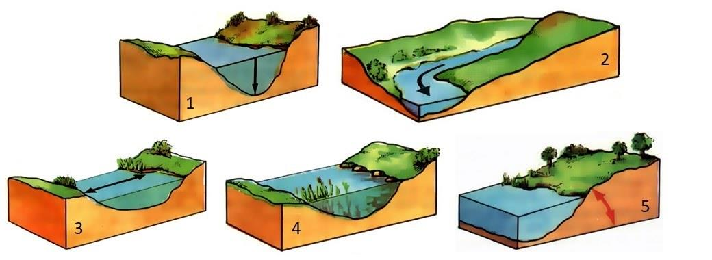
*1. A vizek akadályjellegének összetevői (forrás: Ált/204)*

A felszíni vizek fontos elemei a völgyzárógátak, a duzzasztóművek, a víz alatti gátak (sarkantyúk) és a kikötők. Ezen létesítmények megsemmisülése, rombolása jelentős terepi változásokat (pl. áradásokat) idézhetnek elő.

**Növényzet**

Növényzet (vegetáció) fogalom alatt a terep felszínét borító, természetes úton létrejövő növényformációk és növénytársulások, valamint az ember által létrehozott kultúrnövények összességét értjük. A földfelszínt borító természetes növénytakaró kiterjedése, állapota elsősorban az éghajlattól, az évszaki változásoktól, valamint a domborzati- és talajviszonyoktól függ. A kultúrnövények jellegét a mezőgazdasági művelési ágak határozzák meg.

A növényzet vizsgálatánál az alábbi fő típusokat különböztetjük meg:
a. erdők (természetes úton fejlődő vagy telepített, ipari felhasználási vagy rekreációs célú, lombhullató vagy örökzöld stb.)
b. mezőgazdasági kultúrnövények (pl. gyümölcsös, tőke- és kordonművelésű szőlő, komló, szántóföldi termesztésű növények stb.);
c. kertek, parkok, arborétumok (településen belüli és kívüli);
d. rétek, kaszálók;
e. egyéb növénytakaró (bozót, nádas stb.).

A fenti növényzettípusok mindegyike fontos katonai szempontból, mégis legnagyobb jelentőséggel a jelentősebb kiterjedésű erdősült területek bírnak. Erdőnek a legalább 4 m magas, fás szárú, kiterjedt növényzettakarót nevezzük. Magyarország területének több mint egyötödét (2 millió hektár) borítja erdő. E területnek mindössze egyharmada áll természetes jellegű erdőből, a többi gazdasági céllal telepített és művelt.

Az erdő a katonai tevékenységekre sokoldalú hatást gyakorol. Megfelelő feltételeket biztosíthat a rejtőzéshez, elhelyezési körletek kialakításához, terepszakaszok rejtett megközelítéséhez, ugyanakkor jelentős mértékben akadályozza a mozgást, megnehezíti a tájékozódást. Mindezen sajátosságok az erdő fő tulajdonságjegyeitől függenek, melyek a következők:
a. kiterjedés (terület, átlagos magasság);
b. általános jelleg (telepített, természetes);
c. lombozat típus (lombhullató, örökzöld);
d. aljnövényzet (sűrű, ritkás, hiányzó);
e. faállomány sűrűsége (fák törzseinek egymástól mért átlagos távolsága, a lombkorona összefüggő jellege);
f. nyiladékok, erdővágások, tisztások (irány, szélesség, terület);
g. úthálózat (erdei utak, ösvények állapota);
h. erdőtalaj és domborzati viszonyok.

A mérsékelt égöv erdői lombozatuk szerint lehetnek:
- tűlevelűek (örökzöldek);
- lomblevelűek (lombhullatók, lombváltók);
- vegyes összetételűek (részben lombhullatók, részben örökzöldek).

Az erdei faállomány sűrűsége szerint megkülönböztetünk:
- zárt erdőt (ha a fák koronái érintik egymást és zárt lombsátrat képeznek);
- sűrű erdőt (a lombkorona nem összefüggő, de a fák koronái közötti távolságok kisebbek, mint a koronák átlagos átmérője);
- ritka erdőt (a fák koronái közötti távolságok nagyobbak, mint a koronák átlagos átmérője).

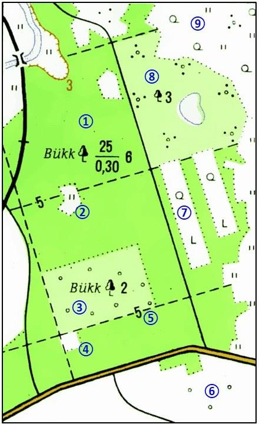
*2. Erdős terület növényzet-típusai: ① lomblevelű erdő (bükk) 25 m átlagos magassággal, 30 cm-es átlagos fatörzs vastagsággal és 6 m átlagos törzstávolsággal; ② füves tisztás, erdei kaszáló; ③ fiatal erdő (bükk) 2 m átlagos magassággal; ④ irtás; ⑤ 5 m széles nyiladék; ⑥ egyedülálló, nem tájékoztató jellegű fák; ⑦ ritka erdő kivágott fákkal; ⑧ összefüggő bozótos, 3 m átlagos bokormagassággal; ⑨ fás, bokros, füves terület.*

Az erdők mellett a mezőgazdasági művelésű területek jelenthetnek kihívást a terepen folytatott katonai tevékenységek során. A topográfiai térképek ezeket a területeket ugyan megjelenítik, de aktuális állapotukat a terep tanulmányozása és értékelése során csak terepfelderítéssel ismerhetjük meg részletesen. Különösen a talaj szerkezetében és a növényzet állapotában tapasztalhatunk jelentős változásokat ezeken a területeken, melyek a terep járhatóságára és a felderítés lehetőségeire gyakorolnak hatást.

Belvizek kialakulásakor, vagy talajművelést követő időszakban, különösen csapadékosabb időjárás esetén a terep járhatósága minimálisra csökken. A nagy kiterjedésű nyílt terepen rejtett csapatmozgásra nincs lehetőség. Szárazabb időszakban viszont, főleg kifejlett magas szárú növényzettel borított területen kisebb gyalogos kötelékek észrevétlen mozgása még nappali viszonyok mellett is könnyen megvalósítható.

A nagyméretarányú (M=1:25 000) topográfiai térképek feltüntetik mindazon területeket, ahol kordonművelésű mezőgazdasági tevékenység (komló-, vagy szőlőtermesztés) folyik. Ezek a területek gyalogos erőkkel a kordonok irányában jól járhatók. A kordonok acélsodronyai ugyanakkor a harcjárművek kerekeire, lánctalpára feltekeredve komoly akadályozó tényezőt képezhetnek.

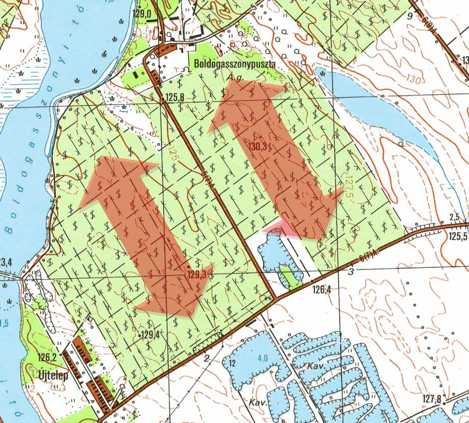
*3. Kordonművelésű szőlőültetvény a kordonok irányának jelölésével. Az ideális áthaladás irányát a piros nyilak (nem jelkulcsi jel!) mutatják.*

**Talaj**

A talaj a földkéreg legfelső mállási rétege. A mállás és a talajképződés a felső kőzetrétegek fizikai aprózódása és kémia bomlása, átalakulása, ami alapvetően az éghajlati tényezők és az élővilág hatására jön létre. A talaj egyebek mellett befolyásolja a szárazföldi csapatok kiépített utakon kívüli mozgását, manővereit, tűzeszközeik hatásfokát és a műszaki munkálatokat.

A talaj főbb jellemzői közül kiemelten kezelni:
a. általános fizikai állapotát (szilárdság, kötöttség);
b. mechanikai tulajdonságait (állékonyság, porlékonyság);
c. kölcsönhatását a vízzel (vízfelvevő-, megtartó- és áteresztőképesség).

A fizikai, kémiai és biológia kölcsönhatások eredményeként létrejövő talajféleségek különböző, egymástól jelentősen eltérő értékelési metódusainak köszönhetően a talajtípusok osztályozása nem egységes. A katonai szempontból lényeges talajtípusokat és ezek sajátosságait az alábbi táblázat foglalja össze:

A hazai talajviszonyok katonai szempontú értékeléséről további részletes ismeretek érhetők el A talaj katonai osztályozása c. tananyagban.

**Közlekedési hálózat**

Egy adott térség közlekedési hálózatának fejlettsége, kiépítettsége, állapota nagyban befolyásolja a katonai műveletek sikeres és gyors végrehajtását az abban résztvevő erők mozgás, manőver és együttműködési feltételeinek megteremtésével és fenntartásával. Biztosítja továbbá az erők és eszközök széttagolását és védelmét, a tartalékok időbeni előrevonását és a harcoló erők folyamatos utánpótlását.

A közlekedési hálózat katonai szempontból lényeges elemei közé tartoznak a szárazföldi, a vízi és a légi közlekedés létesítményei, az utak és vasutak hálózata, az állomások, pályaudvarok, repülőterek, kikötők és minden, a közlekedést kiszolgáló, vagy ahhoz kapcsolódó építmény.

A közúti úthálózatot fontossága, kiépítettsége, forgalomkapacitása alapján az alábbiak szerint osztályozzuk:

Az úthálózat áteresztőképessége a vonalkiépítettség mellett egyéb meghatározó jelentőségű közlekedési műtárgyaktól is függ. Ezek lehetnek többszintű kereszteződések, hidak, alagutak, kompátkelési lehetőségek stb.

A többszintű kereszteződések lehetővé teszik két vagy több közlekedési útvonal eltérő magasságban történő keresztezését (felüljáró, aluljáró) egymás forgalmának lehetőleg kisebb befolyásolásával, az összeköttetés megteremtésének lehetőségével. Jellemző előfordulásukra nagyobb települések agglomerációs övezetében, illetve gyorsforgalmi utak, vasutak, autópályák mentén lehet számítani. Katonai szempontból a felüljárók terhelhetősége és szélessége, aluljárók esetén azok űrszelvényének szélessége és magassága számít lényeges adatnak.

Az állandó jelleggel kiépített hidak jellemzően vízi akadályok (folyók, csatornák, tengerszorosok, öblök, tavak, mocsaras területek) gyors leküzdhetőségét segítik elő, de szárazulatok felett átívelhetnek jelentős mélyedéseket is (völgyhidak, viaduktok). A hidak legfontosabb műszaki jellemzője a hosszúság, a szélesség, a hídnyílás magassága, a híd fő építőanyaga, szerkezeti sajátosságai és teherbíró képessége. Ezen adatokat a topográfiai térképek tartalmazzák, de a katonai terhelési osztályozás (MLC — Military Load Classification) szerinti besorolásukat csak az út- és hídadatokat részletesen megjelenítő, a katonaföldrajzi dokumentáció (MGD — Military Geographic Documentation) részét képező katonai tematikus térképek (RRS — Roads and Road Structures) részletezik. Ezen térképek segítségével minden lényeges közlekedési csomópont, létesítmény azonosító száma, fontosabb műszaki paraméterei (hossz, szélesség, magasság), egy- és kétirányú közlekedésre meghatározott, továbbá lánctalpas és kerekes járműre megadott katonai terhelési besorolása (MLC), megkerülési lehetősége megismerhető.

A szárazföldi közlekedési hálózat másik meghatározó összetevője a vasúthálózat. A vasút jellegét tekintve lehet:
- széles-, normál- és keskeny nyomtávú;
- egy- vagy többvágányú;
- főközlekedési (országos, vagy nemzetközi jelentőségű), illetve mellékvonal (szárnyvonal);
- villamosított vagy villamosítatlan;
- földalatti, felszíni és felszín feletti (függővasút);
- városi (villamos), illetve elővárosi (HÉV);
- ipari, mező- és erdőgazdasági;
- fogaskerekű, vagy egyéb speciális kiépítettségű/meghajtású.

A vasútvonalak jellegét, a kiegészítő létesítmények és műtárgyak katonai szempontból legfontosabb műszaki adatait (vasúti hidak és alagutak, szintbeli és többszintű kereszteződések, vasúti megállók, állomások, rakodók és pályaudvarok, bevágások és töltések) a topográfia térképek tartalmazzák. A vasútvonalak pillanatnyi állapotát, működőképességét terepfelderítés révén kell tisztázni. Vasúti pályaudvaroknál, rakodóállomásoknál a vágányok elrendezését, illetve a rakodási lehetőségeket kell vizsgálni.

A légi közlekedés legfontosabb elemei a fel- és leszállásra alkalmas helyek és a repülést kiszolgáló létesítmények műszaki és kapacitás adatai. A repülőtereknél elsősorban a kifutópályák hossza, terhelhetősége, a gépek indítására és fogadására szolgáló, illetve a repülés biztonságát és a gépek karbantartását szolgáló létesítmények ismerete lényeges. A jelentősebb repterek beton kifutóval (fel- és leszállópályával), a kisebbek füves pályával rendelkeznek. Rendkívüli helyzetekre felkészülve a közúti úthálózat (elsősorban autópályák) erre megfelelően előkészített szakaszai is kijelölhetők kifutópályakánt.

A tengeri, egyéb állóvízi és folyami közlekedés hálózatának legfontosabb elemeihez a kikötésre, áruszállítmányok ki- és berakodására alkalmas helyek tartoznak. A vízi közlekedés lehetőségeinek vizsgálatakor kiemelten kell kezelni a tengerszorosok, csatornák, folyamszakaszok hajózhatóságára vonatkozó adatokat. A kikötők külön jelentőségét a szárazföldi közlekedési hálózathoz való csatlakozás, a kapcsolódó javítóbázisok, valamint rakodási- és tárolókapacitások adják.

**Települések**

A települések kiemelt jelentőséggel bírnak a fegyveres küzdelemben. Hatással vannak a mozgásra és manőverekre, befolyásolják az összeköttetést, jelentős tüzek kialakulása és az épületek rombolása révén fokozzák a tűzhatást, ugyanakkor fedezéket és álcázási lehetőséget is biztosítanak, valamint megkönnyítik a műszaki zárak kiépítését.

A települések kiterjedésük, lakosainak száma, közigazgatási rangjuk, valamint kiépítettségük szerint az alábbiak szerint osztályozhatók:
- nagyvárosok;
- kisvárosok;
- elővárosok (agglomeráció);
- villaszerű, nyaraló jellegű települések;
- falusias települések;
- rendszertelen települések (tanyák, tanyacsoportok).

A települések és településrészek beépítettségük módja szerint lehetnek:
- zárt beépítésűek, szorosan egymás mellé épült házakkal, melyek az utcák mentén zárt homlokzatot képeznek;
- laza beépítésűek, az épületek között nagyobb távközökkel;
- nyílt beépítésűek, kertekkel körülvett, egyesével álló, egy vagy kétszintes épületekkel.

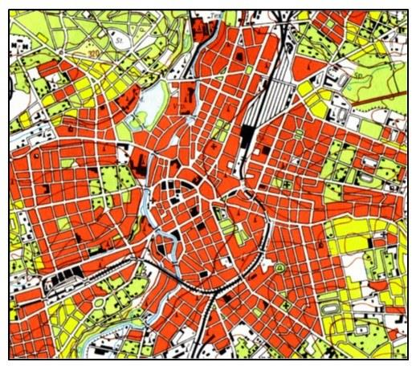
*4. Városias település topográfiai térképi megjelenése (M=1:50 000)*

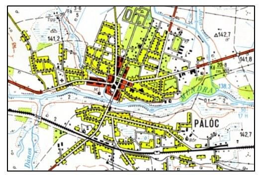
*5. Kisvárosias település topográfiai térképi megjelenése (M=1:50 000)*

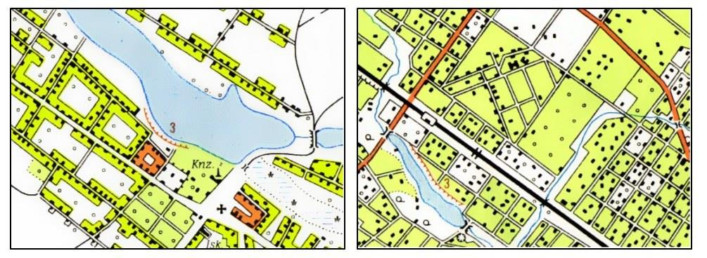
*6. Falusias és villaszerű, nyaraló jellegű települések topográfiai térképi megjelenése (M=1:50 000)*

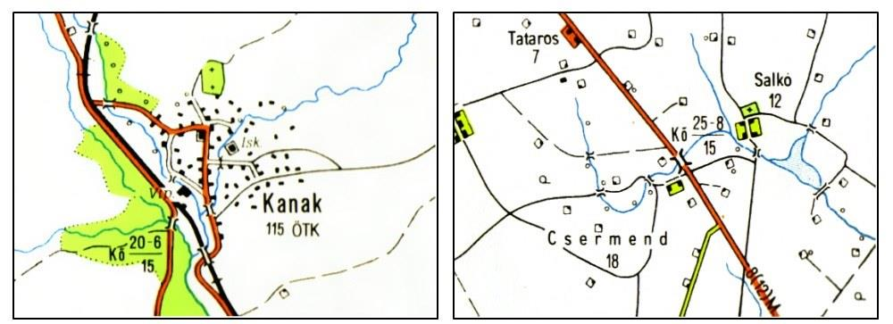
*7. Rendszertelen szerkezetű és tanyajellegű települések topográfiai térképi megjelenése (M=1:50 000)*

**Ipari, mezőgazdasági, kereskedelmi és szolgáltatási létesítmények**

Az ipari és mezőgazdasági létesítményeket (üzemek, gyártelepek, állattenyésztő telepek, raktárak, víztisztítók, transzformátor állomások stb.) továbbá a szolgáltató és kulturális létesítményeket az előállított főtermék, a termelési kapacitás, valamint a szolgáltatások jellege szerint értékeljük. E létesítmények több szempontból lehetnek fontosak:
a. segíthetik a tájékozódást (gyárkémények, víztornyok, adótornyok stb.);
b. létfontosságú szolgáltatásokat nyújthatnak (üzemanyag, ivóvíz, elsősegélyhely, javítóbázis stb.);
c. műszaki munkálatok nyersanyagbázisaként szolgálhatnak (külszíni és tárnaaknás bányák, fejtések);
d. sebesültek és evakuáltak elhelyezését teszik lehetővé (kórházak, iskolák, kollégiumok stb.).

### 6.1.2 Terepfajták és tájtípusok

A terep elemző vizsgálata során az előző fejezetben megismert terepelemek (domborzat, vizek, növényzet, közlekedési hálózat stb.) sajátosságait külön-külön vizsgáljuk. Az értékelések összegzéséből kirajzolódó terepfajtákat a terep alapvető harcászati sajátosságainak meghatározására alkalmazzuk. A jelleg szerinti osztályozás a terep esetén lehetővé teszi a katonai tevékenységekre gyakorolt hatások megbízhatóbb előrejelzését, az előzetes terepértékelésék kialakítását. A szerkezetileg azonos, egymással összefüggő terepfajták összességéből kialakuló tájtípusok néhány jellemző típusának definiálásával a terep általános harcászati-hadműveleti jellemzői is gyorsabban meghatározhatók.

#### 6.1.2.1 A terep jellegének meghatározása

A gyors értékelés és az egyértelmű jellemzés érdekében a terepet jellege szerint osztályozzuk. A terepjelleg a domborzat, a terepfedezet (növényzet, építmények stb.) és az átszeldeltség együtteséből kialakuló sajátosság a terep egy meghatározott részén.

A harcászati szempontok szerint csoportosított terepfajták a következők lehetnek:

1. A terep tagoltsága (domborzat és felszíni vízrajz) szerint:
   a. tagolt/átszeldelt terep
   b. részben tagolt/átszeldelt terep
   c. tagolatlan, összefüggő terep

2. A terep fedettsége (megfigyelési, álcázási, rejtett megközelítési feltételek) szerint:
   a. nyílt terep
   b. részben fedett
   c. fedett terep

3. A terep járhatósága szerint:
   a. járható terep
   b. nehezen járható terep
   c. járhatatlan terep

Nyílt terepen sem növényfedezet, sem jelentősebb építmények, sem számottevő domborzati formák nem akadályozzák a terep megfigyelhetőségét. A nyílt terep kiválóan alkalmas optikai megfigyelésre és közvetlen irányzású tűzeszközök alkalmazására, ugyanakkor kedvezőtlen feltételeket biztosít a rejtőzés és az álcázás, valamint a tűzcsapások elleni védekezés szempontjából.

Fedett terepen a magas növényzet (pl. szálerdő, erdősáv, fasor) és a kiemelkedő építmények (pl. épületek, kerítések, töltések, gátak) a terep megfigyelhetőségét korlátozzák, a mozgást széttagolják. A fedett terep megnehezíti a tűzvezetést, a megfigyelést, a tájékozódást és a manőverezést, ugyanakkor megkönnyíti a rejtett megközelítést, továbbá ideális feltételeket biztosít a rejtéshez és álcázáshoz. A terep fedettségét befolyásoló tényezők együttesen fejtik ki hatásukat.

A terep fedettségének mértéke szerint az alábbi kategóriákat különböztetjük meg:
a. enyhén fedett terep (ritkás, nem összefüggő, kevesebb mint 25% fedettségű tereprészek)
b. részben fedett terep (a terep fedettségét adó terepelemek kisebb-nagyobb kiterjedésű foltokban összeállva, összességében több mint 25%, de kevesebb mint 75% mértékben borítják a terep felszínét)
c. teljesen fedett terep (a fedettséget nyújtó terepelemek a terep több mint 75%-át borítják, az összefüggő részek között fedetlen részek (pl. kisebb tisztások, irtások) előfordulhatnak.

A terep további osztályozásánál a terep tagoltságát vizsgáljuk. Ennek eredményeként a terepet tagolatlan, részben tagolt és tagolt kategóriákba sorolhatjuk.

Tagolatlan terepen a domborzati szintkülönbségek nem jelentősek. Ha a terep összefüggő, vagyis árkokkal, csatornákkal, folyókkal, vagy egyéb jelentős felszíni vizekkel nem átszeldelt, továbbá nyílt, vagy csak enyhén fedett, úgy kedvező időjárási és talajviszonyok esetén nem képez számottevő akadályt a szárazföldi csapatok mozgásában, manővereiben és a tűz vezetésében.

Tagolt terepen a domborzati szintkülönbségek jelentősek, az úton kívüli mozgást megnehezítik, vagy akadályozzák, ugyanakkor a rejtett megközelítést segíthetik. A szárazföldi erők manővereik során a tagolt terepet kisebb kötelékekkel vagy lépcsőzéssel küzdik le. A tűzvezetés feltételei a közvetlen irányzású tűzeszközök alkalmazása szempontjából korlátozottak, így jellemzően a közvetett (megosztott) irányzással végrehajtott tűzcsapások alkalmazása kerül előtérbe. A szárazföldi erők légi támogatása a minimális biztonságos repülési magasság figyelembevételével hatékonyan és meglepetésszerű csapásmérésekkel biztosítható.

A tagolt, átszeldelt terep meredek völgyoldalakkal, árkokkal, töltésekkel, csatornákkal, vízmosásokkal sűrűn tarkított, változatos felszínű. Az utakon kívüli mozgás még kedvező időjárási és talajviszonyok mellett sem akadálytalan. A mozgás többnyire a kiépített vagy kijelölt utakra korlátozódik.

#### 6.1.2.2 Tájtípusok

A földfelszín azonos geológiai szerkezettel és geomorfológiailag egységes arculattal rendelkező nagyobb, összefüggő téregységeire földrajzi tájként hivatkozunk. A földrajzi táj létrejöttében és formálódásában különböző mértékben, de egyaránt jelen vannak a természeti tényezők és az emberi tevékenység hatásai. A terep arculata, általános jellege alapján kialakítható, a terep tagoltságát és fedettségét összefüggéseiben leíró tájtípusok meghatározása az azokat magukba foglaló nagyobb földrajzi egységek (régiók, övezetek, kontinensek, égövek) jellemzőinek figyelembevételével történik. Magyarország és közvetlen környezete vonatkozásában a következő földrajzi tájtípusokat különböztethetjük meg:
- síkvidék
- homokbuckás vidék
- hullámos vidék
- dombvidék
- árkolt vidék
- hegyvidék

A hegyvidékeket tovább osztályozhatjuk átlagos magasságuk szerint alacsony-, közép- és magashegységre. Külön foglalkozunk a mészkőhegységekben és mészkőfelszíneken kialakuló karszt formaegyüttessel.

**Síkvidék**

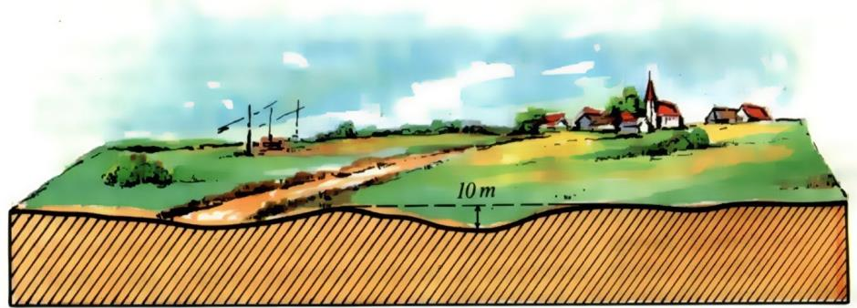
*8. A síkvidéken előforduló szintkülönbségek nem haladják meg a 10 métert (forrás: Ált/204)*

Síkvidéknek nevezzük azokat a tájakat, ahol markáns domborzati formák nem találhatók, a jellemző magasságkülönbségek (relatív magasságok) nem haladják meg a 10 métert, a lejtőszögek pedig a 2°-ot.

A síkvidék akár jelentősebb tengerszint feletti magasságon is elterülhet (fennsík), ha számottevő magasságkülönbségek a felszínen nem mutatkoznak. A magyar Alföld átlagos magassága a Balti-tenger szintje felett megközelítően 100 m, míg a Bükk-fennsíké 800 m. Léteznek a tengerszint alatti síkvidékek is, ezeket mélyföldeknek nevezzük.

A síkvidékek felszínét vizsgálva az alábbi síkságokat különböztetjük meg:
- megművelt száraz;
- megművelt nedves;
- műveletlen száraz;
- műveletlen nedves.

A megművelt száraz síkság úthálózata sűrű, népsűrűsége magas, mezőgazdasága fejlett. A kiépített úthálózat mellett szabályos rendszerű dűlőutakat is találunk rajta. A települések általában nagy távolságokra vannak egymástól, amelyek között tanyák, majorok és puszták húzódnak. Az itt található épületek zömmel vályogépítésűek.

Az utakat helyenként sűrű fasorok szegélyezik, ami a terep megfigyelhetőségét akadályozza. Tájékozódásra a templomtornyok, víztornyok, magas kémények és antennák, nagyobb halmok és magas fák alkalmasak. A földi felderítés ilyen területeken kevés eredményt nyújt, ezért a légi felderítés jelentősége nagy.

A sűrű úthálózat több menetoszlop kialakítását teszi lehetővé. Száraz időben a talaj többnyire jól járható, csapadékos időjárás és hóolvadás esetén nehezebb járművek csak az épített utakon juthatnak előre. A sűrű növényzet megkönnyíti a rejtett megközelítést.

A megművelt nedves síkság terepfedezete sűrű, a felszínt árkok, csatornák, töltések, fasorok, kerítések szelik át, az úthálózata is fejlett. A sűrű településhálózatot jól kiépített utak kötik össze. A terület megfigyelése, a rajta való tájékozódás, a felderítési tevékenység, az összeköttetés fenntartása hasonlóan zajlik, mint a megművelt száraz síkságokon. A sűrű úthálózat a gyors mozgást segíti. Az utakon kívüli mozgást a belvizes, árvizes időszakok, a vizenyős területek, és a vízelvezető árkok nehezítik, vagy ellehetetlenítik.

A műveletlen száraz síkság talaja szikes, esetleg futóhomokkal, vagy kavicstakaróval borított. Jellemző a felszíni vizek hiánya, a gyér település- és úthálózat. Magyarország jellegzetes megműveletlen száraz síksága a Hortobágyi puszta.

A pusztai terepen messzire el lehet látni, ám melegebb időszakban előforduló optikai jelenségek (délibáb, légrezgés) a tájékozódásra, megfigyelésre zavarólag hatnak. A tájékozódás a csekély számú jellegzetes, kiemelkedő tereptárgy miatt is nehezebb. A gyér terepfedezet miatt rejtőzésre nincs mód. A pusztaság az év legnagyobb részében jól járható.

A műveletlen nedves síkság vizenyős, mocsaras, lápos, ingoványos, posványos terület. Nádasok, nedves erdőségek, párás klíma, gyér lakosság és ritka úthálózat jellemzik. Fával, náddal fedett tereprészeken a földi és légi megfigyelés lehetősége korlátozott, ezért rejtőzésre alkalmas. Az utakról letérni, szétbontakozni, mozogni az utakat kísérő mély árkok, mocsarak miatt sokszor lehetetlen. A mocsaras ingoványos terepen csak gyalogosan lehet átjutni. Helyismerettel rendelkező vezetőkre szükség lehet.

**Homokbuckás vidék**

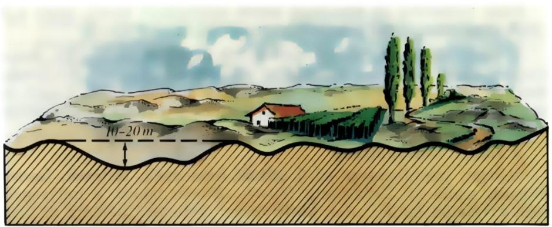
*9. A homokbuckás vidékre jellemző szintkülönbségek 10-20 méter közöttiek (forrás: Ált/204)*

A homokbuckás vidékek felszínére a napsugárzás (inszoláció) és a szélerózió (defláció) gyakorol leginkább hatást. A kopár, növényzet által gyéren, vagy egyáltalán nem borított felszínen a jelentős napi hőingadozás és a szél mechanikai hatására a talajt alkotó kőzetek fizikai aprózódása következik be. Az apró szemcsék a szél hatására tömegesen mozogva kisebb-nagyobb terepi egyenetlenségeket hoznak létre, melyek az uralkodó széliránynak megfelelően rendeződnek sajátságos felszíni formákba.

A homokbuckák általában a szél irányával párhuzamos sorokban helyezkednek el. Hazánkban a Duna-Tisza közén, a Kiskunsági-homokháton (Fülöpházi homokbuckák, Bugac), a Nyírségben és a Belső-Somogyban találkozhatunk jelentősebb kiterjedésű homokbuckás vidékekkel, de hasonló formák előfordulhatnak minden homokkal borított térfelszínen, így akár az Ócsa és Táborfalva települések közötti térségben is. A buckák relatív magassága ezeken a területeke jellemzően 10-20 méter közötti, de helyenként előfordulhatnak akár 50 métert is meghaladó szintkülönbségek.

A homokbuckás vidék a terepi tájékozódást jelentősen megnehezíti. A topográfiai térképek a homokbuckákat összevontan ábrázolják, ezért az álláspont meghatározása és a környező terep azonosítása a domborzat alapján többnyire nem megoldható. A magasabb halmok ugyanakkor jó kilátást biztosítanak. A terep az ellenséges felderítő tevékenységgel és tűzcsapásokkal szemben védelmet nem nyújt. A mozgást a laza szerkezetű talaj lassítja, száraz időszakban a homokon nehéz az előrejutás. A magas porképződés főleg viharos erejű szél esetén akadályozza a megfigyelést és a tájékozódást.

**Hullámos vidék**

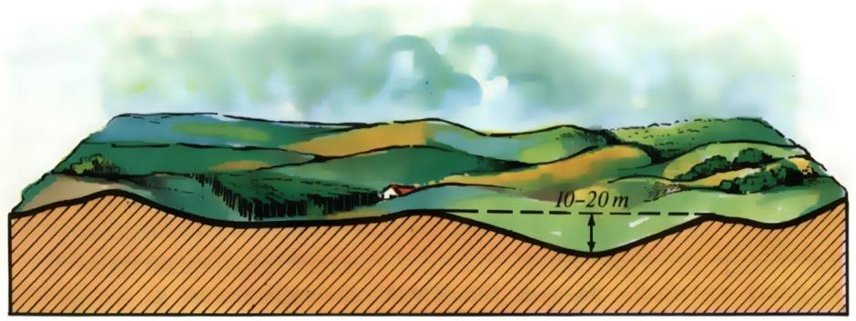
*10. A hullámos vidék szintkülönbségei megegyeznek a homokbuckás vidékkel, talaja viszont kötött (forrás: Ált/204)*

A hullámos vidék átmenet a síkság és a dombvidék között. Domborzata hosszan elnyúló lejtőjű hátakból áll. A jellemző magasságkülönbségek a homokbuckás vidékkel megegyezően 10-20 m közöttiek. A hullámos vidék talaja is hasonlóan aprószemcsés: homok, agyag, vagy lösz. A lényeges különbség a talaj kötött állapotában mutatkozik, mely a lényegesen dúsabb vegetációnak köszönhető.

A növényzettel sűrűn borított terepfelszín a földi és légi megfigyelést akadályozza. A magaslatokról, esetleg magasabb építményekről a terep megfigyelése kiterjeszthető. Az úton kívüli mozgást a növényzeti akadályokon túl főleg nedves, csapadékos időben nehezíti meg a löszös, agyagos talaj.

**Dombvidék**

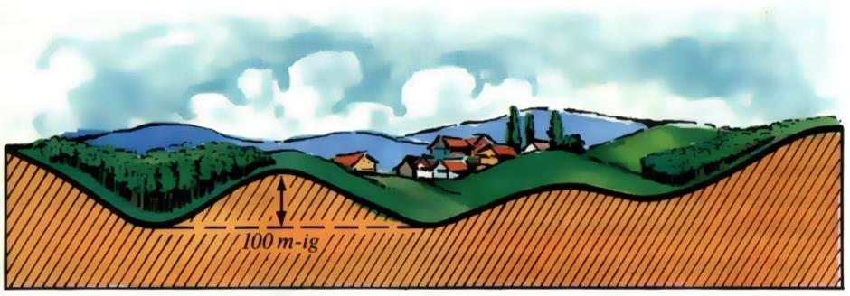
*11. A terepfelszín dombvidékre jellemző szintkülönbségei 100 méterig terjednek (forrás: Ált/204)*

A dombvidék kialakulhat önállóan, vagy átmenetet képezhet a hullámos vidék és a hegyvidék között. Felszínét dombok hosszasan elnyúló sorai, csoportjai jellemzik. A dombok relatív magassága jellemzően 100 méterig terjed. A domboldalak lejtői viszonylag enyhék. Meredek lejtők jellemzően az agyagos, csuszamlós, omladékos helyeken fordulnak elő. A völgyek teknőszerűek, fenekük általában vizenyős.

A dombvidékek felszínét többnyire szántók, legelők és rétek borítják. A talaj jellemzően agyagos, kavicsos. Kisebb erdők a meredekebb lejtőkön fordulhatnak elő. A déli fekvésű domboldalakon szőlők, gyümölcsösök, a völgyekben nedves rétek, berkek találhatók. A településhálózat viszonylag sűrű, de a településméretek nem jelentősek. A települések között majorok, tanyák és gazdaságok is találhatók.

A dombvidék a magaslatokról általában jól áttekinthető. Lapos, széles hátú domboknál a völgyekbe korlátozottan lehet belátni. A mozgás az év nagyobb részében akadálytalan, bár az emelkedők és lejtők leküzdése miatt lassú.

**Árkolt vidék**

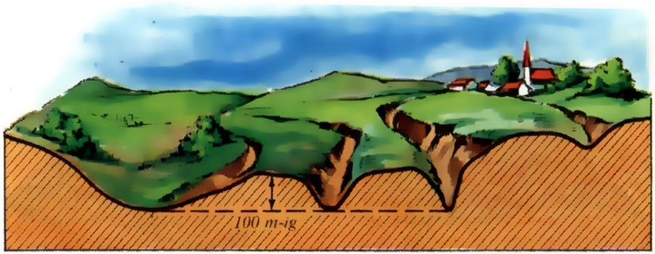
*12. Az árkolt vidék szintkülönbségei megegyeznek a dombvidékével, a felszín viszont jóval tagoltabb (forrás: Ált/204)*

Az árkolt vidéket széles, lapos hátak és mélyen bevágott völgyek jellemzik. A hátak relatív magassága legtöbbször 100 m alatt marad. A völgyek mélyén bevágott medrű patakok kanyarognak. A széles hátakon mezőgazdasági művelés folyik, a völgyekben rétek, kaszálók húzódnak. A termékeny föld miatt az árkolt vidékek viszonylag sűrűn lakottak. A települések a nagyobb völgyekben, vagy azok szélén, a hegyoldalakban helyezkednek el.

Az épített utak általában a völgyekben futnak többnyire az árkok irányával megegyezően. Az árkok haránt irányú leküzdése az ehhez szükséges jelentős erőkifejtés miatt kerülendő. A szélesebb hátakon minden irányban könnyű a mozgás.

A magaslatokról a kiemelkedő tereptárgyak jól láthatók, a völgyekbe viszont csak a magaslatok pereméről lehet belátni. A völgyekben nagy esőzések után rövid időtartamú, de intenzív áradások keletkezhetnek. Az ilyenkor nagy energiával áramló víz hidakat, utakat rongálhat meg. Az áradat után jelentős mennyiségű agyagos, köves hordalékanyag marad vissza. Ezek együttesen mind a közlekedést nehezítik.

**Hegyvidék**

A hegyvidékeket átlagos magasságuk alapján alacsony-, közép- és magashegységekre oszthatjuk.

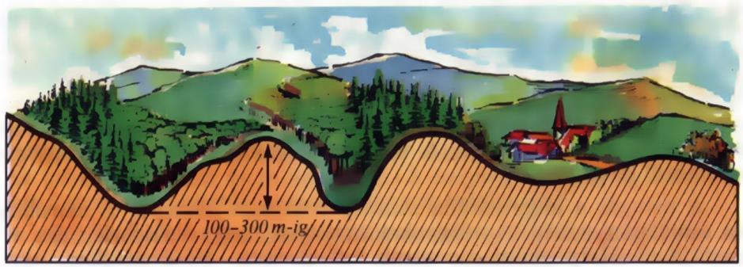
*13. Az alacsonyhegység szintkülönbségei 100-300 méter közöttiek (forrás: Ált/204)*

Az alacsonyhegység domborzatára a felszíni erózió hatására legömbölyített hegytetők és a köztük húzódó teknő- és árokszerű völgyek jellemzők. A terepfelszín jellemző magasságkülönbségei 100-300 m közöttiek, az abszolút magasságok 600 m-ig terjednek.

Az alacsonyhegység talaja többnyire agyagos, köves, mezőgazdaságilag közepesen művelt. Elsősorban a hegyvidék déli lejtőin találkozhatunk gabona-, szőlő- és egyéb bogyós gyümölcsök termesztésével. Az ország csapadékszegényebb, melegebb régióiban, különösen a mészkőhegységekben a déli lejtők jóval kopárabbak, mezőgazdasági művelésre alkalmatlanok. Az északi lejtőket ezzel szemben dús lombozatú erdők borítják.

Az alacsonyhegységekben a szélesebb völgyekben találkozhatunk településekkel, tanyák, majorok viszonylag ritkábban fordulnak elő. Elszórtan kisebb ipartelepek, kőfejtők és bányák is működhetnek, ezeket nem ritkán keskenynyomtávú ipari vasútvonalak kötik össze a településekkel. A völgyek vonalát vízfolyások és utak vagy ipari vasutak kísérik. Gyakoriak a meredek útszakaszok. Az utakon kívüli mozgás nehéz, elsősorban kisebb kötelékek számára alakulhatnak ki kedvező feltételek a rejtett megközelítés lehetőségeinek köszönhetően.

Az alacsonyhegység az uralgó magaslatokról jól belátható, az ellenlejtők nyílt terepszakaszai megfigyelésre és célzott tűz vezetésére a legalkalmasabbak. A figyelést a növényzettel fedett részek és tagolt felszín (mély és szűk völgyek) korlátozzák. A terepfelszín tagoltsága kedvez a holtterek kialakulásának, melyekkel nem csak a magaslatok mögött, de a meredekebb hegylábaknál is kell számolni. Az uralgó magaslatok a vezetés, összeköttetés és tűzhatás szempontjából lényegesek. A tagolt és fedett terepszakaszok az alegységek rejtett, meglepetésszerű előrevonására alkalmasak. A hegyvidéki területek a kiépített védelem szempontjából kedvező feltételeket biztosítanak.

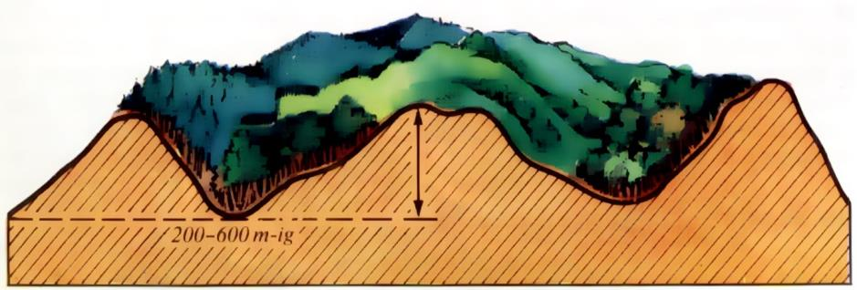
*14. A középhegység szintkülönbségei 200 métertől 600 méterig terjednek (forrás: Ált/204)*

A középhegységet szerteágazó, nagyobbrészt keskeny, részben legömbölyített hegyhátak, erősen tagolt hegytetők és hegyoldalak, mélyen bevágott völgyek, meredek lejtők jellemzik. A terepfelszín viszonylagos magasságkülönbségei 200–600 méter közöttiek, a tengerszint feletti magasságok 600–1600 métert érhetnek el. A középhegységet még alacsony középhegységre (600–1100 m-ig) és magas középhegységre (1100–1600 m-ig) is feloszthatjuk.

A középhegységeket legnagyobbrészt lombos erdők borítják. A lankásabb lejtőket és szélesebb hegytetőket elszórtan szántók, legelők és kaszálók tarkítják. A felszínt helyenként köves, sziklás részek törik meg. A völgyekben folyó vizek sebes folyásúak, vízhozamuk az évszak és az időjárás hatására szélsőségesen és rövid idő alatt megváltozhat. A vízfolyások medre, különösen az oldal- és mellékvölgyekben, köves, sziklás. Gyakoriak a járhatatlanul meredek és mély vízmosások, horhosok. Ezeket speciális felszerelés nélkül csak megkerülni lehet. Az utakon kívüli járást kidőlt fák törzsei, sziklaormok és meredek lejtők akadályozzák. Az épített utak főleg a fővölgyekben húzódnak. Az erdei utak előzetes felderítése feltétlenül szükséges.

Lakott területekre szinte kizárólag a nagyobb völgyekben bukkanhatunk. A patakok, folyók mentén fűrésztelepek, kisebb-nagyobb gyárüzemek húzódnak meg. Régebben huták, boksák, mészkemencék és kohók is előfordultak, jellegzetes szagú füsttel telítve a völgyek levegőjét.

A középhegységek terepe rejtésre, védekezésre kiválóan alkalmas, a felderítés szempontjából viszont kedvezőtlen. A megfigyelés a gyakori ködpára és a gazdag terepfedezet miatt korlátozott. Megfigyelésre a magaslatok álcázott figyelőpontjai alkalmasak, ezért e pontok uralása kulcsfontosságú.

A támadás a hegyvidéken lassan nyer teret. Az ellenlökések, meglepések, rajtaütések gyakoriak. Az összeköttetésre különös gondot kell fordítani. Bár a terep védelemre előnyösebb, a tűzhatás az erdők és a holtterek miatt korlátozott, és csak kis távolságokra lehetséges. A bevágott völgyekben és szakadékokban az aknavetők szerepe megnövekszik.

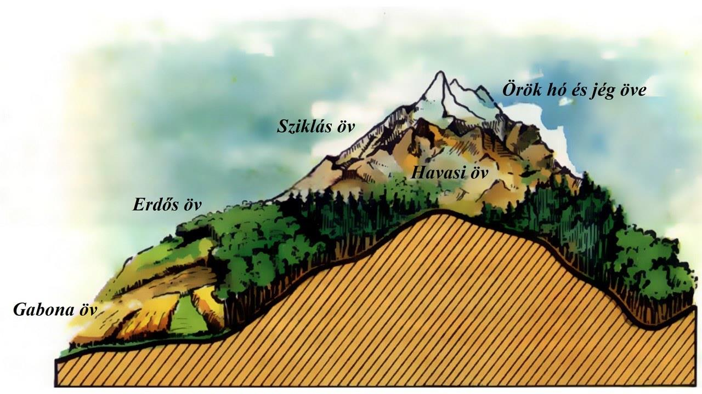
*15. A magas hegységek övekre osztása a növényzet elterjedése alapján (forrás: Ált/204)*

A magashegység tájrajzi szempontból övekre osztható fel. Ezek az övek a természetben is jól elkülönülnek a növényzet jellegének változásával. Az övek megnevezése ennek megfelelően a nagyobb és jellemző növényzettársulásokra vezethető vissza. Az övek sorrendben az alacsonyabb területekről a magaslat felé haladva abszolút magasságuk szerint az alábbiak:
- Gabona öv (kb. 600 m-ig)
- Erdős öv (kb. 2000 m-ig)
- Havasi öv (kb. 2500 m-ig)
- Sziklás öv (kb. 2800 m-ig)
- Örök hó és jég öve (2800 m-től)

Az övek abszolút magasságára az égövi és a klimatikus viszonyok is hatást gyakorolnak. Melegebb klimatikus viszonyok esetén és az Egyenlítő felé közeledve az övek határvonalainak magasságértékei növekednek, hűvösebb klímájú térségében és a sarkok felé közeledve az övek határvonalainak magasságértékei csökkennek. A hegyvidéki klímára jellemző az éves középhőmérséklet csökkenése a magasság növekedésével. Ez 200 méterenként 1° C-ot jelent átlagosan. A hegyvidéki övezetesség alakulására hatást gyakorolnak továbbá a környezeti viszonyok (uralkodó széljárás, napsütéses órák száma, csapadék) a domborzati- (lejtésirány, völgyek és medencék) és talajviszonyok, valamint az emberi tevékenység hatásai. Az övek között nincsenek éles választóvonalak. A növényzettársulások változása folyamatos, de az adott övre mégis jellemző képet alakít ki.

A gabona öv felső határának tengerszint feletti magassága térségünkben átlagosan 600 m-re tehető. Egyéb mezőgazdasági termelés mérsékelt övön jellemzően 1000 m-ig, a trópusokon akár 3000 m magasságig is folyhat. Az ezt követő erdős öv többnyire 2000 m tengerszint feletti magasságig terjed. Ezen övek jellegükben sok hasonlóságot mutatnak a középhegységhez. A lombhullató és a fenyves erdők közötti átmenetet az 1300-1800 m közötti sávban találjuk. A havasi, vagy alpesi öv az erdős öv felett, nagyjából 2500 m magasságig terjed. A magas fenyveseket fokozatosan törpe-fenyvesekkel tarkított legelők, bokros-cserjés növényzet váltja fel. Feljebb haladva mind gyakoribbak a meredek, sziklás lejtők és a hómezők.

A sziklás övet szaggatott sziklagerincek, meredek csúcsok és sziklafalak jellemzik, melyek lábánál kőtörmelék borítja a felszínt. A sziklakatlanokban kisebb tavak, tengerszemek bújnak meg. A köves medrű patakok és folyók bővizűek, sebes folyásúak, jellegzetes V alakú völgyekkel. A jelentős szintkülönbségeket a vízfolyások gyakori zúgókkal és vízesésekkel küzdik le.

A magashegység 2800-3000 méternél magasabb részeit az örök hó és jég övének nevezzük. E területet az év legnagyobb részében hó és jég borítja. A frissen hullott hó a napsütés és saját tömegének hatására mind tömörebb és keményebb állagúvá válik, más szóval firnesedik. Az így kialakuló csonthó (firn) nagyobb kiterjedésben jégmezőt alkot, amely az innen kiinduló völgyekben nagyon lassan folyó jégárrá (gleccser) alakul. A jégár csúszása következtében elmozdított és a gleccser oldalában vagy végén felhalmozódó kőtörmelék a moréna.

A magashegységi régió gyéren lakott. A tengerszint feletti magasság növekedésével fokozatosan ritkul az úthálózat. Az erdős övben kő- és fafeldolgozó ipartelepek, külszíni és felszín alatti bányaművelés, elszórtan erdészlakok, őrházak, szénégető kunyhók, a havasi övben juhhodályok, pásztorkunyhók, esztenák, vadászkunyhók, turista-menedékházak, üdülőhelyek előfordulására lehet számítani.

A magashegységben az időjárás gyakran és hirtelen változik, ami a tájékozódás és a felderítés számára kedvezőtlen. A völgyekben gyakran megragad a ködpára, a hegycsúcsokat pedig alacsonyfelhőzet boríthatja. Az uralgó magaslatok mellett a hegyi átjárók birtoklása is kulcsfontosságú.

**Karszt**

A karszt mészkőhegységekben, mészkőfelszíneken kialakuló formaegyüttes. Kialakulása a mészkő szénsavas víz általi oldhatóságára vezethető vissza. A karsztképződés folyamatai elsősorban a felszín alatt játszódnak le, de következményei a felszínre is hatást gyakorolnak, egyenetlen, tölcséres gödrök, dolinák, víznyelők, töbrök kialakulását eredményezve.

A mészkő a szivacshoz hasonlóan átereszti a csapadékvizet, ezért a felszíni vízfolyás karsztvidékeken ritka. A csapadékvíz a mészkőrétegeken keresztülfolyik, átszivárog, közben a mész a kőzetből kioldódik, a kőzetben üregek, barlangok jönnek létre. Az átfolyás mellett jelentős mennyiségű víz is felhalmozódik (karsztvíz).

Felszíni talaj termőréteggel foltokban rendelkezik. Anyaga sárgás, szürkés, tömör, vagy réteges, melyben a víz gödröket és üregeket old ki. A karszt járhatóságát felszíni tagoltsága határozza meg. A lejtős sziklafalak többnyire járhatatlanok. A mészkőfennsíkok járhatóságát a kisebb-nagyobb méretű mélyedések, gödrök, valamint az éles sziklaperemek, hornyok gátolják. A közlekedés zömmel a kiépített úthálózatra korlátozódik. A terep fedettsége szegényes, az álcázási feladatokra kiemelt figyelmet kell fordítani.

Az erődítési munkálatok, a terep előkészítése és berendezése, a tüzelőállások kiépítése csak megfelelő műszaki támogatással oldható meg hatékonyan. Kőomladékokban, nem túl durva kőzet esetén utászcsákány, csákánykapa is használható. A barlangok óvó-, illetve tároló helyként felhasználhatók. Figyelmet kell fordítani a kőzet keménysége miatt kialakuló szilánkképződés, továbbá a visszapattanó és félrepattanó lövedékek veszélyére, illetve az ellenük való védekezésre (homokzsák, földsánc).

## 6.2 TÉRKÉPÉSZETI ALAPISMERETEK

### 6.2.1 Vetületi alapismeretek

#### 6.2.1.1 Földet helyettesítő alakok

Az ókori görög tudósok az i. e. IV. században már igazolták a Föld gömb alakját. Az antik kor letűnésével annak tudományos eredményei, műveltsége is feledésbe merült. A középkorban hosszú évszázadokon át bolygónkat lapos felületű korongnak képzelték elődeink vagy esetleg más képzeletbeli alakzatnak.

A Föld gömb alakja és ezáltal körülhajózhatósága a nagy földrajzi felfedezések korában (XV–XVIII. század) nyert újfent igazolást. A Föld pontos méreteinek meghatározásához a XIX. században kibontakozó nemzetközi fokmérések szolgáltattak adatokat, de a század végére már gravimetriai mérések is rendelkezésre álltak. Napjainkban a precíz műholdas és geodéziai mérések révén Földünk szabályos gömbhöz viszonyított legkisebb alakeltéréseiről is részletes adatokkal rendelkezünk.

Bolygónk nem szabályos gömb alakjáról elsőként Isaac Newton angol fizikus, matematikus, csillagász értekezett A természetfilozófia matematikai alapelvei című 1687-es művében. Ebben nem csak az egyetemes tömegvonzás törvényét fektette le, de igazolta a forgása által ható erők révén a Földre jellemző lapult gömbalakot is.

A Föld forgástengelye a sarkpontjai között 12714 km hosszú, míg egyenlítői átmérője 12756 km. Ezt a bolygó méretéhez képest csekélynek tűnő, mindössze 42 km-es hosszkülönbséget a bolygó tengely körüli forgása eredményezi. Ha ezt a földalakot egy 30 cm átmérőjű labdával szemléltetnénk, azt alig 1 mm-rel kellene összelapítanunk ahhoz, hogy a Földhöz hasonló gömbszerű formát, azaz szferoidot, avagy forgástestként elképzelve forgási ellipszoidot kapjunk.

A szabályos gömbtől azonban nem csak lapultságot okozó erők miatt tér el a Föld alakja. Fizikai felszínét szilárd kérgének, a litoszférának egyenetlenségei teszik változatossá. Az ennek következtében kialakuló domborzati formákat célszerűen a Föld felszínének közel háromnegyedét borító hidroszféra felszínéhez viszonyítva határozhatnánk meg, amennyiben ez a felszín a szferoidot követné. Csakhogy a Föld belső egyenlőtlen tömegeloszlása következtében a nehézségi erőtér nem egyenletes szintfelületet eredményez bolygónk felszínén. A tengerek és óceánok nyugalmi állapotukban (tehát eltekintve az olyan tényezőktől, mint az árapály jelenségek, az áramlatok, a légnyomás és hőmérséklet ingadozások vagy a víz kémiai összetétele) ezt a felületet követik. Ennek az elméleti földalaknak a paramétereihez pontos gravimetriai mérések és műholdas pályaelemzések révén lehet hozzájutni. Megnevezésére a geoid kifejezést használjuk. Gyakorlati szerepét a fizikai földfelszín magassági viszonyítási alapjaként látja el.

E két elméleti földalak, vagyis a geometriai (szferoid) és a geofizikai (geoid) közötti eltérés (geoid unduláció) változatos értékeket mutat a Föld teljes felszínére vonatkozóan, de ritkán haladja meg a ±100 métert. Figyelembevétele térképészeti szempontból mégis lényeges, többek között a térképeken feltüntetett tengerszint feletti magasságok pontos meghatározásában.

Ha a szferoid rövidebb tengelye a Föld egyezményes forgástengelyével esik egybe, hosszabbik tengelye pedig az egyenlítő síkján fekszik, akkor geocentrikus, vagy földi ellipszoidnak nevezzük. Alkalmazásának előnye, hogy a Föld teljes felszínére biztosít egységes vonatkoztatási alapfelületet. Ennek alkalmazása ugyanakkor nem általános. Egyes országok térképészetei a saját kontinentális területükhöz jobban illeszkedő helyi, vagy referencia ellipszoid bevezetése mellett döntöttek. Ilyen referencia ellipszoidot (IUGG-67) használ a magyar polgári térképészet is 1976 óta alapfelületként. Az IUGG-67 a Nemzetközi Geodéziai és Geofizikai Unió által 1967-ben javasolt alapfelülete, melynek paraméterei eltérnek a NATO térképészeti szabványaiban szereplő WGS-84 jelzetű földi ellipszoidétól.

Az ellipszoid helyzetén túl méretbeli eltérésekkel is találkozhatunk a különböző térképészeti rendszerekben. A forgási ellipszoid mértani jellemzéséhez ezért a hosszabb (a) és rövidebb (b) féltengelyének adatait is meg kell adni. Hazánk, a többi NATO tagállamhoz hasonlóan, a WGS-84 megnevezésű földi ellipszoidot alkalmazza a Föld geometriai helyettesítő alakjául a védelmi célú térképészetében. A WGS betűszó egy geodéziai világrendszerre utal (angolul: World Geodetic System), a kiegészítő szám pedig az 1984-es bevezetés évszámát jelzi. A WGS-84 földi ellipszoid hosszabb (egyenlítő síkjában mért) féltengelye 6378137,0 m; míg a rövidebb (forgástengely irányú) féltengelye 6356752,3 m hosszú.

A térképészetben az ellipszoidok a vízszintes vonatkoztatási rendszerek alapjául szolgálnak. A tereptárgyak hely- és alakjelző pontjait ezen a felületen értelmezzük és határozzuk meg. Az ellipszoidról kartográfiai vetítés útján kerülnek a már meghatározott pontok a képfelületre, azaz a térképre. A továbbiakban amikor a Földről esik szó, annak valamely — legtöbbször ellipszoidi — helyettesítő alakjára kell gondolni.

#### 6.2.1.2 Földrajzi fokhálózat

A Föld gömbszerű alakjának igazolását követően egy a teljes földfelszínre érvényes és egységes helymeghatározó rendszer kialakítása vált szükségessé. A Földet szabályos gömbnek megfeleltetve, a legkézenfekvőbb megoldásnak a forgástengelye által kijelölt északi és déli pólusok, valamint az ezektől egyenlő távolságra húzódó legnagyobb gömbi főkör felhasználása mutatkozott. Az első erre épülő rendszer a földrajzi fokhálózat volt, ami széleskörű alkalmazást nyert a földrajzi pozíciók azonosítására, és napjainkban is elterjedten alkalmazzák különféle változatait.

A földrajzi fokhálózat hosszúsági és szélességi körökből épül föl. A szélességi körök az egyenlítővel párhuzamosan húzódnak, ezért paralelkörök megnevezéssel is ismeretesek. A szélességi körök a sarkok felé egyre kisebb kerületűek. A leghosszabb szélességi kör maga az Egyenlítő. A tengerészek a paralelkör értékét egészen a második világháborúig csak égitestek alapján tudták meghatározni a nyílt vízen.

A hosszúsági körök a Föld északi és a déli pólusát kötik össze a helyettesítő alak (ellipszoid vagy gömb) felszínén. Egy adott hosszúsági körön a Nap azonos időpontban delel, ezért ezt a vonalat délkörnek is nevezik. A hosszúsági kör másik elterjedt megnevezése a meridián.

A hosszúsági körök a helyettesítő földalakon azonos hosszúsággal bírnak ezért csak megállapodás alapján jelölhető ki közülük kezdő délkör. Ez a földrajzi hosszúságértékek számítása és az időzónák kialakítása szempontjából elengedhetetlen. Az egész világra érvényes megállapodásig számos kezdőkör volt használatban. Ma már általánosnak tekinthető a greenwichi csillagvizsgálón áthaladó délkör használata kezdő hosszúsági körként.

A szélességi és hosszúsági körök értékeit ívfok mértékegységgel adjuk meg. Az egyenlítő szélességi értéke 0°, míg a sarkoké 90°. A hosszúsági körök értékei a greenwichi kezdő meridiántól (0°) keletre és nyugatra 180°-ig növekednek. Amikor megadjuk egy földrajzi pozíció hosszúsági és szélességi fokértékét, azt is jeleznünk kell, hogy déli (S), vagy északi (N) szélességről, illetve keleti (E), vagy nyugati (W) hosszúságról van szó.

A Greenwichtől 180°-ra található hosszúsági kör közelében fut a dátumvonal. Itt áthaladva óránkon a naptári napot egyel előre, illetve hátrafelé kell átállítani, attól függően, hogy keletről nyugatra, vagy nyugatról kelet felé lépjük át a dátumvonalat.

#### 6.2.1.3 Térképi vetületek

A térképészetben alkalmazott vetületek lehetővé teszik az alapfelület görbült térfelszíne és a sík térképi képfelület közötti matematikai kapcsolat megteremtését. E kapcsolattól azt várjuk el, hogy Föld felszínének térképi megjelenítésében a lehető legkisebb torzulások keletkezzenek.

Számos tényezőtől függ, hogy a Föld felszínét, vagy annak egy részét milyen vetületben célszerű leképezni. Figyelembe kell venni az ábrázolandó terület kiterjedését, a választott térképi méretarányt, a térképi megjelenítés célját és a vele szemben megfogalmazott egyéb követelményeket.

Mindezek figyelembevételével a földfelszín térképi megjelenítéséhez alapvetően három vetülettípus közül választhatunk:
- síkvetület;
- kúpvetület;
- hengervetület.

A képfelületen a földrajzi fokhálózat rajzolata vetülettípusonként és a képfelület alapfelülethez viszonyított helyzetétől függően változik. A térképen megjelenő fokhálózat képe segít beazonosítani az alkalmazott vetülettípust. A vetülettípus alapvetően meghatározza a térkép adott feladatra való alkalmasságát és pontosságát.

Az alapfelület görbült felületének síkba fejtésekor óhatatlanul torzulások keletkeznek, ahogyan egy narancshéját sem lehet préselés, vagy darabolás nélkül síkba fektetni. Ezeket a torzulásokat bizonyos vetületek célirányos alkalmazásával igyekeznek a térképészetben csökkenteni. A torzulási tényezők alapján a vetületeket az alábbi csoportokba sorolhatjuk:
- hossztartó vetületek;
- szögtartó vetületek;
- területtartó vetületek;
- általános torzulású vetületek.

A fenti felsorolásból jól látható, hogy nincs olyan vetület, mely egyszerre hossz-, szög- és területtartó tulajdonságokkal rendelkezik. A térképi méretarány növelésével ugyanakkor bizonyos szögtartó vetületeknél a hossztorzulási tényező elhanyagolhatóvá válik.

A térképi méretarány a térképről levett hossz viszonyát adja meg terepi megfelelőjéhez képest. (Egészen pontosan a terepi távolság vízszintesre redukált alapfelületi hosszához képest.) Például az 1:25 000 méretarányú térképen mért 1 centiméter a terepen e távolságnak a 25 000-szerese, vagyis 250 méter.

A NATO tagállamokban védelmi célokra alkalmazott szabványos térképek csak meghatározott méretarányokban készülhetnek. Az alábbi felsorolás a katonai gyakorlatban jellemzően előforduló térképi méretarányokat és az adott méretarányhoz köthető felhasználási célokat tartalmazza:

1. M ≤ 1:5 000 000 ⇨ kontinenst, vagy kontinenseket magába foglaló földrajzi térségek áttekintésére és általános tanulmányozására, hadászati szintű tervezési és vezetési feladatokhoz, globális és regionális tájékozódás céljaira alkalmazott kis méretarány;
2. M = 1:5 000 000 — 1:2 000 000 ⇨ szubkontinentális és regionális kiterjedésű földrajzi térségek áttekintésére, általános értékelésére, hadászati-hadműveleti szintű tervezési és vezetési feladatokhoz, valamint sugárhajtóműves repülőeszközök léginavigációjára alkalmazott kis méretarány;
3. M = 1:2 000 000 — 1:500 000 (jellemzően 1:1 000 000) ⇨ regionális földrajzi értékelés céljaira; hadászati-hadműveleti szintű tervezési és vezetési feladatokhoz, légi hadműveletek tervezéséhez és léginavigációs feladatokhoz alkalmazott kis méretarány;
4. M = 1:500 000 — 1:250 000 (jellemzően 1:500 000) ⇨ országok, országrészek áttekintésére, általános földrajzi értékelésére, légi harcászati feladatok és kis magasságú átrepülések megtervezéséhez, illetve végrehajtásához, valamint szárazföldi hadműveleti szintű tervezési és vezetési feladatoknál alkalmazott kis-közepes méretarány;
5. M = 1:250 000 — 1:100 000 (jellemzően 1:250 000) ⇨ a szárazföldi csapatok és légierők hadműveleti szintű együttműködésének tervezésére, irányítására, vezetésére alkalmas, tájtípusok általános értékelésére, továbbá menetek, utánpótlási vonalak, repülések tervezésére és végrehajtására alkalmas közepes méretarány;
6. M = 1:100 000 — 1:50 000 (jellemzően 1:100 000) ⇨ szárazföldi műveletek harcászati szintű tervezésére és vezetésére (elsősorban magasabb egységek), az együttműködés megszervezésére, szárazföldi menetek megtervezésére és végrehajtására alkalmas nagy-közepes méretarány;
7. M = 1:50 000 — 1:25 000 (jellemzően 1:50 000) ⇨ a terep szárazföldi harcászati értékeléséhez, harcászati szintű tervezési és vezetési feladatokhoz, valamint terepi tájékozódásra alkalmas nagy méretarány;
8. M = 1:25 000 — 1:10 000 (jellemzően 1:25 000) ⇨ a terep részletes tanulmányozásához, a tereppel és annak elemeivel kapcsolatos pontos számvetések és terepelemzések végrehajtására, tagolt terepen tervezett terepi tájékozódáshoz, kisalegységek (raj, szakasz szintű kötelékek) harcászati feladatainak megtervezéséhez és végrehajtásához alkalmas nagy méretarány.

A katonai vezetési szintek és a térképi méretarányok között szoros kapcsolat áll fönn. A magasabb vezetési szinteken kisebb, az alacsonyabb vezetési szinteken nagyobb méretarányú térképet használnak. A földrajzi térképek jellemzően kisebb méretarányúak és nagyobb térségek általános célú értékelését teszik lehetővé. A topográfiai térképek ennél jóval részletesebbek és nagyobb méretarányúak. A topográfiai térképek minimális hossztorzulású, szögtartó hengervetületben készülnek, a nagyobb áttekintést nyújtó földrajzi térképek pedig zömmel szögtartó kúpvetületben.

A katonai térképeknél a szögtartó vetület alkalmazása alapkövetelmény, mert csak így biztosítható, hogy a térképről levett irányok és szögek a terepi megfelelőikkel azonosak legyenek. E követelmény kielégítésére mind az UTM (Universal Transverse Mercator) hengervetület, mind az LCCP (Lambert Conformal Conical Projection) kúpvetület alkalmas. Mindkét vetülettípust elterjedten alkalmazzák a NATO tagállamokban a védelmi célokra kiadott térképekhez. Fontos azt is tudni, hogy a 2012. évi térképészeti törvény (XLVI. törvény a földmérési és térképészeti tevékenységről) alapján az 1:10 000 és a nagyobb méretarányú térképek, a csak hazánk területére alkalmazott Egységes Országos Vetületben (EOV) is készülhetnek.

#### 6.2.1.4 Az UTM vetületi rendszer

Az UTM (Universal Transverse Mercator, azaz univerzális transzverzális Mercator-vetület) egy az egész Földre egyetemlegesen (univerzálisan) alkalmazható vetületi rendszer. Fő összetevője az az egyenlítői helyzetű (transzverzális) hengervetület, amit a szögtartó hengervetületek XVI. századi megalkotójáról, Gerardus Mercator flamand térképészről neveztek el. Az UTM vetületi rendszer és az arra épülő koordinátarendszert nemcsak a NATO tagállamokban használatos, de a világ számos országában is, így egyfajta világszabványnak is tekinthető a térképészetben és helymeghatározásban.

Bár az UTM mint vetület tetszőleges alapfelületre épülhet (ami természetesen eltérő koordinátákat eredményezhet azonos pontok esetén), a NATO tagállamok egységesen megállapodtak a WGS-84 földi ellipszoid alkalmazásában. Magyarország az 1999-es csatlakozással vállalta a NATO térképészeti szabványosítási egyezmények bevezetését, de a teljes átállás egészen 2004-ig elhúzódott. A régebbi, Gauss-Krüger vetületre épülő térképészeti anyagok ekkor végleg kivonásra kerültek.

Az UTM vetületi rendszer esetében az alapfelületet az N84° és az S80° szélességi körök között egy fekvő, avagy egyenlítői helyzetű hengerre képezik le. A henger átmérője valamivel (0,9996×) kisebb, mint a forgási ellipszoid meridiánjaié, így a transzverzális henger palástja két vonal mentén metszi az alapfelületet. A metszési vonalakon (p₁ és p₂) az UTM vetületi rendszer hengervetülete hossztartónak tekinthető. Kellően keskeny (6°-os) vetületi sávok kialakításával a hossztorzulások 1:10 000 méretarányig nem érnek el gyakorlati szempontból figyelembe vehető mértéket. A vetületi henger palástjára leképezett 6° szélességű sávot a két szélső meridián (m₁ és m₂) fogja közre.

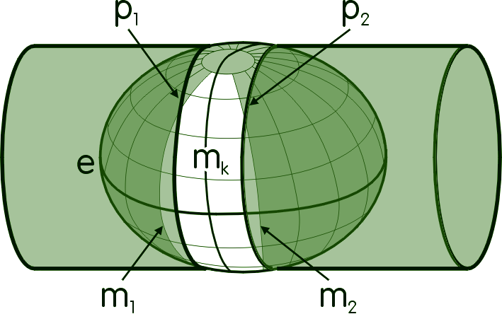
*16. Az UTM vetületi rendszer hengervetületének egy 6° széles sávját a szélső meridiánok (m₁ és m₂) határolják. A tőlük egyenlő távolságra futó középmeridián (mk) a sávhoz illeszkedő síkkoordináta rendszer egyik kitüntetett vonala, mely az Egyenlítőre (e) merőleges.*

Az alapfelület (földi ellipszoid) meghatározott szélességi körök közötti teljes felületének leképzéséhez a hengert 6 fokonként forgatják el az ellipszoid rövidebb tengelye mentén. Minden egyes elforgatással újabb sáv képezhető le a hengerpalástra. Az ellipszoid teljes felületének leképzéséhez így 60 sáv kialakítására van szükség. A vetületi sávok számozása az ellipszoid greenwichi kezdődélkörrel átellenes vonaltól (180°) indul, melynek mentén fut a nemzetközi dátumválasztó vonal.

Magyarország a 16° és 23° keleti hosszúsági körök között fekszik, így az ország területe a 33. (12°–18°) és a 34. (18°–24°) hatfokos UTM vetületi sávokra esik. A két sáv közötti határvonal (a 18° hosszúsági kör) Ács — Balatonalmádi — Bükkösd — Vajszló településeket érintve fut végig az országon.

### 6.2.2 Az UTM vetületi koordinátarendszer

Az UTM vetületi rendszerben minden egyes vetületi sávnak, avagy zónának saját koordinátarendszere van. Az ellipszoidról a hengerpalástra vetített 6° széles sávra — a palást síkba fektetésével — derékszögű sík koordinátahálózat illeszthető. Az illesztéshez a középmeridián és az egyenlítő vonalai a legalkalmasabbak, mivel ezek vetületi képe is egyenes. A szélső meridiánok ezzel szemben enyhén ívelve kötik össze a pólusokat. A sáv vetületi képe legnagyobb szélességét (668 km) az Egyenlítő vonalánál éri el.

A matematikai koordinátarendszertől eltérően a térképészetben az északi irányt tekintjük meghatározónak, ezért itt a függőleges tengely (középmeridián képe) az X és a vízszintes tengely (Egyenlítő vonalának képe) az Y. Az esetleges jelölési hibák elkerülése érdekében az X tengelyt az N (North, azaz észak), az Y tengelyt pedig az E (East, azaz kelet) jelöléssel különböztetjük meg. A koordinátaértékek előjel-tévesztéséből eredő hibák kiküszöbölésére a zóna területén csak pozitív előjelű koordinátákat alkalmazunk. Ennek érdekében az N (X) tengely eredeti helyéhez képest (N₀) 500 km-rel nyugatra található minden zóna esetében. Hasonló okból a déli féltekén az E (Y) tengely 10000 km-rel délre található az eredeti (E₀) helyéhez képest.

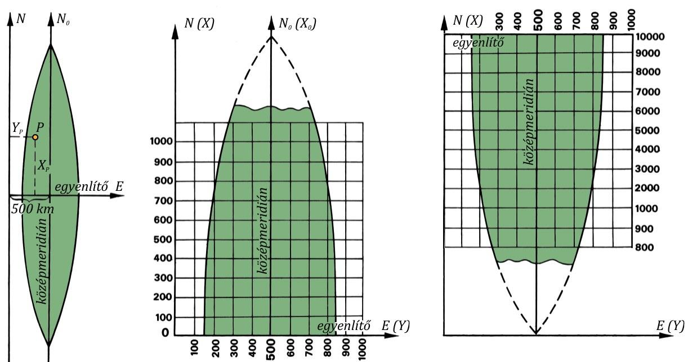
*17. A 6°-os UTM vetületi zóna koordináta-rendszerének kialakítása és P pont koordinátáinak meghatározása.*

A 60 vetületi sáv koordinátarendszereit zónaszámokkal különböztethetjük meg. Mint azt már megismerhettük az előzőekben, az UTM zónák számozása a dátumvonaltól indul, tehát a greenwichi kezdő meridián a 30. és a 31. zónák határán húzódik.

A 6°-os zónák a déli 80. szélességi körtől indulva 8°-os övekre is fel vannak osztva. Ez egyebek mellett egyértelművé teszi azt is, hogy a melyik féltekén vagyunk. (Az Egyenlítő vonala az M és az N övek határán húzódik.) A zónák övfelosztását részletesebben az MGRS (Military Grid Reference System) helyazonosító rendszer tanulmányozásánál fogjuk megismerni. Egyelőre annyit érdemes megjegyezni róla, hogy minden UTM zóna 20 övre van felosztva, melyeket a latin ABC betűivel jelölünk.

A zóna és övfelosztás eredményeként létrejövő 6°×8° kiterjedésű területegységeket UTM szegmenseknek nevezzük. Az UTM szegmens jelölése elengedhetetlen kiegészítője az UTM koordinátáknak, mivel nélkülük nem tudnánk beazonosítani azt, hogy melyik zónában, és annak melyik felében (déli, vagy északi) tartózkodunk. Egy adott pont UTM koordinátái mindezek alapján szabályosan leírva a következőképpen néznek ki:

34T 456789mE. 5678901mN.

A fenti UTM koordinátaérték azt jelenti, hogy az adott pozíció a 34. zóna T jelű övében (tehát Greenwichtől keletre és az északi féltekén), az N tengelytől 456 789 méterrel keletre és az egyenlítő vonalától (E tengely) 5 678 901 méterrel északra található. Bizonyos esetben a mértékegység és a koordinátatengely jelölései elmaradhatnak (34T 456789 5678901). Ilyenkor azt a szabályt vesszük figyelembe, hogy az UTM koordináták leolvasásakor először mindig az E tengely mentén (balról jobbra), majd az N tengely mentén mért értéket (lentről fel) határozzuk meg. A „balról-jobbra, lentről-fel" szabályt könnyű, és a térképes koordináta meghatározásoknál fontos is megjegyezni.

A NATO szabványos topográfiai térképeken az UTM vetületi derékszögű sík koordinátarendszer egész értékű vonalai az N (X) és E (Y) tengellyel megegyező irányú, egymástól egyenlő távolságra, a méretaránytól függő sűrűségben húzódó párhuzamos egyenesek formájában jelennek meg. E vonalak segítenek a térképi pontok koordinátáinak meghatározásában, illetve az ismert koordinátájú pontok felszerkesztésében.

Az 1:50 000 méretarányú topográfiai térképeken a hálózati vonalak között 2 cm térképi távolságot mérhetünk, ami a terepen 1 km hossznak felel meg, így e vonalakat kilométer hálózatnak is nevezzük. A kilométer hálózatra UTMG rövidítéssel is hivatkozhatunk, ami az UTM Grid kifejezésből képzett mozaikszó.

Az UTMG vonalai az 1:50 000 méretarányú topográfiai térképeken jellemzően fekete színnel jelennek meg. Az ettől eltérő színű hálózati vonalak általában valamely más koordinátarendszer jelölésére vezethetők vissza. A hazai szabványos topográfiai térképek polgári használatra kiadott változatánál ez az EOV koordinátarendszernek felel meg.

Mindezeken túl az UTM zónák széleinél elhelyezkedő térképszelvények keretvonalán jelenhetnek meg eltérő koordinátarendszerre utaló jelölések, mégpedig világoskék színű vonalkák és számjegyek formájában. Az azonos értékű vonalkákat összekötve kialakítható a szomszédos UTM zóna koordinátarendszerének jelölése az adott térképen. Ennek akkor van jelentősége, ha irány- és távolságszámításokat kell elvégezni pontkoordináták alapján, és a vizsgált pontok nem azonos UTM zónában helyezkednek el. A feladatnak van matematikai megoldása is, de azt egy másik tananyagban tárgyaljuk.

A topográfiai térképektől eltérően a 1501 sorozatszámú térképeken és minden erre épülő egyéb tematikus térképtípuson fekete színnel jelölik a földrajzi fokhálózatot, míg világoskék színnel az UTM koordinátahálózat elemei jelennek meg.

Egy térképi pont UTM koordinátáinak meghatározásához a pont jelétől nyugatra húzódó függőleges és délre található vízszintes hálózati vonal értékét kell első lépésként leolvasnunk. E vonalak teljes értékét a térképkeret délnyugati (bal alsó) sarkában találjuk meg. A például szolgáló ábrán Balatonalmádi hajóállomásának UTM koordinátáit határozzuk meg.

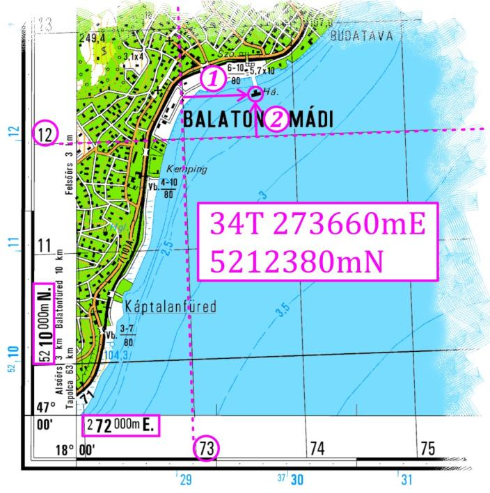
*18. Balatonalmádi hajóállomásának meghatározása 1:50 000 méretarányú topográfiai térképen UTM koordinátái alapján.*

A koordinátaértékek leolvasását, a már említett „balról-jobbra, lentről-fel" elvet követve, az E (Y) koordinátával kezdjük. A teljes koordinátaértéket a térkép első függőleges hálózati vonalánál találjuk a térkép keretvonalán (272000). Az ettől keletre (jobbra) húzódó függőleges vonalaknál már csak a kétjegyű kilométer értékek (73, 74, 75 stb.) olvashatók le. A hajóállomástól nyugatra (balra) eső hálózati vonal értéke alapján a meghatározandó E (Y) koordináta érték első három számjegye: 273. A következő számjegyek meghatározásához beosztásos vonalzóval megmérjük a 73 értékű vonal és a térképjel közötti távolságot. E célra használhatunk méretarány szerinti, vagy centiméter beosztású vonalzót. Utóbbinál ne felejtsük el a leolvasott távolságot a térkép méretaránya szerint átszámolni!

A példában e távolság 660 méter, vagyis a teljes E (Y) koordinátaérték 273660 lesz. Ezt az értéket még ki kell egészíteni az UTM szegmens jelölésével is ahhoz, hogy egyértelmű legyen melyik féltekén, illetve melyik zónában található az adott pont. Az ábrázolt térképi területre érvényes UTM szegmenst (34T) az MGRS azonosító meghatározásánál bemutatott kereten kívüli segédábra közli.

Az N (X) érték leolvasásánál hasonlóképpen járunk el, értelemszerűen a vízszintes hálózati vonalakat alapul véve. Az 52-t tehát a térképsarokból, a 12-t a hajóállomás alatti hálózati vonalról, a 380-at beosztásos vonalzóról olvassuk le, így megkapva az 5212380 koordinátaértéket.

### 6.2.3 A földrajzi koordinátarendszer

A földrajzi koordináták a Föld felszínén elhelyezkedő pontok helyét ívszög értékekkel határozzák meg, a két sarkot összekötő hosszúsági körök (meridiánok) alapján és az egyenlítő síkjához képest.

A földrajzi szélességet (φ) az egyenlítő síkjától mérjük északi, vagy déli irányban a meghatározandó pontig (P), N és S jelöléssel megkülönböztetve az északi és a déli szélességi értékeket. A földrajzi hosszúságot (λ) a greenwichi kezdő meridiántól (λ₀) mérjük a parallelek mentén a meghatározandó pontig (P), keleti vagy nyugati irányban, E és W jelöléssel megkülönböztetve a keleti és nyugati hosszúság értékeit.

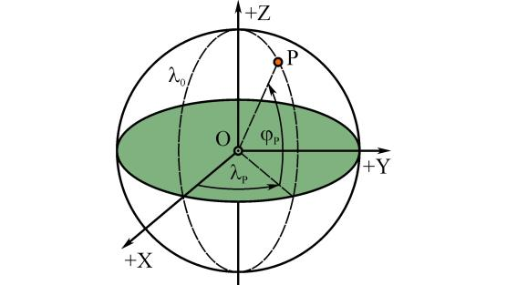
*19. P pont helyének meghatározása a Földet modellező gömb felszínén.*

Egy pont helyzetének meghatározásakor az alapfelületi földrajzi szélességén és hosszúságán kívül megadhatjuk a szabálytalan földalaktól (geoid) mért függőleges távolságát is, amit ortométeres magasságnak nevezzük. Adott tengerszinthez viszonyított ortométeres magasságokat tengerszintfeletti magasságoknak nevezzük, és H betűvel jelölünk. A terepi pontok magasságának meghatározásával a későbbiekben részletesebben foglalkozunk.

A térképeken a földrajzi koordináták meghatározását fokhálózati jelölések teszik lehetővé. Földrajzi fokhálózati vonalakkal jellemzően az 1:250 000 és kisebb méretarányú térképeken találkozhatunk. A nagyobb méretarányú térképeken a földrajzi fokhálózatra utaló jelek a térkép keretvonalán találhatók meg.

Egy térképi pont földrajzi koordinátáinak meghatározásához először a térképkeret vonalainak földrajzi hosszúsági és szélességi értékét kell meghatároznunk. Ez könnyű feladat, hiszen a keretvonalak találkozásánál ezen értékek megtalálhatók a térkép mind a négy sarkában. A példaábrán egy 1:50 000 méretarányú topográfiai térkép délnyugati sarka látható.

*20. Balatonalmádi hajóállomás földrajzi koordinátáinak meghatározása 1:50 000 méretarányú topográfiai térképen.*

A keret sarkában lévő értékek alapján megállapíthatjuk, hogy a térképi tartalom délen a 47° 00' (47 fok 0 perc) földrajzi szélességnél, nyugaton pedig a 18° 00' (18 fok 0 perc) földrajzi hosszúságnál ér véget. Ezekhez a határoló vonalakhoz képest határozzuk meg Balatonalmádi hajóállomásának földrajzi koordinátáit.

Először a földrajzi hosszúságot olvassuk le oly módon, hogy a déli keretre merőlegest húzunk a hajóállomás térképi jeléig. Jelöljük meg azt a pontot, ahol a merőleges vonal metszi a déli keretvonalat, és olvassuk le a fekete-fehér csíkozású vonalon, illetve mellette lévő pontsoron a földrajzi hosszúság perc (') és másodperc (") értékeit. Ehhez azt kell tudnunk, hogy a fekete és fehér csíkok 1 perc hosszúságúak, míg a pontsor pontjai 10 másodpercenként követik egymást. A példában egy teljes fekete csík és egy teljes pontköz olvasható le a hajóállomásig húzott merőlegesig, továbbá a következő pontköz hetede, azaz hét másodperc. Összegezve a leolvasott értékeket: 18° 00' + 1' + 10" + 7", azaz 18° 01' 17" földrajzi hosszúságot kapunk.

A hajóállomás földrajzi szélességét hasonlóképpen kell meghatároznunk a térképjelen átmenő, nyugati keretvonalra húzott merőleges segítségével. A percek és a másodpercek meghatározásánál figyelnünk kell a 60-as számrendszer szabályaira. Ezek közé tartozik az is, hogy a tíznél kisebb értékeket is két jeggyel írjuk le, nullát írva a számjegy elé.

A meghatározott pont földrajzi koordinátáit többféleképpen fejezhetjük ki. Alapesetben, ahogy általában a szögmértékeknél is, a fok-perc-másodperc (angolul Degrees-Minutes-Seconds, vagy rövidítve a DMS) alakot használjuk. Az értékeknél fel kell tüntetni azt is, hogy melyik féltekére esik az adott pont:

E18° 01' 17"; N47° 01' 34"

A koordinátaértékeket megadhatjuk egész fok és percértékkel, a másodperceket pedig decimális tört alakban, századperc pontosan:

E18° 01,28'; N47° 01,57'

vagy teljes decimális tört alakban:

E18,02139°; N47,02611°

### 6.2.4 Az MGRS helyazonosító rendszer

Az MGRS (Military Grid Reference System) az UTM vetületi koordinátarendszerére épülő, metrikus, katonai-keresőhálózati rendszer, amelyet a NATO tagállamok fegyveres erői alkalmaznak pozíciók, elsősorban földi célpontok helyzetének megjelölésére, jelentésére.

Az MGRS kialakításánál az operatív alkalmazhatóságot és az egyértelmű helyzetmegjelölést tartották szem előtt. A rendszer lényege, hogy három egymásra épülő adatpárral a Föld felszínén bármely pont helyzete gyorsan és egyértelműen meghatározható.

Az UTM vetületi rendszer tanulmányozásakor már megismerkedtünk az alapfelület 60 vetületi sávra történő felosztásával. A 6 fokos sávokat a 80° déli szélességtől észak felé haladva 8° széles övekre osztják egészen a 72° északi szélességig. Az utolsó öv északon 12° széles és a 84° szélességnél ér véget. Az öveket a latin ABC betűivel jelölik a C betűvel kezdve és az X betűvel zárva. Az I és az O betűk nem alkalmazhatók, mivel könnyen összetéveszthetők az 1 és a 0 számjegyekkel, illetve a J és Q betűkkel. Az ABC első és utolsó két betűjét (A, B, illetve Y, Z) a sarki területek azonosítására alkalmazzuk. Ezek a területek megjelenítésére UPS vetületű térképek alkalmazhatók.

Az UTM sáv- és övfelosztás alapján kialakuló területeket UTM szegmenseknek nevezzük. A szegmensek jelölése az adott zóna számából és az öv betűjelöléséből tevődik össze. Itt is a balról jobbra, lentről fel sorrendiséget kell alkalmaznunk. Magyarország területe 4 UTM szegmensre esik: 33T, 34T, 33U, 34U.

Az UTM szegmensek mérete általában 6°×8°, de az X jelű övben a 6°×12° méretű szegmensek mellett 9° és 12° széles szegmensek is találhatók. Az északi és déli sarkvidéki területek, melyeket poláris síkvetületben képeznek le, csupán két-két betűjelet kapnak. A félkör alakú szegmensek jelölésére délen az A és B, északon az Y és Z betűk használhatók.

Egy adott pozíció MGRS azonosítójának első adatpárja maga az UTM szegmens, ami elárulja, hogy az adott pozíció melyik zónában és övben található (pl. Csóka-hegy: 34T). A sarki területek esetében az azonosítóban ezen a helyen csak egy betű áll.

A második adatpár az adott UTM szegmensen belüli 100 km-es MGRS négyzet azonosító betűpárja, melyet a térkép keretében megadnak az UTM szegmens értékével együtt.

A négyzetazonosító betűpárjának első tagja a 100 km-es négyzetrács egy adott oszlopát, a második betű pedig egy sorát határozza meg (pl. Csóka-hegy: BT).

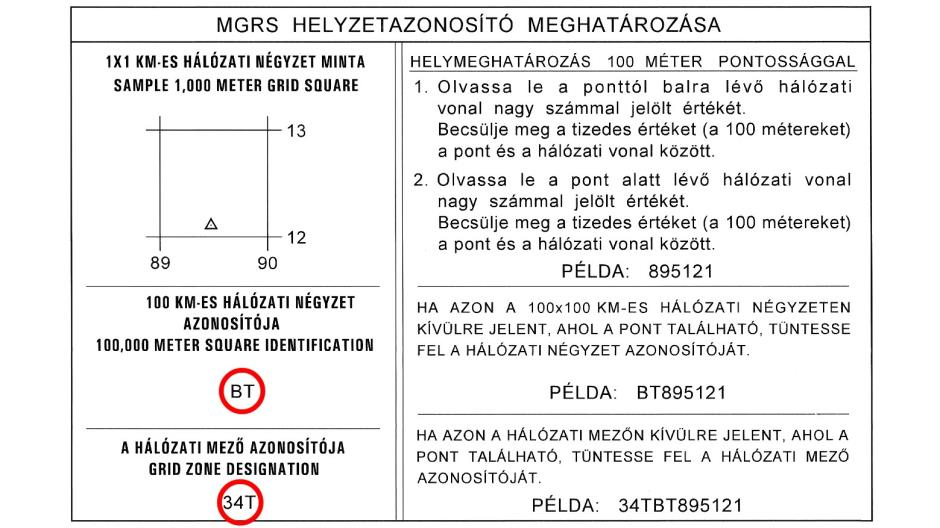
*21. A 34T jelű UTM szegmens területére eső 100 km-es MGRS négyzetek, és a BT jelű csonka négyzet meghatározása (forrás: MH GEOSZ oktatótérképek)*

A harmadik adatpár az adott pont vetületi koordinátáinak részértékei, vagyis az adott 100 km-es MGRS négyzet bal alsó sarkától az adott pontig mért derékszögű koordinátapár értékei. A harmadik adatpár számjegyeinek hossza a pozíció megjelölés pontosságára is utal, amelynek összefüggését az alábbi táblázat ismerteti:

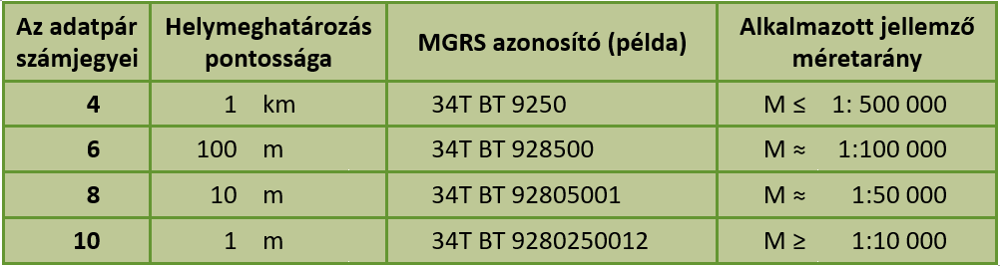

A helymeghatározás pontossága ez esetben azt jelenti, hogy az MGRS azonosító mekkora területet határoz meg, amelyen belül a pont kereshető. A 4 számjegyes (kilométeres) meghatározás esetén a pont az azonosítóval jelölt 1 km-es négyzeten belül bárhol megtalálható. Ha ennél pontosabban kell a pozíciót megadni, akkor további számjegyekkel egészítjük ki az azonosítót. Arra viszont ügyelnünk kell, hogy a harmadik adatpár csak páros számú számjegyből állhat (4, 6, 8, 10).

Általános gyakorlati szabály, hogy minél nagyobb méretarányú térképpel dolgozunk, annál több számjegy szükséges az MGRS azonosítók leírásához. Például az 1:250 000 méretarányú szabványos JOG (ejtsd: dzsog) térképekről nem érdemes és nem is lehet 8 vagy annál több számjegyből álló MGRS azonosítókat leolvasni. (A JOG azaz Joint Operation Graphic magyarul hadműveleti együttműködési térképet jelent.)

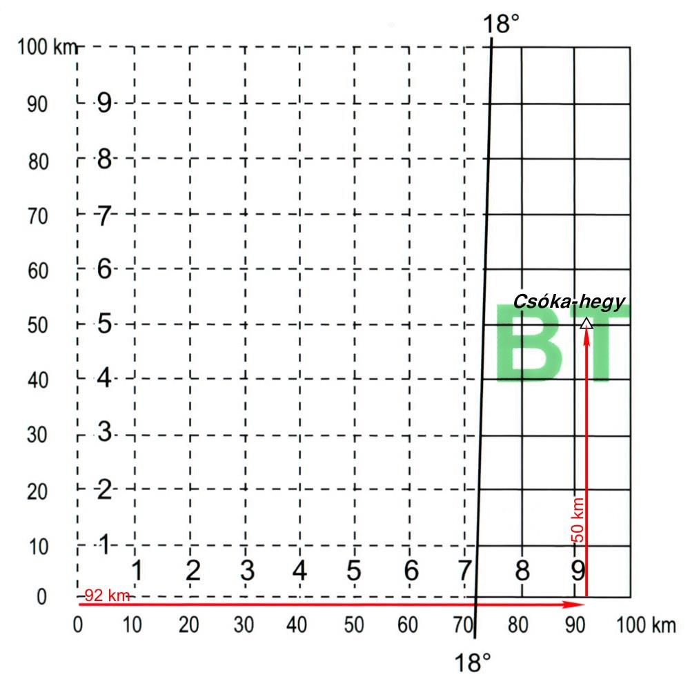
*22. MGRS azonosító harmadik adatpárjának leolvasása a BT jelű 100 km-es csonka négyzetben (forrás: MH GEOSZ oktatótérképek)*

A zónát határoló szélső meridiánoknál az MGRS négyzetek csonkulnak. Ez azonban a helymeghatározás menetére nem gyakorol hatást, vagyis a fenti ábrán látható BT jelű csonka négyzetet a keresett pont (Csóka-hegy) azonosítójának leolvasásakor úgy kell elképzelnünk, mintha teljes lenne. (Lásd a szaggatott vonalakat!).

Az azonosító értékének meghatározásánál a térkép keretében és a koordinátahálón található számok segítenek. Az utolsó számjegyek leolvasásakor már beosztásos vonalzót is igénybe kell vennünk. Lehetőség szerint az adott térképi méretaránynak megfelelő beosztású vonalzót alkalmazunk, de átszámítással a milliméter beosztású vonalzóval is le tudjuk venni a térképről az értékeket. Mivel az MGRS nem koordinátákat ad meg, hanem egy négyzet alakú terület azonosítóját, ezért az értékek leolvasásánál nem kerekíthetünk fölfelé.

Az UTM szegmensjelölést, a 100 km-es négyzetjelölést, valamint a négyzeten belüli részkoordinátákat szóköz, elválasztó- és egyéb jel nélkül egybeírjuk (pl.: 34TBT9280250012). Ha az adott feladat végrehajtása nem terjed ki más UTM szegmensekre, a szegmensre utaló jelölés elhagyható (BT9280250012). Ha egy adott MGRS négyzeten belül hajtunk csak végre feladatot a négyzetjelölés is elmaradhat (9280250012). Tereptárgyak gyors térképi beazonosítására elegendő km élességgel megadni a rövidített MGRS azonosítót (9250). Ez esetben a 4 karakter első két számjegye térképhálózat egy adott oszlopára, az utolsó kettő pedig egy adott sorára vonatkozik. Az oszlop és a sor találkozásánál lévő hálózati négyzetben megtaláljuk a keresett tereptárgy jelét. Fontos tudni, hogy a nem saját erőkkel való együttműködés során mindig a teljes alakot kell használni.

### 6.2.5 A GEOREF helyazonosító rendszer

A GEOREF mozaikszó az angol Geographic Reference System, azaz Földrajzi Vonatkozási Rendszer kifejezésből ered. A GEOREF a Föld teljes felszínére egységes és logikus pozíciójelölési és jelentési módszert kínál. Bár felépítése a katonai keresőhálózaténál egyszerűbb, elterjedtsége mégis kisebb. A GEOREF mindazonáltal a NATO tagállamokban elfogadott pozíciójelölési és jelentési módszernek számít, különös tekintettel a légierő alkalmazási területeire.

A GEOREF a földrajzi fokhálózat 15-tel osztható értékű vonalaira épül. A földrajzi koordinátarendszertől eltérően mértékegység jelölés nélkül, betűkből és számjegyekből álló karaktersorozattal adja meg egy pont helyét. A GEOREF azonosítók négy betűből és négy számjegyből állnak. Bár a betűk és a számok így jól elkülönülnek, az I és O betűket itt sem használhatjuk.

A földrajzi fokhálózati vonalakból felépített GEOREF sávok és övek egységesen 15° szélesek. A sávok jelölése latin betűkkel a 180° értékű hosszúsági körtől indul. Az övek jelölése a déli saroktól az északi pólusig tart, ugyancsak latin nagybetűkkel.

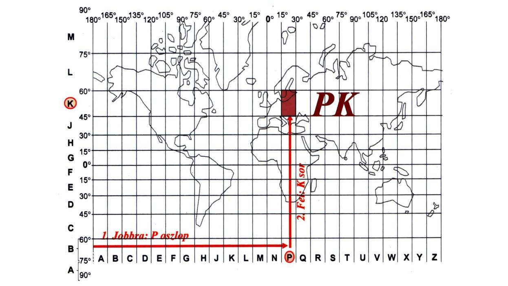
*23. A GEOREF szegmensek áttekintő vázlata a PK jelű szegmens meghatározásával (forrás: MH GEOSZ oktatótérképek)*

Egy 15°×15° méretű trapéz alakú GEOREF szegmens azonosítása az adott sávot és övet jelölő betűpárral történik. (A szegmensek trapéz alakzata a meridiánok összetartásával magyarázható. A paralelek képe az alkalmazott vetülettől függően görbült vonal). A betűpár első tagja a sávot, a második az övet jelöli. Magyarország területe a PK jelű GEOREF szegmensben található.

A szegmensek további felosztása 1°-os fokhálózati vonalakkal történik. A 15°×15°-os szegmens a 15 oszlop és 15 sor eredményeként 225 alszegmensre osztható. Az 1°×1° méretű alszegmensek is betűpárral azonosíthatók, az oszlopok és sorok betűjelölése alapján. Az 1° kiterjedésű GEOREF azonosító ekkor már két betűpárból áll (pl.: PKDC).

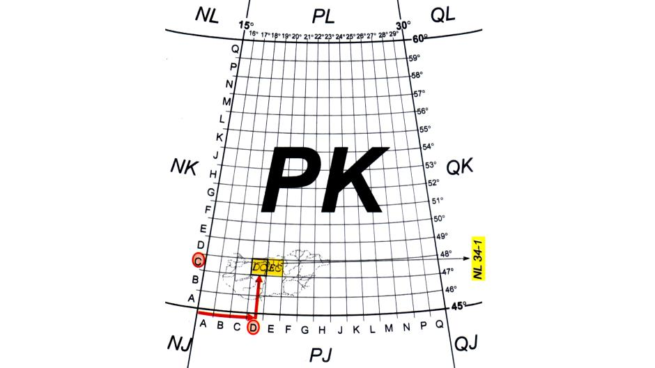
*24. A PK jelű 15°-os GEOREF szegmensek felosztása (forrás: MH GEOSZ oktatótérképek)*

Az 1°-os alszegmensek percfelosztásával és a percértékek számszerű kifejezésével kapjuk meg a GEOREF azonosító utolsó négy karakterét, ami azt az egy perc nagyságú területet határolja be, ahol keresett pont található.

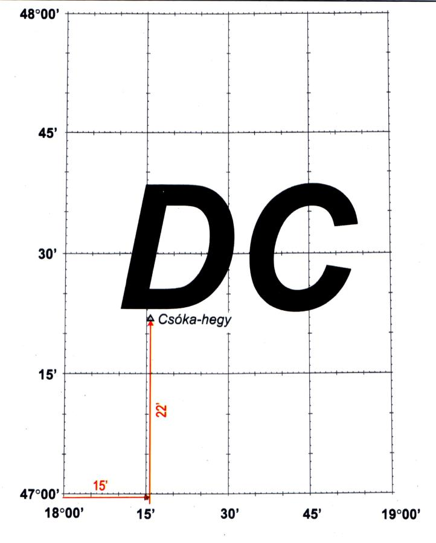
*25. GEOREF azonosító perc értékeinek leolvasása a DC jelű 1°-os alszegmensben (forrás: MH GEOSZ oktatótérképek)*

Az első két számjegy keleti irányú, a második két számjegy az északi irányú percleolvasás értéke az adott 1°-os alszegmens délnyugati sarkához viszonyítva.

A fentiek alapján, az ábrákon is látható példa szerint, Csóka-hegy perc élességű GEOREF azonosítója a következő: PKDC1522.

### 6.2.6 Térképi jelek és jelkulcsok

#### 6.2.6.1 Az egyezményes jelek rendszere

A térképek a tereptárgyakat előre meghatározott jelekkel ábrázolják. Országonként, alkalmazási és szakterületenként, de még időszakonként is e jelek jelentős eltéréseket mutatnak. Az egy térképrendszerhez, illetve térképtípushoz tartozó térképtermékeken egységesen alkalmazandó térképjeleket egyezményekben rögzítik, amiket térképi jelkulcsnak nevezünk. A térképi jelkulcs alapvetően az adott térképrendszerhez, illetve térképtípushoz tartozó térképjelek alkalmazásának szabályait foglalja össze, de mint arra neve is utal, a térképi ábrázolás sajátos grafikai jelrendszerét megfejteni képes segédeszközként is használható.

Az egyezményes térképi jelölésrendszer alá tartozó térképtípusokon csak az előre meghatározott térképi jelek alkalmazhatók. Ez teszi lehetővé, hogy a térkép felhasználói a már megismert és elsajátított jelekkel találkozzanak minden azonos rendszerhez tartozó térképterméken, megkönnyítve ezáltal a térkép tartalmának értelmezését.

A jelkulcsban szereplő térképjelek sokasága jóval meghaladja azt a mennyiséget, amit egy térképszelvényen ábrázolni lehet és szükséges. Ez természetes is, hiszen a térképi jelkulcsnak az adott térképrendszer által lefedett teljes földrajzi területre és a vizsgált földrajzi tényezők mindegyikének megjelenítésére alkalmas jeltípust kell tartalmaznia. Ez akár több száz különféle kartográfiai jel kialakítását és térképi alkalmazását is jelentheti.

A jelkulcs ezen kívül a térképi névrajz mintáit, az alkalmazható rövidítéseket és a kerettartalom kialakításának utasításait is tartalmazza.

Egy adott térképtípuson alkalmazandó jelek kialakításánál általános szabály, hogy a térképi jel alakja leegyszerűsített és elvonatkoztatott módon emlékeztessen a tereptárgy megjelenési formájára, jellegére, funkciójára. Ugyanígy lényeges szempont, hogy az egy rendszerhez tartozó térképek jelölései, még eltérő méretarányok esetén is azonosságot mutassanak.

A térképeken alkalmazandó színekre is előírásokat fogalmaznak meg a jelkulcsok. A térképi színeknek egyrészt igazodniuk kell a térkép felhasználójának fiziológiai, perceptuális és kognitív-pszichológiai sajátosságaihoz, melyek alapján lehetővé válik az ábrázolandó terepelemek, földrajzi jelenségek elhatárolása, azonosítása, tagolása; kapcsolódásainak feltárása; absztrakt fogalmak kialakítása. Ennek eredményeként a legjellemzőbb térképi alapszínekhez sajátos jelentéstartalmak rendelődtek: **fekete** — mesterséges létesítmények (épületek, utak, elektromos hálózat, határok stb.), térképi magyarázó jelölések és megírások; koordinátahálózat és megírásai; **barna/rozsdavörös/narancs** — domborzati elemek, szintvonalak; **zöld** — növényzet (erdő, gyümölcsös, szőlő stb.); **kék** — vízrajzi elemek (patakok, csatornák, folyók, tavak, mocsarak stb.); **vörös/narancs** — egyéb mesterséges létesítmények, vagy kiemelések (pl. települések, főutak, országhatárok). Hasonló, egységesen alkalmazott színkódolásra találunk példát a NATO egyezményes műveleti jeleinél (APP-6), ahol a **kék** — a saját és baráti erők; a **piros** — az ellenséges erők; a **zöld** — a semleges erők; a **sárga** — ismeretlen hovatartozású erők grafikus megjelenéséhez rendelt.

Az alkalmazott térképi színeknek mindezeken túl igazodniuk kell a térkép-sokszorosítási/megjelenítési eszköz lehetőségeihez. A papír térképeknél az offszet-nyomtatás fejlődése ellenére sem ajánlott 4-6 alapszínnél többet alkalmazni. Ezek kombinációjából jellemzően 8-16 színárnyalat érhető el, ami elégséges az általános térképi megjelenítés céljaira. A tematikus térképeknél előfordulhat ennél több szín alkalmazása is, ugyanakkor érdemes figyelembe venni az előzőekben említett emberi fiziológiai tényezőket is, melyek határt szabnak az alkalmazott színárnyalatok mennyiségének, azok megkülönböztethetősége érdekében.

A szabványos térképeken megjelenő jelmagyarázatok a térképi jelkulcsok egyszerűsített kivonatai. Nem térnek ki a térképi jelek alkalmazási szabályaira és nem is tartalmaznak minden térképi jelölést. Elsődleges szerepük a térképhasználó munkájának segítése azzal, hogy az adott térképszelvényre eső, illetve a vonatkozó térképrendszerhez tartozó legfontosabb jelek jelentéstartalmát megadják.

A térképi jelek osztályozhatók egyrészt a térképi jelkulcs besorolásuk szerint (erről bővebben a jelkulcs felépítését és tartalmát bemutató fejezetrészben lehet olvasni), de létezik egy egyszerűbb, és a térinformatika révén még meghatározóbbá váló csoportosítási módszer is.

Ebben a térképi jelek három csoportba sorolhatók az ábrázolt tereptárgy jellegét illetően:

1. pontszerű tereptárgyak jelei
2. vonalas jellegű tereptárgyak jelei
3. területi jellegű tereptárgyak jelei

**Pontszerű tereptárgyak** esetén a felülnézeti kiterjedés másodlagos jelentőségű, illetve az adott méretarányban a tereptárgy alaprajzi méretei jelentéktelenek. Ezek a tereptárgyak jó tájékozódási lehetőséget nyújthatnak, ezért pozíciójukat pontosan kell tudnunk meghatározni a térképen. Ilyen tereptárgy pl. a háromszögelési pont, a toronyszerű építmény, a fontosabb épület, egyedülálló fa. A földrajzi tér térinformatikai modellezésekor ezeket nulla dimenziós, vagy dimenzió nélküli tereptárgyaknak is nevezzük, mivel lényegében más térbeli jellemzőjével nem foglalkozunk (leíró adatain túl) mint pontos helyzetével.

A pontszerű tereptárgyakat a térképeken meghatározott alakú jelekkel ábrázolják, amelyeknek egy adott pontja adja meg a tereptárgy valós koordinátáit. A teljesen szimmetrikus alakzatoknál általában ez a jel középpontját, a szimmetrikus talpas jeleknél a talpvonal közepét, a nem szimmetrikus jeleknél a jel függőleges középvonalának és az árnyékvonalnak a találkozását jelenti.

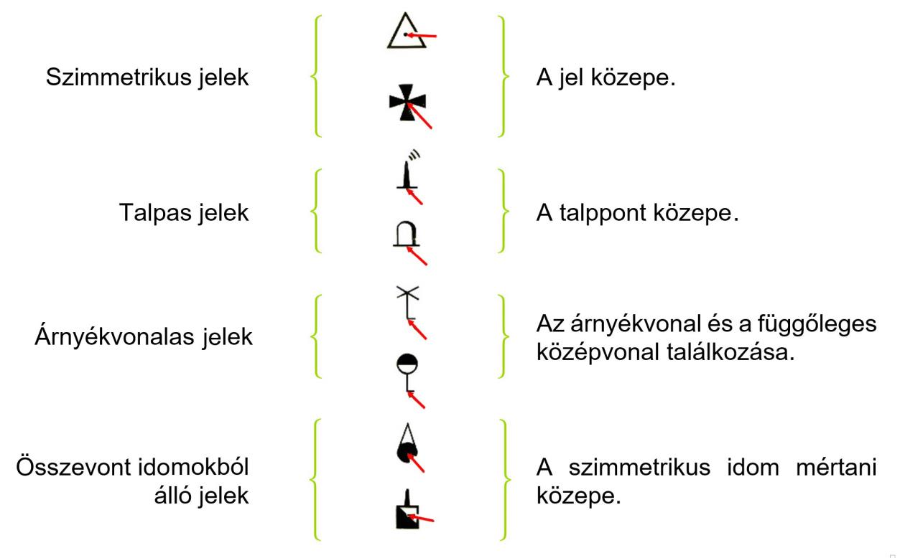
*26. Pontszerű jelek koordináta levételi pontjának meghatározása.*

A pontszerű tereptárgyak jeleinél jelentkezik elsősorban a méreten felüli ábrázolás, amikor a térképi jel méretei a valóságban jóval nagyobb területet foglalnának el, mint amit maga a tereptárgy alaprajza indokol.

A térképi méretarányból eredően olyan tereptárgyak is pontszerűen jelennek meg, amelyek a valóságban nem köthetők egy adott pontkoordinátához. Ilyenek pl. a vasúti megállók, a kisebb tanyák, épületek és üzemek, hajóállomások stb.

**Vonalas jellegű tereptárgyak** ábrázolásánál a térkép készítői a nyomvonal helyzetét és irányváltozásait rögzítik. A tereptárgy oldalirányú kiterjedése mellékes körülmény, vagy az adott térképi méretarányban nem fejezhető ki. A vonalas tereptárgyak (mint pl. az utak és a vasutak, a patakok és a keskenyebb csatornák, a kerítések stb.) jelei oldalirányban méreten felül ábrázolnak, ezért a közel eső vonalas tereptárgyak esetén mindig a fontosabbhoz képest rajzolják meg a kevésbé lényegest, utóbbi szükséges elmozdításával. A térinformatikai modellekben ezeket egydimenziós tereptárgyaknak is nevezzük, mivel lényegében más térbeli jellemzőjével nem foglalkozunk (leíró adatain túl) mint jellemző vektoraival.

**Területi jellegű tereptárgyak** esetén alaprajzilag azonos jelölést kell alkalmazni a topográfiai térképeken. Ilyen jelekkel a nagyobb kiterjedésű építmények, a növényzettel fedett területek, a szélesebb folyók, folyamok, jelentősebb tavak és mocsarak jelennek meg. Bár e tereptárgyak alak- és mérethelyesen jelennek meg a topográfiai térképeken, bonyolultabb alakzatoknál a lényeget nem érintő összevonásokra, egyszerűsítésekre számítanunk kell. Az alaprajzi ábrázolás a tereptárgyakat határoló kontúrvonalból és az azon belüli felületkitöltő jelből áll. A felületkitöltő jelek lehetnek különféle színek, mintázatok, vagy egyenletes eloszlású azonos szimbólumok. A térinformatikai modellekben ezeket kétdimenziós tereptárgyaknak is nevezzük, mivel térbeli reprezentációjukhoz a sík elegendő.

A térképi jeleket, legyenek azok pont, vonalas, vagy területi jellegűek, egyezményes magyarázó jelekkel, megírásokkal is kiegészülhetnek. Ezeket a jeleket és megírásokat nem önállóan használják, hanem az alaprajzi és a meghatározott alakú jelekkel együtt.

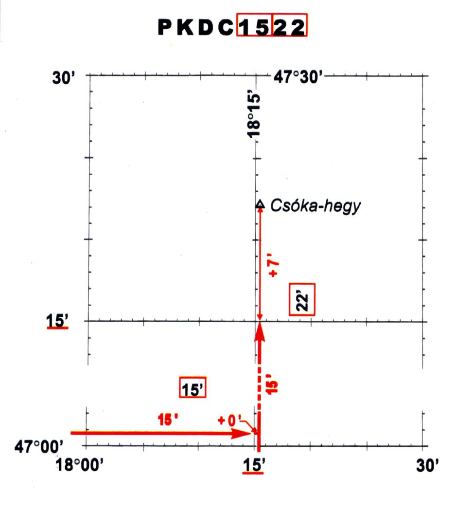
*27. Csatorna folyásirányának és főbb műszaki paramétereinek jelölése*

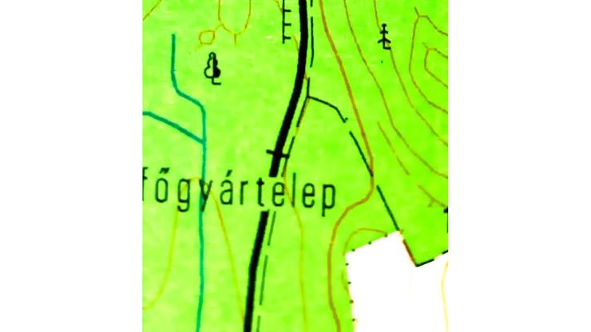
*28. Lomb- és tűlevelű erdők jelölésére alkalmazott jellegfa jelölések*

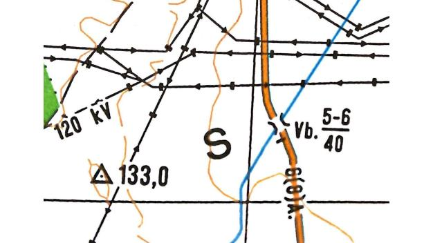
*29. Geodéziai alappont, út- és hídadatok, valamint távvezeték áramfeszültségének jelölése (forrás: MH GEOSZ oktatótérképek)*

A tereptárgyak műszaki paramétereinek megírásai a térképi jelekhez hasonlóan egyezményesen történik. A számszerű adatok mértékegység nélkül jelennek meg a térképen. Azt, hogy megírások egyes számjegyi, betűjelölései a tereptárgy mely sajátosságára vonatkoznak, a térképek jelmagyarázatánál találunk mintákat. Mivel a védelmi célokra kiadott topográfiai térképeken meglehetősen sok magyarázó jelöléssel lehet találkozni, a hatékony térképhasználat érdekében ezeket célszerű megjegyezni.

A térképi megírások könnyen túlzsúfolttá tehetik a térképi tartalmat, ezért a jellemző és gyakori térképi jelek kiegészítő szöveges magyarázatánál megengedett a rövidítések alkalmazása. Természetesen itt is csak a jelkulcsnak megfelelő szabványos rövidítések alkalmazhatók.

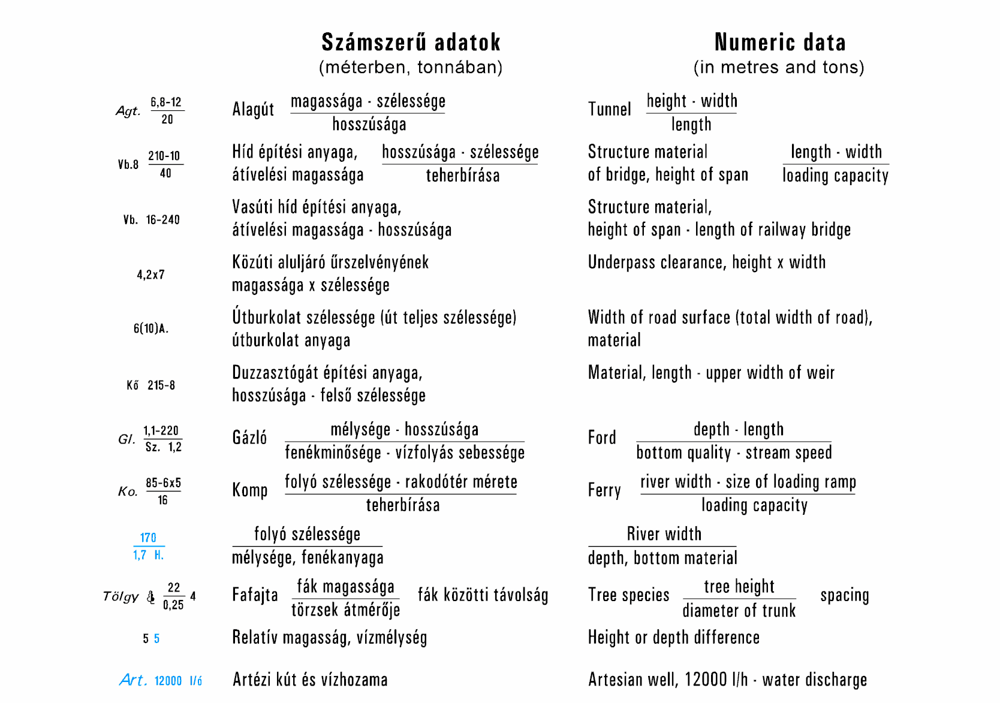

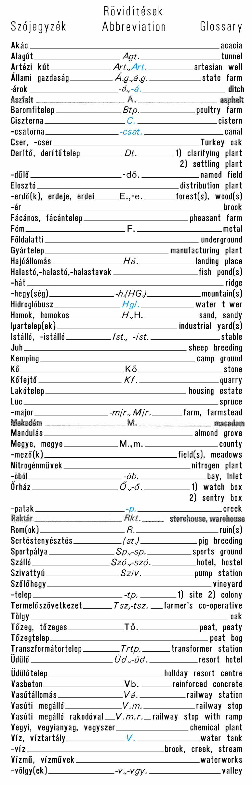

#### 6.2.6.2 A jelkulcs felépítése, tartalma

Az egyezményes jelek gyűjteménye 10 csoportra bontva sorolja fel a térképen megjelenő jeleket és megírásokat:

1. alappontok;
2. települések (épületek, építmények, tömbök);
3. ipari, mezőgazdasági, szociális és kulturális építmények;
4. vasutak és alépítményei;
5. műutak és talajutak;
6. vízrajz;
7. domborzat;
8. határok és kerítések;
9. növényzet és talajnemek;
10. írásminták.

**Alappontok**

Az alappontok csoportja a nagy pontossággal, geodéziailag meghatározott pontokat tartalmazza. E pontok jó része a terepen is jól látható pontjelöléssel rendelkezik. Koordinátáik ismeretében precíz helymeghatározások végezhetők a pont környezetében.

**Települések**

A topográfiai térképeken az összes települést ábrázolják. A fő-, átvonuló- és mellékutcákat méretaránytól függően alaprajzi hűséggel tüntetik fel, a kevésbé jelentősek elhagyásával. A fő és átmenő utcákat szélesebb utcavonallal emelik ki. A települések rajza mellett megtalálható nevük, esetenként lakosságuk lélekszáma és közigazgatási hovatartozásuk.

**Ipari, mezőgazdasági, szociális és kulturális építmények**

Az ipari és mezőgazdasági üzemek, kereskedelmi, szociális és kulturális létesítmények a topográfiai térképeken általában alaprajz hűen jelennek meg. A kémények, toronyszerű kiemelkedő építmények a tájékozódás elősegítése érdekében kerülnek a térképre. A különböző szociális és kulturális (egészségügyi) építményeket (intézményeket) a már ismert elvek szerint ábrázolják, fajtájukat megírással tüntetik fel (iskola, kórház, stb).

**Közlekedési hálózat**

A közlekedési hálózat ábrázolásánál a katonai szempontból lényeges terepelemek kerülnek előtérbe, amelyek a következők:

- vasutak és drótkötélpályák;
- autópályák, műutak, javított talajutak;
- mezei és erdei utak.

A közúthálózat a térképi méretaránytól függően, az utak jelentősége és a terep jellege figyelembe vételével, összevonásokkal jelenik meg.

A topográfiai térkép az úthálózat jellemzésére részletes adatokat tartalmaz egyebek mellett:

- az autópályák és műutak európai, nemzetközi és hazai számozásáról;
- a burkolt útfelület és az út teljes szélességéről;
- az útburkolat anyagáról;
- a kilométer jelölésekről.

**Vízrajz**

A topográfiai térképeken a vizeket és a hozzájuk tartozó vízügyi létesítményeket, adataik megírásával, a térképi méretarány adta lehetőség figyelembevételével ábrázolják. A vízrajz megjelenítésénél kiemelt jelentőségűek:

- a partvonalak;
- a partok jellege és a partvidék járhatósága;
- a vízfolyások és a vízgyűjtők rendszere, illetve azok műszaki berendezései;
- a folyók, tavak, csatornák hajózhatósága;
- a vízi akadályok (zátony, víz alatti sziklák, hullámtörők stb.);
- a vízi átkelés lehetőségei;
- a vízrendszerrel összefüggő építmények, létesítmények;
- a vízkivételi helyek (kutak, források).

A folyóvizekhez tartoznak a folyók, a patakok, a csatornák és a lefolyással rendelkező árkok. Állóvizek alatt a tavakat és duzzasztással nyert tározómedencéket értjük. Az időszakosan változó partvonalú állóvizek ábrázolásánál eltérő vízállási helyzetet vesznek figyelembe:

- tavaknál a középvíznek megfelelő vízvonal, azaz a közepes, tartós víztükör állása;
- a duzzasztással nyert tárolómedencéknél a vízszint tervezett vonala, normál duzzasztás esetén.

A meredek rézsűket és a sziklás partokat, kavicshordalékokat a domborzatábrázolásnál alkalmazott térképjelekkel fejezzük ki, kiemelve a nem, vagy csak nehezen járható partszakaszokat. A vízügyi (hidrotechnikai) létesítmények objektumai sorába a következő terepelemek tartoznak:

- kikötőhelyek, zsilipek, hajóemelő művek;
- vízierőművek, vízimalmok, völgyzárógátak;
- védőtöltések, duzzasztóművek, vízmércék, folyami jelzőtáblák.

Ezeket a létesítményeket általában fekete színű jelekkel ábrázolják a térképeken, amelyekhez betűk és rövidítések formájában egyéb lényeges adatok rendelhetők. A kutak és források is megírással egészülhetnek ki. A jó vízellátású területeken csak a legfontosabb kutakat és forrásokat tüntetik fel.

**Domborzat**

A terep domborzati formái (idomok) a topográfiai térképeken szintvonalakkal jelennek meg. A szintvonalak a domborzatot felülnézetben ábrázolják, ám a terepen való tájékozódás során a domborzati elemeket többnyire oldalnézetben, vagy madártávlatból látjuk. A pontos azonosítás érdekében az alábbi fontos domborzati formákat (idomokat) különböztetjük meg:

- vízválasztó domborzati idomok (kúp, hegyhát, pihenő, nyereg);
- vízgyűjtő (völgy, teknő, metsződés, vízmosás, horhos);
- a részletidomok (szikla, jégfal, suvadás, szakadék, homok és földomladék stb).

A szintvonalas domborzatábrázolás plasztikusabbá tehető domborzatárnyékolással. A kisebb méretarányú általános földrajzi térképeken az adott térség hegyrajzát színfokozatos domborzatábrázolással jelenítik meg.

**Határok és kerítések**

Ide tartoznak mindazon terepelemek, amelyek a terepi közlekedést akadályozhatják, illetve közigazgatásilag, jogilag eltérő hovatartozású területek találkozását jelzik. A vonal jelöléséből lehet következtetni a határ fontosságára, a kerítés akadályozó jellegére. A határvonalakra általában feltüntetik az elválasztott régiók, közigazgatási egységek, egyéb területek megnevezését. Előfordulhat, hogy a térképen csak a töréspontoknál jelennek meg rövidebb szakaszon a határok. Ez különösen akkor fordul elő, amikor a határvonal valamely más vonalas tereptárgy mentén fut.

**Növényzet és talajnemek**

A topográfiai térkép a növényzetet és a talajt, járhatóságuk, védelmi és álcázási tulajdonságaik figyelembevételével, a tájékozódás követelményeinek megfelelően ábrázolja. A növényzet és talajfajták határait a méretarány adta lehetőség szerint ábrázolja, azok mennyiségi és minőségi adatait ábrázoló egyezményes magyarázó jelekkel.

A növényzet ábrázolásánál előtérbe kerülnek a katonai szempontból fontosabb erdők, erdősávok, rétek, kertek, cserjések, gyümölcsösök, szőlők, egyéb mező-, illetve erdőgazdasági területek. A tájékozódás szempontjából fontos elemek (pl. kiemelkedő egyedülálló fák, kisebb ligetek) pontszerű jelként jelennek meg.

Az erdőkön való áthaladásnál fontos tájékoztató terepelemek az erdőátvágások, a nyiladékok, tisztások. Ezek az elemek a lehetőségek figyelembevételével alakhelyesen kerülnek ábrázolásra. A mezőgazdasági vetésterületeket (szántó) nem különböztetik meg. A többéves növénykultúrákat (gyümölcsöst, szőlőt, komlót stb.) a méretarány adta lehetőség szerint ábrázolják.

A talajt kiterjedésének megfelelő alaprajzban, területi kitöltő jelekkel, különleges esetekben egyedi kitöltő jelöléssel ábrázolják. Elsősorban a mozgást és a műszaki munkákat befolyásoló talajtípusokat ábrázolják. A mocsarakat a gyalogos közlekedés lehetőségei szempontjából minősítik, megkülönböztetve a járható, a nehezen járható, illetve a járhatatlan mocsarakat. A mocsarakat borító növényzetet fajtájának és kiterjedésének megfelelően tüntetik fel.

**Írásminták**

A topográfiai térképen alkalmazott megírások minden jellemzője (típus, méret, szín, helyzet stb.) szoros kapcsolatban áll a vonatkozó tereptárgyakkal és terepelemekkel. Ez egyben azt is jelenti, hogy a térképi megírások a szöveges tartalmán túl további fontos jelentéstartalommal bírnak. A csupa nagybetűvel szedett településnevek például városi közigazgatási szintre utalnak, míg az ugyancsak nagybetűkkel megírt vízrajzi elemek azok hajózhatóságára hívják fel a figyelmet.

### 6.2.7 A domborzat ábrázolása a topográfiai térképeken

A terep jellemzőit a domborzat alapvető módon határozza meg. Befolyásolja a közlekedést, az összeköttetést, a belátható terepszakasz nagyságát, a tűzhatás eredményességét, az utánpótlás megszervezését és egy sor egyéb feladat végrehajtását.

A topográfiai térképek a domborzatot szintvonalakkal jelenítik meg. A szintvonalak segítségével meghatározható:

- a terep legtöbb pontjának tengerszint feletti magassága (abszolút magasság);
- a tereppontok közötti magasságkülönbségek (relatív magasságok);
- a lejtők meredeksége;
- a domborzat idomainak alakja, formája.

A szintvonalak által meghatározott tengerszintfeletti magasságok Magyarország területén a Balti alapszinthez igazodnak. A Balti alapszint a kronstadti (Finn-öbölben található sziget) vízmérce középtengerszintnek megfelelő 0 pontján átmenő szintfelület. Egy adott pont (P₁) ehhez a szintfelülethez viszonyított magasságát (M₁) abszolút magasságnak nevezzük.

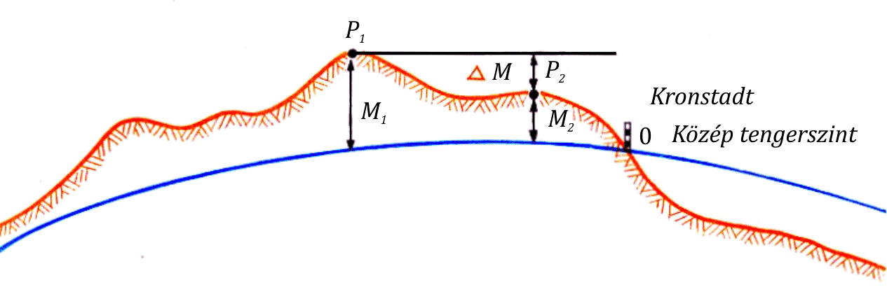
*30. A Balti alapszint (kékkel) és a tereppontok (P₁ és P₂) alapszinthez viszonyított abszolút magasságai (M₁ és M₂) (forrás: Ált/204)*

A terepen relatív magasságokat (ΔM) is meghatározhatunk két pont között. A relatív magasság a tereppontok abszolút magasságának különbsége:

ΔM = |M₂ – M₁|

A fenti képletből látszik, hogy alapesetben nem foglalkozunk a relatív magasság előjelével. Egy magaslatot megadhatunk abszolút magasságával, vagy a magaslat aljához (hegyláb) képest a relatív magasságával is. Ez ugyanis jobban kifejezi a magaslatnak a környezete fölé emelkedését. Ha például a hegy 252 m magas, és a hegy lába 165 m-nél található, akkor a hegy relatív magassága 87 m.

Bizonyos esetekben a relatív magasság meghatározásánál tisztázni kell azt is, hogy melyik ponthoz képest adjuk meg azt. Ilyenkor mindig a viszonyítás alapjául szolgáló pont magasságát vonjuk ki a viszonyítandó pont magasságából. Ha P₁ relatív magasságát akarjuk meghatározni P₂ ponthoz képest az alábbi képletet alkalmazzuk:

ΔM₁ = M₁ – M₂

Ha pedig P₂ relatív magasságát akarjuk meghatározni P₁ ponthoz képest az alábbi képletet alkalmazzuk:

ΔM₂ = M₂ – M₁

A fenti ábra alapján láthatjuk, hogy ha P₁ pont relatív magassága pozitív előjeles lesz, mivel P₁ magasabban helyezkedik el P₂ ponthoz képest, tehát abszolút magassága is nagyobb. Ezzel szemben P₂ relatív magassága a P₁ ponthoz képest negatív előjeles lesz, mivel abszolút magassága kisebb mint a P₁ ponté.

A térképen megjelenő szintvonalak a terep azonos abszolút magasságú pontjait kötik össze. E vonalak önmagukba visszatérőek, egymást sosem keresztezhetik. A szintvonalakat úgy is megkaphatjuk, hogy a terep felszínét az alapszinttel párhuzamos és egymástól azonos távolságra (alapszintköz) eső vízszintes szintsíkokkal elmetsszük. A terepfelszín és az egyenlő közönként azt metsző szintsíkok metszésvonalainak alapfelületre vetített képe adja a szintvonalakat.

Az alapszintköz, vagyis a vízszintes szintsíkok között kialakított szintköz a topográfiai térkép méretarányától és az megjelenítendő domborzati viszonyoktól függően változhat. Változatlan alapszintköznél a szintvonalak sűrűsége alapján következtethetünk a térképen lejtők meredekségére. (Ahol a szintvonalak sűrűbben helyezkednek el egymáshoz, ott a lejtő meredekebb, ahol ritkábban, ott lankásabb.) A domborzat ábrázolásához alkalmazott alapszintköz nagyságát a topográfiai térképeken mindig feltüntetik.

Az alapszintvonal mellett a topográfiai térképeken találkozhatunk még főszintvonalakkal, felező és kiegészítő szintvonalakkal is. Főszintvonalnak az alapszintköztől függően minden negyedik, vagy ötödik alapszintvonalat nevezünk ki, amelyeket vastagított, folyamatos vonallal jelölünk. A főszintvonal a szintvonal értékek gyorsabb meghatározását teszik lehetővé sűrű szintvonalrajz esetén.

A felező szintvonal az alapszintköz felének megfelelő szintsík metszésvonala. Hosszan szaggatott vonallal jelöljük. Segítségével a formagazdag és a lankásabb területek domborzati idomai jeleníthetők meg.

A kiegészítő szintvonalak rövid, szaggatott vonalak, az alap- és felező szintvonalak közti tájékoztató idomok kifejezésére szolgálnak. Helyenként negyedelő szintvonalnak is hívjuk, bár értéke nem feltétlenül negyede az alapszintköznek.

A szintvonalak magasságértéküket az őket létrehozó vízszintes metszősíkoktól kapják. A szintvonalakon feltüntetett magasságérték alapján tudjuk a terepi pontok abszolút magasságát meghatározni a térképen. A lejtők irányáról egyrészt az eséstüskék alapján, másrészt a szintvonalak magasságmegírásai alapján szerezhetünk tudomást, ez utóbbiak talpa ugyanis mindig a lejtésirányba mutat.

### 6.2.8 A topográfiai térképek szelvényezése

A földrajzi fokháló a pontok helyének terepi és térképi beazonosításán kívül a szelvényezési rendszerek kialakításánál is szerepet játszik. Elsősorban a hagyományos papír alapú térképek esetében szükséges a megjelenítendő földrajzi tér egységes, mértani felosztása nagy kiterjedésű területek ábrázolásánál, az alkalmazott papírméretektől függően. E célra a földrajzi fokháló meghatározott vonalait vesszük igénybe.

A Magyar Honvédség számára készülő topográfiai térképek egységesen az 1:1 000 000 méretarányú nemzetközi világtérkép (International Map of the World, IMW) alapján szelvényezettek. Az IMW az UTM szegmensekhez hasonló felosztásból indul ki, azzal a különbséggel, hogy 8 helyett 4 fokos öveket használ, melyek jelölésére a teljes latin ABC első 22 betűje felhasználható (tehát nem marad ki az I és az O).

Az északi félteke öveinek jelölése az egyenlítőtől indul. Az északi és déli félteke azonos szelvényjelöléseit az N (North, azaz észak) és S (South, azaz dél) betűkkel különböztetjük meg. A féltekére utaló betűjelzést hazai gyakorlatban nem alkalmazzák a nagyméretarányú térképek szelvényjelölésében.

Az IMW kiindulási alapja tehát a 6°×4° méretű szelvények, melyeket az 1:1 000 000 méretarányuk miatt röviden egymilliós térképszelvényeknek is neveznek. Jelölésük a zónaszámból és az öv betűjelzéséből tevődik össze. Az UTM szegmenseknél megismert módszertől eltérően itt először az övet, majd a zóna számát írjuk le. Magyarország területe az L-33, M-33, L-34, M-34 jelölésű egymilliós szelvényekre esik. A számokat és a betűket az IMW magyar alkalmazásában kötőjel választja el.

Az egymilliós szelvények felosztásával alakíthatók ki a nagyobb méretarányú térképekhez szükséges lapméretek. A 6°×4° méretű szelvények negyedelésével 1:500 000 méretarányú térképlapokat kapunk. Jelölésük az egymilliós szelvényszám kiegészítésével, nagybetűkkel történik. Az 1:500 000 méretarányú térképlapokat nem osztjuk tovább.

*31. Az L-34 jelű 1:1 000 000 méretarányú (6°×4°) IMW szelvény felosztása nagyobb méretarányú lapokra (forrás: Ált/204)*

Az 1:200 000 méretarányú lapok kialakításához az egymilliós szelvényt 6 oszlop és 6 sor révén 36 részre kell osztani. E szelvények jelölése az egymilliós szelvényszám kiegészítésével, római számokkal történik. Az 1:250 000 méretarányú JOG térképek hazai bevezetésével e méretarányt már csak indokolt esetekben alkalmazzák. A kétszázezres szelvényeket nem osztjuk tovább.

Az arab számmal jelölt 1:100 000 méretarányú lapok az egymilliós szelvény 144 részre osztásával (12 oszlop és 12 sor) jönnek létre. A százezres szelvények negyedelésével hozhatók létre az 1:50 000 méretarányú térképek, amelyeket nagybetűk kiegészítésével különböztetünk meg. További negyedeléssel jutunk az 1:25 000 méretarányú térképek szelvényeihez, amelyeket már kisbetűkkel kiegészítve jelölünk. A már említett 1996-os térképészeti törvény rendelkezése szerint az ennél nagyobb méretarányú térképek EOV vetületben és az Egységes Országos Térkép Rendszernek (EOTR) megfelelő szelvényezéssel készülnek.

Az egyes szelvények jelölése az előbbiekben ismertetett felosztás alapján jön létre úgy, hogy az egyre nagyobb méretarányú szelvényekhez rendelt betűket vagy számokat kötőjellel elválasztva egybeírjuk. Az így létrejövő szelvényszámot szelvényszámnak, vagy nomenklatúrának nevezik.

Az IMW szelvényezési rendszerének előnyös tulajdonsága a hierarchikus felépítés. Ez teszi lehetővé azt, hogy minden egyes szelvényjelölés a földfelszín egy konkrét területét is meghatározza. A szelvényjelölések így nagyobb területek, térségek beazonosítására is alkalmasak.

Az egységesen 1501 sorozatszámú hadműveleti együttműködési (JOG) térképek szelvényezése némiképp eltér az eddig ismertetett módszerektől. A 1:250 000 méretarányú térképek szelvényezésének alapját az IMW 6°×4°-os egymilliós szelvényei adják, melyeket 12 egyenlő részre osztva kapjuk a 2°×1° kiterjedésű JOG térkép szelvényeket. E szelvények jelölésénél már feltűnik a féltekére vonatkozó betű, az egymilliós szelvény jelölése itt azonban kötőjel nélkül történik (pl.: NL 34-1).

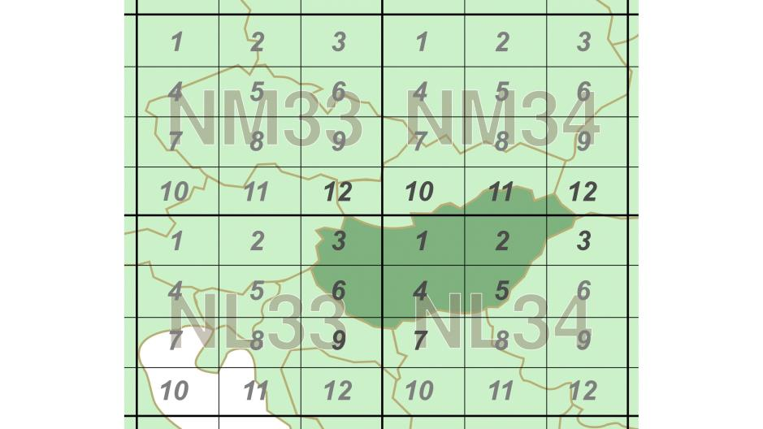
*32. A hadműveleti együttműködési térképek (JOG) szelvényezése Magyarország térségében.*

A szabvány méretű térképlapok meghatározott ívméretekkel rendelkeznek, amelyeket a következő táblázat ismertet:

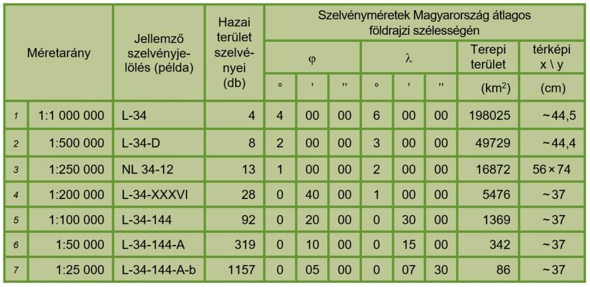

A hosszúsági körök pólusok irányába mutatkozó összetartása miatt az egymilliós szelvények az Egyenlítő vonalától távolodva egyre keskenyebbekké válnak. A 60° szélességi körtől egy térképlapra már két 6°×4° méretű szelvény kerül, a 79° szélességi körtől pedig már négy szelvény is elhelyezhető egy térképlapon.

## 6.3 TÁJÉKOZÓDÁSI ALAPISMERETEK

A tájékozódás alatt jelen tananyagban alapvetően a szárazföldi navigáció módozatait és eszköztárát vizsgáljuk. Tesszük ezt annak tudatában, hogy a latin eredetű kifejezés (navigatio) alapvetően a tengeri közlekedésre, vagyis a hajózás során alkalmazandó tájékozódásra vonatkozik, manapság viszont mind a szárazföldi, mind a légi közlekedésben létjogosultságot szerzett a tájékozódási feladatok és képességek meghatározásában.

### 6.3.1 A terepi tájékozódás alapjai

A katonai tevékenységek jelentős része elkerülhetetlenül összefügg a tereppel, a terepen való megbízható és gyors tájékozódással. A tájékozódási készség a terepi tájékozódás szabályainak, műveleteinek, eszközeinek és módszereinek megismerésével, valamint a különböző környezetben és feltételek mellett végrehajtott tájékozódási feladatok megoldásával szerezhető meg.

**Tájékozódni a terepen annyit jelent: ismerni álláspontunk helyét a fő világtájakhoz és a környezetünkhöz viszonyítva.**

Terepi tájékozódásra meglehetősen sok módszer közül választhatunk. Azt, hogy melyik módszert fogjuk alkalmazni egy adott helyzetben az alábbi tényezőktől függ:

- a terepi jellegétől és a környezeti feltételektől,
- a rendelkezésre álló eszközöktől,
- a tájékozódás dinamikájától.

Megfelelő látási viszonyok és jól azonosítható tereptárgyak esetén terepazonosítással (Terrain Association — TA) célszerű a terepen tájékozódni. A terepazonosítást nagymértékben megkönnyítik, gyorsítják és megbízhatóvá teszik a terepi tájékozódás klasszikus eszközei, a nagyméretarányú topográfiai térképek, a tájoló és az optikai távmérésre alkalmas távcső.

Amennyiben a látási viszonyok nem kielégítőek (köd, por/homokvihar, éjszaka stb.), vagy a terepen nem találhatók kellő mennyiségben tájékoztató tereptárgyak (sivatag, kopár fennsík, hómező, nagy kiterjedésű sztyeppe, erdőség stb.), irány és távmérésen alapuló önálló menet végrehajtásával lehet tájékozódni, amit azimutmenetnek (Dead Reckoning — DR) nevezünk.

Lényegesen növelhető a terepi tájékozódás gyorsasága és megbízhatósága műholdas navigációs jelvételre alkalmas eszközzel (GPS vevő). Ennek használatáról és alkalmazásának feltételeiről a későbbiekben még szó lesz.

A terepi tájékozódás dinamikája alapján két fő esetet különböztetünk meg:

1. **Tájékozódás álló helyzetben**
   a. ha terepi tájékozódásra elegendő idő áll rendelkezésre (pl. parancsnoki tereptájékoztató előkészítésekor);
   b. ha a tájékozódás helyzetét nem lehet megváltoztatni (pl. korlátozott terepfedezet esetén);
   c. ha menet közben végzett tájékozódásnál megszakad a terep-térkép kapcsolat (magyarán szólva eltévedünk)

2. **Tájékozódás menet közben**
   a. ha menet végrehajtása a feladat;
   b. ha az adott pozíció nem tartható.

Álló helyzetben végrehajtott tájékozódás során az álláspont, a világtájak és a terep főbb elemeinek egymáshoz viszonyított helyzete változatlan marad. A terepet jobban meg lehet figyelni. Irányzásokkal és mérésekkel a tájékozódás biztosabbá tehető.

A mozgás közben végzett tájékozódás, történjen az gyalogosan vagy járművel, a terep és a térkép folyamatos egyeztetésére épül, s mint ilyen fokozott figyelmet igényel. A tájékozódó helyzete állandóan változik a terephez és a világtájakhoz képest. Az álló helyzetű tájékozódás műveleteire nem áll rendelkezésre idő, így a helymeghatározás könnyen bizonytalanná válik. A terep megfigyelése nehézkes, a domborzati idomok látszólagos alakja folyamatosan változik. A haladási sebesség növekedésével egyre kisebb méretarányú térképre van szükség.

A biztos tájékozódáshoz egy pontot és egy irányt állandóan azonosítanunk kell a terepen és a térképen. Mozgás közben a tájékozódásnak folyamatosnak kell lennie, a terep-térkép kapcsolat nem szakadhat meg. Ha ez mégis bekövetkezik azonnal meg kell határozni az álláspont helyét és a további menetirányt. Ha az álláspont meghatározása nem sikerül, vissza kell menni az előző ismert pontra, ott ismételten és gondosan ki kell választani a továbbhaladás helyes irányát és folytatni a mozgást.

A tájékozódáshoz számos segédeszközt használhatunk, amelyek közül a legfontosabbak a tájolók, a távcsövek, a térképek és a vonalzók. A korszerű tájékozódási eszközök közé a különféle műholdas helymeghatározó és navigációs eszközök, valamint a lézertávmérők és a különleges megfigyelő távcsövek tartoznak. Térkép nélkül főleg kisebb alegységek (raj és szakasz) parancsnokai tájékozódnak. Az alárendeltek tájékozódásának elősegítésére a parancsnoki tereptájékoztatók jó alapot adnak, melyből kiindulva eredményesen hajtják végre saját feladataikat a terepen.

#### 6.3.1.1 A terepi tájékozódás eszközei

A terepi tájékozódás egyike azon tevékenységeknek, melyekre már a kezdetektől szüksége volt az emberiségnek. A túlélés alapja volt visszatalálni a kiinduló pontra, vagy hosszabb idő elteltével is visszatalálni létfontosságú helyszínekre. A tájékozódási képességért több agyi terület együttműködése felelős, de meghatározó jelentőségű a látásért és a rövidtávú memória hosszútávú rögzítéséért felelős területeknek. A sikeres tájékozódáshoz minden érzékszervünkre szükségünk van, de leginkább a látásra. Az ezen területeinek fejlettsége vagy sérülése, megbetegedése nagyban befolyásolja tájékozódási képességeinket.

Az első tájékozódási eszközök eredményes használatához megfelelő körülmények és szaktudás szükségeltetett. Némely eszköz ezek közül hosszú évszázadok elteltével is fennmaradt, mint például a mágneses iránytű, míg mások csak néhány évtizede jelentek meg, mégis meghatározó jelentőségre tettek szert. A terepi tájékozódáshoz ma már számos olyan segédeszköz áll rendelkezésünkre, melyek használata nem igényel komoly felkészültséget. Ezek az eszközök jelentős technológiai fejlődés eredményei, s mint ilyenek amennyire hatékonyak, olyannyira sebezhetőek is. Ezzel szemben az égitestek, a Föld mágnesessége és más természeti jelenségek mindig rendelkezésünkre állnak, így aki ismeri a terepi tájékozódás klasszikus eljárását és eszközeit, annak a technika ördöge sem okozhat kellemetlen helyzeteket.

**Tájolók**

A Magyar Honvédségben az egyéni tájékozódás rendszeresített eszköze hosszú évtizedeken át a 39/49 M jelzésű tájoló volt, amely kinézetében, felépítésében igen hasonlít az eredetileg Johann Ritter von Bézard lengyel származású tiszt által 1902-ben szabadalmaztatott, és napjainkban Bézárd-tájolóként is nevezett eszközhöz. Tájoló alatt az irányzóval, szögmérésre alkalmas beosztással ellátott, csillapítófolyadékba helyezett mágneses iránytűket értjük. A tájoló a tájékozódás szinte valamennyi műveletében szerepet játszik.

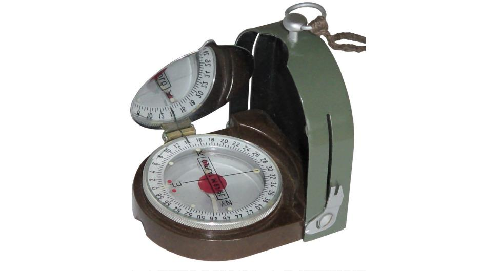
*33. A 39/49 M tájoló, amit Bézárd tájoló néven is ismerhetünk*

A 39/49 M tájoló skáláján nem a szokásos 360°-os körfelosztással találkozunk, hanem a katonai gyakorlatban elterjedt vonásbeosztással. A vonás mértékegység alkalmazásával a számítási műveleteket lehet leegyszerűsíteni. Jó példa erre a vonásképlet, amellyel egyebek mellett a távoli tereptárgyak távolsága határozható meg egyszerűen.

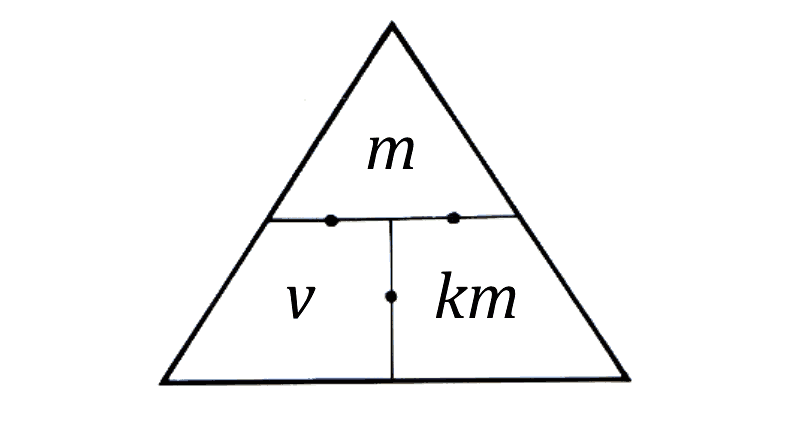
*34. A vonásképlet segédábrája*

A vonásképlet ábrájában különböző mértékegységeket láthatunk. Ha ezek közül kettő helyébe ismert értéket írunk, könnyedén meghatározható a harmadik (ismeretlen) érték. A képletábrán **m** a tereptárgy megfigyelhető kiterjedését (pl. magasságát vagy szélességét) méterben, a **v** ugyanezen tereptárgy figyelőpontról látható, vonásban kifejezett szögértékét, a **km** pedig a tereptárgy és figyelőpont közötti távolságot jelenti kilométer mértékegységben.

Ha a vonásképlet ábráján az ismeretlen értéket letakarjuk ujjunkkal, a másik két érték helyzete alapján kell elvégezni a számtani műveletet: az egymás melletti jelölések értékeit szorozzuk, az egymás alattiakat pedig törtként kezeljük.

Az egyszerűsített vonásképlet arra épül, hogy egy adott körív hossza egyenesen arányos a hozzátartozó középponti szöggel. Ívmértékben kifejezve így az ívhossz a hozzátartozó középponti szög és a kör sugarának szorzata. A teljes kör 2π radián alakban is felírható, amelynek egész értékű ezerszeres értéke 6283. Ezt az értéket a könnyebb számítások végzéséhez általában 6000-re, vagy 6400-ra kerekítve megkapjuk a kör felosztását vonásban. Ha a középponti szögeket eleve vonásban olvassuk le, a szöghöz tartozó ívhossz, vagy a kör sugarának hossza a másik ismeretében már könnyen számítható. Kis szögeknél az ív és a hozzá tartozó húr hosszúsága közel azonos, ezért vehetjük a tereptárgyak egyenes vonalú méreteit ilyenkor figyelembe. Gyakorlatilag ez azt jelenti, hogy a megfigyelő a tőle 1000 méterre lévő 1 méter magas tárgyat 1 vonás szög alatt látja.

A tájolóról leolvasott vonásértékeket leírhatjuk mértékegység jelölés nélkül, kötőjellel elválasztva. Például az 1242 vonást így írjuk le: 12-42, jelentésénél pedig „tizenkettő negyvenkettő"-t mondunk. Néhány térképen a vonásértékek megkülönböztetésére a 6400-as beosztás esetén mils, a 6000-es beosztásnál pars mértékegység jelölést alkalmaznak.

6000 vonás beosztású tájolóval ma már ritkábban találkozhatunk, helyette a NATO tagországok fegyveres erőinél elterjedtebb 6400 vonás beosztásos Cammenga 3H típusú lencsés tájolót használjuk. A vonásbeosztás mellett e tájolón a 360 fokos körfelosztás is megtalálható.

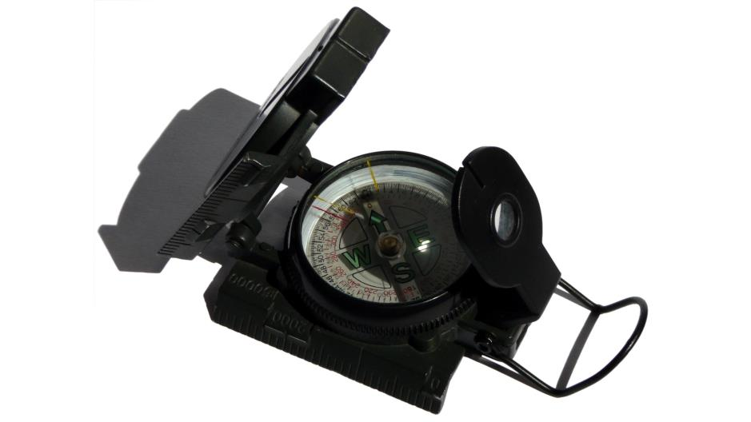
*35. Cammenga 3H típusú lencsés tájoló*

A lencsés tájoló a Bézárd-féle tájolóktól eltérő körbeosztás-leolvasójáról kapta a nevét, ami tulajdonképpen egy nagyítólencse. A lencsét tartó elforgatható lemezt irányréssel is ellátták a tereptárgyak pontos megirányzásához. A lencsés tájolóban az iránytű együtt mozog a skálával, így az irányok meghatározása némileg eltér a Bézárd-féle tájolóknál alkalmazott módszertől.

**Távcsövek**

A távcső a tájoló mellett az egyéni tájékozódás fontos eszköze. Távoli tereptárgyak azonosítására, távolságuk meghatározására, célok felkutatására és tanulmányozására, vízszintes és magassági szögek mérésére alkalmazhatjuk.

A Magyar Honvédségnél leggyakrabban az EDF 7×40 típusú távcsővel találkozhatunk. Megnevezésében a 7× jelölés a távcső látszólagos nagyítását jelenti, a 40-es érték pedig a tárgylencse milliméterben kifejezett átmérőjére utal. Minél nagyobb ez utóbbi érték, annál több fényt képes a távcső begyűjteni, vagyis annál élesebb, tisztább lesz a képe. A terepi tájékozódásra nem célszerű túl nagy képnagyítású távcsövet alkalmazni, mert egyrészt az egyszerre megfigyelhető terepszakasz mérete jelentősen csökken, másrészt a távcsövet a felnagyított kép erős mozgása miatt ekkor már fix állványra kell szerelni.

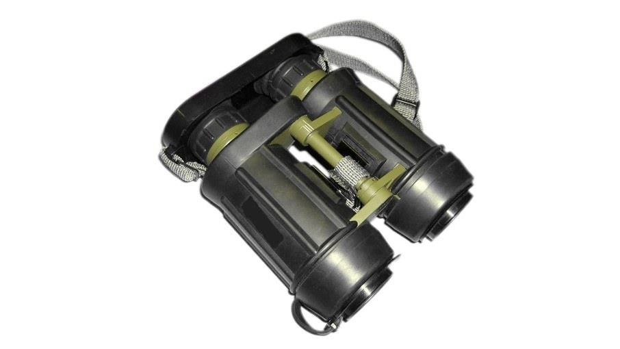
*36. A 7×40-es EDF távcső hordkész állapotban*

A katonai feladatok végrehajtására alkalmas távcsöveket speciális szálkereszttel látják el, amely alkalmassá teszi kisebb szögek, irányeltérések meghatározására, a vonásképlet révén pedig távolságok, tereptárgyak méretének meghatározására. Az EDF 7×40-es távcső látómezejében függőleges és vízszintes vonalbeosztás látható. Minden egyes beosztás 5 vonásnak, a hosszabb vonalkák közötti irányeltérés 10 vonásnak felel meg.

**Térképek, légifényképek**

A térképek és a légi-, vagy műholdfelvételek alapvető, de nem kizárólagos eszközei a terepi tájékozódásnak. Fontos tudni, hogy a tájékozódási feladatok végrehajtásához nem minden méretarányú térképi ábrázolás felel meg.

Ahogy azt a korábbiakban már megismerhettük, a térképi ábrázolás részletessége a térkép méretarányától függ, vagyis minél nagyobb a térkép méretaránya, annál részletesebb tereptanulmányozást tesz lehetővé. Mindemellett az 1:10 000, vagy nagyobb méretarányok alkalmazása csak speciális feladatoknál javasolt, lévén e térképek jóval kisebb terület áttekintését teszik lehetővé.

A térképi méretarányokon túl foglalkoznunk kell még a térképek típusaival is. Tájékozódásra és a terep általános tanulmányozására a topográfiai térképek a legmegfelelőbbek. A topográfiai és a földrajzi térképeken kívül számos speciális feladat, vagy elemzés végrehajtását segítő szabványos (ún. tematikus) térképtípus létezik még:

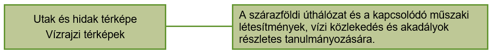

A légi és műhold felvételek egy adott földfelület pillanatnyi állapotát jelenítik meg képszerűen. Ezek a felvételek különböző geometriai átalakításokon esnek át annak érdekében, hogy a térképekhez hasonló felhasználásra alkalmas ún. ortofotóvá váljanak. A felvételek tartalmát a feldolgozás során koordinátahálóval, kerettartalommal, illetve a könnyebb olvashatóság érdekében magyarázó jelölésekkel is ellátják, a nehezen felismerhető tereptárgyakat egyezményes térképi jelükkel emelik ki.

A légi- és műhold felvételek, avagy más néven távérzékelési anyagok, alkalmasak a terep tanulmányozására, értékelésére, adatszerzésre. Bizonyos tekintetben jóval többet nyújtanak a hagyományos térképeknél, megfelelő alkalmazásukhoz azonban kellő tapasztalatra, a tereptárgyak fényképi leképződései felismerésének elsajátítására van szükség.

A távérzékelési anyagok előnyös tulajdonságai közé sorolhatjuk:
- a jóval nagyobb részletességű terepmegjelenítést (ez helyenként zavaró is lehet);
- az adatok közvetlen meghatározásának lehetőségét;
- a térképnél jóval frissebb terepi állapotok megjelenítésének lehetőségét;
- fénykép párok használatával a terep térbeli képének előállíthatóságát.

#### 6.3.1.2 A világtájak meghatározása

A világtájak természetes irányokból (a Nap kelésének, nyugvásának iránya, a Sarkcsillagra mutató irány stb.) alakultak ki. A legfőbb világtájnak az északi irányt tekintjük, amelyből egyszerűen levezethető a másik három fő világtáj, illetve a mellék- és részvilágtájak. A világtájak kijelölésénél segítségként hívhatjuk a régről ismert mondókát: „előttem van észak, hátam mögött dél, balra a Nap nyugszik, jobbra pedig kél".

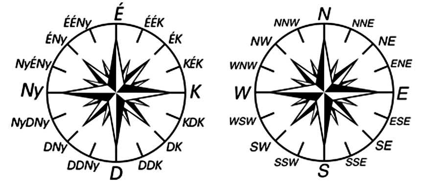
*37. A fő-, mellék- és részvilágtájak magyar és angol nyelvű rövidített jelölései*

A terepi tájékozódás során három északi irányt különböztetünk meg:

A **földrajzi észak** az adott állásponton áthaladó helyi meridiánnak a Föld északi pólusára mutató ága. Irányát a topográfiai térképeken a keretvonal függőleges része, illetve a hosszúsági körök fokhálózati vonalai adják meg. Csillagászati északnak is nevezzük, mert iránya gyakorlatilag egybeesik a sarkcsillag horizontra vetített irányával. Ez az eltérés a tájékozódás szempontjából nem jelentős. Mivel a nemzetközi gyakorlatban a földrajzi észak angol nyelvű megnevezése (True North) és annak rövidítése (TN) a legelterjedtebb, jelen tananyagban is így hivatkozunk rá.

A **mágneses észak** az adott állásponton a mágneses iránytű északi vége által mutatott irány, amely a helyi mágneses erőtér irányvonalaival esik egybe. A mágneses észak iránya a földrajzi helytől és az időtől függően változhat. A térképeken külön ábrán tüntetik fel irányát, és éves változásának mértékét. Mivel a nemzetközi gyakorlatban a mágneses észak angol nyelvű megnevezése (Magnetic North) és annak rövidítése (MN) a legelterjedtebb, jelen tananyagban is így hivatkozunk rá.

A **hálózati észak** a terepen csak közvetett módon határozható meg. Iránya a térkép kilométer hálózatának függőleges vonalaival egyezik meg. A hálózati észak az egyenlítőn és az UTM zóna középmeridiánjának vonalában esik egybe a földrajzi északkal. A középmeridiántól és az egyenlítőtől távolodva a két északi irány egyre jobban tér el egymástól. Mivel a nemzetközi gyakorlatban a hálózati észak angol nyelvű megnevezése (Grid North) és annak rövidítése (GN) a legelterjedtebb, jelen tananyagban is így hivatkozunk rá.

A topográfiai térképeken mindhárom északi irány adott szelvényre vonatkozó összefüggését megadják. Ezen összefüggések alapján a térképről levett irányszögek könnyen átszámíthatók a terepen használható mágneses vagy földrajzi azimutokká.

**Azimut** alatt az északi irány és egy adott pontra mutató irány közötti szöget értjük, amit az északi iránytól mérünk az óramutató járásával megegyező irányban.

A három északi iránynak megfelelően egy adott pontra (LM) az álláspontból (SP) mért irányt megadhatjuk földrajzi azimuttal (TA, vagy csak A), mágneses azimuttal (MA) és hálózati azimuttal (GA), mely utóbbira az irányszögnek megnevezés is használatos. Az azimutok jelölésére, továbbá a különböző azimutok szögeltéréseire jelen tananyagban a nemzetközi gyakorlatban elterjedt (angol nyelvű) megnevezéseket, illetve ezek rövidítéseit alkalmazzuk.

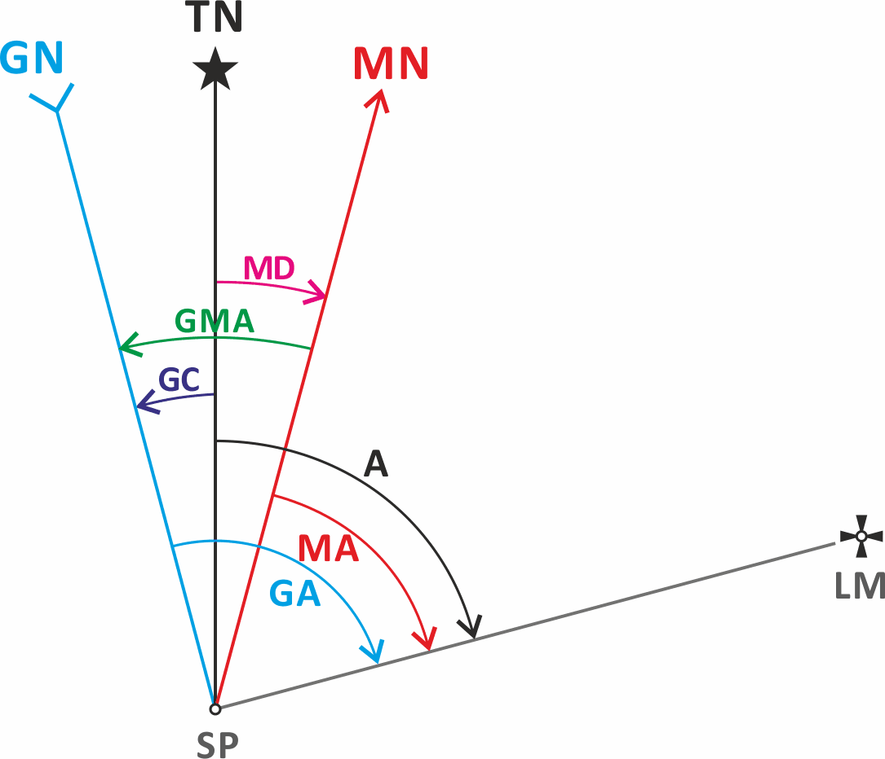
*38. A földrajzi (TN), mágneses (MN) és hálózati (GN) északi irányok összefüggései az álláspont (SP) és a megfigyelt tereptárgy (LM) viszonylatában*

A **vetületi meridián konvergencia** alatt a földrajzi észak (TN) és a hálózati észak (GN) között kialakuló szöget értjük. Jelölésére a továbbiakban a GC (Grid Convergence) betűket használjuk, de a görög ABC 12. betűjével (μ) is jelölhető. A meridián konvergencia irányát mindig a földrajzi északhoz képest adjuk meg:

**GC = GN – TN**

A meridián konvergencia értéke megadható előjel helyesen (+/–), vagy az égtájra vonatkozó kifejezéssel. Ha a hálózati észak (GN) iránya a földrajzi északétól (TN) keletre tér el, úgy értéke pozitív, azaz Keleti (E). Fordított helyzetben értelemszerűen negatív előjelet, vagy Nyugati (W) kiegészítést kap.

A vetületi meridián konvergencia értékét alapvetően az befolyásolja, hogy az adott hengervetület (ez esetben az UTM) egy konkrét zónájában milyen távolságra található álláspontunk (SP) a középmeridiánhoz és az Egyenlítőhöz képest, vagyis az adott zóna vetületi koordinátarendszerének valós X és Y tengelyéhez viszonyítva. A vetületi meridián konvergencia értéke a zónát határoló szélső meridiánokon a legnagyobb, míg az Egyenlítő vonalának megfelelő Y tengelyen és az adott zóna középmeridiánján, vagyis a valós X tengely mentén a legkisebb (0°).

A NATO szabványos topográfiai térképeken a vetületi meridián konvergencia szelvény középpontjára vonatkoztatott értéket mindig feltüntetik. Ennek esetleges hiányában az alábbi egyszerűsített képlettel is kiszámítható a GC értéke egy adott (ismert összrendezőjű) pontra vonatkozóan:

**GC = (LON – LON₀) · sin(LAT)**

ahol LON és a LAT az álláspontunk (vagy a térképszelvény középpontjának) földrajzi hosszúsági és szélességi koordinátái, míg a LON₀ az álláspontot/térképszelvényt magába foglaló UTM zóna középmeridiánjának földrajzi hosszúság értéke.

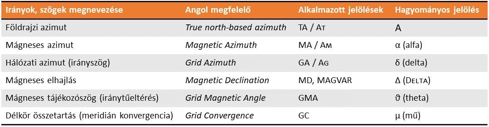

A **mágneses elhajlás**, avagy **mágneses deklináció** (jelölése a továbbiakban MD, máshol Δ, de MAGVAR rövidítéssel is előfordulhat a Magnetic Variation kifejezésből képezve) a helyi meridián északi iránya és a mágneses északi irány között kialakuló szög:

**MD = MN – TN**

Értéke akkor pozitív, ha a mágneses észak (MN) iránya keletre tér el a földrajzi észak irányától (TN). Előjeles értéke megadható a vonatkozó égtáj jelölésével is, így pozitív érték esetén "Keleti" (E), negatív értékeknél "Nyugati" (W) deklinációról beszélünk.

A mágneses deklináció értékének nagyságát a Föld mágneses pólusai között a földi mágneses mező földfelszínre vetített irányvonalainak a földrajzi északi irányhoz mért eltérése adja. Ez az érték időben és térben változó, ezért a topográfiai térképeken a szelvény középpontjára és egy meghatározott évre vonatkozóan adják meg. Ha ismerjük az éves változás mértékét, akkor kiszámítható az aktuális évre vonatkozó mágneses elhajlás értéke a térképszelvényen ábrázolt területre.

A **mágneses tájékozószög**, amit helyenként iránytűeltérésnek is neveznek (jelölése a továbbiakban GMA, máshol ϑ vagy κ) a mágneses északi és a hálózati északi irányok között kialakuló szög:

**GMA = GN – MN**

Értéke akkor pozitív, ha a hálózati észak iránya (GN) a mágneses észak irányához viszonyítva kelet felé tér el. Ez esetben "Keleti" (E) iránytű eltérésről beszélünk, míg negatív értékeknél "Nyugati" (W) iránytűeltérésről.

A térképpel végrehajtott terepi tájékozódás során ez az egyik legfontosabb szögérték, mely egyesíti magában a vetületi meridián konvergencia és mágneses deklináció helyi megnyilvánulásait. A terepen mért azimutértékek ezzel a szöggel javítva szerkeszthetők fel a térképre, és fordítva: a térképről levett hálózati azimutok, vagy a pontok koordinátaértékei között számolt irányszögek a mágneses tájékozószöggel alakíthatók át tájolóval kitűzhető irányokká a terepen.

A három északi irány összesen hat változatban helyezkedhet el egymáshoz képest. A közöttük kialakuló irányeltérések számításánál alkalmazható gyakorlati szabály, hogy mindig az „erősebb" északi irányhoz képest határozzuk meg a többi északi irány helyzetét. A rangsorban első a földrajzi észak, amit a mágneses észak és végül a hálózati észak követ. Ha a szögek számításakor összezavarodnánk, érdemes a már megismert jelölésekkel vázlatos ábrán feltüntetni az irányok elhelyezkedését és úgy levezetni a javítószög számítását, vagy az alábbi képleteket alkalmazni:

**MD = GC – GMA = TA – MA**

**GC = MD + GMA = TA – GA**

**GMA = GC – MD = MA – GA**

**MA = GA + GMA = TA – MD**

**GA = TA – GC = MA – GMA**

**TA = GA + GC = MA + MD**

Bár az iránytűeltérés (GMA) értéke a szabványos topográfiai térképeken megtalálható, ennek egyik lényeges összetevője, a mágneses deklináció (MD) folyamatos változása miatt az 5 évnél régebbi kiadású térképek esetén pontosítást igényel. A mágneses deklináció adott földrajzi helyre és időpontra vonatkozó hiteles adatait egyebek mellett az Amerikai Egyesült Államok Nemzeti Óceán- és Légkörkutató Intézete (NOAA) honlapján lehet megszerezni.

A NOAA oldal elérésének akadályoztatása esetén lehetőségünk van megfelelő vonalas tereptárgyak felhasználásával a terepen is meghatározni a deklináció értékét. Ehhez előbb tájolóval meg kell mérni a terepen egy vonalas jellegű tereptárgy (műút, csatorna, felszíni vezeték stb.) hosszabb egyenes szakaszának iránylatát (MA), valamint térképi megfelelőjének irányszögét (GA). A két irányérték különbsége adja meg az adott területre érvényes iránytűeltérés értékét (GMA = MA – GA).

A terepi tájékozódás során alapvető feladat a világtájak kitűzése. E feladatra a tájoló a legalkalmasabb eszköz, de kijelölhetjük ezen irányokat égitestek és természeti jelenségek alapján is.

#### 6.3.1.3 Világtájak kitűzése tájolóval

A tájolóval mágneses világtájak tűzhetők ki. A kitűzést megelőzi a világtájak (mellékvilágtájak) azimutjainak megállapítása, ami a 39/49 M és a Cammenga 3H típusú lencsés tájolón eltérő vonásértékeket eredményez:

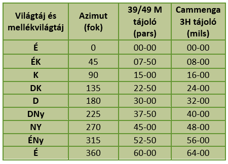

Egy adott azimutérték tájolóval történő terepi kitűzéséhez a következőképpen kell eljárni:

**Bézard típusú tükrös-szelencés (39/49 M) tájoló esetén:**

1. Beállítjuk a tájoló forgatható szelencéjén a kitűzni szánt azimut értékét.
2. Szemmagasságban és vízszintesen tartva a tájolót, addig fordulunk, amíg a mágnestű északi (piros) vége a szelence beosztásának 0 vonás értékéhez (piros pontjai közé) nem ér. Az iránytű mozgását a tájoló tükre segítségével követjük.
3. A tájolófedél irányzórései segítségével kiválasztunk egy meghatározó jellegű, távoli tereptárgyat. Ezzel tudjuk rögzíteni a meghatározott azimutot a terepen.

**Lencsés tájoló (Cammenga 3H) esetén:**

1. A tájoló nyitott állapotában, annak elforgatásával a leolvasójelet a lebegőtárcsa megfelelő értékére állítjuk.
2. Szemmagasságban tartva a tájolót, az irányzórés és az irányzószál segítségével kiválasztunk egy meghatározó jellegű, távoli tereptárgyat.
3. Kitűzés közben a lencsés leolvasón ellenőrizzük az azimutérték pontos beállítását.

#### 6.3.1.4 Világtájak meghatározása égitestek alapján

A világtájakat közelítő pontossággal égitestek állásából is meghatározhatjuk. Derűs égbolt mellett a látható égitestek (Nap, Sarkcsillag, vagy a Hold) helyzetéből indulunk ki. A Nap látszólagosan közel 15°-ot tesz meg az égbolton óránként, következésképpen a tereptárgyak árnyékának iránya is ezzel a szöggel változik egy óra leforgása alatt. Ha ismerjük a pontos időt, akkor egy függőlegesen leszúrt bottal a következőképen határozhatjuk meg a földrajzi északi irányt:

1. Számítsuk ki a jelenlegi időpont és a déli 12 óra közötti időkülönbséget, majd ezt az értéket szorozzuk meg 15 fokkal.
2. A kapott szögértéket szerkesszük fel a bot által vetett árnyékvonaltól mérve. A felszerkesztést délelőtt az óramutató járásával megegyező irányban, délután ellentétes irányban végezzük.
3. A kapott irányvonal közelítőleg a földrajzi észak irányát mutatja.

A felszerkesztéshez nem kell szögmérőt használnunk, mivel a derékszög hat egyenlő részre osztásával 15 fokos szögeket kapunk.

A földrajzi északi irányt meghatározhatjuk egy analóg számlapos óra segítségével is. Ehhez a következőket kell tenni:

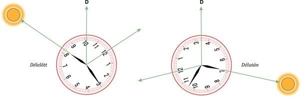
*39. Fő égtáj meghatározása analóg számlapos órával (forrás: Ált/204)*

1. Vízszintesen tartott számlappal forgassuk az órát addig, amíg annak kismutatója a Nap függőleges iránysíkjába nem esik. (A Nap megirányzását óvatosan végezzük, az égitest ne kerüljön a látómezőnkbe!)
2. Felezzük meg a kismutató és az óra délidőnek megfelelő számjegye közötti szöget. Téli időszámítás esetén ez a 12 órás beosztásnak, míg nyári időszámítás alatt az 1 órás beosztásnak felel meg.
3. A szögfelezőt a Nap irányába meghosszabbítva a déli irányt kapjuk, míg vele átellenesen találjuk az északi irányt.

Az előzőek szerint tartott karórán reggel 6 órakor az északot a 3-as számjegynél találjuk, délután 6-kor pedig a 9-esnél. Érdemes figyelembe kell venni azt is, hogy a nyáron hozzávetőlegesen 13:00 órakor delel a Nap Magyarország felett, de ez függ az adott álláspont hosszúsági értékétől is, lévén a delelőpont hazánk felett mintegy fél órán át "utazik". Tudnunk kell azt is, hogy a napidő (szoláris idő) és középszoláris idő (ami az óráink által mutatott idő alapja) között is hasonló nagyságú eltérés mutatkozik éves szinten.

Éjszaka a Sarkcsillag alapján határozhatjuk meg a földrajzi északi irányt az északi féltekén. A Sarkcsillag megközelítőleg a Föld forgástengelyének meghosszabbításában, az északi pólus fölött található. Helyzete látszólag állandó, a többi csillag látszólag körülötte forog.

A Sarkcsillag alapján történő északi irány meghatározásának lépései a következők:

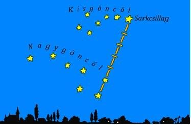
*40. A Sarkcsillag azonosítása az éjszakai égbolton (forrás: Ált/204)*

1. Sarkcsillag azonosítása az égbolton. Ehhez a Nagymedve csillagképben található Göncölszekér (avagy Nagygöncöl) jellegzetes hét fényes csillagból álló képét kell megkeresnünk.
2. A Göncölszekér két utolsó csillagát képzeletben kössük össze egy egyenessel, amit fölfelé meghosszabbítva, és nagyjából a két utolsó csillag távolságának ötszörösét felmérve egy fényesebb csillagot pillanthatunk meg. Ez a Sarkcsillag, más néven a Poláris.
3. A Sarkcsillag függőleges síkja tűzi ki a földrajzi északi irányt. Ezt kell a horizontra levetíteni.

A világtájak közelítő pontossággal meghatározhatók a Hold alakjából és állásából is. A meghatározáshoz tudni kell, hogy:

1. a telihold este keleten, éjfélkor délen és reggel nyugaton látszik;
2. első negyedében délben (12 órakor) keleten, este délben, éjfélkor nyugaton látszik;
3. utolsó negyedében éjfélkor keleten, reggel délen, délben nyugaton van.

A Hold első és utolsó negyedének felismerését elősegíti látható alakja. A Hold az első negyedben D alakú, és növekszik (könnyen megjegyezhető szóval: Dagad), utolsó negyedben C alakú, vagyis fogy (Csökken).

#### 6.3.1.5 Világtájak meghatározása természeti jelenségek alapján

Természeti jelenségek alapján is meghatározhatjuk a világtájakat, ha az eddig ismertetett módszerek nem alkalmazhatóak. A természeti jelenségek azonban sokkal pontatlanabb meghatározásokat eredményeznek, ezért amint lehetséges vissza kell térnünk a pontosabb módszerekhez.

A világtájak meghatározásához és közvetve a tájékozódáshoz a következő természeti jelenségeket használhatjuk fel:
- egyedül álló fák lombja a déli oldalon dúsabb, az északi oldalon ritkább;
- erdőben a fák kérge az északi oldalon durvább, vastagabb, a déli oldalon finomabb, vékonyabb;
- a fák kérge és a sziklák oldala észak felé gyakran mohával borított;
- kivágott fák tönkjein az évgyűrűk északi irányban sűrűbbek;
- délre néző hegyoldalakon télen a hó előbb olvad el, tavasszal zöldebb és dúsabb a növényzete;
- hangyabolyok déli oldala enyhébb lejtésű, mint az északi;
- ismert uralgó szélirány esetén, homokos területen, a buckák elrendeződése segít az égtájak meghatározásában.

### 6.3.2 Tájékozódás a terepen térképpel

Terepi álláspontról a tájékozódó elé táruló terep képe távlatosan (perspektivikusan) jelenik meg. A szemlélő a közelebbi tereptárgyakat nagyobbaknak, a távolabbiakat kisebbnek látja, az előtérben lévő kiemelkedő domborzati idomok takarásában nem vehetők ki a mögöttes tereprészletek. A térképi ábrázolások ezzel szemben a terepet felülnézetben, arányosan kicsinyítve, egyezményes jelekkel jelenítik meg. E két kép egyeztetése a szemlélőben idővel és sok gyakorlással sajátítható el.

A térképpel történő terepi tájékozódás művelete négy lényeges lépésből áll:
1. a világtájak meghatározása;
2. a térkép tájolása;
3. az álláspont meghatározása;
4. a környező terep azonosítása.

A fenti sorrend a tereptől függően változhat, illetve egyes lépések összevonhatók. Előfordulhat, hogy egy könnyen és jól azonosítható tereptárgy segítségével elsőnek az álláspont helyét határozhatjuk meg. A világtájak meghatározásának eszközeivel és módszereivel az előző fejezetben foglalkoztunk. Az északi irány meghatározását követően megkezdhetjük a térkép tájolását.

#### 6.3.2.1 A térkép tájolása

A térkép tájolása az a művelet, amely során a térképen kiválasztott irányt fedésbe hozzuk a terep azonos irányával. A kiválasztott irány lehet valamely világtáj vagy egy a térképen és a terepen is jól azonosítható tereptárgy iránya.

**Térképtájolás keretvonalhoz illesztett tájolóval**

Ha a térkép tájolását gyorsan és pontosan kell végrehajtani, akár olyan esetekben is, amikor álláspontunkat még nem tudtuk meghatározni a térképen, akkor erre a feladatra mágneses tájolót célszerű használni. A térkép tájolását elvégezhetjük É-D irányú keretvonalai, vagy az ugyancsak É-D irányú koordinátahálózati vonalai segítségével.

Érdemes tudni, hogy ha a keretvonalhoz képest tájoljuk a térképet, akkor a meridiánok vetületi konvergenciája miatt kismértékű eltérést tapasztalunk a NATO szabványos 1:50 000 méretarányú topográfiai térképek keleti és a nyugati keretvonalai között. Ennek nagysága hazánk területén átlagosan kb. 3 vonás, ami egy olyan eszközön, amelyen a legkisebb beosztás értéke 20 vonás (lencsés tájoló) gyakorlatilag elhanyagolható.

Tudni kell azt is, hogy a tájoló mágnestűje a helyi mágneses észak (MN) irányához igazodik, míg a topográfiai térképek É-D irányú koordinátahálózati vonalai a hálózati északhoz (GN), az É-D irányú keretvonalai pedig a földrajzi északhoz (TN). A földrajzi észak (TN) és a mágneses észak (MN) közötti szögeltérés, azaz a mágneses deklináció (MD), valamint a hálózati észak (GN) és a mágneses észak (MN) közötti irányhelyesbítés (GMA) meghatározásának módjait az előző fejezetben tekintettük át.

A térkép tájolását az É-D irányú keretvonalak alapján a következő lépések szerint végezzük el:

1. Határozzuk meg (térképi adat, vagy megfelelő források alapján, illetve ezek hiányában egy azonosított vonalas tereptárgy alapján) a mágneses deklináció (MD, avagy MAGVAR) értékét! A vonásban meghatározott értéket előjelhelyesen vonjuk ki a lencsés tájoló vonásbeosztásának megfelelően a 6400 értékből.
2. Helyezzük a lencsés tájolót teljesen nyitott állapotában a térképre, vonalzóélét a térképkeret É-D irányú vonalához igazítva!
3. Forgassuk a vízszintesen tartott térképet, rajta a tájolóval mindaddig, amíg az 1. pontban meghatározott vonásérték a rögzített leolvasójelnél meg nem jelenik.

Ha például a meghatározott deklinációs érték (MAGVAR) keleti 96 vonás, úgy ezt a 6400-ból előjelhelyesen kivonva 6304 vonást kapunk. A térképet a rá helyezett tájolóval úgy forgatjuk, hogy ezt az értéket olvashassuk le az index-szálnál. Mivel a lencsés tájoló legkisebb beosztásértéke 20 vonás, így természetesen csak a legközelebbi kerek értéket tudjuk beállítani (6300 mils).

Nyugati helyzetű mágneses deklináció esetén a negatív előjeles MAGVAR értékek kivonása összeadást jelent, tehát magát a deklináció vonásértékét kell a tájolón a térkép forgatásával beállítani.

Menet közben, vagy idő hiányában a térképtájolásnál elhagyható a mágneses elhajlás figyelembevétele, de tisztában kell lennünk az ezzel járó esetleges tájékozódási pontatlanságokkal. Iránymetszéssel végrehajtott álláspont, illetve célpont meghatározás esetén a mágneses elhajlás értéke csak akkor hagyható figyelmen kívül, ha annak értéke kisebb, mint a rendelkezésünkre álló tájoló iránymeghatározási megbízhatósága. Ez a lencsés tájoló esetén +/- 20 vonás.

Amennyiben a térkép É-D irányú keretvonala nem érhető el (pl. több szelvényből álló, összeragasztott és hajtogatott térképet kell tájolnunk, vagy térképvázlatot használunk), akkor a földrajzi észak helyett a térképi kilométer-hálózat egyik É-D irányú vonalára kell illeszteni a tájoló irányélét. Ebben az esetben a térkép pontos tájolásához nem a mágneses deklinációt (MD), hanem az iránytűeltérés (GMA) értékét kell beállítanunk a tájolón úgy, hogy a lencsés tájoló vonásbeosztásának megfelelő 6400 értékhez előjelhelyesen hozzáadjuk.

**Példa:**

Legyen a vetületi meridián konvergencia (GC) értéke 22 vonás nyugatra (ezt a topográfiai térképről leolvashatjuk, vagy a térképszelvény középpontjának, illetve álláspontunknak földrajzi koordinátái alapján, számítással határozhatjuk meg), a mágneses deklináció (MD) értéke pedig 96 vonás keletre. Az iránytűeltérés képletét használva kiszámítjuk a mágneses és hálózati északi irányok közötti szögeltérést:

**GMA = GC – MD = –22 – 96 = –118**

A nyugati 118 vonást hozzáadva a lencsés tájoló körfelosztása szerinti 6400 vonáshoz 6282 vonást kapunk, amit 6280 vonásra kerekítünk. Ezt az értéket kell a lencsés tájolón a térkép elforgatásával beállítani úgy, hogy a tájoló vonalzója a térkép koordinátahálózatának É-D irányú vonalaival párhuzamos legyen.

**A térkép tájolása vonalas tereptárgyak alapján**

E módszer alkalmazásának az a feltétele, hogy álláspontunk egy egyenes terepvonalon feküdjön (út, csatorna partja, fasor, erdőszegély stb.). A terepvonal valamelyik oldalán egy azonosítható, ellenőrző tereptárgyra is szükségünk lesz.

A tájolás mozzanatai:
1. Keressük meg a térképen annak a terepvonalnak a jelét, amelyen az álláspontunk fekszik!
2. Illesszünk egy vonalzót a terepvonal térképi jelére, majd forgassuk a térképet mindaddig, amíg a vonalas tereptárgy iránya a térképi megfelelőjével azonos nem lesz!
3. Ellenőrzésként azonosítsunk egy ellenőrző tereptárgyat térképünkön, és hasonlítsuk össze terepi elhelyezkedésével. Ha a térképen és a terepen is ugyanazon oldalra esik a tereptárgy jele, akkor elkerültük a tájolás 180°-os hibáját.

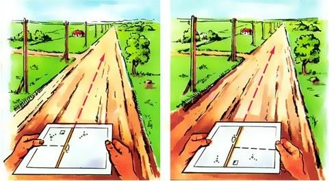
*41. A térkép helyes és a helytelen tájolása vonalas tereptárgy alapján (forrás: Ált/204)*

#### 6.3.2.2 Álláspont meghatározása

Az álláspont helyének meghatározása döntő fontosságú lépés a terepi tájékozódás során. Az álláspont ismerete ugyanis elengedhetetlen a további tájékozódási műveletekhez, a környező terep fontos részeinek azonosításához.

Az álláspont helye meghatározható:
- azonosítással
- méréssel és becsléssel
- oldalmetszéssel
- hátrametszéssel
- domborzat alapján

**Álláspont meghatározása azonosítással**

Álláspontunk terepi beazonosításához szükségünk lesz olyan térképészeti anyagokra (nagyméretarányú topográfiai térkép, légi felvétel), amelyen a terepelemek kellő részletességgel jelennek meg. Minden esetben tájoljuk a rendelkezésünkre álló térképészeti anyagot és a környezetünkben található jellemző tereptárgyakat azok leképződéseivel (légi fényképen), illetve ábrázolásaival (topográfiai térképen) vessük össze! Ha az álláspont olyan tereptárgyon, vagy annak közvetlen közelében fekszik, amelyet a térkép egyezményes jellel ábrázol, avagy a légi fényképen egyértelműen beazonosítható (pl. híd, útkereszteződés, vízfolyások elágazása stb.) akkor az álláspontunk helye meghatározható.

Az álláspont téves azonosításának elkerülésére a környező többi tereptárgyra folytassunk közelítő ellenőrző irányméréseket. Az álláspont ezen módszerrel történő meghatározása egyszerű és gyors, de csak abban az esetben ad kielégítő eredményt, ha elegendő számú beazonosítható tereptárgy áll rendelkezésre a környezetünkben és ezeket a rendelkezésre álló térképészeti anyag megfelelően jeleníti meg.

**Álláspont meghatározása méréssel és becsléssel**

Ha az álláspont az azonosított tereptárgytól viszonylag kis távolságra található, akkor méréssel vagy becsléssel is meghatározhatjuk annak helyzetét. Ez esetben két adatot mérünk a terepen:
1. az álláspont távolságát az azonosított tereptárgytól és
2. az álláspont irányát (azimutját) az azonosított tereptárgyhoz viszonyítva.

A mért adatokat a térképre (vagy a légi fényképre) felszerkesztve megkapjuk az álláspont helyét. A feladat pontos végrehajtásához tájolót és vonalzót használunk. Ha az álláspont terepvonalon fekszik, akkor az iránymérés elhagyható. Ez esetben maga a terepvonal adja az álláspont irányvonalát a beazonosított tereptárgyhoz képest.

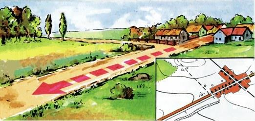
*42. Terepvonalon lévő álláspont meghatározása méréssel (forrás: Ált/204)*

**Álláspont meghatározása oldalmetszéssel**

E módszer akkor alkalmazható, ha az álláspont:
- jól azonosítható vonalas jellegű tereptárgyon (pl. út, fasor, erdőszegély, vasút, csatorna stb.), vagy annak meghosszabbításában;
- két pontszerű tereptárgyat (pl. egyedül álló fa, toronyszerű építmény stb.) összekötő vonalon, vagy annak meghosszabbításában;
- jól azonosítható domborzati idomvonalon (pl. egyenes irányú hátvonal, völgyvonal stb.) fekszik.

Az oldalmetszés végrehajtásához szükségünk van még a terepvonaltól oldalirányban, lehetőleg rá merőlegesen elhelyezkedő, jól azonosítható tereptárgyra. Az álláspont ebben az esetben az azonosítható terepvonalnak azon pontja lesz, ahol az oldalt levő tereptárgy irányvonala metszi azt. A feladat pontos végrehajtásához tájolót és vonalzót használunk.

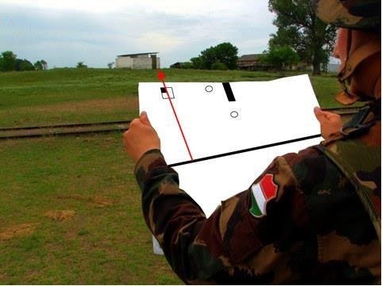
*43. Oldalmetszés vonalzóval (a szerző rajza)*

**Álláspont meghatározása hátrametszéssel**

Ha álláspontunk a térképen (légi felvételen) nem beazonosítható terepvonalon fekszik, illetve közvetlen közelében nincsenek jól azonosítható tereptárgyak, akkor távolabbi tereptárgyakat kell választanunk a meghatározásához. Lényeges szempont, hogy találjunk legalább három olyan távoli tereptárgyat, ami jól megfigyelhető és a térképészeti anyagon is azonosítható. Ezen feltétel teljesülése esetén álláspontunk hátrametszéssel meghatározható. Ez a helymeghatározási módszer az eddig megismertekhez képest időigényesebb, és több hibalehetőséget rejt magában.

A hátrametszés feladata végrehajtható tájolóval és vonalzóval egyaránt. Tájolós hátrametszés esetén a következő lépéseket kell végrehajtanunk:

1. Válasszunk ki három jól azonosítható és álláspontunkról megirányozható távoli tereptárgyat. A grafikus hátrametszési eljárás sajátosságaiból adódóan törekedjünk olyan tereptárgyakat kiválasztani, amelyekre mért irányok között 600 vonásnál kisebb, illetve 2600 vonásnál nagyobb belső szögek nem keletkeznek.
2. Határozzuk meg mindhárom tereptárgy mágneses azimutját tájoló segítségével és rögzítsük az adatokat! Az irányok térképi felszerkesztését innentől kétféleképpen végezhetjük el.
   a. Szögmérő (protractor) alkalmazásával:
      i. A mért mágneses azimutértékeket az irányhelyesbítés értékével számítsuk át hálózati azimutokká!
      ii. A 3200 vonásnál kisebb azimutokhoz pozitív, az annál nagyobbakhoz negatív előjellel adjunk hozzá 3200 vonást, más szóval minden azimutértékre rendeljünk el hátra arcot!
      iii. Szerkesszük fel a térképre mindhárom tereptárgy jelétől mérve a meghatározott azimutértékeket!
   b. Tájoló alkalmazásával
3. Ahol a három hátrametsző irány egyenese metszi egymást, ott lesz az álláspontunk térképi helye.

A megoldás helyességében akkor bízhatunk meg, ha a térképre felszerkesztett egyenesek egy pontban metszik egymást. Pontatlan meghatározásnál hibaháromszög keletkezik. Ha a hibaháromszög valamelyik oldalának nagysága nagyobb 2 mm-nél, akkor a hátrametszést meg kell ismételnünk. Kisebb hibaháromszögnél annak súlypontját elfogadhatjuk álláspontként. Kellő idő rendelkezésre állása esetén célszerű azonban a hátrametszést megismételni, lehetőség szerint más tereptárgyak felhasználásával.

A vonalzóval végrehajtott hátrametszés szerkesztési művelete gyorsabban elvégezhető, de csak ideális feltételek mellett érhető el vele a tájolós hátrametszéshez hasonló pontosság. Ennél a módszernél ugyanis a pontosan tájolt térképet a szerkesztési műveletek során végig mozdulatlanul kell tartani, ami a három hátrametsző irány felszerkesztésénél nem könnyű feladat. Célszerű ezért olyan vízszintes, sík felületet felhasználni, amely anyagában nem mágnesezhető és lehetőséget biztosít mind az irányzási mind a szerkesztési feladatok könnyű végrehajtásához. A módszer előnye ugyanakkor az, hogy az iránymérésben óhatatlanul előforduló tájoló leolvasási hibák itt nem jelenhetnek meg.

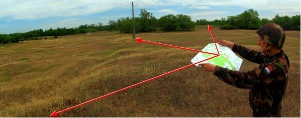
*44. Álláspont meghatározása oleátás hátrametszéssel (forrás: Ált/204)*

Az álláspont meghatározását végrehajthatjuk átlátszó papírral (oleátával) is. A módszer gyors és nem igényli a térkép előzetes tájolását. Az oleátás hátrametszést a következő lépésekkel végezzük el:

1. Egy rajztáblára átlátszó papírt (oleátát) kell rögzítenünk.
2. Nagyjából az oleáta közepén, körzőhegy leszúrásával megjelöljük az álláspont előzetes helyét.
3. Három jól látható és a térképen is azonosítható tereptárgyat választunk ki.
4. A leszúrt ponthoz illesztett vonalzóval megirányozzuk mindhárom tereptárgyat. A megirányzásoknál a vonalzó éle mellett egyenest húzunk a rögzített oleátára. A felszerkesztett egyeneseket a megirányzott pontra utaló jelöléssel, megírással egészítjük ki.
5. Ráhelyezzük az oleátát a térképre oly módon, hogy mindhárom irányvonal áthaladjon saját térképi jelén. Ez a helyzet csak úgy állítható elő, ha a három terepi pont és az álláspont egymáshoz viszonyított helyzete a valóságos helyzetnek felel meg.
6. Átszúrjuk az előzetes jelet az oleátáról a térképre. Az átszúrt pont lesz az álláspont térképi helye.

**Álláspont meghatározása a domborzat alapján**

A domborzat a terep legállandóbb eleme. A terepen való tájékozódás során a domborzat adhat támpontot minden olyan esetben, ahol nincsenek megfelelő tájékozódást nyújtó tereptárgyak, vagy egyéb tájékozódást nehezítő körülmények lépnek fel. A domborzat alapján történő tájékozódás során a terep jellegzetes idomait és idomvonalait vizsgáljuk.

Ha olyan domborzati idomon (pl. hegytető, lejtőkúp, nyeregpont, vízgyűjtővonal elágazása), vagy annak közvetlen közelében fekszik az álláspontunk, amely jellege folytán a térképen is egyértelműen azonosítható, akkor a térképi azonosítás módszerével határozzuk meg az álláspont helyét.

Ha valamely domborzati vonalon (hátvonal, vízgyűjtővonal, tereplépcső stb.) található álláspontunk, akkor a helymeghatározás becsléssel, méréssel és oldalmetszéssel végezhető el. Hátrametszés csak akkor alkalmazható, ha a környező terepen találunk 2–3 jól azonosítható domborzati idomot.

**A környező terep azonosítása**

A tájékozódás nem ér véget az álláspont helyének meghatározásával, annak a környező tereptárgyak térképi meghatározására is ki kell terjednie. A környező terep könnyebb azonosításához a fontosabb tereptárgyak alapján tájékozódási pontokat jelölünk ki, amelyeket arab számjeggyel, vagy könnyen megjegyezhető, rövid névvel látunk el.

Tájékozódási pontként azok a tereptárgyak és idomok jelölhetők ki, amelyek:
- környezetüktől jól elütnek (szembetűnőek) és könnyen azonosíthatóak;
- több irányból is jól láthatóak;
- állandó jellegűek (a terepen folyó műveletek időtartamára előreláthatólag megmaradnak).

**Tereptárgy azonosítása a térképen**

A tereptárgy helyének azonosítása elvégezhető tájolós méréssel, vagy vonalzós irányzással. Tájolós mérésnél a következő sorrendben hajtjuk végre a feladatot:

1. Mérjük meg álláspontunkból a tereptárgy mágneses azimutját!
2. Ha szükséges, alakítsuk át irányszöggé (hálózati azimuttá) a kapott értéket és szerkesszük fel a térképre ezt az irányvonalat!
3. Határozzuk meg (pl. távcsővel és a vonásképlet alapján) a tereptárgy távolságát az álláspontunktól!
4. A meghatározott távolságot méretarányosan szerkesszük fel a térképi irányvonalra!
5. A felszerkesztett távolság végpontja közelében azonosítsuk a tereptárgy térképjelét!

Ellenőrzésképpen a tereptárgy környezetében látható tereprészletek és domborzati idomok összehasonlításával győződünk meg a megoldás helyességéről!

*45. Tereptárgy azonosítása a térképen (forrás: Ált/204)*

Ha a tereptárgy helyét vonalzóval, vagy a tájoló irányzórészével azonosítjuk, a következő lépésekkel hajtjuk végre a feladatot:

1. A pontosan tájolt térképet rögzítjük.
2. A vonalzót az álláspont térképi helyéhez illesztjük.
3. A vonalzó irányélével megirányozzuk a tereptárgyat, miközben a vonalzót folyamatosan az állásponthoz illesztve tartjuk.
4. A vonalzó éle mellett az állásponton átmenő irányvonalat húzunk a térképre.
5. Meghatározzuk az álláspont és a tereptárgy közötti távolságot (pl. becsléssel).
6. A meghatározott távolságot méretarányosan felszerkesztjük a térképi irányvonalra.
7. A felszerkesztett távolság végpontja közelében azonosítjuk a tereptárgy térképjelét.

Ha olyan tereptárgy azonosítását kell elvégeznünk, amelynek térképi megfelelője nincs ábrázolva, a szerkesztés végén magunk rajzoljuk be a tereptárgyat a térképre. A megoldás helyességét a környező tereprészletekhez történő viszonyítással ellenőrizzük.

**Térképi pont azonosítása (megkeresése) a terepen**

A tereptárgyak helyének megkeresése a terepen gyakori tájékozódási feladat, amelyet vonalzóval a következőképpen kell végrehajtani:

1. A pontosan tájolt és rögzített térképen az állásponton és a keresett tereptárgy egyezményes jelén átmenő egyenest húzunk.
2. Az egyenesre illesztett vonalzó irányélével egy távoli, jól kivehető tereptárgyat, mint tájékozódási pontot irányzunk meg.
3. Az álláspont és a tereptárgy közötti távolságot meghatározzuk a térkép alapján.
4. A távolság terepi megfelelőjét a tájékozódási pont irányában megbecsüljük, majd a távolság végpontja közelében megkeressük.

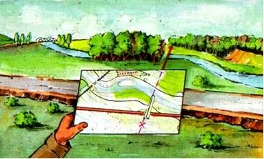
*46. Térképi pont helyének megkeresése a terepen (forrás: Ált/204)*

A tereptárgy megirányzásához használhatjuk a tájoló irányzórészét is. Ez esetben tájoló vonalzórészét kell a térképen meghúzott egyeneshez illeszteni.

**Tereppont helyének meghatározása előremetszéssel**

Előremetszés (vagy röviden: előmetszés) esetén a célpont helyének meghatározásához két ismert álláspontból kell irányvonalat mérnünk a terepen és azt felszerkesztenünk a térképre. (A célpont helye meghatározható számítással is a figyelőpontok koordinátái ismeretében.) Az előremetszés eredményének pontossága várhatóan akkor lehet kielégítő, ha a két álláspont egymáshoz képest a céltávolság felénél nincs közelebb. Az előremetszés feladatát a következő lépésekkel oldjuk meg tájolóval:

1. Az első álláspontból (ÁP1) mágneses azimutot mérünk a tereptárgyra.
2. A mágneses azimutot átalakítjuk irányszöggé.
3. A kapott irányszöget felszerkesztjük ÁP1 térképi megfelelőjéből.
4. Álláspontot váltunk.
5. A másik álláspontból (ÁP2) mágneses azimutot mérünk a tereptárgyra.
6. Átalakítjuk a mágneses azimutot irányszöggé.
7. A kapott irányszöget felszerkesztjük ÁP2 térképi megfelelőjéből.
8. A két irányvonal metszésében található a tereptárgy keresett térképi helye.

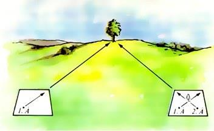
*47. Tereppont helyének meghatározása előremetszéssel (forrás: Ált/204)*

A feladat vonalzóval is végrehajtható. Ez esetben a térképet pontosan tájolt állapotban kell tartani és az előremetsző irányokat a vonalzóval meghúzni. A tereptárgy térképi beazonosítását követően annak koordinátái, illetve keresőhálózati azonosítói is meghatározhatóak.

### 6.3.3 A globális helymeghatározás alapjai

A koordinátarendszerekkel foglalkozó fejezetekben már megismerhettük, hogy alapvetően kétféleképpen adhatjuk meg pozíciónkat a Föld felszínén. Az egyik esetben a Földet lefedő fokhálózati vonalak segítségével álláspontunk földrajzi szélessége és hosszúsága határozható meg. A másik módszernél a Földet helyettesítő alak vetületi képét egészítjük ki derékszögű sík koordinátarendszerrel. Mindkét megoldás széleskörű alkalmazást nyert a térképészetben és a napi gyakorlatban, és ma már nem okoz különösebb nehézséget alkalmazásuk. A földrajzi pozíciók meghatározása azonban nem volt mindig ilyen egyszerű.

#### 6.3.3.1 A globális helymeghatározások kialakulása

Az európai tengerészek még a XI. században is legfeljebb látótávolságra merészkedtek a partvonalaktól, s csak a kínaiak találmánya, a mágneses iránytű változtatta meg ezt a helyzetet a XII. század végén. A hajózás tudománya, a navigáció — amely kifejezést később átvesz a légi, majd a szárazföldi közlekedés is — a XIII. századtól vált egyre megalapozottabbá, pontosabbá. A nyílt vízi, mágneses iránytűre alapozott navigációs felszerelés ezekben az időben a következő eszközökből állt:

- iránytű (más néven kompasz, a mágneses északi irány meghatározására);
- mérőorsó, avagy log (a sebesség, közvetve pedig a megtett út mérésére);
- homokóra (a sebesség meghatározásához szükséges idő mérésére);
- mélységmérő (elsősorban a kikötők, szorosok környékén a biztonságos navigáláshoz);
- portolánok (a partvonalakat részletesen feltüntető térképek) kiegészítve a szükséges rajz- és mérőeszközökkel (mérőkörzők, vonalzók);
- kvadráns, később szextáns a földrajzi szélesség meghatározásához.

A navigációs felszerelést a XVII. században egészíti ki a távcső, mely egyebek mellett a partközeli hajózáskor a kikötők azonosításánál nyújtott segítséget. A felsorolásból kitűnik, hogy a korabeli tengerészek a pillanatnyi helyzetre csak közvetett módon, azaz a mért földrajzi szélességből, a megtett út hosszából (amelyet a sebességmérésekből számítottak) és a hajó haladási irányából tudtak következtetni. A folyamatos navigációhoz továbbá felhasználták mindazokat a természeti jeleket, amelyek a célállomás elérését megbízhatóbbá tették.

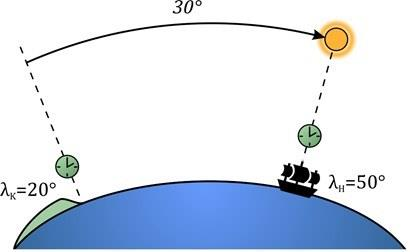

A hajózás még a tapasztalt navigátorok számára sem volt veszélytelen vállalkozás ezekben az időkben. A sebességmérésből következtetett útvonalhossz valódiságát számtalan egyéb tényező befolyásolhatta. Elegendő volt viharba kerülni a nyílt vizeken, s a helymeghatározás máris megbízhatatlanná vált. Az angolok idejekorán felismerték, hogy a tengeri közlekedésben betöltött vezető szerepük csak pontos navigációs képesség birtokában őrizhető meg.

Helyzetelőnyük megőrzése érdekében pályázatot írtak ki, s az elnyerhető komoly díj számos korabeli feltaláló fantáziáját mozgatta meg. A cél egy olyan eszköz, vagy módszer kidolgozása volt, amely által a tengerjáró hajók helyzete bárhol, bármilyen körülmények között, gyorsan és biztosan megállapítható. Mivel a földrajzi hosszúság pontos meghatározása jelentette ekkor a legnagyobb kihívást, a pályázók ebben az irányban kezdtek el kutatni. A számtalan beérkező találmány közül egyedül John Harrison 1759-ben megalkotott kronométere állta ki a próbát.

Az idő pontos mérésére alkalmas eszközt már addig is készítettek, elsősorban előkelő személyek és intézmények számára, de olyat, amely a hullámzó tengeren, gyorsan változó időjárási viszonyok között is megőrizte pontosságát, a kor színvonalán működő óramesterek sem tudtak. Harrison pontos órája havonta csupán néhány másodpercet hibázott, így egy hosszabb hajóút során is alkalmas volt a kikötő helyi idejét mutatni. (Csak összehasonlításként: a ma kapható legelterjedtebb kvarcórák pontatlansága normál hőmérsékleten is elérheti a ±20 másodperc/hó értéket.) A hajó helyzetének földrajzi hosszúságát innen már könnyű volt meghatározni. Mindössze le kellett olvasni az időt a Nap helyi delelésekor a kronométerről, amely alapján a kikötő és a hajó helyzete közötti hosszúságkülönbség gyorsan kiszámíthatóvá vált. A földrajzi szélességet továbbra is szextáns segítségével határozták meg.

Tegyük fel például, hogy a tengerjáró hajó kronométere délben 14:00 órát mutat, ami délhez képest +2 óra különbséget jelent, vagyis a kikötőben már délután kettő óra az idő. Tudva azt, hogy a Nap egy óra alatt látszólag 15°-ot tesz meg az égbolton, a hosszúságkülönbség a kikötő és hajó között 30° a nyugati irányban. (Azonos időkülönbséggel délelőtt a kikötőtől keletre lennénk.) Ha ismerjük a kikötő pontos földrajzi koordinátáit, annak hosszúsági értékéhez 30 fokot adva megkapjuk jelenlegi helyzetünk valódi földrajzi hosszúságát.

Az időméréses hosszúság-meghatározás hátulütője, hogy borult égbolt esetén nem alkalmazható, és pontossága sem felel meg a mai elvárásoknak. Napjaink navigációs rendszereire az azonnaliság, a megbízhatóság, a pontosság és a könnyű alkalmazhatóság a jellemző. Közülük is leggyakrabban az amerikai NAVSTAR GPS rendszerrel, illetve annak felhasználói szegmensével találkozunk.

#### 6.3.3.2 Műholdas helymeghatározó rendszerek

A hidegháború évtizedeiben a két szembenálló szuperhatalom hadászati képességei megközelítőleg egyensúlyban álltak. Ha az egyik oldalon megjelent egy új hadászati képesség, rövidesen a szembenálló hatalom is kifejlesztett egy hasonlót. Az Amerikai Egyesült Államok fegyveres erőinek az ország határain kívüli gyors bevethetőségéhez már az 1970-es évek óta fejleszt műhold alapú helymeghatározó rendszereket. Ezek eredményeként az 1990-es évek elejére kiépítette az első 24 órán át a Föld teljes felszínéről elérhető navigációt támogató rendszerét a NAVSTAR-t. (A rendszert az 1991-es Öböl-háborúban tesztelte.) Nem véletlen, hogy a hadászati jelentőségű NAVSTAR fejlesztésével párhuzamosan a Szovjetunióban is létrehoztak egy hasonló műholdas rendszert GLONASS (Global Navigation Satellite System, azaz Globális Navigációs Műhold Rendszer) néven.

A NAVSTAR eredendően nem szóösszetétel, bár felfogható annak is, amely jól kifejezi a rendszer működési elvét: Navigation Satellite Timing And Ranging System (magyarul: idő és távmérésen alapuló műhold-navigációs rendszer). Az eredeti név helyett többnyire egyszerűen a GPS (Global Positioning System) mozaikszót alkalmazzuk, amely lefordítva globális helymeghatározó rendszert jelent.

Az Európai Unió hasonló műholdas rendszer fejlesztésén dolgozik, amely az olasz természettudós emlékére a Galileo nevet kapta. A Galileo rendszer polgári célú kezdeményezésként indult, jóllehet teljes kiépülése esetén katonai felhasználásra is alkalmassá válik.

Az egykor katonai célokra kifejlesztett műhold-navigációs rendszerek ma már főleg polgári felhasználásúak, jóllehet az amerikai haderőben és más szövetséges országokban továbbra is jelentős szerepe van a műhold alapú helymeghatározásoknak és az erre épülő navigációs és irányítási rendszereknek.

A műhold-navigációs rendszerek alapvetően három szegmensre oszthatók:
1. Föld körüli pályán keringő rendszerelemek (navigációs és korrekciós jeleket sugárzó műholdak)
2. földi követő állomások (a Föld körüli szegmens működését felügyelő, a műholdakkal kommunikáló rádióállomások)
3. felhasználók és felhasználói alkalmazások (a műholdak jeleit vevő és különféle feladatokra felhasználó eszközök)

A továbbiakban az amerikai műhold-navigációs rendszer (NAVSTAR GPS) felépítésén, működési sajátosságain és felhasználási módjain keresztül vizsgáljuk meg a globális helymeghatározás korszerű lehetőségeit.

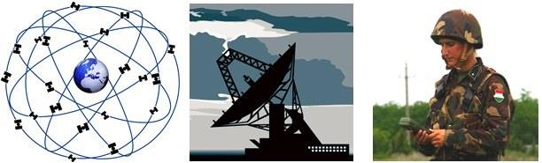
*48. A NAVSTAR GPS rendszer műholdas, vezérlő és felhasználói szegmense (a szerző rajza)*

A NAVSTAR GPS műholdak 20200 km távolságra, 6 orbitális pályán keringenek a Föld körül. Számuk változó, az üzemelési megbízhatóság növelése érdekében valamivel több, mint az elméletileg szükséges 24 műhold. Ennyi műhold kell ugyanis a kielégítő jelvételhez és a biztos helymeghatározáshoz, bárhol is legyen a vevő a Földön.

A földi műholdkövető állomások, amelyeket együttesen vezérlő, vagy kontrollszegmensnek is nevezünk, az USA katonai támaszpontjain üzemelnek a világ öt pontján. A követőállomások feladata a műholdak által sugárzott jelek figyelése, a műholdak pályaelemeinek számítása, valamint korrekciós adatok visszajuttatása a műholdakra.

A felhasználó szegmensbe tartozik minden GPS műholdjel vételére és feldolgozására alkalmas eszköz, az erre épülő helymeghatározási és navigációs rendszerek, illetve eszközök. A műholdkövető állomásoktól eltérően a felhasználók csak fogadni tudják a műholdak által sugárzott jeleket, a műholdakkal adatkapcsolatot nem létesíthetnek.

#### 6.3.3.3 A GPS alapú helymeghatározás elve

A GPS műholdak folyamatosan, a nap 24 órájában sugároznak rádiójeleket a földre. A jelek tartalmazzák a műhold azonosítóját, pályaadatait és egy sor más navigációs üzenetet. A földi vevő a rádiójeleket fogja, feldolgozza és meghatározza a távolságot az egyes műholdak (Sn) és a vevő antennája között. A meghatározott távolságokat (ρn), mint ismert sugarakat a pályaadatok alapján számított műholdhelyzetekből kimérve a metszési pontban megkapjuk a vevő helyét (M). Ha a geometriai feladat megoldása során két metszési pont jön létre, közülük a valószínűtlen (M') kizárható.

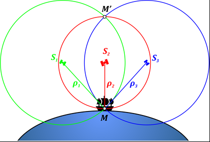
*49. Helymeghatározás térbeli ívmetszéssel három GPS műhold ismert távolsága és helyzete alapján (a szerző rajza)*

A műhold és a vevő közötti távolság meghatározásához mind a műhold, mind a vevőkészülék azonos időben ugyanazt a kódsorozatot állítja elő. Amikor e kódsorozatot a műhold rádióhullámok révén kibocsátja, az a fény sebességével halad a vevőantenna felé, és a távolság megtételéhez szükséges idővel késve érkezik meg. A vevőberendezés a saját és a beérkező kódsorozat időeltolódása alapján állapítja meg a műhold és a vevőantenna közti távolságot. A kódok összevetése, idegen szóval korrelációja alapján ezt a mérési módszert kódkorrelációs eljárásnak is nevezzük.

A problémát e módszernél az jelenti, hogy a műholdak nagy pontosságú atomórái és a földi vevők jóval kisebb méretű, de lényegesen pontatlanabb kvarckristályos órái között a fény sebességéhez mérten jelentős időeltérés mutatkozik. Az időeltérés a kódok összehasonlításánál valótlan távolságok kialakulásához vezet, így a műholdakról mért távolságok nem egy pontban metszik egymást. A hiba kiküszöböléséhez egy újabb, negyedik műhold jeleit is számításba kell venni, amely alapján meghatározható és kiiktatható a műhold és a vevő időeltérésből adódó geometriai pontatlanság.

Pozíciónk pontos térbeli meghatározásához tehát legalább négy műhold jelét kell fognunk. Ha megelégszünk a kétdimenziós helymeghatározással (tehát pozíciónk magassága nem lényeges adat), akkor elegendő három műhold jelének vétele is. Az egyszerre elérhető műholdak száma növelésével a helymeghatározások eredményei megbízhatóbbá válnak.

Arra is ügyelnünk kell, hogy a műholdak látszólagos eloszlása az égbolton (konstelláció) lehetőleg egyenletes legyen. Mint tudjuk, minél közelebb található egymáshoz két ismert pont, annál megbízhatatlanabb lesz az ívmetszéssel létrehozott harmadik pont helyzete.

Egy másik pontatlansági tényező a rádiójelek terjedésével függ össze. A jelek ugyanis jelentős késést szenvednek az atmoszféra felső határán lévő, elektromosan töltött részecskéket tartalmazó ionoszférában. Mivel az ionoszféra állapota folyamatosan változik, a késés nagysága is jelentősebb mértékben megváltozhat.

Mindezek és még egy sor befolyásoló tényező következtében a GPS műholdak alapján végzett helymeghatározásoknál 10–20 méteres koordináta eltéréseket kapunk, ami az 1:50 000 méretarányú térképről levehető koordináták és távolságok pontosságának felel meg. Természetesen kiegészítő eszközök és módszerek révén mind a megbízhatóságot, mind a pontosságot (akár milliméter nagyságrendig) számottevő mértékben javítani lehet, de ez már nem az általános katonai felhasználás körébe tartozik.

### 6.3.4 A GPS gyakorlati alkalmazási lehetőségei

A GPS napjaink széleskörűen alkalmazott helymeghatározó és navigációs rendszere. Az 1990-es évek elején még csak korlátozottan elérhető rendszert ma már többen használják polgári célokra, mint katonai feladatok megoldása során. A GPS jelek vételére alkalmas készülékeket megtalálhatjuk autókban, hajókon, mobiltelefonokban.

A felhasználói kör kiszélesedésével egyre gazdagabb funkcionalitású eszközök jelennek meg. A számtalan lehetőség közül összefoglaló jelleggel az alábbiakat emeljük ki:
- helymeghatározási feladatok;
- jármű- és flottanavigáció;
- fegyverirányítás;
- roboteszközök irányítása;
- járulékos és kiegészítő meghatározások.

#### 6.3.4.1 Helymeghatározási feladatok

Az előző fejezetekből képet kaptunk arról, hogy a tájékozódás négy alapművelete közül az egyik legnehezebb az álláspont földrajzi helyének gyors és megbízható meghatározása. E feladatra számos hagyományos eszközt és módszert alkalmazhatunk, amelyek jelentős részére a napszak és az időjárás változásai komoly befolyással bírnak.

GPS vevővel a helymeghatározás lényegesen egyszerűbb. Alapesetben leolvashatjuk a pozíció koordinátáit a vevő kijelzőjéről, majd azok alapján megkereshetjük álláspontunk helyét a topográfiai térképen. Fejlettebb eszközöknél lehetőség van magának a térképi tartalomnak a megjelenítésére a kijelzőn, így a koordináták térképi felszerkesztése elhagyható.

A pozíció kijelzésénél tisztázni kell (a vevőkészüléken be kell állítani), hogy a pont koordinátái, illetve azonosítói melyik alapfelületre, vetületi rendszerre vonatkoznak. Azt is tudnunk kell, hogy a műholdas helymeghatározás 10 métert meghaladó pontatlansága miatt ritkán kapunk kétszer ugyanolyan koordináta értéket azonos pontok ellenére is.

Az álláspont meghatározásán túl célpontok felkeresésére is kiválóan alkalmas egy GPS vevő. A célpont megközelítése a tájolós navigációtól (azimutmenet) eltérően lényegesen könnyebb akadályokkal teli terepszakaszokon. A célpontot kb. 20 méterre megközelítve érdemes azt vizuálisan beazonosítani és nem a készülék kijelzőjére hagyatkozni. A megközelítés utolsó métereit, a pontosabb eredmény érdekében, egyenes vonalú, egyenletes mozgással tegyük meg!

A GPS vevővel tetszőleges pontok koordinátáit rögzíthetjük, továbbá megtett utunk nyomvonalát is rögzíthetjük. E nyomvonalat később felhasználhatjuk ajánlott közlekedési útvonalként is. A nyomvonalrögzítés módszerével lehatárolhatunk területeket, felmérhetünk nagy kiterjedésű objektumokat, utcahálózatokat is.

#### 6.3.4.2 Jármű- és flottanavigáció

A GPS vevők navigációs célú felhasználása az egyik legáltalánosabb polgári és katonai alkalmazás. A járművek GPS alapú navigációja a megtett útvonal rögzítésén túl lehetővé teszi optimális útvonalak kijelölését és követését, a pillanatnyi és az átlagsebesség, az irány, a hátralévő távolság és idő folyamatos figyelemmel kísérését. A fejlettebb eszközök az útvonal követését hangüzenetekkel hajtják végre, az autóvezető vizuális figyelemmegosztásának elkerülése érdekében. Nyílt vizeken, vagy a szárazföldön, úton kívüli mozgásnál lehetőség van a járművek kijelölt mozgási folyosókon történő közlekedtetésére, veszélyes zónák és helyek elkerülésére.

A járműnavigáció a magas épületekkel sűrűn beépített városi településeken és az erdős hegyvidéki területeken jóval nehezebb. Az akadozó jelvétel mellett ilyenkor fokozottabban kell ügyelni a térkép-terep egyeztetésre, a mozgás irányának változásaira (tájoló) és a megtett távolságra (km-mérő óra).

A flottanavigáció már fejlettebb rendszer kiépítését igényli, mivel itt több jármű helyzetére vagyunk kíváncsiak egyidejűleg. Az egyes járművekre elhelyezett GPS vevők jelei nem, vagy nem csak a fedélzeten kerülnek feldolgozásra, hanem folyamatos rádiókapcsolattal egy irányító központban, ahol a járművek pillanatnyi helyzetén túl befolyásolni lehet a mozgásukat is. A járművek helyzeti adatai mellett, megfelelő szenzorok telepítésével, lehetőség nyílik a jármű állapotának, illetve a terep jellemzőinek megfigyelésére is.

#### 6.3.4.3 Fegyverirányítás

Napjaink katonai műveleteiben minden eddiginél nagyobb szerepet kapnak a műholdak, amelyeket felderítési, hírközlési és navigációs feladatokon túl a fegyverirányítás terén is igénybe veszünk. A GPS nemcsak a csapatok mozgásával vagy különféle helymeghatározási feladataival kapcsolatos kérdésekre ad választ, hanem manőverező robotrepülőgépek, precíziós bombák célra vezetéséhez is támogatást nyújt.

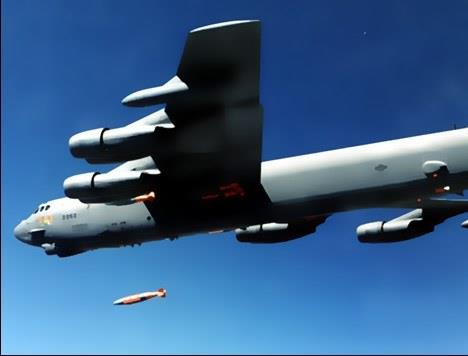
*50. Precíziós bomba (JDAM) indítása egy B-52H típusú stratégiai bombázóról (forrás: navair.navy.mil)*

A GPS alapú célravezetés előnye, hogy időjárástól, napszaktól és évszaktól kevésbé függ az eddig használt rendszerekhez képest. Hátránya, hogy a GPS műholdjelek szándékos zavarása a fegyverirányítást blokkolhatja.

**Roboteszközök irányítása**

A roboteszközök a saját és szövetséges csapatok élőerejének megóvása érdekében egyre több felhasználási területen jelennek meg a válságövezetek műveleteiben. Robotok alkalmazhatók veszélyes ipari, vegyi, nukleáris anyagokkal szennyezett területeken, bomba- és roncskutató, mentő és felderítő feladatok végrehajtása során. A roboteszközök sokfélesége az adott feladat és a rendelkezésre álló technikai háttér függvénye. A leggyakoribb alkalmazási területeknek megfelelően ide tartoznak a pilóta nélküli légi-, földi- és vízi járművek, a felderítő robotok, a támadó-, védő-, kutató- és mentőrobotok.

A robotok vezérlése lehet autonóm (önálló), illetve részben, vagy teljesen távirányítással működő. A GPS különösen az autonóm robotok navigálásánál jelent segítséget. A többször felhasználható pilóta nélküli repülőeszközöknél az útvonalon tartásban, illetve a leszállópálya megközelítésében nyújt segítséget a GPS alapú navigáció. Az automatikus landolást már egyéb vezérlő rendszerekkel vagy közvetlen manuális irányítással célszerű megoldani.

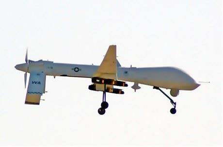
*51. A Predator típusú pilóta nélküli repülőgép (forrás: Opinio Juris)*

#### 6.3.4.4 Járulékos és kiegészítő alkalmazások

A GPS lehetővé teszi olyan feladatok végrehajtását is, amelyek nem kifejezetten köthetők a navigációhoz, illetve a helymeghatározásokhoz. Ilyen feladat lehet például irányítási rendszerek időszinkronizációja. A GPS vevőkészülékek a műholdjelek feldolgozása után saját belső órájuk járását a műholdak sokkal pontosabb atomóráihoz igazítják, amely által a legpontosabb hordozható időmérőeszközhöz jutunk. Az időszinkronizálás azoknál a rendszereknél fontos, amelyeknél az egyes elemek összeköttetése nehezen valósítható meg, illetve jelentős távolságokra vannak egymástól, és a rendszer működtetésében az egyidejűség lényeges szerepet játszik.

A fejlett vevőkészülékek, megfelelő térinformatikai háttérrel, a terepi tájékozódás összetett kérdéseire is választ tudnak adni. Lehetőséget biztosítanak két vagy több pont közötti távolság és irány meghatározása, különböző tereppontok optimális megközelítésére, figyelembe véve a domborzat és más tereptárgyak akadályozó jellegét.

A GPS műholdakról érkező nyers navigációs üzenetek megfelelő eszközökkel további speciális felhasználási lehetőségeket biztosítanak, amelyeket tudományos kísérletekben és mérnöki feladatok során alkalmazhatunk. A GPS így nyert teret a geodéziai és geofizikai felmérésekben, a különféle közlekedési és monitoring (megfigyelő) rendszerekben.

---

## Felhasznált és ajánlott irodalom

Kállai Attila: Térkép és tereptani alapismeretek. In: Czank László (szerk.) Katonai alapismeretek (tankönyv). Budapest, Zrínyi Kiadó, 2009. ISBN 978 963 327 490 3 (pp. 98–173.)

Kállai Attila (geoinformációs támogatás); Siposné Kecskeméthy Klára (katonaföldrajz) szócikkek in Krajnc Zoltán (et al.): Hadtudományi lexikon — Új kötet. Dialóg Campus, Budapest, 2019.

Balatoni Béla (szerk.): Katonai tereptan (Ált/204), Magyar Honvédség Parancsnoksága, 1991.

https://sway.cloud.microsoft/IGKForcE784DVLGp
