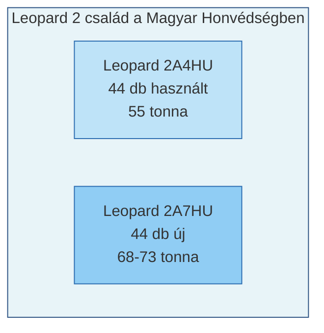
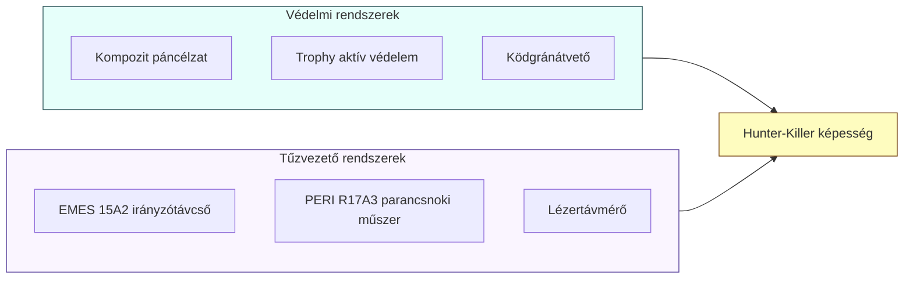
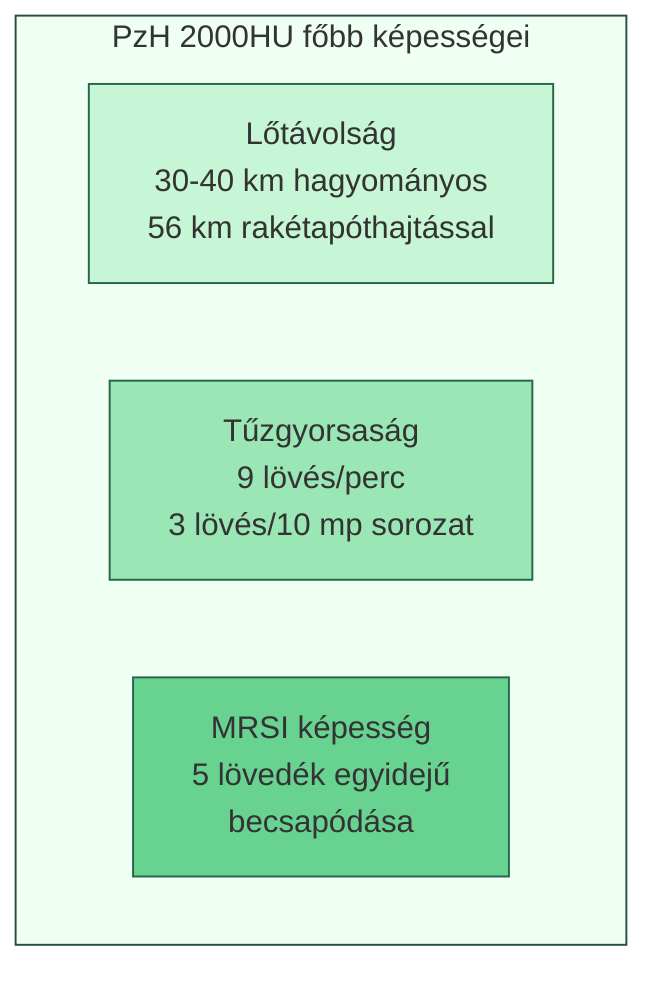
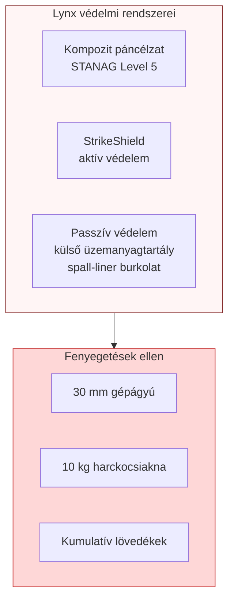
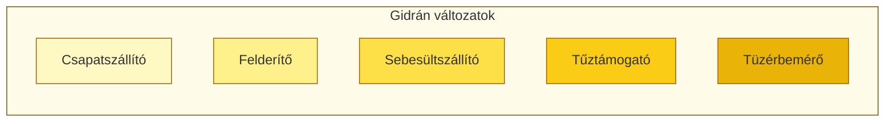
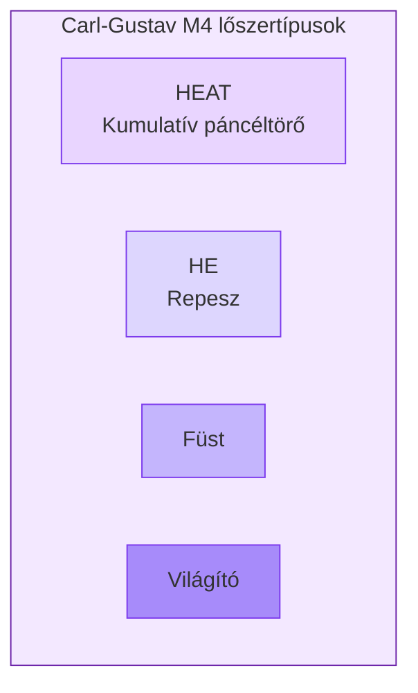
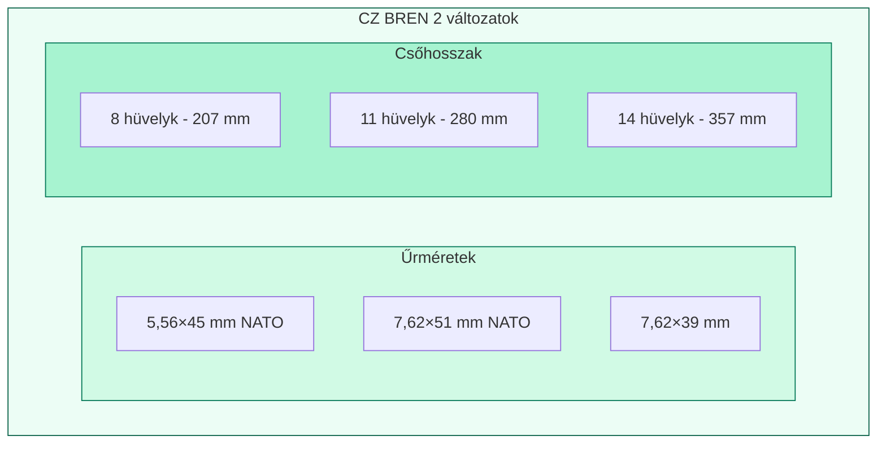
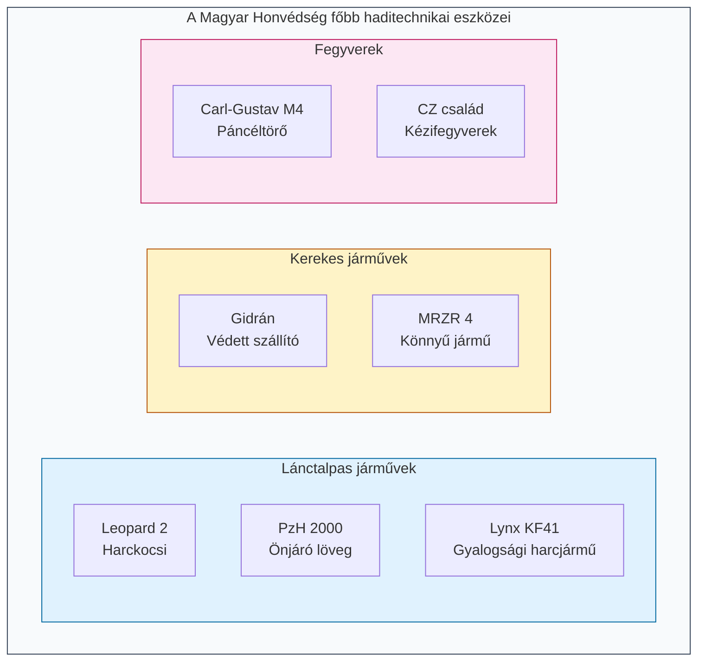

# A Magyar Honvédség Főbb Haditechnikai Eszközei

## Tanulmányi kivonat

---

## Bevezetés

### Mi a Honvédelmi és Haderőfejlesztési Program?

A Magyar Honvédség 2017 óta átfogó modernizáción megy keresztül. Ez azt jelenti, hogy a régi, elavult fegyvereket és járműveket fokozatosan lecserélik a világ legkorszerűbb haditechnikai eszközeire. A cél, hogy a magyar katonák a 21. század követelményeinek megfelelő felszereléssel végezhessék munkájukat.

**Definíció:** A *Honvédelmi és Haderőfejlesztési Program (HHP)* egy 2017-2026 között megvalósuló átfogó fejlesztési program, amelynek célja a Magyar Honvédség technikai modernizációja, a NATO-követelményeknek megfelelő átfegyverzés végrehajtása és korszerű haditechnikai eszközök beszerzése.

### Az új eszközök főbb jellemzői

Az új harcjárművek közös tulajdonságai:
- **Digitális rendszerek**: Számítógépes tűzvezető rendszerek, hálózatos hadviselésre alkalmas kommunikáció
- **Éjszakai harcképesség**: Hőkamerák és éjjellátó berendezések
- **Automata sebességváltó**: Könnyebb kezelhetőség harci körülmények között
- **Külső aggregátor**: Állóhelyzeti áramellátás a motor járatása nélkül

### Hazai hadiipar fejlesztése

A beszerzésekkel párhuzamosan Magyarországon is épülnek hadiipari üzemek:
- **Zalaegerszeg**: Lynx gyalogsági harcjárművek gyártása
- **Kaposvár**: Gidrán páncélozott járművek összeszerelése
- **Kiskunfélegyháza**: CZ fegyvercsalád licencgyártása

---

## 1. A Leopard 2 harckocsi család

### Mi is az a harckocsi?

A harckocsi a szárazföldi hadviselés egyik legfontosabb fegyvere. Egy vastagon páncélozott, lánctalpas jármű, amely nagy erejű ágyúval és géppuskákkal rendelkezik. A harckocsi három fő tulajdonsága a **páncélvédelem**, a **mozgékonyság** és a **tűzerő**.

**Definíció:** A *Leopard 2* német fejlesztésű és gyártású harckocsi, amelyet a Krauss-Maffei Wegmann (KMW) gyárt. A Magyar Honvédség két változatát rendszeresítette: a Leopard 2A4HU (44 db használt) és a Leopard 2A7HU (44 db új).

### Főbb technikai jellemzők

| Jellemző | Leopard 2A4HU | Leopard 2A7HU |
|----------|---------------|---------------|
| Tömeg | 55 tonna | 68-73 tonna |
| Főfegyverzet | 120 mm L/44 löveg | 120 mm L/55A1 löveg |
| Motor | MTU MB 873 Ka-501, 1500 LE | MTU MB 873 Ka-501, 1500 LE |
| Sebesség | 68 km/h | 68-72 km/h |
| Hatótávolság | 550 km | 450 km |
| Személyzet | 4 fő | 4 fő |

### A személyzet feladata

A harckocsi négy fővel üzemel:
1. **Parancsnok**: Irányítja a harckocsit, figyeli a harcteret
2. **Irányzó**: Kezeli a fő fegyverzetet és a tűzvezető rendszert
3. **Töltőkezelő**: Tölti a löveget a megfelelő lőszerrel
4. **Vezető**: Irányítja a járművet

### A Leopard 2A7HU korszerű rendszerei

**Definíció:** A *Hunter-Killer képesség* azt jelenti, hogy a parancsnok és az irányzó egymástól függetlenül képes célokat felkutatni és leküzdeni, jelentősen növelve a harckocsi hatékonyságát.

---

## 2. A PzH 2000HU önjáró löveg

### Mi az az önjáró löveg?

Az önjáró löveg egy mozgó tüzérségi eszköz, amely nagy távolságra képes lőni. Szemben a hagyományos ágyúkkal, ez a fegyver önállóan mozog, nem kell vontatni. A PzH 2000 a világ egyik legkorszerűbb tüzérségi rendszere.

**Definíció:** A *PzH 2000 (Panzerhaubitze 2000)* egy 155 mm űrméretű, harckocsi alvázra épített önjáró löveg, automatizált töltéssel és digitális tűzvezetéssel. A Magyar Honvédség 24 darabot rendszeresített.

### Főbb képességek

**Definíció:** Az *MRSI (Multiple Round Simultaneous Impact)* egy speciális tüzelési mód, amelynél több lövedéket lőnek ki egymás után különböző röppályákon, és azok egyszerre csapódnak be a célba - ez megsemmisítő erejű tűzcsapást eredményez.

### Technikai adatok

| Jellemző | Érték |
|----------|-------|
| Űrméret | 155 mm, L/52 csőhossz |
| Tömeg | 56 tonna |
| Lőszerjavadalmazás | 60 lövedék + 288 lőpor-préstest |
| Motor | 1000 LE turbódízel |
| Sebesség | 60 km/h |
| Hatótávolság | 420 km |
| Személyzet | 5 fő |

---

## 3. A Lynx KF41 gyalogsági harcjármű

### Mi az a gyalogsági harcjármű?

A gyalogsági harcjármű (IFV - Infantry Fighting Vehicle) nem csupán katonákat szállít, hanem támogatni is tudja őket a harcban. A Lynx az egyik legmodernebb ilyen jármű a világon.

**Definíció:** A *Lynx KF41 (KampfFahrzeug 41)* a német Rheinmetall által fejlesztett, 21. századi elvek alapján tervezett páncélozott gyalogsági harcjármű. A Magyar Honvédség 218 darabot rendelt, ebből 172-t a zalaegerszegi gyárban készítenek.

### Védelem és túlélőképesség

**Definíció:** A *STANAG 4569* a NATO páncélvédelmi osztályozási szabványa, amely 1-től 6-ig terjedő szinteken sorolja be a járművek védettségét. A Lynx Level 5 besorolású.

### Fegyverzet

A Lynx fő fegyvere a LANCE 2.0 lakatlan toronyban található:
- **35 mm Wotan gépágyú**: Programozott repeszlőszer és páncéltörő képesség
- **7,62 mm párhuzamosított géppuska**: Élőerő ellen
- **Spike LR2 rakéták**: 2 db, harckocsik ellen hatékony, 5500 m hatótávolság

**Definíció:** A *LANCE (Lethal Advanced Network-Capable Effector)* egy lakatlan, távirányított fegyvertorony. Előnye, hogy a személyzet a jobban védett küzdőtérben marad.

### Technikai adatok

| Jellemző | Érték |
|----------|-------|
| Tömeg | 44-48 tonna |
| Motor | Liebherr D9612, 1470 LE |
| Sebesség | 75 km/h |
| Hatótávolság | 600 km |
| Személyzet | 3 fő + 8 leszálló |

---

## 4. A Gidrán 4×4 védett jármű

### Mire szolgál a Gidrán?

A Gidrán egy páncélozott szállító jármű, amely különösen jó védelmet nyújt aknák és robbanószerkezetek (IED) ellen. Neve a gyors és erős magyar lófajtáról származik.

**Definíció:** A *Gidrán* egy 4×4 kerékképletű, növelt aknavédelemmel ellátott páncélozott jármű (MRAP kategória). A török EJDER YALÇIN alapján készül, magyar igényekre szabva, Kaposváron gyártják.

### Technikai adatok

| Jellemző | Érték |
|----------|-------|
| Tömeg | 14 tonna (+ 4 t teherbírás) |
| Védelem | STANAG Level 3 + 4a/4b aknavédelem |
| Sebesség | 120 km/h |
| Hatótávolság | 700 km |
| Kapacitás | 9+2 fő |
| Motor | 375 LE turbódízel |

---

## 5. A Polaris MRZR 4 könnyű jármű

### Mire használják?

Ez egy ultrakönnyű terepjáró a különleges műveleti erők számára. Olyan könnyű, hogy helikopterrel is szállítható.

**Definíció:** A *Polaris MRZR 4 (Military RZR)* amerikai gyártású ultrakönnyű taktikai jármű (LTATV), amelyet gyors bevetésekre, felderítésre és speciális műveletekre terveztek.

| Jellemző | Érték |
|----------|-------|
| Tömeg | 867 kg |
| Kapacitás | 4-6 fő |
| Hasznos teher | 680 kg |
| Sebesség | 96 km/h |
| Motor | 100 LE benzin |

---

## 6. A Carl-Gustav M4 páncéltörő fegyver

### Mi ez a fegyver?

A Carl-Gustav egy vállról indítható, több célra használható fegyver. Elsősorban páncélozott célok ellen vetik be, de épületek és erődítések ellen is hatékony.

**Definíció:** A *Carl-Gustav M4* egy 84 mm űrméretű, hátrasiklás nélküli (HSN), huzagolt csövű, svéd fejlesztésű többcélú támogató fegyver.

| Jellemző | Érték |
|----------|-------|
| Űrméret | 84 mm |
| Tömeg | 6,6 kg (üres) |
| Hatásos lőtávolság | 400-700 m |
| Páncélátütés | 400-500 mm |
| Tűzgyorsaság | 6 lövés/perc |

---

## 7. A CZ kézifegyvercsalád

### Miért fontos a hazai gyártás?

A CZ fegyvereket Kiskunfélegyházán gyártják licensz alapján. Ez azt jelenti, hogy a Magyar Honvédség nem függ külföldi szállítóktól, és háború esetén is biztosított az utánpótlás.

### CZ BREN 2 gépkarabély

**Definíció:** A *CZ BREN 2* egy moduláris, gázelvételes automata rendszerű gépkarabély, amely a magyar lövészkatona alapfegyvere. Több kaliberben is használható.

| Jellemző | Érték |
|----------|-------|
| Tömeg | 2,86-3,25 kg |
| Tárkapacitás | 30 lőszer |
| Tűzgyorsaság | ~850 lövés/perc |
| Tűzmód | Egyes / Sorozat |

### CZ P09 pisztoly

**Definíció:** A *CZ P09* egy 9×19 mm űrméretű, félautomata (öntöltő), SA/DA rendszerű szolgálati pisztoly.

| Jellemző | Érték |
|----------|-------|
| Űrméret | 9×19 mm Parabellum |
| Tárkapacitás | 19 lőszer |
| Működés | Rövid csőhátrasiklásos, reteszelt |

### CZ Scorpion Evo 3 A1 géppisztoly

**Definíció:** A *CZ Scorpion Evo 3 A1* egy 9×19 mm űrméretű, szabad tömegzáras rendszerű géppisztoly, rövid távú harcra és közelharc eszközeként.

| Jellemző | Érték |
|----------|-------|
| Tűzgyorsaság | ~1150 lövés/perc |
| Tűzmód | Egyes / 3-as sorozat / Sorozat |
| Hatásos lőtávolság | 200 m |

---

## Összefoglaló táblázat

---

## Fogalomtár

| Fogalom | Jelentés |
|---------|----------|
| **HHP** | Honvédelmi és Haderőfejlesztési Program (2017-2026) |
| **STANAG** | NATO szabványosítási megállapodás |
| **IFV** | Infantry Fighting Vehicle - gyalogsági harcjármű |
| **MRAP** | Mine-Resistant Ambush Protected - aknaálló jármű |
| **HSN** | Hátrasiklás nélküli (fegyver) |
| **MRSI** | Multiple Round Simultaneous Impact |
| **APS** | Active Protection System - aktív védelmi rendszer |
| **Hunter-Killer** | Parancsnok-irányzó független célkezelési képesség |
| **Power Pack** | Motor és váltó egybe épített, cserélhető egysége |

---

*Készült a Magyar Honvédség Haditechnikai Eszközei című tananyag alapján*
*Szerző: Pályi József (eredeti), Kivonat: 2024*
