# 7 A MAGYAR HONVÉDSÉG SZÁRAZFÖLDI CSAPATOK FŐBB HADITECHNIKAI ESZKÖZEI

## 7.1 BEVEZETÉS

Az E-Learning tananyag a Magyar Honvédség szárazföldi csapatainak haditechnikai eszközei közül ismerteti a legfontosabbakat. A tananyag a Magyar Honvédség Honvédelmi és Haderőfejlesztési Program keretében beszerzett egyes haditechnikai eszközeit mutatja be. A Honvédelmi és Haderőfejlesztési Program célja a csúcstechnológia megjelenítése a haderőben, teljes átfegyverzés végrehajtása NATO-követelmény szerint, a kor színvonalának megfelelő modern haditechnikai eszközök beszerzése.121 A Magyar Honvédség új hadfelszerelése már minden tekintetben a 21. század technológiáját képviseli – így Magyarország 2021-ben megjelent Nemzeti Katonai Stratégiája már ezekkel a képességekkel számol a következő években. Egy példaként: az új harcjárművek nappali és éjszakai harcra egyaránt alkalmasak, fejlett lézertávmérővel és tűzvezető számítógéppel rendelkeznek, illetve alkalmasak a hálózatos hadviselés megvalósítására. Sebességváltójuk szinte kivétel nélkül automata váltó. Az állóhelyzeti áramellátás biztosítása érdekében az új harcjárműveket – a NATO gyakorlatának megfelelően - külső aggregátorral látták el.122

Az új hátrasiklás nélküli fegyvernél, de a kézifegyvereknél is, szerkezeti anyagként megjelentek a kompozitanyagok, műanyagok. Mivel a HHP minden fegyvernemet érintő fejlesztéseivel párhuzamosan egy hadiiparfejlesztési program is megvalósul, az új haditechnikai eszközök egy részét már a hazánkban újonnan létrehozott hadiipari üzemek gyártják.123

A HHP kiemelkedő eredményeként mutatható fel a Magyar Honvédségben rendszeresített CZ BREN kézifegyvercsalád – a Česka Zbrojovka BREN 2 gépkarabély, a CZ Scorpio Evo 3 A1 géppisztoly és a CZ P–07/P–09 pisztolyok – hazai licencgyártásának megszervezése a TERRA Zrt.-nél Kiskunfélegyházán.

## 7.2 A LEOPARD 2A4HU ÉS A LEOPARD 2A7HU HARCKOCSI

A 2017-ben indult Honvédelmi és Haderőfejlesztési Program részeként, a Magyar Honvédség jelentős mennyiségben szerez be a szárazföldi haderő részére korszerű haditechnikai eszközöket, köztük 44 db Leopard 2A7HU és 12 db Leopard 2A4HU harckocsit. A 12 db Leopard 2A4 harckocsi 2020-ban állt hadrendbe a Magyar Honvédségben Leopard 2A4HU néven.124 A harckocsit a klasszikus elvek szerint három összetevő, illetve ezek kombinációja teszi a szárazföldi haderőnem fő ütőerejévé. Ez a három összetevő – a páncélvédelem, a mozgékonyság és a tűzerő – határozza meg a harckocsi technikai potenciálját.

A Leopard 2 harckocsi főbb konstrukciós és műszaki jellemzői: Rheinmetall 120 mm-es simacsövű löveg, kazamatás kompozitszerkezetű síklemezpáncélzat, töltőlevegő-visszahűtéses, turbódízel erőforrás, hidrodinamikus-bolygóműves automata sebességváltó, torziós rugózású felfüggesztés.

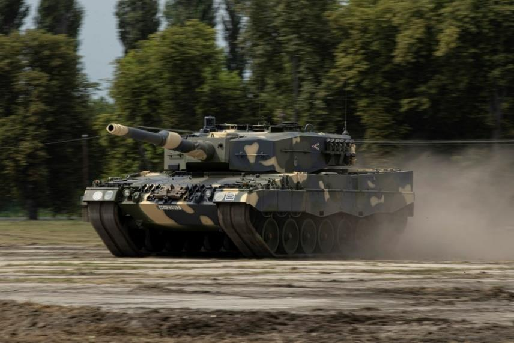
*7.1. ábra. A Magyar Honvédség Leopard 2A4HU harckocsija*

A számítógépes tűzvezető rendszer lézertávmérővel állapítja meg a cél távolságát. A Leopard harckocsi mozgó, páncélozott célok ellen akár a jelentős, 5000 m-es távolságon is eredményesen veheti fel a harcot. A 120 mm-es lövegből kilőtt, űrméret alatti lövedék 1650 m/s kezdősebességéhez 750 mm homogén acélpáncél-átütési képesség társul, amely bármely ma ismert harckocsi leküzdésére alkalmassá teszi a Leopard 2A4-est. A harckocsi tömege 55 tonna.

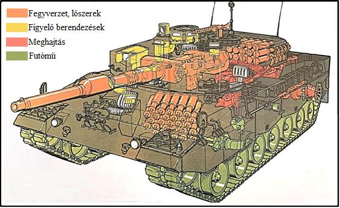
*7.2. ábra. 42 db lőszer két részletben málházva: torony lőszertároló rekesz + páncéltest elöl*

A mintegy 600–700 mm-es ekvivalens páncélvastagságú, réteges páncélzata magas szintű védettséget biztosít, amelyet számos passzív védelmet növelő megoldás – pl. a toronytól elkülönített lőszertároló kamra, ködgránátvető, hatékony álcázófestés, automata tűzoltó-berendezés stb. – egészít ki és fokoz. A harckocsi kezelőszemélyzete 4 fő: parancsnok, irányzó, vezető, és töltőkezelő.

### MOZGÁS- ÉS MANŐVER JELLEMZŐK

*1. sz. táblázat*

Az 1500 LE-s motor és a Wilson-rendszerű automata nyomatékváltó együttesen jelentős mozgékonyságot biztosít a Leopardnak (kiegészülve a nagy sebességű hátrameneti képességgel is).125 A harckocsi maximális sebessége 68 km/h (hátramenetben: 32 km/h). Hatótávolsága úton 550 km, terepen 280 km.

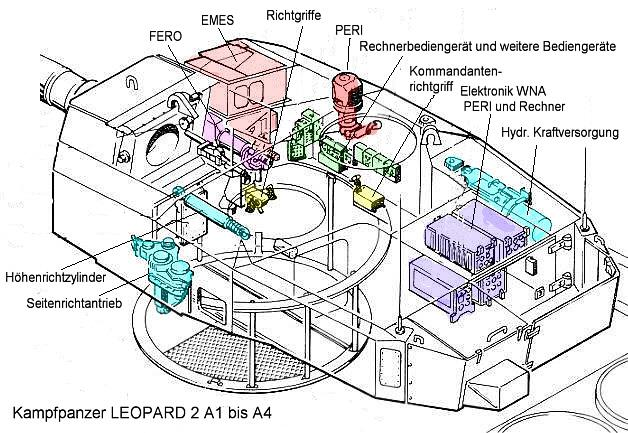
*7.3. ábra. Az A4 torony és egyes berendezései: hidraulika-egység és mozgatószervei kékkel jelölve*

A Leopard 2A4HU harckocsi ilyen módon a tűzerő, a védettség és a mozgékonyság területén egyaránt magasfokú képességekkel rendelkezik. Azonban a Magyar Honvédség számára szállított korszerűbb Leopard 2A7HU harckocsik védettsége, tűzereje jelentős mértékben meghaladja a Leopard 2A4HU képességeit, miközben a típus mozgékonysága lényegében változatlan maradt - tömege viszont a fejlesztések miatt megnövekedett.

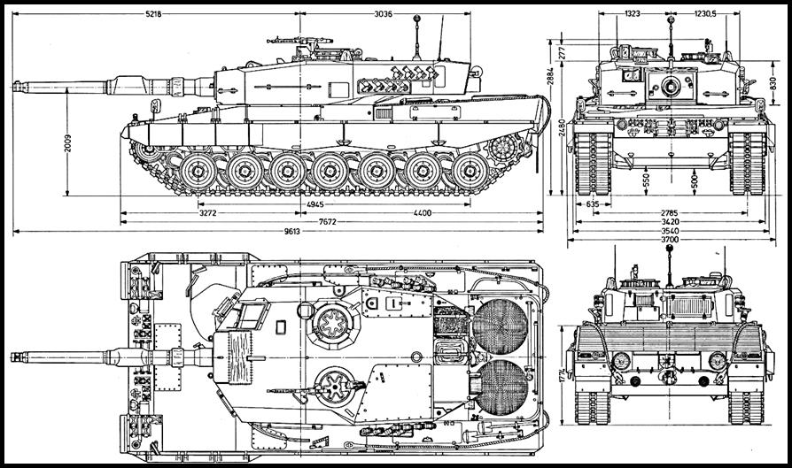
*7.4. ábra. Leopard 2A4HU harckocsi rajza*

A Leopard 2A7HU változat fokozott elektronikai-képességgel és védettséggel, illetve hosszabb csövű, L/55 űrmérethosszúságú löveggel rendelkezik majd, tömege: 68 tonna, de körkörös védelemre optimalizált ún. „Urban-kittel" ez elérheti a 75 tonnát is.

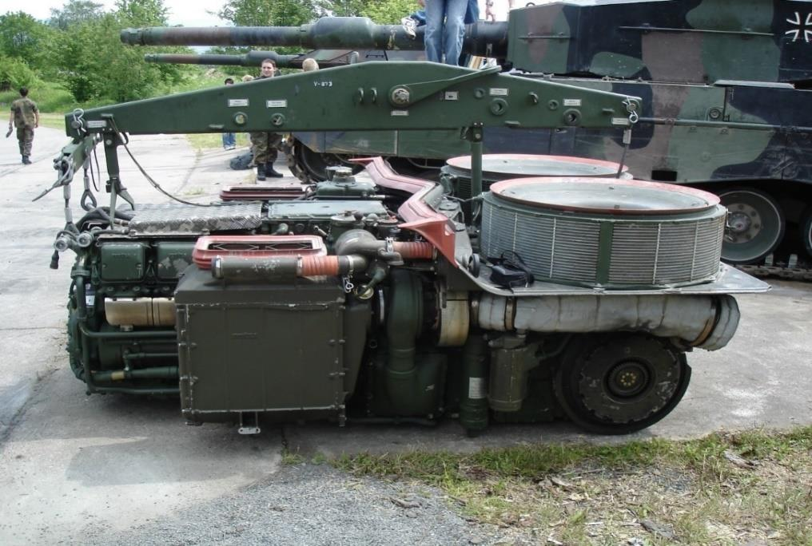
*7.5. ábra. MTU MB 873 Ka–501 motor Power Pack kialakítással - a sebességváltóval együtt kiemelhető*

### 7.2.1 A Leopard 2A7 és a Leopard 2A7+ változatok

A Leopard 2A7+ változat az hibrid hadviselés körülményeire optimalizált Leopard harckocsi, mely egyesíti a konvencionális és az aszimmetrikus háborúk tapasztalatait, debütálására a 2020-s Eurosatory kiállításon került sor.

A Leopard 2A7 változatnál növelték a harckocsi oldalvédelmét, emellett haspáncélzat-növeléssel, különféle plusz védelmi csomagokkal, kompozit páncéllal, RPG elleni rácsozattal is jelentősen növelték a védettséget, a tömeg így 64,5 tonnára nőtt. A Leopard 2A7+ változat torziós futóművét a nagyobb szerkezeti tömeg miatt megerősítették.

A Leopard 2A7+ a 67 tonnás össztömege mellett 63 km/h-s sebesség elérésére képes. Annak érdekében, hogy nagyobb tömeg mellett a gyorsulási képesség ne romoljon, az A7-es harckocsiban rövidebb áttételt alkalmaznak (így a végáttétel más, mint az A4-es harckocsié.)

A Leopard 2A7+ változat tűzvezető rendszerének főbb elemei és jellemzői:
- IFIS digitális harci rendszer (fedélzeti hálózati optimalizálását végzi),
- SOTAS IP digitális intercom,
- TC Attica panorámafigyelő műszer (harmadik generációs hőképalkotó) infravörös modul.

Módosított digitális tűzvezető rendszere Hughes-Krupp Atlas Elektronik EMES 13/15 típusú, melynek meghibásodása esetén az irányzó használhatja a Leitz gyártmányú FERO-Z18 8-10 szeres nagyítású, monokuláris távcsövet. A parancsnok a Rheinmetall/Zeiss PERI R–17A2 optikai rendszerrel hajtja végre feladatát. A periszkóp girostabilizált, éjszakai megfigyelésre és célmegjelölésre egyaránt alkalmas és képes a céltárgyról hőképet vagy infravörösképet is megjeleníteni egy monitoron keresztül. HgCdT megnevezésű CMT Zeiss WBG–X hő/infrakamerával látták el.

Az alkalmazott PERI és az EMES optikai, ill. hőkép-alkotó rendszerek körülbelül 50%-kal nagyobb hatótávolsággal rendelkeznek az orosz eszközöknél. A számítógép a megfelelő lőszer kiválasztása és betöltése után a löveget automatikusan a kiválasztott célra állítja. A lézertávmérő 10 km-ig alkalmazható, ekkor a mérési pontossága kevesebb, mint 20 méter. 5000 méterig mozgó célpontot is képes követni.

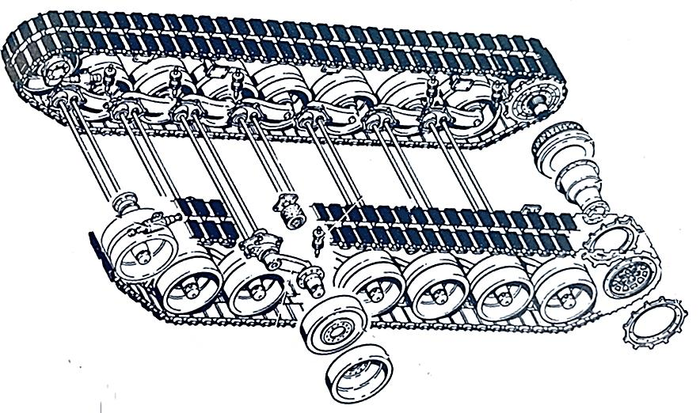
*7.6. ábra. A Leopard 2A4 harckocsi futóműve. A képen jól látható az elől három-hátul kettő hidraulikus lengőkarütköző*

A Leopard 2A7+ változatnál alkalmazott főbb fejlesztések:
- programozható HE lövedékek,
- távvezérelt FLW 200 távirányított fegyverplatform (12,7 mm géppuska),
- infravörös tartományban is hatásos Barracuda álcázó rendszer,
- modernizált tűzoltórendszer.

### 7.2.2 A Leopard 2A7+ főbb műszaki adatai

*2. sz. táblázat*

| Jellemző | Érték |
|----------|-------|
| Hosszúság | 10,97 m |
| Szélesség | 4,24 m |
| Magasság | 2,79 m |
| Tömeg | 64,5 t |
| Páncélzat | Kazamatás, kompozit szerkezetű, réteges páncélzat |
| Hajtómű | MTU MB 873–Ka501 12 hengeres 47.600 cm³ turbófeltöltős folyadékhűtéses dízelmotor |
| Nyomatékváltó | Renk HSWL 354 |
| Üzemanyag-mennyiség | 1160 l |
| Üzemanyagtípus | „mindenevő" dízel (gázolaj, ill. F-34/JP8 kerozin NATO Single Fuel Conception alapján) |
| Teljesítmény | 1103 kW (1500 LE) |
| Maximális sebesség | 68-72 km/h |
| Vízalatti átkelési mélység | 4 m |
| Gázlómélység | 2,25 m |
| Elektromos rendszer | 24 V |
| Hatótávolság | 450–550 km |
| Személyzet száma | 4 fő |
| Főfegyverzet | Rheinmetall 120 mm-es L/55 simacsövű harckocsiágyú, lőszer-javadalmazás: 42 db |
| Kiegészítő fegyverzet | 2 darab 7,62 x 51 mm-es FN MAG géppuska (modernizáláskor néhol 12,7 x 99 mm-es nehézgéppuska) |
| Ködgránátvető | 8-16 darab Wegmann 76 mm |
| Optikai rendszer | Peri R–17 – 17A2 |
| Irányzótávcső | Krupp-Atlas EMES 15 digitális |
| Irányzótávcső | FERO 18 |
| Infratávmérő | Zeiss-Optronik WBG–X |
| Lézertávmérő | Zeiss-Optronik 628 |

A harckocsi páncéltestre fel van szerelve egy 19 kW teljesítményű kiegészítő energiaforrásként szolgáló Steyr-motor, amely álló helyben, hosszú üzem esetén az elektromos berendezések üzemeltetéséhez szükséges elektromos áramot biztosítja, mely következményeként a harckocsi kisebb hőképpel, zajjal jár. A Steyer M12TCA kiegészítő tápegység lehetővé teszi a gazdaságos és halk állóhelyzeti áramellátást.

A Leopard 2A7+, a korábbi típusvariánsokhoz hasonlóan az MTU MB 873 Ka-501 jelű 1100 kW (1500 LE) teljesítményű dízelmotorral van szerelve.

A Leopard 2A7+ harckocsi fel van szerelve a SOTAS-IP interkommunikációs rendszerrel és a gyalogos katona telefonkapcsolatát biztosító rendszerrel.126

A Leopard 2A7HU harckocsi páncélvédelméről, mint a túlélőképesség fontos eleméről a kompozit szerkezetű merőleges síklemez és döntött előtétpáncél gondoskodik. A gyártó, a beépített területeken vívott harc megvívásának sikere érdekében kifejlesztett a harckocsihoz egy ún. 360°-os kiegészítő páncélzatot. Ez a kiegészítő páncél igény szerint fel- és leszerelhető és a beépített területeken biztosítja a nagyobb sebezhetőség elleni védelmet a páncéltörő fegyverekkel szemben. Az alapváltozat is 68 tonna, de a kiegészítő páncélzattal, IED elleni védelemmel felszerelt Leopard 2A7HU harckocsi tömege megközelíti a 73 tonnát.

A harckocsi kialakítása: kezelőszemélyzet 4 fő: harckocsiparancsnok, irányzó, töltőkezelő és a harckocsivezető. A páncéltestben elöl, a hagyományos középső pozíció helyett jobb oldalon foglal helyet a harckocsivezető, mivel a páncéltest bal oldalán egy kiegészítő lőszertárolót alakítottak ki. A toronyban három fő számára található munkahely. A torony jobb oldalán, egymás előtt foglal helyet az irányzó (elöl), mögötte (felette) pedig a parancsnok. A torony bal oldalán a töltőkezelő munkahelye található.

A Leopard 2A7HU harckocsi tűzerejéről egy L55A1 típusú, L55 kaliberhosszúságú, 120 mm-es Rheinmetall harckocsiágyú gondoskodik. A továbbfejlesztett L55A1 harckocsiágyú biztosítja az ellenséges célok hatékony leküzdését akár már 5000 m távolságon is. A harckocsi rendelkezik továbbá egy 7,62 mm-es párhuzamosított géppuskával, valamint egy 12,7 mm-es RCWS távvezérelt géppuskával, valamint 16 db 76 mm-es ködgránátvetővel, amelyek repeszgránátok kilövésére is alkalmasak.

A harckocsi előkészítés nélkül képes 1,2 m mélységű vízi átkelésre, előkészítéssel 2,25 m mély gázlón, valamint 4 m mélységű víz alatt képes átkelni.

A harckocsivezető munkahelyét SPECTUS II optikai rendszerrel szerelték fel. Az általa rögzített kép a harckocsivezető munkahelyén monitorokon jelenik meg.

Az irányzó főirányzó távcsöve az EMES 15A2 főirányzótávcső, amelyet az ATTICA 3. generációs hőképalkotó rendszerével és egy lézer távolságmérővel együtt szereltek fel. A parancsnok figyelőműszere a továbbfejlesztett PERI R17A3 parancsnoki figyelőműszer, amely saját hőképalkotóval és lézertávmérővel rendelkezik. A parancsnok figyelőműszere kamerákkal biztosítja a 360°-os megfigyelést a harckocsi körül. Ezek a felszerelések biztosítják a „Hunter Killer" képességet a Leopard 2A7HU számára.

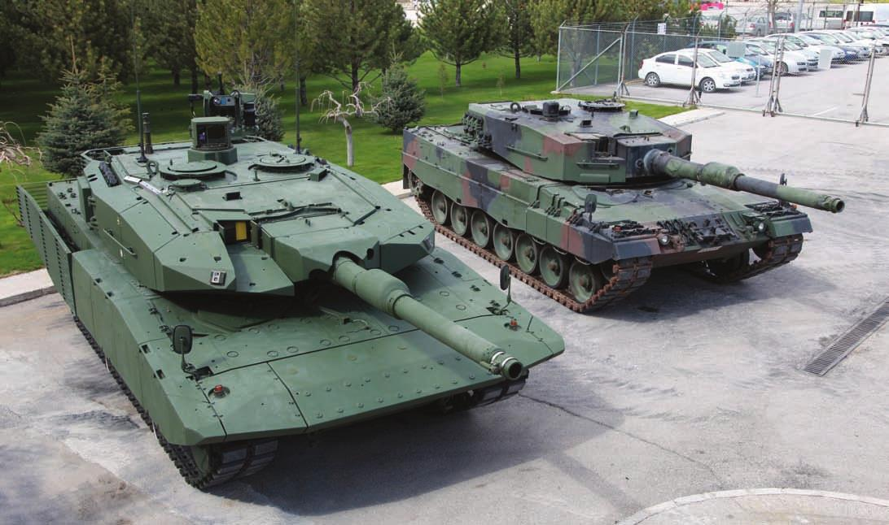
*7.7. ábra. A Leopard 2 A7 és a Leopard 2 A4 változat összevetése*

A Leopard 2A7HU harckocsi manőverező képességéről az MTU MB–873 Ka–501 dízelmotorja gondoskodik. A motort a váltóval egybe építették, az ún. „power pack", megoldás a harckocsi üzemeltetési és javítási koncepciója szempontjából különösen kedvező. Ezzel a megoldással a harckocsi meghibásodása esetén komplett egységeket cserélnek ki, hogy a harckocsi minél előbb újra hadra fogható állapotba kerüljön. Az egységek javítását csak ezt követően hajtják végre. Az MTU MB–873 egy 1100 kW-os (1500 LE) teljesítménnyel rendelkező, 12 hengeres, töltőlevegő-visszahűtéses turbódízelmotor. Az erőforrás a 70 tonna feletti tömegű harckocsit is könnyedén mozgatja, a harckocsi 70 km/h feletti végsebességre képes, a hatótávolsága 450 km. A harckocsit egy kiegészítő áramforrással (Additional Power Generators) is felszerelték, amely biztosítja az elektromos rendszerek energiaellátását.

## 7.3 A PZH 2000HU ÖNJÁRÓ LÖVEG

A PzH 2000HU önjáró lövegből 24 db áll hadrendbe 2022 második félévtől a Magyar Honvédségben. Az eszköz a világ legkorszerűbb tüzérségi eszközei közé tartozik: a PzH 2000 napjaink egyik leghatékonyabb, harckocsi alvázra szerelt 155 mm űrméretű önjáró csöves tüzérségi rendszere. A PzH 2000 önjáró lövegnek – számos korszerű tűzvezető berendezésének és magas fokú automatizáltságának köszönhetően – figyelemre méltóak a tűzgyorsasági, csőhosszának köszönhetően pedig a lőtávolság-adatai. Fő fegyverzete egy huzagolt csövű, keménykrómozott, 155 mm-es L/52 űrmérethosszúságú tarackágyú, csőszájfékkel, nyolc méter hosszú lövegcsővel. Jellemzője továbbá az integrált tűzvezető számítógép, a hibrid navigációs rendszer, a magas fokú mobilitás, valamint az irányzási és töltési folyamat automatizáltsága.

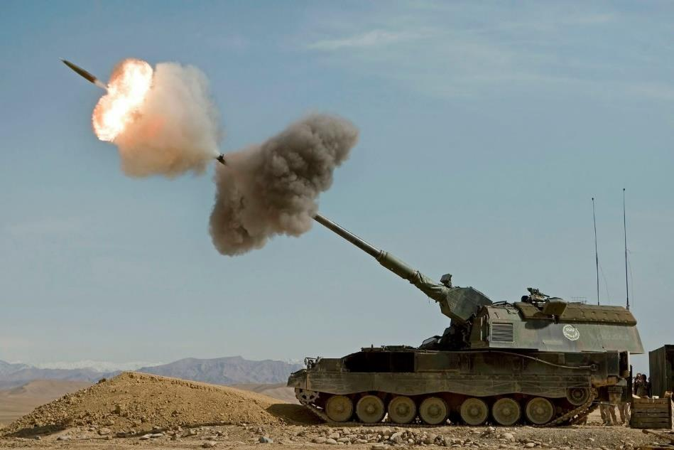
*7.8. ábra. A PzH 2000 önjáró löveg*

Az eszköz töltése automatizált. Lőtávolsága 30–40 km, amely rakétapóthajtású lőszerrel 56 km-es lőtávolságig növelhető. A lövegcsőre egy fázisvezérelt radart építettek, amellyel a PzH 2000 tűzvezető rendszere a kilőtt lövedéket nyomon követi, és oldalszélmérésre is alkalmas. Az autonóm tűzvezetési funkciókat egy fedélzeti számítógép biztosítja. A világ élvonalába tartozó digitális lőelemképző rendszere biztosítja, hogy már az első tűzcsapás megsemmisítő erejű legyen. Töltőberendezése automatizáltságának köszönhetően tűzgyorsasága 3 lövés/10 sec, de akár 10 lövést is képes leadni egy percen belül. Az MRSI (Multiple Round Simultaneous Impact) tüzelési módban, egy célpontot pár másodpercen belül, több eltérő röppályán haladó lövedékkel lehet támadni: három-öt egymást követő lövéssel olyan egyidejű tűzcsapásra képes, amely 12-30 km távolságon 50 m sugarú körön belül jelentős pusztítást végez. Mindez harcászati szempontból is kedvező, hiszen lerövidül a telepítés és a tűzkiváltás ideje, illetve megnő a pontosság, amely 40 km-es lőtávolság esetén 30–40 m. A harceszköz, közvetlen irányzással páncélozott célokat 1200 méterig képes leküzdeni. A lőszerek málházása a páncéltest hátsó részében található ajtókon keresztül történik. A pneumatikus rendszerű, önműködő (automata) tárat a csőfar mögött helyezték el. A tűzhelyzetnek megfelelő lövedék és töltet kiválasztását számítógépek vezérlik a töltőkezelők utasításaira; a töltés automatizált. A löveg lőszerjavadalmazása 60 db lövedék és 288 db lőpor-préstest. A lövedékek időzíthető gyújtóinak beállítását – a fedélzeti tűzvezető rendszer által meghatározott paraméterek alapján – a töltőberendezésbe épített gyújtóállító készülék végzi, indukciós elven. (A löveghez mechanikus időzített gyújtójú lövedékeket is alkalmazhatnak.) A család-elv és a kompatibilitás, valamint a harctéri logisztika hatékonyságának növelése érdekében az alváz több eleme megegyezik a Leopard 2 harckocsival. Az 56 tonna tömegű önjáró löveg az 1000 LE-s turbódízel motor és az automata nyomatékváltó segítségével 60 km/h maximális sebességre képes, miközben hatótávolsága 420 km. A PzH 2000 önjáró löveg ezáltal képes együtt mozogni a Leopard 2 harckocsikötelékekkel, miközben hatékony tűztámogatást nyújt azoknak. A PzH 2000 páncélzata – amely megvédi a járművet az ellenfél tüzérségi lövedékeinek repeszeitől, illetve a kézifegyverek tüzétől – modulrendszerű, hegesztett acélpáncél-lemezekből készült, és szükség esetén kiegészíthető reaktív pótpáncélzattal is. A torony tetejére önvédelmi célból egy MG3 típusú 7,62 mm-es géppuska is került, amely légi és földi célok ellen egyaránt alkalmazható. 2×4 db, 76 mm űrméretű gránátvetővel ködfüggöny létesíthető, amely jelentősen hozzájárulhat a harcjármű túlélőképességének növeléséhez.

A Panzerhaubitze 2000 önjáró lövegek az MH 25. Klapka György Lövészdandár 101. Tüzérosztályához kerülnek. Az önjáró lövegek mellett technikai felderítő képesség és digitális tűzvezető rendszer érkezik Tatára. Az optikai felderítés - ahol a felderítő vizuális megfigyeléssel deríti fel a célokat - csak az egyik módszer lesz. Emellett rádiólokációs felderítő eszközöket vásárolt a Magyar Honvédség, melyek vizuálisan nem megfigyelhető célokat is képesek lesznek felderíteni. Az új rendszer másik fontos képessége a tűzeszköz felderítés lesz: olyan radarok is érkeznek majd, amelyek a kilőtt tüzérségi lövedékek röppályáját elemezve képesek lesznek meghatározni, hogy honnan lőtték ki azokat. Így a digitális tűzvezető rendszer segítségével a tűzeszközfelderítő lokátor felderítési adatai alapján a szemben álló fél tüzérségi eszközeit a saját PzH 2000-esekkel nagyon gyors reagáló képességgel lehet majd pusztítani. Emellett az új tüzérségi radarok egyfajta riasztórendszerként is funkcionálnak majd: a röppálya kiszámítása alapján képesek lesznek figyelmeztetni a veszélyeztetett területen lévő alegységeket a közelgő ellenséges tüzérségi tűzcsapásra.

A meteorológiai állomások - mivel a lövedék repülését a célba csapódásig befolyásolja a szél sebessége és iránya, a légnyomásváltozás, a hőmérséklet - az ezek által okozott eltérés kiküszöbölésére használják fel a meteorológiai adatokat. A meteorológiai állomások ballonok segítségével lesznek képesek megállapítani mindazon adatokat, amelyek figyelembevételével növelhetik a tűzvezetés pontosságát.

A tüzérosztály Krauss-Maffei Wegmann (KMW) cégtől érkező iC2 Artillery tűzvezető rendszere egy tűzvezető és egy korlátozott képességű harcvezető-rendszer, így a tüzérosztály önállóan végre tudja hajtani a tűz- és a harc vezetését is. Az optikai felderítőeszközök, a mozgó cél felderítő és tűzeszköz felderítő lokátorok, a hangfelderítő alegység egy időben jelentős mennyiségű felderítési információt fog a rendelkezésre bocsátani. Az állomány ezeket a bejövő információkat összegyűjti, értelmezi, értékeli, majd eljuttatja az osztály vezetési elemhez, ahol egy újabb értékelés alapján határozza meg az osztályparancsnokság és a törzs, hogy melyik célt pusztítja és milyen módszerrel. A felderítőrendszerek Gidrán alvázra kerülnek telepítésre. Jövőbeni fejlesztés lehet a pilóta nélküli felderítő repülőgépek integrálása – erre példa a Bundeswehr 131. tüzérosztály hadrendjében megtalálható drónokkal felszerelt tüzérfelderítő szakasz.

**Összességében:**
- harckocsi alvázra szerelt 155 mm űrméretű önjáró löveg,
- huzagolt csövű, keménykrómozott, L/52 űrmérethosszúságú tarackágyú csőszájfékkel, nyolc méter hosszú lövegcsővel,
- integrált tűzvezető számítógép, hibrid navigációs rendszer,
- az irányzási és töltési folyamat automatizált,
- Lőtávolsága 30–40 km, rakétapóthajtású lőszerrel 54 km;
- fázisvezérelt radarral, a tűzvezető rendszer a kilőtt lövedéket nyomon követi,
- tűzgyorsasága 3 lövés/10 sec, 10 lövést is képes leadni egy percen belül,
- Multiple Round Simultaneous Impact tüzelési módban három-öt egymást követő lövéssel egyidejű tűzcsapásra képes 30 km távolságon 50 m sugarú körön belül,
- közvetlen irányzással páncélozott célokat 1200 méterig képes leküzdeni,
- lőszerjavadalmazása 60 db lövedék és 288 db lőpor-préstest,
- 56 tonna tömegű önjáró löveg az 1000 LE-s turbódízel motor és az automata nyomatékváltó segítségével 60 km/h maximális sebességre képes, hatótávolsága 420 km
- meteorológiai állomás: szél sebessége és iránya, a légnyomásváltozás, a hőmérséklet,
- optikai felderítőeszközök, a mozgó cél felderítő és tűzeszköz felderítő lokátorok, a hangfelderítő alegység
- jövőben drónokkal felszerelt tüzérfelderítő szakasz (német minta).

## 7.4 A LYNX KF41 GYALOGSÁGI HARCJÁRMŰ

A Lynx KF41 páncélozott gyalogsági harcjármű a 21. századi elvek alapján épített, egyik legkorszerűbb harcjármű. A Magyar Honvédség 218 db Lynx gyalogsági és hordozó alvázán kialakított speciális harcjárművet rendelt meg Németországból, amelyből mintegy 176 db-ot a zalaegerszegi Rheinmetall Hungary Zrt. gyárt le 2030-ig. A világ legmodernebb haditechnikai eszközei közé sorolható harcjármű harcászati képességei és mennyisége alapjaiban határozza meg a Magyar Honvédség jövőbeni magas szintű haderőképességét.

*7.9. ábra. Lynx KF41 gyalogsági harcjármű*

A harcjármű védettsége igen magas fokú, Level 5 szintű, amely ellenáll a 30×165 mm-es – jellemzően orosz eredetű – harcjárművek és harci helikopterek fedélzeti fegyvereiből kilőtt lövedékeknek. A NATO 1-től 6-ig terjedő skálán sorolja különböző osztályokba a járművek páncélvédettségi szintjét, a Lynx az 5-ös osztályba tartozik. Ez azt jelenti, hogy ha a Lynx ráfut egy tíz kilogrammos harckocsiaknára – függetlenül attól, hogy a járműnek melyik részén, tehát a lánctalpak alatt, vagy a haspáncél közepén sérül-e meg – megvédi a benne található katonákat. Védelmet nyújt továbbá a 30 mm-es gépágyúlőszer és a kumulatív hatású fegyverek ellen is. Passzív elemekkel – kettőzött védettségű lőszertároló, külső elhelyezésű üzemanyagtároló- és hidraulika-elemek – tovább növelték a védettséget. Páncélzata acélpáncél lemezekből hegesztett, kazamatás kivitelű, kompozit - fémes és nemfémes elemeket, rétegeket tartalmazó - szerkezetű, cserélhető rátétpáncél-elemekkel ellátott konstrukció. A harcjármű belső oldalfalait repeszhatást-csökkentő, spall-liner burkolat védi. Ezt a védettséget a moduláris páncélzat, illetve Rheinmetall StrikeShield aktív védelmi rendszer alkalmazásával tovább növelték.127 Az aktív védelmi rendszer hardkill, azaz aktív beavatkozással védi a járművet az érkező fenyegetettségek – jellemzően az irányított páncéltörő rakéták és a kézi páncéltörő rakéta jellegű fegyverek – ellen. Ezeket az aktív védelmi elemeket kombinálják a Lynx KF41 esetében a meglévő, és különböző szinten skálázható passzív kompozit páncélzattal. A harcjármű passzív védettségét növeli az a megoldás, hogy a motort elöl, a védendő lövész-deszantot hátul helyezték el, így a motor feláldozásával az élőerő megmenekül egy elölről ható nagy átütő erejű lövés esetén. A küzdőtérben helyet foglaló személyzet biztonsága érdekében csak a tartalék üzemanyagtartály kapott a motortérben helyet; az üzemanyag-mennyiség több, mint 90%-a harcjármű páncéltestén kívül helyezkedik el. Az üzemanyag-tartályokat a küzdőtér két oldalára, a jármű külső oldalpáncéljára szerelték fel, ami növeli a passzív védettséget, mivel meggátolja, hogy robbanás esetén a tűz a küzdőtérben égési sérülést okozhasson. Tovább fokozza a védettséget a ködgránátvető rendszer, amely 40 mm-es ködgránátot lő ki a legyező alakú, 5 gránát befogadására alkalmas kazettás rendszerből. Ez képes megtéveszteni az infravörös vezérlésű rendszereket is. A ködgránátok indítása az irányzó feladata, de szinkronizálható a Rheinmetall által fejlesztett ADS38 aktív védelmi rendszerrel is. Mind a fegyveremelés, mind a torony forgatása hidraulika helyett elektromos rendszerekkel történik – ami növeli a harcjármű passzív védettségét. A harcjárműmotor hűtőrendszerének hűtőradiátorait hátul, a küzdőtér-rámpa két oldalán helyezték el, ezáltal nemcsak védett helyen van, de alacsony hőképet is biztosít a szembről történő hőkamerás felderítés ellen. A harcjármű védettségét növeli, hogy küzdő- és motorterét automata tűzoltó rendszerrel látták el. Ez szén-dioxid gázzal van feltöltve.

A Lynxre több szenzort és érzékelőt – például lokátor-szegmenseket – is felszereltek. A jármű négy oldalán elhelyezett, nappali és éjszakai fényviszonyok mellett egyaránt működő kamerarendszer is a vezetőn kívül a toronyban, valamint a küzdőtérben elhelyezett képernyőkre továbbítja a képeket. Az akusztikai lövésérzékelő rendszer körkörösen érzékeli a járműre irányuló lövések akusztikus jeleit. A rendszer érzékelőivel, háromszögeléssel kimutatható a lövés távolsága, magassága, iránya, és kombinálva a harcjármű GPS vagy inerciális (tehetetlenségi) navigációs rendszerével, pontosan behatárolható a fenyegetés helye és mértéke.

A Lynx gyalogsági harcjárművön alkalmazott fegyverzeti variációk: 30 mm Rheinmetall MK30-2 gépágyú vagy 35 mm Wotan 35 gépágyú, illetve a löveggel párhuzamosított 7,62 mm géppuska, továbbá az automata toronyban 12,7 mm-es géppuskáig bezárólag több fegyver. A Lynx elsődleges fegyvere a 30 milliméteres gépágyú, ami programozott repeszlőszerrel való tűzvezetésre is képes. Ez akár beásott gyalogság ellen is hatásos lehet. A gépágyú űrméret alatti szárnystabilizált nyíllövedéke közepesen páncélozott célok ellen is hatékony. Emellett a löveggel párhuzamosított 7,62 milliméteres géppuska, 12,7 milliméteres NATO-géppuska, illetve a jövőben két darab Spike LR2 páncéltörő rakéta is található még a Lynxen. Harckocsik ellen a Lynx leghatékonyabb fegyvere a torony bal oldalára integrált rakétablokk, amely kettő, az Eurospike által gyártott SPIKE LR vagy LR2 páncéltörő rakéta indítható. A Lynx KF41 Lance 2.0 tornyánál a rakétatároló egység a torony bal oldalának szerves részét képezi, ebből hajtható és emelhető ki. A rakéta 5500 méterig a legtöbb páncélozott cél megsemmisítésére alkalmas, páncélátütési képessége 700 mm feletti. A harcjárműben további két rakétát helyeztek el, amelynek betöltése csak a küzdőtér elhagyásával lehetséges. A torony tetején helyezkedik el az a parancsnoki figyelő műszerrel vezérelhető távirányított fegyverrendszer, amelybe többféle fegyver is integrálható – az állványra az 5,56 mm-es, 7,62-es vagy 12,7 mm-es géppuskától a 40 mm-es gránátvetőig sokféle fegyver felszerelhető. A párhuzamosított géppuska málházott alap lőszerkészlete 500 db lőszer, amelyen felül további 200-300 db lőszer helyezhető el a harcjármű küzdőterében. A gépágyúhoz málházott lőszermennyiség 200 db, de a küzdőtérben, a toronykoszorú mellett/alatt további 194 db, hetesével hevederezett lőszert lehet tárolni.

A Lynx gyalogsági harcjármű tömege a harckocsikét megközelítő 48 tonna, ami – a megfelelően magas szintű mozgékonyság elérése érdekében – nagy teljesítményű motort igényel. Motorját a német Liebherr vállalat szállítja, teljesítménye 1100 kW (1470 LE). A 27000 cm³ lökettérfogatú Liebherr D9612 típusú motor 6,230 Nm csúcsnyomatékot biztosít a Renk HSWL 256 típusú, 6 sebességes, szintén hidrodinamikus nyomatékváltón keresztül. A soros, hathengeres henger-elrendezésű motor magas fajlagos teljesítményét biturbó elrendezésű turbófeltöltővel és töltőlevegő visszahűtés alkalmazásával érték el. A Lynx 6 sebességes hidrodinamikus-bolygóműves automata sebességváltója a PUMA páncélozott gyalogsági harcjárműből származik, amely – a szabályozható teljesítményű hidraulikus lengéscsillapítókkal együtt – rendkívül magasfokú mozgékonyságot biztosít a gyalogsági harcjárműnek. Az automata váltó a nagy sebességű tolatást is lehetővé teszi, ami a Lynx harceljárásának aktív eleme. A motor és a váltó „power pack" egységet képez és oldható csatlakozók segítségével gyorsan ki- és beszerelhető tábori körülmények között is.

A Lynx mozgékonyságát a 65 km/h feletti sebesség, illetve a 600 km-es hatótávolság jellemzi. A harcjárművek 950 liter az összegzett feltölthető üzemanyag-mennyisége. Előremenetben úton 75 kilométer/h a maximális sebessége a járműnek, tolatás közben pedig 35 kilométer/h. A Lynx mindenféle előkészítés nélkül, 1,5 m mélységig gázlóképes.

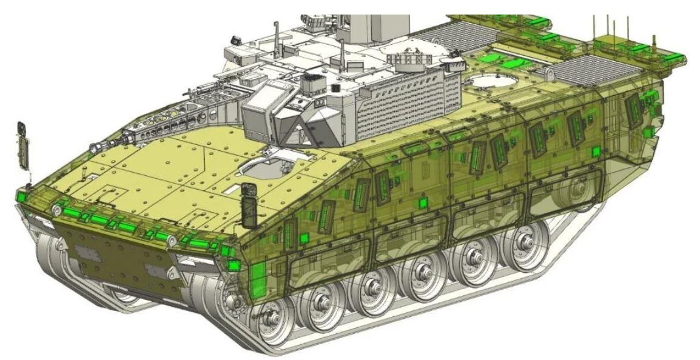
*7.10. ábra. Lynx KF41 gyalogsági harcjármű*

A Lynx páncélozott gyalogsági harcjármű elsőként az MH Kinizsi Pál 30. Páncélozott Gyalogdandárnál jelent meg. A Lynx személyzete a harcjárművezető, az irányzó és a harcjármű-parancsnok. A harcjármű kezelőszemélyzete három fő, ezen kívül nyolc lövészkatona (és fegyverzetük) befogadására képes a deszant-térben. A szállított lövészek a robbanások hatásainak csökkenését biztosító függesztett ülésekben foglal helyet. Harcbavetésük a hátsó, lenyitható rámpán keresztül történik. A deszant-tér felett két búvónyílás is található. A harc során a harcjármű-parancsnok bármikor képes átvenni az irányzó teljes feladatát, vagy célt jelölhet ki a számára. Ez a fejlett tűzvezető rendszernek köszönhető és hunter-killer, illetve killer-killer képességnek nevezi a szakirodalom. Mivel a harcjármű parancsnoka és az irányzó külön-külön is képes a fő fegyverzet irányzására, ezzel érvényesül a hunter-killer képesség. Az irányított fegyverállvány vezérlését azonban csak a parancsnok végezheti, ezt a feladatot az irányzó nem veheti át. Ez a fegyverrendszer teljesen önállóan végzi feladatát a parancsnok irányítása alatt - ezzel érvényesül a killer-killer képesség. Ez olyan esetben hasznos, amikor az irányzó tüzet vezet egy célra, majd a parancsnok észrevesz egy, a járműre veszélyt jelentő célpontot, amelyet a távirányított fegyverrel, az irányzó feladatvégrehajtásának zavarása, megszakítása nélkül le tud fogni.

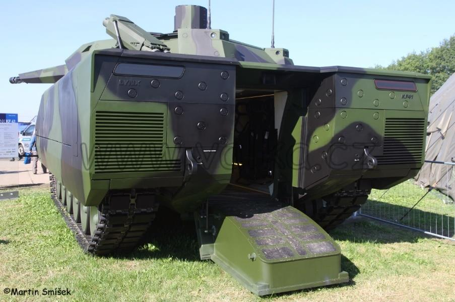
*7.11. ábra. Lynx KF41 gyalogsági harcjármű*

A Lynx harcjárművet a zalaegerszegi Rheinmetall-üzemben kezdték el gyártani 2024-ben: a honvédség összesen 218 darabot rendelt, ebből 172-öt a zalaegerszegi gyárban készítenek majd el, a maradék 46 eszközt pedig Németországból szállítják hazánkba. Több Lynx harcjárműre irányuló fejlesztési program is zajlik. Jelenleg fejlesztés alatt áll a Lynx gyalogsági harcjármű 50 mm-es gépágyúval felszerelendő típusváltozata, amelynek fejlesztése részben már Zalaegerszegen történik majd, ahol egy, a harcjárművek tesztelésére is alkalmas próbapálya épült. Bejelentésre került egy 120 mm-es harckocsiágyúval felszerelt Lynx variáns, a Lynx 120 fejlesztése is, amely lényegében egy kompakt harckocsinak is nevezhető, illetve a Lynx önjáró aknavető típusváltozat jövőbeni fejlesztésének szándéka is. Jelenleg a zalaegerszegi Lynx gyár a Rheinmetall legkorszerűbb harcjárműgyára – amely korszerűségét tekintve világviszonylatú összevetésben is megállja a helyét. A Lynx gyalogsági harcjárműgyár gyártóberendezéseit olyan módon alakították ki 70 tonnás terhelhetőségig, hogy az a jövőben elméletileg alkalmas lehet az új generációjú német harckocsi, a KF-51 Panther gyártására is.

## 7.5 A GIDRÁN 4×4 NÖVELT AKNAVÉDELEMMEL ELLÁTOTT VÉDETT JÁRMŰ

A Magyar Honvédség kerekes, páncélozott szállító harcjárműveinek védelmi képessége elmarad a korszerű járművektől. Ezeket a képességeket és műszaki követelményeket már több publikáció is kifejtette.128129 A Magyar Honvédség újgenerációs Ejder Yalcin 4×4 kerékképletű, növelt aknavédelemmel ellátott harcjárművét 2012-ben tervezte meg a Nurol Makina török gyártó. Az Ejder Yalcin sorozatgyártása 2015-ben kezdődhetett meg. A jármű alapváltozata páncélozott csapatszállítónak készült. A páncélozott járművek első példányai már Gidrán néven 2021 februárjában kerültek a Magyar Honvédség állományába.130

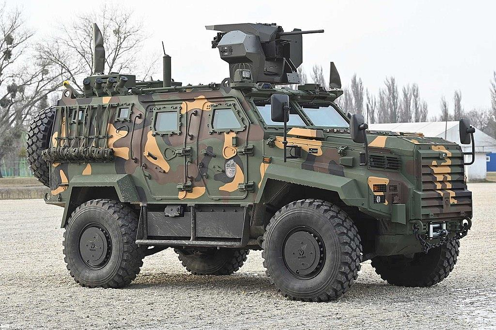
*7.12. ábra. A Magyar Honvédség növelt aknavédelemmel ellátott Gidrán harcjárműve, ASELSAN SARP fegyverplatformmal*

Teljes mennyiségük mintegy 350 db jármű lesz. A jármű szerkezeti tömege 14 000 kg, maximális teherbírása 4000 kg.131 Változatai képessé teszik specifikus feladatok végrehajtására: felderítés, sebesültszállítás, tűztámogatás biztosítása stb. A jármű maximális sebessége 120 km/óra, hatótávolsága 700 km. Alapértelmezetten hatsebességes automata sebességváltóval, szervokormánnyal és ABS-rendszerrel kerül felszerelésre. A turbó dízelmotor 375 LE teljesítményű. A járművet RUN-FLAT gumiabroncsokkal, és emellett központi abroncsfújó rendszerrel is felszerelték. A Gidrán páncélzata STANAG Level 3 szintű védelmet nyújt: a 7,62 mm-es páncéltörő lövedékek ellen minden irányból védett, illetve ellenáll a 10 kg tömegű aknák kerekek alatti robbanásának is, a jármű V-alakú haspáncéllal rendelkezik. A jármű belső tere lebegőpadlós kialakítású, amely aknára futás esetén a járműre ható, a személyzetre káros lökéshullámok elnyelésére szolgál, az ugyancsak ebből a célból beszerelt robbanásbiztos bekötésű ülésekkel együtt. A jármű automatikus tűzoltó és tűzelfojtó rendszerrel is rendelkezik. A motortér a jármű elején helyezkedik el. A járműben a járművezető bal oldalon elöl ül, a járműparancsnok mellette jobb oldalon, mögöttük pedig további három fő, külön ülésekben, menetirányban ülve. A jármű hátuljában lehetőség van további négy fő szállítására, két-két üléssel – a jármű jobb és bal oldalán – egymás felé néző ülésekben.

A jármű az Aselsan által gyártott SARP fegyverplatformmal került felszerelésre. A tetőpáncélon elhelyezkedő fegyverplatformra felszerelhető 40 milliméteres automata gránátvető, 12,7 milliméteres nehézgéppuska vagy 7,62 milliméteres géppuska. A járműre felszerelésre került az Aselsan vállalat által gyártott ATS-60 elektro-optikai szenzor- és lövésérzékelő rendszer. A SEDA lövésérzékelő rendszer (egyben akusztikus alapú céldetektáló rendszer) össze van kapcsolva a jármű tetejére szerelt SARP fegyverplatformmal. A jármű külső részére körkörösen felszerelt kamerák a járművet körülvevő tér figyelését teszik lehetővé, nemcsak nappali, hanem éjszakai fényviszonyok mellett is. A járművezető, a parancsnok, valamint a toronylövész számára a feladattól függően külön nappali, illetve éjszakai optikai eszközök is beszerelhetők. A Gidrán harcjármű tüzérbemérő, kidolgozó és felderítő felépítményű, illetve 120 mm-es aknavetővel felszerelt változata is tervezetten rendszeresítésre kerül.

## 7.6 A POLARIS MRZR 4 KÜLÖNLEGES MŰVELETI KÖNNYŰ JÁRMŰ

A Magyar Honvédség különleges műveleti erői számára 2016-ban került beszerzésre 12 darab MRZR 4 ultrakönnyű harcászati terepjáró. A járműcsaládot 2007–2008-as években fejlesztette ki az amerikai Polaris Industries. A 2 és 4 üléses változatú MRZR járművek, feladataikat tekintve széles körben alkalmazhatók. Élőerő szállításán kívül alkalmasak felderítésre, sebesültszállításra, határvédelemre. A járműre szerelt fegyverekkel alkalmazható harctámogató szerepkörre is.

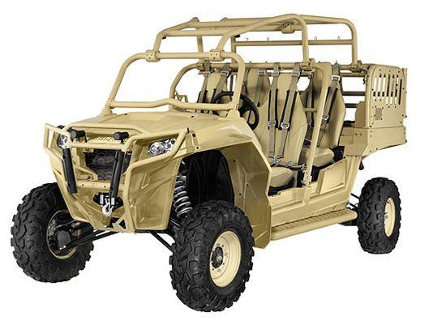
*7.13. ábra. MRZR 4 ultrakönnyű taktikai jármű*

A 867 kg tömegű jármű 4 fő – a nagyobb változatnál opcionális hátrafordított ülésekkel 6 fő – szállítására alkalmas. Hasznos terhelése 680 kg. Hatótávolsága 250 km. Motorja 4 ütemű benzin üzemű, elektronikus üzemanyag-befecskendezéses, vízhűtéses, 75 kW (100 LE) teljesítményű. Maximális sebessége 96 km/h. A sebességváltó fokozatmentes CVT rendszerű, a hajtáslánc 4×4 kerékképletű. Az MRZR 4-es légiszállításra is alkalmas, az Airbus H225M közepes szállítóhelikopterekkel külső teherként is szállítható. A MRZR járművekhez utánfutó csatlakoztatható, amely alkalmazásával tovább nő a hasznos teher, valamint a szállítható személyek száma.

## 7.7 A CARL–GUSTAV M4 HÁTRASIKLÁS NÉLKÜLI FEGYVER

A Carl–Gustav hátrasiklás nélküli fegyvert elsősorban a Magyar Honvédség páncéltörő képességének fejlesztése érdekében rendszeresítették.132 A Carl–Gustaf M4 típusú, vállról indítható, többcélú, hátrasiklás nélküli (HSN) támogató fegyver egy 84 milliméter űrméretű páncéltörő fegyver, amely huzagolt fegyvercsővel készült. A fegyver 400–700 méterről képes hatékonyan megsemmisíteni páncélozott célpontokat, 400–500 mm homogén acélpáncélnak megfelelő páncélzatot képes átütni. Az M4 tömege (vörös pontos irányzékkal) 7,6 kg, a csőhossza 999 mm.

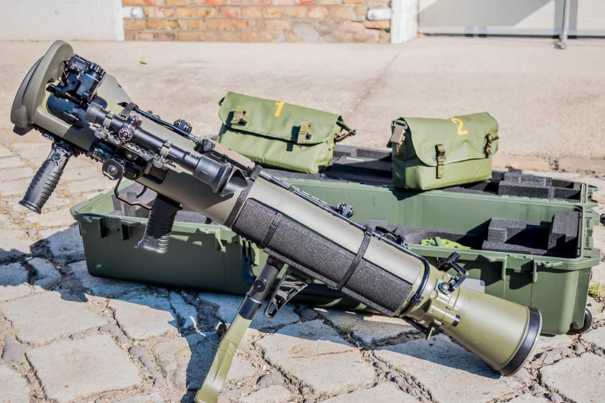
*7.14. ábra. Carl–Gustav M4 hátrasiklás nélküli fegyver*

A fegyver tömegének csökkentése érdekében szénszálas, kompozit védőburkolatba beragasztott 84 mm-es űrméretű, vékony falú, huzagolt, titán béléscsőből és a csővégre kapcsolt, kihajtható áramlástechnikai gépelemből, azaz Laval-fúvókás csőtoldatból álló vetőcsövet alkottak. Az alkatrészek gyártásához műanyagokat és alumíniumot használtak fel. A Carl–Gustaf M4 taktikai rugalmasságot biztosít az alkalmazható sokféle lőszertípus révén.

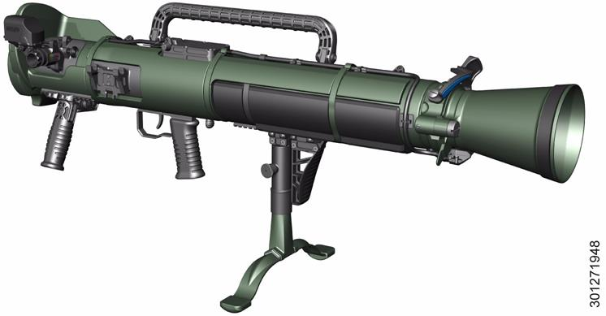
*7.15. ábra. Carl–Gustav M4 hátrasiklás nélküli fegyver*

Az eszköz elődeihez képest gyorsabban tölthető, így a lövésszám elérheti a 6 lövés/perc értéket. A rendszernek kétféle alapirányzéka a nyílt irányzék (különböző távolságú skálák a hátsó nyitott látómezőn), illetve a vörös pont irányzék. A fegyver 3×-os nagyítású monokuláris, passzív éjjellátó előtéttel felszerelhető optikai irányzékkal rendelkezik, amelynek látószöge 17°-os.

## 7.8 A HAZAI GYÁRTÁSÚ CZ KÉZIFEGYVERCSALÁD

### 7.8.1 A CZ BREN 2 gépkarabély

A Magyar Honvédségnél rendszeresített CZ BREN 2 gépkarabély a lövészkatona alapfegyverzete. A CZ BREN 2 gépkarabély egy moduláris felépítésű, egyes, és sorozatlövés leadására is alkalmas kézi lőfegyver. A gépkarabély több különböző kaliberű lőszer kilövésére is alkalmassá tehető, gázelvételes, rövid gázdugattyú hátrasiklásos, automata rendszerű fegyver. Rendeltetése szerint az ellenség élőerejének, illetve páncélozatlan földi és légi céljainak célzott lövéssel történő leküzdésére szolgál. A korszerű szerkezeti anyagokból gyártott fegyver felső része alumíniumból, a tok pedig speciális műanyagból készült.

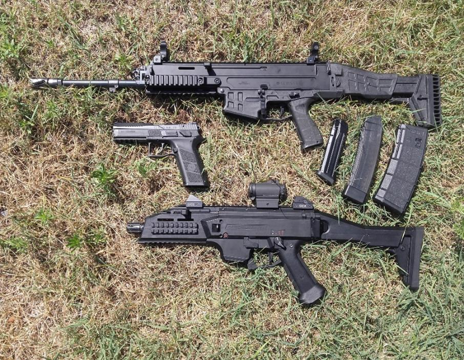
*7.16. ábra. A CZ BREN 2 gépkarabély és a 9×19 mm-es lőszert tüzelő CZ P09 pisztoly, továbbá a CZ Scorpio Evo 3 A1 géppisztoly*

A fegyver szerkezeti tömege a korszerű felhasznált anyagok következtében kedvezően csekély. A tömeg a csőhossztól függően (207, 280 és 357 mm) 2,86–3,25 kg között változik. A CZ BREN 2 gépkarabélyokat különböző csőhosszal (8", 9", 11" és 14") rendszeresítették, ugyanakkor több különböző kaliberű lőszer kilövésére is tervezték. A fegyver az 5,56×45 mm-es NATO, a 7,62×51 mm-es NATO és az orosz 7,62×39 mm-es lőszerhez is alkalmazható. A fegyvert – az ergonomikus kialakítás érdekében – állítható, teleszkópos válltámasszal és átszerelhető markolattal szerelték fel. A gázhengerbe beáramló gázmennyiség háromállású gázátömlővel vezérelhető. Az első állás a normál körülmények között üzemeltetett fegyverhez szükséges gázmennyiséget biztosítja. A második, növelt gázátömlő-keresztmetszet a nem optimális körülmények közötti lövéshez alkalmazható (pl. fagyban, poros, sáros körülmények között). Ebben az állásban a gázáram nagyobb energiájú, biztosítva ezáltal, hogy a gázdugattyú megfelelően működjön a nehezítő tényezők ellenére is. A harmadik, zárt állás esetén a fegyver ismétlő rendszerű. A gépkarabély mind a három csőhossz-típusának tárkapacitása 30 db lőszer.

### 7.8.2 A 9×19 mm CZ P09 pisztoly

A Magyar Honvédség által 2018-ban rendszeresített 9×19 mm CZ P09 pisztoly űrmérete 9 mm. A Česka Zbrojovka által kifejlesztett pisztoly félautomata, azaz öntöltő rendszerű. A fegyver reteszelt tömegzáras, rövid csőhátrasiklásos rendszerű. Az elsütési rendszere kakasos, mindemellett ún. „SA/DA" (single action, double action) rendszerű, amely azt jelenti, hogy a feszített kakasos üzemmód mellett revolverező lövés kiváltására is alkalmas. A 19 db 9×19 mm-es Parabellum lőszer befogadására kialakított tárak kialakítását úgy oldották meg, hogy a kezelőnek lehetősége nyíljon a tárban lévő lőszerek mennyiségét vizuálisan ellenőrizni. A pisztoly huzagolása jobb irányú, a csőtorkolat standard, normál kialakítású. A CZ P09 pisztolyt a STANAG 4694 vagy MIL-STD-1913 szabványok szerinti szereléksínnel látták el. Ezen felületek kialakítása lehetővé teszi a felhasználó számára, hogy taktikai eszközök, lézeres célmegjelölő felszerelést és taktikai lámpákat helyezzenek fel a fegyver felületére, amelyek elősegítik a pontos lövés leadását különböző látási viszonyok között is.

### 7.8.3 A CZ Scorpio Evo 3 A1 géppisztoly

A CZ Scorpio Evo 3 A1 géppisztoly rendeltetése szerint az élőerő ellen rövid távolságokon (200 m-ig) a rajtaütés és a védelem, valamint a közelharc eszköze. Zárolás szempontjából a fegyver reteszeletlen, vagy tömeggel reteszelt, működés szempontjából szabad tömegzáras rendszerű, amely a legegyszerűbb, egyúttal a viszonylag kis teljesítményű lőszer (9x19) miatt elégséges megoldás. A fegyver felhúzókarja mindkét oldalra szerelhető. A fegyver tűzváltó karja négy állással rendelkezik, egyeslövés, hármastűz csapás, sorozatlövés, illetve biztosított állás. Irányzéka mechanikus, MIL-STD-1913 szabványú sínre szerelhető, diopteres, nyílt irányzék. Az átbillenthető nézőke négy állású. A tár jellegét tekintve egyenes, kétsoros szekrénytár. A tár áttetsző anyagból készül, a lőszerek mennyisége vizuálisan kontrollálható. A válltámasz 180°-ban jobb oldalra behajtható, hossza három fix pozícióban állítható.

---

## Felhasznált és ajánlott irodalom

- Gávay György - Gyarmati, József: Napjainkban alkalmazott kerekes harcjárművek és fejlesztésük az elmúlt évtizedekben I. rész: A kerekes harcjárművek és a szovjet/orosz BTR járművek korszerűsítése Haditechnika 53 : 6 pp. 28-34. , 7 p. (2019)
- Gávay György: Kerekes harcjárművek védettségének vizsgálata és összehasonlító elemzése az elmúlt évtizedek katonai tapasztalatainak és követelményeinek felhasználásával. In: Pohl, Árpád (szerk.) Biztonság és honvédelem : Fenntartható biztonság és társadalmi környezet tanulmányok 2 Budapest, Magyarország : Ludovika Egyetemi Kiadó (2020) 2,114 p. pp. 533-552., 20 p.
- Gyarmati József - Hegedűs, Ernő - Gávay, György: Automata sebességváltóban alkalmazott kapcsolt bolygóművek – Wilson-váltó. Műszaki Katonai Közlöny 32 : 3 pp. 113-126., 14 p. (2022)
- Hegedűs Ernő - Druzsin József: A Magyar Honvédség szárazföldi és légi haderőnemeinek a Honvédelmi és Haderőfejlesztési Program keretében beszerzett jelentősebb haditechnikai eszközei c. melléklet: 6. fejezet: 8. melléklet. In.: Krizbai, János (szerk.) ; Hausner, Gábor (szerk.) ; Czövek, János ; Druzsin, József ; Ecsedi, László ; Elek, József ; Farkas, Ádám ; Fischl, Vilmos ; Hegedűs, Ernő ; Himmer, Péter et al.: Fiatal tisztek zsebkönyve. Budapest, Magyarország : Ludovika Egyetemi Kiadó (2022) , 322 p. ISBN: 9789635318223 NKE Közszolgálati Tudásportál
- Kurcz Kristóf - Simó Réka - Sebők István - Hegedűs Ernő: Új fegyveripari cégekkel bővült a magyar hadiipar. Haditechnika 54 : 3 pp. 51-53. , 3 p. (2020)
- Kurcz Kristóf - Vég Róbert - Hegedűs Ernő: A Leopard 2 harckocsicsalád és a Magyar Honvédség 2A4 és 2A7+ típusváltozatai I-II. rész Haditechnika 54 : 6 pp. 19-21. , 3 p. (2020)
- Ocskay István - Vágner Szabolcs: Gidrán – egy növelt aknavédelemmel rendelkező harcjármű megjelenése a Magyar Honvédségben 1-2. rész. Haditechnika 55 évf. 3-4. sz. (2021)
- Ocskay István: A Lynx harcjárműcsalád fejlesztése, technikai leírása és jövője 1-3. rész. Haditechnika 55 évf. 1-2 sz. (2021)
- Szirota Anita - Molnár Péter - Sebők István - Hegedűs Ernő: The 84 mm recoilless support weapon system in the armament arsenal of the Hungarian Defence Forces Haditechnika 54 : 2 pp. 2-7. , 6 p. (2020)
- Vég Róbert László - Sebők István - Havrilla Ferenc: A Gidrán növelt páncélvédettségű harcjármű fegyverzete Haditechnika 56 : 5 pp. 39-44. , 6 p. (2022)
- Végvári Zsolt: A korszerű harcjárművek áramellátásának sajátosságai 1-2. rész – Haditechnika 56. évf. (2022) 2. szám 24-28. o. ill. 3. szám 21-25. o. (ISSN 0230-6891)
- Végvári, Zsolt: A harckocsik védelmének fejlődése a páncélelhárítás fejlődésének tükrében és az aktív védelmi rendszerek (APS) megjelenése I-II. rész Haditechnika 52 : 4 pp. 35-38. , 4 p. (2018)
- Tóth András: A magyar Leopárdok: Leopard 2A7HU Haditechnika, 2023. évi 3. sz.

---

**Lábjegyzetek:**

121 Hegedűs, Ernő - Druzsin, József: A Magyar Honvédség szárazföldi és légi haderőnemeinek a Honvédelmi és Haderőfejlesztési Program keretében beszerzett jelentősebb haditechnikai eszközei c. melléklet: 6. fejezet: 8. melléklet. In.: Krizbai, János (szerk.) ; Hausner, Gábor (szerk.) ; Czövek, János; Druzsin, József ; Ecsedi, László ; Elek, József ; Farkas, Ádám ; Fischl, Vilmos ; Hegedűs, Ernő ; Himmer, Péter et al.: Fiatal tisztek zsebkönyve. Budapest, Magyarország : Ludovika Egyetemi Kiadó (2022) , 322 p. ISBN: 9789635318223 NKE Közszolgálati Tudásportál

122 Végvári Zsolt: A korszerű harcjárművek áramellátásának sajátosságai 1-2. rész – Haditechnika 56. évf. (2022) 2. szám 24-28. o. ill. 3. szám 21-25. o. (ISSN 0230-6891)

123 Kurcz Kristóf - Simó, Réka - Sebők, István - Hegedűs Ernő: Új fegyveripari cégekkel bővült a magyar hadiipar. Haditechnika 54 : 3 pp. 51-53. , 3 p. (2020)

124 Kurcz Kristóf - Vég Róbert - Hegedűs Ernő: A Leopard 2 harckocsicsalád és a Magyar Honvédség 2A4 és 2A7+ típusváltozatai I-II. rész Haditechnika 54 : 6 pp. 19-21. , 3 p. (2020)

125 Gyarmati, József - Hegedűs, Ernő - Gávay, György: Automata sebességváltóban alkalmazott kapcsolt bolygóművek – Wilson-váltó. Műszaki Katonai Közlöny 32 : 3 pp. 113-126., 14 p. (2022)

126 (lábjegyzet később)

127 (lábjegyzet később)

128 Gávay, György ; Gyarmati, József: Napjainkban alkalmazott kerekes harcjárművek és fejlesztésük az elmúlt évtizedekben I. rész: A kerekes harcjárművek és a szovjet/orosz BTR járművek korszerűsítése HADITECHNIKA 53 : 6 pp. 28-34. , 7 p. (2019)

129 Gávay György: Kerekes harcjárművek védettségének vizsgálata és összehasonlító elemzése az elmúlt évtizedek katonai tapasztalatainak és követelményeinek felhasználásával In: Pohl, Árpád (szerk.) Biztonság és honvédelem : Fenntartható biztonság és társadalmi környezet tanulmányok 2 Budapest, Magyarország : Ludovika Egyetemi Kiadó (2020) 2,114 p. pp. 533-552. , 20 p.

130 Vég, Róbert László - Sebők, István - Havrilla, Ferenc: A Gidrán növelt páncélvédettségű harcjármű fegyverzete HADITECHNIKA 56 : 5 pp. 39-44. , 6 p. (2022)

131 Ocskay István - Vágner Szabolcs: Gidrán – egy növelt aknavédelemmel rendelkező harcjármű megjelenése a Magyar Honvédségben 1-2. rész. Haditechnika 55 évf. 3-4. sz. (2021)

132 Szirota Anita - Molnár Péter - Sebők István - Hegedűs Ernő: The 84 mm recoilless support weapon system in the armament arsenal of the Hungarian Defence Forces Haditechnika 54 : 2 pp. 2-7. , 6 p. (2020)
